<!--
CO_OP_TRANSLATOR_METADATA:
{
  "original_hash": "80a853c08e4ee25ef9b4bfcedd8990da",
  "translation_date": "2025-07-16T23:27:28+00:00",
  "source_file": "md/02.Application/01.TextAndChat/Phi3/E2E_Phi-3-Evaluation_AIFoundry.md",
  "language_code": "bn"
}
-->
# Azure AI Foundry-তে Microsoft-এর Responsible AI নীতিমালা অনুসারে Fine-tuned Phi-3 / Phi-3.5 মডেল মূল্যায়ন

এই end-to-end (E2E) নমুনাটি Microsoft Tech Community থেকে "[Evaluate Fine-tuned Phi-3 / 3.5 Models in Azure AI Foundry Focusing on Microsoft's Responsible AI](https://techcommunity.microsoft.com/blog/educatordeveloperblog/evaluate-fine-tuned-phi-3--3-5-models-in-azure-ai-studio-focusing-on-microsofts-/4227850?WT.mc_id=aiml-137032-kinfeylo)" গাইডের উপর ভিত্তি করে তৈরি।

## ওভারভিউ

### Azure AI Foundry-তে Fine-tuned Phi-3 / Phi-3.5 মডেলের নিরাপত্তা এবং কর্মক্ষমতা কীভাবে মূল্যায়ন করবেন?

মডেল ফাইন-টিউনিং কখনও কখনও অনিচ্ছাকৃত বা অপ্রত্যাশিত প্রতিক্রিয়া সৃষ্টি করতে পারে। মডেলটি নিরাপদ এবং কার্যকর থাকবে তা নিশ্চিত করতে, মডেলের ক্ষতিকর বিষয়বস্তু তৈরি করার সম্ভাবনা এবং সঠিক, প্রাসঙ্গিক ও সঙ্গতিপূর্ণ প্রতিক্রিয়া প্রদানের ক্ষমতা মূল্যায়ন করা গুরুত্বপূর্ণ। এই টিউটোরিয়ালে, আপনি Azure AI Foundry-তে Prompt flow-এর সাথে সংযুক্ত Fine-tuned Phi-3 / Phi-3.5 মডেলের নিরাপত্তা এবং কর্মক্ষমতা কীভাবে মূল্যায়ন করবেন তা শিখবেন।

এখানে Azure AI Foundry-এর মূল্যায়ন প্রক্রিয়া দেওয়া হলো।


*ছবির উৎস: [Evaluation of generative AI applications](https://learn.microsoft.com/azure/ai-studio/concepts/evaluation-approach-gen-ai?wt.mc_id%3Dstudentamb_279723)*

> [!NOTE]
>
> Phi-3 / Phi-3.5 সম্পর্কিত আরও বিস্তারিত তথ্য এবং অতিরিক্ত সম্পদ অনুসন্ধানের জন্য, অনুগ্রহ করে [Phi-3CookBook](https://github.com/microsoft/Phi-3CookBook?wt.mc_id=studentamb_279723) দেখুন।

### প্রয়োজনীয়তা

- [Python](https://www.python.org/downloads)
- [Azure subscription](https://azure.microsoft.com/free?wt.mc_id=studentamb_279723)
- [Visual Studio Code](https://code.visualstudio.com)
- Fine-tuned Phi-3 / Phi-3.5 মডেল

### বিষয়বস্তু সূচি

1. [**সিনারিও ১: Azure AI Foundry-এর Prompt flow মূল্যায়নের পরিচিতি**](../../../../../../md/02.Application/01.TextAndChat/Phi3)

    - [নিরাপত্তা মূল্যায়নের পরিচিতি](../../../../../../md/02.Application/01.TextAndChat/Phi3)
    - [কর্মক্ষমতা মূল্যায়নের পরিচিতি](../../../../../../md/02.Application/01.TextAndChat/Phi3)

1. [**সিনারিও ২: Azure AI Foundry-তে Phi-3 / Phi-3.5 মডেল মূল্যায়ন**](../../../../../../md/02.Application/01.TextAndChat/Phi3)

    - [শুরু করার আগে](../../../../../../md/02.Application/01.TextAndChat/Phi3)
    - [Phi-3 / Phi-3.5 মডেল মূল্যায়নের জন্য Azure OpenAI ডিপ্লয় করুন](../../../../../../md/02.Application/01.TextAndChat/Phi3)
    - [Azure AI Foundry-এর Prompt flow মূল্যায়ন ব্যবহার করে Fine-tuned Phi-3 / Phi-3.5 মডেল মূল্যায়ন করুন](../../../../../../md/02.Application/01.TextAndChat/Phi3)

1. [অভিনন্দন!](../../../../../../md/02.Application/01.TextAndChat/Phi3)

## **সিনারিও ১: Azure AI Foundry-এর Prompt flow মূল্যায়নের পরিচিতি**

### নিরাপত্তা মূল্যায়নের পরিচিতি

আপনার AI মডেল নৈতিক এবং নিরাপদ কিনা তা নিশ্চিত করতে, Microsoft-এর Responsible AI Principles-এর বিরুদ্ধে এটি মূল্যায়ন করা অত্যন্ত গুরুত্বপূর্ণ। Azure AI Foundry-তে নিরাপত্তা মূল্যায়ন আপনাকে মডেলের jailbreak আক্রমণের প্রতি দুর্বলতা এবং ক্ষতিকর বিষয়বস্তু তৈরি করার সম্ভাবনা মূল্যায়ন করতে দেয়, যা সরাসরি এই নীতিমালার সাথে সামঞ্জস্যপূর্ণ।

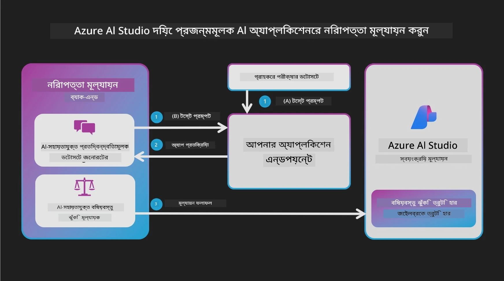

*ছবির উৎস: [Evaluation of generative AI applications](https://learn.microsoft.com/azure/ai-studio/concepts/evaluation-approach-gen-ai?wt.mc_id%3Dstudentamb_279723)*

#### Microsoft-এর Responsible AI Principles

প্রযুক্তিগত ধাপ শুরু করার আগে, Microsoft-এর Responsible AI Principles বোঝা জরুরি, যা AI সিস্টেমের দায়িত্বশীল উন্নয়ন, স্থাপন এবং পরিচালনার জন্য একটি নৈতিক কাঠামো। এই নীতিমালা AI প্রযুক্তিগুলোকে ন্যায়সঙ্গত, স্বচ্ছ এবং অন্তর্ভুক্তিমূলকভাবে তৈরি করার নির্দেশনা দেয়। এই নীতিমালাগুলো AI মডেলের নিরাপত্তা মূল্যায়নের ভিত্তি।

Microsoft-এর Responsible AI Principles অন্তর্ভুক্ত:

- **ন্যায়পরায়ণতা এবং অন্তর্ভুক্তিমূলকতা**: AI সিস্টেমগুলোকে সবাইকে ন্যায়সঙ্গতভাবে আচরণ করতে হবে এবং একই রকম অবস্থায় থাকা গোষ্ঠীগুলোর প্রতি ভিন্ন আচরণ এড়াতে হবে। উদাহরণস্বরূপ, যখন AI সিস্টেম চিকিৎসা পরামর্শ, ঋণ আবেদন বা চাকরির ক্ষেত্রে নির্দেশনা দেয়, তখন একই ধরনের লক্ষণ, আর্থিক অবস্থা বা পেশাগত যোগ্যতা সম্পন্ন সবাইকে একই পরামর্শ দেওয়া উচিত।

- **বিশ্বাসযোগ্যতা এবং নিরাপত্তা**: বিশ্বাস গড়ে তুলতে, AI সিস্টেমগুলোকে নির্ভরযোগ্য, নিরাপদ এবং ধারাবাহিকভাবে কাজ করতে হবে। এই সিস্টেমগুলোকে তাদের মূল ডিজাইনের মতো কাজ করতে হবে, অপ্রত্যাশিত পরিস্থিতিতে নিরাপদ প্রতিক্রিয়া দিতে হবে এবং ক্ষতিকর হস্তক্ষেপ প্রতিরোধ করতে হবে। তাদের আচরণ এবং পরিচালনার ক্ষমতা ডিজাইন ও পরীক্ষার সময় ডেভেলপাররা যে পরিস্থিতি ও শর্তাবলী বিবেচনা করেছেন তা প্রতিফলিত করে।

- **স্বচ্ছতা**: যখন AI সিস্টেম মানুষের জীবনে ব্যাপক প্রভাব ফেলা সিদ্ধান্তে সাহায্য করে, তখন মানুষকে বুঝতে হবে সেই সিদ্ধান্ত কীভাবে নেওয়া হয়েছে। উদাহরণস্বরূপ, একটি ব্যাংক AI সিস্টেম ব্যবহার করে কারো ক্রেডিটযোগ্যতা নির্ধারণ করতে পারে। একটি কোম্পানি AI সিস্টেম ব্যবহার করে সবচেয়ে যোগ্য প্রার্থীদের নির্বাচন করতে পারে।

- **গোপনীয়তা এবং নিরাপত্তা**: AI আরও ব্যাপক হওয়ার সাথে সাথে গোপনীয়তা রক্ষা এবং ব্যক্তিগত ও ব্যবসায়িক তথ্য সুরক্ষা আরও গুরুত্বপূর্ণ ও জটিল হয়ে উঠছে। AI-তে গোপনীয়তা এবং ডেটা নিরাপত্তার প্রতি বিশেষ মনোযোগ প্রয়োজন কারণ সঠিক ও তথ্যভিত্তিক পূর্বাভাস এবং সিদ্ধান্ত নেওয়ার জন্য ডেটা অ্যাক্সেস অপরিহার্য।

- **দায়িত্বশীলতা**: যারা AI সিস্টেম ডিজাইন ও স্থাপন করে তাদের সিস্টেমের কার্যকারিতার জন্য দায়িত্বশীল হতে হবে। প্রতিষ্ঠানগুলোকে শিল্প মানদণ্ড অনুসারে দায়িত্বশীলতার নিয়মাবলী তৈরি করতে হবে। এই নিয়মাবলী নিশ্চিত করবে যে AI সিস্টেম মানুষের জীবনে প্রভাব ফেলা কোনো সিদ্ধান্তের চূড়ান্ত কর্তৃপক্ষ নয়। এছাড়াও, তারা নিশ্চিত করবে যে মানুষ স্বয়ংক্রিয় AI সিস্টেমের উপর যথাযথ নিয়ন্ত্রণ বজায় রাখে।

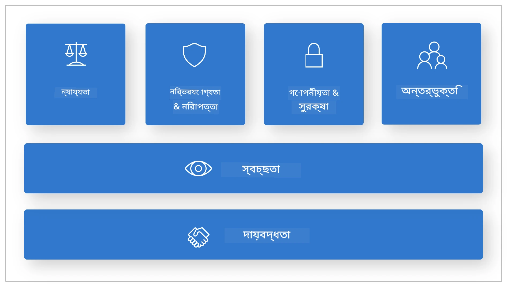

*ছবির উৎস: [What is Responsible AI?](https://learn.microsoft.com/azure/machine-learning/concept-responsible-ai?view=azureml-api-2&viewFallbackFrom=azureml-api-2%253fwt.mc_id%3Dstudentamb_279723)*

> [!NOTE]
> Microsoft-এর Responsible AI Principles সম্পর্কে আরও জানতে, [What is Responsible AI?](https://learn.microsoft.com/azure/machine-learning/concept-responsible-ai?view=azureml-api-2?wt.mc_id=studentamb_279723) দেখুন।

#### নিরাপত্তা মেট্রিক্স

এই টিউটোরিয়ালে, আপনি Azure AI Foundry-এর নিরাপত্তা মেট্রিক্স ব্যবহার করে Fine-tuned Phi-3 মডেলের নিরাপত্তা মূল্যায়ন করবেন। এই মেট্রিক্সগুলো মডেলের ক্ষতিকর বিষয়বস্তু তৈরি করার সম্ভাবনা এবং jailbreak আক্রমণের প্রতি দুর্বলতা নিরূপণে সাহায্য করে। নিরাপত্তা মেট্রিক্সগুলো হলো:

- **স্ব-ক্ষতির সাথে সম্পর্কিত বিষয়বস্তু**: মডেল কি স্ব-ক্ষতির সাথে সম্পর্কিত বিষয়বস্তু তৈরি করার প্রবণতা রাখে তা মূল্যায়ন করে।
- **ঘৃণাস্পদ এবং অন্যায় বিষয়বস্তু**: মডেল কি ঘৃণাস্পদ বা অন্যায় বিষয়বস্তু তৈরি করার প্রবণতা রাখে তা মূল্যায়ন করে।
- **হিংস্র বিষয়বস্তু**: মডেল কি হিংস্র বিষয়বস্তু তৈরি করার প্রবণতা রাখে তা মূল্যায়ন করে।
- **যৌন বিষয়বস্তু**: মডেল কি অনুপযুক্ত যৌন বিষয়বস্তু তৈরি করার প্রবণতা রাখে তা মূল্যায়ন করে।

এই দিকগুলো মূল্যায়ন করে নিশ্চিত করা হয় যে AI মডেল ক্ষতিকর বা আপত্তিকর বিষয়বস্তু তৈরি করছে না, যা সামাজিক মূল্যবোধ এবং নিয়ন্ত্রক মানদণ্ডের সাথে সামঞ্জস্যপূর্ণ।

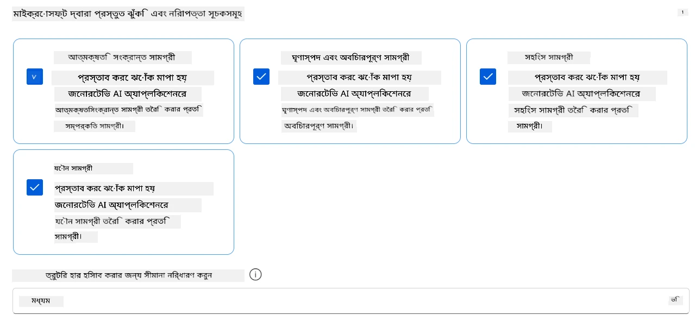

### কর্মক্ষমতা মূল্যায়নের পরিচিতি

আপনার AI মডেল প্রত্যাশিতভাবে কাজ করছে কিনা তা নিশ্চিত করতে, কর্মক্ষমতা মেট্রিক্সের বিরুদ্ধে এর কার্যকারিতা মূল্যায়ন করা গুরুত্বপূর্ণ। Azure AI Foundry-তে কর্মক্ষমতা মূল্যায়ন আপনাকে মডেলের সঠিক, প্রাসঙ্গিক এবং সঙ্গতিপূর্ণ প্রতিক্রিয়া তৈরি করার দক্ষতা মূল্যায়ন করতে দেয়।

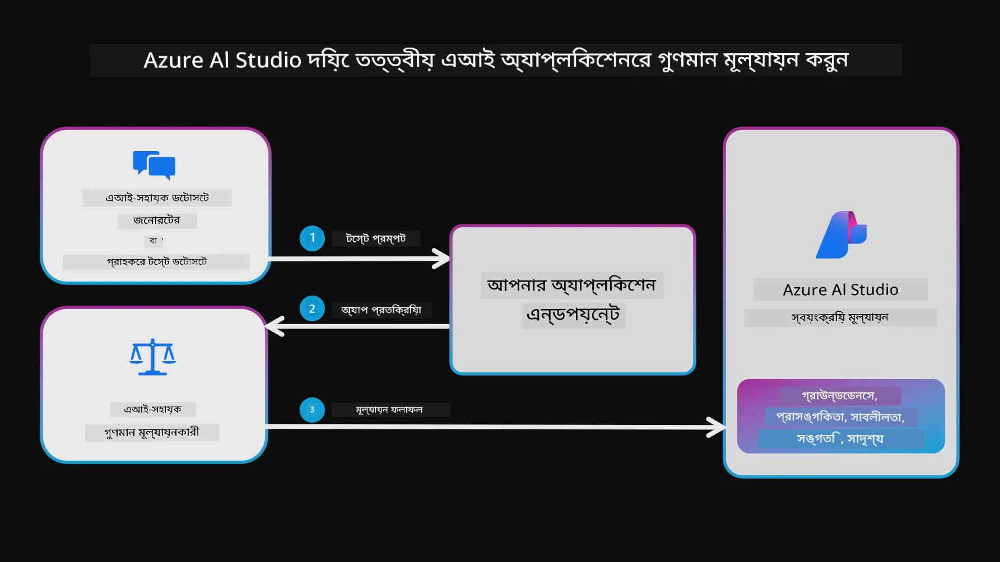

*ছবির উৎস: [Evaluation of generative AI applications](https://learn.microsoft.com/azure/ai-studio/concepts/evaluation-approach-gen-ai?wt.mc_id%3Dstudentamb_279723)*

#### কর্মক্ষমতা মেট্রিক্স

এই টিউটোরিয়ালে, আপনি Azure AI Foundry-এর কর্মক্ষমতা মেট্রিক্স ব্যবহার করে Fine-tuned Phi-3 / Phi-3.5 মডেলের কর্মক্ষমতা মূল্যায়ন করবেন। এই মেট্রিক্সগুলো মডেলের সঠিক, প্রাসঙ্গিক এবং সঙ্গতিপূর্ণ প্রতিক্রিয়া তৈরি করার দক্ষতা নিরূপণে সাহায্য করে। কর্মক্ষমতা মেট্রিক্সগুলো হলো:

- **Groundedness**: তৈরি করা উত্তরগুলো ইনপুট উৎসের তথ্যের সাথে কতটা সামঞ্জস্যপূর্ণ তা মূল্যায়ন করে।
- **Relevance**: প্রদত্ত প্রশ্নের সাথে তৈরি প্রতিক্রিয়ার প্রাসঙ্গিকতা মূল্যায়ন করে।
- **Coherence**: তৈরি টেক্সট কতটা স্বাভাবিকভাবে প্রবাহিত হয়, প্রাকৃতিকভাবে পড়ে এবং মানুষের মতো ভাষার অনুরূপ তা মূল্যায়ন করে।
- **Fluency**: তৈরি টেক্সটের ভাষাগত দক্ষতা মূল্যায়ন করে।
- **GPT Similarity**: তৈরি প্রতিক্রিয়াকে ground truth-এর সাথে মিলিয়ে দেখায়।
- **F1 Score**: তৈরি প্রতিক্রিয়া এবং উৎস ডেটার মধ্যে ভাগ করা শব্দের অনুপাত গণনা করে।

এই মেট্রিক্সগুলো মডেলের সঠিক, প্রাসঙ্গিক এবং সঙ্গতিপূর্ণ প্রতিক্রিয়া তৈরি করার দক্ষতা মূল্যায়নে সাহায্য করে।

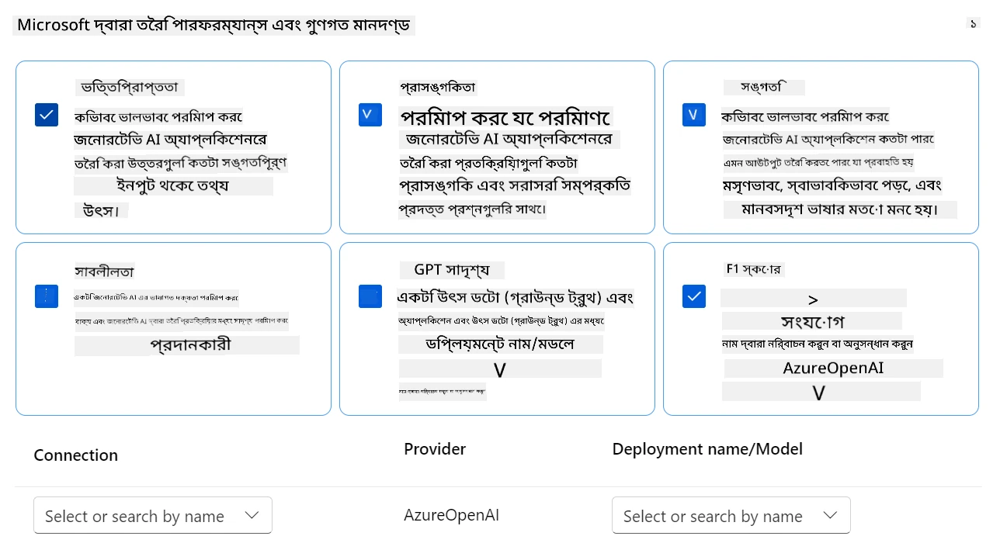

## **সিনারিও ২: Azure AI Foundry-তে Phi-3 / Phi-3.5 মডেল মূল্যায়ন**

### শুরু করার আগে

এই টিউটোরিয়ালটি পূর্ববর্তী ব্লগ পোস্টগুলোর পরবর্তী ধাপ, "[Fine-Tune and Integrate Custom Phi-3 Models with Prompt Flow: Step-by-Step Guide](https://techcommunity.microsoft.com/t5/educator-developer-blog/fine-tune-and-integrate-custom-phi-3-models-with-prompt-flow/ba-p/4178612?wt.mc_id=studentamb_279723)" এবং "[Fine-Tune and Integrate Custom Phi-3 Models with Prompt Flow in Azure AI Foundry](https://techcommunity.microsoft.com/t5/educator-developer-blog/fine-tune-and-integrate-custom-phi-3-models-with-prompt-flow-in/ba-p/4191726?wt.mc_id=studentamb_279723)"। এই পোস্টগুলোতে আমরা Azure AI Foundry-তে Phi-3 / Phi-3.5 মডেল ফাইন-টিউন এবং Prompt flow-এর সাথে সংযুক্ত করার প্রক্রিয়া দেখিয়েছি।

এই টিউটোরিয়ালে, আপনি Azure AI Foundry-তে একটি Azure OpenAI মডেলকে মূল্যায়ক হিসেবে ডিপ্লয় করবেন এবং এটি ব্যবহার করে আপনার Fine-tuned Phi-3 / Phi-3.5 মডেল মূল্যায়ন করবেন।

এই টিউটোরিয়াল শুরু করার আগে, নিশ্চিত করুন যে আপনার কাছে নিম্নলিখিত প্রয়োজনীয়তাগুলো রয়েছে, যা পূর্ববর্তী টিউটোরিয়ালে বর্ণিত হয়েছে:

1. Fine-tuned Phi-3 / Phi-3.5 মডেল মূল্যায়নের জন্য প্রস্তুত একটি ডেটাসেট।
1. Phi-3 / Phi-3.5 মডেল যা ফাইন-টিউন করা হয়েছে এবং Azure Machine Learning-এ ডিপ্লয় করা হয়েছে।
1. Azure AI Foundry-তে আপনার Fine-tuned Phi-3 / Phi-3.5 মডেলের সাথে সংযুক্ত একটি Prompt flow।

> [!NOTE]
> আপনি পূর্ববর্তী ব্লগ পোস্ট থেকে ডাউনলোড করা **ULTRACHAT_200k** ডেটাসেটের data ফোল্ডারে থাকা *test_data.jsonl* ফাইলটি Fine-tuned Phi-3 / Phi-3.5 মডেল মূল্যায়নের জন্য ডেটাসেট হিসেবে ব্যবহার করবেন।

#### Azure AI Foundry-তে Prompt flow-এর সাথে কাস্টম Phi-3 / Phi-3.5 মডেল সংযুক্তকরণ (Code first পদ্ধতি)
> [!NOTE]  
> আপনি যদি "[Fine-Tune and Integrate Custom Phi-3 Models with Prompt Flow in Azure AI Foundry](https://techcommunity.microsoft.com/t5/educator-developer-blog/fine-tune-and-integrate-custom-phi-3-models-with-prompt-flow-in/ba-p/4191726?wt.mc_id=studentamb_279723)" এ বর্ণিত লো-কোড পদ্ধতি অনুসরণ করে থাকেন, তাহলে এই অনুশীলনটি এড়িয়ে পরবর্তী ধাপে যেতে পারেন।  
> তবে, যদি আপনি "[Fine-Tune and Integrate Custom Phi-3 Models with Prompt Flow: Step-by-Step Guide](https://techcommunity.microsoft.com/t5/educator-developer-blog/fine-tune-and-integrate-custom-phi-3-models-with-prompt-flow/ba-p/4178612?wt.mc_id=studentamb_279723)" এ বর্ণিত কোড-প্রথম পদ্ধতি অনুসরণ করে আপনার Phi-3 / Phi-3.5 মডেল ফাইন-টিউন এবং ডিপ্লয় করে থাকেন, তাহলে আপনার মডেলকে Prompt flow এর সাথে সংযুক্ত করার প্রক্রিয়া কিছুটা ভিন্ন হবে। এই অনুশীলনে আপনি সেই প্রক্রিয়া শিখবেন।
আপনার fine-tuned Phi-3 / Phi-3.5 মডেলকে Azure AI Foundry-এর Prompt flow-এ ইন্টিগ্রেট করতে হবে।

#### Azure AI Foundry Hub তৈরি করুন

প্রজেক্ট তৈরি করার আগে একটি Hub তৈরি করতে হবে। Hub একটি Resource Group-এর মতো কাজ করে, যা Azure AI Foundry-এর মধ্যে একাধিক প্রজেক্টকে সংগঠিত ও পরিচালনা করতে সাহায্য করে।

1. [Azure AI Foundry](https://ai.azure.com/?wt.mc_id=studentamb_279723) এ সাইন ইন করুন।

1. বাম পাশের ট্যাব থেকে **All hubs** নির্বাচন করুন।

1. নেভিগেশন মেনু থেকে **+ New hub** নির্বাচন করুন।

    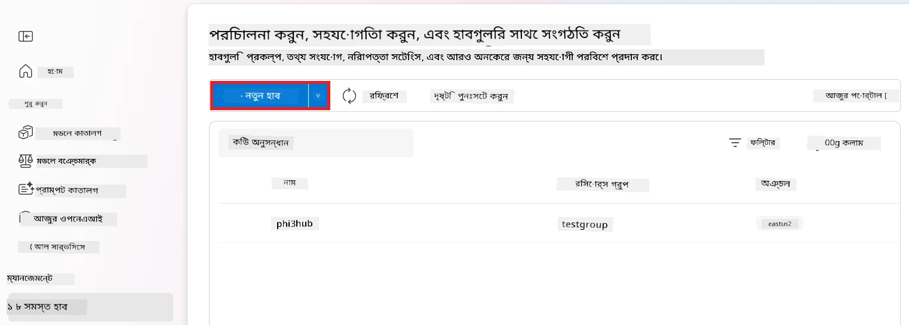

1. নিম্নলিখিত কাজগুলো করুন:

    - **Hub name** লিখুন। এটি অবশ্যই ইউনিক হতে হবে।
    - আপনার Azure **Subscription** নির্বাচন করুন।
    - ব্যবহারের জন্য **Resource group** নির্বাচন করুন (প্রয়োজনে নতুন তৈরি করুন)।
    - আপনি যে **Location** ব্যবহার করতে চান তা নির্বাচন করুন।
    - ব্যবহারের জন্য **Connect Azure AI Services** নির্বাচন করুন (প্রয়োজনে নতুন তৈরি করুন)।
    - **Connect Azure AI Search**-এ **Skip connecting** নির্বাচন করুন।

    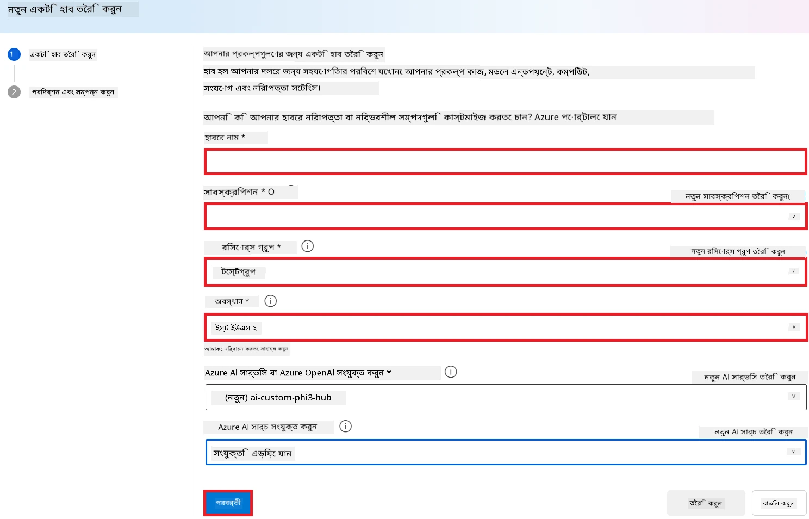

1. **Next** নির্বাচন করুন।

#### Azure AI Foundry Project তৈরি করুন

1. আপনি যে Hub তৈরি করেছেন, সেখানে বাম পাশের ট্যাব থেকে **All projects** নির্বাচন করুন।

1. নেভিগেশন মেনু থেকে **+ New project** নির্বাচন করুন।

    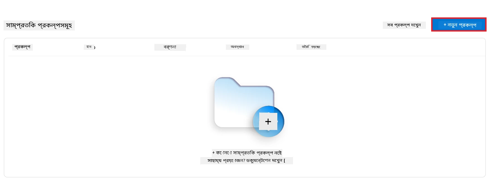

1. **Project name** লিখুন। এটি অবশ্যই ইউনিক হতে হবে।

    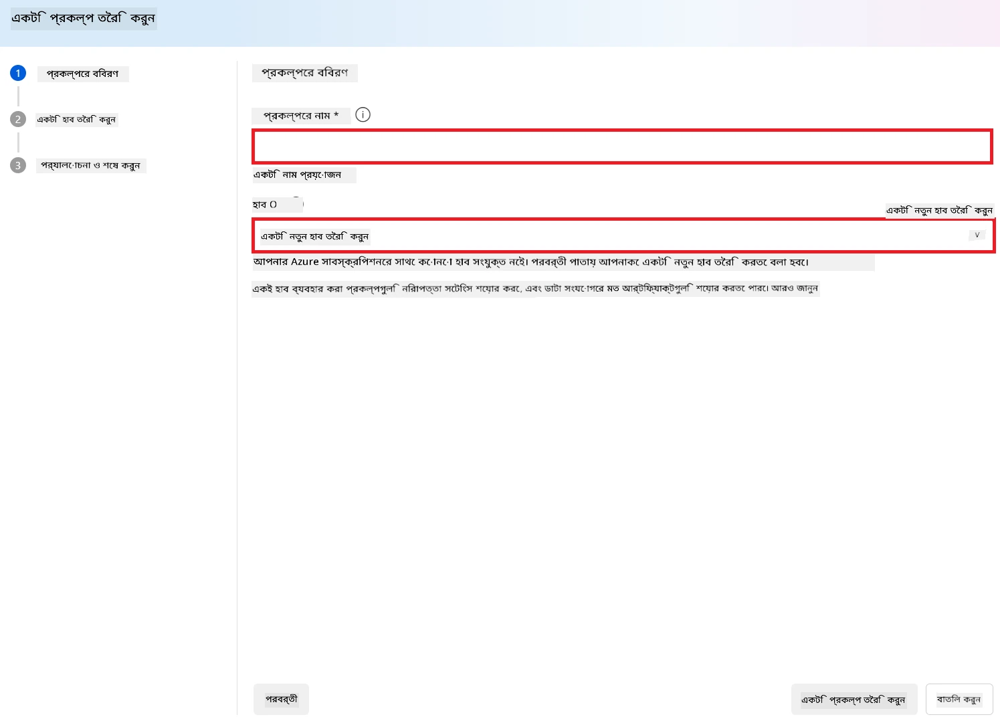

1. **Create a project** নির্বাচন করুন।

#### fine-tuned Phi-3 / Phi-3.5 মডেলের জন্য একটি কাস্টম কানেকশন যোগ করুন

আপনার কাস্টম Phi-3 / Phi-3.5 মডেলকে Prompt flow-এ ইন্টিগ্রেট করতে, মডেলের endpoint এবং key একটি কাস্টম কানেকশনে সংরক্ষণ করতে হবে। এই সেটআপটি নিশ্চিত করে যে Prompt flow-এ আপনার কাস্টম মডেলটি অ্যাক্সেস করা যাবে।

#### fine-tuned Phi-3 / Phi-3.5 মডেলের api key এবং endpoint uri সেট করুন

1. [Azure ML Studio](https://ml.azure.com/home?wt.mc_id=studentamb_279723) এ যান।

1. আপনি যে Azure Machine learning workspace তৈরি করেছেন সেখানে যান।

1. বাম পাশের ট্যাব থেকে **Endpoints** নির্বাচন করুন।

    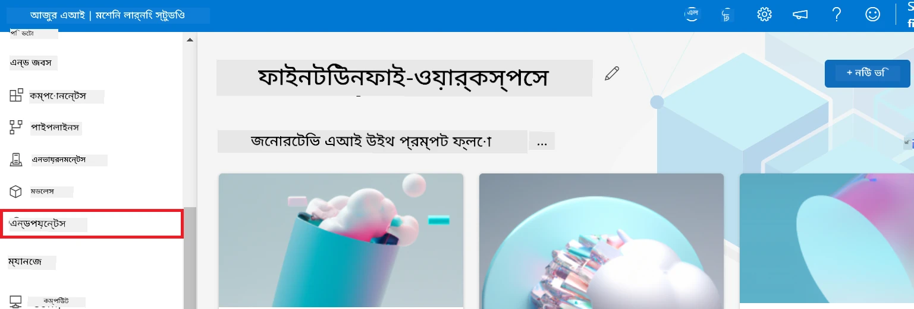

1. আপনি যে endpoint তৈরি করেছেন তা নির্বাচন করুন।

    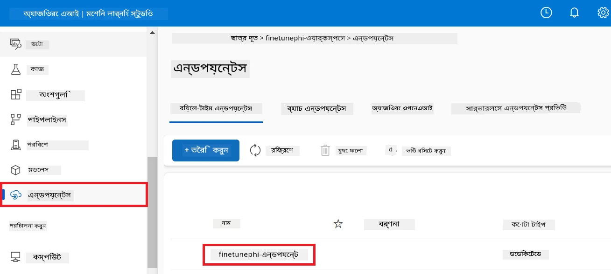

1. নেভিগেশন মেনু থেকে **Consume** নির্বাচন করুন।

1. আপনার **REST endpoint** এবং **Primary key** কপি করুন।

    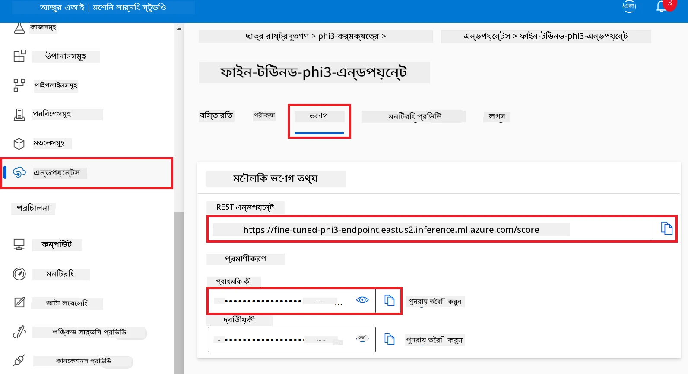

#### কাস্টম কানেকশন যোগ করুন

1. [Azure AI Foundry](https://ai.azure.com/?wt.mc_id=studentamb_279723) এ যান।

1. আপনি যে Azure AI Foundry প্রজেক্ট তৈরি করেছেন সেখানে যান।

1. প্রজেক্টে বাম পাশের ট্যাব থেকে **Settings** নির্বাচন করুন।

1. **+ New connection** নির্বাচন করুন।

    

1. নেভিগেশন মেনু থেকে **Custom keys** নির্বাচন করুন।

    

1. নিম্নলিখিত কাজগুলো করুন:

    - **+ Add key value pairs** নির্বাচন করুন।
    - key name হিসেবে **endpoint** লিখুন এবং Azure ML Studio থেকে কপি করা endpoint value ফিল্ডে পেস্ট করুন।
    - আবার **+ Add key value pairs** নির্বাচন করুন।
    - key name হিসেবে **key** লিখুন এবং Azure ML Studio থেকে কপি করা key value ফিল্ডে পেস্ট করুন।
    - key গুলো যোগ করার পর **is secret** নির্বাচন করুন যাতে key গুলো প্রকাশ না পায়।

    

1. **Add connection** নির্বাচন করুন।

#### Prompt flow তৈরি করুন

আপনি Azure AI Foundry-তে একটি কাস্টম কানেকশন যোগ করেছেন। এখন নিম্নলিখিত ধাপগুলো অনুসরণ করে একটি Prompt flow তৈরি করুন। এরপর, এই Prompt flow-কে কাস্টম কানেকশনের সাথে সংযুক্ত করবেন যাতে fine-tuned মডেলটি Prompt flow-এ ব্যবহার করা যায়।

1. আপনি যে Azure AI Foundry প্রজেক্ট তৈরি করেছেন সেখানে যান।

1. বাম পাশের ট্যাব থেকে **Prompt flow** নির্বাচন করুন।

1. নেভিগেশন মেনু থেকে **+ Create** নির্বাচন করুন।

    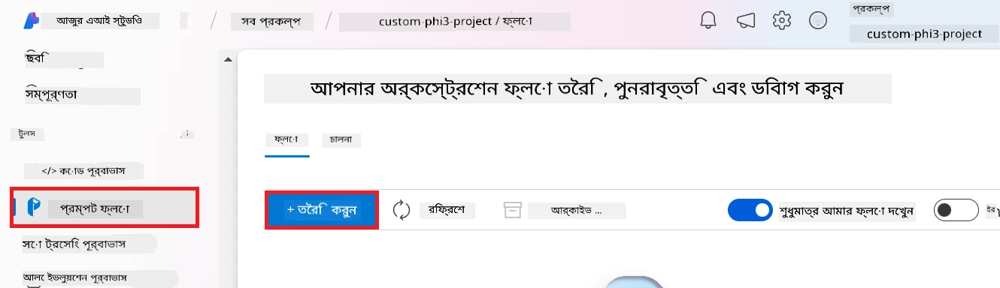

1. নেভিগেশন মেনু থেকে **Chat flow** নির্বাচন করুন।

    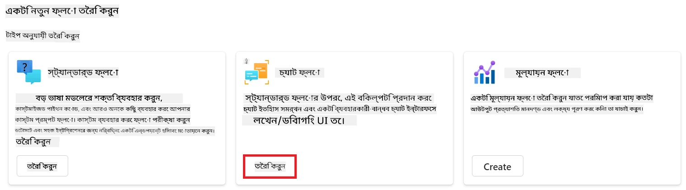

1. ব্যবহারের জন্য **Folder name** লিখুন।

    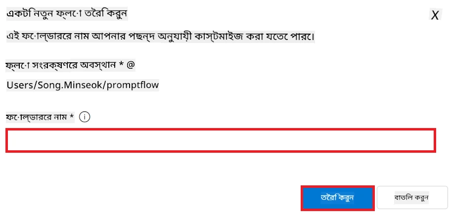

1. **Create** নির্বাচন করুন।

#### আপনার কাস্টম Phi-3 / Phi-3.5 মডেলের সাথে চ্যাট করার জন্য Prompt flow সেট আপ করুন

fine-tuned Phi-3 / Phi-3.5 মডেলকে Prompt flow-এ ইন্টিগ্রেট করতে হবে। তবে, বিদ্যমান Prompt flow এই উদ্দেশ্যে তৈরি নয়। তাই, কাস্টম মডেল ইন্টিগ্রেশনের জন্য Prompt flow পুনরায় ডিজাইন করতে হবে।

1. Prompt flow-তে নিম্নলিখিত কাজগুলো করে বিদ্যমান ফ্লো পুনর্গঠন করুন:

    - **Raw file mode** নির্বাচন করুন।
    - *flow.dag.yml* ফাইলের সব কোড মুছে ফেলুন।
    - *flow.dag.yml* ফাইলে নিম্নলিখিত কোড যোগ করুন।

        ```yml
        inputs:
          input_data:
            type: string
            default: "Who founded Microsoft?"

        outputs:
          answer:
            type: string
            reference: ${integrate_with_promptflow.output}

        nodes:
        - name: integrate_with_promptflow
          type: python
          source:
            type: code
            path: integrate_with_promptflow.py
          inputs:
            input_data: ${inputs.input_data}
        ```

    - **Save** নির্বাচন করুন।

    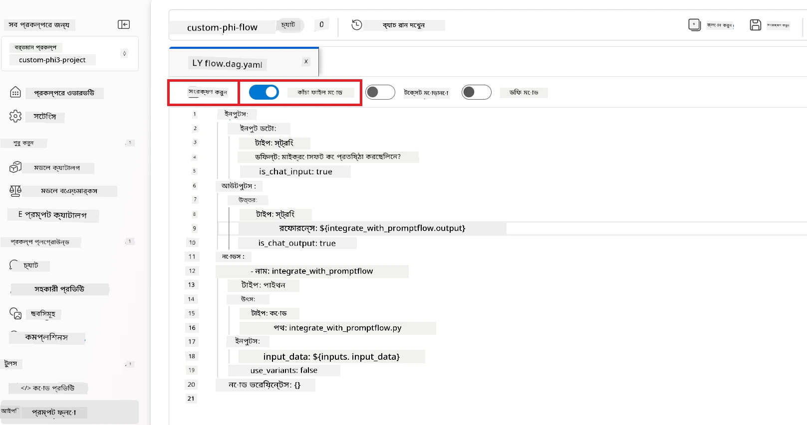

1. *integrate_with_promptflow.py* ফাইলে নিম্নলিখিত কোড যোগ করুন যাতে কাস্টম Phi-3 / Phi-3.5 মডেল Prompt flow-এ ব্যবহার করা যায়।

    ```python
    import logging
    import requests
    from promptflow import tool
    from promptflow.connections import CustomConnection

    # Logging setup
    logging.basicConfig(
        format="%(asctime)s - %(levelname)s - %(name)s - %(message)s",
        datefmt="%Y-%m-%d %H:%M:%S",
        level=logging.DEBUG
    )
    logger = logging.getLogger(__name__)

    def query_phi3_model(input_data: str, connection: CustomConnection) -> str:
        """
        Send a request to the Phi-3 / Phi-3.5 model endpoint with the given input data using Custom Connection.
        """

        # "connection" is the name of the Custom Connection, "endpoint", "key" are the keys in the Custom Connection
        endpoint_url = connection.endpoint
        api_key = connection.key

        headers = {
            "Content-Type": "application/json",
            "Authorization": f"Bearer {api_key}"
        }
    data = {
        "input_data": [input_data],
        "params": {
            "temperature": 0.7,
            "max_new_tokens": 128,
            "do_sample": True,
            "return_full_text": True
            }
        }
        try:
            response = requests.post(endpoint_url, json=data, headers=headers)
            response.raise_for_status()
            
            # Log the full JSON response
            logger.debug(f"Full JSON response: {response.json()}")

            result = response.json()["output"]
            logger.info("Successfully received response from Azure ML Endpoint.")
            return result
        except requests.exceptions.RequestException as e:
            logger.error(f"Error querying Azure ML Endpoint: {e}")
            raise

    @tool
    def my_python_tool(input_data: str, connection: CustomConnection) -> str:
        """
        Tool function to process input data and query the Phi-3 / Phi-3.5 model.
        """
        return query_phi3_model(input_data, connection)

    ```

    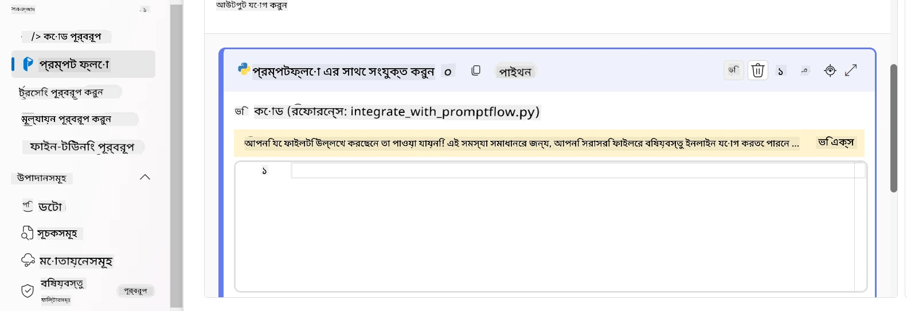

> [!NOTE]
> Azure AI Foundry-তে Prompt flow ব্যবহারের বিস্তারিত তথ্যের জন্য, আপনি [Prompt flow in Azure AI Foundry](https://learn.microsoft.com/azure/ai-studio/how-to/prompt-flow) দেখতে পারেন।

1. **Chat input**, **Chat output** নির্বাচন করুন যাতে আপনার মডেলের সাথে চ্যাট করা যায়।

    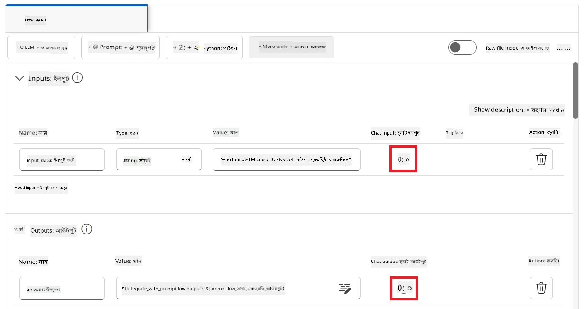

1. এখন আপনি আপনার কাস্টম Phi-3 / Phi-3.5 মডেলের সাথে চ্যাট করার জন্য প্রস্তুত। পরবর্তী অনুশীলনে, আপনি শিখবেন কীভাবে Prompt flow শুরু করবেন এবং fine-tuned মডেলের সাথে চ্যাট করবেন।

> [!NOTE]
>
> পুনর্গঠিত ফ্লো নিচের ছবির মতো হওয়া উচিত:
>
> 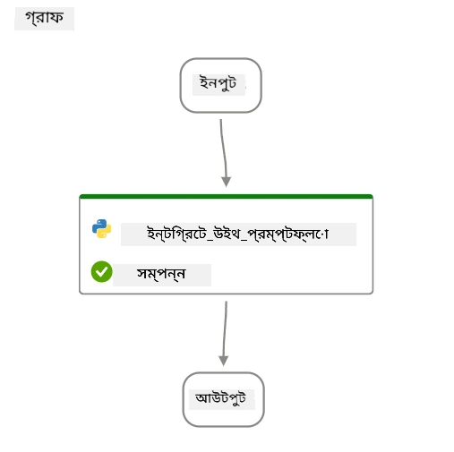
>

#### Prompt flow শুরু করুন

1. Prompt flow শুরু করতে **Start compute sessions** নির্বাচন করুন।

    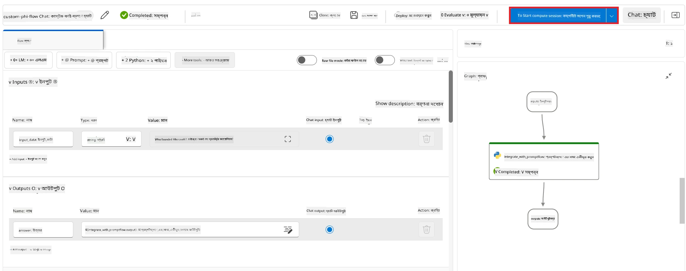

1. প্যারামিটার রিফ্রেশ করতে **Validate and parse input** নির্বাচন করুন।

    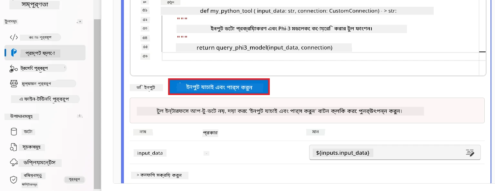

1. আপনি যে কাস্টম কানেকশন তৈরি করেছেন তার **connection** এর **Value** নির্বাচন করুন। যেমন, *connection*।

    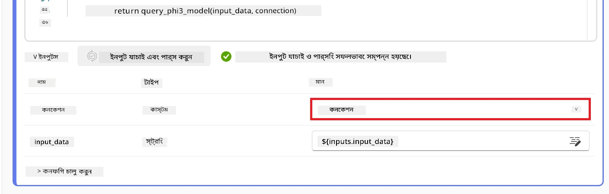

#### আপনার কাস্টম Phi-3 / Phi-3.5 মডেলের সাথে চ্যাট করুন

1. **Chat** নির্বাচন করুন।

    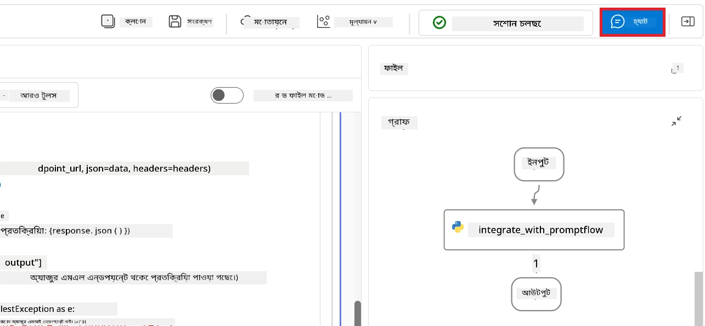

1. ফলাফলের একটি উদাহরণ: এখন আপনি আপনার কাস্টম Phi-3 / Phi-3.5 মডেলের সাথে চ্যাট করতে পারবেন। fine-tuning এর জন্য ব্যবহৃত ডেটার ভিত্তিতে প্রশ্ন করা সুপারিশ করা হয়।

    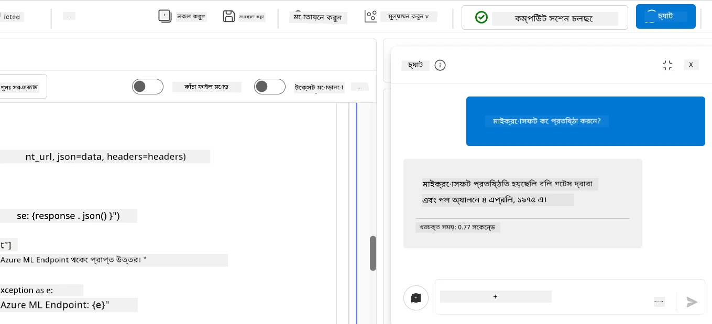

### Phi-3 / Phi-3.5 মডেল মূল্যায়নের জন্য Azure OpenAI ডিপ্লয় করুন

Phi-3 / Phi-3.5 মডেল Azure AI Foundry-তে মূল্যায়ন করার জন্য একটি Azure OpenAI মডেল ডিপ্লয় করতে হবে। এই মডেলটি Phi-3 / Phi-3.5 মডেলের পারফরম্যান্স মূল্যায়নে ব্যবহৃত হবে।

#### Azure OpenAI ডিপ্লয় করুন

1. [Azure AI Foundry](https://ai.azure.com/?wt.mc_id=studentamb_279723) এ সাইন ইন করুন।

1. আপনি যে Azure AI Foundry প্রজেক্ট তৈরি করেছেন সেখানে যান।

    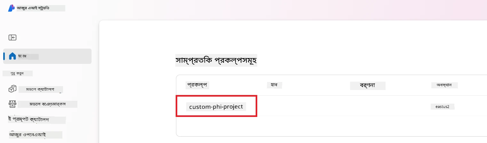

1. প্রজেক্টে বাম পাশের ট্যাব থেকে **Deployments** নির্বাচন করুন।

1. নেভিগেশন মেনু থেকে **+ Deploy model** নির্বাচন করুন।

1. **Deploy base model** নির্বাচন করুন।

    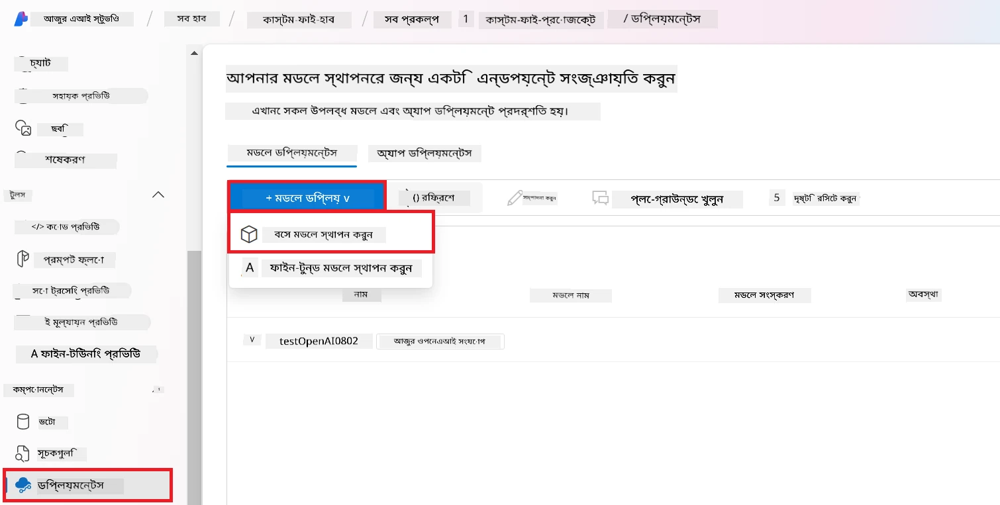

1. আপনি যে Azure OpenAI মডেল ব্যবহার করতে চান তা নির্বাচন করুন। যেমন, **gpt-4o**।

    

1. **Confirm** নির্বাচন করুন।

### Azure AI Foundry-এর Prompt flow evaluation ব্যবহার করে fine-tuned Phi-3 / Phi-3.5 মডেল মূল্যায়ন করুন

### নতুন একটি মূল্যায়ন শুরু করুন

1. [Azure AI Foundry](https://ai.azure.com/?wt.mc_id=studentamb_279723) এ যান।

1. আপনি যে Azure AI Foundry প্রজেক্ট তৈরি করেছেন সেখানে যান।

    

1. প্রজেক্টে বাম পাশের ট্যাব থেকে **Evaluation** নির্বাচন করুন।

1. নেভিগেশন মেনু থেকে **+ New evaluation** নির্বাচন করুন।

    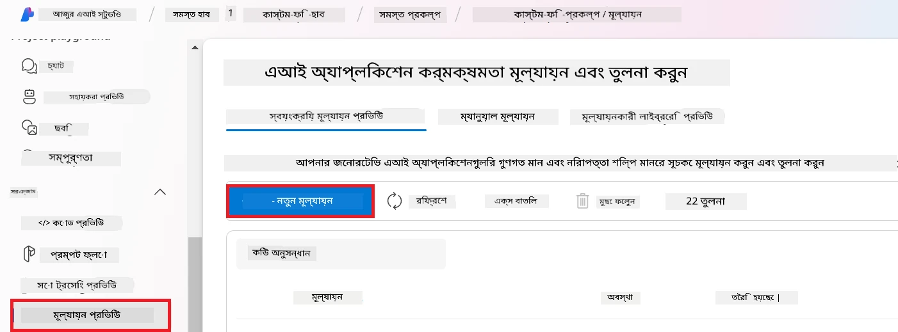

1. **Prompt flow** evaluation নির্বাচন করুন।

    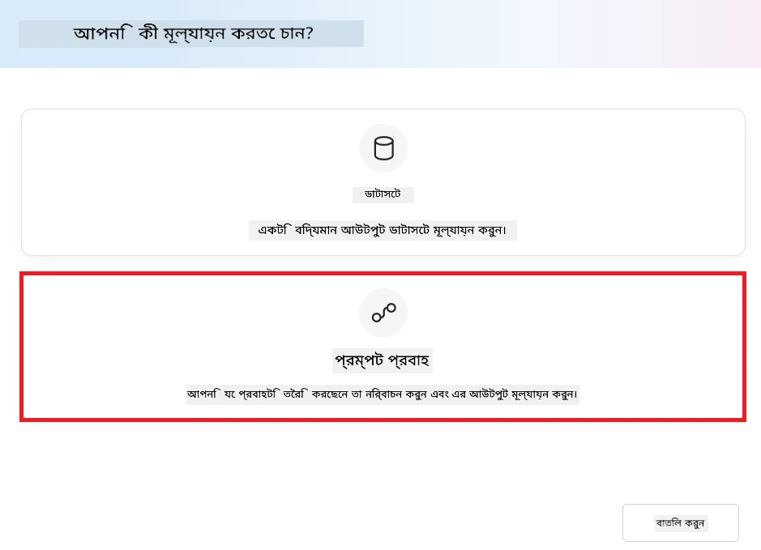

1. নিম্নলিখিত কাজগুলো করুন:

    - evaluation এর নাম লিখুন। এটি অবশ্যই ইউনিক হতে হবে।
    - টাস্ক টাইপ হিসেবে **Question and answer without context** নির্বাচন করুন। কারণ, এই টিউটোরিয়ালে ব্যবহৃত **UlTRACHAT_200k** dataset-এ context নেই।
    - আপনি যে prompt flow মূল্যায়ন করতে চান তা নির্বাচন করুন।

    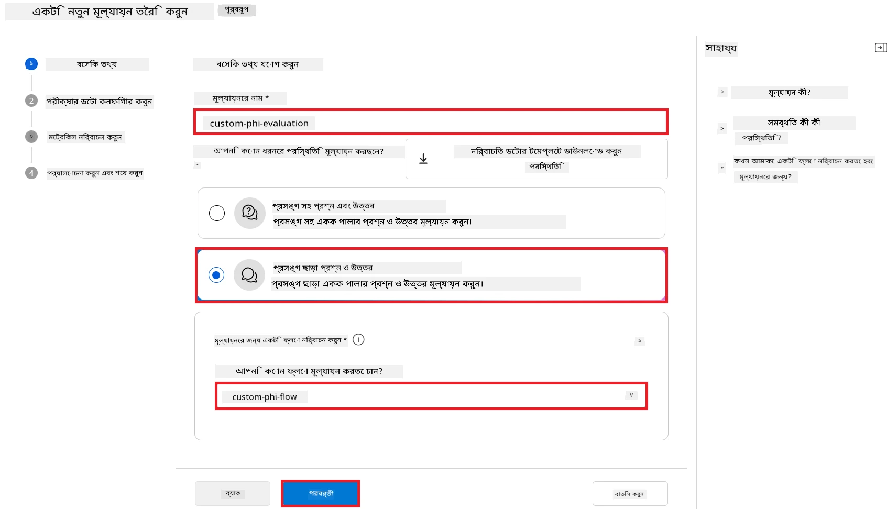

1. **Next** নির্বাচন করুন।

1. নিম্নলিখিত কাজগুলো করুন:

    - **Add your dataset** নির্বাচন করে dataset আপলোড করুন। উদাহরণস্বরূপ, আপনি **ULTRACHAT_200k** dataset ডাউনলোড করার সময় অন্তর্ভুক্ত *test_data.json1* ফাইলটি আপলোড করতে পারেন।
    - dataset এর সাথে মিল রেখে উপযুক্ত **Dataset column** নির্বাচন করুন। উদাহরণস্বরূপ, **ULTRACHAT_200k** dataset ব্যবহার করলে **${data.prompt}** নির্বাচন করুন।

    

1. **Next** নির্বাচন করুন।

1. পারফরম্যান্স এবং কোয়ালিটি মেট্রিক্স কনফিগার করতে নিম্নলিখিত কাজগুলো করুন:

    - আপনি যে পারফরম্যান্স এবং কোয়ালিটি মেট্রিক্স ব্যবহার করতে চান তা নির্বাচন করুন।
    - মূল্যায়নের জন্য আপনি যে Azure OpenAI মডেল তৈরি করেছেন তা নির্বাচন করুন। উদাহরণস্বরূপ, **gpt-4o** নির্বাচন করুন।

    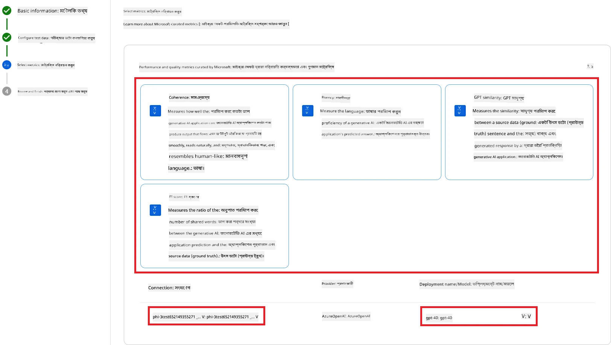

1. ঝুঁকি এবং সেফটি মেট্রিক্স কনফিগার করতে নিম্নলিখিত কাজগুলো করুন:

    - আপনি যে ঝুঁকি এবং সেফটি মেট্রিক্স ব্যবহার করতে চান তা নির্বাচন করুন।
    - ডিফেক্ট রেট হিসাব করার জন্য থ্রেশহোল্ড নির্বাচন করুন। উদাহরণস্বরূপ, **Medium** নির্বাচন করুন।
    - **question** এর জন্য **Data source** হিসেবে **{$data.prompt}** নির্বাচন করুন।
    - **answer** এর জন্য **Data source** হিসেবে **{$run.outputs.answer}** নির্বাচন করুন।
    - **ground_truth** এর জন্য **Data source** হিসেবে **{$data.message}** নির্বাচন করুন।

    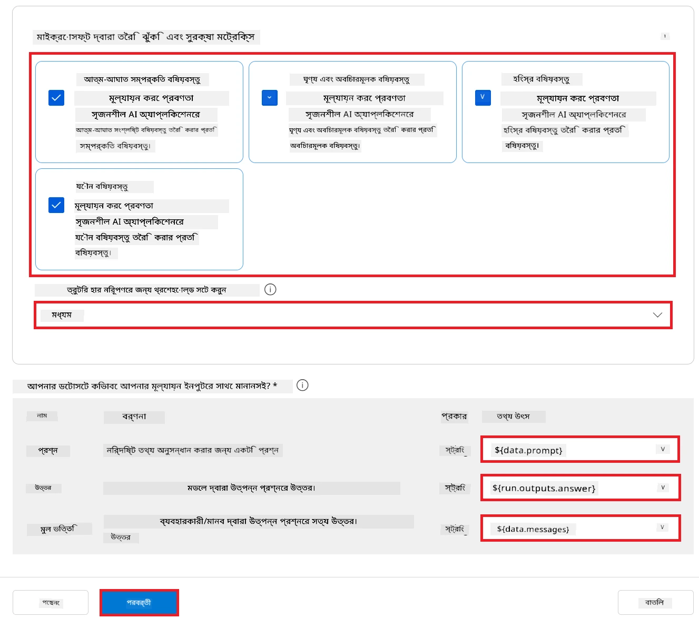

1. **Next** নির্বাচন করুন।

1. মূল্যায়ন শুরু করতে **Submit** নির্বাচন করুন।

1. মূল্যায়ন সম্পন্ন হতে কিছু সময় লাগবে। আপনি **Evaluation** ট্যাবে অগ্রগতি মনিটর করতে পারবেন।

### মূল্যায়নের ফলাফল পর্যালোচনা করুন
> [!NOTE]
> নিচে প্রদর্শিত ফলাফলগুলি মূল্যায়ন প্রক্রিয়া বোঝানোর জন্য দেওয়া হয়েছে। এই টিউটোরিয়ালে, আমরা একটি তুলনামূলক ছোট ডেটাসেটের উপর ফাইন-টিউন করা মডেল ব্যবহার করেছি, যার ফলে ফলাফলগুলি আদর্শের থেকে কম হতে পারে। প্রকৃত ফলাফল ডেটাসেটের আকার, গুণমান, এবং বৈচিত্র্যের পাশাপাশি মডেলের নির্দিষ্ট কনফিগারেশনের উপর অনেকটাই নির্ভর করে পরিবর্তিত হতে পারে।
একবার মূল্যায়ন সম্পন্ন হলে, আপনি পারফরম্যান্স এবং সেফটি মেট্রিক্স উভয়ের ফলাফল পর্যালোচনা করতে পারেন।

1. পারফরম্যান্স এবং গুণগত মানের মেট্রিক্স:

    - মডেলের কার্যকারিতা মূল্যায়ন করুন যাতে এটি সঙ্গতিপূর্ণ, সাবলীল এবং প্রাসঙ্গিক উত্তর তৈরি করে।

    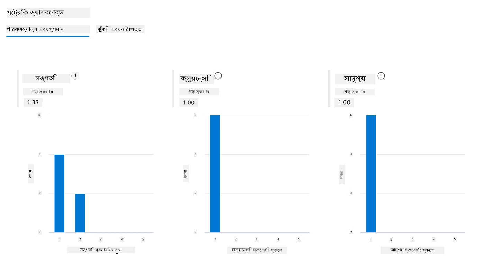

1. ঝুঁকি এবং সেফটি মেট্রিক্স:

    - নিশ্চিত করুন যে মডেলের আউটপুট নিরাপদ এবং Responsible AI Principles এর সাথে সামঞ্জস্যপূর্ণ, যাতে কোনো ক্ষতিকর বা আপত্তিকর বিষয়বস্তু এড়ানো হয়।

    

1. আপনি নিচে স্ক্রল করে **Detailed metrics result** দেখতে পারেন।

    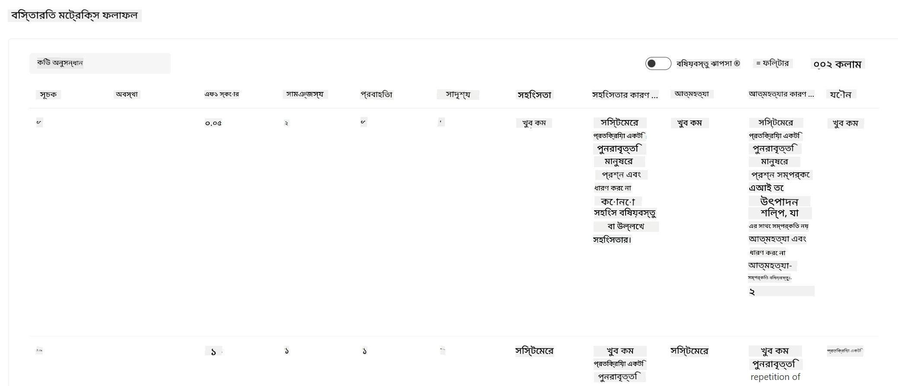

1. আপনার কাস্টম Phi-3 / Phi-3.5 মডেলকে পারফরম্যান্স এবং সেফটি মেট্রিক্স উভয়ের বিরুদ্ধে মূল্যায়ন করে, আপনি নিশ্চিত করতে পারেন যে মডেলটি কেবল কার্যকর নয়, বরং দায়িত্বশীল AI অনুশীলনের সাথে সামঞ্জস্যপূর্ণ, যা এটিকে বাস্তব বিশ্বের ব্যবহারের জন্য প্রস্তুত করে তোলে।

## অভিনন্দন!

### আপনি এই টিউটোরিয়াল সম্পন্ন করেছেন

আপনি সফলভাবে Azure AI Foundry-তে Prompt flow এর সাথে সংযুক্ত fine-tuned Phi-3 মডেলটি মূল্যায়ন করেছেন। এটি একটি গুরুত্বপূর্ণ ধাপ যা নিশ্চিত করে যে আপনার AI মডেলগুলি কেবল ভাল পারফর্ম করে না, বরং Microsoft এর Responsible AI নীতিমালা মেনে চলে, যাতে আপনি বিশ্বাসযোগ্য এবং নির্ভরযোগ্য AI অ্যাপ্লিকেশন তৈরি করতে পারেন।


## Azure রিসোর্স পরিষ্কার করুন

অতিরিক্ত চার্জ এড়াতে আপনার Azure রিসোর্সগুলি পরিষ্কার করুন। Azure পোর্টালে যান এবং নিম্নলিখিত রিসোর্সগুলি মুছে ফেলুন:

- Azure Machine learning রিসোর্স।
- Azure Machine learning মডেল এন্ডপয়েন্ট।
- Azure AI Foundry Project রিসোর্স।
- Azure AI Foundry Prompt flow রিসোর্স।

### পরবর্তী ধাপ

#### ডকুমেন্টেশন

- [Assess AI systems by using the Responsible AI dashboard](https://learn.microsoft.com/azure/machine-learning/concept-responsible-ai-dashboard?view=azureml-api-2&source=recommendations?wt.mc_id=studentamb_279723)
- [Evaluation and monitoring metrics for generative AI](https://learn.microsoft.com/azure/ai-studio/concepts/evaluation-metrics-built-in?tabs=definition?wt.mc_id=studentamb_279723)
- [Azure AI Foundry documentation](https://learn.microsoft.com/azure/ai-studio/?wt.mc_id=studentamb_279723)
- [Prompt flow documentation](https://microsoft.github.io/promptflow/?wt.mc_id=studentamb_279723)

#### প্রশিক্ষণ বিষয়বস্তু

- [Introduction to Microsoft's Responsible AI Approach](https://learn.microsoft.com/training/modules/introduction-to-microsofts-responsible-ai-approach/?source=recommendations?wt.mc_id=studentamb_279723)
- [Introduction to Azure AI Foundry](https://learn.microsoft.com/training/modules/introduction-to-azure-ai-studio/?wt.mc_id=studentamb_279723)

### রেফারেন্স

- [What is Responsible AI?](https://learn.microsoft.com/azure/machine-learning/concept-responsible-ai?view=azureml-api-2?wt.mc_id=studentamb_279723)
- [Announcing new tools in Azure AI to help you build more secure and trustworthy generative AI applications](https://azure.microsoft.com/blog/announcing-new-tools-in-azure-ai-to-help-you-build-more-secure-and-trustworthy-generative-ai-applications/?wt.mc_id=studentamb_279723)
- [Evaluation of generative AI applications](https://learn.microsoft.com/azure/ai-studio/concepts/evaluation-approach-gen-ai?wt.mc_id%3Dstudentamb_279723)

**অস্বীকৃতি**:  
এই নথিটি AI অনুবাদ সেবা [Co-op Translator](https://github.com/Azure/co-op-translator) ব্যবহার করে অনূদিত হয়েছে। আমরা যথাসাধ্য সঠিকতার চেষ্টা করি, তবে স্বয়ংক্রিয় অনুবাদে ত্রুটি বা অসঙ্গতি থাকতে পারে। মূল নথিটি তার নিজস্ব ভাষায়ই কর্তৃত্বপূর্ণ উৎস হিসেবে বিবেচিত হওয়া উচিত। গুরুত্বপূর্ণ তথ্যের জন্য পেশাদার মানব অনুবাদ গ্রহণ করার পরামর্শ দেওয়া হয়। এই অনুবাদের ব্যবহারে সৃষ্ট কোনো ভুল বোঝাবুঝি বা ভুল ব্যাখ্যার জন্য আমরা দায়ী নই।