<!--
CO_OP_TRANSLATOR_METADATA:
{
  "original_hash": "80a853c08e4ee25ef9b4bfcedd8990da",
  "translation_date": "2025-05-09T16:02:31+00:00",
  "source_file": "md/02.Application/01.TextAndChat/Phi3/E2E_Phi-3-Evaluation_AIFoundry.md",
  "language_code": "bn"
}
-->
# Azure AI Foundry-তে Microsoft-এর Responsible AI নীতিমালা অনুসারে Fine-tuned Phi-3 / Phi-3.5 মডেল মূল্যায়ন

এই end-to-end (E2E) নমুনাটি Microsoft Tech Community থেকে "[Evaluate Fine-tuned Phi-3 / 3.5 Models in Azure AI Foundry Focusing on Microsoft's Responsible AI](https://techcommunity.microsoft.com/blog/educatordeveloperblog/evaluate-fine-tuned-phi-3--3-5-models-in-azure-ai-studio-focusing-on-microsofts-/4227850?WT.mc_id=aiml-137032-kinfeylo)" গাইডের উপর ভিত্তি করে তৈরি।

## ওভারভিউ

### Azure AI Foundry-তে Fine-tuned Phi-3 / Phi-3.5 মডেলের নিরাপত্তা ও কর্মক্ষমতা কীভাবে মূল্যায়ন করবেন?

কখনও কখনও মডেল ফাইন-টিউনিং করার ফলে অনিচ্ছাকৃত বা অপ্রত্যাশিত প্রতিক্রিয়া আসতে পারে। মডেলটি নিরাপদ এবং কার্যকরী থাকার নিশ্চয়তার জন্য, এর ক্ষতিকারক কন্টেন্ট তৈরি করার সম্ভাবনা এবং সঠিক, প্রাসঙ্গিক এবং সুসংগত উত্তর তৈরি করার ক্ষমতা মূল্যায়ন করা গুরুত্বপূর্ণ। এই টিউটোরিয়ালে, আপনি Azure AI Foundry-তে Prompt flow-এর সাথে সংযুক্ত Fine-tuned Phi-3 / Phi-3.5 মডেলের নিরাপত্তা এবং কর্মক্ষমতা কীভাবে মূল্যায়ন করবেন তা শিখবেন।

এখানে Azure AI Foundry-এর মূল্যায়ন প্রক্রিয়া।

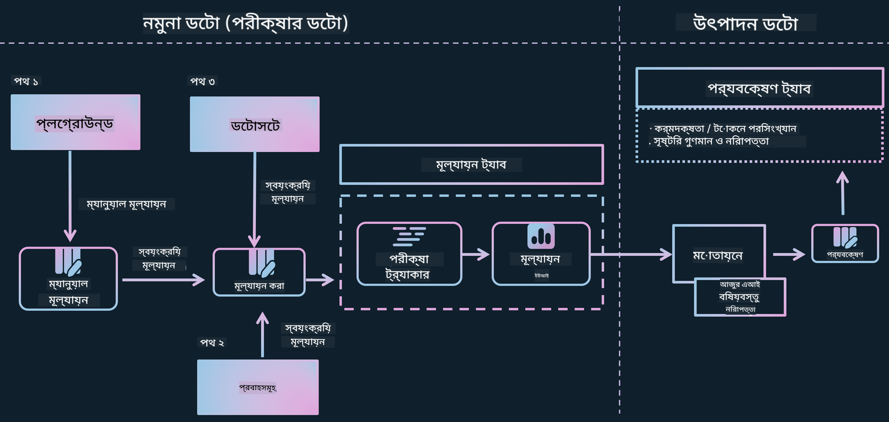

*ছবির উৎস: [Evaluation of generative AI applications](https://learn.microsoft.com/azure/ai-studio/concepts/evaluation-approach-gen-ai?wt.mc_id%3Dstudentamb_279723)*

> [!NOTE]
>
> Phi-3 / Phi-3.5 সম্পর্কিত আরও বিস্তারিত তথ্য এবং অতিরিক্ত রিসোর্স জানতে, অনুগ্রহ করে [Phi-3CookBook](https://github.com/microsoft/Phi-3CookBook?wt.mc_id=studentamb_279723) পরিদর্শন করুন।

### প্রয়োজনীয়তা

- [Python](https://www.python.org/downloads)
- [Azure subscription](https://azure.microsoft.com/free?wt.mc_id=studentamb_279723)
- [Visual Studio Code](https://code.visualstudio.com)
- Fine-tuned Phi-3 / Phi-3.5 মডেল

### বিষয়সূচি

1. [**সিনারিও ১: Azure AI Foundry-এর Prompt flow মূল্যায়নের পরিচিতি**](../../../../../../md/02.Application/01.TextAndChat/Phi3)

    - [নিরাপত্তা মূল্যায়নের পরিচিতি](../../../../../../md/02.Application/01.TextAndChat/Phi3)
    - [কর্মক্ষমতা মূল্যায়নের পরিচিতি](../../../../../../md/02.Application/01.TextAndChat/Phi3)

1. [**সিনারিও ২: Azure AI Foundry-তে Phi-3 / Phi-3.5 মডেল মূল্যায়ন**](../../../../../../md/02.Application/01.TextAndChat/Phi3)

    - [শুরু করার আগে](../../../../../../md/02.Application/01.TextAndChat/Phi3)
    - [Phi-3 / Phi-3.5 মডেল মূল্যায়নের জন্য Azure OpenAI স্থাপন করুন](../../../../../../md/02.Application/01.TextAndChat/Phi3)
    - [Azure AI Foundry-এর Prompt flow মূল্যায়ন ব্যবহার করে Fine-tuned Phi-3 / Phi-3.5 মডেল মূল্যায়ন করুন](../../../../../../md/02.Application/01.TextAndChat/Phi3)

1. [অভিনন্দন!](../../../../../../md/02.Application/01.TextAndChat/Phi3)

## **সিনারিও ১: Azure AI Foundry-এর Prompt flow মূল্যায়নের পরিচিতি**

### নিরাপত্তা মূল্যায়নের পরিচিতি

আপনার AI মডেল নৈতিক এবং নিরাপদ কিনা তা নিশ্চিত করতে, Microsoft-এর Responsible AI নীতিমালার বিরুদ্ধে এটি মূল্যায়ন করা গুরুত্বপূর্ণ। Azure AI Foundry-তে নিরাপত্তা মূল্যায়ন আপনাকে মডেলের jailbreak আক্রমণের প্রতি দুর্বলতা এবং ক্ষতিকারক কন্টেন্ট তৈরি করার সম্ভাবনা যাচাই করতে সাহায্য করে, যা সরাসরি এই নীতিমালার সাথে সামঞ্জস্যপূর্ণ।


*ছবির উৎস: [Evaluation of generative AI applications](https://learn.microsoft.com/azure/ai-studio/concepts/evaluation-approach-gen-ai?wt.mc_id%3Dstudentamb_279723)*

#### Microsoft-এর Responsible AI নীতিমালা

প্রযুক্তিগত ধাপ শুরু করার আগে, Microsoft-এর Responsible AI নীতিমালা বুঝে নেওয়া জরুরি। এটি একটি নৈতিক কাঠামো যা AI সিস্টেমের দায়িত্বশীল উন্নয়ন, স্থাপন এবং পরিচালনায় নির্দেশনা দেয়। এই নীতিমালা AI প্রযুক্তিগুলোকে ন্যায়সঙ্গত, স্বচ্ছ এবং অন্তর্ভুক্তিমূলকভাবে গড়ে তোলার জন্য দিকনির্দেশনা দেয়। এই নীতিমালা AI মডেলের নিরাপত্তা মূল্যায়নের ভিত্তি।

Microsoft-এর Responsible AI নীতিমালার মধ্যে রয়েছে:

- **ন্যায়পরায়ণতা ও অন্তর্ভুক্তি**: AI সিস্টেমগুলোকে সবাইকে ন্যায়সঙ্গতভাবে আচরণ করতে হবে এবং একই রকম অবস্থায় থাকা মানুষের গ্রুপগুলোকে ভিন্নভাবে প্রভাবিত করা থেকে বিরত থাকতে হবে। উদাহরণস্বরূপ, যখন AI সিস্টেম চিকিৎসা, ঋণ আবেদন বা কর্মসংস্থান বিষয়ে পরামর্শ দেয়, তখন একই ধরনের উপসর্গ, আর্থিক অবস্থা বা পেশাগত যোগ্যতা থাকা সবাইকে একই ধরনের সুপারিশ করা উচিত।

- **নির্ভরযোগ্যতা ও নিরাপত্তা**: বিশ্বাসযোগ্যতা গড়ে তুলতে, AI সিস্টেমগুলোকে নির্ভরযোগ্য, নিরাপদ এবং ধারাবাহিকভাবে কাজ করতে হবে। এই সিস্টেমগুলোকে তাদের ডিজাইন অনুযায়ী কাজ করতে সক্ষম হতে হবে, অপ্রত্যাশিত পরিস্থিতিতে নিরাপদ প্রতিক্রিয়া দিতে হবে এবং ক্ষতিকর হস্তক্ষেপ প্রতিরোধ করতে হবে। তাদের আচরণ এবং সামলাতে সক্ষম পরিস্থিতির বৈচিত্র্য সেইসব পরিস্থিতির প্রতিফলন যা ডিজাইন ও পরীক্ষার সময় ডেভেলপাররা প্রত্যাশা করেছিল।

- **স্বচ্ছতা**: যখন AI সিস্টেমগুলো মানুষের জীবনে ব্যাপক প্রভাব ফেলা সিদ্ধান্ত গ্রহণে সাহায্য করে, তখন মানুষকে বুঝতে হবে কিভাবে সেই সিদ্ধান্তগুলো নেওয়া হয়েছে। উদাহরণস্বরূপ, একটি ব্যাংক AI সিস্টেম ব্যবহার করে নির্ধারণ করতে পারে কেউ ঋণ পাওয়ার যোগ্য কিনা। একটি প্রতিষ্ঠান AI সিস্টেম ব্যবহার করে সবচেয়ে যোগ্য প্রার্থী নির্বাচন করতে পারে।

- **গোপনীয়তা ও নিরাপত্তা**: AI আরও ব্যাপক হওয়ার সঙ্গে সঙ্গে গোপনীয়তা রক্ষা এবং ব্যক্তিগত ও ব্যবসায়িক তথ্য সুরক্ষা আরও গুরুত্বপূর্ণ ও জটিল হয়ে উঠছে। AI-তে গোপনীয়তা ও তথ্য নিরাপত্তার প্রতি বিশেষ মনোযোগ দিতে হয় কারণ ডেটার অ্যাক্সেস AI সিস্টেমকে সঠিক ও তথ্যভিত্তিক পূর্বাভাস ও সিদ্ধান্ত নিতে সাহায্য করে।

- **দায়িত্বশীলতা**: AI সিস্টেম ডিজাইন ও স্থাপনকারী ব্যক্তিদের তাদের সিস্টেমের কার্যকারিতার জন্য দায়িত্বশীল হতে হবে। প্রতিষ্ঠানগুলো শিল্প মান অনুসরণ করে দায়িত্বশীলতার নীতি তৈরি করা উচিত। এই নীতিমালা নিশ্চিত করে যে AI সিস্টেম কোনো সিদ্ধান্তের চূড়ান্ত কর্তৃপক্ষ নয় যা মানুষের জীবনকে প্রভাবিত করে। এছাড়াও এটি নিশ্চিত করে যে মানুষ উচ্চমাত্রার স্বায়ত্তশাসিত AI সিস্টেমের উপর যথার্থ নিয়ন্ত্রণ বজায় রাখে।

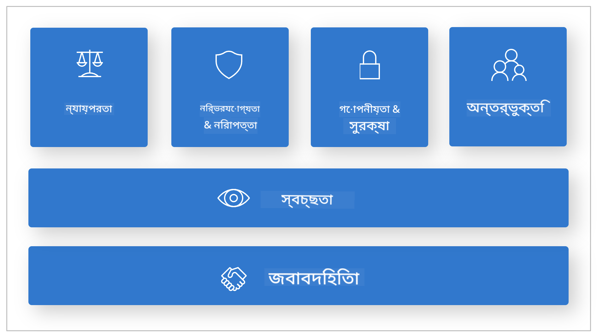

*ছবির উৎস: [What is Responsible AI?](https://learn.microsoft.com/azure/machine-learning/concept-responsible-ai?view=azureml-api-2&viewFallbackFrom=azureml-api-2%253fwt.mc_id%3Dstudentamb_279723)*

> [!NOTE]
> Microsoft-এর Responsible AI নীতিমালা সম্পর্কে আরও জানতে, [What is Responsible AI?](https://learn.microsoft.com/azure/machine-learning/concept-responsible-ai?view=azureml-api-2?wt.mc_id=studentamb_279723) পরিদর্শন করুন।

#### নিরাপত্তা মেট্রিক্স

এই টিউটোরিয়ালে, আপনি Azure AI Foundry-এর নিরাপত্তা মেট্রিক্স ব্যবহার করে Fine-tuned Phi-3 মডেলের নিরাপত্তা মূল্যায়ন করবেন। এই মেট্রিক্সগুলো মডেলের ক্ষতিকারক কন্টেন্ট তৈরি করার সম্ভাবনা এবং jailbreak আক্রমণের প্রতি দুর্বলতা যাচাই করতে সাহায্য করে। নিরাপত্তা মেট্রিক্সগুলো হলো:

- **Self-harm সম্পর্কিত কন্টেন্ট**: মডেল কি স্ব-ক্ষতি সম্পর্কিত কন্টেন্ট তৈরি করার প্রবণতা রাখে তা মূল্যায়ন করে।
- **ঘৃণ্য ও অন্যায় কন্টেন্ট**: মডেল কি ঘৃণ্য বা অন্যায় কন্টেন্ট তৈরি করার প্রবণতা রাখে তা মূল্যায়ন করে।
- **হিংসাত্মক কন্টেন্ট**: মডেল কি হিংসাত্মক কন্টেন্ট তৈরি করার প্রবণতা রাখে তা মূল্যায়ন করে।
- **যৌন কন্টেন্ট**: মডেল কি অনুপযুক্ত যৌন কন্টেন্ট তৈরি করার প্রবণতা রাখে তা মূল্যায়ন করে।

এই দিকগুলো মূল্যায়ন করলে নিশ্চিত হয় যে AI মডেল ক্ষতিকারক বা আপত্তিজনক কন্টেন্ট তৈরি করছে না, যা সামাজিক মূল্যবোধ এবং নিয়ন্ত্রক মানদণ্ডের সাথে সামঞ্জস্যপূর্ণ।

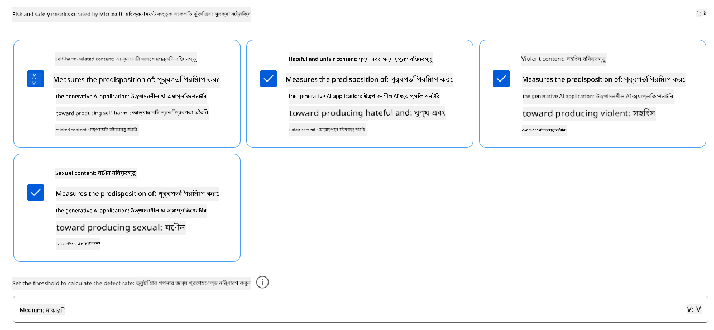

### কর্মক্ষমতা মূল্যায়নের পরিচিতি

আপনার AI মডেল প্রত্যাশা অনুযায়ী কাজ করছে কিনা তা নিশ্চিত করতে, কর্মক্ষমতা মেট্রিক্সের বিরুদ্ধে এটি মূল্যায়ন করা গুরুত্বপূর্ণ। Azure AI Foundry-তে কর্মক্ষমতা মূল্যায়ন আপনাকে মডেলের সঠিক, প্রাসঙ্গিক এবং সুসংগত উত্তর তৈরি করার দক্ষতা যাচাই করতে সাহায্য করে।

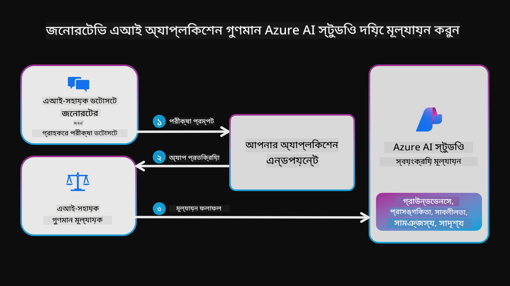

*ছবির উৎস: [Evaluation of generative AI applications](https://learn.microsoft.com/azure/ai-studio/concepts/evaluation-approach-gen-ai?wt.mc_id%3Dstudentamb_279723)*

#### কর্মক্ষমতা মেট্রিক্স

এই টিউটোরিয়ালে, আপনি Azure AI Foundry-এর কর্মক্ষমতা মেট্রিক্স ব্যবহার করে Fine-tuned Phi-3 / Phi-3.5 মডেলের কর্মক্ষমতা মূল্যায়ন করবেন। এই মেট্রিক্সগুলো মডেলের সঠিক, প্রাসঙ্গিক এবং সুসংগত উত্তর তৈরি করার দক্ষতা যাচাই করতে সাহায্য করে। কর্মক্ষমতা মেট্রিক্সগুলো হলো:

- **Groundedness**: তৈরি উত্তর ইনপুট উৎস থেকে প্রাপ্ত তথ্যের সাথে কতটা সঙ্গতিপূর্ণ তা মূল্যায়ন করে।
- **Relevance**: প্রদত্ত প্রশ্নের সাথে তৈরি উত্তরের প্রাসঙ্গিকতা মূল্যায়ন করে।
- **Coherence**: তৈরি টেক্সট কতটা স্বাভাবিকভাবে প্রবাহিত হয়, পড়তে স্বাভাবিক এবং মানবসদৃশ ভাষার মত তা মূল্যায়ন করে।
- **Fluency**: তৈরি টেক্সটের ভাষাগত দক্ষতা মূল্যায়ন করে।
- **GPT Similarity**: তৈরি উত্তর এবং ground truth-এর মধ্যে সাদৃশ্য তুলনা করে।
- **F1 Score**: তৈরি উত্তর এবং উৎস ডেটার মধ্যে ভাগ করা শব্দের অনুপাত হিসাব করে।

এই মেট্রিক্সগুলো মডেলের সঠিক, প্রাসঙ্গিক এবং সুসংগত উত্তর তৈরি করার দক্ষতা মূল্যায়নে সাহায্য করে।

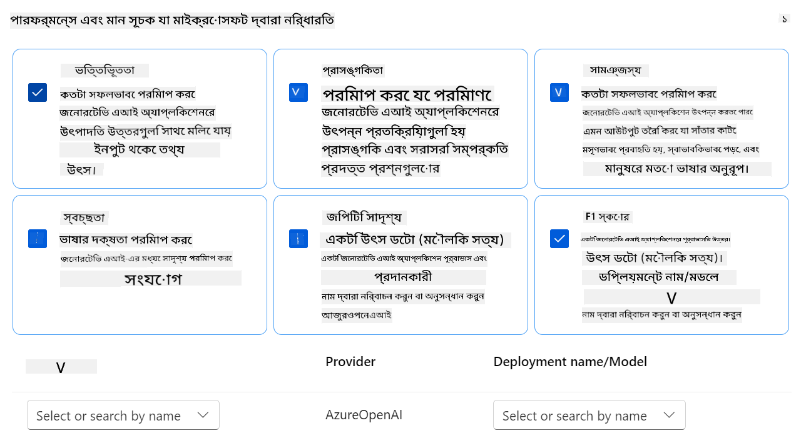

## **সিনারিও ২: Azure AI Foundry-তে Phi-3 / Phi-3.5 মডেল মূল্যায়ন**

### শুরু করার আগে

এই টিউটোরিয়ালটি পূর্ববর্তী ব্লগ পোস্টগুলো "[Fine-Tune and Integrate Custom Phi-3 Models with Prompt Flow: Step-by-Step Guide](https://techcommunity.microsoft.com/t5/educator-developer-blog/fine-tune-and-integrate-custom-phi-3-models-with-prompt-flow/ba-p/4178612?wt.mc_id=studentamb_279723)" এবং "[Fine-Tune and Integrate Custom Phi-3 Models with Prompt Flow in Azure AI Foundry](https://techcommunity.microsoft.com/t5/educator-developer-blog/fine-tune-and-integrate-custom-phi-3-models-with-prompt-flow-in/ba-p/4191726?wt.mc_id=studentamb_279723)" এর ধারাবাহিক। এই পোস্টগুলোতে আমরা Azure AI Foundry-তে Phi-3 / Phi-3.5 মডেল ফাইন-টিউন এবং Prompt flow-এর সাথে সংযুক্ত করার প্রক্রিয়া দেখিয়েছি।

এই টিউটোরিয়ালে, আপনি Azure AI Foundry-তে একটি Azure OpenAI মডেল মূল্যায়ক হিসেবে স্থাপন করবেন এবং সেটি ব্যবহার করে আপনার Fine-tuned Phi-3 / Phi-3.5 মডেল মূল্যায়ন করবেন।

এই টিউটোরিয়াল শুরু করার আগে, নিশ্চিত করুন যে আপনার কাছে পূর্ববর্তী টিউটোরিয়ালে বর্ণিত নিম্নলিখিত প্রয়োজনীয়তাগুলো আছে:

1. Fine-tuned Phi-3 / Phi-3.5 মডেল মূল্যায়নের জন্য প্রস্তুত ডেটাসেট।
1. Phi-3 / Phi-3.5 মডেল যা ফাইন-টিউন করা হয়েছে এবং Azure Machine Learning-এ স্থাপিত।
1. Azure AI Foundry-তে Fine-tuned Phi-3 / Phi-3.5 মডেলের সাথে সংযুক্ত Prompt flow।

> [!NOTE]
> পূর্ববর্তী ব্লগ পোস্ট থেকে ডাউনলোড করা **ULTRACHAT_200k** ডেটাসেটের data ফোল্ডারে থাকা *test_data.jsonl* ফাইলটি Fine-tuned Phi-3 / Phi-3.5 মডেল মূল্যায়নের জন্য ডেটাসেট হিসেবে ব্যবহার করবেন।

#### Azure AI Foundry-তে Prompt flow-এর সাথে কাস্টম Phi-3 / Phi-3.5 মডেল সংযুক্ত করা (প্রথমে কোড পদ্ধতি)

> [!NOTE]
> যদি আপনি "[Fine-Tune and Integrate Custom Phi-3 Models with Prompt Flow in Azure AI Foundry](https://techcommunity.microsoft.com/t5/educator-developer-blog/fine-tune-and-integrate-custom-phi-3-models-with-prompt-flow-in/ba-p/4191726?wt.mc_id=studentamb_279723)" এ বর্ণিত low-code পদ্ধতি অনুসরণ করে থাকেন, তাহলে এই অনুশীলনটি বাদ দিয়ে পরবর্তী ধাপে যেতে পারেন।
> তবে, যদি আপনি "[Fine-Tune and Integrate Custom Phi-3 Models with Prompt Flow: Step-by-Step Guide](https://techcommunity.microsoft.com/t5/educator-developer-blog/fine-tune-and-integrate-custom-phi-3-models-with-prompt-flow/ba-p/4178612?wt.mc_id=studentamb_279723)" এ বর্ণিত কোড-ফার্স্ট পদ্ধতি অনুসরণ করে Phi-3 / Phi-3.5 মডেল ফাইন-টিউন এবং স্থাপন করে থাকেন, তাহলে আপনার মডেলকে Prompt flow-এর সাথে সংযুক্ত করার প্রক্রিয়া কিছুটা আলাদা। এই অনুশীলনে আপনি সেই প্রক্রিয়া শিখবেন।

অগ্রসর হতে, আপনাকে Azure AI Foundry-তে Prompt flow-এর সাথে আপনার Fine-tuned Phi-3 / Phi-3.5 মডেল সংযুক্ত করতে হবে।

#### Azure AI Foundry Hub তৈরি করুন

প্রকল্প তৈরি করার আগে একটি Hub তৈরি করতে হবে। Hub একটি Resource Group-এর মত কাজ করে, যা Azure AI Foundry-এর মধ্যে একাধিক প্রকল্প সংগঠিত ও পরিচালনা করতে সাহায্য করে।

1. [Azure AI Foundry](https://ai.azure.com/?wt.mc_id=studentamb_279723) এ সাইন ইন করুন।

1. বাম পাশের ট্যাব থেকে **All hubs** নির্বাচন করুন।

1. নেভিগেশন মেনু থেকে **+ New hub** নির্বাচন করুন।

    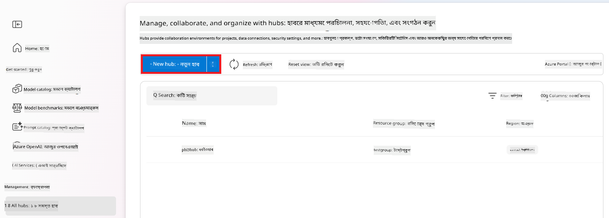

1. নিম্নলিখিত কাজগুলো সম্পাদন করুন:

    - **Hub name** লিখুন। এটি একটি অনন্য নাম হতে হবে।
    - আপনার Azure **Subscription** নির্বাচন করুন।
    - ব্যবহারের জন্য **Resource group** নির্বাচন করুন (প্রয়োজনে নতুন তৈরি করুন)।
    - আপনি যে **Location** ব্যবহার করতে চান তা নির্বাচন করুন।
    - ব্যবহারের জন্য **Connect Azure AI Services** নির্বাচন করুন (প্রয়োজনে নতুন তৈরি করুন)।
    - **Connect Azure AI Search** নির্বাচন থেকে **Skip connecting** নির্বাচন করুন।
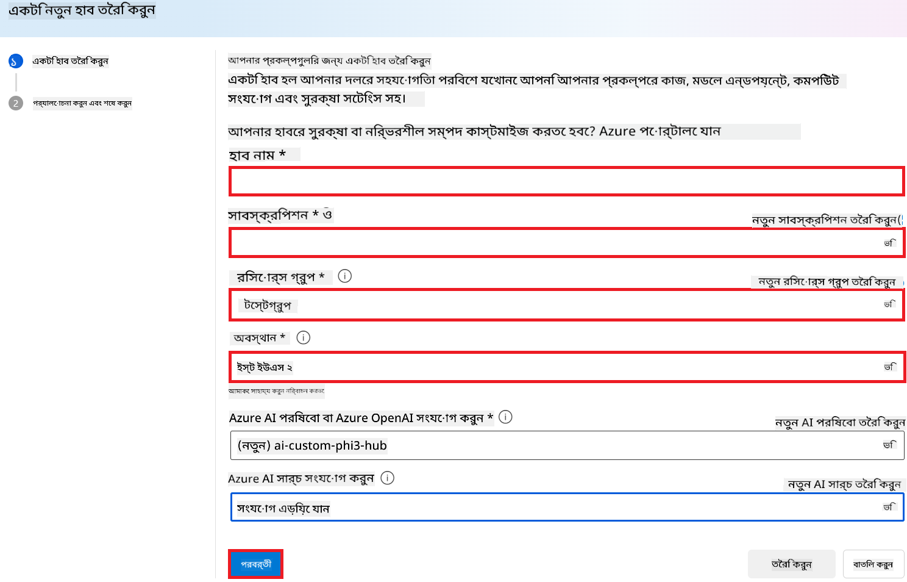

1. নির্বাচন করুন **Next**।

#### Azure AI Foundry প্রকল্প তৈরি করুন

1. আপনি যে Hub তৈরি করেছেন, সেখানে বাম পাশের ট্যাব থেকে **All projects** নির্বাচন করুন।

1. নেভিগেশন মেনু থেকে **+ New project** নির্বাচন করুন।

    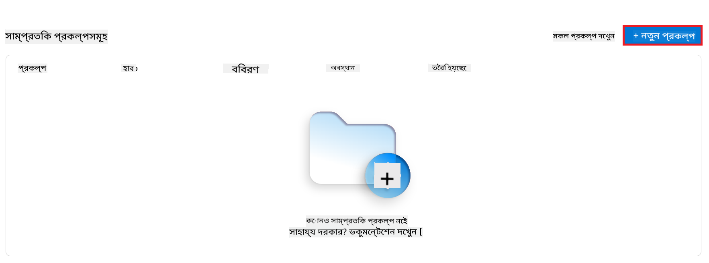

1. **Project name** লিখুন। এটি একটি অনন্য মান হতে হবে।

    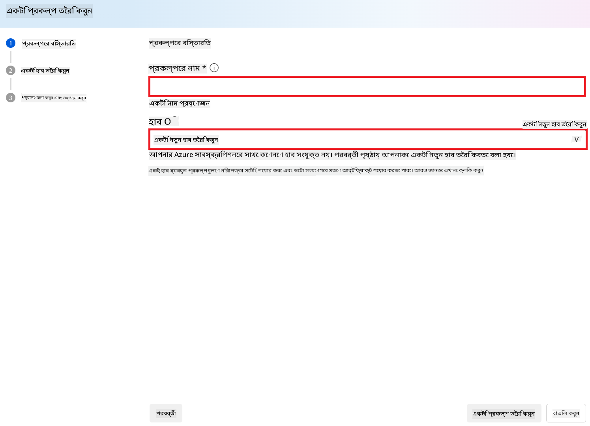

1. নির্বাচন করুন **Create a project**।

#### Fine-tuned Phi-3 / Phi-3.5 মডেলের জন্য কাস্টম সংযোগ যোগ করুন

আপনার কাস্টম Phi-3 / Phi-3.5 মডেলকে Prompt flow এর সাথে সংযুক্ত করতে, আপনাকে মডেলের endpoint এবং key একটি কাস্টম সংযোগে সংরক্ষণ করতে হবে। এই সেটআপটি নিশ্চিত করে যে Prompt flow এ আপনার কাস্টম Phi-3 / Phi-3.5 মডেলে অ্যাক্সেস থাকবে।

#### Fine-tuned Phi-3 / Phi-3.5 মডেলের api key এবং endpoint uri সেট করুন

1. যান [Azure ML Studio](https://ml.azure.com/home?wt.mc_id=studentamb_279723)।

1. আপনি যে Azure Machine learning workspace তৈরি করেছেন সেখানে যান।

1. বাম পাশের ট্যাব থেকে **Endpoints** নির্বাচন করুন।

    

1. আপনি যে endpoint তৈরি করেছেন তা নির্বাচন করুন।

    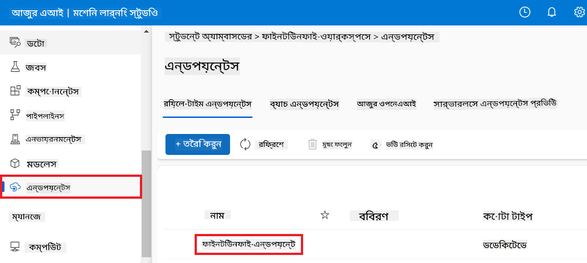

1. নেভিগেশন মেনু থেকে **Consume** নির্বাচন করুন।

1. আপনার **REST endpoint** এবং **Primary key** কপি করুন।

    

#### কাস্টম সংযোগ যোগ করুন

1. যান [Azure AI Foundry](https://ai.azure.com/?wt.mc_id=studentamb_279723)।

1. আপনি যে Azure AI Foundry প্রকল্প তৈরি করেছেন সেখানে যান।

1. আপনার তৈরি প্রকল্পে, বাম পাশের ট্যাব থেকে **Settings** নির্বাচন করুন।

1. নির্বাচন করুন **+ New connection**।

    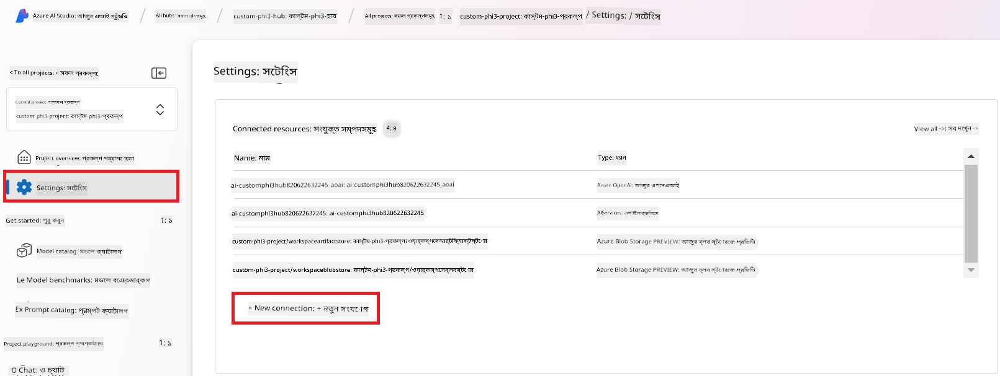

1. নেভিগেশন মেনু থেকে **Custom keys** নির্বাচন করুন।

    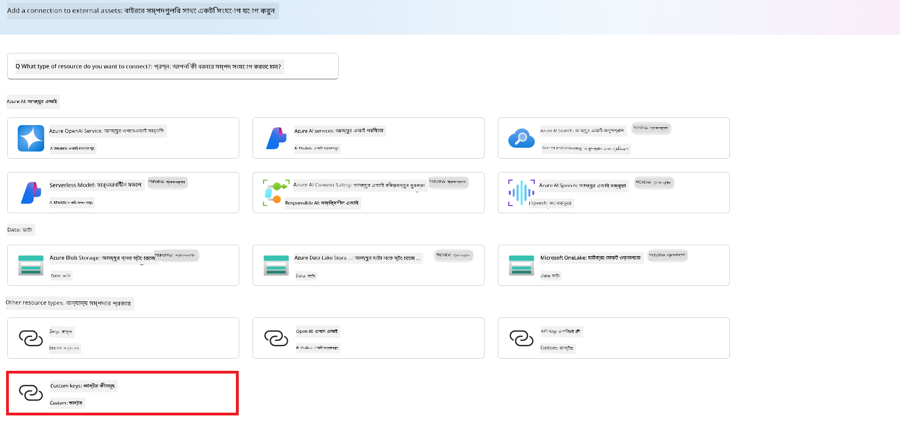

1. নিম্নলিখিত কাজগুলি করুন:

    - নির্বাচন করুন **+ Add key value pairs**।
    - key নাম হিসেবে লিখুন **endpoint** এবং Azure ML Studio থেকে কপি করা endpoint value ফিল্ডে পেস্ট করুন।
    - আবার নির্বাচন করুন **+ Add key value pairs**।
    - key নাম হিসেবে লিখুন **key** এবং Azure ML Studio থেকে কপি করা key value ফিল্ডে পেস্ট করুন।
    - key গুলো যোগ করার পর, key গুলো গোপন রাখতে **is secret** নির্বাচন করুন।

    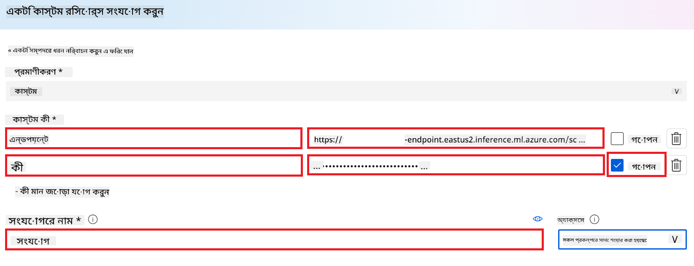

1. নির্বাচন করুন **Add connection**।

#### Prompt flow তৈরি করুন

আপনি Azure AI Foundry তে একটি কাস্টম সংযোগ যোগ করেছেন। এখন নিম্নলিখিত ধাপগুলো অনুসরণ করে একটি Prompt flow তৈরি করুন। তারপর, এই Prompt flow কে কাস্টম সংযোগের সাথে সংযুক্ত করবেন যাতে fine-tuned মডেলটি Prompt flow এর মধ্যে ব্যবহার করা যায়।

1. আপনি যে Azure AI Foundry প্রকল্প তৈরি করেছেন সেখানে যান।

1. বাম পাশের ট্যাব থেকে **Prompt flow** নির্বাচন করুন।

1. নেভিগেশন মেনু থেকে **+ Create** নির্বাচন করুন।

    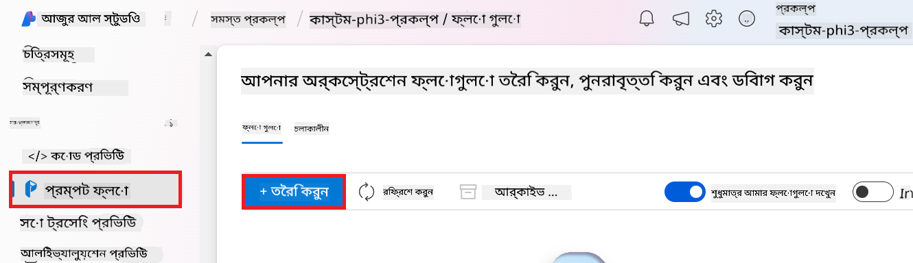

1. নেভিগেশন মেনু থেকে **Chat flow** নির্বাচন করুন।

    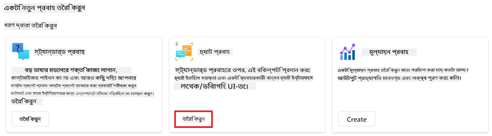

1. ব্যবহার করার জন্য **Folder name** লিখুন।

    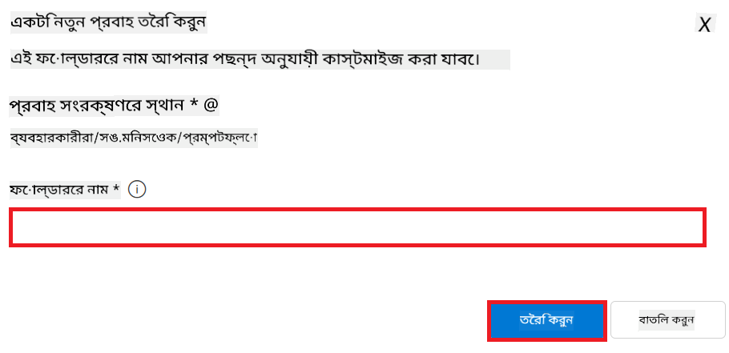

1. নির্বাচন করুন **Create**।

#### আপনার কাস্টম Phi-3 / Phi-3.5 মডেলের সাথে চ্যাট করার জন্য Prompt flow সেট আপ করুন

আপনাকে fine-tuned Phi-3 / Phi-3.5 মডেলকে Prompt flow এর সাথে সংযুক্ত করতে হবে। তবে, বিদ্যমান Prompt flow এই উদ্দেশ্যে তৈরি নয়। তাই, আপনাকে Prompt flow পুনরায় ডিজাইন করতে হবে যাতে কাস্টম মডেল ইন্টিগ্রেট করা যায়।

1. Prompt flow তে নিম্নলিখিত কাজগুলি করে বিদ্যমান flow পুনর্গঠন করুন:

    - নির্বাচন করুন **Raw file mode**।
    - *flow.dag.yml* ফাইলে থাকা সমস্ত কোড মুছে ফেলুন।
    - *flow.dag.yml* ফাইলে নিম্নলিখিত কোড যোগ করুন।

        ```yml
        inputs:
          input_data:
            type: string
            default: "Who founded Microsoft?"

        outputs:
          answer:
            type: string
            reference: ${integrate_with_promptflow.output}

        nodes:
        - name: integrate_with_promptflow
          type: python
          source:
            type: code
            path: integrate_with_promptflow.py
          inputs:
            input_data: ${inputs.input_data}
        ```

    - নির্বাচন করুন **Save**।

    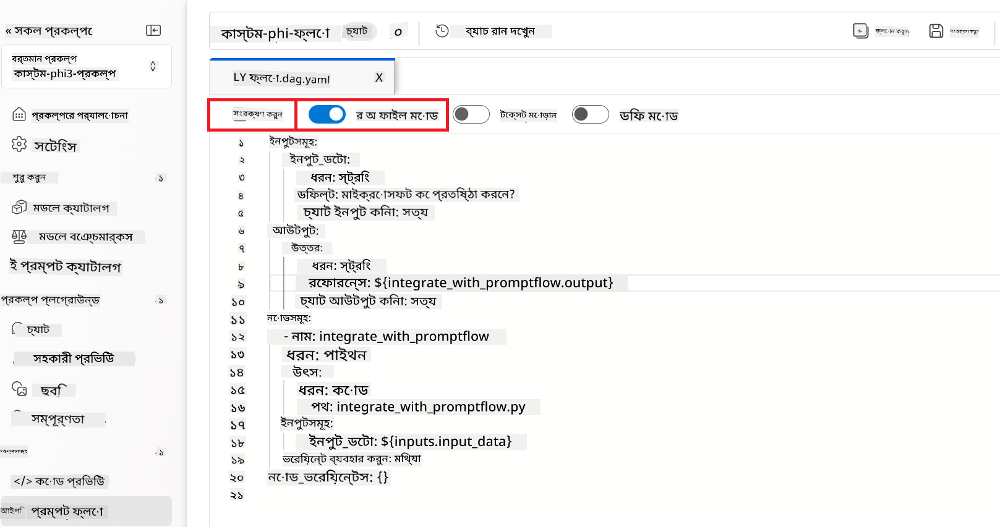

1. *integrate_with_promptflow.py* ফাইলে নিম্নলিখিত কোড যোগ করুন যাতে Prompt flow এ কাস্টম Phi-3 / Phi-3.5 মডেল ব্যবহার করা যায়।

    ```python
    import logging
    import requests
    from promptflow import tool
    from promptflow.connections import CustomConnection

    # Logging setup
    logging.basicConfig(
        format="%(asctime)s - %(levelname)s - %(name)s - %(message)s",
        datefmt="%Y-%m-%d %H:%M:%S",
        level=logging.DEBUG
    )
    logger = logging.getLogger(__name__)

    def query_phi3_model(input_data: str, connection: CustomConnection) -> str:
        """
        Send a request to the Phi-3 / Phi-3.5 model endpoint with the given input data using Custom Connection.
        """

        # "connection" is the name of the Custom Connection, "endpoint", "key" are the keys in the Custom Connection
        endpoint_url = connection.endpoint
        api_key = connection.key

        headers = {
            "Content-Type": "application/json",
            "Authorization": f"Bearer {api_key}"
        }
    data = {
        "input_data": [input_data],
        "params": {
            "temperature": 0.7,
            "max_new_tokens": 128,
            "do_sample": True,
            "return_full_text": True
            }
        }
        try:
            response = requests.post(endpoint_url, json=data, headers=headers)
            response.raise_for_status()
            
            # Log the full JSON response
            logger.debug(f"Full JSON response: {response.json()}")

            result = response.json()["output"]
            logger.info("Successfully received response from Azure ML Endpoint.")
            return result
        except requests.exceptions.RequestException as e:
            logger.error(f"Error querying Azure ML Endpoint: {e}")
            raise

    @tool
    def my_python_tool(input_data: str, connection: CustomConnection) -> str:
        """
        Tool function to process input data and query the Phi-3 / Phi-3.5 model.
        """
        return query_phi3_model(input_data, connection)

    ```

    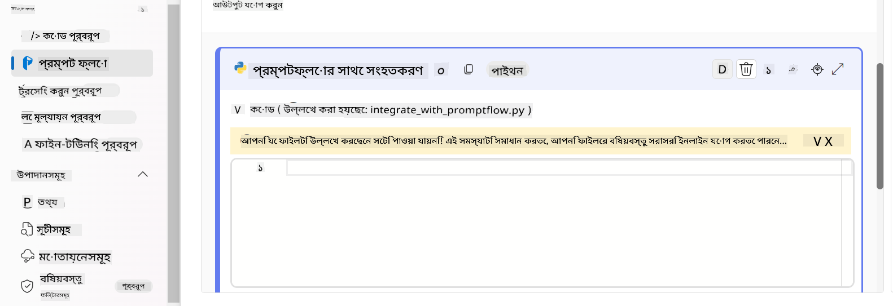

> [!NOTE]
> Azure AI Foundry তে Prompt flow ব্যবহারের বিস্তারিত তথ্যের জন্য, আপনি দেখতে পারেন [Prompt flow in Azure AI Foundry](https://learn.microsoft.com/azure/ai-studio/how-to/prompt-flow)।

1. আপনার মডেলের সাথে চ্যাট চালু করতে **Chat input**, **Chat output** নির্বাচন করুন।

    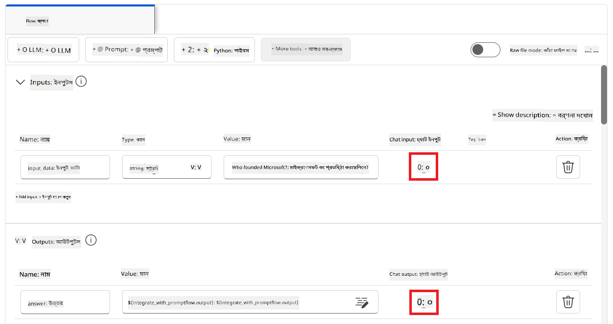

1. এখন আপনি আপনার কাস্টম Phi-3 / Phi-3.5 মডেলের সাথে চ্যাট করার জন্য প্রস্তুত। পরবর্তী অনুশীলনে, আপনি শিখবেন কীভাবে Prompt flow শুরু করবেন এবং fine-tuned Phi-3 / Phi-3.5 মডেলের সাথে চ্যাট করতে এটি ব্যবহার করবেন।

> [!NOTE]
>
> পুনর্গঠিত flow নিচের ছবির মতো হওয়া উচিত:
>
> 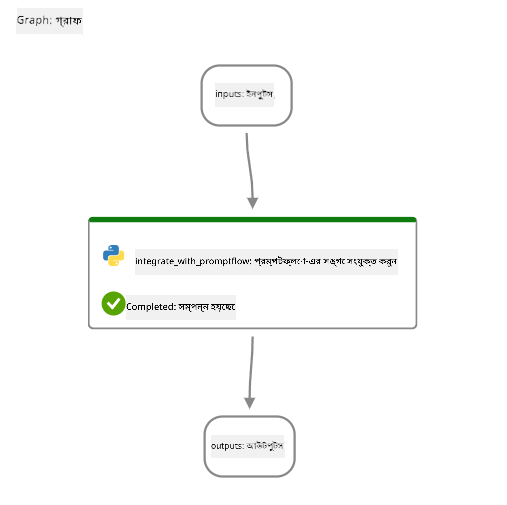
>

#### Prompt flow শুরু করুন

1. Prompt flow শুরু করতে **Start compute sessions** নির্বাচন করুন।

    

1. প্যারামিটার নবায়নের জন্য **Validate and parse input** নির্বাচন করুন।

    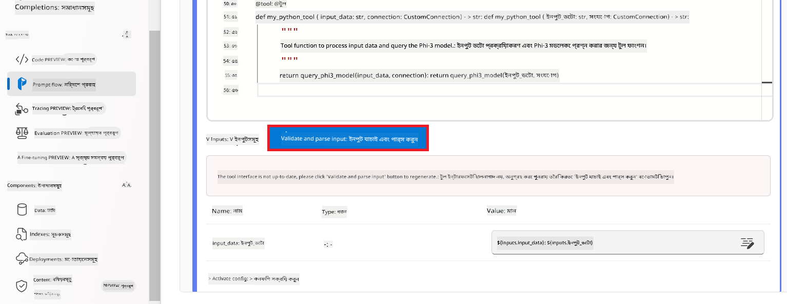

1. আপনি যে কাস্টম সংযোগ তৈরি করেছেন তার **connection** এর মান নির্বাচন করুন। যেমন, *connection*।

    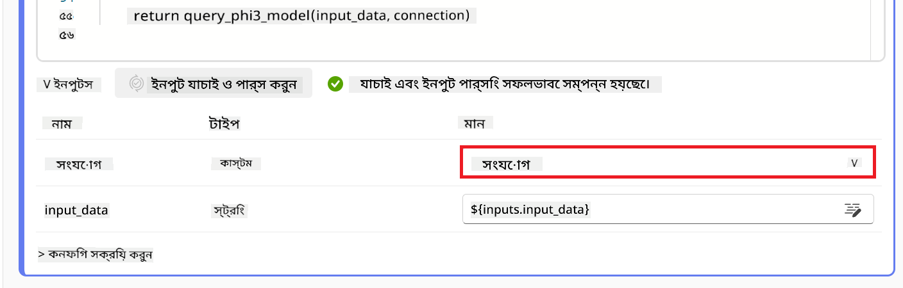

#### আপনার কাস্টম Phi-3 / Phi-3.5 মডেলের সাথে চ্যাট করুন

1. নির্বাচন করুন **Chat**।

    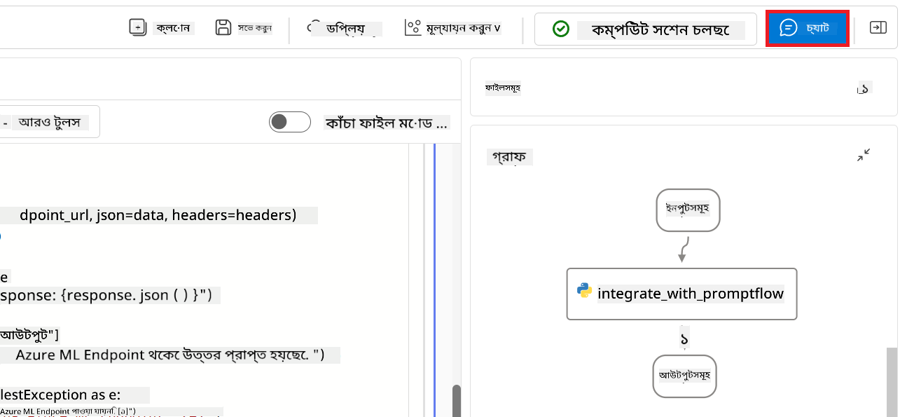

1. এখানে একটি ফলাফলের উদাহরণ দেওয়া হলো: এখন আপনি আপনার কাস্টম Phi-3 / Phi-3.5 মডেলের সাথে চ্যাট করতে পারবেন। fine-tuning এর জন্য ব্যবহৃত ডেটার ভিত্তিতে প্রশ্ন করা উত্তম।

    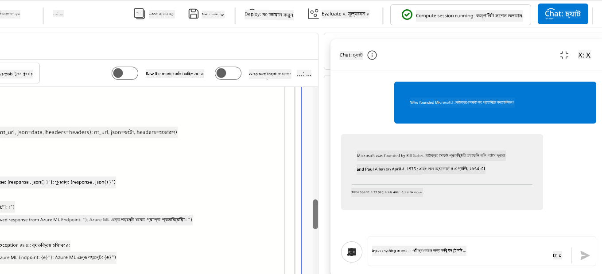

### Phi-3 / Phi-3.5 মডেল মূল্যায়নের জন্য Azure OpenAI ডিপ্লয় করুন

Azure AI Foundry তে Phi-3 / Phi-3.5 মডেল মূল্যায়নের জন্য আপনাকে একটি Azure OpenAI মডেল ডিপ্লয় করতে হবে। এই মডেলটি Phi-3 / Phi-3.5 মডেলের পারফরম্যান্স মূল্যায়নের জন্য ব্যবহৃত হবে।

#### Azure OpenAI ডিপ্লয় করুন

1. সাইন ইন করুন [Azure AI Foundry](https://ai.azure.com/?wt.mc_id=studentamb_279723)।

1. আপনি যে Azure AI Foundry প্রকল্প তৈরি করেছেন সেখানে যান।

    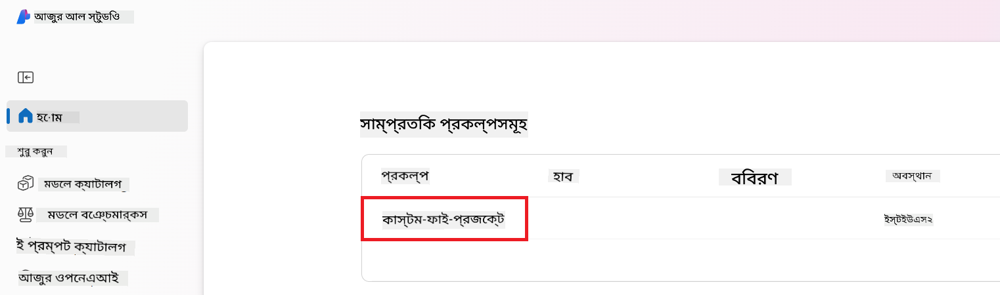

1. আপনার তৈরি প্রকল্পে, বাম পাশের ট্যাব থেকে **Deployments** নির্বাচন করুন।

1. নেভিগেশন মেনু থেকে **+ Deploy model** নির্বাচন করুন।

1. নির্বাচন করুন **Deploy base model**।

    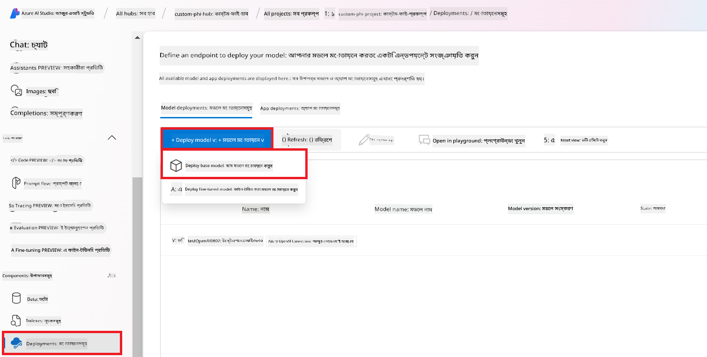

1. আপনি যে Azure OpenAI মডেল ব্যবহার করতে চান তা নির্বাচন করুন। যেমন, **gpt-4o**।

    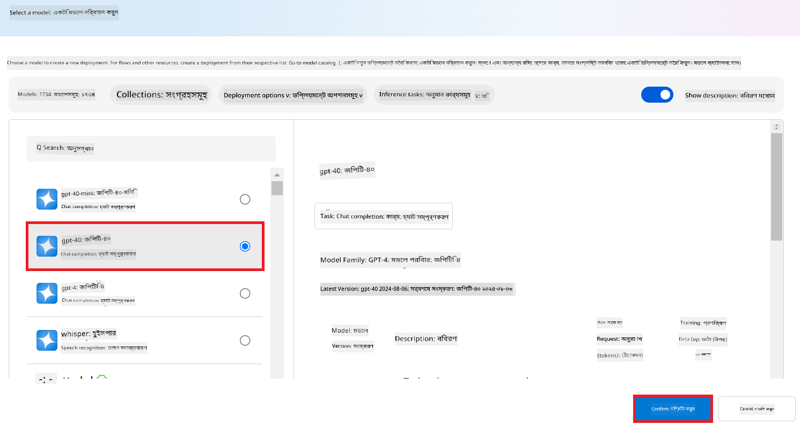

1. নির্বাচন করুন **Confirm**।

### Azure AI Foundry এর Prompt flow মূল্যায়ন ব্যবহার করে fine-tuned Phi-3 / Phi-3.5 মডেল মূল্যায়ন করুন

### নতুন একটি মূল্যায়ন শুরু করুন

1. যান [Azure AI Foundry](https://ai.azure.com/?wt.mc_id=studentamb_279723)।

1. আপনি যে Azure AI Foundry প্রকল্প তৈরি করেছেন সেখানে যান।

    

1. আপনার তৈরি প্রকল্পে, বাম পাশের ট্যাব থেকে **Evaluation** নির্বাচন করুন।

1. নেভিগেশন মেনু থেকে **+ New evaluation** নির্বাচন করুন।
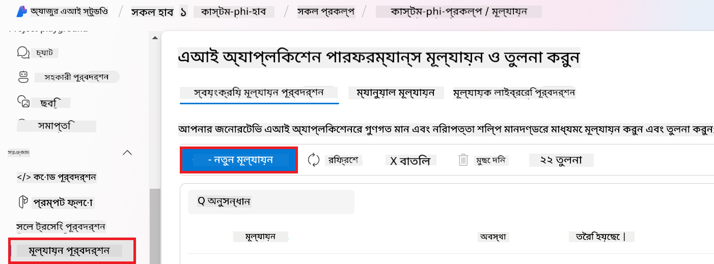

1. **Prompt flow** মূল্যায়ন নির্বাচন করুন।

    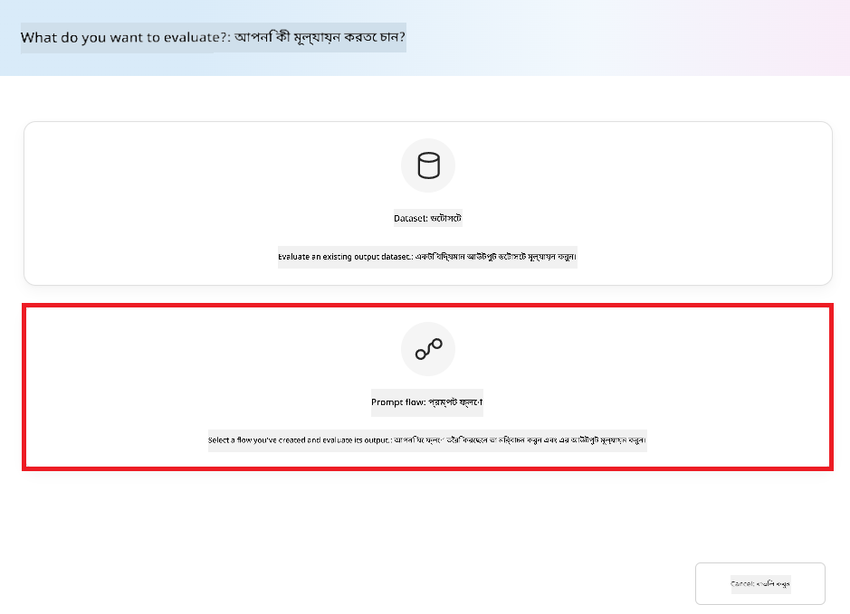

1. নিম্নলিখিত কাজগুলি করুন:

    - মূল্যায়নের নাম লিখুন। এটি একটি অনন্য মান হতে হবে।
    - টাস্ক টাইপ হিসেবে **Question and answer without context** নির্বাচন করুন। কারণ, এই টিউটোরিয়ালে ব্যবহৃত **UlTRACHAT_200k** ডেটাসেটে প্রসঙ্গ (context) নেই।
    - আপনি যে prompt flow মূল্যায়ন করতে চান তা নির্বাচন করুন।

    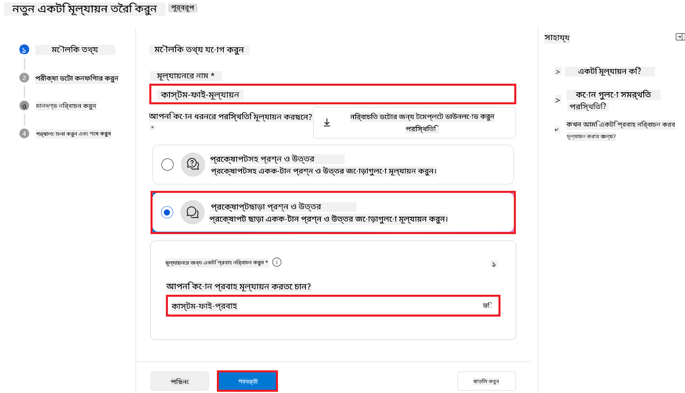

1. **Next** নির্বাচন করুন।

1. নিম্নলিখিত কাজগুলি করুন:

    - ডেটাসেট আপলোড করতে **Add your dataset** নির্বাচন করুন। উদাহরণস্বরূপ, আপনি **ULTRACHAT_200k** ডেটাসেট ডাউনলোড করার সময় অন্তর্ভুক্ত *test_data.json1* ফাইলটি আপলোড করতে পারেন।
    - আপনার ডেটাসেটের সাথে মিল রেখে উপযুক্ত **Dataset column** নির্বাচন করুন। উদাহরণস্বরূপ, **ULTRACHAT_200k** ডেটাসেট ব্যবহার করলে, **${data.prompt}** নির্বাচন করুন।

    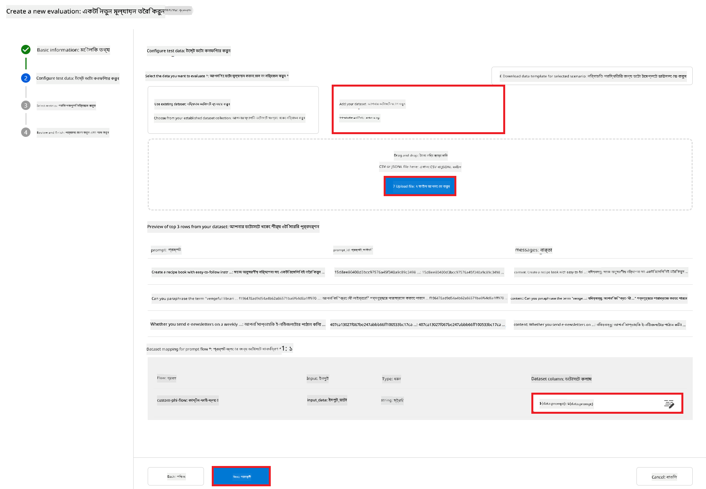

1. **Next** নির্বাচন করুন।

1. কর্মক্ষমতা ও গুণগত মানের মেট্রিক্স কনফিগার করতে নিম্নলিখিত কাজগুলি করুন:

    - আপনি যেসব কর্মক্ষমতা ও গুণগত মানের মেট্রিক্স ব্যবহার করতে চান সেগুলো নির্বাচন করুন।
    - মূল্যায়নের জন্য আপনি যে Azure OpenAI মডেল তৈরি করেছেন তা নির্বাচন করুন। উদাহরণস্বরূপ, **gpt-4o** নির্বাচন করুন।

    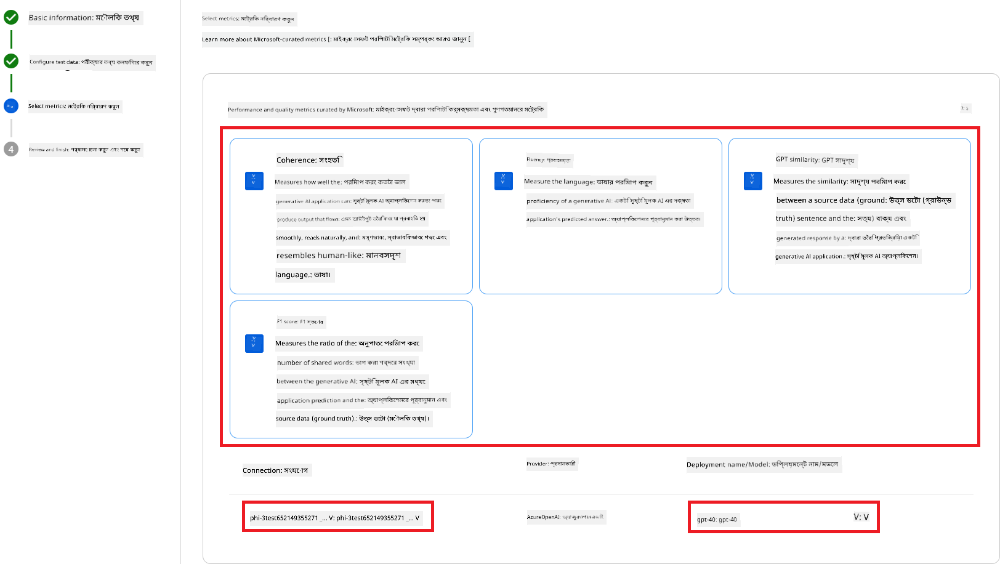

1. ঝুঁকি ও নিরাপত্তা মেট্রিক্স কনফিগার করতে নিম্নলিখিত কাজগুলি করুন:

    - আপনি যেসব ঝুঁকি ও নিরাপত্তা মেট্রিক্স ব্যবহার করতে চান সেগুলো নির্বাচন করুন।
    - ত্রুটি হার গণনার জন্য যে থ্রেশহোল্ড ব্যবহার করতে চান তা নির্বাচন করুন। উদাহরণস্বরূপ, **Medium** নির্বাচন করুন।
    - **question** এর জন্য, **Data source** নির্বাচন করুন **{$data.prompt}**।
    - **answer** এর জন্য, **Data source** নির্বাচন করুন **{$run.outputs.answer}**।
    - **ground_truth** এর জন্য, **Data source** নির্বাচন করুন **{$data.message}**।

    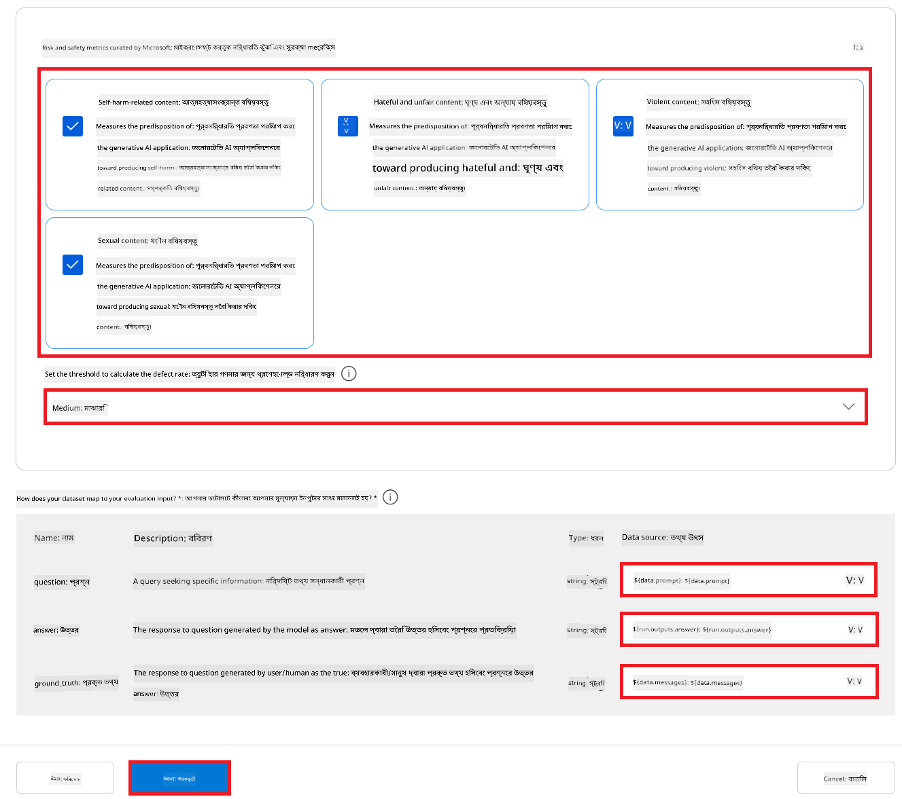

1. **Next** নির্বাচন করুন।

1. মূল্যায়ন শুরু করতে **Submit** নির্বাচন করুন।

1. মূল্যায়ন সম্পন্ন হতে কিছু সময় লাগবে। আপনি **Evaluation** ট্যাবে অগ্রগতি পর্যবেক্ষণ করতে পারবেন।

### মূল্যায়নের ফলাফল পর্যালোচনা করুন

> [!NOTE]
> নিচে প্রদর্শিত ফলাফলগুলি মূল্যায়ন প্রক্রিয়া বোঝানোর জন্য দেয়া হয়েছে। এই টিউটোরিয়ালে আমরা একটি তুলনামূলক ছোট ডেটাসেটে ফাইন-টিউন করা মডেল ব্যবহার করেছি, যা পরিপূর্ণ ফলাফল নাও দিতে পারে। প্রকৃত ফলাফল ডেটাসেটের আকার, গুণগত মান, বৈচিত্র্য এবং মডেলের নির্দিষ্ট কনফিগারেশনের উপর অনেকটাই নির্ভর করে।

মূল্যায়ন শেষ হলে, আপনি কর্মক্ষমতা এবং নিরাপত্তা উভয় মেট্রিক্সের ফলাফল পর্যালোচনা করতে পারবেন।

1. কর্মক্ষমতা ও গুণগত মানের মেট্রিক্স:

    - মডেল কতটা সুসংগত, সাবলীল এবং প্রাসঙ্গিক উত্তর তৈরি করতে সক্ষম তা মূল্যায়ন করুন।

    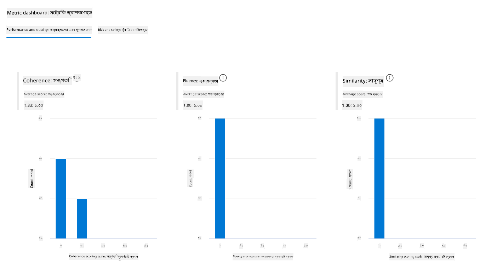

1. ঝুঁকি ও নিরাপত্তা মেট্রিক্স:

    - নিশ্চিত করুন মডেলের আউটপুট নিরাপদ এবং Responsible AI নীতিমালা অনুসরণ করে, যাতে কোনো ক্ষতিকর বা আপত্তিকর বিষয়বস্তু না থাকে।

    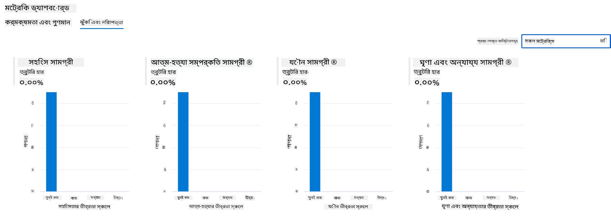

1. **Detailed metrics result** দেখতে নিচে স্ক্রল করুন।

    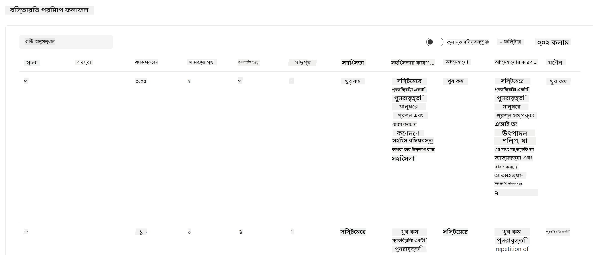

1. আপনার কাস্টম Phi-3 / Phi-3.5 মডেল কর্মক্ষমতা এবং নিরাপত্তা মেট্রিক্স উভয়ের বিরুদ্ধে মূল্যায়ন করে, আপনি নিশ্চিত হতে পারেন মডেলটি শুধু কার্যকর নয়, বরং দায়িত্বশীল AI অনুশীলন মেনে চলে এবং বাস্তব ব্যবহারের জন্য প্রস্তুত।

## অভিনন্দন!

### আপনি এই টিউটোরিয়াল সম্পন্ন করেছেন

আপনি সফলভাবে Azure AI Foundry-তে Prompt flow এর সাথে সংযুক্ত ফাইন-টিউন করা Phi-3 মডেল মূল্যায়ন করেছেন। এটি একটি গুরুত্বপূর্ণ ধাপ যা নিশ্চিত করে যে আপনার AI মডেলগুলি কেবল ভাল কর্মক্ষমতা প্রদর্শন করে না, বরং Microsoft-এর Responsible AI নীতিমালা মেনে চলে, যাতে আপনি বিশ্বাসযোগ্য ও নির্ভরযোগ্য AI অ্যাপ্লিকেশন তৈরি করতে পারেন।


## Azure রিসোর্সগুলি পরিষ্কার করুন

অতিরিক্ত চার্জ এড়াতে আপনার Azure রিসোর্সগুলি পরিষ্কার করুন। Azure পোর্টালে যান এবং নিম্নলিখিত রিসোর্সগুলি মুছে ফেলুন:

- Azure Machine learning রিসোর্স।
- Azure Machine learning মডেল এন্ডপয়েন্ট।
- Azure AI Foundry Project রিসোর্স।
- Azure AI Foundry Prompt flow রিসোর্স।

### পরবর্তী ধাপ

#### ডকুমেন্টেশন

- [Assess AI systems by using the Responsible AI dashboard](https://learn.microsoft.com/azure/machine-learning/concept-responsible-ai-dashboard?view=azureml-api-2&source=recommendations?wt.mc_id=studentamb_279723)
- [Evaluation and monitoring metrics for generative AI](https://learn.microsoft.com/azure/ai-studio/concepts/evaluation-metrics-built-in?tabs=definition?wt.mc_id=studentamb_279723)
- [Azure AI Foundry documentation](https://learn.microsoft.com/azure/ai-studio/?wt.mc_id=studentamb_279723)
- [Prompt flow documentation](https://microsoft.github.io/promptflow/?wt.mc_id=studentamb_279723)

#### প্রশিক্ষণ বিষয়বস্তু

- [Introduction to Microsoft's Responsible AI Approach](https://learn.microsoft.com/training/modules/introduction-to-microsofts-responsible-ai-approach/?source=recommendations?wt.mc_id=studentamb_279723)
- [Introduction to Azure AI Foundry](https://learn.microsoft.com/training/modules/introduction-to-azure-ai-studio/?wt.mc_id=studentamb_279723)

### রেফারেন্স

- [What is Responsible AI?](https://learn.microsoft.com/azure/machine-learning/concept-responsible-ai?view=azureml-api-2?wt.mc_id=studentamb_279723)
- [Announcing new tools in Azure AI to help you build more secure and trustworthy generative AI applications](https://azure.microsoft.com/blog/announcing-new-tools-in-azure-ai-to-help-you-build-more-secure-and-trustworthy-generative-ai-applications/?wt.mc_id=studentamb_279723)
- [Evaluation of generative AI applications](https://learn.microsoft.com/azure/ai-studio/concepts/evaluation-approach-gen-ai?wt.mc_id%3Dstudentamb_279723)

**বিজ্ঞপ্তি**:  
এই নথিটি AI অনুবাদ সেবা [Co-op Translator](https://github.com/Azure/co-op-translator) ব্যবহার করে অনূদিত হয়েছে। আমরা যথাসাধ্য সঠিকতার চেষ্টা করি, তবে স্বয়ংক্রিয় অনুবাদে ভুল বা অসঙ্গতি থাকতে পারে। মূল নথিটি তার নিজ ভাষায়ই কর্তৃপক্ষের উৎস হিসেবে বিবেচিত হওয়া উচিত। গুরুত্বপূর্ণ তথ্যের জন্য পেশাদার মানব অনুবাদের পরামর্শ দেওয়া হয়। এই অনুবাদ ব্যবহারের ফলে সৃষ্ট কোনো ভুলবোঝাবুঝি বা ভুল ব্যাখ্যার জন্য আমরা দায়বদ্ধ নই।