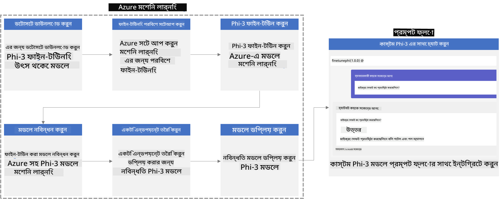
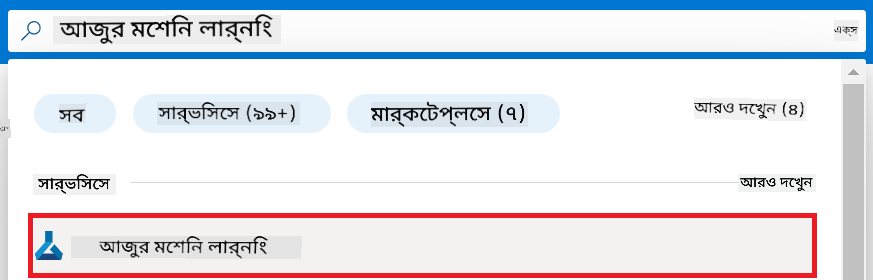
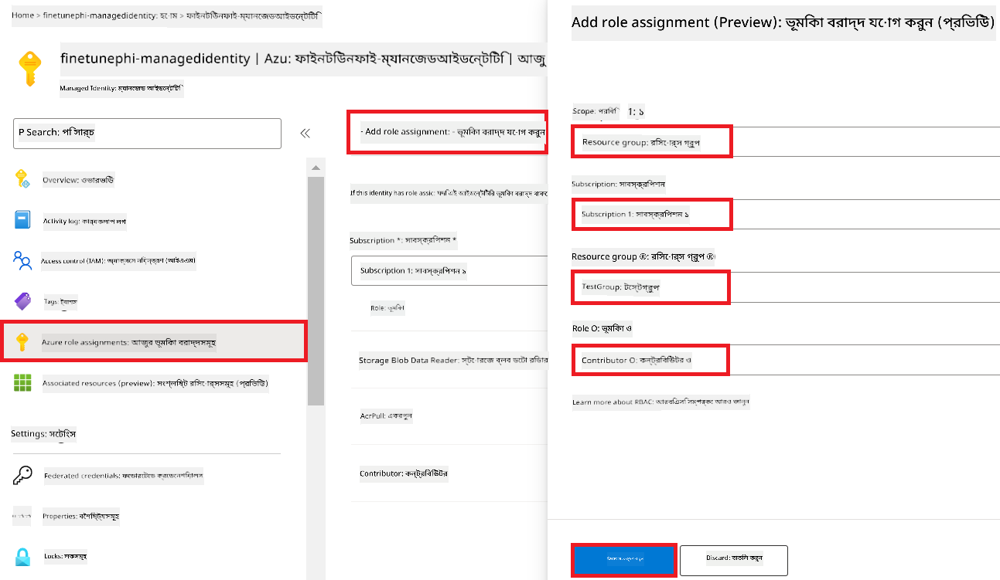
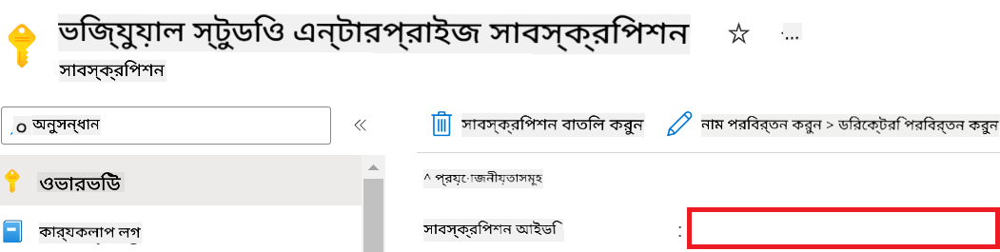

<!--
CO_OP_TRANSLATOR_METADATA:
{
  "original_hash": "7ca2c30fdb802664070e9cfbf92e24fe",
  "translation_date": "2026-01-05T01:51:01+00:00",
  "source_file": "md/02.Application/01.TextAndChat/Phi3/E2E_Phi-3-FineTuning_PromptFlow_Integration.md",
  "language_code": "bn"
}
-->
# কাস্টম Phi-3 মডেলগুলোকে ফাইন-টিউন এবং Prompt flow-এর সাথে একীভূত করুন

এই end-to-end (E2E) নমুনাটি Microsoft Tech Community-এর গাইড "[Phi-3 মডেলগুলোকে Prompt Flow-এর সাথে ফাইন-টিউন এবং একীভূত করা: ধাপে ধাপে গাইড](https://techcommunity.microsoft.com/t5/educator-developer-blog/fine-tune-and-integrate-custom-phi-3-models-with-prompt-flow/ba-p/4178612?WT.mc_id=aiml-137032-kinfeylo)"-এর উপর ভিত্তি করে। এটি কাস্টম Phi-3 মডেলগুলোকে ফাইন-টিউন, ডিপ্লয় এবং Prompt flow-এর সাথে ইন্টিগ্রেট করার প্রক্রিয়াগুলি পরিচয় করায়।

## ওভারভিউ

এই E2E নমুনায় আপনি শিখবেন কীভাবে Phi-3 মডেলকে ফাইন-টিউন করে সেটিকে Prompt flow-এর সাথে ইন্টিগ্রেট করা যায়। Azure Machine Learning এবং Prompt flow ব্যবহার করে আপনি কাস্টম AI মডেলগুলোর ডিপ্লয়মেন্ট ও ব্যবহার করার জন্য একটি ওয়ার্কফ্লো স্থাপন করবেন। এই E2E নমুনাটি তিনটি সিনারিওতে বিভক্ত:

**Scenario 1: Azure রিসোর্স সেট আপ এবং ফাইন-টিউনিং-এর জন্য প্রস্তুতি**

**Scenario 2: Phi-3 মডেল ফাইন-টিউন এবং Azure Machine Learning Studio তে ডিপ্লয়**

**Scenario 3: Prompt flow এর সাথে ইন্টিগ্রেট এবং আপনার কাস্টম মডেলের সাথে চ্যাট করা**

এখানে এই E2E নমুনাটির একটি ওভারভিউ দেওয়া হল।



### সূচিপত্র

1. **[Scenario 1: Azure রিসোর্স সেট আপ এবং ফাইন-টিউনিং-এর জন্য প্রস্তুতি](../../../../../../md/02.Application/01.TextAndChat/Phi3)**
    - [একটি Azure Machine Learning ওয়ার্কস্পেস তৈরি করুন](../../../../../../md/02.Application/01.TextAndChat/Phi3)
    - [Azure সাবস্ক্রিপশনে GPU কোটা অনুরোধ করুন](../../../../../../md/02.Application/01.TextAndChat/Phi3)
    - [রোল অ্যাসাইনমেন্ট যোগ করুন](../../../../../../md/02.Application/01.TextAndChat/Phi3)
    - [প্রজেক্ট সেট আপ করুন](../../../../../../md/02.Application/01.TextAndChat/Phi3)
    - [ফাইন-টিউনিং-এর জন্য ডেটাসেট প্রস্তুত করুন](../../../../../../md/02.Application/01.TextAndChat/Phi3)

1. **[Scenario 2: Phi-3 মডেল ফাইন-টিউন এবং Azure Machine Learning Studio তে ডিপ্লয়](../../../../../../md/02.Application/01.TextAndChat/Phi3)**
    - [Azure CLI সেট আপ করুন](../../../../../../md/02.Application/01.TextAndChat/Phi3)
    - [Phi-3 মডেল ফাইন-টিউন করুন](../../../../../../md/02.Application/01.TextAndChat/Phi3)
    - [ফাইন-টিউন করা মডেলটি ডিপ্লয় করুন](../../../../../../md/02.Application/01.TextAndChat/Phi3)

1. **[Scenario 3: Prompt flow-এর সাথে ইন্টিগ্রেট এবং আপনার কাস্টম মডেলের সাথে চ্যাট করুন](../../../../../../md/02.Application/01.TextAndChat/Phi3)**
    - [কাস্টম Phi-3 মডেলটি Prompt flow-এর সাথে ইন্টিগ্রেট করুন](../../../../../../md/02.Application/01.TextAndChat/Phi3)
    - [আপনার কাস্টম মডেলের সাথে চ্যাট করুন](../../../../../../md/02.Application/01.TextAndChat/Phi3)

## Scenario 1: Azure রিসোর্স সেট আপ এবং ফাইন-টিউনিং-এর জন্য প্রস্তুতি

### একটি Azure Machine Learning ওয়ার্কস্পেস তৈরি করুন

1. পোর্টাল পৃষ্ঠার শীর্ষে থাকা **অনুসন্ধান বার**-এ *azure machine learning* টাইপ করুন এবং প্রদর্শিত বিকল্পগুলির মধ্যে থেকে **Azure Machine Learning** নির্বাচন করুন।

    

1. নেভিগেশন মেনু থেকে **+ Create** নির্বাচন করুন।

1. নেভিগেশন মেনু থেকে **New workspace** নির্বাচন করুন।

    

1. নিম্নলিখিত কাজগুলি সম্পন্ন করুন:

    - আপনার Azure **Subscription** নির্বাচন করুন।
    - যে **Resource group** ব্যবহার করবেন তা নির্বাচন করুন (প্রয়োজনে একটি নতুন তৈরী করুন)।
    - **Workspace Name** লিখুন। এটি একটি অনন্য মান হতে হবে।
    - আপনি যে **Region** ব্যবহার করতে চান তা নির্বাচন করুন।
    - যে **Storage account** ব্যবহার করবেন তা নির্বাচন করুন (প্রয়োজনে একটি নতুন তৈরী করুন)।
    - যে **Key vault** ব্যবহার করবেন তা নির্বাচন করুন (প্রয়োজনে একটি নতুন তৈরী করুন)।
    - যে **Application insights** ব্যবহার করবেন তা নির্বাচন করুন (প্রয়োজনে একটি নতুন তৈরী করুন)।
    - যে **Container registry** ব্যবহার করবেন তা নির্বাচন করুন (প্রয়োজনে একটি নতুন তৈরী করুন)।

    

1. **Review + Create** নির্বাচন করুন।

1. **Create** নির্বাচন করুন।

### Azure সাবস্ক্রিপশনে GPU কোটা অনুরোধ করুন

এই E2E নমুনায়, আপনি ফাইন-টিউনিং-এর জন্য *Standard_NC24ads_A100_v4 GPU* ব্যবহার করবেন, যা কোটা অনুরোধের প্রয়োজন, এবং ডিপ্লয়মেন্টের জন্য *Standard_E4s_v3* CPU ব্যবহার করবেন, যার জন্য কোটা অনুরোধের প্রয়োজন নেই।

> [!NOTE]
>
> কেবল Pay-As-You-Go সাবস্ক্রিপশন (স্ট্যান্ডার্ড সাবস্ক্রিপশন টাইপ) গুলোই GPU বরাদ্দের জন্য যোগ্য; বেনিফিট সাবস্ক্রিপশনগুলো বর্তমানে সমর্থিত নয়।
>
> যারা বেনিফিট সাবস্ক্রিপশন (যেমন Visual Studio Enterprise Subscription) ব্যবহার করছেন বা যারা দ্রুত ফাইন-টিউনিং এবং ডিপ্লয়মেন্ট প্রক্রিয়া পরীক্ষা করতে চান, তাদের জন্য এই টিউটোরিয়াল CPU ব্যবহার করে একটি ছোট ডেটাসেট দিয়ে ফাইন-টিউনিং করার নির্দেশনাও দেয়। যাইহোক, বড় ডেটাসেট এবং GPU ব্যবহার করলে ফাইন-টিউনিং ফলাফলগুলি উল্লেখযোগ্যভাবে উন্নত হয়।

1. [Azure ML Studio](https://ml.azure.com/home?wt.mc_id=studentamb_279723) পরিদর্শন করুন।

1. *Standard NCADSA100v4 Family* কোটার জন্য অনুরোধ করতে নিম্নলিখিত কাজগুলি সম্পন্ন করুন:

    - বাম পাশে থাকা ট্যাবে **Quota** নির্বাচন করুন।
    - ব্যবহার করতে চাইলে **Virtual machine family** নির্বাচন করুন। উদাহরণস্বরূপ, **Standard NCADSA100v4 Family Cluster Dedicated vCPUs** নির্বাচন করুন, যা *Standard_NC24ads_A100_v4* GPU-টি অন্তর্ভুক্ত করে।
    - নেভিগেশন মেনু থেকে **Request quota** নির্বাচন করুন।

        

    - Request quota পৃষ্ঠার মধ্যে, আপনি যে **New cores limit** ব্যবহার করতে চান তা লিখুন। উদাহরণস্বরূপ, 24।
    - Request quota পৃষ্ঠার মধ্যে, GPU কোটার জন্য **Submit** নির্বাচন করুন।

> [!NOTE]
> আপনি আপনার চাহিদা অনুযায়ী উপযুক্ত GPU বা CPU নির্বাচন করতে [Sizes for Virtual Machines in Azure](https://learn.microsoft.com/azure/virtual-machines/sizes/overview?tabs=breakdownseries%2Cgeneralsizelist%2Ccomputesizelist%2Cmemorysizelist%2Cstoragesizelist%2Cgpusizelist%2Cfpgasizelist%2Chpcsizelist) ডকুমেন্টটি দেখতে পারেন।

### রোল অ্যাসাইনমেন্ট যোগ করুন

আপনার মডেলগুলি ফাইন-টিউন এবং ডিপ্লয় করার জন্য, আপনাকে প্রথমে একটি User Assigned Managed Identity (UAI) তৈরি করে এটিকে উপযুক্ত অনুমতিসহ অ্যাসাইন করতে হবে। এই UAI ডিপ্লয়মেন্টের সময় authentication-এর জন্য ব্যবহৃত হবে।

#### User Assigned Managed Identity (UAI) তৈরি করুন

1. পোর্টাল পৃষ্ঠার শীর্ষে থাকা **অনুসন্ধান বার**-এ *managed identities* টাইপ করুন এবং প্রদর্শিত বিকল্পগুলির মধ্যে থেকে **Managed Identities** নির্বাচন করুন।

    

1. **+ Create** নির্বাচন করুন।

    

1. নিম্নলিখিত কাজগুলি সম্পন্ন করুন:

    - আপনার Azure **Subscription** নির্বাচন করুন।
    - যে **Resource group** ব্যবহার করবেন তা নির্বাচন করুন (প্রয়োজনে একটি নতুন তৈরী করুন)।
    - আপনি যে **Region** ব্যবহার করতে চান তা নির্বাচন করুন।
    - **Name** লিখুন। এটি একটি অনন্য মান হতে হবে।

1. **Review + create** নির্বাচন করুন।

1. **+ Create** নির্বাচন করুন।

#### Managed Identity-তে Contributor রোল অ্যাসাইনমেন্ট যোগ করুন

1. আপনি যে Managed Identity তৈরি করেছেন সেই Managed Identity রিসোর্সে নেভিগেট করুন।

1. বাম পাশে থাকা ট্যাব থেকে **Azure role assignments** নির্বাচন করুন।

1. নেভিগেশন মেনু থেকে **+Add role assignment** নির্বাচন করুন।

1. Add role assignment পৃষ্ঠার ভিতরে, নিম্নলিখিত কাজগুলি সম্পন্ন করুন:
    - **Scope** হিসেবে **Resource group** নির্বাচন করুন।
    - আপনার Azure **Subscription** নির্বাচন করুন।
    - ব্যবহার করার জন্য **Resource group** নির্বাচন করুন।
    - **Role** হিসেবে **Contributor** নির্বাচন করুন।

    

1. **Save** নির্বাচন করুন।

#### Managed Identity-তে Storage Blob Data Reader রোল অ্যাসাইনমেন্ট যোগ করুন

1. পোর্টাল পৃষ্ঠার শীর্ষে থাকা **অনুসন্ধান বার**-এ *storage accounts* টাইপ করুন এবং প্রদর্শিত বিকল্পগুলির মধ্যে থেকে **Storage accounts** নির্বাচন করুন।

    

1. যে Storage accountটি Azure Machine Learning ওয়ার্কস্পেসের সাথে যুক্ত, সেই storage accountটি নির্বাচন করুন। উদাহরণস্বরূপ, *finetunephistorage*।

1. Add role assignment পৃষ্ঠায় নেভিগেট করতে নিম্নলিখিত কাজগুলি সম্পন্ন করুন:

    - আপনি যে Azure Storage account সৃষ্টি করেছেন তা নেভিগেট করুন।
    - বাম পাশে থাকা ট্যাবে **Access Control (IAM)** নির্বাচন করুন।
    - নেভিগেশন মেনু থেকে **+ Add** নির্বাচন করুন।
    - নেভিগেশন মেনু থেকে **Add role assignment** নির্বাচন করুন।

    

1. Add role assignment পৃষ্ঠার ভিতরে, নিম্নলিখিত কাজগুলি সম্পন্ন করুন:

    - Role পৃষ্ঠার ভিতরে, **search bar**-এ *Storage Blob Data Reader* টাইপ করুন এবং প্রদর্শিত বিকল্পগুলির মধ্যে থেকে **Storage Blob Data Reader** নির্বাচন করুন।
    - Role পৃষ্ঠার ভিতরে, **Next** নির্বাচন করুন।
    - Members পৃষ্ঠার ভিতরে, **Assign access to** হিসেবে **Managed identity** নির্বাচন করুন।
    - Members পৃষ্ঠার ভিতরে, **+ Select members** নির্বাচন করুন।
    - Select managed identities পৃষ্ঠার ভিতরে, আপনার Azure **Subscription** নির্বাচন করুন।
    - Select managed identities পৃষ্ঠার ভিতরে, **Managed identity** হিসেবে **Manage Identity** নির্বাচন করুন।
    - Select managed identities পৃষ্ঠার ভিতরে, আপনি যে Manage Identity তৈরি করেছেন তা নির্বাচন করুন। উদাহরণস্বরূপ, *finetunephi-managedidentity*।
    - Select managed identities পৃষ্ঠার ভিতরে, **Select** নির্বাচন করুন।

    

1. **Review + assign** নির্বাচন করুন।

#### Managed Identity-তে AcrPull রোল অ্যাসাইনমেন্ট যোগ করুন

1. পোর্টাল পৃষ্ঠার শীর্ষে থাকা **অনুসন্ধান বার**-এ *container registries* টাইপ করুন এবং প্রদর্শিত বিকল্পগুলির মধ্যে থেকে **Container registries** নির্বাচন করুন।

    

1. Azure Machine Learning ওয়ার্কস্পেসের সাথে যুক্ত container registryটি নির্বাচন করুন। উদাহরণস্বরূপ, *finetunephicontainerregistries*

1. Add role assignment পৃষ্ঠায় নেভিগেট করতে নিম্নলিখিত কাজগুলি সম্পন্ন করুন:

    - বাম পাশে থাকা ট্যাবে **Access Control (IAM)** নির্বাচন করুন।
    - নেভিগেশন মেনু থেকে **+ Add** নির্বাচন করুন।
    - নেভিগেশন মেনু থেকে **Add role assignment** নির্বাচন করুন।

1. Add role assignment পৃষ্ঠার ভিতরে, নিম্নলিখিত কাজগুলি সম্পন্ন করুন:

    - Role পৃষ্ঠার ভিতরে, **search bar**-এ *AcrPull* টাইপ করুন এবং প্রদর্শিত বিকল্পগুলির মধ্যে থেকে **AcrPull** নির্বাচন করুন।
    - Role পৃষ্ঠার ভিতরে, **Next** নির্বাচন করুন।
    - Members পৃষ্ঠার ভিতরে, **Assign access to** হিসেবে **Managed identity** নির্বাচন করুন।
    - Members পৃষ্ঠার ভিতরে, **+ Select members** নির্বাচন করুন।
    - Select managed identities পৃষ্ঠার ভিতরে, আপনার Azure **Subscription** নির্বাচন করুন।
    - Select managed identities পৃষ্ঠার ভিতরে, **Managed identity** হিসেবে **Manage Identity** নির্বাচন করুন।
    - Select managed identities পৃষ্ঠার ভিতরে, আপনি যে Manage Identity তৈরি করেছেন তা নির্বাচন করুন। উদাহরণস্বরূপ, *finetunephi-managedidentity*।
    - Select managed identities পৃষ্ঠার ভিতরে, **Select** নির্বাচন করুন।
    - **Review + assign** নির্বাচন করুন।

### প্রজেক্ট সেট আপ করুন

এখন, আপনি কাজ করার জন্য একটি ফোল্ডার তৈরি করবেন এবং একটি ভার্চুয়াল এনভায়রনমেন্ট সেট আপ করবেন যাতে একটি প্রোগ্রাম ডেভেলপ করা যায় যা ইউজারদের সাথে ইন্টারঅ্যাক্ট করে এবং Azure Cosmos DB-তে সংরক্ষিত চ্যাট ইতিহাস ব্যবহার করে প্রতিক্রিয়াগুলোকে তথ্যসমৃদ্ধ করে।

#### কাজ করার জন্য একটি ফোল্ডার তৈরি করুন

1. একটি টার্মিনাল উইন্ডো খুলুন এবং ডিফল্ট পাথে *finetune-phi* নামে একটি ফোল্ডার তৈরীর জন্য নিম্নলিখিত কমান্ড টাইপ করুন।

    ```console
    mkdir finetune-phi
    ```

1. আপনি তৈরি করা *finetune-phi* ফোল্ডারে নেভিগেট করার জন্য আপনার টার্মিনালে নিচের কমান্ডটি টাইপ করুন।

    ```console
    cd finetune-phi
    ```

#### একটি ভার্চুয়াল এনভায়রনমেন্ট তৈরি করুন

1. *.venv* নামে একটি ভার্চুয়াল এনভায়রনমেন্ট তৈরীর জন্য আপনার টার্মিনালে নিচের কমান্ডটি টাইপ করুন।

    ```console
    python -m venv .venv
    ```

1. ভার্চুয়াল এনভায়রনমেন্টটি সক্রিয় করার জন্য আপনার টার্মিনালে নিচের কমান্ডটি টাইপ করুন।

    ```console
    .venv\Scripts\activate.bat
    ```

> [!NOTE]
>
> যদি সফল হয়, আপনি কমান্ড প্রম্পটের আগে *(.venv)* দেখতে পাবেন।

#### প্রয়োজনীয় প্যাকেজগুলো ইনস্টল করুন

1. প্রয়োজনীয় প্যাকেজগুলো ইনস্টল করার জন্য আপনার টার্মিনালে নিম্নলিখিত কমান্ডগুলো টাইপ করুন।

    ```console
    pip install datasets==2.19.1
    pip install transformers==4.41.1
    pip install azure-ai-ml==1.16.0
    pip install torch==2.3.1
    pip install trl==0.9.4
    pip install promptflow==1.12.0
    ```

#### প্রজেক্ট ফাইলগুলো তৈরি করুন
In this exercise, you will create the essential files for our project. These files include scripts for downloading the dataset, setting up the Azure Machine Learning environment, fine-tuning the Phi-3 model, and deploying the fine-tuned model. You will also create a *conda.yml* file to set up the fine-tuning environment.

In this exercise, you will:

- Create a *download_dataset.py* file to download the dataset.
- Create a *setup_ml.py* file to set up the Azure Machine Learning environment.
- Create a *fine_tune.py* file in the *finetuning_dir* folder to fine-tune the Phi-3 model using the dataset.
- Create a *conda.yml* file to setup fine-tuning environment.
- Create a *deploy_model.py* file to deploy the fine-tuned model.
- Create a *integrate_with_promptflow.py* file, to integrate the fine-tuned model and execute the model using Prompt flow.
- Create a flow.dag.yml file, to set up the workflow structure for Prompt flow.
- Create a *config.py* file to enter Azure information.

> [!NOTE]
>
> সম্পূর্ণ ফোল্ডার কাঠামো:
>
> ```text
> └── YourUserName
> .    └── finetune-phi
> .        ├── finetuning_dir
> .        │      └── fine_tune.py
> .        ├── conda.yml
> .        ├── config.py
> .        ├── deploy_model.py
> .        ├── download_dataset.py
> .        ├── flow.dag.yml
> .        ├── integrate_with_promptflow.py
> .        └── setup_ml.py
> ```

1. Visual Studio Code খুলুন।

1. মেনু বারের থেকে **File** নির্বাচন করুন।

1. **Open Folder** নির্বাচন করুন।

1. আপনি যে *finetune-phi* ফোল্ডারটি তৈরি করেছেন তা নির্বাচন করুন, যা অবস্থিত *C:\Users\yourUserName\finetune-phi* এ।

    

1. Visual Studio Code-এর বাম প্যানে, রাইট-ক্লিক করে **New File** নির্বাচন করুন এবং *download_dataset.py* নামে একটি নতুন ফাইল তৈরি করুন।

1. Visual Studio Code-এর বাম প্যানে, রাইট-ক্লিক করে **New File** নির্বাচন করুন এবং *setup_ml.py* নামে একটি নতুন ফাইল তৈরি করুন।

1. Visual Studio Code-এর বাম প্যানে, রাইট-ক্লিক করে **New File** নির্বাচন করুন এবং *deploy_model.py* নামে একটি নতুন ফাইল তৈরি করুন।

    

1. Visual Studio Code-এর বাম প্যানে, রাইট-ক্লিক করে **New Folder** নির্বাচন করুন এবং *finetuning_dir* নামে একটি নতুন ফোল্ডার তৈরি করুন।

1. *finetuning_dir* ফোল্ডারের মধ্যে, *fine_tune.py* নামে একটি নতুন ফাইল তৈরি করুন।

#### Create and Configure *conda.yml* file

1. Visual Studio Code-এর বাম প্যানে, রাইট-ক্লিক করে **New File** নির্বাচন করুন এবং *conda.yml* নামে একটি নতুন ফাইল তৈরি করুন।

1. Phi-3 মডেলের জন্য ফাইন-টিউনিং পরিবেশ সেট আপ করতে নিম্নলিখিত কোডটি *conda.yml* ফাইলে যোগ করুন।

    ```yml
    name: phi-3-training-env
    channels:
      - defaults
      - conda-forge
    dependencies:
      - python=3.10
      - pip
      - numpy<2.0
      - pip:
          - torch==2.4.0
          - torchvision==0.19.0
          - trl==0.8.6
          - transformers==4.41
          - datasets==2.21.0
          - azureml-core==1.57.0
          - azure-storage-blob==12.19.0
          - azure-ai-ml==1.16
          - azure-identity==1.17.1
          - accelerate==0.33.0
          - mlflow==2.15.1
          - azureml-mlflow==1.57.0
    ```

#### Create and Configure *config.py* file

1. Visual Studio Code-এর বাম প্যানে, রাইট-ক্লিক করে **New File** নির্বাচন করুন এবং *config.py* নামে একটি নতুন ফাইল তৈরি করুন।

1. আপনার Azure তথ্য যোগ করতে নিম্নলিখিত কোডটি *config.py* ফাইলে যোগ করুন।

    ```python
    # অ্যাজিউর সেটিংস
    AZURE_SUBSCRIPTION_ID = "your_subscription_id"
    AZURE_RESOURCE_GROUP_NAME = "your_resource_group_name" # "টেস্টগ্রুপ"

    # অ্যাজিউর মেশিন লার্নিং সেটিংস
    AZURE_ML_WORKSPACE_NAME = "your_workspace_name" # "ফাইনটিউনফাই-ওয়ার্কস্পেস"

    # অ্যাজিউর ম্যানেজড আইডেন্টিটি সেটিংস
    AZURE_MANAGED_IDENTITY_CLIENT_ID = "your_azure_managed_identity_client_id"
    AZURE_MANAGED_IDENTITY_NAME = "your_azure_managed_identity_name" # "ফাইনটিউনফাই-ম্যানগেডআইডেন্টিটি"
    AZURE_MANAGED_IDENTITY_RESOURCE_ID = f"/subscriptions/{AZURE_SUBSCRIPTION_ID}/resourceGroups/{AZURE_RESOURCE_GROUP_NAME}/providers/Microsoft.ManagedIdentity/userAssignedIdentities/{AZURE_MANAGED_IDENTITY_NAME}"

    # ডেটাসেট ফাইলের পথ
    TRAIN_DATA_PATH = "data/train_data.jsonl"
    TEST_DATA_PATH = "data/test_data.jsonl"

    # ফাইন-টিউনকৃত মডেল সেটিংস
    AZURE_MODEL_NAME = "your_fine_tuned_model_name" # "ফাইনটিউন-ফাই-মডেল"
    AZURE_ENDPOINT_NAME = "your_fine_tuned_model_endpoint_name" # "ফাইনটিউন-ফাই-এন্ডপয়েন্ট"
    AZURE_DEPLOYMENT_NAME = "your_fine_tuned_model_deployment_name" # "ফাইনটিউন-ফাই-ডিপ্লয়মেন্ট"

    AZURE_ML_API_KEY = "your_fine_tuned_model_api_key"
    AZURE_ML_ENDPOINT = "your_fine_tuned_model_endpoint_uri" # "https://{আপনার-এন্ডপয়েন্ট-নাম}.{আপনার-রিজিয়ন}.ইনফারেন্স.এমএল.অ্যাজিউর.কম/স্কোর"
    ```

#### Add Azure environment variables

1. Azure Subscription ID যোগ করতে নিম্নলিখিত কাজগুলো করুন:

    - পোর্টাল পৃষ্ঠার উপরের **search bar**-এ *subscriptions* টাইপ করে প্রদর্শিত অপশনগুলোর মধ্যে থেকে **Subscriptions** নির্বাচন করুন।
    - আপনি যে Azure Subscription ব্যবহার করছেন তা নির্বাচন করুন।
    - আপনার Subscription ID কপি করে *config.py* ফাইলে পেস্ট করুন।

    

1. Azure Workspace Name যোগ করতে নিম্নলিখিত কাজগুলো করুন:

    - আপনি যে Azure Machine Learning রিসোর্স তৈরি করেছেন সেটিতে নেভিগেট করুন।
    - আপনার অ্যাকাউন্টের নাম কপি করে *config.py* ফাইলে পেস্ট করুন।

    

1. Azure Resource Group Name যোগ করতে নিম্নলিখিত কাজগুলো করুন:

    - আপনি যে Azure Machine Learning রিসোর্স তৈরি করেছেন সেটিতে নেভিগেট করুন।
    - আপনার Azure Resource Group Name কপি করে *config.py* ফাইলে পেস্ট করুন।

    

2. Azure Managed Identity নাম যোগ করতে নিম্নলিখিত কাজগুলো করুন:

    - আপনি যে Managed Identities রিসোর্স তৈরি করেছেন সেখানে নেভিগেট করুন।
    - আপনার Azure Managed Identity নাম কপি করে *config.py* ফাইলে পেস্ট করুন।

    

### Prepare dataset for fine-tuning

এই অনুশীলনে, আপনি *download_dataset.py* ফাইলটি চালিয়ে *ULTRACHAT_200k* ডেটাসেটগুলি আপনার লোকাল পরিবেশে ডাউনলোড করবেন। এরপর আপনি এই ডেটাসেট ব্যবহার করে Azure Machine Learning-এ Phi-3 মডেল ফাইন-টিউন করবেন।

#### Download your dataset using *download_dataset.py*

1. Visual Studio Code-এ *download_dataset.py* ফাইলটি খুলুন।

1. *download_dataset.py* ফাইলে নিম্নলিখিত কোডটি যোগ করুন।

    ```python
    import json
    import os
    from datasets import load_dataset
    from config import (
        TRAIN_DATA_PATH,
        TEST_DATA_PATH)

    def load_and_split_dataset(dataset_name, config_name, split_ratio):
        """
        Load and split a dataset.
        """
        # নির্দিষ্ট নাম, কনফিগারেশন, এবং বিভাজন অনুপাত সহ ডেটাসেট লোড করুন
        dataset = load_dataset(dataset_name, config_name, split=split_ratio)
        print(f"Original dataset size: {len(dataset)}")
        
        # ডেটাসেটকে ট্রেন এবং টেস্ট সেটে ভাগ করুন (80% ট্রেন, 20% টেস্ট)
        split_dataset = dataset.train_test_split(test_size=0.2)
        print(f"Train dataset size: {len(split_dataset['train'])}")
        print(f"Test dataset size: {len(split_dataset['test'])}")
        
        return split_dataset

    def save_dataset_to_jsonl(dataset, filepath):
        """
        Save a dataset to a JSONL file.
        """
        # ডিরেক্টরি না থাকলে তৈরি করুন
        os.makedirs(os.path.dirname(filepath), exist_ok=True)
        
        # ফাইলটি লেখার মোডে খুলুন
        with open(filepath, 'w', encoding='utf-8') as f:
            # ডেটাসেটের প্রতিটি রেকর্ডের ওপর ইটারেট করুন
            for record in dataset:
                # রেকর্ডটি JSON অবজেক্ট হিসেবে ডাম্প করে ফাইলে লিখুন
                json.dump(record, f)
                # রেকর্ডগুলো আলাদা করতে একটি নিউলাইন অক্ষর লিখুন
                f.write('\n')
        
        print(f"Dataset saved to {filepath}")

    def main():
        """
        Main function to load, split, and save the dataset.
        """
        # একটি নির্দিষ্ট কনফিগারেশন এবং বিভাজন অনুপাত দিয়ে ULTRACHAT_200k ডেটাসেট লোড এবং ভাগ করুন
        dataset = load_and_split_dataset("HuggingFaceH4/ultrachat_200k", 'default', 'train_sft[:1%]')
        
        # ভাগ থেকে ট্রেন এবং টেস্ট ডেটাসেটগুলো বের করুন
        train_dataset = dataset['train']
        test_dataset = dataset['test']

        # ট্রেন ডেটাসেটকে একটি JSONL ফাইলে সংরক্ষণ করুন
        save_dataset_to_jsonl(train_dataset, TRAIN_DATA_PATH)
        
        # টেস্ট ডেটাসেটকে আলাদা একটি JSONL ফাইলে সংরক্ষণ করুন
        save_dataset_to_jsonl(test_dataset, TEST_DATA_PATH)

    if __name__ == "__main__":
        main()

    ```

> [!TIP]
>
> **CPU ব্যবহার করে সামান্য ডেটাসেট নিয়ে ফাইন-টিউনিং-এর নির্দেশিকা**
>
> যদি আপনি ফাইন-টিউনিং-এর জন্য CPU ব্যবহার করতে চান, তাহলে এই পদ্ধতিটি benefit সাবস্ক্রিপশন (যেমন Visual Studio Enterprise Subscription) থাকা ব্যবহারকারীদের জন্য বা ফাইন-টিউনিং ও ডিপ্লয়মেন্ট প্রক্রিয়া দ্রুত পরীক্ষা করার জন্য উপযুক্ত।
>
> `dataset = load_and_split_dataset("HuggingFaceH4/ultrachat_200k", 'default', 'train_sft[:1%]')` কে প্রতিস্থাপন করুন `dataset = load_and_split_dataset("HuggingFaceH4/ultrachat_200k", 'default', 'train_sft[:10]')` দিয়ে
>

1. আপনার টার্মিনালে নিম্নলিখিত কমান্ড টাইপ করে স্ক্রিপ্টটি চালান এবং ডেটাসেটটি আপনার লোকাল পরিবেশে ডাউনলোড করুন।

    ```console
    python download_data.py
    ```

1. নিশ্চিত করুন যে ডেটাসেটগুলো সফলভাবে আপনার লোকাল *finetune-phi/data* ডিরেক্টরিতে সংরক্ষিত হয়েছে।

> [!NOTE]
>
> **ডেটাসেটের আকার এবং ফাইন-টিউনিং সময়**
>
> এই E2E নমুনায়, আপনি কেবল 1% ডেটাসেট ব্যবহার করেছেন (`train_sft[:1%]`)। এটি ডেটার পরিমাণ উল্লেখযোগ্যভাবে কমিয়ে দেয়, ফলে আপলোড এবং ফাইন-টিউনিং উভয় প্রক্রিয়া দ্রুত হয়। আপনি ট্রেনিং সময় এবং মডেল পারফরম্যান্সের মধ্যে সঠিক ব্যালান্স খুঁজে পেতে শতাংশ পরিবর্তন করতে পারেন। ডেটাসেটের ছোট সাবসেট ব্যবহার করলে ফাইন-টিউনিংয়ের জন্য সময় কম লাগে, ফলে E2E নমুনার জন্য প্রক্রিয়াটি আরও পরিচালনাযোগ্য হয়।

## Scenario 2: Fine-tune Phi-3 model and Deploy in Azure Machine Learning Studio

### Set up Azure CLI

আপনার পরিবেশকে অথেন্টিকেট করার জন্য Azure CLI সেট আপ করা প্রয়োজন। Azure CLI আপনাকে কমান্ড লাইনের মাধ্যমে সরাসরি Azure রিসোর্সগুলো ম্যানেজ করার সুযোগ দেয় এবং Azure Machine Learning-কে এই রিসোর্সগুলোর অ্যাক্সেসের জন্য প্রয়োজনীয় ক্রেডেনশিয়াল সরবরাহ করে। শুরু করতে [Azure CLI](https://learn.microsoft.com/cli/azure/install-azure-cli) ইনস্টল করুন।

1. একটি টার্মিনাল উইন্ডো খুলুন এবং আপনার Azure অ্যাকাউন্টে লগইন করার জন্য নিম্নলিখিত কমান্ডটি টাইপ করুন।

    ```console
    az login
    ```

1. আপনার ব্যবহার করার জন্য Azure অ্যাকাউন্ট নির্বাচন করুন।

1. আপনার ব্যবহার করার জন্য Azure subscription নির্বাচন করুন।

    

> [!TIP]
>
> যদি Azure-এ সাইন ইন করতে সমস্যা হয়, তবে device code ব্যবহার করে চেষ্টা করুন। একটি টার্মিনাল উইন্ডো খুলুন এবং আপনার Azure অ্যাকাউন্টে সাইন ইন করার জন্য নিম্নলিখিত কমান্ডটি টাইপ করুন:
>
> ```console
> az login --use-device-code
> ```
>

### Fine-tune the Phi-3 model

এই অনুশীলনে, আপনি প্রদত্ত ডেটাসেট ব্যবহার করে Phi-3 মডেল ফাইন-টিউন করবেন। প্রথমে, আপনি *fine_tune.py* ফাইলে ফাইন-টিউনিং প্রক্রিয়াটি সংজ্ঞায়িত করবেন। তারপর আপনি Azure Machine Learning পরিবেশ কনফিগার করে *setup_ml.py* ফাইল চালিয়ে ফাইন-টিউনিং প্রক্রিয়া আরম্ভ করবেন। এই স্ক্রিপ্টটি নিশ্চিত করে যে ফাইন-টিউনিংটি Azure Machine Learning পরিবেশের মধ্যে ঘটে।

*setup_ml.py* চালালে, ফাইন-টিউনিং প্রক্রিয়াটি Azure Machine Learning পরিবেশে চলবে।

#### Add code to the *fine_tune.py* file

1. *finetuning_dir* ফোল্ডারে যান এবং Visual Studio Code-এ *fine_tune.py* ফাইলটি খুলুন।

1. *fine_tune.py* ফাইলে নিম্নলিখিত কোডটি যোগ করুন।

    ```python
    import argparse
    import sys
    import logging
    import os
    from datasets import load_dataset
    import torch
    import mlflow
    from transformers import AutoModelForCausalLM, AutoTokenizer, TrainingArguments
    from trl import SFTTrainer

    # MLflow-এ INVALID_PARAMETER_VALUE ত্রুটি এড়াতে, MLflow ইন্টিগ্রেশন নিষ্ক্রিয় করুন
    os.environ["DISABLE_MLFLOW_INTEGRATION"] = "True"

    # লগিং সেটআপ
    logging.basicConfig(
        format="%(asctime)s - %(levelname)s - %(name)s - %(message)s",
        datefmt="%Y-%m-%d %H:%M:%S",
        handlers=[logging.StreamHandler(sys.stdout)],
        level=logging.WARNING
    )
    logger = logging.getLogger(__name__)

    def initialize_model_and_tokenizer(model_name, model_kwargs):
        """
        Initialize the model and tokenizer with the given pretrained model name and arguments.
        """
        model = AutoModelForCausalLM.from_pretrained(model_name, **model_kwargs)
        tokenizer = AutoTokenizer.from_pretrained(model_name)
        tokenizer.model_max_length = 2048
        tokenizer.pad_token = tokenizer.unk_token
        tokenizer.pad_token_id = tokenizer.convert_tokens_to_ids(tokenizer.pad_token)
        tokenizer.padding_side = 'right'
        return model, tokenizer

    def apply_chat_template(example, tokenizer):
        """
        Apply a chat template to tokenize messages in the example.
        """
        messages = example["messages"]
        if messages[0]["role"] != "system":
            messages.insert(0, {"role": "system", "content": ""})
        example["text"] = tokenizer.apply_chat_template(
            messages, tokenize=False, add_generation_prompt=False
        )
        return example

    def load_and_preprocess_data(train_filepath, test_filepath, tokenizer):
        """
        Load and preprocess the dataset.
        """
        train_dataset = load_dataset('json', data_files=train_filepath, split='train')
        test_dataset = load_dataset('json', data_files=test_filepath, split='train')
        column_names = list(train_dataset.features)

        train_dataset = train_dataset.map(
            apply_chat_template,
            fn_kwargs={"tokenizer": tokenizer},
            num_proc=10,
            remove_columns=column_names,
            desc="Applying chat template to train dataset",
        )

        test_dataset = test_dataset.map(
            apply_chat_template,
            fn_kwargs={"tokenizer": tokenizer},
            num_proc=10,
            remove_columns=column_names,
            desc="Applying chat template to test dataset",
        )

        return train_dataset, test_dataset

    def train_and_evaluate_model(train_dataset, test_dataset, model, tokenizer, output_dir):
        """
        Train and evaluate the model.
        """
        training_args = TrainingArguments(
            bf16=True,
            do_eval=True,
            output_dir=output_dir,
            eval_strategy="epoch",
            learning_rate=5.0e-06,
            logging_steps=20,
            lr_scheduler_type="cosine",
            num_train_epochs=3,
            overwrite_output_dir=True,
            per_device_eval_batch_size=4,
            per_device_train_batch_size=4,
            remove_unused_columns=True,
            save_steps=500,
            seed=0,
            gradient_checkpointing=True,
            gradient_accumulation_steps=1,
            warmup_ratio=0.2,
        )

        trainer = SFTTrainer(
            model=model,
            args=training_args,
            train_dataset=train_dataset,
            eval_dataset=test_dataset,
            max_seq_length=2048,
            dataset_text_field="text",
            tokenizer=tokenizer,
            packing=True
        )

        train_result = trainer.train()
        trainer.log_metrics("train", train_result.metrics)

        mlflow.transformers.log_model(
            transformers_model={"model": trainer.model, "tokenizer": tokenizer},
            artifact_path=output_dir,
        )

        tokenizer.padding_side = 'left'
        eval_metrics = trainer.evaluate()
        eval_metrics["eval_samples"] = len(test_dataset)
        trainer.log_metrics("eval", eval_metrics)

    def main(train_file, eval_file, model_output_dir):
        """
        Main function to fine-tune the model.
        """
        model_kwargs = {
            "use_cache": False,
            "trust_remote_code": True,
            "torch_dtype": torch.bfloat16,
            "device_map": None,
            "attn_implementation": "eager"
        }

        # pretrained_model_name = "microsoft/Phi-3-mini-4k-instruct"
        pretrained_model_name = "microsoft/Phi-3.5-mini-instruct"

        with mlflow.start_run():
            model, tokenizer = initialize_model_and_tokenizer(pretrained_model_name, model_kwargs)
            train_dataset, test_dataset = load_and_preprocess_data(train_file, eval_file, tokenizer)
            train_and_evaluate_model(train_dataset, test_dataset, model, tokenizer, model_output_dir)

    if __name__ == "__main__":
        parser = argparse.ArgumentParser()
        parser.add_argument("--train-file", type=str, required=True, help="Path to the training data")
        parser.add_argument("--eval-file", type=str, required=True, help="Path to the evaluation data")
        parser.add_argument("--model_output_dir", type=str, required=True, help="Directory to save the fine-tuned model")
        args = parser.parse_args()
        main(args.train_file, args.eval_file, args.model_output_dir)

    ```

1. *fine_tune.py* ফাইলটি সেভ করে বন্ধ করুন।

> [!TIP]
> **আপনি Phi-3.5 মডেলও ফাইন-টিউন করতে পারেন**
>
> *fine_tune.py* ফাইলে, `pretrained_model_name`-কে `"microsoft/Phi-3-mini-4k-instruct"` থেকে আপনি যেকোনো মডেলে বদলাতে পারেন যেটি আপনি ফাইন-টিউন করতে চান। উদাহরণস্বরূপ, যদি আপনি এটিকে `"microsoft/Phi-3.5-mini-instruct"` পরিবর্তন করেন, তাহলে আপনি Phi-3.5-mini-instruct মডেলটি ফাইন-টিউন করবেন। আপনার পছন্দের মডেলের নাম খুঁজে পেতে ও ব্যবহার করার জন্য [Hugging Face](https://huggingface.co/) এ যান, আপনার আগ্রহের মডেলটি সার্চ করুন, এবং তারপর তার নাম কপি করে আপনার স্ক্রিপ্টের `pretrained_model_name` ফিল্ডে পেস্ট করুন।
>
> <image type="content" src="../../../../imgs/02/FineTuning-PromptFlow/finetunephi3.5.png" alt-text="Phi-3.5 ফাইন-টিউন করুন।">
>

#### Add code to the *setup_ml.py* file

1. Visual Studio Code-এ *setup_ml.py* ফাইলটি খুলুন।

1. *setup_ml.py* ফাইলে নিম্নলিখিত কোডটি যোগ করুন।

    ```python
    import logging
    from azure.ai.ml import MLClient, command, Input
    from azure.ai.ml.entities import Environment, AmlCompute
    from azure.identity import AzureCliCredential
    from config import (
        AZURE_SUBSCRIPTION_ID,
        AZURE_RESOURCE_GROUP_NAME,
        AZURE_ML_WORKSPACE_NAME,
        TRAIN_DATA_PATH,
        TEST_DATA_PATH
    )

    # ধ্রুবকসমূহ

    # ট্রেনিংয়ের জন্য CPU ইন্সট্যান্স ব্যবহার করতে নিচের লাইনগুলোর মন্তব্য সরান
    # COMPUTE_INSTANCE_TYPE = "Standard_E16s_v3" # সিপিইউ
    # COMPUTE_NAME = "cpu-e16s-v3"
    # DOCKER_IMAGE_NAME = "mcr.microsoft.com/azureml/openmpi4.1.0-ubuntu20.04:latest"

    # ট্রেনিংয়ের জন্য GPU ইন্সট্যান্স ব্যবহার করতে নিচের লাইনগুলোর মন্তব্য সরান
    COMPUTE_INSTANCE_TYPE = "Standard_NC24ads_A100_v4"
    COMPUTE_NAME = "gpu-nc24s-a100-v4"
    DOCKER_IMAGE_NAME = "mcr.microsoft.com/azureml/curated/acft-hf-nlp-gpu:59"

    CONDA_FILE = "conda.yml"
    LOCATION = "eastus2" # আপনার কম্পিউট ক্লাস্টারের অবস্থান দিয়ে এটি প্রতিস্থাপন করুন
    FINETUNING_DIR = "./finetuning_dir" # ফাইন-টিউনিং স্ক্রিপ্টের পথ
    TRAINING_ENV_NAME = "phi-3-training-environment" # প্রশিক্ষণ পরিবেশের নাম
    MODEL_OUTPUT_DIR = "./model_output" # Azure ML-এ মডেল আউটপুট ডিরেক্টরির পথ

    # প্রক্রিয়া ট্র্যাক করার জন্য লগিং সেটআপ
    logger = logging.getLogger(__name__)
    logging.basicConfig(
        format="%(asctime)s - %(levelname)s - %(name)s - %(message)s",
        datefmt="%Y-%m-%d %H:%M:%S",
        level=logging.WARNING
    )

    def get_ml_client():
        """
        Initialize the ML Client using Azure CLI credentials.
        """
        credential = AzureCliCredential()
        return MLClient(credential, AZURE_SUBSCRIPTION_ID, AZURE_RESOURCE_GROUP_NAME, AZURE_ML_WORKSPACE_NAME)

    def create_or_get_environment(ml_client):
        """
        Create or update the training environment in Azure ML.
        """
        env = Environment(
            image=DOCKER_IMAGE_NAME,  # পরিবেশের জন্য Docker ইমেজ
            conda_file=CONDA_FILE,  # Conda পরিবেশ ফাইল
            name=TRAINING_ENV_NAME,  # পরিবেশের নাম
        )
        return ml_client.environments.create_or_update(env)

    def create_or_get_compute_cluster(ml_client, compute_name, COMPUTE_INSTANCE_TYPE, location):
        """
        Create or update the compute cluster in Azure ML.
        """
        try:
            compute_cluster = ml_client.compute.get(compute_name)
            logger.info(f"Compute cluster '{compute_name}' already exists. Reusing it for the current run.")
        except Exception:
            logger.info(f"Compute cluster '{compute_name}' does not exist. Creating a new one with size {COMPUTE_INSTANCE_TYPE}.")
            compute_cluster = AmlCompute(
                name=compute_name,
                size=COMPUTE_INSTANCE_TYPE,
                location=location,
                tier="Dedicated",  # কম্পিউট ক্লাস্টারের স্তর
                min_instances=0,  # সর্বনিম্ন ইনস্ট্যান্স সংখ্যা
                max_instances=1  # সর্বাধিক ইনস্ট্যান্স সংখ্যা
            )
            ml_client.compute.begin_create_or_update(compute_cluster).wait()  # ক্লাস্টার তৈরি হওয়া পর্যন্ত অপেক্ষা করুন
        return compute_cluster

    def create_fine_tuning_job(env, compute_name):
        """
        Set up the fine-tuning job in Azure ML.
        """
        return command(
            code=FINETUNING_DIR,  # fine_tune.py এর পথ
            command=(
                "python fine_tune.py "
                "--train-file ${{inputs.train_file}} "
                "--eval-file ${{inputs.eval_file}} "
                "--model_output_dir ${{inputs.model_output}}"
            ),
            environment=env,  # প্রশিক্ষণ পরিবেশ
            compute=compute_name,  # ব্যবহারের জন্য কম্পিউট ক্লাস্টার
            inputs={
                "train_file": Input(type="uri_file", path=TRAIN_DATA_PATH),  # প্রশিক্ষণ ডেটা ফাইলের পথ
                "eval_file": Input(type="uri_file", path=TEST_DATA_PATH),  # মূল্যায়ন ডেটা ফাইলের পথ
                "model_output": MODEL_OUTPUT_DIR
            }
        )

    def main():
        """
        Main function to set up and run the fine-tuning job in Azure ML.
        """
        # ML ক্লায়েন্ট ইনিশিয়ালাইজ করুন
        ml_client = get_ml_client()

        # পরিবেশ তৈরি করুন
        env = create_or_get_environment(ml_client)
        
        # কম্পিউট ক্লাস্টার তৈরি করুন বা বিদ্যমানটি পান
        create_or_get_compute_cluster(ml_client, COMPUTE_NAME, COMPUTE_INSTANCE_TYPE, LOCATION)

        # ফাইন-টিউনিং জব তৈরি এবং সাবমিট করুন
        job = create_fine_tuning_job(env, COMPUTE_NAME)
        returned_job = ml_client.jobs.create_or_update(job)  # জব সাবমিট করুন
        ml_client.jobs.stream(returned_job.name)  # জব লগ স্ট্রিম করুন
        
        # জব নাম ক্যাপচার করুন
        job_name = returned_job.name
        print(f"Job name: {job_name}")

    if __name__ == "__main__":
        main()

    ```

1. `COMPUTE_INSTANCE_TYPE`, `COMPUTE_NAME`, এবং `LOCATION` আপনার নির্দিষ্ট বিবরণ দিয়ে প্রতিস্থাপন করুন।

    ```python
   # ট্রেনিং-এর জন্য GPU ইনস্ট্যান্স ব্যবহার করতে নিচের লাইনগুলোর কমেন্ট সরান
    COMPUTE_INSTANCE_TYPE = "Standard_NC24ads_A100_v4"
    COMPUTE_NAME = "gpu-nc24s-a100-v4"
    ...
    LOCATION = "eastus2" # আপনার কম্পিউট ক্লাস্টারের অবস্থানের সাথে প্রতিস্থাপন করুন
    ```

> [!TIP]
>
> **CPU ব্যবহার করে সামান্য ডেটাসেট নিয়ে ফাইন-টিউনিং-এর নির্দেশিকা**
>
> যদি আপনি ফাইন-টিউনিং-এর জন্য CPU ব্যবহার করতে চান, তাহলে এই পদ্ধতিটি benefit সাবস্ক্রিপশন (যেমন Visual Studio Enterprise Subscription) থাকা ব্যবহারকারীদের জন্য বা ফাইন-টিউনিং এবং ডিপ্লয়মেন্ট প্রক্রিয়া দ্রুত পরীক্ষা করার জন্য উপযুক্ত।
>
> 1. *setup_ml* ফাইলটি খুলুন।
> 1. `COMPUTE_INSTANCE_TYPE`, `COMPUTE_NAME`, এবং `DOCKER_IMAGE_NAME` নিম্নোক্ত মান দিয়ে প্রতিস্থাপন করুন। যদি আপনার কাছে *Standard_E16s_v3* অ্যাক্সেস না থাকে, তবে আপনি সমতুল্য CPU ইনস্ট্যান্স ব্যবহার করতে পারেন বা নতুন কোটা অনুরোধ করতে পারেন।
> 1. `LOCATION` আপনার নির্দিষ্ট বিবরণ দিয়ে প্রতিস্থাপন করুন।
>
>    ```python
>    # Uncomment the following lines to use a CPU instance for training
>    COMPUTE_INSTANCE_TYPE = "Standard_E16s_v3" # cpu
>    COMPUTE_NAME = "cpu-e16s-v3"
>    DOCKER_IMAGE_NAME = "mcr.microsoft.com/azureml/openmpi4.1.0-ubuntu20.04:latest"
>    LOCATION = "eastus2" # Replace with the location of your compute cluster
>    ```
>

1. *setup_ml.py* স্ক্রিপ্টটি চালিয়ে Azure Machine Learning-এ ফাইন-টিউনিং প্রক্রিয়াটি শুরু করার জন্য নিম্নলিখিত কমান্ডটি টাইপ করুন।

    ```python
    python setup_ml.py
    ```

1. এই অনুশীলনে, আপনি সফলভাবে Azure Machine Learning ব্যবহার করে Phi-3 মডেলটি ফাইন-টিউন করেছেন। *setup_ml.py* স্ক্রিপ্টটি চালিয়ে আপনি Azure Machine Learning পরিবেশ সেটআপ করেছেন এবং *fine_tune.py* ফাইলে সংজ্ঞায়িত ফাইন-টিউনিং প্রক্রিয়াটি আরম্ভ করেছেন। অনুগ্রহ করে লক্ষ্য করুন যে ফাইন-টিউনিং প্রক্রিয়াটি উল্লেখযোগ্য সময় নিতে পারে। `python setup_ml.py` কমান্ড চালানোর পরে, প্রক্রিয়াটি সম্পন্ন হওয়া পর্যন্ত আপনাকে অপেক্ষা করতে হবে। আপনি টার্মিনালে প্রদত্ত লিংক অনুসরণ করে Azure Machine Learning পোর্টালে ফাইন-টিউনিং জবের স্থিতি মনিটর করতে পারেন।

    

### Deploy the fine-tuned model

ফাইন-টিউন করা Phi-3 মডেলটি Prompt Flow-এর সাথে ইন্টিগ্রেট করতে হলে মডেলটি রিয়েল-টাইম ইনফারেন্সের জন্য অ্যাক্সেসযোগ্য করে ডিপ্লয় করতে হবে। এই প্রক্রিয়ায় মডেল রেজিস্টার করা, একটি অনলাইন endpoint তৈরি করা এবং মডেল ডিপ্লয় করা অন্তর্ভুক্ত থাকে।

#### Set the model name, endpoint name, and deployment name for deployment

1. *config.py* ফাইলটি খুলুন।

1. `AZURE_MODEL_NAME = "your_fine_tuned_model_name"`-কে আপনার মডেলের ইচ্ছিত নাম দিয়ে প্রতিস্থাপন করুন।

1. `AZURE_ENDPOINT_NAME = "your_fine_tuned_model_endpoint_name"`-কে আপনার endpoint-এর ইচ্ছিত নাম দিয়ে প্রতিস্থাপন করুন।

1. `AZURE_DEPLOYMENT_NAME = "your_fine_tuned_model_deployment_name"`-কে আপনার deployment-এর ইচ্ছিত নাম দিয়ে প্রতিস্থাপন করুন।

#### Add code to the *deploy_model.py* file

*deploy_model.py* ফাইল চালালে পুরো ডিপ্লয়মেন্ট প্রক্রিয়াটি স্বয়ংক্রিয়ভাবে সম্পন্ন হয়। এটি মডেল রেজিস্টার করে, একটি endpoint তৈরি করে, এবং *config.py* ফাইলে নির্দিষ্ট সেটিংস অনুযায়ী ডিপ্লয়মেন্টটি চালায়, যার মধ্যে মডেল নাম, endpoint নাম এবং deployment নাম অন্তর্ভুক্ত।

1. Visual Studio Code-এ *deploy_model.py* ফাইলটি খুলুন।

1. *deploy_model.py* ফাইলে নিম্নলিখিত কোডটি যোগ করুন।

    ```python
    import logging
    from azure.identity import AzureCliCredential
    from azure.ai.ml import MLClient
    from azure.ai.ml.entities import Model, ProbeSettings, ManagedOnlineEndpoint, ManagedOnlineDeployment, IdentityConfiguration, ManagedIdentityConfiguration, OnlineRequestSettings
    from azure.ai.ml.constants import AssetTypes

    # কনফিগারেশন আমদানি
    from config import (
        AZURE_SUBSCRIPTION_ID,
        AZURE_RESOURCE_GROUP_NAME,
        AZURE_ML_WORKSPACE_NAME,
        AZURE_MANAGED_IDENTITY_RESOURCE_ID,
        AZURE_MANAGED_IDENTITY_CLIENT_ID,
        AZURE_MODEL_NAME,
        AZURE_ENDPOINT_NAME,
        AZURE_DEPLOYMENT_NAME
    )

    # ধ্রুবকগুলি
    JOB_NAME = "your-job-name"
    COMPUTE_INSTANCE_TYPE = "Standard_E4s_v3"

    deployment_env_vars = {
        "SUBSCRIPTION_ID": AZURE_SUBSCRIPTION_ID,
        "RESOURCE_GROUP_NAME": AZURE_RESOURCE_GROUP_NAME,
        "UAI_CLIENT_ID": AZURE_MANAGED_IDENTITY_CLIENT_ID,
    }

    # লগিং সেটআপ
    logging.basicConfig(
        format="%(asctime)s - %(levelname)s - %(name)s - %(message)s",
        datefmt="%Y-%m-%d %H:%M:%S",
        level=logging.DEBUG
    )
    logger = logging.getLogger(__name__)

    def get_ml_client():
        """Initialize and return the ML Client."""
        credential = AzureCliCredential()
        return MLClient(credential, AZURE_SUBSCRIPTION_ID, AZURE_RESOURCE_GROUP_NAME, AZURE_ML_WORKSPACE_NAME)

    def register_model(ml_client, model_name, job_name):
        """Register a new model."""
        model_path = f"azureml://jobs/{job_name}/outputs/artifacts/paths/model_output"
        logger.info(f"Registering model {model_name} from job {job_name} at path {model_path}.")
        run_model = Model(
            path=model_path,
            name=model_name,
            description="Model created from run.",
            type=AssetTypes.MLFLOW_MODEL,
        )
        model = ml_client.models.create_or_update(run_model)
        logger.info(f"Registered model ID: {model.id}")
        return model

    def delete_existing_endpoint(ml_client, endpoint_name):
        """Delete existing endpoint if it exists."""
        try:
            endpoint_result = ml_client.online_endpoints.get(name=endpoint_name)
            logger.info(f"Deleting existing endpoint {endpoint_name}.")
            ml_client.online_endpoints.begin_delete(name=endpoint_name).result()
            logger.info(f"Deleted existing endpoint {endpoint_name}.")
        except Exception as e:
            logger.info(f"No existing endpoint {endpoint_name} found to delete: {e}")

    def create_or_update_endpoint(ml_client, endpoint_name, description=""):
        """Create or update an endpoint."""
        delete_existing_endpoint(ml_client, endpoint_name)
        logger.info(f"Creating new endpoint {endpoint_name}.")
        endpoint = ManagedOnlineEndpoint(
            name=endpoint_name,
            description=description,
            identity=IdentityConfiguration(
                type="user_assigned",
                user_assigned_identities=[ManagedIdentityConfiguration(resource_id=AZURE_MANAGED_IDENTITY_RESOURCE_ID)]
            )
        )
        endpoint_result = ml_client.online_endpoints.begin_create_or_update(endpoint).result()
        logger.info(f"Created new endpoint {endpoint_name}.")
        return endpoint_result

    def create_or_update_deployment(ml_client, endpoint_name, deployment_name, model):
        """Create or update a deployment."""

        logger.info(f"Creating deployment {deployment_name} for endpoint {endpoint_name}.")
        deployment = ManagedOnlineDeployment(
            name=deployment_name,
            endpoint_name=endpoint_name,
            model=model.id,
            instance_type=COMPUTE_INSTANCE_TYPE,
            instance_count=1,
            environment_variables=deployment_env_vars,
            request_settings=OnlineRequestSettings(
                max_concurrent_requests_per_instance=3,
                request_timeout_ms=180000,
                max_queue_wait_ms=120000
            ),
            liveness_probe=ProbeSettings(
                failure_threshold=30,
                success_threshold=1,
                period=100,
                initial_delay=500,
            ),
            readiness_probe=ProbeSettings(
                failure_threshold=30,
                success_threshold=1,
                period=100,
                initial_delay=500,
            ),
        )
        deployment_result = ml_client.online_deployments.begin_create_or_update(deployment).result()
        logger.info(f"Created deployment {deployment.name} for endpoint {endpoint_name}.")
        return deployment_result

    def set_traffic_to_deployment(ml_client, endpoint_name, deployment_name):
        """Set traffic to the specified deployment."""
        try:
            # বর্তমান এন্ডপয়েন্টের বিবরণ সংগ্রহ করুন
            endpoint = ml_client.online_endpoints.get(name=endpoint_name)
            
            # ডিবাগিংয়ের জন্য বর্তমান ট্র্যাফিক বরাদ্দ লগ করুন
            logger.info(f"Current traffic allocation: {endpoint.traffic}")
            
            # ডিপ্লয়মেন্টের জন্য ট্র্যাফিক বরাদ্দ সেট করুন
            endpoint.traffic = {deployment_name: 100}
            
            # নতুন ট্র্যাফিক বরাদ্দ দিয়ে এন্ডপয়েন্ট আপডেট করুন
            endpoint_poller = ml_client.online_endpoints.begin_create_or_update(endpoint)
            updated_endpoint = endpoint_poller.result()
            
            # ডিবাগিংয়ের জন্য আপডেট করা ট্র্যাফিক বরাদ্দ লগ করুন
            logger.info(f"Updated traffic allocation: {updated_endpoint.traffic}")
            logger.info(f"Set traffic to deployment {deployment_name} at endpoint {endpoint_name}.")
            return updated_endpoint
        except Exception as e:
            # প্রক্রিয়ার সময়ে ঘটে যাওয়া কোনো ত্রুটি লগ করুন
            logger.error(f"Failed to set traffic to deployment: {e}")
            raise


    def main():
        ml_client = get_ml_client()

        registered_model = register_model(ml_client, AZURE_MODEL_NAME, JOB_NAME)
        logger.info(f"Registered model ID: {registered_model.id}")

        endpoint = create_or_update_endpoint(ml_client, AZURE_ENDPOINT_NAME, "Endpoint for finetuned Phi-3 model")
        logger.info(f"Endpoint {AZURE_ENDPOINT_NAME} is ready.")

        try:
            deployment = create_or_update_deployment(ml_client, AZURE_ENDPOINT_NAME, AZURE_DEPLOYMENT_NAME, registered_model)
            logger.info(f"Deployment {AZURE_DEPLOYMENT_NAME} is created for endpoint {AZURE_ENDPOINT_NAME}.")

            set_traffic_to_deployment(ml_client, AZURE_ENDPOINT_NAME, AZURE_DEPLOYMENT_NAME)
            logger.info(f"Traffic is set to deployment {AZURE_DEPLOYMENT_NAME} at endpoint {AZURE_ENDPOINT_NAME}.")
        except Exception as e:
            logger.error(f"Failed to create or update deployment: {e}")

    if __name__ == "__main__":
        main()

    ```

1. `JOB_NAME` পেতে নিম্নলিখিত কাজগুলো করুন:

    - আপনি যে Azure Machine Learning রিসোর্স তৈরি করেছেন সেখানে নেভিগেট করুন।
    - **Studio web URL** নির্বাচন করে Azure Machine Learning ওয়ার্কস্পেস খুলুন।
    - বাম দিকে থাকা ট্যাব থেকে **Jobs** নির্বাচন করুন।
    - ফাইন-টিউনিং-এর জন্য তৈরি করা এক্সপেরিমেন্টটি নির্বাচন করুন। উদাহরণস্বরূপ, *finetunephi*।
    - আপনি যে জবটি তৈরি করেছেন তা নির্বাচন করুন।
    - আপনার জব নাম কপি করে *deploy_model.py* ফাইলের মধ্যে `JOB_NAME = "your-job-name"`-এ পেস্ট করুন।

1. `COMPUTE_INSTANCE_TYPE`-কে আপনার নির্দিষ্ট বিবরণ দিয়ে প্রতিস্থাপন করুন।

1. Azure Machine Learning-এ ডেপ্লয়মেন্ট প্রক্রিয়া শুরু করার জন্য *deploy_model.py* স্ক্রিপ্ট চালাতে নিম্নলিখিত কমান্ডটি টাইপ করুন।

    ```python
    python deploy_model.py
    ```

> [!WARNING]
> আপনার অ্যাকাউন্টে অতিরিক্ত চার্জ এড়াতে, Azure Machine Learning ওয়ার্কস্পেসে তৈরি করা এন্ডপয়েন্টটি মুছে ফেলতে ভুলবেন না।
>

#### Azure Machine Learning ওয়ার্কস্পেসে ডেপ্লয়মেন্ট স্থিতি পরীক্ষা করুন

1. [Azure ML Studio](https://ml.azure.com/home?wt.mc_id=studentamb_279723) এ যান।

1. আপনি যে Azure Machine Learning ওয়ার্কস্পেসটি তৈরি করেছেন সেটিতে যান।

1. Azure Machine Learning ওয়ার্কস্পেস खोलতে **Studio web URL** নির্বাচন করুন।

1. বাম পাশের ট্যাব থেকে **Endpoints** নির্বাচন করুন।

    

2. আপনি যে এন্ডপয়েন্টটি তৈরি করেছেন তা নির্বাচন করুন।

    

3. এই পৃষ্ঠায়, আপনি ডেপ্লয়মেন্ট প্রক্রিয়ার সময় তৈরি করা এন্ডপয়েন্টগুলো পরিচালনা করতে পারবেন।

## Scenario 3: Integrate with Prompt flow and Chat with your custom model

### Integrate the custom Phi-3 model with Prompt flow

আপনার ফাইন-টিউন করা মডেল সফলভাবে ডেপ্লয় করার পর, আপনি এখন এটি Prompt flow-এর সাথে একীভূত করে রিয়েল-টাইম অ্যাপ্লিকেশনগুলিতে ব্যবহার করতে পারবেন, যা আপনার কাস্টম Phi-3 মডেলের সাথে বিভিন্ন ইন্টার‌্যাকটিভ কাজ সক্ষম করে।

#### Set api key and endpoint uri of the fine-tuned Phi-3 model

1. আপনি যে Azure Machine Learning ওয়ার্কস্পেসটি তৈরি করেছেন সেখানে যান।
1. বাম পাশের ট্যাব থেকে **Endpoints** নির্বাচন করুন।
1. আপনি যে এন্ডপয়েন্টটি তৈরি করেছেন তা নির্বাচন করুন।
1. নেভিগেশন মেনু থেকে **Consume** নির্বাচন করুন।
1. আপনার **REST endpoint** কপি করে *config.py* ফাইলে পেস্ট করুন, `AZURE_ML_ENDPOINT = "your_fine_tuned_model_endpoint_uri"` এর জায়গায় আপনার **REST endpoint** ব্যবহার করে প্রতিস্থাপন করুন।
1. আপনার **Primary key** কপি করে *config.py* ফাইলে পেস্ট করুন, `AZURE_ML_API_KEY = "your_fine_tuned_model_api_key"` এর জায়গায় আপনার **Primary key** ব্যবহার করে প্রতিস্থাপন করুন।

    

#### Add code to the *flow.dag.yml* file

1. Visual Studio Code-এ *flow.dag.yml* ফাইলটি খুলুন।

1. *flow.dag.yml* ফাইলে নিচের কোডটি যোগ করুন।

    ```yml
    inputs:
      input_data:
        type: string
        default: "Who founded Microsoft?"

    outputs:
      answer:
        type: string
        reference: ${integrate_with_promptflow.output}

    nodes:
    - name: integrate_with_promptflow
      type: python
      source:
        type: code
        path: integrate_with_promptflow.py
      inputs:
        input_data: ${inputs.input_data}
    ```

#### Add code to the *integrate_with_promptflow.py* file

1. Visual Studio Code-এ *integrate_with_promptflow.py* ফাইলটি খুলুন।

1. *integrate_with_promptflow.py* ফাইলে নিচের কোডটি যোগ করুন।

    ```python
    import logging
    import requests
    from promptflow.core import tool
    import asyncio
    import platform
    from config import (
        AZURE_ML_ENDPOINT,
        AZURE_ML_API_KEY
    )

    # লগিং সেটআপ
    logging.basicConfig(
        format="%(asctime)s - %(levelname)s - %(name)s - %(message)s",
        datefmt="%Y-%m-%d %H:%M:%S",
        level=logging.DEBUG
    )
    logger = logging.getLogger(__name__)

    def query_azml_endpoint(input_data: list, endpoint_url: str, api_key: str) -> str:
        """
        Send a request to the Azure ML endpoint with the given input data.
        """
        headers = {
            "Content-Type": "application/json",
            "Authorization": f"Bearer {api_key}"
        }
        data = {
            "input_data": [input_data],
            "params": {
                "temperature": 0.7,
                "max_new_tokens": 128,
                "do_sample": True,
                "return_full_text": True
            }
        }
        try:
            response = requests.post(endpoint_url, json=data, headers=headers)
            response.raise_for_status()
            result = response.json()[0]
            logger.info("Successfully received response from Azure ML Endpoint.")
            return result
        except requests.exceptions.RequestException as e:
            logger.error(f"Error querying Azure ML Endpoint: {e}")
            raise

    def setup_asyncio_policy():
        """
        Setup asyncio event loop policy for Windows.
        """
        if platform.system() == 'Windows':
            asyncio.set_event_loop_policy(asyncio.WindowsSelectorEventLoopPolicy())
            logger.info("Set Windows asyncio event loop policy.")

    @tool
    def my_python_tool(input_data: str) -> str:
        """
        Tool function to process input data and query the Azure ML endpoint.
        """
        setup_asyncio_policy()
        return query_azml_endpoint(input_data, AZURE_ML_ENDPOINT, AZURE_ML_API_KEY)

    ```

### Chat with your custom model

1. Azure Machine Learning-এ ডেপ্লয়মেন্ট প্রক্রিয়া শুরু করতে *deploy_model.py* স্ক্রিপ্ট চালানোর জন্য নিচের কমান্ডটি টাইপ করুন।

    ```python
    pf flow serve --source ./ --port 8080 --host localhost
    ```

1. এখানে ফলাফলের একটি উদাহরণ: এখন আপনি আপনার কাস্টম Phi-3 মডেলের সাথে চ্যাট করতে পারবেন। ফাইন-টিউনিংয়ের জন্য ব্যবহৃত ডেটার ভিত্তিতে প্রশ্ন করা পরামর্শযোগ্য।

    

---

<!-- CO-OP TRANSLATOR DISCLAIMER START -->
**অস্বীকৃতি**:
এই নথিটি AI অনুবাদ সেবা [Co-op Translator](https://github.com/Azure/co-op-translator) ব্যবহার করে অনুবাদ করা হয়েছে। যদিও আমরা সঠিকতার প্রতি যত্নশীল, অনুগ্রহ করে মনে রাখবেন যে স্বয়ংক্রিয় অনুবাদে ত্রুটি বা অসঙ্গতি থাকতে পারে। মূল নথিটি তার নিজ ভাষায়ই কর্তৃত্বপ্রাপ্ত উৎস হিসেবে বিবেচিত হওয়া উচিত। গুরুত্বপূর্ণ তথ্যের জন্য পেশাদার মানুষের অনুবাদ পরামর্শযোগ্য। এই অনুবাদের ব্যবহারে সৃষ্ট কোনো ভুল বোঝাবুঝি বা ভুল ব্যাখ্যার জন্য আমরা দায়ী নই।
<!-- CO-OP TRANSLATOR DISCLAIMER END -->