# কাস্টম Phi-3 মডেল ফাইন-টিউন এবং Prompt flow এর সাথে ইন্টিগ্রেট করুন

এই সম্পূর্ণ (E2E) নমুনাটি মাইক্রোসফ্ট টেক কমিউনিটির "[Fine-Tune and Integrate Custom Phi-3 Models with Prompt Flow: Step-by-Step Guide](https://techcommunity.microsoft.com/t5/educator-developer-blog/fine-tune-and-integrate-custom-phi-3-models-with-prompt-flow/ba-p/4178612?WT.mc_id=aiml-137032-kinfeylo)" গাইডের উপর ভিত্তি করে তৈরি। এটি ফাইন-টিউনিং, ডিপ্লয়মেন্ট এবং কাস্টম Phi-3 মডেল Prompt flow এর সাথে ইন্টিগ্রেশনের প্রক্রিয়াগুলি পরিচয় করায়।

## ওভারভিউ

এই E2E নমুনায় আপনি Phi-3 মডেল ফাইন-টিউন করা এবং Prompt flow এর সাথে ইন্টিগ্রেট করা শিখবেন। Azure Machine Learning এবং Prompt flow ব্যবহার করে, আপনি কাস্টম AI মডেল ডিপ্লয় এবং ব্যবহার করার জন্য একটি ওয়ার্কফ্লো স্থাপন করবেন। এই E2E নমুনাটি তিনটি দৃশ্যপট এ বিভক্ত:

**দৃশ্যপট ১: Azure রিসোর্স সেট আপ এবং ফাইন-টিউনের জন্য প্রস্তুতি**

**দৃশ্যপট ২: Phi-3 মডেল ফাইন-টিউন এবং Azure Machine Learning Studio তে ডিপ্লয়মেন্ট**

**দৃশ্যপট ৩: Prompt flow এর সাথে ইন্টিগ্রেট এবং আপনার কাস্টম মডেলের সাথে চ্যাট**

এখানে এই E2E নমুনার একটি ওভারভিউ দেওয়া হলো।

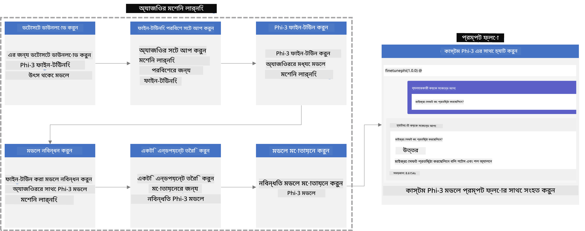

### বিষয়বস্তু সূচি

1. **[দৃশ্যপট ১: Azure রিসোর্স সেট আপ এবং ফাইন-টিউনের জন্য প্রস্তুতি](../../../../../../md/02.Application/01.TextAndChat/Phi3)**
    - [Azure Machine Learning ওয়ার্কস্পেস তৈরি করুন](../../../../../../md/02.Application/01.TextAndChat/Phi3)
    - [Azure Subscription এ GPU কোটা অনুরোধ করুন](../../../../../../md/02.Application/01.TextAndChat/Phi3)
    - [রোল অ্যাসাইনমেন্ট যোগ করুন](../../../../../../md/02.Application/01.TextAndChat/Phi3)
    - [প্রজেক্ট সেট আপ করুন](../../../../../../md/02.Application/01.TextAndChat/Phi3)
    - [ফাইন-টিউনের জন্য ডেটাসেট প্রস্তুত করুন](../../../../../../md/02.Application/01.TextAndChat/Phi3)

1. **[দৃশ্যপট ২: Phi-3 মডেল ফাইন-টিউন এবং Azure Machine Learning Studio তে ডিপ্লয় করুন](../../../../../../md/02.Application/01.TextAndChat/Phi3)**
    - [Azure CLI সেট আপ করুন](../../../../../../md/02.Application/01.TextAndChat/Phi3)
    - [Phi-3 মডেল ফাইন-টিউন করুন](../../../../../../md/02.Application/01.TextAndChat/Phi3)
    - [ফাইন-টিউন করা মডেল ডিপ্লয় করুন](../../../../../../md/02.Application/01.TextAndChat/Phi3)

1. **[দৃশ্যপট ৩: Prompt flow এর সাথে ইন্টিগ্রেট করুন এবং আপনার কাস্টম মডেলের সাথে চ্যাট করুন](../../../../../../md/02.Application/01.TextAndChat/Phi3)**
    - [কাস্টম Phi-3 মডেল Prompt flow এর সাথে ইন্টিগ্রেট করুন](../../../../../../md/02.Application/01.TextAndChat/Phi3)
    - [আপনার কাস্টম মডেলের সাথে চ্যাট করুন](../../../../../../md/02.Application/01.TextAndChat/Phi3)

## দৃশ্যপট ১: Azure রিসোর্স সেট আপ এবং ফাইন-টিউনের জন্য প্রস্তুতি

### Azure Machine Learning ওয়ার্কস্পেস তৈরি করুন

1. পোর্টালের উপরের দিকে **search bar**-এ *azure machine learning* টাইপ করুন এবং প্রদর্শিত বিকল্প থেকে **Azure Machine Learning** নির্বাচন করুন।

    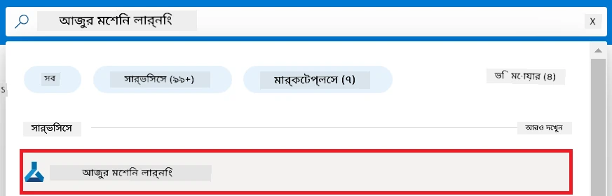

1. নেভিগেশন মেনু থেকে **+ Create** নির্বাচন করুন।

1. নেভিগেশন মেনু থেকে **New workspace** নির্বাচন করুন।

    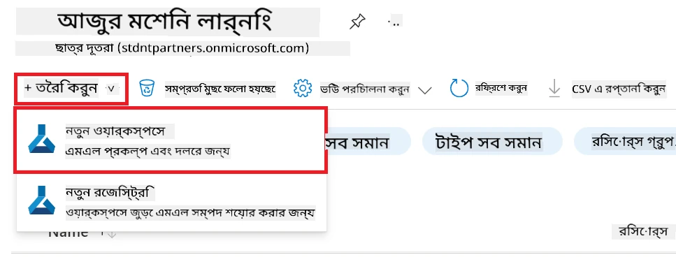

1. নিম্নলিখিত কাজগুলি করুন:

    - আপনার Azure **Subscription** নির্বাচন করুন।
    - ব্যবহার করার **Resource group** নির্বাচন করুন (প্রয়োজনে নতুন তৈরি করুন)।
    - **Workspace Name** লিখুন। এটি অবশ্যই ইউনিক হতে হবে।
    - আপনার পছন্দের **Region** নির্বাচন করুন।
    - ব্যবহার করার **Storage account** নির্বাচন করুন (প্রয়োজনে নতুন তৈরি করুন)।
    - ব্যবহার করার **Key vault** নির্বাচন করুন (প্রয়োজনে নতুন তৈরি করুন)।
    - ব্যবহার করার **Application insights** নির্বাচন করুন (প্রয়োজনে নতুন তৈরি করুন)।
    - ব্যবহার করার **Container registry** নির্বাচন করুন (প্রয়োজনে নতুন তৈরি করুন)।

    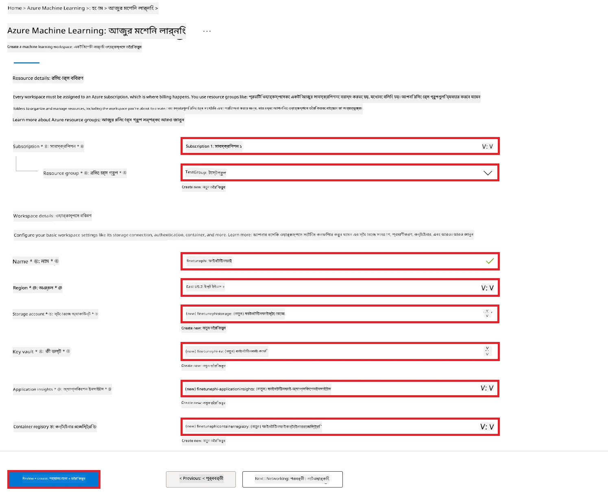

1. **Review + Create** নির্বাচন করুন।

1. **Create** নির্বাচন করুন।

### Azure Subscription এ GPU কোটা অনুরোধ করুন

এই E2E নমুনায়, আপনি ফাইন-টিউনিংয়ের জন্য *Standard_NC24ads_A100_v4 GPU* ব্যবহার করবেন, যার জন্য কোটা অনুরোধ প্রয়োজন, এবং ডিপ্লয়মেন্টের জন্য *Standard_E4s_v3* CPU ব্যবহার করবেন, যেটার জন্য কোটা অনুরোধের প্রয়োজন নেই।

> [!NOTE]
>
> শুধুমাত্র Pay-As-You-Go সাবস্ক্রিপশন (স্ট্যান্ডার্ড সাবস্ক্রিপশন টাইপ) GPU বরাদ্দ পেতে যোগ্য; বেনিফিট সাবস্ক্রিপশন বর্তমানে সমর্থিত নয়।
>
> যারা বেনিফিট সাবস্ক্রিপশন (যেমন Visual Studio Enterprise Subscription) ব্যবহার করছেন বা দ্রুত ফাইন-টিউন এবং ডিপ্লয়মেন্ট প্রক্রিয়া পরীক্ষা করতে চান তাদের জন্য, এই টিউটোরিয়ালটি CPU ব্যবহার করে একটি ছোট ডেটাসেট দিয়ে ফাইন-টিউন করার নির্দেশনাও দেয়। তবে লক্ষণীয় যে GPU এবং বড় ডেটাসেট ব্যবহার করলে ফাইন-টিউনের ফলাফল উল্লেখযোগ্যভাবে ভাল হয়।

1. [Azure ML Studio](https://ml.azure.com/home?wt.mc_id=studentamb_279723) ভিজিট করুন।

1. *Standard NCADSA100v4 Family* কোটা অনুরোধ করতে নিম্নলিখিত কাজগুলি করুন:

    - বাম দিকে ট্যাব থেকে **Quota** নির্বাচন করুন।
    - ব্যবহার করার **Virtual machine family** নির্বাচন করুন। উদাহরণস্বরূপ, *Standard NCADSA100v4 Family Cluster Dedicated vCPUs* নির্বাচন করুন, যাতে *Standard_NC24ads_A100_v4* GPU অন্তর্ভুক্ত রয়েছে।
    - নেভিগেশন মেনু থেকে **Request quota** নির্বাচন করুন।

        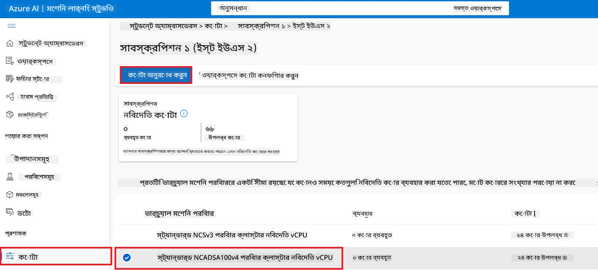

    - Request quota পৃষ্ঠায়, আপনি যে **New cores limit** ব্যবহার করতে চান তা লিখুন, যেমন ২৪।
    - Request quota পৃষ্ঠায়, GPU কোটা অনুরোধ করতে **Submit** নির্বাচন করুন।

> [!NOTE]
> আপনার প্রয়োজন অনুযায়ী GPU বা CPU নির্বাচন করতে [Sizes for Virtual Machines in Azure](https://learn.microsoft.com/azure/virtual-machines/sizes/overview?tabs=breakdownseries%2Cgeneralsizelist%2Ccomputesizelist%2Cmemorysizelist%2Cstoragesizelist%2Cgpusizelist%2Cfpgasizelist%2Chpcsizelist) ডকুমেন্টটি দেখতে পারেন।

### রোল অ্যাসাইনমেন্ট যোগ করুন

আপনার মডেলগুলি ফাইন-টিউন এবং ডিপ্লয় করার জন্য, প্রথমে আপনাকে একটি User Assigned Managed Identity (UAI) তৈরি করতে হবে এবং এটিকে উপযুক্ত পারমিশন দিতে হবে। এই UAI ডিপ্লয়মেন্টের সময় প্রমাণীকরণের জন্য ব্যবহৃত হবে।

#### User Assigned Managed Identity (UAI) তৈরি করুন

1. পোর্টালের উপরের বারের **search bar**-এ *managed identities* টাইপ করুন এবং প্রদর্শিত বিকল্প থেকে **Managed Identities** নির্বাচন করুন।

    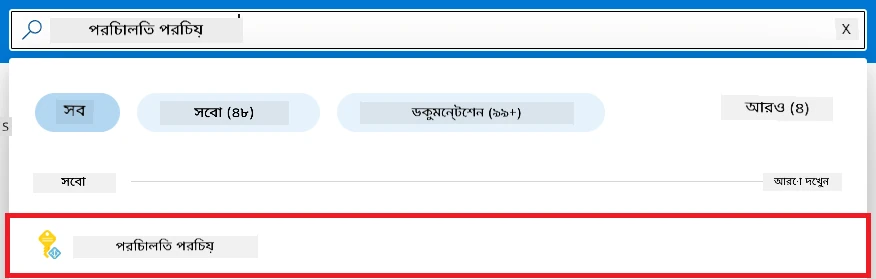

1. **+ Create** নির্বাচন করুন।

    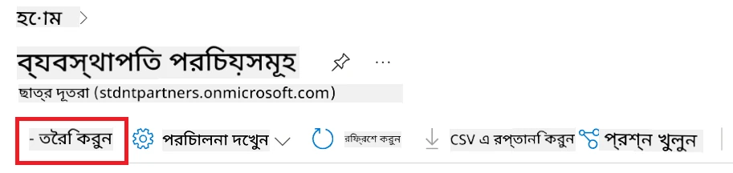

1. নিম্নলিখিত কাজগুলি করুন:

    - আপনার Azure **Subscription** নির্বাচন করুন।
    - ব্যবহার করার **Resource group** নির্বাচন করুন (প্রয়োজনে নতুন তৈরি করুন)।
    - আপনার পছন্দের **Region** নির্বাচন করুন।
    - **Name** লিখুন। এটি অবশ্যই ইউনিক হতে হবে।

1. **Review + create** নির্বাচন করুন।

1. **+ Create** নির্বাচন করুন।

#### Managed Identity-তে Contributor রোল অ্যাসাইনমেন্ট যোগ করুন

1. আপনি যে Managed Identity তৈরি করেছেন সেই রিসোর্সে যান।

1. বাম দিকে ট্যাব থেকে **Azure role assignments** নির্বাচন করুন।

1. নেভিগেশন মেনু থেকে **+Add role assignment** নির্বাচন করুন।

1. Add role assignment পৃষ্ঠায় নিম্নলিখিত কাজগুলি করুন:
    - **Scope** হিসাবে **Resource group** নির্বাচন করুন।
    - আপনার Azure **Subscription** নির্বাচন করুন।
    - ব্যবহার করার **Resource group** নির্বাচন করুন।
    - **Role** হিসাবে **Contributor** নির্বাচন করুন।

    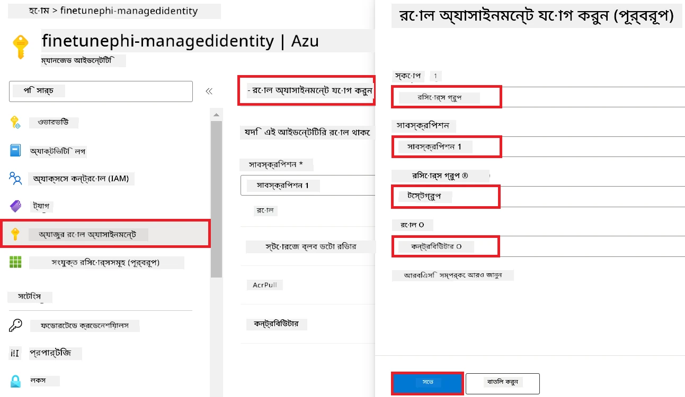

1. **Save** নির্বাচন করুন।

#### Managed Identity-তে Storage Blob Data Reader রোল অ্যাসাইনমেন্ট যোগ করুন

1. পোর্টালের উপরের বারের **search bar**-এ *storage accounts* টাইপ করুন এবং প্রদর্শিত বিকল্প থেকে **Storage accounts** নির্বাচন করুন।

    

1. Azure Machine Learning ওয়ার্কস্পেসের সাথে যুক্ত স্টোরেজ অ্যাকাউন্ট নির্বাচন করুন। উদাহরণস্বরূপ, *finetunephistorage*।

1. Add role assignment পৃষ্ঠায় যেতে নীচের কাজগুলি করুন:

    - আপনি যে Azure Storage অ্যাকাউন্ট তৈরি করেছেন সেখানে যান।
    - বাম দিকের ট্যাব থেকে **Access Control (IAM)** নির্বাচন করুন।
    - নেভিগেশন মেনু থেকে **+ Add** নির্বাচন করুন।
    - নেভিগেশন মেনু থেকে **Add role assignment** নির্বাচন করুন।

    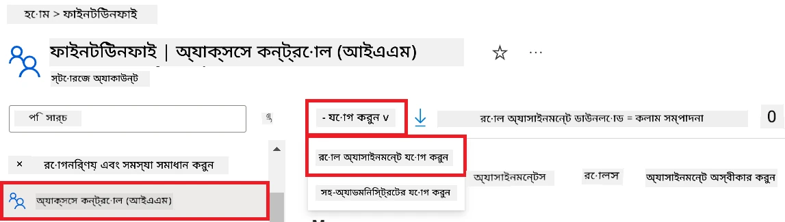

1. Add role assignment পৃষ্ঠায় নিম্নলিখিত কাজগুলি করুন:

    - Role পৃষ্ঠায়, **search bar**-এ *Storage Blob Data Reader* টাইপ করুন এবং প্রদর্শিত অপশন থেকে **Storage Blob Data Reader** নির্বাচন করুন।
    - Role পৃষ্ঠায়, **Next** নির্বাচন করুন।
    - Members পৃষ্ঠায়, **Assign access to** হিসাবে **Managed identity** নির্বাচন করুন।
    - Members পৃষ্ঠায়, **+ Select members** নির্বাচন করুন।
    - Select managed identities পৃষ্ঠায়, আপনার Azure **Subscription** নির্বাচন করুন।
    - Select managed identities পৃষ্ঠায়, **Managed identity** হিসাবে **Manage Identity** নির্বাচন করুন।
    - Select managed identities পৃষ্ঠায়, আপনি যে Managed Identity তৈরি করেছেন তা নির্বাচন করুন। উদাহরণস্বরূপ, *finetunephi-managedidentity*।
    - Select managed identities পৃষ্ঠায়, **Select** নির্বাচন করুন।

    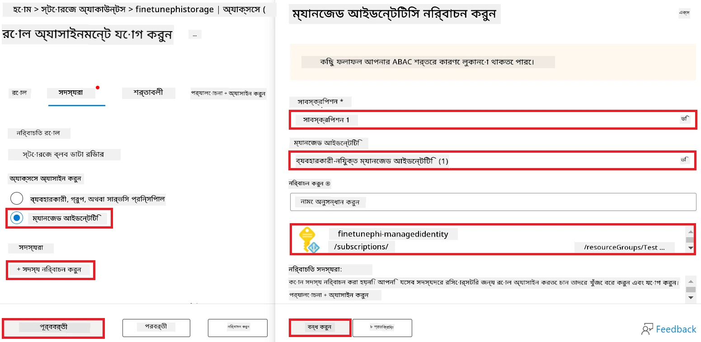

1. **Review + assign** নির্বাচন করুন।

#### Managed Identity-তে AcrPull রোল অ্যাসাইনমেন্ট যোগ করুন

1. পোর্টালের উপরের বারের **search bar**-এ *container registries* টাইপ করুন এবং প্রদর্শিত বিকল্প থেকে **Container registries** নির্বাচন করুন।

    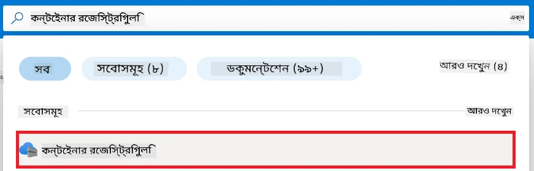

1. Azure Machine Learning ওয়ার্কস্পেসের সাথে যুক্ত কনটেইনার রেজিস্ট্রি নির্বাচন করুন। উদাহরণস্বরূপ, *finetunephicontainerregistries*।

1. Add role assignment পৃষ্ঠায় যেতে নীচের কাজগুলি করুন:

    - বাম ট্যাব থেকে **Access Control (IAM)** নির্বাচন করুন।
    - নেভিগেশন মেনু থেকে **+ Add** নির্বাচন করুন।
    - নেভিগেশন মেনু থেকে **Add role assignment** নির্বাচন করুন।

1. Add role assignment পৃষ্ঠায় নিম্নলিখিত কাজগুলি করুন:

    - Role পৃষ্ঠায়, **search bar**-এ *AcrPull* টাইপ করুন এবং প্রদর্শিত অপশন থেকে **AcrPull** নির্বাচন করুন।
    - Role পৃষ্ঠায়, **Next** নির্বাচন করুন।
    - Members পৃষ্ঠায়, **Assign access to** হিসাবে **Managed identity** নির্বাচন করুন।
    - Members পৃষ্ঠায়, **+ Select members** নির্বাচন করুন।
    - Select managed identities পৃষ্ঠায়, আপনার Azure **Subscription** নির্বাচন করুন।
    - Select managed identities পৃষ্ঠায়, **Managed identity** হিসাবে **Manage Identity** নির্বাচন করুন।
    - Select managed identities পৃষ্ঠায়, আপনি যে Managed Identity তৈরি করেছেন তা নির্বাচন করুন। উদাহরণস্বরূপ, *finetunephi-managedidentity*।
    - Select managed identities পৃষ্ঠায়, **Select** নির্বাচন করুন।
    - **Review + assign** নির্বাচন করুন।

### প্রজেক্ট সেট আপ করুন

এখন, আপনি একটি ফোল্ডার তৈরি করবেন যেখানে কাজ করবেন এবং একটি ভার্চুয়াল এনভায়রনমেন্ট তৈরি করবেন যাতে ব্যবহারকারীর সাথে ইন্টারঅ্যাক্ট করে এবং Azure Cosmos DB থেকে সংরক্ষিত চ্যাট ইতিহাস ব্যবহার করে উত্তর দিতে পারে এমন একটি প্রোগ্রাম ডেভেলপ করা যায়।

#### কাজ করার জন্য একটি ফোল্ডার তৈরি করুন

1. একটি টার্মিনাল উইন্ডো খুলুন এবং ডিফল্ট পাথে *finetune-phi* নামে একটি ফোল্ডার তৈরি করতে নিচের কমান্ড টাইপ করুন।

    ```console
    mkdir finetune-phi
    ```

1. টার্মিনালে নিচের কমান্ডটি টাইপ করে *finetune-phi* ফোল্ডারে নেভিগেট করুন যা আপনি তৈরি করেছেন।

    ```console
    cd finetune-phi
    ```

#### ভার্চুয়াল এনভায়রনমেন্ট তৈরি করুন

1. টার্মিনালে নিচের কমান্ড টাইপ করে *.venv* নামে একটি ভার্চুয়াল এনভায়রনমেন্ট তৈরি করুন।

    ```console
    python -m venv .venv
    ```

1. টার্মিনালে নিচের কমান্ড টাইপ করে ভার্চুয়াল এনভায়রনমেন্ট চালু করুন।

    ```console
    .venv\Scripts\activate.bat
    ```

> [!NOTE]
>
> সঠিকভাবে কাজ করলে কমান্ড প্রম্পটের আগে *(.venv)* দেখতে পাবেন।

#### প্রয়োজনীয় প্যাকেজগুলি ইন্সটল করুন

1. টার্মিনালে নিচের কমান্ডগুলি টাইপ করে প্রয়োজনীয় প্যাকেজগুলি ইন্সটল করুন।

    ```console
    pip install datasets==2.19.1
    pip install transformers==4.41.1
    pip install azure-ai-ml==1.16.0
    pip install torch==2.3.1
    pip install trl==0.9.4
    pip install promptflow==1.12.0
    ```

#### প্রজেক্ট ফাইল তৈরি করুন
এই অনুশীলনে, আপনি আমাদের প্রকল্পের জন্য প্রয়োজনীয় ফাইলগুলি তৈরি করবেন। এই ফাইলগুলির মধ্যে রয়েছে ডেটাসেট ডাউনলোড করার জন্য স্ক্রিপ্ট, Azure Machine Learning পরিবেশ সেট আপ করার জন্য স্ক্রিপ্ট, Phi-3 মডেল ফাইন-টিউন করার জন্য এবং ফাইন-টিউন করা মডেল ডিপ্লয় করার জন্য স্ক্রিপ্ট। এছাড়াও, আপনি ফাইন-টিউনিং পরিবেশ সেট আপ করার জন্য একটি *conda.yml* ফাইল তৈরি করবেন।

এই অনুশীলনে আপনি:

- ডেটাসেট ডাউনলোড করার জন্য *download_dataset.py* ফাইল তৈরি করবেন।
- Azure Machine Learning পরিবেশ সেট আপ করার জন্য *setup_ml.py* ফাইল তৈরি করবেন।
- *finetuning_dir* ফোল্ডারে *fine_tune.py* ফাইল তৈরি করবেন যা ডেটাসেট ব্যবহার করে Phi-3 মডেল ফাইন-টিউন করবে।
- ফাইন-টিউনিং পরিবেশ সেট আপ করার জন্য একটি *conda.yml* ফাইল তৈরি করবেন।
- ফাইন-টিউন করা মডেল ডিপ্লয় করার জন্য *deploy_model.py* ফাইল তৈরি করবেন।
- ফাইন-টিউন করা মডেলকে ইন্টিগ্রেট করে এবং Prompt flow ব্যবহার করে মডেল চালানোর জন্য *integrate_with_promptflow.py* ফাইল তৈরি করবেন।
- Prompt flow-এর জন্য ওয়ার্কফ্লো গঠন করার জন্য *flow.dag.yml* ফাইল তৈরি করবেন।
- Azure সম্পর্কিত তথ্য ঢোকানোর জন্য *config.py* ফাইল তৈরি করবেন।

> [!NOTE]
>
> সম্পূর্ণ ফোল্ডার গঠন:
>
> ```text
> └── YourUserName
> .    └── finetune-phi
> .        ├── finetuning_dir
> .        │      └── fine_tune.py
> .        ├── conda.yml
> .        ├── config.py
> .        ├── deploy_model.py
> .        ├── download_dataset.py
> .        ├── flow.dag.yml
> .        ├── integrate_with_promptflow.py
> .        └── setup_ml.py
> ```

1. **Visual Studio Code** ওপেন করুন।

1. মেনুবার থেকে **File** সিলেক্ট করুন।

1. **Open Folder** সিলেক্ট করুন।

1. আপনি যে *finetune-phi* ফোল্ডার তৈরি করেছেন, যেটি অবস্থিত *C:\Users\yourUserName\finetune-phi* এ, সেটি সিলেক্ট করুন।

    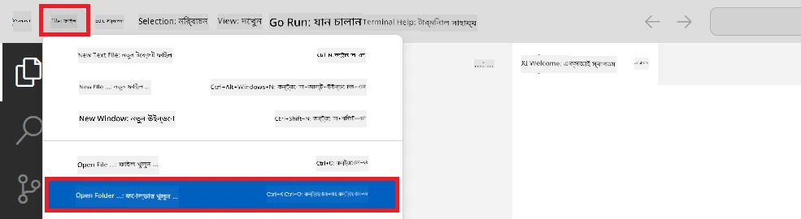

1. Visual Studio Code এর বাম প্যানেলে রাইট-ক্লিক করে **New File** সিলেক্ট করে *download_dataset.py* নামে একটি নতুন ফাইল তৈরি করুন।

1. Visual Studio Code এর বাম প্যানেলে রাইট-ক্লিক করে **New File** সিলেক্ট করে *setup_ml.py* নামে একটি নতুন ফাইল তৈরি করুন।

1. Visual Studio Code এর বাম প্যানেলে রাইট-ক্লিক করে **New File** সিলেক্ট করে *deploy_model.py* নামে একটি নতুন ফাইল তৈরি করুন।

    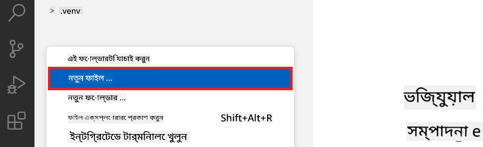

1. Visual Studio Code এর বাম প্যানেলে রাইট-ক্লিক করে **New Folder** সিলেক্ট করে *finetuning_dir* নামে একটি নতুন ফোল্ডার তৈরি করুন।

1. *finetuning_dir* ফোল্ডারে একটি নতুন ফাইল *fine_tune.py* তৈরি করুন।

#### *conda.yml* ফাইল তৈরি এবং কনফিগার করুন

1. Visual Studio Code এর বাম প্যানেলে রাইট-ক্লিক করে **New File** সিলেক্ট করে *conda.yml* নামে একটি নতুন ফাইল তৈরি করুন।

1. *conda.yml* ফাইলে নিম্নলিখিত কোড যোগ করুন যা Phi-3 মডেলের ফাইন-টিউনিং পরিবেশ সেট আপ করবে।

    ```yml
    name: phi-3-training-env
    channels:
      - defaults
      - conda-forge
    dependencies:
      - python=3.10
      - pip
      - numpy<2.0
      - pip:
          - torch==2.4.0
          - torchvision==0.19.0
          - trl==0.8.6
          - transformers==4.41
          - datasets==2.21.0
          - azureml-core==1.57.0
          - azure-storage-blob==12.19.0
          - azure-ai-ml==1.16
          - azure-identity==1.17.1
          - accelerate==0.33.0
          - mlflow==2.15.1
          - azureml-mlflow==1.57.0
    ```

#### *config.py* ফাইল তৈরি এবং কনফিগার করুন

1. Visual Studio Code এর বাম প্যানেলে রাইট-ক্লিক করে **New File** সিলেক্ট করে *config.py* নামে একটি নতুন ফাইল তৈরি করুন।

1. *config.py* ফাইলে নিচের কোড যোগ করুন যাতে আপনার Azure তথ্য অন্তর্ভুক্ত থাকে।

    ```python
    # আজুর সেটিংস
    AZURE_SUBSCRIPTION_ID = "your_subscription_id"
    AZURE_RESOURCE_GROUP_NAME = "your_resource_group_name" # "TestGroup"

    # আজুর মেশিন লার্নিং সেটিংস
    AZURE_ML_WORKSPACE_NAME = "your_workspace_name" # "finetunephi-workspace"

    # আজুর ম্যানেজড আইডেন্টিটি সেটিংস
    AZURE_MANAGED_IDENTITY_CLIENT_ID = "your_azure_managed_identity_client_id"
    AZURE_MANAGED_IDENTITY_NAME = "your_azure_managed_identity_name" # "finetunephi-mangedidentity"
    AZURE_MANAGED_IDENTITY_RESOURCE_ID = f"/subscriptions/{AZURE_SUBSCRIPTION_ID}/resourceGroups/{AZURE_RESOURCE_GROUP_NAME}/providers/Microsoft.ManagedIdentity/userAssignedIdentities/{AZURE_MANAGED_IDENTITY_NAME}"

    # ডেটাসেট ফাইল পাথ
    TRAIN_DATA_PATH = "data/train_data.jsonl"
    TEST_DATA_PATH = "data/test_data.jsonl"

    # ফাইন-টিউন করা মডেল সেটিংস
    AZURE_MODEL_NAME = "your_fine_tuned_model_name" # "finetune-phi-model"
    AZURE_ENDPOINT_NAME = "your_fine_tuned_model_endpoint_name" # "finetune-phi-endpoint"
    AZURE_DEPLOYMENT_NAME = "your_fine_tuned_model_deployment_name" # "finetune-phi-deployment"

    AZURE_ML_API_KEY = "your_fine_tuned_model_api_key"
    AZURE_ML_ENDPOINT = "your_fine_tuned_model_endpoint_uri" # "https://{your-endpoint-name}.{your-region}.inference.ml.azure.com/score"
    ```

#### Azure পরিবেশ ভেরিয়েবল যোগ করুন

1. Azure Subscription ID যোগ করতে নিম্নলিখিত ধাপগুলো অনুসরণ করুন:

    - পোর্টাল পেজের উপরের **search bar**-এ *subscriptions* টাইপ করুন এবং প্রদত্ত অপশন থেকে **Subscriptions** সিলেক্ট করুন।
    - আপনি যে Azure Subscription ব্যবহার করছেন সেটি সিলেক্ট করুন।
    - আপনার Subscription ID কপি করে *config.py* ফাইলে পেস্ট করুন।

    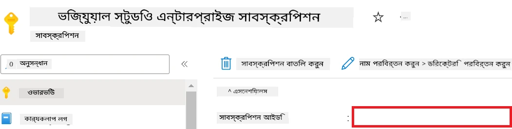

1. Azure Workspace Name যোগ করতে নিম্নলিখিত ধাপগুলো অনুসরণ করুন:

    - আপনি যে Azure Machine Learning রিসোর্সটি তৈরি করেছেন সেখানে যান।
    - আপনার একাউন্ট নাম কপি করে *config.py* ফাইলে পেস্ট করুন।

    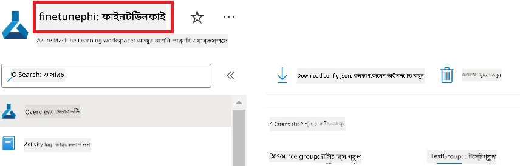

1. Azure Resource Group Name যোগ করতে নিম্নলিখিত ধাপগুলো অনুসরণ করুন:

    - আপনি যে Azure Machine Learning রিসোর্সটি তৈরি করেছেন সেখানে যান।
    - আপনার Azure Resource Group নাম কপি করে *config.py* ফাইলে পেস্ট করুন।

    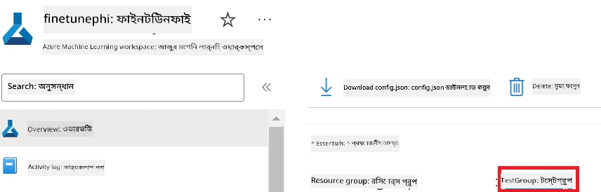

2. Azure Managed Identity নাম যোগ করতে নিম্নলিখিত ধাপগুলো অনুসরণ করুন:

    - আপনি যে Managed Identities রিসোর্স তৈরি করেছেন সেখানে যান।
    - আপনার Azure Managed Identity নাম কপি করে *config.py* ফাইলে পেস্ট করুন।

    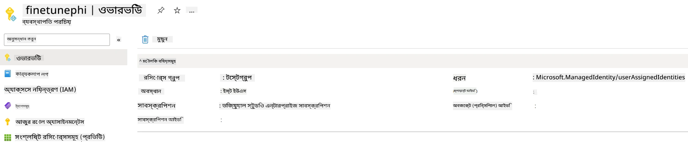

### ফাইন-টিউনিং-এর জন্য ডেটাসেট প্রস্তুত করুন

এই অনুশীলনে, আপনি *download_dataset.py* ফাইল চালিয়ে *ULTRACHAT_200k* ডেটাসেটগুলো আপনার লোকাল পরিবেশে ডাউনলোড করবেন। এরপর আপনি Azure Machine Learning-এ Phi-3 মডেল ফাইন-টিউন করার জন্য এই ডেটাসেটগুলো ব্যবহার করবেন।

#### *download_dataset.py* ব্যবহার করে ডেটাসেট ডাউনলোড করুন

1. Visual Studio Code-এ *download_dataset.py* ফাইলটি খুলুন।

1. *download_dataset.py* ফাইলে নিম্নলিখিত কোড যোগ করুন।

    ```python
    import json
    import os
    from datasets import load_dataset
    from config import (
        TRAIN_DATA_PATH,
        TEST_DATA_PATH)

    def load_and_split_dataset(dataset_name, config_name, split_ratio):
        """
        Load and split a dataset.
        """
        # নির্দিষ্ট নাম, কনফিগারেশন, এবং বিভাজন অনুপাতে ডেটাসেট লোড করুন
        dataset = load_dataset(dataset_name, config_name, split=split_ratio)
        print(f"Original dataset size: {len(dataset)}")
        
        # ডেটাসেটকে ট্রেন এবং টেস্ট সেটে ভাগ করুন (৮০% ট্রেন, ২০% টেস্ট)
        split_dataset = dataset.train_test_split(test_size=0.2)
        print(f"Train dataset size: {len(split_dataset['train'])}")
        print(f"Test dataset size: {len(split_dataset['test'])}")
        
        return split_dataset

    def save_dataset_to_jsonl(dataset, filepath):
        """
        Save a dataset to a JSONL file.
        """
        # ডিরেক্টরিটি সৃষ্টি করুন যদি এটি না থাকে
        os.makedirs(os.path.dirname(filepath), exist_ok=True)
        
        # ফাইলটি লেখার মোডে খুলুন
        with open(filepath, 'w', encoding='utf-8') as f:
            # ডেটাসেটের প্রতিটি রেকর্ডের উপর পুনরাবৃত্তি করুন
            for record in dataset:
                # রেকর্ডটি JSON অবজেক্ট হিসেবে ডাম্প করুন এবং ফাইলে লিখুন
                json.dump(record, f)
                # রেকর্ডগুলো আলাদা করার জন্য একটি নিউলাইন ক্যারেক্টার লিখুন
                f.write('\n')
        
        print(f"Dataset saved to {filepath}")

    def main():
        """
        Main function to load, split, and save the dataset.
        """
        # নির্দিষ্ট কনফিগারেশন এবং বিভাজন অনুপাতে ULTRACHAT_200k ডেটাসেট লোড এবং ভাগ করুন
        dataset = load_and_split_dataset("HuggingFaceH4/ultrachat_200k", 'default', 'train_sft[:1%]')
        
        # বিভাজন থেকে ট্রেন এবং টেস্ট ডেটাসেটগুলি আলাদা করুন
        train_dataset = dataset['train']
        test_dataset = dataset['test']

        # ট্রেন ডেটাসেটটি একটি JSONL ফাইলে সংরক্ষণ করুন
        save_dataset_to_jsonl(train_dataset, TRAIN_DATA_PATH)
        
        # টেস্ট ডেটাসেটটি একটি আলাদা JSONL ফাইলে সংরক্ষণ করুন
        save_dataset_to_jsonl(test_dataset, TEST_DATA_PATH)

    if __name__ == "__main__":
        main()

    ```

> [!TIP]
>
> **সিপিইউ ব্যবহার করে একটি ছোট ডেটাসেট দিয়ে ফাইন-টিউনিংয়ের গাইডলাইন**
>
> যদি আপনি সিপিইউ ব্যবহার করে ফাইন-টিউন করতে চান, এই পদ্ধতিটি উপযুক্ত যারা বেনিফিট সাবস্ক্রিপশন (যেমন Visual Studio Enterprise Subscription) ব্যবহার করছেন বা দ্রুত ফাইন-টিউনিং ও ডিপ্লয়মেন্ট প্রক্রিয়া পরীক্ষা করতে চান।
>
> `dataset = load_and_split_dataset("HuggingFaceH4/ultrachat_200k", 'default', 'train_sft[:1%]')` এর পরিবর্তে ব্যবহার করুন `dataset = load_and_split_dataset("HuggingFaceH4/ultrachat_200k", 'default', 'train_sft[:10]')`
>

1. টার্মিনালে নিচের কমান্ডটি টাইপ করে স্ক্রিপ্টটি রান করুন এবং ডেটাসেটটি আপনার লোকাল পরিবেশে ডাউনলোড করুন।

    ```console
    python download_data.py
    ```

1. নিশ্চিত করুন যে ডেটাসেটগুলো সফলভাবে আপনার লোকাল *finetune-phi/data* ডিরেক্টরিতে সংরক্ষণ হয়েছে।

> [!NOTE]
>
> **ডেটাসেট আকার ও ফাইন-টিউনিং সময়**
>
> এই E2E স্যাম্পলে আপনি ডেটাসেটের মাত্র ১% (`train_sft[:1%]`) ব্যবহার করছেন। এটি ডেটার পরিমাণ উল্লেখযোগ্যভাবে কমিয়ে দেয়, যা আপলোড এবং ফাইন-টিউনিং উভয় প্রক্রিয়া দ্রুততর করে। আপনি প্রশিক্ষণের সময় এবং মডেল পারফরম্যান্সের মধ্যে সঠিক সামঞ্জস্য পেতে শতাংশ পরিবর্তন করতে পারেন। ডেটাসেটের ছোট একটি উপসেট ব্যবহার ফাইন-টিউনিংয়ের সময় কমিয়ে আনতে সাহায্য করে, যা একটি E2E স্যাম্পলের জন্য পরিচালনাযোগ্য করে তোলে।

## দৃশ্য ২: Phi-3 মডেল ফাইন-টিউনিং এবং Azure Machine Learning Studio-তে ডিপ্লয়মেন্ট

### Azure CLI সেট আপ করুন

Azure CLI সেট আপ করতে হবে আপনার পরিবেশে প্রমাণীকরণের জন্য। Azure CLI দিয়ে আপনি সোজাসুজি কমান্ড লাইন থেকে Azure রিসোর্স ব্যবস্থাপনা করতে পারবেন এবং Azure Machine Learning এই রিসোর্সগুলো অ্যাক্সেস করার জন্য প্রয়োজনীয় ক্রেডেনশিয়াল পেতে পারে। শুরু করতে [Azure CLI](https://learn.microsoft.com/cli/azure/install-azure-cli) ইনস্টল করুন।

1. টার্মিনাল উইন্ডো খুলুন এবং নিচের কমান্ডটি টাইপ করে Azure একাউন্টে লগইন করুন।

    ```console
    az login
    ```

1. আপনার ব্যবহারের জন্য Azure একাউন্ট সিলেক্ট করুন।

1. আপনার ব্যবহারের জন্য Azure সাবস্ক্রিপশন সিলেক্ট করুন।

    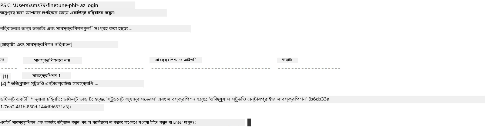

> [!TIP]
>
> Azure-এ সাইন ইন করতে সমস্যা হলে, ডিভাইস কোড ব্যবহার করে চেষ্টা করুন। একটি টার্মিনাল উইন্ডো খুলুন এবং নিচের কমান্ডটি টাইপ করুন:
>
> ```console
> az login --use-device-code
> ```
>

### Phi-3 মডেল ফাইন-টিউন করুন

এই অনুশীলনে, আপনি প্রদত্ত ডেটাসেট ব্যবহার করে Phi-3 মডেল ফাইন-টিউন করবেন। প্রথমে, আপনি *fine_tune.py* ফাইলে ফাইন-টিউনিং প্রক্রিয়া সংজ্ঞায়িত করবেন। তারপর, Azure Machine Learning পরিবেশ কনফিগার করে *setup_ml.py* ফাইল চালিয়ে ফাইন-টিউনিং শুরু করবেন। এই স্ক্রিপ্ট নিশ্চিত করবে যে ফাইন-টিউনিং Azure Machine Learning পরিবেশের মধ্যে হচ্ছে।

*setup_ml.py* চালানোর মাধ্যমে আপনি Azure Machine Learning পরিবেশে ফাইন-টিউনিং প্রক্রিয়া চালাবেন।

#### *fine_tune.py* ফাইলে কোড যোগ করুন

1. *finetuning_dir* ফোল্ডারে যান এবং Visual Studio Code-এ *fine_tune.py* ফাইলটি খুলুন।

1. *fine_tune.py* ফাইলে নিচের কোড যুক্ত করুন।

    ```python
    import argparse
    import sys
    import logging
    import os
    from datasets import load_dataset
    import torch
    import mlflow
    from transformers import AutoModelForCausalLM, AutoTokenizer, TrainingArguments
    from trl import SFTTrainer

    # MLflow এ INVALID_PARAMETER_VALUE ত্রুটি এড়াতে, MLflow একীভূতকরণ নিষ্ক্রিয় করুন
    os.environ["DISABLE_MLFLOW_INTEGRATION"] = "True"

    # লগিং সেটআপ
    logging.basicConfig(
        format="%(asctime)s - %(levelname)s - %(name)s - %(message)s",
        datefmt="%Y-%m-%d %H:%M:%S",
        handlers=[logging.StreamHandler(sys.stdout)],
        level=logging.WARNING
    )
    logger = logging.getLogger(__name__)

    def initialize_model_and_tokenizer(model_name, model_kwargs):
        """
        Initialize the model and tokenizer with the given pretrained model name and arguments.
        """
        model = AutoModelForCausalLM.from_pretrained(model_name, **model_kwargs)
        tokenizer = AutoTokenizer.from_pretrained(model_name)
        tokenizer.model_max_length = 2048
        tokenizer.pad_token = tokenizer.unk_token
        tokenizer.pad_token_id = tokenizer.convert_tokens_to_ids(tokenizer.pad_token)
        tokenizer.padding_side = 'right'
        return model, tokenizer

    def apply_chat_template(example, tokenizer):
        """
        Apply a chat template to tokenize messages in the example.
        """
        messages = example["messages"]
        if messages[0]["role"] != "system":
            messages.insert(0, {"role": "system", "content": ""})
        example["text"] = tokenizer.apply_chat_template(
            messages, tokenize=False, add_generation_prompt=False
        )
        return example

    def load_and_preprocess_data(train_filepath, test_filepath, tokenizer):
        """
        Load and preprocess the dataset.
        """
        train_dataset = load_dataset('json', data_files=train_filepath, split='train')
        test_dataset = load_dataset('json', data_files=test_filepath, split='train')
        column_names = list(train_dataset.features)

        train_dataset = train_dataset.map(
            apply_chat_template,
            fn_kwargs={"tokenizer": tokenizer},
            num_proc=10,
            remove_columns=column_names,
            desc="Applying chat template to train dataset",
        )

        test_dataset = test_dataset.map(
            apply_chat_template,
            fn_kwargs={"tokenizer": tokenizer},
            num_proc=10,
            remove_columns=column_names,
            desc="Applying chat template to test dataset",
        )

        return train_dataset, test_dataset

    def train_and_evaluate_model(train_dataset, test_dataset, model, tokenizer, output_dir):
        """
        Train and evaluate the model.
        """
        training_args = TrainingArguments(
            bf16=True,
            do_eval=True,
            output_dir=output_dir,
            eval_strategy="epoch",
            learning_rate=5.0e-06,
            logging_steps=20,
            lr_scheduler_type="cosine",
            num_train_epochs=3,
            overwrite_output_dir=True,
            per_device_eval_batch_size=4,
            per_device_train_batch_size=4,
            remove_unused_columns=True,
            save_steps=500,
            seed=0,
            gradient_checkpointing=True,
            gradient_accumulation_steps=1,
            warmup_ratio=0.2,
        )

        trainer = SFTTrainer(
            model=model,
            args=training_args,
            train_dataset=train_dataset,
            eval_dataset=test_dataset,
            max_seq_length=2048,
            dataset_text_field="text",
            tokenizer=tokenizer,
            packing=True
        )

        train_result = trainer.train()
        trainer.log_metrics("train", train_result.metrics)

        mlflow.transformers.log_model(
            transformers_model={"model": trainer.model, "tokenizer": tokenizer},
            artifact_path=output_dir,
        )

        tokenizer.padding_side = 'left'
        eval_metrics = trainer.evaluate()
        eval_metrics["eval_samples"] = len(test_dataset)
        trainer.log_metrics("eval", eval_metrics)

    def main(train_file, eval_file, model_output_dir):
        """
        Main function to fine-tune the model.
        """
        model_kwargs = {
            "use_cache": False,
            "trust_remote_code": True,
            "torch_dtype": torch.bfloat16,
            "device_map": None,
            "attn_implementation": "eager"
        }

        # pretrained_model_name = "microsoft/Phi-3-mini-4k-instruct"
        pretrained_model_name = "microsoft/Phi-3.5-mini-instruct"

        with mlflow.start_run():
            model, tokenizer = initialize_model_and_tokenizer(pretrained_model_name, model_kwargs)
            train_dataset, test_dataset = load_and_preprocess_data(train_file, eval_file, tokenizer)
            train_and_evaluate_model(train_dataset, test_dataset, model, tokenizer, model_output_dir)

    if __name__ == "__main__":
        parser = argparse.ArgumentParser()
        parser.add_argument("--train-file", type=str, required=True, help="Path to the training data")
        parser.add_argument("--eval-file", type=str, required=True, help="Path to the evaluation data")
        parser.add_argument("--model_output_dir", type=str, required=True, help="Directory to save the fine-tuned model")
        args = parser.parse_args()
        main(args.train_file, args.eval_file, args.model_output_dir)

    ```

1. *fine_tune.py* ফাইলটি সেভ করে বন্ধ করুন।

> [!TIP]
> **আপনি Phi-3.5 মডেলও ফাইন-টিউন করতে পারেন**
>
> *fine_tune.py* ফাইলে, `pretrained_model_name` `"microsoft/Phi-3-mini-4k-instruct"` থেকে আপনার পছন্দমত মডেলে পরিবর্তন করতে পারেন। যেমন, `"microsoft/Phi-3.5-mini-instruct"` দিলে Phi-3.5-mini-instruct মডেল দিয়ে ফাইন-টিউন হবে। আপনার পছন্দের মডেল নাম পেতে [Hugging Face](https://huggingface.co/) এ যান, মডেল সার্চ করুন এবং নাম কপি করে `pretrained_model_name` ফিল্ডে পেস্ট করুন।
>
> <image type="content" src="../../../../imgs/02/FineTuning-PromptFlow/finetunephi3.5.png" alt-text="Phi-3.5 ফাইন টিউন করুন।">
>

#### *setup_ml.py* ফাইলে কোড যোগ করুন

1. Visual Studio Code-এ *setup_ml.py* ফাইলটি খুলুন।

1. *setup_ml.py* ফাইলে নিচের কোড যোগ করুন।

    ```python
    import logging
    from azure.ai.ml import MLClient, command, Input
    from azure.ai.ml.entities import Environment, AmlCompute
    from azure.identity import AzureCliCredential
    from config import (
        AZURE_SUBSCRIPTION_ID,
        AZURE_RESOURCE_GROUP_NAME,
        AZURE_ML_WORKSPACE_NAME,
        TRAIN_DATA_PATH,
        TEST_DATA_PATH
    )

    # ধ্রুবকগুলি

    # প্রশিক্ষণের জন্য একটি CPU ইনস্ট্যান্স ব্যবহার করতে নিম্নলিখিত লাইনগুলি আনকমেন্ট করুন
    # COMPUTE_INSTANCE_TYPE = "Standard_E16s_v3" # সিপিউ
    # COMPUTE_NAME = "cpu-e16s-v3"
    # DOCKER_IMAGE_NAME = "mcr.microsoft.com/azureml/openmpi4.1.0-ubuntu20.04:latest"

    # প্রশিক্ষণের জন্য একটি GPU ইনস্ট্যান্স ব্যবহার করতে নিম্নলিখিত লাইনগুলি আনকমেন্ট করুন
    COMPUTE_INSTANCE_TYPE = "Standard_NC24ads_A100_v4"
    COMPUTE_NAME = "gpu-nc24s-a100-v4"
    DOCKER_IMAGE_NAME = "mcr.microsoft.com/azureml/curated/acft-hf-nlp-gpu:59"

    CONDA_FILE = "conda.yml"
    LOCATION = "eastus2" # আপনার কম্পিউট ক্লাস্টারের অবস্থান পরিবর্তন করুন
    FINETUNING_DIR = "./finetuning_dir" # ফাইন-টিউনিং স্ক্রিপ্টের পথ
    TRAINING_ENV_NAME = "phi-3-training-environment" # প্রশিক্ষণের পরিবেশের নাম
    MODEL_OUTPUT_DIR = "./model_output" # অ্যাজিউর এমএল এ মডেল আউটপুট ডিরেক্টরির পথ

    # প্রক্রিয়াটি ট্র্যাক করার জন্য লগিং সেটআপ
    logger = logging.getLogger(__name__)
    logging.basicConfig(
        format="%(asctime)s - %(levelname)s - %(name)s - %(message)s",
        datefmt="%Y-%m-%d %H:%M:%S",
        level=logging.WARNING
    )

    def get_ml_client():
        """
        Initialize the ML Client using Azure CLI credentials.
        """
        credential = AzureCliCredential()
        return MLClient(credential, AZURE_SUBSCRIPTION_ID, AZURE_RESOURCE_GROUP_NAME, AZURE_ML_WORKSPACE_NAME)

    def create_or_get_environment(ml_client):
        """
        Create or update the training environment in Azure ML.
        """
        env = Environment(
            image=DOCKER_IMAGE_NAME,  # পরিবেশের জন্য ডকার ইমেজ
            conda_file=CONDA_FILE,  # কন্ডা পরিবেশ ফাইল
            name=TRAINING_ENV_NAME,  # পরিবেশের নাম
        )
        return ml_client.environments.create_or_update(env)

    def create_or_get_compute_cluster(ml_client, compute_name, COMPUTE_INSTANCE_TYPE, location):
        """
        Create or update the compute cluster in Azure ML.
        """
        try:
            compute_cluster = ml_client.compute.get(compute_name)
            logger.info(f"Compute cluster '{compute_name}' already exists. Reusing it for the current run.")
        except Exception:
            logger.info(f"Compute cluster '{compute_name}' does not exist. Creating a new one with size {COMPUTE_INSTANCE_TYPE}.")
            compute_cluster = AmlCompute(
                name=compute_name,
                size=COMPUTE_INSTANCE_TYPE,
                location=location,
                tier="Dedicated",  # কম্পিউট ক্লাস্টারের স্তর
                min_instances=0,  # ন্যূনতম ইনস্ট্যান্স সংখ্যা
                max_instances=1  # সর্বোচ্চ ইনস্ট্যান্স সংখ্যা
            )
            ml_client.compute.begin_create_or_update(compute_cluster).wait()  # ক্লাস্টার তৈরি হওয়ার জন্য অপেক্ষা করুন
        return compute_cluster

    def create_fine_tuning_job(env, compute_name):
        """
        Set up the fine-tuning job in Azure ML.
        """
        return command(
            code=FINETUNING_DIR,  # fine_tune.py এর পথ
            command=(
                "python fine_tune.py "
                "--train-file ${{inputs.train_file}} "
                "--eval-file ${{inputs.eval_file}} "
                "--model_output_dir ${{inputs.model_output}}"
            ),
            environment=env,  # প্রশিক্ষণ পরিবেশ
            compute=compute_name,  # ব্যবহারের জন্য কম্পিউট ক্লাস্টার
            inputs={
                "train_file": Input(type="uri_file", path=TRAIN_DATA_PATH),  # প্রশিক্ষণ ডেটা ফাইলের পথ
                "eval_file": Input(type="uri_file", path=TEST_DATA_PATH),  # মূল্যায়ন ডেটা ফাইলের পথ
                "model_output": MODEL_OUTPUT_DIR
            }
        )

    def main():
        """
        Main function to set up and run the fine-tuning job in Azure ML.
        """
        # এমএল ক্লায়েন্ট ইনিশিয়ালাইজ করুন
        ml_client = get_ml_client()

        # পরিবেশ তৈরি করুন
        env = create_or_get_environment(ml_client)
        
        # বিদ্যমান কম্পিউট ক্লাস্টার তৈরি বা গ্রহণ করুন
        create_or_get_compute_cluster(ml_client, COMPUTE_NAME, COMPUTE_INSTANCE_TYPE, LOCATION)

        # ফাইন-টিউনিং কাজ তৈরি এবং জমা দিন
        job = create_fine_tuning_job(env, COMPUTE_NAME)
        returned_job = ml_client.jobs.create_or_update(job)  # কাজ জমা দিন
        ml_client.jobs.stream(returned_job.name)  # কাজের লগ স্ট্রিম করুন
        
        # কাজের নাম ক্যাপচার করুন
        job_name = returned_job.name
        print(f"Job name: {job_name}")

    if __name__ == "__main__":
        main()

    ```

1. `COMPUTE_INSTANCE_TYPE`, `COMPUTE_NAME`, এবং `LOCATION` আপনার নির্দিষ্ট তথ্য দিয়ে পরিবর্তন করুন।

    ```python
   # প্রশিক্ষণের জন্য GPU ইনস্ট্যান্স ব্যবহার করতে নিম্নলিখিত লাইনগুলি আনকমেন্ট করুন
    COMPUTE_INSTANCE_TYPE = "Standard_NC24ads_A100_v4"
    COMPUTE_NAME = "gpu-nc24s-a100-v4"
    ...
    LOCATION = "eastus2" # আপনার কম্পিউট ক্লাস্টারের অবস্থান দিয়ে পরিবর্তন করুন
    ```

> [!TIP]
>
> **সিপিইউ ব্যবহার করে একটি ছোট ডেটাসেট দিয়ে ফাইন-টিউনিংয়ের গাইডলাইন**
>
> যদি আপনি সিপিইউ ব্যবহার করে ফাইন-টিউন করতে চান, এই পদ্ধতিটি উপযুক্ত যারা বেনিফিট সাবস্ক্রিপশন (যেমন Visual Studio Enterprise Subscription) ব্যবহার করছেন বা দ্রুত ফাইন-টিউনিং ও ডিপ্লয়মেন্ট প্রক্রিয়া পরীক্ষা করতে চান।
>
> 1. *setup_ml* ফাইলটি খুলুন।
> 1. `COMPUTE_INSTANCE_TYPE`, `COMPUTE_NAME`, এবং `DOCKER_IMAGE_NAME` নিচের মতো পরিবর্তন করুন। যদি আপনার *Standard_E16s_v3* অ্যাক্সেস না থাকে, আপনি সমতুল্য CPU ইনস্ট্যান্স ব্যবহার করতে পারেন অথবা নতুন কোটা অনুরোধ করতে পারেন।
> 1. `LOCATION` আপনার নির্দিষ্ট তথ্য দিয়ে পরিবর্তন করুন।
>
>    ```python
>    # Uncomment the following lines to use a CPU instance for training
>    COMPUTE_INSTANCE_TYPE = "Standard_E16s_v3" # cpu
>    COMPUTE_NAME = "cpu-e16s-v3"
>    DOCKER_IMAGE_NAME = "mcr.microsoft.com/azureml/openmpi4.1.0-ubuntu20.04:latest"
>    LOCATION = "eastus2" # Replace with the location of your compute cluster
>    ```
>

1. টার্মিনালে নিচের কমান্ড টাইপ করে *setup_ml.py* স্ক্রিপ্টটি রান করুন এবং Azure Machine Learning-এ ফাইন-টিউনিং শুরু করুন।

    ```python
    python setup_ml.py
    ```

1. এই অনুশীলনে, আপনি সফলভাবে Azure Machine Learning ব্যবহার করে Phi-3 মডেল ফাইন-টিউন করেছেন। *setup_ml.py* স্ক্রিপ্ট চালিয়ে আপনি Azure Machine Learning পরিবেশ সেট আপ করেছেন এবং *fine_tune.py* ফাইলে সংজ্ঞায়িত ফাইন-টিউনিং প্রক্রিয়া শুরু করেছেন। ফাইন-টিউনিং প্রক্রিয়া অনেক সময় নিতে পারে। `python setup_ml.py` চালানোর পর, প্রক্রিয়া সম্পূর্ণ হওয়া পর্যন্ত অপেক্ষা করুন। আপনি টার্মিনালে প্রদত্ত লিঙ্কে গিয়ে Azure Machine Learning পোর্টালে ফাইন-টিউনিং কাজের স্ট্যাটাস মনিটর করতে পারেন।

    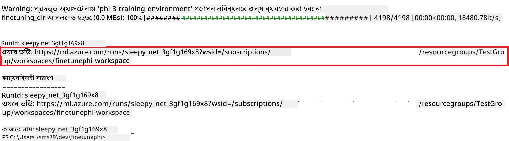

### ফাইন-টিউন করা মডেল ডিপ্লয় করুন

ফাইন-টিউন করা Phi-3 মডেল Prompt Flow এর সাথে ইন্টিগ্রেট করার জন্য, আপনাকে মডেলটি ডিপ্লয় করতে হবে যাতে এটি রিয়েলটাইম ইনফারেন্সের জন্য অ্যাক্সেসযোগ্য হয়। এই প্রক্রিয়ায় মডেল নিবন্ধন, অনলাইন এন্ডপয়েন্ট তৈরি এবং মডেল ডিপ্লয়মেন্ট অন্তর্ভুক্ত।

#### ডিপ্লয়মেন্টের জন্য মডেল নাম, এন্ডপয়েন্ট নাম এবং ডিপ্লয়মেন্ট নাম সেট করুন

1. *config.py* ফাইলটি খুলুন।

1. `AZURE_MODEL_NAME = "your_fine_tuned_model_name"` পরিবর্তন করে আপনার মডেলের সুন্দর নাম দিন।

1. `AZURE_ENDPOINT_NAME = "your_fine_tuned_model_endpoint_name"` পরিবর্তন করে আপনার এন্ডপয়েন্টের সুন্দর নাম দিন।

1. `AZURE_DEPLOYMENT_NAME = "your_fine_tuned_model_deployment_name"` পরিবর্তন করে আপনার ডিপ্লয়মেন্টের সুন্দর নাম দিন।

#### *deploy_model.py* ফাইলে কোড যোগ করুন

*deploy_model.py* ফাইল রান করলে সম্পূর্ণ ডিপ্লয়মেন্ট প্রক্রিয়া স্বয়ংক্রিয়ভাবে সম্পন্ন হবে। এটি মডেল নিবন্ধন করবে, একটি এন্ডপয়েন্ট তৈরি করবে এবং config.py ফাইলে নির্দিষ্ট মডেল নাম, এন্ডপয়েন্ট নাম ও ডিপ্লয়মেন্ট নাম অনুযায়ী ডিপ্লয়মেন্ট কার্যকর করবে।

1. Visual Studio Code-এ *deploy_model.py* ফাইলটি খুলুন।

1. *deploy_model.py* ফাইলে নিচের কোড যোগ করুন।

    ```python
    import logging
    from azure.identity import AzureCliCredential
    from azure.ai.ml import MLClient
    from azure.ai.ml.entities import Model, ProbeSettings, ManagedOnlineEndpoint, ManagedOnlineDeployment, IdentityConfiguration, ManagedIdentityConfiguration, OnlineRequestSettings
    from azure.ai.ml.constants import AssetTypes

    # কনফিগারেশন ইম্পোর্ট
    from config import (
        AZURE_SUBSCRIPTION_ID,
        AZURE_RESOURCE_GROUP_NAME,
        AZURE_ML_WORKSPACE_NAME,
        AZURE_MANAGED_IDENTITY_RESOURCE_ID,
        AZURE_MANAGED_IDENTITY_CLIENT_ID,
        AZURE_MODEL_NAME,
        AZURE_ENDPOINT_NAME,
        AZURE_DEPLOYMENT_NAME
    )

    # ধ্রুবকসমূহ
    JOB_NAME = "your-job-name"
    COMPUTE_INSTANCE_TYPE = "Standard_E4s_v3"

    deployment_env_vars = {
        "SUBSCRIPTION_ID": AZURE_SUBSCRIPTION_ID,
        "RESOURCE_GROUP_NAME": AZURE_RESOURCE_GROUP_NAME,
        "UAI_CLIENT_ID": AZURE_MANAGED_IDENTITY_CLIENT_ID,
    }

    # লগিং সেটআপ
    logging.basicConfig(
        format="%(asctime)s - %(levelname)s - %(name)s - %(message)s",
        datefmt="%Y-%m-%d %H:%M:%S",
        level=logging.DEBUG
    )
    logger = logging.getLogger(__name__)

    def get_ml_client():
        """Initialize and return the ML Client."""
        credential = AzureCliCredential()
        return MLClient(credential, AZURE_SUBSCRIPTION_ID, AZURE_RESOURCE_GROUP_NAME, AZURE_ML_WORKSPACE_NAME)

    def register_model(ml_client, model_name, job_name):
        """Register a new model."""
        model_path = f"azureml://jobs/{job_name}/outputs/artifacts/paths/model_output"
        logger.info(f"Registering model {model_name} from job {job_name} at path {model_path}.")
        run_model = Model(
            path=model_path,
            name=model_name,
            description="Model created from run.",
            type=AssetTypes.MLFLOW_MODEL,
        )
        model = ml_client.models.create_or_update(run_model)
        logger.info(f"Registered model ID: {model.id}")
        return model

    def delete_existing_endpoint(ml_client, endpoint_name):
        """Delete existing endpoint if it exists."""
        try:
            endpoint_result = ml_client.online_endpoints.get(name=endpoint_name)
            logger.info(f"Deleting existing endpoint {endpoint_name}.")
            ml_client.online_endpoints.begin_delete(name=endpoint_name).result()
            logger.info(f"Deleted existing endpoint {endpoint_name}.")
        except Exception as e:
            logger.info(f"No existing endpoint {endpoint_name} found to delete: {e}")

    def create_or_update_endpoint(ml_client, endpoint_name, description=""):
        """Create or update an endpoint."""
        delete_existing_endpoint(ml_client, endpoint_name)
        logger.info(f"Creating new endpoint {endpoint_name}.")
        endpoint = ManagedOnlineEndpoint(
            name=endpoint_name,
            description=description,
            identity=IdentityConfiguration(
                type="user_assigned",
                user_assigned_identities=[ManagedIdentityConfiguration(resource_id=AZURE_MANAGED_IDENTITY_RESOURCE_ID)]
            )
        )
        endpoint_result = ml_client.online_endpoints.begin_create_or_update(endpoint).result()
        logger.info(f"Created new endpoint {endpoint_name}.")
        return endpoint_result

    def create_or_update_deployment(ml_client, endpoint_name, deployment_name, model):
        """Create or update a deployment."""

        logger.info(f"Creating deployment {deployment_name} for endpoint {endpoint_name}.")
        deployment = ManagedOnlineDeployment(
            name=deployment_name,
            endpoint_name=endpoint_name,
            model=model.id,
            instance_type=COMPUTE_INSTANCE_TYPE,
            instance_count=1,
            environment_variables=deployment_env_vars,
            request_settings=OnlineRequestSettings(
                max_concurrent_requests_per_instance=3,
                request_timeout_ms=180000,
                max_queue_wait_ms=120000
            ),
            liveness_probe=ProbeSettings(
                failure_threshold=30,
                success_threshold=1,
                period=100,
                initial_delay=500,
            ),
            readiness_probe=ProbeSettings(
                failure_threshold=30,
                success_threshold=1,
                period=100,
                initial_delay=500,
            ),
        )
        deployment_result = ml_client.online_deployments.begin_create_or_update(deployment).result()
        logger.info(f"Created deployment {deployment.name} for endpoint {endpoint_name}.")
        return deployment_result

    def set_traffic_to_deployment(ml_client, endpoint_name, deployment_name):
        """Set traffic to the specified deployment."""
        try:
            # বর্তমান এন্ডপয়েন্ট বিবরণ সংগ্রহ করুন
            endpoint = ml_client.online_endpoints.get(name=endpoint_name)
            
            # ডিবাগিংয়ের জন্য বর্তমান ট্রাফিক বরাদ্দ লগ করুন
            logger.info(f"Current traffic allocation: {endpoint.traffic}")
            
            # ডিপ্লয়মেন্টের জন্য ট্রাফিক বরাদ্দ সেট করুন
            endpoint.traffic = {deployment_name: 100}
            
            # নতুন ট্রাফিক বরাদ্দ সহ এন্ডপয়েন্ট আপডেট করুন
            endpoint_poller = ml_client.online_endpoints.begin_create_or_update(endpoint)
            updated_endpoint = endpoint_poller.result()
            
            # ডিবাগিংয়ের জন্য আপডেটকৃত ট্রাফিক বরাদ্দ লগ করুন
            logger.info(f"Updated traffic allocation: {updated_endpoint.traffic}")
            logger.info(f"Set traffic to deployment {deployment_name} at endpoint {endpoint_name}.")
            return updated_endpoint
        except Exception as e:
            # প্রক্রিয়ার সময় কোনো ত্রুটি ঘটলে তা লগ করুন
            logger.error(f"Failed to set traffic to deployment: {e}")
            raise


    def main():
        ml_client = get_ml_client()

        registered_model = register_model(ml_client, AZURE_MODEL_NAME, JOB_NAME)
        logger.info(f"Registered model ID: {registered_model.id}")

        endpoint = create_or_update_endpoint(ml_client, AZURE_ENDPOINT_NAME, "Endpoint for finetuned Phi-3 model")
        logger.info(f"Endpoint {AZURE_ENDPOINT_NAME} is ready.")

        try:
            deployment = create_or_update_deployment(ml_client, AZURE_ENDPOINT_NAME, AZURE_DEPLOYMENT_NAME, registered_model)
            logger.info(f"Deployment {AZURE_DEPLOYMENT_NAME} is created for endpoint {AZURE_ENDPOINT_NAME}.")

            set_traffic_to_deployment(ml_client, AZURE_ENDPOINT_NAME, AZURE_DEPLOYMENT_NAME)
            logger.info(f"Traffic is set to deployment {AZURE_DEPLOYMENT_NAME} at endpoint {AZURE_ENDPOINT_NAME}.")
        except Exception as e:
            logger.error(f"Failed to create or update deployment: {e}")

    if __name__ == "__main__":
        main()

    ```

1. `JOB_NAME` পাওয়ার জন্য নিম্নলিখিত কাজগুলো করুন:

    - আপনি যে Azure Machine Learning রিসোর্স তৈরি করেছেন সেখানে যান।
    - **Studio web URL** সিলেক্ট করে Azure Machine Learning ওয়ার্কস্পেস খুলুন।
    - বাম পাশে **Jobs** ট্যাব সিলেক্ট করুন।
    - ফাইন-টিউনিং পরীক্ষাটি সিলেক্ট করুন, উদাহরণস্বরূপ *finetunephi*।
    - আপনি যে কাজটি তৈরি করেছেন সেটি সিলেক্ট করুন।
    - আপনার কাজের নাম কপি করে *deploy_model.py* ফাইলের `JOB_NAME = "your-job-name"`-এ পেস্ট করুন।

1. আপনার নির্দিষ্ট বিবরণ দিয়ে `COMPUTE_INSTANCE_TYPE` প্রতিস্থাপন করুন।

1. *deploy_model.py* স্ক্রিপ্ট চালাতে এবং Azure Machine Learning-এ ডিপ্লয়মেন্ট প্রক্রিয়া শুরু করতে নিচের কমান্ড টাইপ করুন।

    ```python
    python deploy_model.py
    ```

> [!WARNING]
> আপনার অ্যাকাউন্টে অতিরিক্ত চার্জ এড়াতে, Azure Machine Learning ওয়ার্কস্পেসে তৈরি করা এন্ডপয়েন্ট মুছে ফেলতে ভুলবেন না।
>

#### Azure Machine Learning ওয়ার্কস্পেসে ডিপ্লয়মেন্ট অবস্থান পরীক্ষা করুন

1. [Azure ML Studio](https://ml.azure.com/home?wt.mc_id=studentamb_279723) এ যান।

1. আপনার তৈরি করা Azure Machine Learning ওয়ার্কস্পেসে যান।

1. Azure Machine Learning ওয়ার্কস্পেস খুলতে **Studio web URL** নির্বাচন করুন।

1. বাম সাইড ট্যাব থেকে **Endpoints** নির্বাচন করুন।

    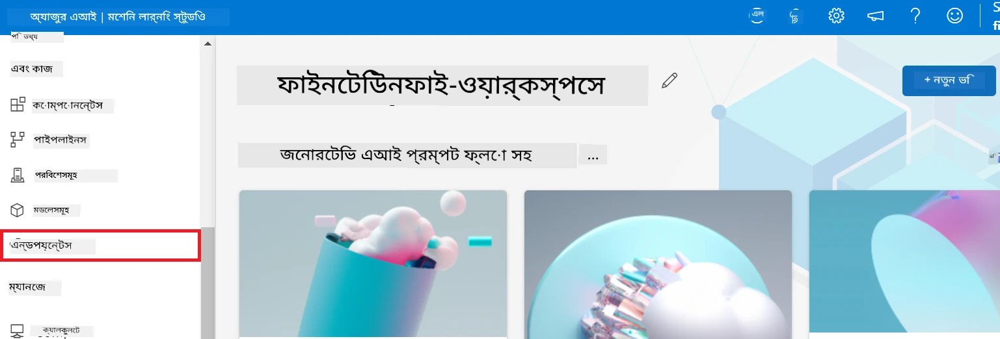

2. আপনি যে এন্ডপয়েন্ট তৈরি করেছেন সেটি নির্বাচন করুন।

    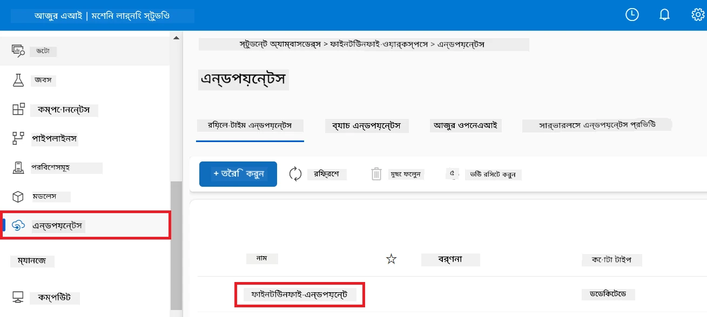

3. এই পৃষ্ঠায়, আপনি ডিপ্লয়মেন্ট প্রক্রিয়ার সময় তৈরি করা এন্ডপয়েন্টগুলি পরিচালনা করতে পারেন।

## দৃশ্যপট ৩: Prompt flow-এর সঙ্গে একীভূতকরণ এবং আপনার কাস্টম মডেলের সাথে চ্যাট করুন

### কাস্টম Phi-3 মডেলকে Prompt flow-এর সঙ্গে একীভূত করা

আপনার ফাইন-টিউন করা মডেল সফলভাবে ডিপ্লয় করার পর, এখন আপনি এটিকে Prompt flow-এর সাথে একীভূত করতে পারেন যাতে আপনার মডেলটি রিয়েল-টাইম অ্যাপ্লিকেশনগুলিতে ব্যবহার করতে পারেন, যা আপনার কাস্টম Phi-3 মডেলের সঙ্গে বিভিন্ন ইন্টারেক্টিভ কাজের সুযোগ করে দেয়।

#### ফাইন-টিউন করা Phi-3 মডেলের api key এবং endpoint uri সেট করুন

1. আপনি যে Azure Machine Learning ওয়ার্কস্পেস তৈরি করেছেন তাতে যান।
1. বাম সাইডের ট্যাব থেকে **Endpoints** নির্বাচন করুন।
1. আপনি যে এন্ডপয়েন্ট তৈরি করেছেন সেটি নির্বাচন করুন।
1. নেভিগেশন মেনু থেকে **Consume** নির্বাচন করুন।
1. আপনার **REST endpoint** কপি করে *config.py* ফাইলে `AZURE_ML_ENDPOINT = "your_fine_tuned_model_endpoint_uri"` এর জায়গায় পেস্ট করুন।
1. আপনার **Primary key** কপি করে *config.py* ফাইলে `AZURE_ML_API_KEY = "your_fine_tuned_model_api_key"` এর জায়গায় পেস্ট করুন।

    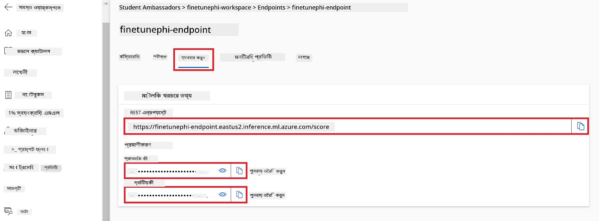

#### *flow.dag.yml* ফাইলে কোড যোগ করুন

1. Visual Studio Code-এ *flow.dag.yml* ফাইলটি খুলুন।

1. *flow.dag.yml* ফাইলে নিচের কোডটি যোগ করুন।

    ```yml
    inputs:
      input_data:
        type: string
        default: "Who founded Microsoft?"

    outputs:
      answer:
        type: string
        reference: ${integrate_with_promptflow.output}

    nodes:
    - name: integrate_with_promptflow
      type: python
      source:
        type: code
        path: integrate_with_promptflow.py
      inputs:
        input_data: ${inputs.input_data}
    ```

#### *integrate_with_promptflow.py* ফাইলে কোড যোগ করুন

1. Visual Studio Code-এ *integrate_with_promptflow.py* ফাইলটি খুলুন।

1. *integrate_with_promptflow.py* ফাইলে নিচের কোডটি যোগ করুন।

    ```python
    import logging
    import requests
    from promptflow.core import tool
    import asyncio
    import platform
    from config import (
        AZURE_ML_ENDPOINT,
        AZURE_ML_API_KEY
    )

    # লগিং সেটআপ
    logging.basicConfig(
        format="%(asctime)s - %(levelname)s - %(name)s - %(message)s",
        datefmt="%Y-%m-%d %H:%M:%S",
        level=logging.DEBUG
    )
    logger = logging.getLogger(__name__)

    def query_azml_endpoint(input_data: list, endpoint_url: str, api_key: str) -> str:
        """
        Send a request to the Azure ML endpoint with the given input data.
        """
        headers = {
            "Content-Type": "application/json",
            "Authorization": f"Bearer {api_key}"
        }
        data = {
            "input_data": [input_data],
            "params": {
                "temperature": 0.7,
                "max_new_tokens": 128,
                "do_sample": True,
                "return_full_text": True
            }
        }
        try:
            response = requests.post(endpoint_url, json=data, headers=headers)
            response.raise_for_status()
            result = response.json()[0]
            logger.info("Successfully received response from Azure ML Endpoint.")
            return result
        except requests.exceptions.RequestException as e:
            logger.error(f"Error querying Azure ML Endpoint: {e}")
            raise

    def setup_asyncio_policy():
        """
        Setup asyncio event loop policy for Windows.
        """
        if platform.system() == 'Windows':
            asyncio.set_event_loop_policy(asyncio.WindowsSelectorEventLoopPolicy())
            logger.info("Set Windows asyncio event loop policy.")

    @tool
    def my_python_tool(input_data: str) -> str:
        """
        Tool function to process input data and query the Azure ML endpoint.
        """
        setup_asyncio_policy()
        return query_azml_endpoint(input_data, AZURE_ML_ENDPOINT, AZURE_ML_API_KEY)

    ```

### আপনার কাস্টম মডেলের সাথে চ্যাট করুন

1. *deploy_model.py* স্ক্রিপ্ট চালাতে এবং Azure Machine Learning-এ ডিপ্লয়মেন্ট প্রক্রিয়া শুরু করতে নিচের কমান্ড টাইপ করুন।

    ```python
    pf flow serve --source ./ --port 8080 --host localhost
    ```

1. এখানে ফলাফলের একটি উদাহরণ দেওয়া হলো: এখন আপনি আপনার কাস্টম Phi-3 মডেলের সাথে চ্যাট করতে পারেন। ফাইন-টিউন করার জন্য ব্যবহৃত ডেটার ভিত্তিতে প্রশ্ন করা উত্তম বলে সুপারিশ করা হয়।

    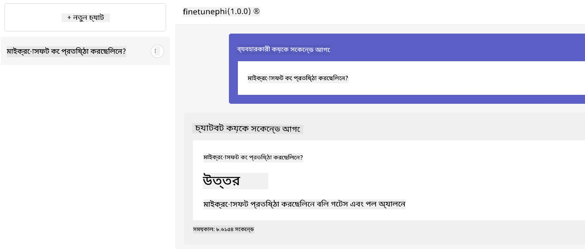

---

<!-- CO-OP TRANSLATOR DISCLAIMER START -->
**অস্বীকৃতি**:  
এই নথিটি AI অনুবাদ সেবা [Co-op Translator](https://github.com/Azure/co-op-translator) ব্যবহার করে অনূদিত হয়েছে। যদিও আমরা যথাসাধ্য সঠিকতার জন্য চেষ্টা করি, অনুগ্রহ করে বুঝবেন যে স্বয়ংক্রিয় অনুবাদে ভুল বা অসঙ্গতি থাকতে পারে। মূল নথি তার স্থানীয় ভাষায়ই কর্তৃত্বপূর্ণ উৎস হিসেবে গৃহীত হওয়া উচিত। গুরুত্বপূর্ণ তথ্যের জন্য পেশাদার মানুষের অনুবাদের পরামর্শ দেওয়া হয়। এই অনুবাদের ব্যবহারে কোনো ভুল বোঝাবুঝি বা ভুল ব্যাখ্যার জন্য আমরা দায়িত্ব গ্রহণ করি না।
<!-- CO-OP TRANSLATOR DISCLAIMER END -->