<!--
CO_OP_TRANSLATOR_METADATA:
{
  "original_hash": "ecbd9179a21edbaafaf114d47f09f3e3",
  "translation_date": "2025-05-09T17:55:20+00:00",
  "source_file": "md/02.Application/01.TextAndChat/Phi3/E2E_Phi-3-FineTuning_PromptFlow_Integration_AIFoundry.md",
  "language_code": "bn"
}
-->
# Fine-tune এবং Azure AI Foundry-তে Prompt flow এর সাথে কাস্টম Phi-3 মডেল একত্রিত করুন

এই end-to-end (E2E) স্যাম্পলটি Microsoft Tech Community এর "[Fine-Tune and Integrate Custom Phi-3 Models with Prompt Flow in Azure AI Foundry](https://techcommunity.microsoft.com/t5/educator-developer-blog/fine-tune-and-integrate-custom-phi-3-models-with-prompt-flow-in/ba-p/4191726?WT.mc_id=aiml-137032-kinfeylo)" গাইডের উপর ভিত্তি করে তৈরি। এটি Azure AI Foundry-তে Prompt flow এর সাথে কাস্টম Phi-3 মডেল ফাইন-টিউনিং, ডিপ্লয়মেন্ট এবং ইন্টিগ্রেশনের প্রক্রিয়া তুলে ধরে।  
E2E স্যাম্পলের বিপরীতে, "[Fine-Tune and Integrate Custom Phi-3 Models with Prompt Flow](./E2E_Phi-3-FineTuning_PromptFlow_Integration.md)" যেখানে কোড লোকালভাবে চালানো হয়েছিল, এই টিউটোরিয়ালটি সম্পূর্ণভাবে Azure AI / ML Studio-র মধ্যে মডেল ফাইন-টিউনিং এবং ইন্টিগ্রেশনের উপর কেন্দ্রীভূত।

## ওভারভিউ

এই E2E স্যাম্পলে, আপনি শিখবেন কীভাবে Phi-3 মডেল ফাইন-টিউন করতে হয় এবং Azure AI Foundry-তে Prompt flow এর সাথে একত্রিত করতে হয়। Azure AI / ML Studio ব্যবহার করে, আপনি কাস্টম AI মডেল ডিপ্লয় এবং ব্যবহারের জন্য একটি ওয়ার্কফ্লো তৈরি করবেন। এই E2E স্যাম্পল তিনটি দৃশ্যপট (scenario) এ ভাগ করা হয়েছে:

**দৃশ্যপট ১: Azure রিসোর্স সেটআপ এবং ফাইন-টিউনিং-এর জন্য প্রস্তুতি**  

**দৃশ্যপট ২: Phi-3 মডেল ফাইন-টিউন এবং Azure Machine Learning Studio-তে ডিপ্লয়**  

**দৃশ্যপট ৩: Prompt flow-এর সাথে ইন্টিগ্রেট এবং Azure AI Foundry-তে আপনার কাস্টম মডেলের সাথে চ্যাট করুন**  

নিচে এই E2E স্যাম্পলের একটি সারাংশ দেওয়া হলো।

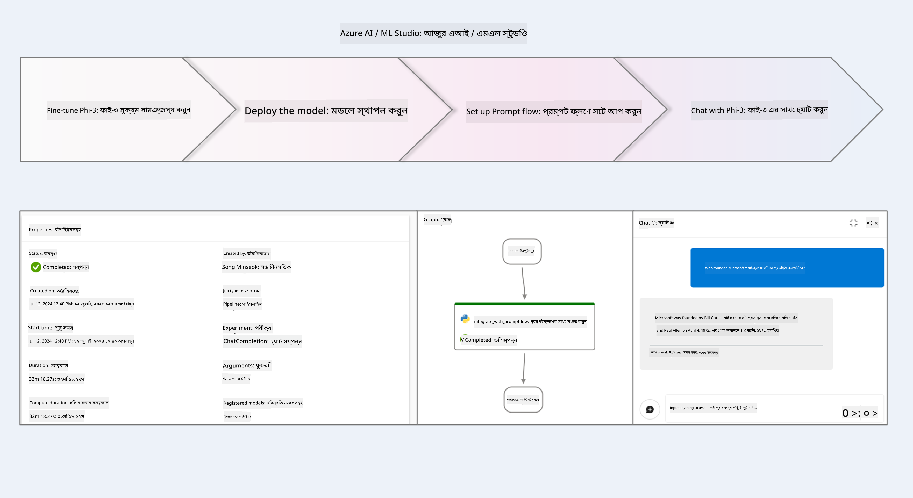

### বিষয়বস্তু সূচি

1. **[দৃশ্যপট ১: Azure রিসোর্স সেটআপ এবং ফাইন-টিউনিং-এর জন্য প্রস্তুতি](../../../../../../md/02.Application/01.TextAndChat/Phi3)**  
    - [Azure Machine Learning ওয়ার্কস্পেস তৈরি করুন](../../../../../../md/02.Application/01.TextAndChat/Phi3)  
    - [Azure সাবস্ক্রিপশনে GPU কোটা অনুরোধ করুন](../../../../../../md/02.Application/01.TextAndChat/Phi3)  
    - [রোল অ্যাসাইনমেন্ট যোগ করুন](../../../../../../md/02.Application/01.TextAndChat/Phi3)  
    - [প্রজেক্ট সেটআপ করুন](../../../../../../md/02.Application/01.TextAndChat/Phi3)  
    - [ফাইন-টিউনিং-এর জন্য ডেটাসেট প্রস্তুত করুন](../../../../../../md/02.Application/01.TextAndChat/Phi3)  

1. **[দৃশ্যপট ২: Phi-3 মডেল ফাইন-টিউন এবং Azure Machine Learning Studio-তে ডিপ্লয়](../../../../../../md/02.Application/01.TextAndChat/Phi3)**  
    - [Phi-3 মডেল ফাইন-টিউন করুন](../../../../../../md/02.Application/01.TextAndChat/Phi3)  
    - [ফাইন-টিউন করা Phi-3 মডেল ডিপ্লয় করুন](../../../../../../md/02.Application/01.TextAndChat/Phi3)  

1. **[দৃশ্যপট ৩: Prompt flow-এর সাথে ইন্টিগ্রেট এবং Azure AI Foundry-তে আপনার কাস্টম মডেলের সাথে চ্যাট করুন](../../../../../../md/02.Application/01.TextAndChat/Phi3)**  
    - [কাস্টম Phi-3 মডেল Prompt flow-এর সাথে ইন্টিগ্রেট করুন](../../../../../../md/02.Application/01.TextAndChat/Phi3)  
    - [আপনার কাস্টম Phi-3 মডেলের সাথে চ্যাট করুন](../../../../../../md/02.Application/01.TextAndChat/Phi3)  

## দৃশ্যপট ১: Azure রিসোর্স সেটআপ এবং ফাইন-টিউনিং-এর জন্য প্রস্তুতি

### Azure Machine Learning ওয়ার্কস্পেস তৈরি করুন

1. পোর্টালের উপরের **সার্চ বার**-এ *azure machine learning* টাইপ করুন এবং প্রদর্শিত অপশন থেকে **Azure Machine Learning** নির্বাচন করুন।

    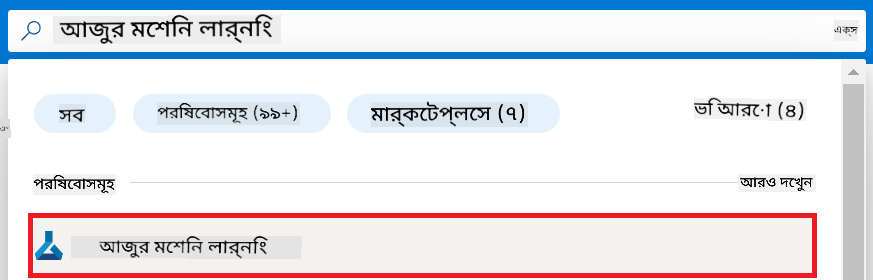

2. ন্যাভিগেশন মেনু থেকে **+ Create** নির্বাচন করুন।

3. ন্যাভিগেশন মেনু থেকে **New workspace** নির্বাচন করুন।

    

4. নিম্নলিখিত কাজগুলো সম্পন্ন করুন:

    - আপনার Azure **Subscription** নির্বাচন করুন।  
    - ব্যবহার করার জন্য **Resource group** নির্বাচন করুন (প্রয়োজনে নতুন তৈরি করুন)।  
    - **Workspace Name** লিখুন। এটি অবশ্যই ইউনিক হতে হবে।  
    - আপনি যে **Region** ব্যবহার করতে চান তা নির্বাচন করুন।  
    - ব্যবহার করার জন্য **Storage account** নির্বাচন করুন (প্রয়োজনে নতুন তৈরি করুন)।  
    - ব্যবহার করার জন্য **Key vault** নির্বাচন করুন (প্রয়োজনে নতুন তৈরি করুন)।  
    - ব্যবহার করার জন্য **Application insights** নির্বাচন করুন (প্রয়োজনে নতুন তৈরি করুন)।  
    - ব্যবহার করার জন্য **Container registry** নির্বাচন করুন (প্রয়োজনে নতুন তৈরি করুন)।  

    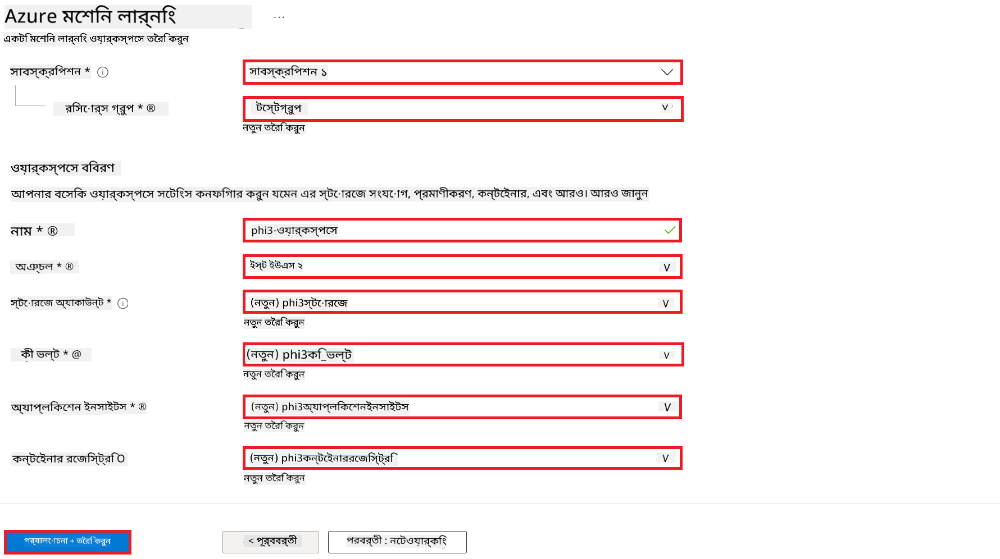

5. **Review + Create** নির্বাচন করুন।

6. **Create** নির্বাচন করুন।

### Azure সাবস্ক্রিপশনে GPU কোটা অনুরোধ করুন

এই টিউটোরিয়ালে, আপনি Phi-3 মডেল ফাইন-টিউন এবং ডিপ্লয় করার জন্য GPU ব্যবহার করবেন। ফাইন-টিউনিং-এর জন্য *Standard_NC24ads_A100_v4* GPU ব্যবহার করবেন, যার জন্য কোটা অনুরোধ প্রয়োজন। ডিপ্লয়মেন্টের জন্য *Standard_NC6s_v3* GPU ব্যবহার করবেন, যার জন্যও কোটা অনুরোধ প্রয়োজন।

> [!NOTE]  
> শুধুমাত্র Pay-As-You-Go সাবস্ক্রিপশন (স্ট্যান্ডার্ড সাবস্ক্রিপশন টাইপ) GPU বরাদ্দের জন্য উপযুক্ত; বেনিফিট সাবস্ক্রিপশন বর্তমানে সমর্থিত নয়।  

1. [Azure ML Studio](https://ml.azure.com/home?wt.mc_id=studentamb_279723) এ যান।

1. *Standard NCADSA100v4 Family* কোটা অনুরোধ করতে নিম্নলিখিত কাজগুলো করুন:

    - বাম পাশের ট্যাব থেকে **Quota** নির্বাচন করুন।  
    - ব্যবহার করার জন্য **Virtual machine family** নির্বাচন করুন। যেমন, *Standard NCADSA100v4 Family Cluster Dedicated vCPUs* নির্বাচন করুন, যা *Standard_NC24ads_A100_v4* GPU অন্তর্ভুক্ত।  
    - ন্যাভিগেশন মেনু থেকে **Request quota** নির্বাচন করুন।  

        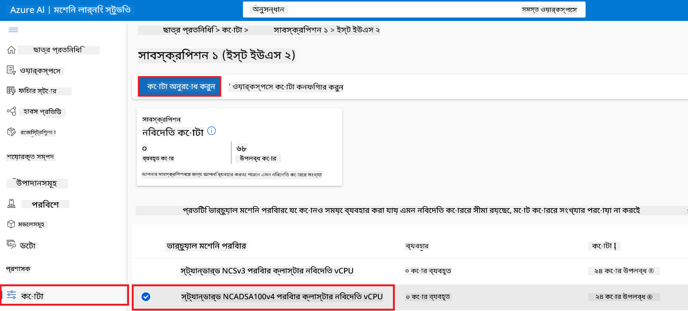

    - Request quota পৃষ্ঠায়, আপনি যে **New cores limit** ব্যবহার করতে চান তা লিখুন। যেমন, ২৪।  
    - Request quota পৃষ্ঠায়, GPU কোটা অনুরোধ করতে **Submit** নির্বাচন করুন।  

1. *Standard NCSv3 Family* কোটা অনুরোধ করতে নিম্নলিখিত কাজগুলো করুন:

    - বাম পাশের ট্যাব থেকে **Quota** নির্বাচন করুন।  
    - ব্যবহার করার জন্য **Virtual machine family** নির্বাচন করুন। যেমন, *Standard NCSv3 Family Cluster Dedicated vCPUs* নির্বাচন করুন, যা *Standard_NC6s_v3* GPU অন্তর্ভুক্ত।  
    - ন্যাভিগেশন মেনু থেকে **Request quota** নির্বাচন করুন।  
    - Request quota পৃষ্ঠায়, আপনি যে **New cores limit** ব্যবহার করতে চান তা লিখুন। যেমন, ২৪।  
    - Request quota পৃষ্ঠায়, GPU কোটা অনুরোধ করতে **Submit** নির্বাচন করুন।  

### রোল অ্যাসাইনমেন্ট যোগ করুন

আপনার মডেল ফাইন-টিউন এবং ডিপ্লয় করার জন্য, প্রথমে একটি User Assigned Managed Identity (UAI) তৈরি করতে হবে এবং তাকে যথাযথ পারমিশন দিতে হবে। এই UAI ডিপ্লয়মেন্টের সময় প্রমাণীকরণের জন্য ব্যবহৃত হবে।

#### User Assigned Managed Identity (UAI) তৈরি করুন

1. পোর্টালের উপরের **সার্চ বার**-এ *managed identities* টাইপ করুন এবং প্রদর্শিত অপশন থেকে **Managed Identities** নির্বাচন করুন।

    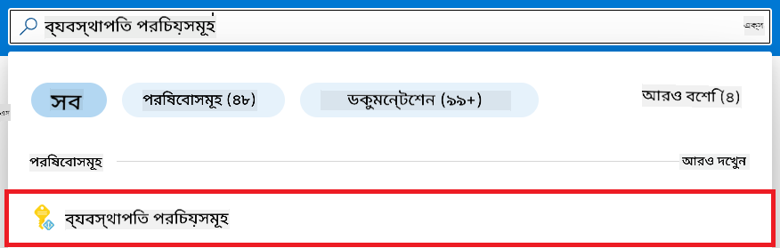

1. **+ Create** নির্বাচন করুন।

    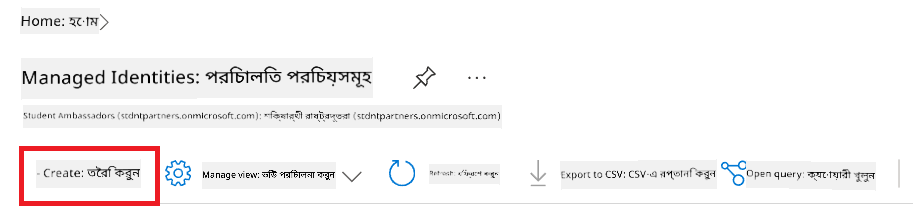

1. নিম্নলিখিত কাজগুলো করুন:

    - আপনার Azure **Subscription** নির্বাচন করুন।  
    - ব্যবহার করার জন্য **Resource group** নির্বাচন করুন (প্রয়োজনে নতুন তৈরি করুন)।  
    - আপনি যে **Region** ব্যবহার করতে চান তা নির্বাচন করুন।  
    - **Name** লিখুন। এটি অবশ্যই ইউনিক হতে হবে।  

    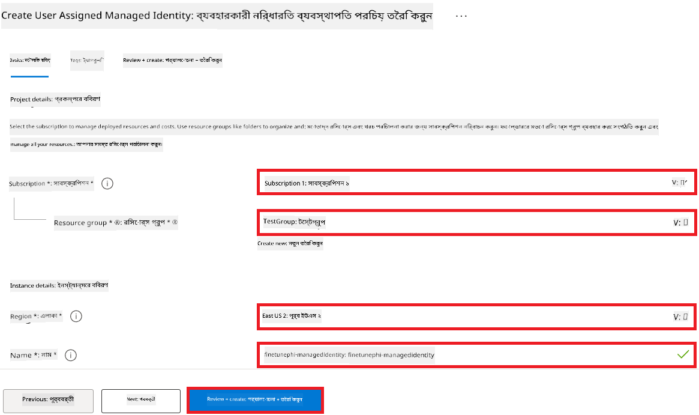

1. **Review + create** নির্বাচন করুন।

1. **+ Create** নির্বাচন করুন।

#### Managed Identity-তে Contributor রোল অ্যাসাইন করুন

1. আপনি যে Managed Identity তৈরি করেছেন সেই রিসোর্সে যান।

1. বাম পাশের ট্যাব থেকে **Azure role assignments** নির্বাচন করুন।

1. ন্যাভিগেশন মেনু থেকে **+Add role assignment** নির্বাচন করুন।

1. Add role assignment পৃষ্ঠায় নিম্নলিখিত কাজগুলো করুন:  
    - **Scope** হিসেবে **Resource group** নির্বাচন করুন।  
    - আপনার Azure **Subscription** নির্বাচন করুন।  
    - ব্যবহার করার জন্য **Resource group** নির্বাচন করুন।  
    - **Role** হিসেবে **Contributor** নির্বাচন করুন।  

    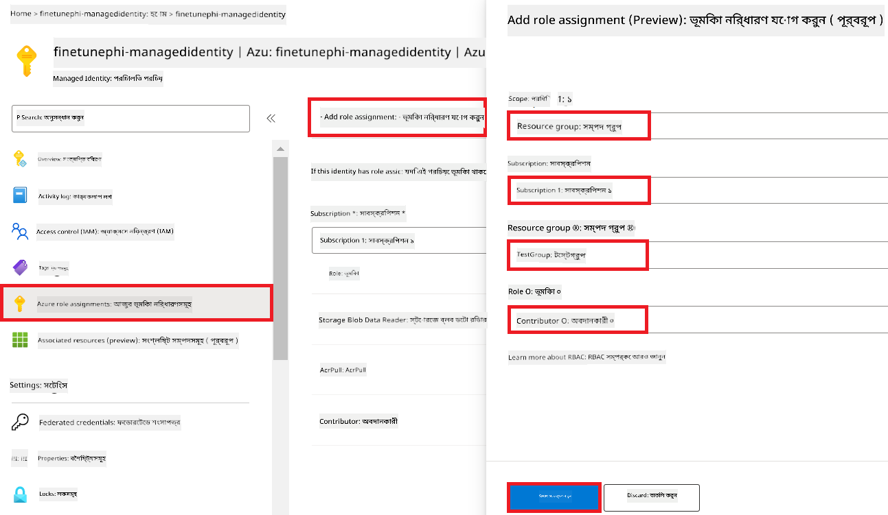

2. **Save** নির্বাচন করুন।

#### Managed Identity-তে Storage Blob Data Reader রোল অ্যাসাইন করুন

1. পোর্টালের উপরের **সার্চ বার**-এ *storage accounts* টাইপ করুন এবং প্রদর্শিত অপশন থেকে **Storage accounts** নির্বাচন করুন।

    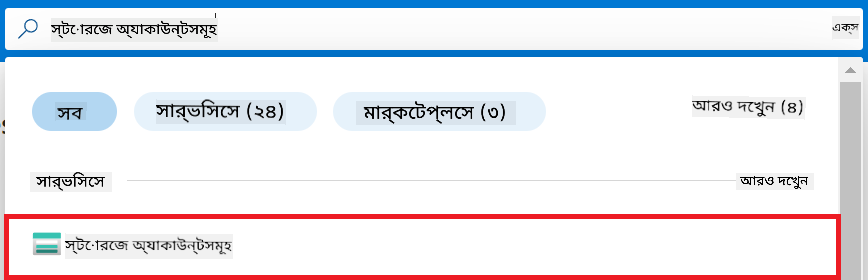

1. আপনি যে Azure Machine Learning ওয়ার্কস্পেস তৈরি করেছেন তার সাথে যুক্ত স্টোরেজ অ্যাকাউন্ট নির্বাচন করুন। যেমন, *finetunephistorage*।

1. Add role assignment পৃষ্ঠায় যেতে নিম্নলিখিত কাজগুলো করুন:

    - আপনার তৈরি করা Azure Storage অ্যাকাউন্টে যান।  
    - বাম পাশের ট্যাব থেকে **Access Control (IAM)** নির্বাচন করুন।  
    - ন্যাভিগেশন মেনু থেকে **+ Add** নির্বাচন করুন।  
    - ন্যাভিগেশন মেনু থেকে **Add role assignment** নির্বাচন করুন।  

    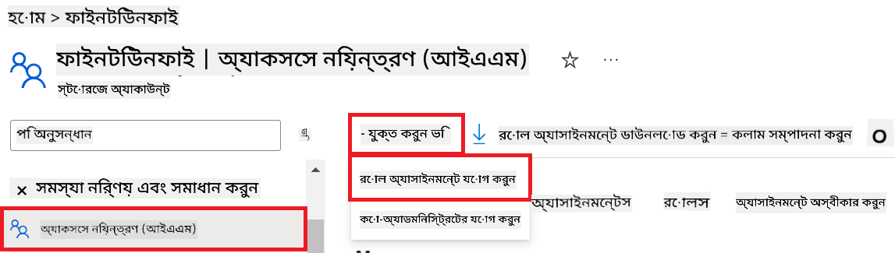

1. Add role assignment পৃষ্ঠায় নিম্নলিখিত কাজগুলো করুন:

    - Role পৃষ্ঠায়, সার্চ বক্সে *Storage Blob Data Reader* লিখুন এবং প্রদর্শিত অপশন থেকে **Storage Blob Data Reader** নির্বাচন করুন।  
    - Role পৃষ্ঠায় **Next** নির্বাচন করুন।  
    - Members পৃষ্ঠায়, **Assign access to** হিসেবে **Managed identity** নির্বাচন করুন।  
    - Members পৃষ্ঠায় **+ Select members** নির্বাচন করুন।  
    - Select managed identities পৃষ্ঠায় আপনার Azure **Subscription** নির্বাচন করুন।  
    - Select managed identities পৃষ্ঠায় **Managed identity** হিসেবে **Manage Identity** নির্বাচন করুন।  
    - Select managed identities পৃষ্ঠায় আপনি যে Managed Identity তৈরি করেছেন তা নির্বাচন করুন। যেমন, *finetunephi-managedidentity*।  
    - Select managed identities পৃষ্ঠায় **Select** নির্বাচন করুন।  

    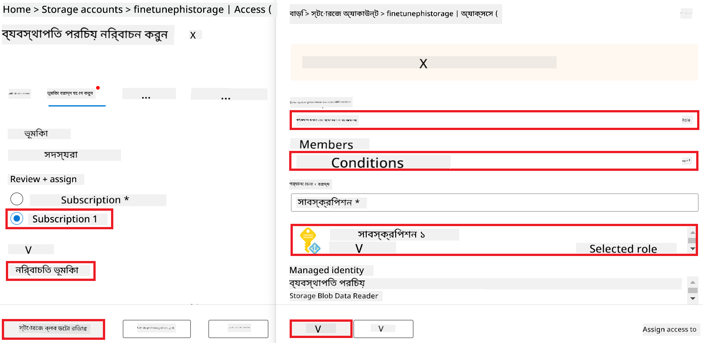

1. **Review + assign** নির্বাচন করুন।

#### Managed Identity-তে AcrPull রোল অ্যাসাইন করুন

1. পোর্টালের উপরের **সার্চ বার**-এ *container registries* টাইপ করুন এবং প্রদর্শিত অপশন থেকে **Container registries** নির্বাচন করুন।

    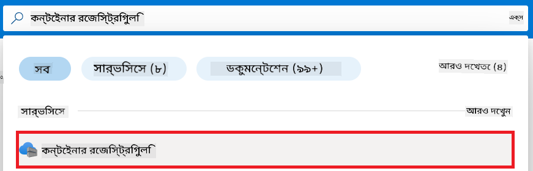

1. Azure Machine Learning ওয়ার্কস্পেসের সাথে যুক্ত container registry নির্বাচন করুন। যেমন, *finetunephicontainerregistry*।

1. Add role assignment পৃষ্ঠায় যেতে নিম্নলিখিত কাজগুলো করুন:

    - বাম পাশের ট্যাব থেকে **Access Control (IAM)** নির্বাচন করুন।  
    - ন্যাভিগেশন মেনু থেকে **+ Add** নির্বাচন করুন।  
    - ন্যাভিগেশন মেনু থেকে **Add role assignment** নির্বাচন করুন।  

1. Add role assignment পৃষ্ঠায় নিম্নলিখিত কাজগুলো করুন:

    - Role পৃষ্ঠায়, সার্চ বক্সে *AcrPull* লিখুন এবং প্রদর্শিত অপশন থেকে **AcrPull** নির্বাচন করুন।  
    - Role পৃষ্ঠায় **Next** নির্বাচন করুন।  
    - Members পৃষ্ঠায়, **Assign access to** হিসেবে **Managed identity** নির্বাচন করুন।  
    - Members পৃষ্ঠায় **+ Select members** নির্বাচন করুন।  
    - Select managed identities পৃষ্ঠায় আপনার Azure **Subscription** নির্বাচন করুন।  
    - Select managed identities পৃষ্ঠায় **Managed identity** হিসেবে **Manage Identity** নির্বাচন করুন।  
    - Select managed identities পৃষ্ঠায় আপনি যে Managed Identity তৈরি করেছেন তা নির্বাচন করুন। যেমন, *finetunephi-managedidentity*।  
    - Select managed identities পৃষ্ঠায় **Select** নির্বাচন করুন।  
    - **Review + assign** নির্বাচন করুন।

### প্রজেক্ট সেটআপ করুন

ফাইন-টিউনিং-এর জন্য প্রয়োজনীয় ডেটাসেট ডাউনলোড করতে, আপনি একটি লোকাল পরিবেশ সেটআপ করবেন।

এই অনুশীলনে, আপনি:

- কাজ করার জন্য একটি ফোল্ডার তৈরি করবেন।  
- একটি ভার্চুয়াল এনভায়রনমেন্ট তৈরি করবেন।  
- প্রয়োজনীয় প্যাকেজসমূহ ইনস্টল করবেন।  
- ডেটাসেট ডাউনলোড করার জন্য *download_dataset.py* ফাইল তৈরি করবেন।  

#### কাজ করার জন্য একটি ফোল্ডার তৈরি করুন

1. একটি টার্মিনাল উইন্ডো খুলুন এবং ডিফল্ট পাথে *finetune-phi* নামে একটি ফোল্ডার তৈরি করতে নিম্নলিখিত কমান্ড টাইপ করুন।

    ```console
    mkdir finetune-phi
    ```

2. আপনার টার্মিনালে নিম্নলিখিত কমান্ড টাইপ করে তৈরি করা *finetune-phi* ফোল্ডারে যান।

    ```console
    cd finetune-phi
    ```

#### ভার্চুয়াল এনভায়রনমেন্ট তৈরি করুন

1. আপনার টার্মিনালে নিম্নলিখিত কমান্ড টাইপ করে *.venv* নামে একটি ভার্চুয়াল এনভায়রনমেন্ট তৈরি করুন।

    ```console
    python -m venv .venv
    ```

2. আপনার টার্মিনালে নিম্নলিখিত কমান্ড টাইপ করে ভার্চুয়াল এনভায়রনমেন্ট সক্রিয় করুন।

    ```console
    .venv\Scripts\activate.bat
    ```

> [!NOTE]  
> যদি সফল হয়, তাহলে কমান্ড প্রম্পটের আগে *(.venv)* দেখতে পাবেন।

#### প্রয়োজনীয় প্যাকেজসমূহ ইনস্টল করুন

1. আপনার টার্মিনালে নিম্নলিখিত কমান্ডসমূহ টাইপ করে প্রয়োজনীয় প্যাকেজসমূহ ইনস্টল করুন।

    ```console
    pip install datasets==2.19.1
    ```

#### `download_dataset.py` তৈরি করুন

> [!NOTE]  
> সম্পূর্ণ ফোল্ডার স্ট্রাকচার:  
>  
> ```text
> └── YourUserName
> .    └── finetune-phi
> .        └── download_dataset.py
> ```

1. **Visual Studio Code** খুলুন।

1. মেনুবার থেকে **File** নির্বাচন করুন।

1. **Open Folder** নির্বাচন করুন।

1. আপনি যে *finetune-phi* ফোল্ডার তৈরি করেছেন তা নির্বাচন করুন, যা *C:\Users\yourUserName\finetune-phi* অবস্থানে রয়েছে।

    

1. Visual Studio Code-এর বাম প্যানে রাইট-ক্লিক করে **New File** নির্বাচন করুন এবং *download_dataset.py* নামে একটি নতুন ফাইল তৈরি করুন।

    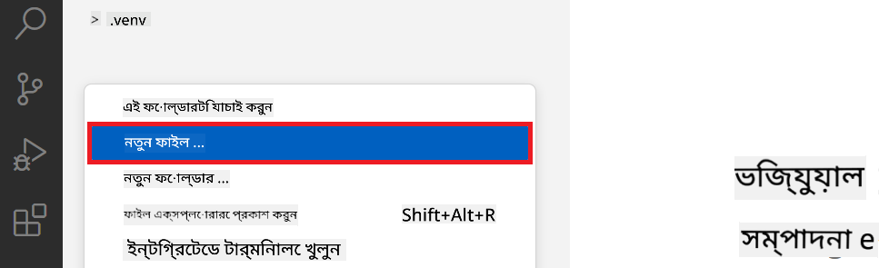

### ফাইন-টিউনিং-এর জন্য ডেটাসেট প্রস্তুত করুন

এই অনুশীলনে, আপনি *download_dataset.py* ফাইল চালিয়ে *ultrachat_200k* ডেটাসেট আপনার লোকাল পরিবেশে ডাউনলোড করবেন। এরপর এই ডেটাসেট ব্যবহার করে Azure Machine Learning-এ Phi-3 মডেল ফাইন-টিউন করবেন।

এই অনুশীলনে, আপনি:

- *download_dataset.py* ফাইলে ডেটাসেট ডাউনলোড করার কোড যোগ করবেন।  
- *download_dataset.py* ফাইল চালিয়ে ডেটাসেট আপনার লোকাল পরিবেশে
1. [Azure ML Studio](https://ml.azure.com/home?wt.mc_id=studentamb_279723) এ যান।

1. বাম পাশের ট্যাব থেকে **Compute** নির্বাচন করুন।

1. নেভিগেশন মেনু থেকে **Compute clusters** নির্বাচন করুন।

1. **+ New** নির্বাচন করুন।

    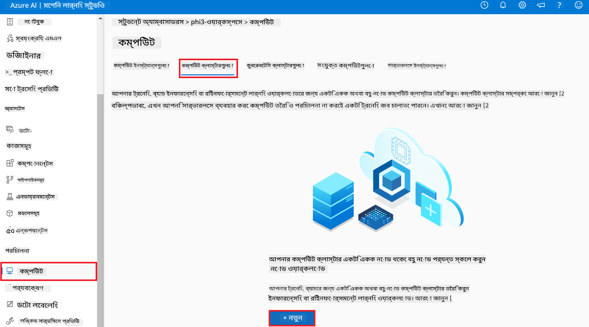

1. নিম্নলিখিত কাজগুলি সম্পাদন করুন:

    - আপনি যে **Region** ব্যবহার করতে চান তা নির্বাচন করুন।
    - **Virtual machine tier** নির্বাচন করুন **Dedicated** হিসেবে।
    - **Virtual machine type** নির্বাচন করুন **GPU** হিসেবে।
    - **Virtual machine size** ফিল্টার নির্বাচন করুন **Select from all options** হিসেবে।
    - **Virtual machine size** নির্বাচন করুন **Standard_NC24ads_A100_v4** হিসেবে।

    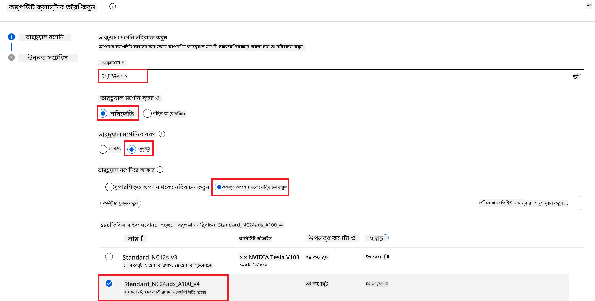

1. **Next** নির্বাচন করুন।

1. নিম্নলিখিত কাজগুলি সম্পাদন করুন:

    - **Compute name** লিখুন। এটি একটি অনন্য মান হতে হবে।
    - **Minimum number of nodes** নির্বাচন করুন **0** হিসেবে।
    - **Maximum number of nodes** নির্বাচন করুন **1** হিসেবে।
    - **Idle seconds before scale down** নির্বাচন করুন **120** হিসেবে।

    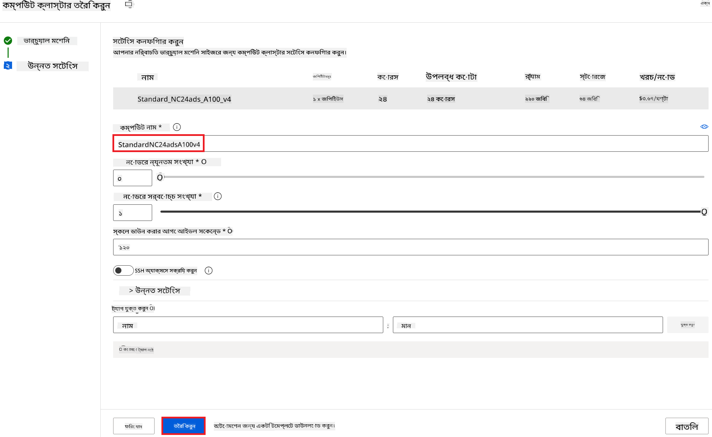

1. **Create** নির্বাচন করুন।

#### Phi-3 মডেল ফাইন-টিউন করুন

1. [Azure ML Studio](https://ml.azure.com/home?wt.mc_id=studentamb_279723) এ যান।

1. আপনি যে Azure Machine Learning workspace তৈরি করেছেন তা নির্বাচন করুন।

    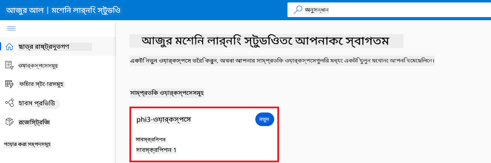

1. নিম্নলিখিত কাজগুলি সম্পাদন করুন:

    - বাম পাশের ট্যাব থেকে **Model catalog** নির্বাচন করুন।
    - **search bar** এ *phi-3-mini-4k* টাইপ করুন এবং প্রদর্শিত অপশন থেকে **Phi-3-mini-4k-instruct** নির্বাচন করুন।

    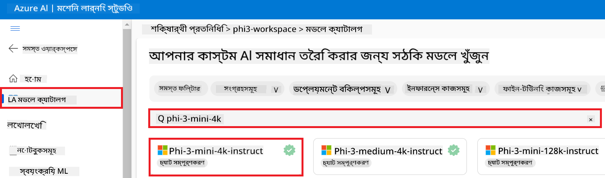

1. নেভিগেশন মেনু থেকে **Fine-tune** নির্বাচন করুন।

    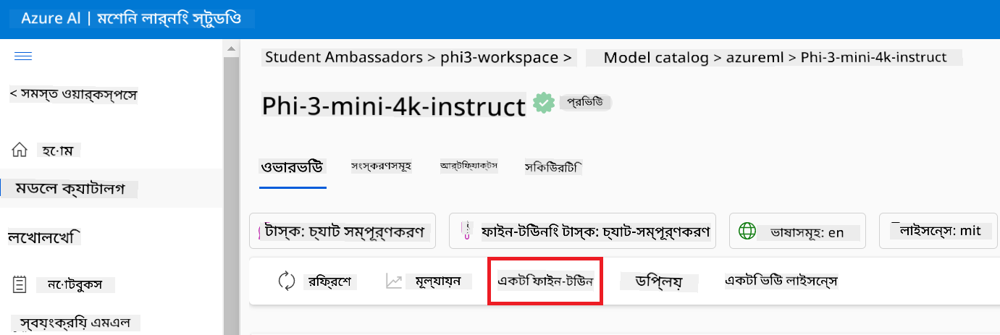

1. নিম্নলিখিত কাজগুলি সম্পাদন করুন:

    - **Select task type** নির্বাচন করুন **Chat completion** হিসেবে।
    - **+ Select data** নির্বাচন করে **Traning data** আপলোড করুন।
    - Validation data আপলোড টাইপ নির্বাচন করুন **Provide different validation data** হিসেবে।
    - **+ Select data** নির্বাচন করে **Validation data** আপলোড করুন।

    

    > [!TIP]
    >
    > আপনি **Advanced settings** নির্বাচন করে **learning_rate** এবং **lr_scheduler_type** এর মতো কনফিগারেশন কাস্টমাইজ করতে পারেন, যাতে ফাইন-টিউনিং প্রক্রিয়াটি আপনার নির্দিষ্ট প্রয়োজন অনুযায়ী অপ্টিমাইজ করা যায়।

1. **Finish** নির্বাচন করুন।

1. এই অনুশীলনে, আপনি সফলভাবে Azure Machine Learning ব্যবহার করে Phi-3 মডেল ফাইন-টিউন করেছেন। দয়া করে মনে রাখবেন, ফাইন-টিউনিং প্রক্রিয়াটি কিছুটা সময় নিতে পারে। ফাইন-টিউনিং কাজ চালানোর পরে, সম্পন্ন হওয়া পর্যন্ত অপেক্ষা করতে হবে। Azure Machine Learning Workspace এর বাম পাশের Jobs ট্যাবে গিয়ে আপনি ফাইন-টিউনিং কাজের অবস্থা পর্যবেক্ষণ করতে পারেন। পরবর্তী সিরিজে, আপনি ফাইন-টিউন করা মডেলটি ডিপ্লয় করবেন এবং Prompt flow এর সাথে ইন্টিগ্রেট করবেন।

    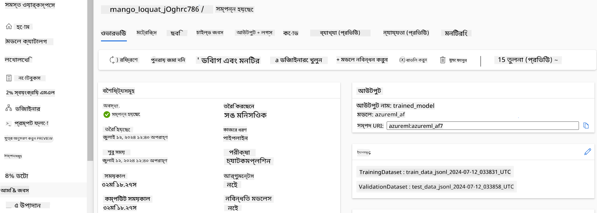

### ফাইন-টিউন করা Phi-3 মডেল ডিপ্লয় করুন

ফাইন-টিউন করা Phi-3 মডেলকে Prompt flow এর সাথে ইন্টিগ্রেট করতে, আপনাকে মডেলটি ডিপ্লয় করতে হবে যাতে এটি রিয়েল-টাইম ইনফারেন্সের জন্য অ্যাক্সেসযোগ্য হয়। এই প্রক্রিয়ায় মডেল রেজিস্টার করা, অনলাইন এন্ডপয়েন্ট তৈরি করা এবং মডেল ডিপ্লয় করা অন্তর্ভুক্ত।

এই অনুশীলনে, আপনি:

- Azure Machine Learning workspace এ ফাইন-টিউন করা মডেল রেজিস্টার করবেন।
- একটি অনলাইন এন্ডপয়েন্ট তৈরি করবেন।
- রেজিস্টার করা ফাইন-টিউন করা Phi-3 মডেল ডিপ্লয় করবেন।

#### ফাইন-টিউন করা মডেল রেজিস্টার করুন

1. [Azure ML Studio](https://ml.azure.com/home?wt.mc_id=studentamb_279723) এ যান।

1. আপনি যে Azure Machine Learning workspace তৈরি করেছেন তা নির্বাচন করুন।

    

1. বাম পাশের ট্যাব থেকে **Models** নির্বাচন করুন।

1. **+ Register** নির্বাচন করুন।

1. **From a job output** নির্বাচন করুন।

    

1. আপনি যে কাজটি তৈরি করেছেন তা নির্বাচন করুন।

    

1. **Next** নির্বাচন করুন।

1. **Model type** নির্বাচন করুন **MLflow** হিসেবে।

1. নিশ্চিত করুন যে **Job output** নির্বাচিত আছে; এটি স্বয়ংক্রিয়ভাবে নির্বাচিত হওয়া উচিত।

    

2. **Next** নির্বাচন করুন।

3. **Register** নির্বাচন করুন।

    

4. আপনি আপনার রেজিস্টার করা মডেল দেখতে পারবেন বাম পাশের ট্যাব থেকে **Models** মেনুতে গিয়ে।

    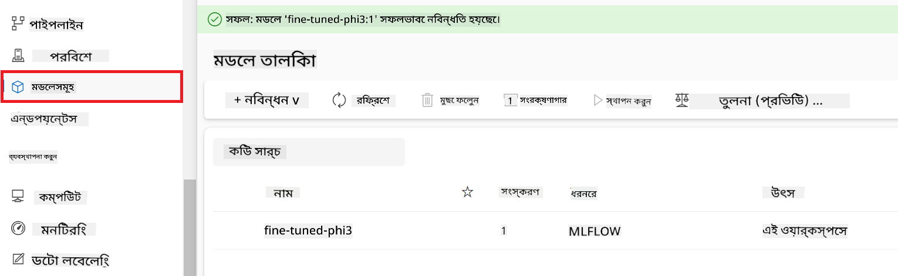

#### ফাইন-টিউন করা মডেল ডিপ্লয় করুন

1. আপনি যে Azure Machine Learning workspace তৈরি করেছেন সেখানে যান।

1. বাম পাশের ট্যাব থেকে **Endpoints** নির্বাচন করুন।

1. নেভিগেশন মেনু থেকে **Real-time endpoints** নির্বাচন করুন।

    

1. **Create** নির্বাচন করুন।

1. আপনি যে রেজিস্টার করা মডেলটি তৈরি করেছেন তা নির্বাচন করুন।

    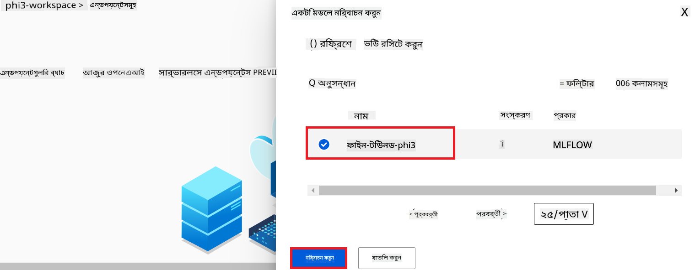

1. **Select** নির্বাচন করুন।

1. নিম্নলিখিত কাজগুলি সম্পাদন করুন:

    - **Virtual machine** নির্বাচন করুন *Standard_NC6s_v3* হিসেবে।
    - আপনি যে **Instance count** ব্যবহার করতে চান তা নির্বাচন করুন, উদাহরণস্বরূপ *1*।
    - **Endpoint** নির্বাচন করুন **New** হিসেবে নতুন এন্ডপয়েন্ট তৈরি করার জন্য।
    - **Endpoint name** লিখুন। এটি একটি অনন্য মান হতে হবে।
    - **Deployment name** লিখুন। এটি একটি অনন্য মান হতে হবে।

    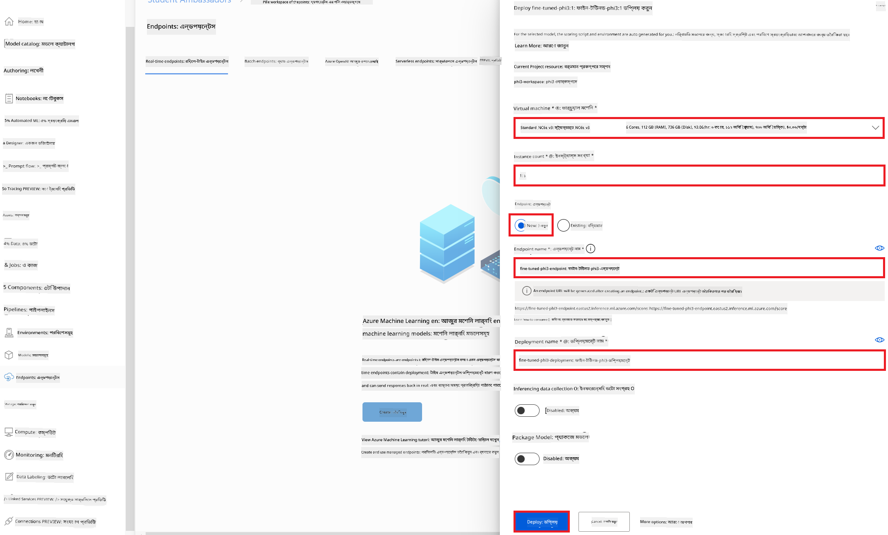

1. **Deploy** নির্বাচন করুন।

> [!WARNING]
> আপনার অ্যাকাউন্টে অতিরিক্ত চার্জ এড়াতে, Azure Machine Learning workspace এ তৈরি করা এন্ডপয়েন্টটি মুছে ফেলা নিশ্চিত করুন।
>

#### Azure Machine Learning Workspace এ ডিপ্লয়মেন্ট স্ট্যাটাস চেক করুন

1. আপনি যে Azure Machine Learning workspace তৈরি করেছেন সেখানে যান।

1. বাম পাশের ট্যাব থেকে **Endpoints** নির্বাচন করুন।

1. আপনি যে এন্ডপয়েন্টটি তৈরি করেছেন তা নির্বাচন করুন।

    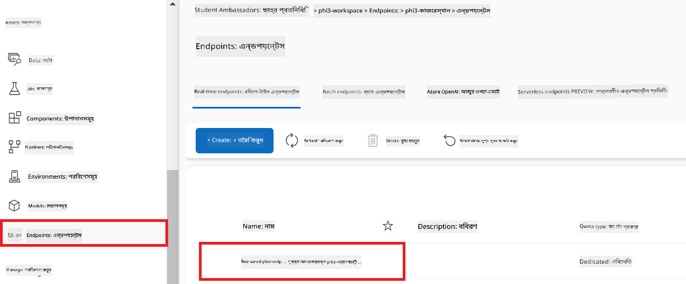

1. এই পৃষ্ঠায়, আপনি ডিপ্লয়মেন্ট প্রক্রিয়ার সময় এন্ডপয়েন্টগুলি পরিচালনা করতে পারেন।

> [!NOTE]
> ডিপ্লয়মেন্ট সম্পন্ন হলে, নিশ্চিত করুন যে **Live traffic** সেট করা আছে **100%** এ। যদি না থাকে, তবে ট্রাফিক সেটিংস সামঞ্জস্য করার জন্য **Update traffic** নির্বাচন করুন। মনে রাখবেন, ট্রাফিক 0% হলে মডেল টেস্ট করা যাবে না।
>
> 
>

## সিনারিও ৩: Prompt flow এর সাথে ইন্টিগ্রেট করুন এবং Azure AI Foundry তে আপনার কাস্টম মডেলের সাথে চ্যাট করুন

### Prompt flow এর সাথে কাস্টম Phi-3 মডেল ইন্টিগ্রেট করুন

আপনার ফাইন-টিউন করা মডেল সফলভাবে ডিপ্লয় করার পর, এখন আপনি এটি Prompt Flow এর সাথে ইন্টিগ্রেট করতে পারেন যাতে আপনার মডেলটি রিয়েল-টাইম অ্যাপ্লিকেশনগুলোতে ব্যবহার করা যায়, এবং আপনার কাস্টম Phi-3 মডেলের সাথে বিভিন্ন ইন্টারেক্টিভ কাজ করতে পারেন।

এই অনুশীলনে, আপনি:

- Azure AI Foundry Hub তৈরি করবেন।
- Azure AI Foundry Project তৈরি করবেন।
- Prompt flow তৈরি করবেন।
- ফাইন-টিউন করা Phi-3 মডেলের জন্য একটি কাস্টম কানেকশন যোগ করবেন।
- আপনার কাস্টম Phi-3 মডেলের সাথে চ্যাট করার জন্য Prompt flow সেটআপ করবেন।

> [!NOTE]
> আপনি Azure ML Studio ব্যবহার করেও Promptflow এর সাথে ইন্টিগ্রেট করতে পারেন। একই ইন্টিগ্রেশন প্রক্রিয়া Azure ML Studio তেও প্রযোজ্য।

#### Azure AI Foundry Hub তৈরি করুন

প্রজেক্ট তৈরি করার আগে একটি Hub তৈরি করতে হবে। একটি Hub একটি Resource Group এর মত কাজ করে, যা Azure AI Foundry এর মধ্যে একাধিক প্রজেক্টকে সংগঠিত ও পরিচালনা করতে সাহায্য করে।

1. [Azure AI Foundry](https://ai.azure.com/?WT.mc_id=aiml-137032-kinfeylo) এ যান।

1. বাম পাশের ট্যাব থেকে **All hubs** নির্বাচন করুন।

1. নেভিগেশন মেনু থেকে **+ New hub** নির্বাচন করুন।

    

1. নিম্নলিখিত কাজগুলি সম্পাদন করুন:

    - **Hub name** লিখুন। এটি একটি অনন্য মান হতে হবে।
    - আপনার Azure **Subscription** নির্বাচন করুন।
    - ব্যবহার করার জন্য **Resource group** নির্বাচন করুন (প্রয়োজনে নতুন তৈরি করুন)।
    - আপনি যে **Location** ব্যবহার করতে চান তা নির্বাচন করুন।
    - ব্যবহার করার জন্য **Connect Azure AI Services** নির্বাচন করুন (প্রয়োজনে নতুন তৈরি করুন)।
    - **Connect Azure AI Search** নির্বাচন করুন **Skip connecting** হিসেবে।

    

1. **Next** নির্বাচন করুন।

#### Azure AI Foundry Project তৈরি করুন

1. আপনি যে Hub তৈরি করেছেন সেখানে বাম পাশের ট্যাব থেকে **All projects** নির্বাচন করুন।

1. নেভিগেশন মেনু থেকে **+ New project** নির্বাচন করুন।

    

1. **Project name** লিখুন। এটি একটি অনন্য মান হতে হবে।

    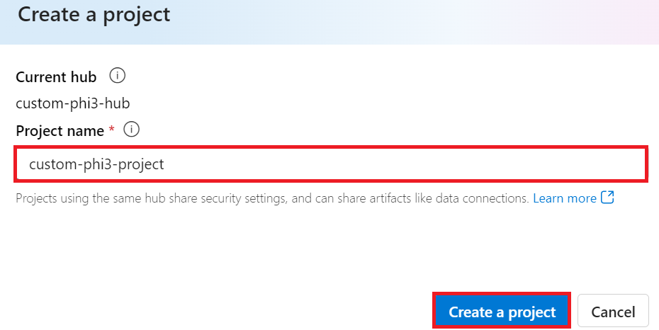

1. **Create a project** নির্বাচন করুন।

#### ফাইন-টিউন করা Phi-3 মডেলের জন্য একটি কাস্টম কানেকশন যোগ করুন

আপনার কাস্টম Phi-3 মডেলকে Prompt flow এর সাথে ইন্টিগ্রেট করতে, আপনাকে মডেলের এন্ডপয়েন্ট এবং কী কাস্টম কানেকশনে সংরক্ষণ করতে হবে। এই সেটআপ নিশ্চিত করে যে Prompt flow থেকে আপনার কাস্টম Phi-3 মডেলে অ্যাক্সেস পাওয়া যায়।

#### ফাইন-টিউন করা Phi-3 মডেলের api key এবং endpoint uri সেট করুন

1. [Azure ML Studio](https://ml.azure.com/home?WT.mc_id=aiml-137032-kinfeylo) এ যান।

1. আপনি যে Azure Machine Learning workspace তৈরি করেছেন সেখানে যান।

1. বাম পাশের ট্যাব থেকে **Endpoints** নির্বাচন করুন।

    

1. আপনি যে এন্ডপয়েন্ট তৈরি করেছেন তা নির্বাচন করুন।

    

1. নেভিগেশন মেনু থেকে **Consume** নির্বাচন করুন।

1. আপনার **REST endpoint** এবং **Primary key** কপি করুন।


#### কাস্টম কানেকশন যোগ করুন

1. [Azure AI Foundry](https://ai.azure.com/?WT.mc_id=aiml-137032-kinfeylo) এ যান।

1. আপনি যে Azure AI Foundry প্রকল্প তৈরি করেছেন সেটিতে যান।

1. আপনি যে প্রকল্পটি তৈরি করেছেন, সেখানে বাম পাশের ট্যাব থেকে **Settings** নির্বাচন করুন।

1. **+ New connection** নির্বাচন করুন।

    

1. নেভিগেশন মেনু থেকে **Custom keys** নির্বাচন করুন।

    

1. নিম্নলিখিত কাজগুলি করুন:

    - **+ Add key value pairs** নির্বাচন করুন।
    - কী নাম হিসেবে **endpoint** লিখুন এবং Azure ML Studio থেকে কপি করা endpoint টি value ফিল্ডে পেস্ট করুন।
    - আবার **+ Add key value pairs** নির্বাচন করুন।
    - কী নাম হিসেবে **key** লিখুন এবং Azure ML Studio থেকে কপি করা key টি value ফিল্ডে পেস্ট করুন।
    - কী গুলো যোগ করার পর, কী গুলো লুকানোর জন্য **is secret** নির্বাচন করুন।

    

1. **Add connection** নির্বাচন করুন।

#### Prompt flow তৈরি করুন

আপনি Azure AI Foundry-তে একটি কাস্টম কানেকশন যোগ করেছেন। এখন, নিচের ধাপগুলো অনুসরণ করে একটি Prompt flow তৈরি করুন। এরপর, এই Prompt flow-কে কাস্টম কানেকশনের সাথে সংযুক্ত করবেন যাতে আপনি Prompt flow-এর মধ্যে fine-tuned মডেল ব্যবহার করতে পারেন।

1. আপনি যে Azure AI Foundry প্রকল্প তৈরি করেছেন সেখানে যান।

1. বাম পাশের ট্যাব থেকে **Prompt flow** নির্বাচন করুন।

1. নেভিগেশন মেনু থেকে **+ Create** নির্বাচন করুন।

    

1. নেভিগেশন মেনু থেকে **Chat flow** নির্বাচন করুন।

    

1. ব্যবহার করার জন্য **Folder name** লিখুন।

    

2. **Create** নির্বাচন করুন।

#### আপনার কাস্টম Phi-3 মডেলের সাথে চ্যাট করার জন্য Prompt flow সেটআপ করুন

আপনাকে fine-tuned Phi-3 মডেলটি একটি Prompt flow-র সাথে ইন্টিগ্রেট করতে হবে। তবে, বিদ্যমান Prompt flow এই উদ্দেশ্যে তৈরি নয়। তাই, আপনাকে Prompt flow পুনরায় ডিজাইন করতে হবে যাতে কাস্টম মডেল ইন্টিগ্রেশন সম্ভব হয়।

1. Prompt flow-তে বিদ্যমান ফ্লো পুনর্নির্মাণের জন্য নিম্নলিখিত কাজগুলি করুন:

    - **Raw file mode** নির্বাচন করুন।
    - *flow.dag.yml* ফাইলে থাকা সমস্ত কোড মুছে ফেলুন।
    - *flow.dag.yml* ফাইলে নিচের কোডটি যোগ করুন।

        ```yml
        inputs:
          input_data:
            type: string
            default: "Who founded Microsoft?"

        outputs:
          answer:
            type: string
            reference: ${integrate_with_promptflow.output}

        nodes:
        - name: integrate_with_promptflow
          type: python
          source:
            type: code
            path: integrate_with_promptflow.py
          inputs:
            input_data: ${inputs.input_data}
        ```

    - **Save** নির্বাচন করুন।

    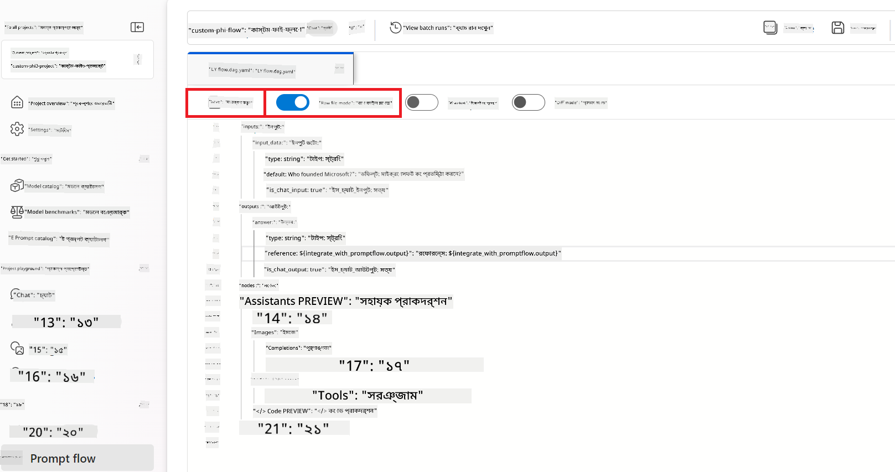

1. Prompt flow-তে কাস্টম Phi-3 মডেল ব্যবহার করার জন্য *integrate_with_promptflow.py* ফাইলে নিচের কোডটি যোগ করুন।

    ```python
    import logging
    import requests
    from promptflow import tool
    from promptflow.connections import CustomConnection

    # Logging setup
    logging.basicConfig(
        format="%(asctime)s - %(levelname)s - %(name)s - %(message)s",
        datefmt="%Y-%m-%d %H:%M:%S",
        level=logging.DEBUG
    )
    logger = logging.getLogger(__name__)

    def query_phi3_model(input_data: str, connection: CustomConnection) -> str:
        """
        Send a request to the Phi-3 model endpoint with the given input data using Custom Connection.
        """

        # "connection" is the name of the Custom Connection, "endpoint", "key" are the keys in the Custom Connection
        endpoint_url = connection.endpoint
        api_key = connection.key

        headers = {
            "Content-Type": "application/json",
            "Authorization": f"Bearer {api_key}"
        }
        data = {
            "input_data": {
                "input_string": [
                    {"role": "user", "content": input_data}
                ],
                "parameters": {
                    "temperature": 0.7,
                    "max_new_tokens": 128
                }
            }
        }
        try:
            response = requests.post(endpoint_url, json=data, headers=headers)
            response.raise_for_status()
            
            # Log the full JSON response
            logger.debug(f"Full JSON response: {response.json()}")

            result = response.json()["output"]
            logger.info("Successfully received response from Azure ML Endpoint.")
            return result
        except requests.exceptions.RequestException as e:
            logger.error(f"Error querying Azure ML Endpoint: {e}")
            raise

    @tool
    def my_python_tool(input_data: str, connection: CustomConnection) -> str:
        """
        Tool function to process input data and query the Phi-3 model.
        """
        return query_phi3_model(input_data, connection)

    ```

    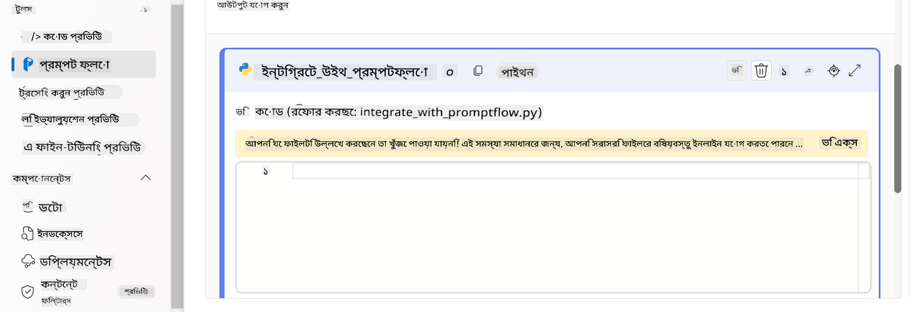

> [!NOTE]
> Azure AI Foundry-তে Prompt flow ব্যবহারের আরও বিস্তারিত তথ্যের জন্য, আপনি [Prompt flow in Azure AI Foundry](https://learn.microsoft.com/azure/ai-studio/how-to/prompt-flow) দেখতে পারেন।

1. আপনার মডেলের সাথে চ্যাট সক্ষম করতে **Chat input**, **Chat output** নির্বাচন করুন।

    

1. এখন আপনি আপনার কাস্টম Phi-3 মডেলের সাথে চ্যাট করার জন্য প্রস্তুত। পরবর্তী অনুশীলনে, আপনি শিখবেন কীভাবে Prompt flow শুরু করতে হয় এবং fine-tuned Phi-3 মডেলের সাথে চ্যাট করতে হয়।

> [!NOTE]
>
> পুনর্নির্মিত ফ্লো নিচের ছবির মতো হওয়া উচিত:
>
> 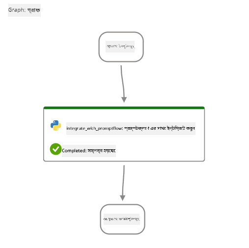
>

### আপনার কাস্টম Phi-3 মডেলের সাথে চ্যাট করুন

এখন যেহেতু আপনি আপনার কাস্টম Phi-3 মডেলটি fine-tune করে Prompt flow-র সাথে ইন্টিগ্রেট করেছেন, আপনি এটি ব্যবহার করে চ্যাট শুরু করতে প্রস্তুত। এই অনুশীলনটি আপনাকে মডেলটির সাথে চ্যাট সেটআপ এবং শুরু করার ধাপগুলো দেখাবে। এই ধাপগুলো অনুসরণ করে আপনি আপনার fine-tuned Phi-3 মডেলের পূর্ণ ক্ষমতা বিভিন্ন কাজ ও কথোপকথনের জন্য ব্যবহার করতে পারবেন।

- Prompt flow ব্যবহার করে আপনার কাস্টম Phi-3 মডেলের সাথে চ্যাট করুন।

#### Prompt flow শুরু করুন

1. Prompt flow শুরু করতে **Start compute sessions** নির্বাচন করুন।

    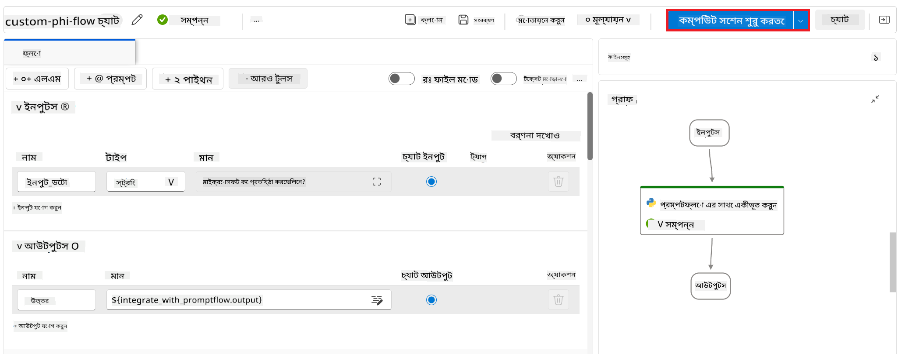

1. প্যারামিটার রিফ্রেশ করতে **Validate and parse input** নির্বাচন করুন।

    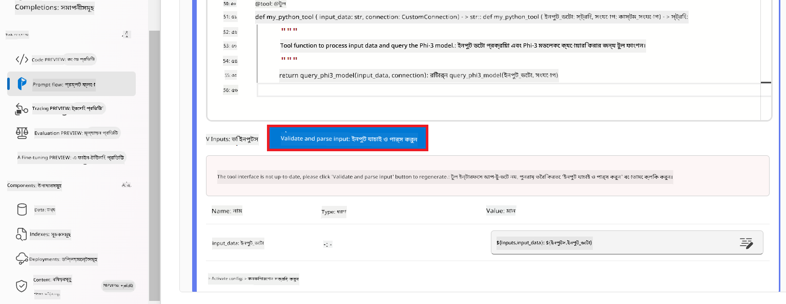

1. আপনি যে কাস্টম কানেকশন তৈরি করেছেন তার **connection** এর **Value** নির্বাচন করুন। যেমন, *connection*।

    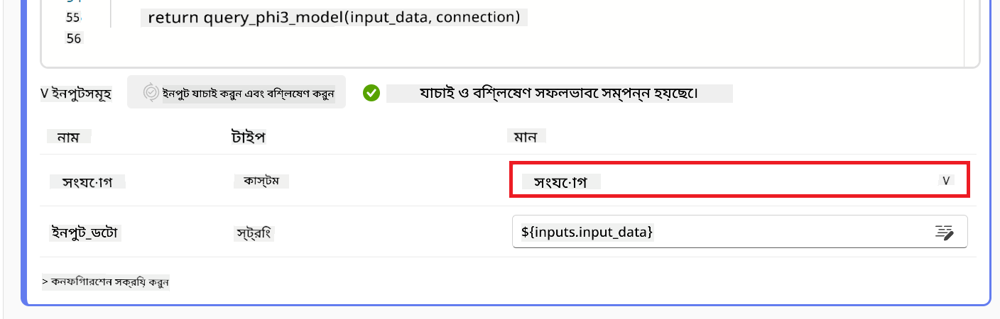

#### আপনার কাস্টম মডেলের সাথে চ্যাট করুন

1. **Chat** নির্বাচন করুন।

    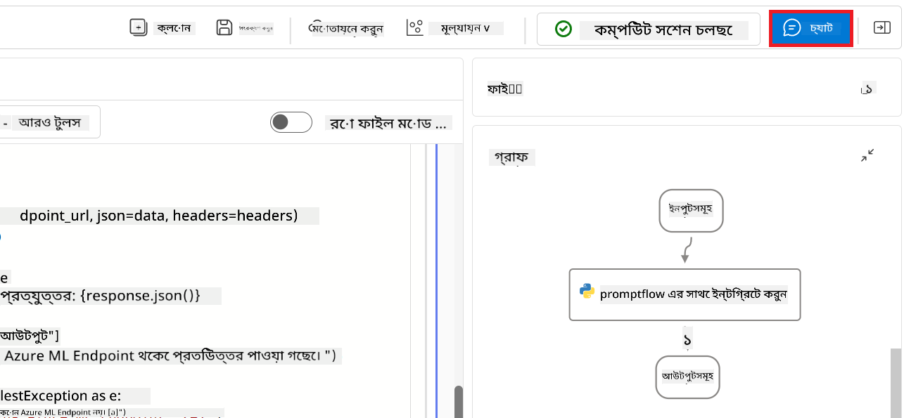

1. ফলাফলের একটি উদাহরণ: এখন আপনি আপনার কাস্টম Phi-3 মডেলের সাথে চ্যাট করতে পারবেন। fine-tuning এর জন্য ব্যবহৃত ডেটার ওপর ভিত্তি করে প্রশ্ন করা উত্তম।

    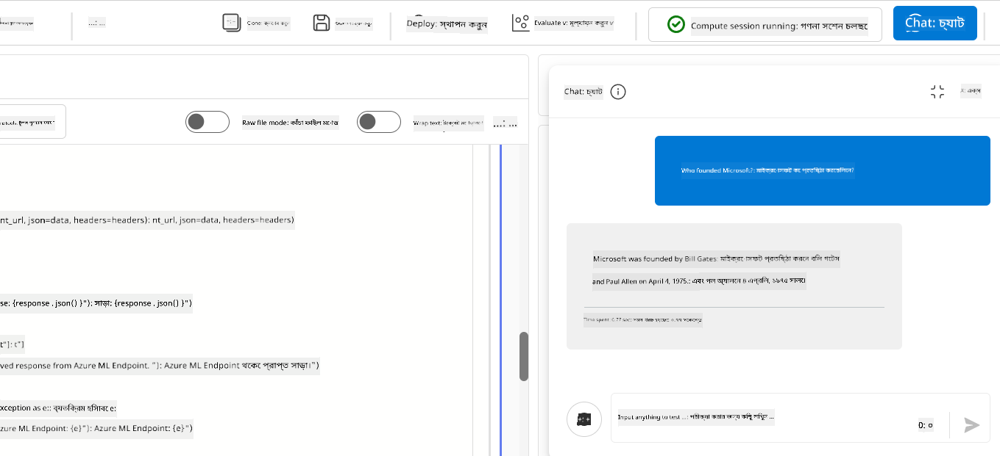

**অস্বীকৃতি**:  
এই নথিটি AI অনুবাদ সেবা [Co-op Translator](https://github.com/Azure/co-op-translator) ব্যবহার করে অনূদিত হয়েছে। আমরা যথাসাধ্য সঠিকতার চেষ্টা করি, তবে দয়া করে মনে রাখবেন যে স্বয়ংক্রিয় অনুবাদে ভুল বা অসঙ্গতি থাকতে পারে। মূল নথিটি তার নিজস্ব ভাষায় সর্বোত্তম এবং নির্ভরযোগ্য উৎস হিসেবে বিবেচনা করা উচিত। গুরুত্বপূর্ণ তথ্যের জন্য পেশাদার মানব অনুবাদ গ্রহণ করার পরামর্শ দেওয়া হয়। এই অনুবাদের ব্যবহার থেকে উদ্ভূত কোনো ভুল বোঝাবুঝি বা ভুল ব্যাখ্যার জন্য আমরা দায়ী নই।