<!--
CO_OP_TRANSLATOR_METADATA:
{
  "original_hash": "0df910a227098303cc392b6ad204c271",
  "translation_date": "2026-01-06T04:25:34+00:00",
  "source_file": "md/02.Application/01.TextAndChat/Phi3/E2E_Phi-3-FineTuning_PromptFlow_Integration_AIFoundry.md",
  "language_code": "bn"
}
-->
# Fine-tune এবং কাস্টম Phi-3 মডেলগুলোকে Azure AI Foundry তে Prompt flow এর সাথে ইন্টিগ্রেট করুন

Microsoft Tech Community থেকে "[Fine-Tune and Integrate Custom Phi-3 Models with Prompt Flow in Azure AI Foundry](https://techcommunity.microsoft.com/t5/educator-developer-blog/fine-tune-and-integrate-custom-phi-3-models-with-prompt-flow-in/ba-p/4191726?WT.mc_id=aiml-137032-kinfeylo)" গাইড ভিত্তিক এই end-to-end (E2E) স্যাম্পলটি কাস্টম Phi-3 মডেল ফাইন-টিউনিং, ডিপ্লয়মেন্ট, এবং Azure AI Foundry তে Prompt flow এর সাথে ইন্টিগ্রেশনের প্রসেসসমূহ উপস্থাপন করে।
E2E স্যাম্পল "[Fine-Tune and Integrate Custom Phi-3 Models with Prompt Flow](./E2E_Phi-3-FineTuning_PromptFlow_Integration.md)" এর মধ্যে স্থানীয়ভাবে কোড চালানো হয়েছিল, কিন্তু এই টিউটোরিয়ালে আপনি সম্পূর্ণভাবে Azure AI / ML Studio তে আপনার মডেল ফাইন-টিউনিং এবং ইন্টিগ্রেশনে মনোনিবেশ করবেন।

## ওভারভিউ

এই E2E স্যাম্পলে আপনি শিখবেন কিভাবে Phi-3 মডেল ফাইন-টিউন করে Azure AI Foundry তে Prompt flow এর সাথে ইন্টিগ্রেট করবেন। Azure AI / ML Studio ব্যবহার করে, আপনি কাস্টম AI মডেল ডিপ্লয় ও ব্যবহারের জন্য একটি ওয়ার্কফ্লো তৈরি করবেন। এই E2E স্যাম্পল তিনটি দৃশ্যপট এ ভাগ করা হয়েছে:

**দৃশ্যপট ১: Azure রিসোর্স সেটআপ এবং ফাইন-টিউনিং এর প্রস্তুতি**

**দৃশ্যপট ২: Phi-3 মডেল ফাইন-টিউন এবং Azure Machine Learning Studio তে ডিপ্লয়**

**দৃশ্যপট ৩: Prompt flow এর সাথে ইন্টিগ্রেট এবং Azure AI Foundry তে আপনার কাস্টম মডেলের সাথে চ্যাট**

এখানে এই E2E স্যাম্পলের একটি ওভারভিউ দেওয়া হলো।


### বিষয়সূচি

1. **[দৃশ্যপট ১: Azure রিসোর্স সেটআপ এবং ফাইন-টিউনিং এর প্রস্তুতি](../../../../../../md/02.Application/01.TextAndChat/Phi3)**
    - [Azure Machine Learning Workspace তৈরি করুন](../../../../../../md/02.Application/01.TextAndChat/Phi3)
    - [Azure Subscription এ GPU কোটা অনুরোধ করুন](../../../../../../md/02.Application/01.TextAndChat/Phi3)
    - [রোল অ্যাসাইনমেন্ট যোগ করুন](../../../../../../md/02.Application/01.TextAndChat/Phi3)
    - [প্রকল্প সেটআপ করুন](../../../../../../md/02.Application/01.TextAndChat/Phi3)
    - [ফাইন-টিউনিং এর জন্য ডেটাসেট প্রস্তুত করুন](../../../../../../md/02.Application/01.TextAndChat/Phi3)

1. **[দৃশ্যপট ২: Phi-3 মডেল ফাইন-টিউন এবং Azure Machine Learning Studio তে ডিপ্লয়](../../../../../../md/02.Application/01.TextAndChat/Phi3)**
    - [Phi-3 মডেল ফাইন-টিউন করুন](../../../../../../md/02.Application/01.TextAndChat/Phi3)
    - [ফাইন-টিউন করা Phi-3 মডেল ডিপ্লয় করুন](../../../../../../md/02.Application/01.TextAndChat/Phi3)

1. **[দৃশ্যপট ৩: Prompt flow এর সাথে ইন্টিগ্রেট করুন এবং Azure AI Foundry তে আপনার কাস্টম মডেলের সাথে চ্যাট করুন](../../../../../../md/02.Application/01.TextAndChat/Phi3)**
    - [কাস্টম Phi-3 মডেল Prompt flow এর সাথে ইন্টিগ্রেট করুন](../../../../../../md/02.Application/01.TextAndChat/Phi3)
    - [আপনার কাস্টম Phi-3 মডেলের সাথে চ্যাট করুন](../../../../../../md/02.Application/01.TextAndChat/Phi3)

## দৃশ্যপট ১: Azure রিসোর্স সেটআপ এবং ফাইন-টিউনিং এর প্রস্তুতি

### Azure Machine Learning Workspace তৈরি করুন

1. পোর্টালের শীর্ষে **search bar** এ *azure machine learning* টাইপ করুন এবং প্রদর্শিত অপশন থেকে **Azure Machine Learning** নির্বাচন করুন।

    

2. নেভিগেশন মেনু থেকে **+ Create** নির্বাচন করুন।

3. নেভিগেশন মেনু থেকে **New workspace** নির্বাচন করুন।

    

4. নিম্নলিখিত কাজগুলো সম্পন্ন করুন:

    - আপনার Azure **Subscription** নির্বাচন করুন।
    - ব্যবহার করার জন্য **Resource group** নির্বাচন করুন (প্রয়োজনে নতুন তৈরি করুন)।
    - **Workspace Name** লিখুন। এটি অবশ্যই একটি ইউনিক মান হতে হবে।
    - ব্যবহার করার জন্য **Region** নির্বাচন করুন।
    - ব্যবহার করার জন্য **Storage account** নির্বাচন করুন (প্রয়োজনে নতুন তৈরি করুন)।
    - ব্যবহার করার জন্য **Key vault** নির্বাচন করুন (প্রয়োজনে নতুন তৈরি করুন)।
    - ব্যবহার করার জন্য **Application insights** নির্বাচন করুন (প্রয়োজনে নতুন তৈরি করুন)।
    - ব্যবহার করার জন্য **Container registry** নির্বাচন করুন (প্রয়োজনে নতুন তৈরি করুন)।

    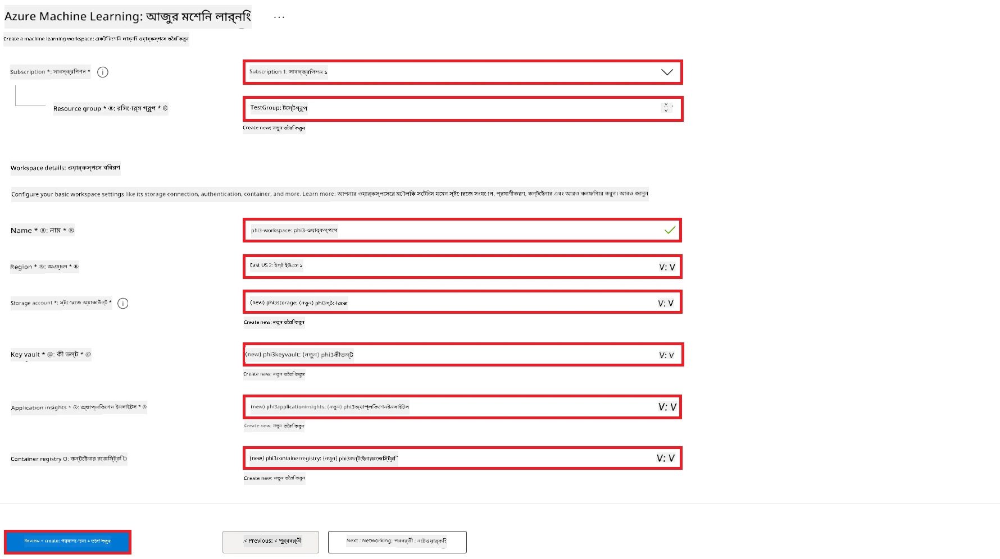

5. **Review + Create** নির্বাচন করুন।

6. **Create** নির্বাচন করুন।

### Azure Subscription এ GPU কোটা অনুরোধ করুন

এই টিউটোরিয়ালে, আপনি Phi-3 মডেল ফাইন-টিউন এবং ডিপ্লয় করবেন GPUs ব্যবহার করে। ফাইন-টিউনিং এর জন্য আপনি *Standard_NC24ads_A100_v4* GPU ব্যবহার করবেন, যার জন্য কোটা অনুরোধ প্রয়োজন। ডিপ্লয়ের জন্য *Standard_NC6s_v3* GPU ব্যবহার করবেন, যার জন্যও কোটা অনুরোধ প্রয়োজন।

> [!NOTE]
>
> শুধুমাত্র Pay-As-You-Go সাবস্ক্রিপশন (স্ট্যান্ডার্ড সাবস্ক্রিপশন টাইপ) GPU বরাদ্দের জন্য যোগ্য; বেনিফিট সাবস্ক্রিপশনগুলি বর্তমানে সমর্থিত নয়।
>

1. [Azure ML Studio](https://ml.azure.com/home?wt.mc_id=studentamb_279723) এ যান।

1. *Standard NCADSA100v4 Family* কোটা অনুরোধ করতে নিম্নলিখিত কাজ করুন:

    - বাম পাশের ট্যাব থেকে **Quota** নির্বাচন করুন।
    - ব্যবহার করার জন্য **Virtual machine family** নির্বাচন করুন। উদাহরণস্বরূপ, **Standard NCADSA100v4 Family Cluster Dedicated vCPUs** নির্বাচন করুন, যা অন্তর্ভুক্ত করে *Standard_NC24ads_A100_v4* GPU।
    - নেভিগেশন মেনু থেকে **Request quota** নির্বাচন করুন।

        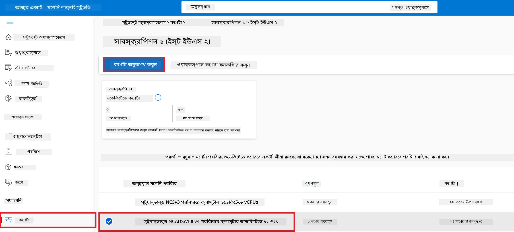

    - Request quota পৃষ্ঠায়, আপনি ব্যবহার করতে চান এমন **New cores limit** লিখুন। যেমন, 24।
    - Request quota পৃষ্ঠায়, GPU কোটা অনুরোধের জন্য **Submit** নির্বাচন করুন।

1. *Standard NCSv3 Family* কোটা অনুরোধ করতে নিম্নলিখিত কাজ করুন:

    - বাম পাশের ট্যাব থেকে **Quota** নির্বাচন করুন।
    - ব্যবহার করার জন্য **Virtual machine family** নির্বাচন করুন। উদাহরণস্বরূপ, **Standard NCSv3 Family Cluster Dedicated vCPUs** নির্বাচন করুন, যা অন্তর্ভুক্ত করে *Standard_NC6s_v3* GPU।
    - নেভিগেশন মেনু থেকে **Request quota** নির্বাচন করুন।
    - Request quota পৃষ্ঠায়, আপনি ব্যবহার করতে চান এমন **New cores limit** লিখুন। যেমন, 24।
    - Request quota পৃষ্ঠায়, GPU কোটা অনুরোধের জন্য **Submit** নির্বাচন করুন।

### রোল অ্যাসাইনমেন্ট যোগ করুন

আপনার মডেল ফাইন-টিউন এবং ডিপ্লয় করতে, আপনাকে প্রথমে একটি User Assigned Managed Identity (UAI) তৈরি করতে হবে এবং তাকে যথাযথ অনুমতি দিতে হবে। ডিপ্লয়মেন্ট চলাকালীন এই UAI টি অথেন্টিকেশন করার জন্য ব্যবহৃত হবে।

#### User Assigned Managed Identity(UAI) তৈরি করুন

1. পোর্টালের শীর্ষে **search bar** এ *managed identities* টাইপ করুন এবং প্রদর্শিত অপশন থেকে **Managed Identities** নির্বাচন করুন।

    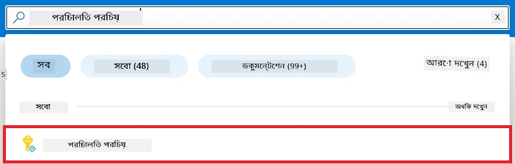

1. **+ Create** নির্বাচন করুন।

    

1. নিম্নলিখিত কাজ করুন:

    - আপনার Azure **Subscription** নির্বাচন করুন।
    - ব্যবহার করার জন্য **Resource group** নির্বাচন করুন (প্রয়োজনে নতুন তৈরি করুন)।
    - ব্যবহার করার জন্য **Region** নির্বাচন করুন।
    - একটি **Name** লিখুন। এটি অবশ্যই একটি ইউনিক মান হতে হবে।

    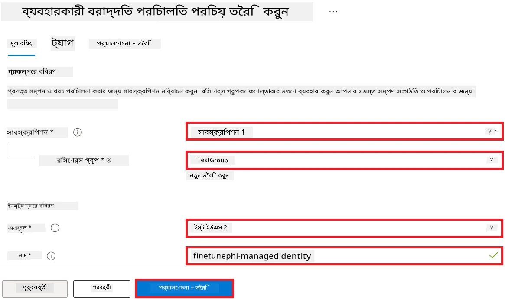

1. **Review + create** নির্বাচন করুন।

1. **+ Create** নির্বাচন করুন।

#### Managed Identity-তে Contributor রোল অ্যাসাইনমেন্ট যোগ করুন

1. আপনি যে Managed Identity তৈরি করেছেন সেটির রিসোর্সে যান।

1. বাম পাশের ট্যাব থেকে **Azure role assignments** নির্বাচন করুন।

1. নেভিগেশন মেনু থেকে **+Add role assignment** নির্বাচন করুন।

1. Add role assignment পৃষ্ঠায় নিম্নলিখিত কাজ করুন:
    - **Scope** নির্বাচন করুন **Resource group** এ।
    - আপনার Azure **Subscription** নির্বাচন করুন।
    - ব্যবহার করার জন্য **Resource group** নির্বাচন করুন।
    - রোল নির্বাচন করুন **Contributor**।

    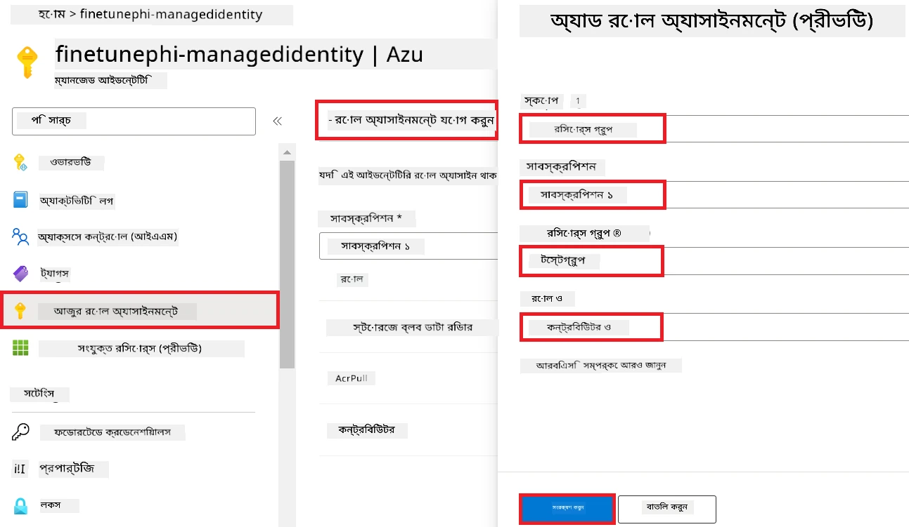

2. **Save** নির্বাচন করুন।

#### Managed Identity-তে Storage Blob Data Reader রোল অ্যাসাইনমেন্ট যোগ করুন

1. পোর্টালের শীর্ষে **search bar** এ *storage accounts* টাইপ করুন এবং প্রদর্শিত অপশন থেকে **Storage accounts** নির্বাচন করুন।

    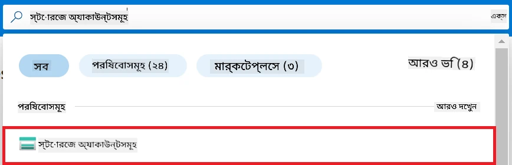

1. Azure Machine Learning workspace এর সাথে যুক্ত স্টোরেজ অ্যাকাউন্ট নির্বাচন করুন, যেমন *finetunephistorage*।

1. Add role assignment পৃষ্ঠায় যাওয়ার জন্য নিম্নলিখিত কাজ করুন:

    - আপনি যে Azure Storage অ্যাকাউন্ট তৈরি করেছেন সেখানে যান।
    - বাম পাশের ট্যাব থেকে **Access Control (IAM)** নির্বাচন করুন।
    - নেভিগেশন মেনু থেকে **+ Add** নির্বাচন করুন।
    - নেভিগেশন মেনু থেকে **Add role assignment** নির্বাচন করুন।

    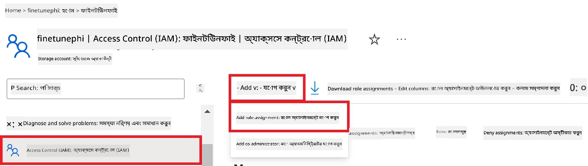

1. Add role assignment পৃষ্ঠায় নিম্নলিখিত কাজ করুন:

    - Role পৃষ্ঠায়, **search bar** এ *Storage Blob Data Reader* টাইপ করুন এবং প্রদর্শিত অপশন থেকে **Storage Blob Data Reader** নির্বাচন করুন।
    - Role পৃষ্ঠায় **Next** নির্বাচন করুন।
    - Members পৃষ্ঠায়, **Assign access to** নির্বাচন করুন **Managed identity**।
    - Members পৃষ্ঠায়, **+ Select members** নির্বাচন করুন।
    - Select managed identities পৃষ্ঠায় আপনার Azure **Subscription** নির্বাচন করুন।
    - Select managed identities পৃষ্ঠায় **Managed identity** নির্বাচন করুন **Manage Identity**।
    - Select managed identities পৃষ্ঠায় আপনি তৈরি করা Manage Identity নির্বাচন করুন, যেমন *finetunephi-managedidentity*।
    - Select managed identities পৃষ্ঠায় **Select** নির্বাচন করুন।

    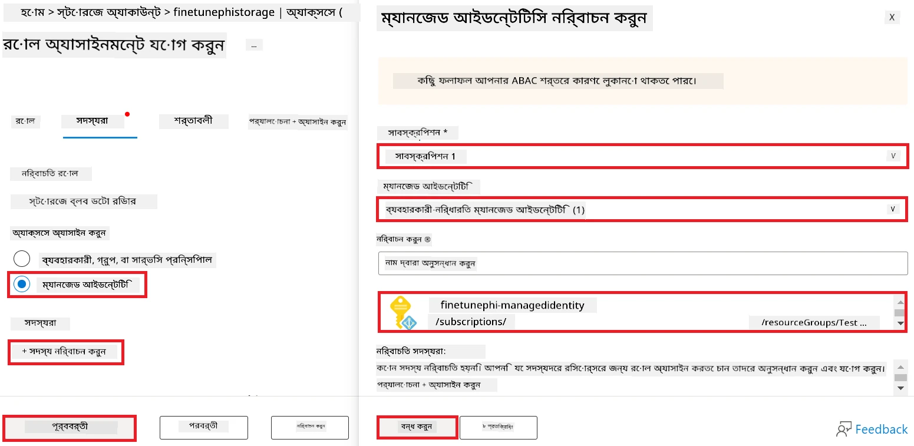

1. **Review + assign** নির্বাচন করুন।

#### Managed Identity-তে AcrPull রোল অ্যাসাইনমেন্ট যোগ করুন

1. পোর্টালের শীর্ষে **search bar** এ *container registries* টাইপ করুন এবং প্রদর্শিত অপশন থেকে **Container registries** নির্বাচন করুন।

    

1. Azure Machine Learning workspace এর সাথে যুক্ত container registry নির্বাচন করুন, যেমন *finetunephicontainerregistry*

1. Add role assignment পৃষ্ঠায় যাওয়ার জন্য নিম্নলিখিত কাজ করুন:

    - বাম পাশের ট্যাব থেকে **Access Control (IAM)** নির্বাচন করুন।
    - নেভিগেশন মেনু থেকে **+ Add** নির্বাচন করুন।
    - নেভিগেশন মেনু থেকে **Add role assignment** নির্বাচন করুন।

1. Add role assignment পৃষ্ঠায় নিম্নলিখিত কাজ করুন:

    - Role পৃষ্ঠায়, **search bar** এ *AcrPull* টাইপ করুন এবং প্রদর্শিত অপশন থেকে **AcrPull** নির্বাচন করুন।
    - Role পৃষ্ঠায় **Next** নির্বাচন করুন।
    - Members পৃষ্ঠায়, **Assign access to** নির্বাচন করুন **Managed identity**।
    - Members পৃষ্ঠায়, **+ Select members** নির্বাচন করুন।
    - Select managed identities পৃষ্ঠায় আপনার Azure **Subscription** নির্বাচন করুন।
    - Select managed identities পৃষ্ঠায় **Managed identity** নির্বাচন করুন **Manage Identity**।
    - Select managed identities পৃষ্ঠায় আপনি তৈরি করা Manage Identity নির্বাচন করুন, যেমন *finetunephi-managedidentity*।
    - Select managed identities পৃষ্ঠায় **Select** নির্বাচন করুন।
    - **Review + assign** নির্বাচন করুন।

### প্রকল্প সেটআপ করুন

ফাইন-টিউনিং এর জন্য প্রয়োজনীয় ডেটাসেটগুলি ডাউনলোড করতে, আপনি একটি লোকাল পরিবেশ সেটআপ করবেন।

এই অনুশীলনে আপনি করবেন:

- কাজ করার জন্য একটি ফোল্ডার তৈরি করবেন।
- একটি ভার্চুয়াল এনভায়রনমেন্ট তৈরি করবেন।
- প্রয়োজনীয় প্যাকেজ গুলো ইনস্টল করবেন।
- ডেটাসেট ডাউনলোড করার জন্য *download_dataset.py* ফাইল তৈরি করবেন।

#### কাজ করার জন্য একটি ফোল্ডার তৈরি করুন

1. একটি টার্মিনাল উইন্ডো খুলুন এবং ডিফল্ট পাথে *finetune-phi* নামক একটি ফোল্ডার তৈরি করতে নিচের কমান্ডটি টাইপ করুন।

    ```console
    mkdir finetune-phi
    ```

2. আপনার টার্মিনালে নিম্নলিখিত কমান্ডটি টাইপ করুন যাতে আপনি তৈরি করা *finetune-phi* ফোল্ডারে যেতে পারেন।

    ```console
    cd finetune-phi
    ```

#### একটি ভার্চুয়াল এনভায়রনমেন্ট তৈরি করুন

1. আপনার টার্মিনালে নিম্নলিখিত কমান্ডটি টাইপ করুন যাতে *.venv* নামের একটি ভার্চুয়াল এনভায়রনমেন্ট তৈরি হয়।

    ```console
    python -m venv .venv
    ```

2. ভার্চুয়াল এনভায়রনমেন্টটি সক্রিয় করতে আপনার টার্মিনালে নিম্নলিখিত কমান্ডটি টাইপ করুন।

    ```console
    .venv\Scripts\activate.bat
    ```

> [!NOTE]
> যদি এটি কাজ করে, তাহলে কমান্ড প্রম্পটের আগে *(.venv)* দেখতে পাবেন।

#### প্রয়োজনীয় প্যাকেজগুলি ইনস্টল করুন

1. প্রয়োজনীয় প্যাকেজগুলি ইনস্টল করার জন্য আপনার টার্মিনালে নিম্নলিখিত কমান্ডগুলি টাইপ করুন।

    ```console
    pip install datasets==2.19.1
    ```

#### `donload_dataset.py` তৈরি করুন

> [!NOTE]
> সম্পূর্ণ ফোল্ডার স্ট্রাকচার:
>
> ```text
> └── YourUserName
> .    └── finetune-phi
> .        └── download_dataset.py
> ```

1. **Visual Studio Code** খুলুন।

1. মেনু বারের থেকে **File** নির্বাচন করুন।

1. **Open Folder** নির্বাচন করুন।

1. আপনি যে *finetune-phi* ফোল্ডারটি তৈরি করেছেন তা নির্বাচন করুন, যা *C:\Users\yourUserName\finetune-phi* -এ অবস্থিত।

    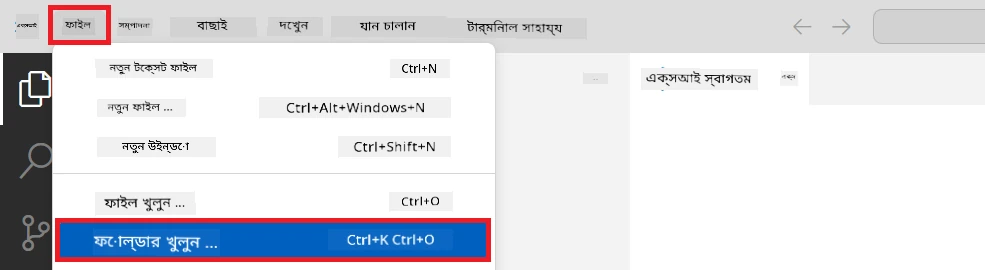

1. Visual Studio Code-এর বাম পাশের প্যানে ডান-ক্লিক করুন এবং **New File** নির্বাচন করে *download_dataset.py* নামে একটি নতুন ফাইল তৈরি করুন।

    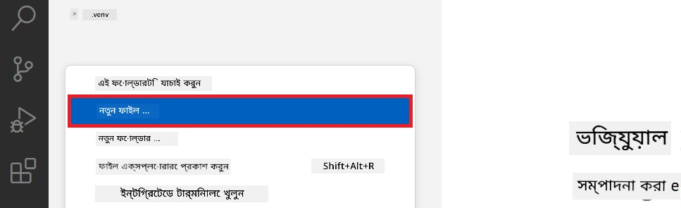

### ফাইন-টিউনিংয়ের জন্য ডেটাসেট প্রস্তুত করুন

এই অনুশীলনে, আপনি *download_dataset.py* ফাইলটি চালিয়ে *ultrachat_200k* ডেটাসেটগুলি আপনার লোকাল এনভায়রনমেন্টে ডাউনলোড করবেন। এরপর আপনি এই ডেটাসেটগুলি ব্যবহার করে Azure Machine Learning-এ Phi-3 মডেলটি ফাইন-টিউন করবেন।

এই অনুশীলনে, আপনি:

- *download_dataset.py* ফাইলে কোড যোগ করবেন ডেটাসেটগুলি ডাউনলোড করার জন্য।
- ডেটাসেটগুলি আপনার লোকাল এনভায়রনমেন্টে ডাউনলোড করতে *download_dataset.py* ফাইলটি চালাবেন।

#### *download_dataset.py* ব্যবহার করে আপনার ডেটাসেট ডাউনলোড করুন

1. Visual Studio Code-এ *download_dataset.py* ফাইলটি খুলুন।

1. *download_dataset.py* ফাইলে নিম্নলিখিত কোডটি যোগ করুন।

    ```python
    import json
    import os
    from datasets import load_dataset

    def load_and_split_dataset(dataset_name, config_name, split_ratio):
        """
        Load and split a dataset.
        """
        # নির্দিষ্ট নাম, কনফিগারেশন, এবং স্প্লিট রেশিও সহ ডেটাসেট লোড করুন
        dataset = load_dataset(dataset_name, config_name, split=split_ratio)
        print(f"Original dataset size: {len(dataset)}")
        
        # ডেটাসেটকে ট্রেন এবং টেস্ট সেটে ভাগ করুন (৮০% ট্রেন, ২০% টেস্ট)
        split_dataset = dataset.train_test_split(test_size=0.2)
        print(f"Train dataset size: {len(split_dataset['train'])}")
        print(f"Test dataset size: {len(split_dataset['test'])}")
        
        return split_dataset

    def save_dataset_to_jsonl(dataset, filepath):
        """
        Save a dataset to a JSONL file.
        """
        # ডিরেক্টরি না থাকলে তৈরি করুন
        os.makedirs(os.path.dirname(filepath), exist_ok=True)
        
        # ফাইলটি লিখার মোডে খুলুন
        with open(filepath, 'w', encoding='utf-8') as f:
            # ডেটাসেটের প্রতিটি রেকর্ডের উপর পুনরাবৃত্তি করুন
            for record in dataset:
                # রেকর্ডটিকে JSON অবজেক্ট হিসেবে ডাম্প করুন এবং ফাইলে লিখুন
                json.dump(record, f)
                # রেকর্ড পৃথক করার জন্য একটি নিউলাইন ক্যারেক্টার লিখুন
                f.write('\n')
        
        print(f"Dataset saved to {filepath}")

    def main():
        """
        Main function to load, split, and save the dataset.
        """
        # নির্দিষ্ট কনফিগারেশন এবং স্প্লিট রেশিও সহ ULTRACHAT_200k ডেটাসেট লোড এবং স্প্লিট করুন
        dataset = load_and_split_dataset("HuggingFaceH4/ultrachat_200k", 'default', 'train_sft[:1%]')
        
        # স্প্লিট থেকে ট্রেন এবং টেস্ট ডেটাসেট বের করুন
        train_dataset = dataset['train']
        test_dataset = dataset['test']

        # ট্রেন ডেটাসেট একটি JSONL ফাইলে সংরক্ষণ করুন
        save_dataset_to_jsonl(train_dataset, "data/train_data.jsonl")
        
        # টেস্ট ডেটাসেট একটি পৃথক JSONL ফাইলে সংরক্ষণ করুন
        save_dataset_to_jsonl(test_dataset, "data/test_data.jsonl")

    if __name__ == "__main__":
        main()

    ```

1. স্ক্রিপ্ট চালাতে এবং ডেটাসেটটি আপনার লোকাল এনভায়রনমেন্টে ডাউনলোড করার জন্য টার্মিনালে নিম্নলিখিত কমান্ডটি টাইপ করুন।

    ```console
    python download_dataset.py
    ```

1. নিশ্চিত করুন যে ডেটাসেটগুলি সফলভাবে আপনার লোকাল *finetune-phi/data* ডিরেক্টরিতে সংরক্ষিত হয়েছে।

> [!NOTE]
>
> #### ডেটাসেটের আকার এবং ফাইন-টিউনিং সময়ের সম্পর্কে টিপ্পনী
>
> এই টিউটোরিয়ালে, আপনি শুধুমাত্র ডেটাসেটের ১% ব্যবহার করছেন (`split='train[:1%]'`)। এটি ডেটার পরিমাণ কমিয়ে দেয়, যার ফলে আপলোড এবং ফাইন-টিউনিং উভয় প্রক্রিয়া দ্রুত হয়। আপনি প্রশিক্ষণের সময় এবং মডেলের কর্মক্ষমতার মধ্যে সঠিক সমন্বয় খুঁজে পেতে এই শতাংশ পরিবর্তন করতে পারেন। ডেটাসেটের একটি ছোট অংশ ব্যবহার করার ফলে ফাইন-টিউনিংয়ের সময় কমে যায়, যা টিউটোরিয়ালের জন্য প্রক্রিয়াটি আরো সহজ করে তোলে।

## সিনারিও ২: Phi-3 মডেল ফাইন-টিউন করুন এবং Azure Machine Learning Studio-তে ডিপ্লয় করুন

### Phi-3 মডেল ফাইন-টিউন করুন

এই অনুশীলনে, আপনি Azure Machine Learning Studio তে Phi-3 মডেলটি ফাইন-টিউন করবেন।

এই অনুশীলনে, আপনি:

- ফাইন-টিউনিংয়ের জন্য কম্পিউটার ক্লাস্টার তৈরি করবেন।
- Azure Machine Learning Studio তে Phi-3 মডেল ফাইন-টিউন করবেন।

#### ফাইন-টিউনিংয়ের জন্য কম্পিউটার ক্লাস্টার তৈরি করুন

1. [Azure ML Studio](https://ml.azure.com/home?wt.mc_id=studentamb_279723) ভিজিট করুন।

1. বাম পাশের ট্যাব থেকে **Compute** নির্বাচন করুন।

1. নাভিগেশন মেনু থেকে **Compute clusters** নির্বাচন করুন।

1. **+ New** নির্বাচন করুন।

    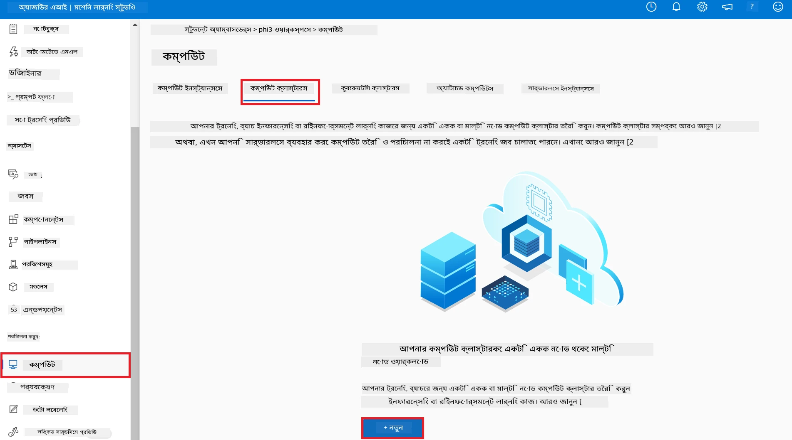

1. নিম্নলিখিত কাজগুলো করুন:

    - আপনি যে **Region** ব্যবহার করতে চান তা নির্বাচন করুন।
    - **Virtual machine tier** এর জন্য **Dedicated** নির্বাচন করুন।
    - **Virtual machine type** হিসেবে **GPU** নির্বাচন করুন।
    - **Virtual machine size** ফিল্টার থেকে **Select from all options** নির্বাচন করুন।
    - **Virtual machine size** হিসেবে **Standard_NC24ads_A100_v4** নির্বাচন করুন।

    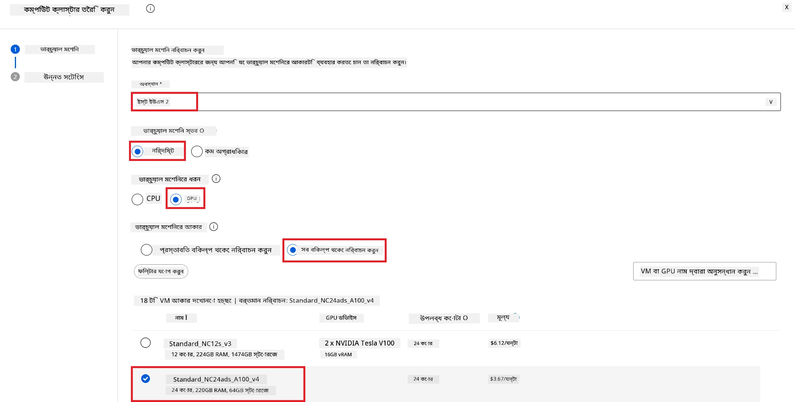

1. **Next** নির্বাচন করুন।

1. নিম্নলিখিত কাজগুলো করুন:

    - **Compute name** লিখুন। এটি একটি ইউনিক মান হতে হবে।
    - **Minimum number of nodes** হিসাবে **0** নির্বাচন করুন।
    - **Maximum number of nodes** হিসাবে **1** নির্বাচন করুন।
    - **Idle seconds before scale down** হিসাবে **120** নির্বাচন করুন।

    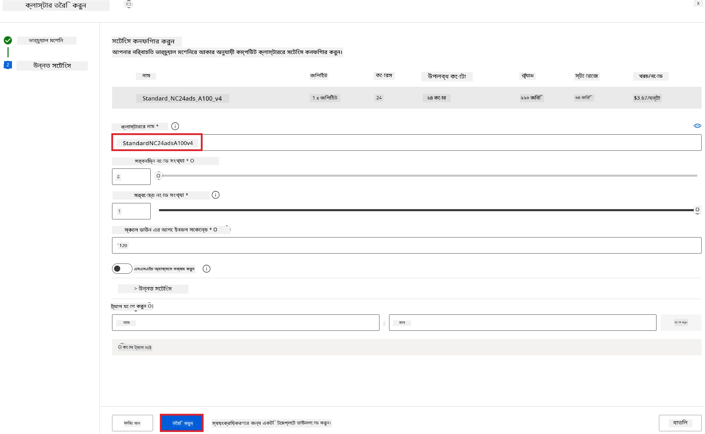

1. **Create** নির্বাচন করুন।

#### Phi-3 মডেল ফাইন-টিউন করুন

1. [Azure ML Studio](https://ml.azure.com/home?wt.mc_id=studentamb_279723) ভিজিট করুন।

1. আপনি যে Azure Machine Learning workspace তৈরি করেছেন তা নির্বাচন করুন।

    

1. নিম্নলিখিত কাজগুলো করুন:

    - বাম পাশের ট্যাব থেকে **Model catalog** নির্বাচন করুন।
    - **search bar**-এ *phi-3-mini-4k* টাইপ করুন এবং প্রদত্ত বিকল্পগুলি থেকে **Phi-3-mini-4k-instruct** নির্বাচন করুন।

    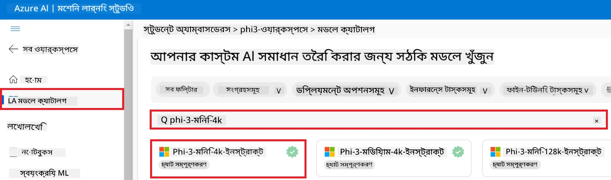

1. নাভিগেশন মেনু থেকে **Fine-tune** নির্বাচন করুন।

    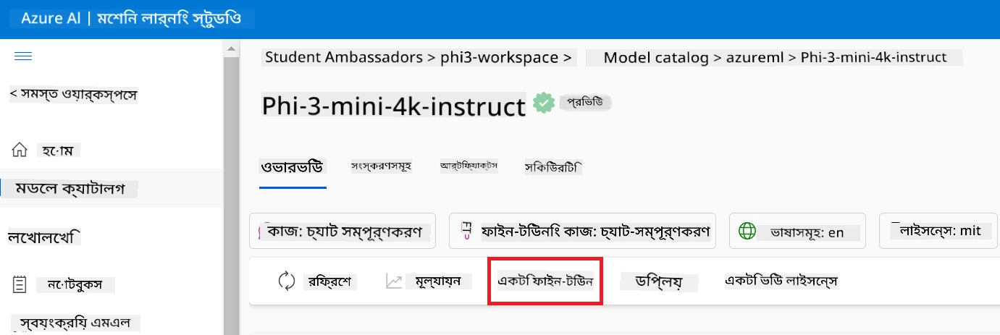

1. নিম্নলিখিত কাজগুলো করুন:

    - **Select task type** হিসেবে **Chat completion** নির্বাচন করুন।
    - **+ Select data** নির্বাচন করে **Training data** আপলোড করুন।
    - Validation data আপলোড টাইপ হিসেবে **Provide different validation data** নির্বাচন করুন।
    - **+ Select data** নির্বাচন করে **Validation data** আপলোড করুন।

    

> [!TIP]
>
> আপনি **Advanced settings** নির্বাচন করে কনফিগারেশন কাস্টমাইজ করতে পারেন যেমন **learning_rate** এবং **lr_scheduler_type** যাতে আপনি আপনার নির্দিষ্ট প্রয়োজন অনুযায়ী ফাইন-টিউনিং প্রক্রিয়া উন্নত করতে পারেন।

1. **Finish** নির্বাচন করুন।

1. এই অনুশীলনে, আপনি সফলভাবে Azure Machine Learning ব্যবহার করে Phi-3 মডেলটি ফাইন-টিউন করেছেন। দয়া করে নোট করুন যে ফাইন-টিউনিং প্রক্রিয়া যথেষ্ট সময় নিতে পারে। ফাইন-টিউনিং কাজ চালানোর পর এটি সম্পন্ন হওয়ার জন্য অপেক্ষা করতে হবে। আপনি Azure Machine Learning ওয়ার্কস্পেসের বাম পাশের Jobs ট্যাবে গিয়ে ফাইন-টিউনিং কাজের অবস্থা পর্যবেক্ষণ করতে পারেন। পরবর্তী ধারাবাহিকে, আপনি ফাইন-টিউন করা মডেলটি ডিপ্লয় করবেন এবং সেটি Prompt flow-এর সাথে ইন্টিগ্রেট করবেন।

    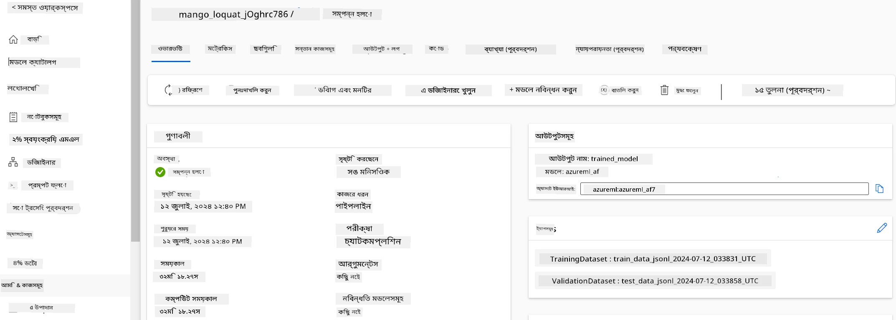

### ফাইন-টিউন করা Phi-3 মডেল ডিপ্লয় করুন

ফাইন-টিউন করা Phi-3 মডেলটিকে Prompt flow-এর সাথে ইন্টিগ্রেট করতে, মডেলটি রিয়েল-টাইম ইনফারেন্স করার জন্য অ্যাক্সেসযোগ্য করতে হবে। এই প্রক্রিয়ায় মডেলটি রেজিস্টার করা, একটি অনলাইন এন্ডপয়েন্ট তৈরি করা এবং মডেলটি ডিপ্লয় করা অন্তর্ভুক্ত।

এই অনুশীলনে, আপনি:

- Azure Machine Learning ওয়ার্কস্পেসে ফাইন-টিউন করা মডেলটি রেজিস্টার করবেন।
- একটি অনলাইন এন্ডপয়েন্ট তৈরি করবেন।
- রেজিস্টার করা ফাইন-টিউন করা Phi-3 মডেলটি ডিপ্লয় করবেন।

#### ফাইন-টিউন করা মডেল রেজিস্টার করুন

1. [Azure ML Studio](https://ml.azure.com/home?wt.mc_id=studentamb_279723) ভিজিট করুন।

1. আপনি যে Azure Machine Learning ওয়ার্কস্পেস তৈরি করেছেন তা নির্বাচন করুন।

    

1. বাম পাশের ট্যাব থেকে **Models** নির্বাচন করুন।
1. **+ Register** নির্বাচন করুন।
1. **From a job output** নির্বাচন করুন।

    

1. আপনি যে কাজটি করেছেন তা নির্বাচন করুন।

    

1. **Next** নির্বাচন করুন।

1. **Model type** হিসেবে **MLflow** নির্বাচন করুন।

1. নিশ্চিত করুন যে **Job output** নির্বাচিত আছে; এটি স্বয়ংক্রিয়ভাবে নির্বাচিত হওয়া উচিত।

    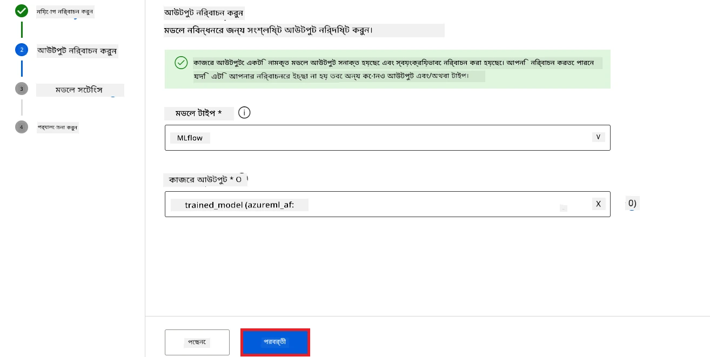

2. **Next** নির্বাচন করুন।

3. **Register** নির্বাচন করুন।

    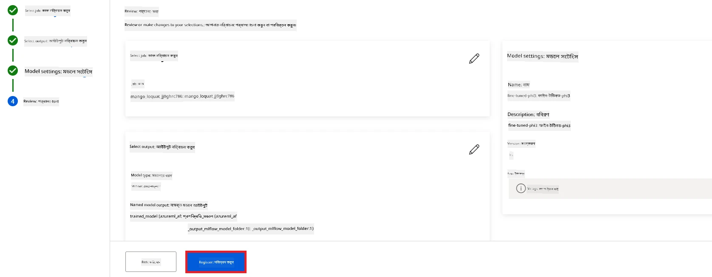

4. বাম পাশের ট্যাব থেকে **Models** মেনুতে গিয়ে আপনার রেজিস্টার করা মডেলটি দেখতে পারেন।

    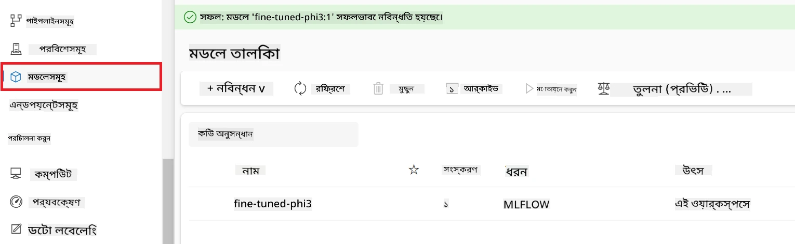

#### ফাইন-টিউন করা মডেল ডিপ্লয় করুন

1. আপনি যে Azure Machine Learning ওয়ার্কস্পেস তৈরি করেছেন সেখানে যান।

1. বাম পাশের ট্যাব থেকে **Endpoints** নির্বাচন করুন।

1. নাভিগেশন মেনু থেকে **Real-time endpoints** নির্বাচন করুন।

    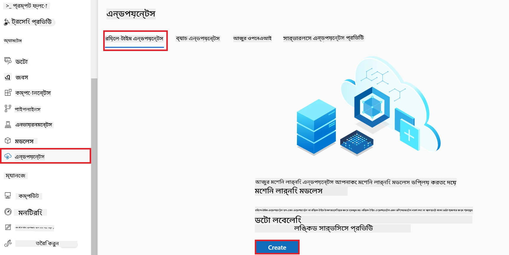

1. **Create** নির্বাচন করুন।

1. আপনি যে রেজিস্টার করা মডেলটি তৈরি করেছেন তা নির্বাচন করুন।

    

1. **Select** নির্বাচন করুন।

1. নিম্নলিখিত কাজগুলো করুন:

    - **Virtual machine** নির্বাচন করুন *Standard_NC6s_v3*।
    - আপনি যে **Instance count** ব্যবহার করতে চান তা নির্বাচন করুন; উদাহরণস্বরূপ, *1*।
    - **Endpoint** হিসাবে **New** নির্বাচন করুন নতুন এন্ডপয়েন্ট তৈরি করার জন্য।
    - **Endpoint name** লিখুন। এটি একটি ইউনিক মান হতে হবে।
    - **Deployment name** লিখুন। এটি একটি ইউনিক মান হতে হবে।

    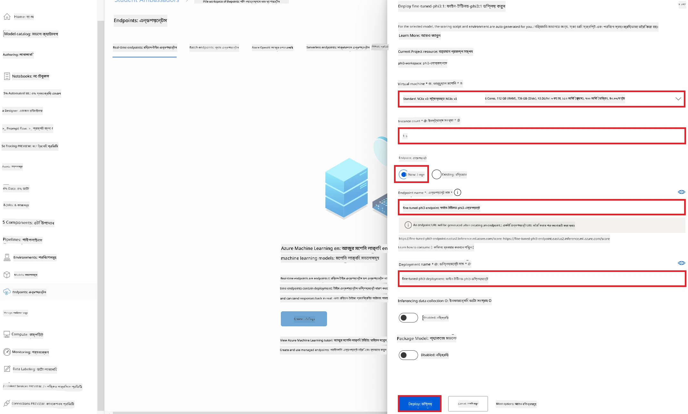

1. **Deploy** নির্বাচন করুন।

> [!WARNING]
> আপনার অ্যাকাউন্টে অতিরিক্ত চার্জ এড়াতে, Azure Machine Learning ওয়ার্কস্পেসে তৈরি হওয়া এন্ডপয়েন্টটি অবশ্যই মুছে ফেলুন।
>

#### Azure Machine Learning Workspace-এ ডিপ্লয়মেন্টের অবস্থা চেক করুন

1. আপনি যে Azure Machine Learning ওয়ার্কস্পেস তৈরি করেছেন সেখানে যান।

1. বাম পাশের ট্যাব থেকে **Endpoints** নির্বাচন করুন।

1. আপনি যে এন্ডপয়েন্টটি তৈরি করেছেন তা নির্বাচন করুন।

    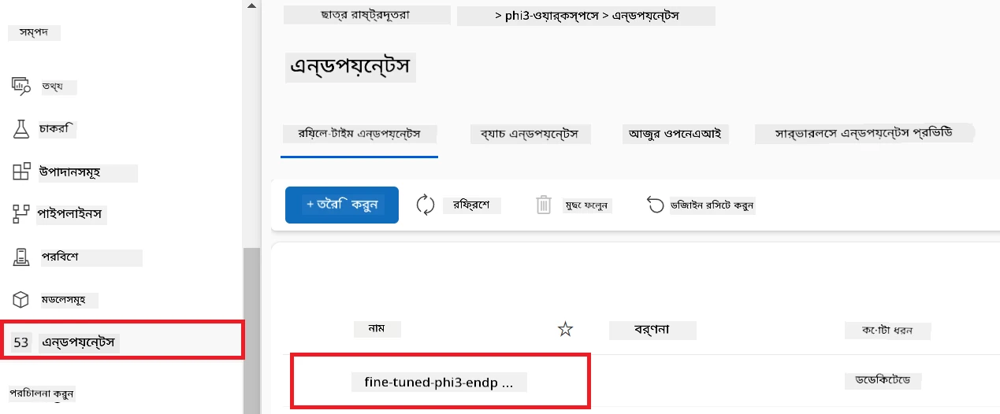

1. এই পৃষ্ঠায়, আপনি ডিপ্লয়মেন্ট প্রক্রিয়া চলাকালীন এন্ডপয়েন্টগুলি পরিচালনা করতে পারবেন।

> [!NOTE]
> একবার ডিপ্লয়মেন্ট সম্পন্ন হলে নিশ্চিত করুন যে **Live traffic** সেট করা আছে **100%**। যদি না থাকে, তবে **Update traffic** নির্বাচন করে ট্র্যাফিক সেটিংস পরিবর্তন করুন। মনে রাখবেন ট্র্যাফিক 0% হলে আপনি মডেলটি পরীক্ষা করতে পারবেন না।
>
> 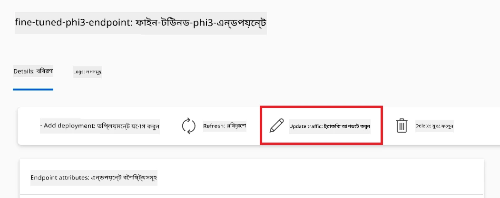
>

## সিনারিও ৩: Prompt flow-এর সাথে ইন্টিগ্রেট করুন এবং Azure AI Foundry-তে আপনার কাস্টম মডেলের সাথে চ্যাট করুন

### কাস্টম Phi-3 মডেল Prompt flow-এর সাথে ইন্টিগ্রেট করুন

আপনি সফলভাবে ফাইন-টিউন করা মডেলটি ডিপ্লয় করার পর এখন এটিকে Prompt Flow-এর সাথে ইন্টিগ্রেট করতে পারেন, যা আপনাকে রিয়েল-টাইম অ্যাপ্লিকেশনে আপনার কাস্টম Phi-3 মডেল ব্যবহার করার সুযোগ দেয় এবং বিভিন্ন ইন্টারেক্টিভ কাজ সম্পাদনের সুবিধা দেয়।

এই অনুশীলনে, আপনি:

- Azure AI Foundry Hub তৈরি করবেন।
- Azure AI Foundry Project তৈরি করবেন।
- Prompt flow তৈরি করবেন।
- ফাইন-টিউন করা Phi-3 মডেলের জন্য একটি কাস্টম সংযোগ যোগ করবেন।
- আপনার কাস্টম Phi-3 মডেলের সাথে চ্যাট করার জন্য Prompt flow সেটআপ করবেন।

> [!NOTE]
> আপনি Azure ML Studio ব্যবহার করেও Promptflow-এর সাথে ইন্টিগ্রেট করতে পারেন। একই ইন্টিগ্রেশন প্রক্রিয়া Azure ML Studio-তেও প্রয়োগযোগ্য।

#### Azure AI Foundry Hub তৈরি করুন

প্রজেক্ট তৈরি করার আগে একটি হাব তৈরি করতে হবে। একটি হাব একটি রিসোর্স গ্রুপের মতো কাজ করে, যা আপনাকে Azure AI Foundry-র মধ্যে একাধিক প্রজেক্ট সংগঠিত ও পরিচালনা করার সুযোগ দেয়।

1. [Azure AI Foundry](https://ai.azure.com/?WT.mc_id=aiml-137032-kinfeylo) ভিজিট করুন।

1. বাম পাশের ট্যাব থেকে **All hubs** নির্বাচন করুন।

1. নাভিগেশন মেনু থেকে **+ New hub** নির্বাচন করুন।
    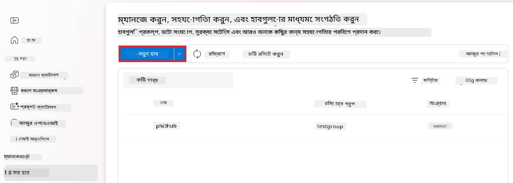

1. নিম্নলিখিত কাজগুলো সম্পাদন করুন:

    - **Hub name** লিখুন। এটি একটি অনন্য মান হতে হবে।
    - আপনার Azure **Subscription** নির্বাচন করুন।
    - ব্যবহারের জন্য **Resource group** নির্বাচন করুন (প্রয়োজনে নতুন তৈরি করুন)।
    - আপনি যে **Location** ব্যবহার করতে চান তা নির্বাচন করুন।
    - ব্যবহারের জন্য **Connect Azure AI Services** নির্বাচন করুন (প্রয়োজনে নতুন তৈরি করুন)।
    - **Connect Azure AI Search** নির্বাচন করুন এবং **Skip connecting** নির্বাচন করুন।

    

1. **Next** নির্বাচন করুন।

#### Azure AI Foundry Project তৈরি করুন

1. আপনি যে Hub তৈরি করেছেন, সেখানে বাম দিকের ট্যাব থেকে **All projects** নির্বাচন করুন।

1. নেভিগেশন মেনু থেকে **+ New project** নির্বাচন করুন।

    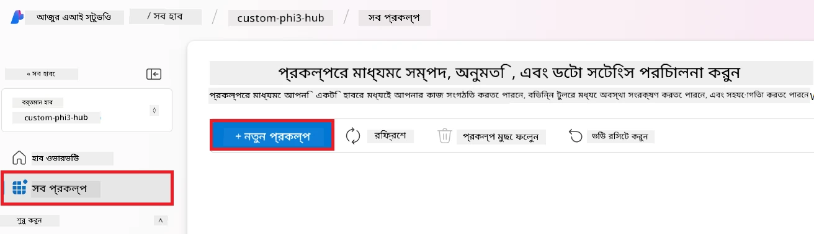

1. **Project name** লিখুন। এটি একটি অনন্য মান হতে হবে।

    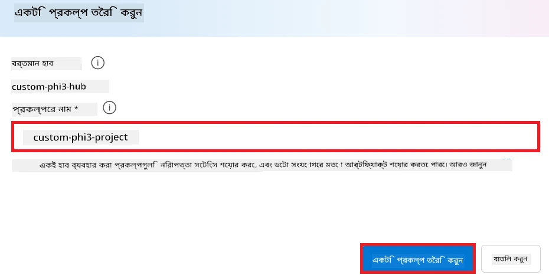

1. **Create a project** নির্বাচন করুন।

#### Fine-tuned Phi-3 মডেলের জন্য একটি কাস্টম কানেকশন যোগ করুন

আপনার কাস্টম Phi-3 মডেল Prompt flow-তে ইন্টিগ্রেট করতে, মডেলের endpoint এবং key একটি কাস্টম কানেকশনে সংরক্ষণ করতে হবে। এই সেটআপ নিশ্চিত করবে যে Prompt flow-তে আপনার কাস্টম Phi-3 মডেল অ্যাক্সেসযোগ্য থাকবে।

#### Fine-tuned Phi-3 মডেলের api key এবং endpoint uri সেট করুন

1. [Azure ML Studio](https://ml.azure.com/home?WT.mc_id=aiml-137032-kinfeylo) ভিজিট করুন।

1. আপনি যে Azure Machine learning workspace তৈরি করেছেন সেখানে যান।

1. বাম পাশের ট্যাব থেকে **Endpoints** নির্বাচন করুন।

    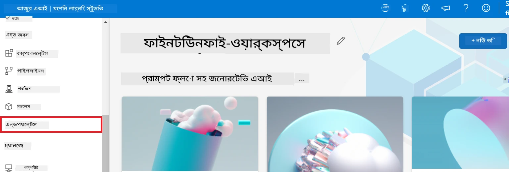

1. আপনি যে endpoint তৈরি করেছেন তা নির্বাচন করুন।

    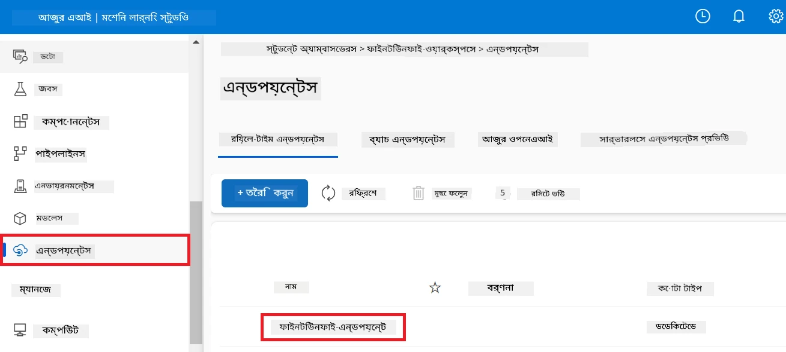

1. নেভিগেশন মেনু থেকে **Consume** নির্বাচন করুন।

1. আপনার **REST endpoint** এবং **Primary key** কপি করুন।

    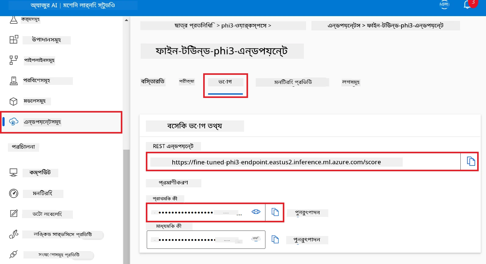

#### কাস্টম কানেকশন যোগ করুন

1. [Azure AI Foundry](https://ai.azure.com/?WT.mc_id=aiml-137032-kinfeylo) ভিজিট করুন।

1. আপনি যে Azure AI Foundry প্রজেক্ট তৈরি করেছেন সেখানে যান।

1. আপনি যে প্রজেক্ট তৈরি করেছেন, সেখানে বাম পাশের ট্যাব থেকে **Settings** নির্বাচন করুন।

1. **+ New connection** নির্বাচন করুন।

    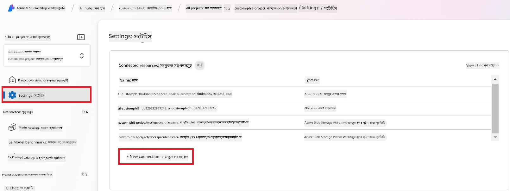

1. নেভিগেশন মেনু থেকে **Custom keys** নির্বাচন করুন।

    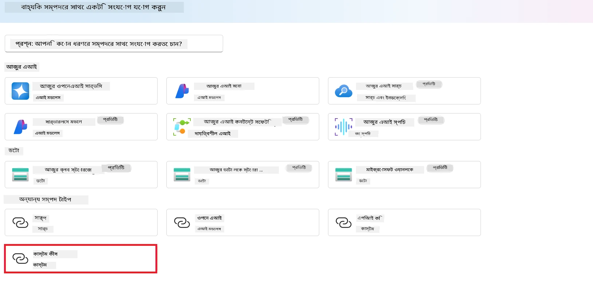

1. নিম্নলিখিত কাজগুলো সম্পাদন করুন:

    - **+ Add key value pairs** নির্বাচন করুন।
    - key name হিসেবে **endpoint** লিখুন এবং Azure ML Studio থেকে কপি করা endpoint value ফিল্ডে পেস্ট করুন।
    - আবার **+ Add key value pairs** নির্বাচন করুন।
    - key name হিসেবে **key** লিখুন এবং Azure ML Studio থেকে কপি করা key value ফিল্ডে পেস্ট করুন।
    - keys যোগ করার পর, **is secret** নির্বাচন করুন যাতে key প্রকাশ না হয়।

    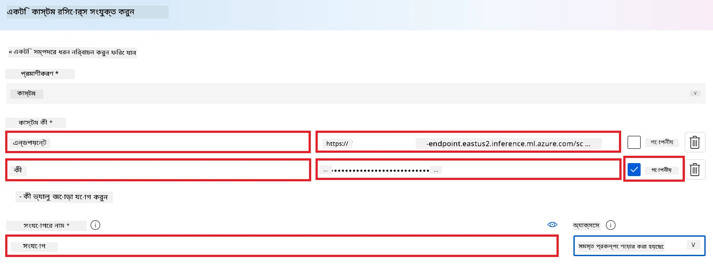

1. **Add connection** নির্বাচন করুন।

#### Prompt flow তৈরি করুন

আপনি Azure AI Foundry-তে কাস্টম কানেকশন যোগ করেছেন। এখন, নিম্নলিখিত ধাপগুলো অনুসরণ করে একটি Prompt flow তৈরি করুন। এর পরে, আপনি এই Prompt flow-কে কাস্টম কানেকশনের সাথে সংযুক্ত করবেন যাতে আপনি অতিনির্মিত মডেলটি Prompt flow-এর ভিতরে ব্যবহার করতে পারেন।

1. আপনি যে Azure AI Foundry প্রজেক্ট তৈরি করেছেন সেখানে যান।

1. বাম পাশের ট্যাব থেকে **Prompt flow** নির্বাচন করুন।

1. নেভিগেশন মেনু থেকে **+ Create** নির্বাচন করুন।

    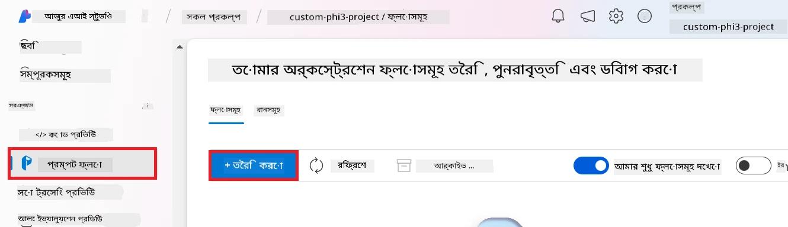

1. নেভিগেশন মেনু থেকে **Chat flow** নির্বাচন করুন।

    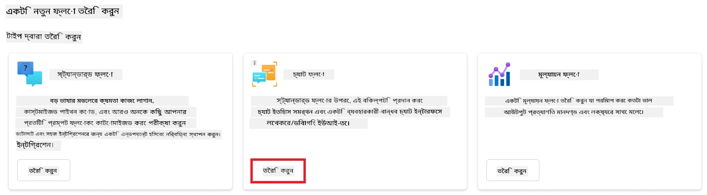

1. ব্যবহারের জন্য **Folder name** লিখুন।

    

2. **Create** নির্বাচন করুন।

#### আপনার কাস্টম Phi-3 মডেলের সাথে চ্যাট করার জন্য Prompt flow সেট আপ করুন

আপনাকে fine-tuned Phi-3 মডেলটি Prompt flow-তে ইন্টিগ্রেট করতে হবে। যদিও বিদ্যমান Prompt flow এই উদ্দেশ্যে ডিজাইন করা হয়নি। তাই, আপনাকে Prompt flow পুনরায় ডিজাইন করতে হবে যাতে কাস্টম মডেল ইন্টিগ্রেট করা যায়।

1. Prompt flow-তে নিম্নলিখিত কাজগুলো করে বিদ্যমান ফ্লো পুনর্নির্মাণ করুন:

    - **Raw file mode** নির্বাচন করুন।
    - *flow.dag.yml* ফাইলে থাকা সমস্ত কোড মুছে ফেলুন।
    - *flow.dag.yml* ফাইলে নিম্নলিখিত কোডটি যোগ করুন।

        ```yml
        inputs:
          input_data:
            type: string
            default: "Who founded Microsoft?"

        outputs:
          answer:
            type: string
            reference: ${integrate_with_promptflow.output}

        nodes:
        - name: integrate_with_promptflow
          type: python
          source:
            type: code
            path: integrate_with_promptflow.py
          inputs:
            input_data: ${inputs.input_data}
        ```

    - **Save** নির্বাচন করুন।

    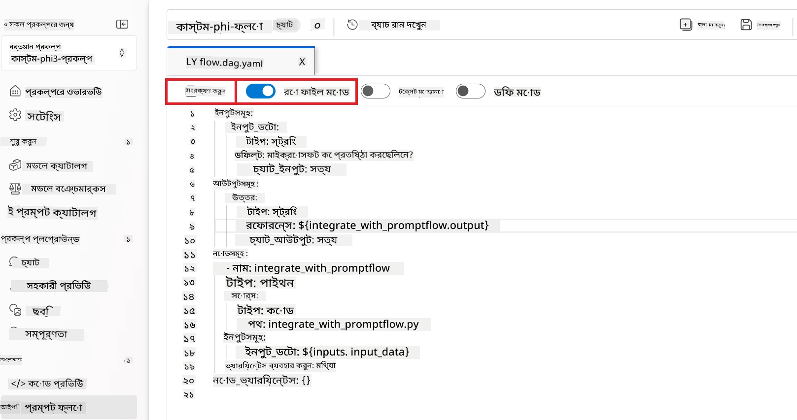

1. Prompt flow-তে কাস্টম Phi-3 মডেল ব্যবহার করতে *integrate_with_promptflow.py* ফাইলে নিম্নলিখিত কোডটি যোগ করুন।

    ```python
    import logging
    import requests
    from promptflow import tool
    from promptflow.connections import CustomConnection

    # লগ সেটআপ
    logging.basicConfig(
        format="%(asctime)s - %(levelname)s - %(name)s - %(message)s",
        datefmt="%Y-%m-%d %H:%M:%S",
        level=logging.DEBUG
    )
    logger = logging.getLogger(__name__)

    def query_phi3_model(input_data: str, connection: CustomConnection) -> str:
        """
        Send a request to the Phi-3 model endpoint with the given input data using Custom Connection.
        """

        # "connection" হল কাস্টম কানেকশনের নাম, "endpoint", "key" হল কাস্টম কানেকশনের কীসমূহ
        endpoint_url = connection.endpoint
        api_key = connection.key

        headers = {
            "Content-Type": "application/json",
            "Authorization": f"Bearer {api_key}"
        }
        data = {
            "input_data": {
                "input_string": [
                    {"role": "user", "content": input_data}
                ],
                "parameters": {
                    "temperature": 0.7,
                    "max_new_tokens": 128
                }
            }
        }
        try:
            response = requests.post(endpoint_url, json=data, headers=headers)
            response.raise_for_status()
            
            # সম্পূর্ণ JSON রেসপন্স লগ করুন
            logger.debug(f"Full JSON response: {response.json()}")

            result = response.json()["output"]
            logger.info("Successfully received response from Azure ML Endpoint.")
            return result
        except requests.exceptions.RequestException as e:
            logger.error(f"Error querying Azure ML Endpoint: {e}")
            raise

    @tool
    def my_python_tool(input_data: str, connection: CustomConnection) -> str:
        """
        Tool function to process input data and query the Phi-3 model.
        """
        return query_phi3_model(input_data, connection)

    ```

    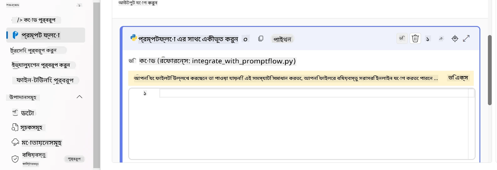

> [!NOTE]
> Azure AI Foundry-তে Prompt flow ব্যবহার সম্পর্কিত আরও বিস্তারিত তথ্যের জন্য, আপনি [Prompt flow in Azure AI Foundry](https://learn.microsoft.com/azure/ai-studio/how-to/prompt-flow) দেখতে পারেন।

1. **Chat input**, **Chat output** নির্বাচন করুন যাতে আপনার মডেলের সাথে চ্যাট সক্ষম হয়।

    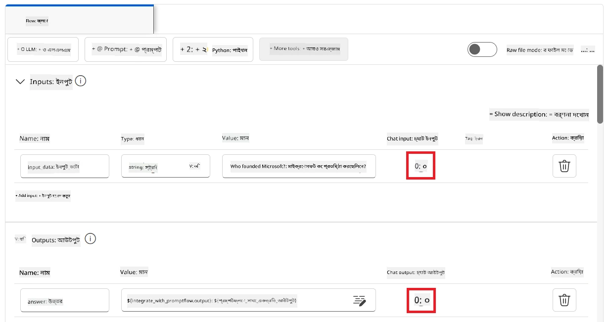

1. এখন আপনি আপনার কাস্টম Phi-3 মডেলের সাথে চ্যাট করার জন্য প্রস্তুত। পরবর্তী অনুশীলনে, আপনি শিখবেন কীভাবে Prompt flow শুরু করতে হয় এবং এটি ব্যবহার করে fine-tuned Phi-3 মডেলের সাথে চ্যাট করতে হয়।

> [!NOTE]
>
> পুনর্নির্মিত ফ্লোটি নিচের ছবির মতো হওয়া উচিত:
>
> 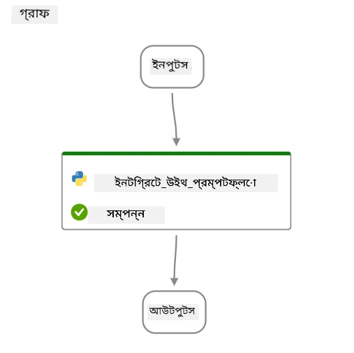
>

### আপনার কাস্টম Phi-3 মডেলের সাথে চ্যাট করুন

আপনি এখন fine-tuned এবং আপনার কাস্টম Phi-3 মডেল Prompt flow-র সাথে ইন্টিগ্রেট করেছেন, চ্যাট শুরু করার জন্য প্রস্তুত। এই অনুশীলনটি আপনাকে আপনার মডেলের সাথে চ্যাট সেট আপ এবং আরম্ভ করতে গাইড করবে। এই ধাপগুলো অনুসরণ করে, আপনি আপনার fine-tuned Phi-3 মডেলের ক্ষমতাগুলো বিভিন্ন কাজ এবং কথোপকথনের জন্য পুরোপুরি ব্যবহার করতে পারবেন।

- Prompt flow ব্যবহার করে আপনার কাস্টম Phi-3 মডেলের সাথে চ্যাট করুন।

#### Prompt flow শুরু করুন

1. Prompt flow শুরু করতে **Start compute sessions** নির্বাচন করুন।

    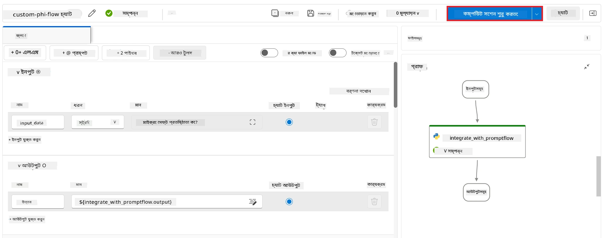

1. প্যারামিটার রিফ্রেশ করতে **Validate and parse input** নির্বাচন করুন।

    

1. আপনি যে কাস্টম কানেকশন তৈরি করেছেন তার **connection** এর **Value** নির্বাচন করুন। উদাহরণস্বরূপ, *connection*।

    

#### আপনার কাস্টম মডেলের সাথে চ্যাট করুন

1. **Chat** নির্বাচন করুন।

    

1. ফলাফলের একটি উদাহরণ এখানে দেওয়া হলো: এখন আপনি আপনার কাস্টম Phi-3 মডেলের সাথে চ্যাট করতে পারেন। fine-tuning-এর জন্য ব্যবহৃত ডেটার ভিত্তিতে প্রশ্ন করতে পরামর্শ দেওয়া হয়।

    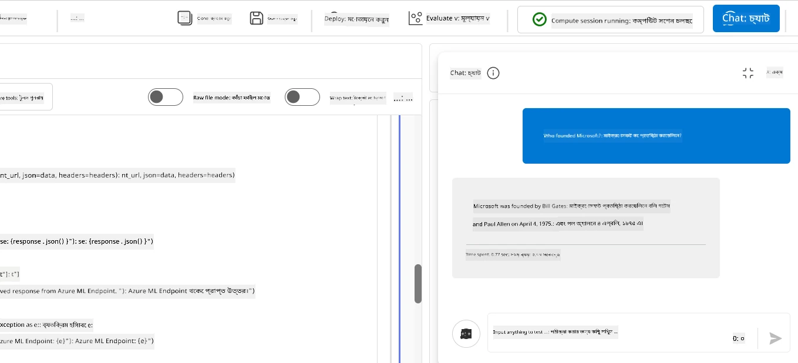

---

<!-- CO-OP TRANSLATOR DISCLAIMER START -->
**বার্নিং**:
এই নথিটি AI অনুবাদ সেবা [Co-op Translator](https://github.com/Azure/co-op-translator) ব্যবহার করে অনূদিত হয়েছে। আমরা যথাসাধ্য সঠিকতার জন্য চেষ্টা করি, তবে অনুগ্রহ করে লক্ষ্য করুন যে স্বয়ংক্রিয় অনুবাদে ত্রুটি বা অসঙ্গতি থাকতে পারে। মূল ভাষায় থাকা নথিটি কর্তৃপক্ষপূর্ণ উৎস হিসাবে বিবেচনা করা উচিত। গুরুত্বপূর্ণ তথ্যের জন্য পেশাদার মানব অনুবাদের সুপারিশ করা হয়। এই অনুবাদের ব্যবহারে সৃষ্ট কোন ভুল বোঝাবুঝি বা ভুল ব্যাখ্যার জন্য আমরা দায়ী নই।
<!-- CO-OP TRANSLATOR DISCLAIMER END -->