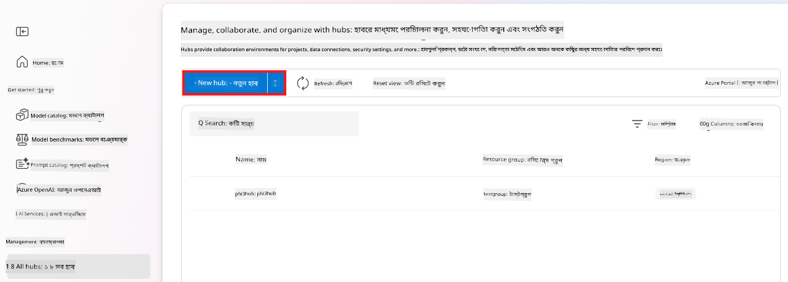

<!--
CO_OP_TRANSLATOR_METADATA:
{
  "original_hash": "ecbd9179a21edbaafaf114d47f09f3e3",
  "translation_date": "2025-07-17T01:16:05+00:00",
  "source_file": "md/02.Application/01.TextAndChat/Phi3/E2E_Phi-3-FineTuning_PromptFlow_Integration_AIFoundry.md",
  "language_code": "bn"
}
-->
# Azure AI Foundry-তে Prompt flow এর সাথে কাস্টম Phi-3 মডেল ফাইন-টিউন এবং ইন্টিগ্রেট করুন

এই সম্পূর্ণ (E2E) নমুনাটি Microsoft Tech Community থেকে "[Fine-Tune and Integrate Custom Phi-3 Models with Prompt Flow in Azure AI Foundry](https://techcommunity.microsoft.com/t5/educator-developer-blog/fine-tune-and-integrate-custom-phi-3-models-with-prompt-flow-in/ba-p/4191726?WT.mc_id=aiml-137032-kinfeylo)" গাইডের উপর ভিত্তি করে তৈরি। এটি Azure AI Foundry-তে Prompt flow এর সাথে কাস্টম Phi-3 মডেল ফাইন-টিউন, ডিপ্লয় এবং ইন্টিগ্রেট করার প্রক্রিয়া পরিচয় করিয়ে দেয়।  
E2E নমুনা "[Fine-Tune and Integrate Custom Phi-3 Models with Prompt Flow](./E2E_Phi-3-FineTuning_PromptFlow_Integration.md)" থেকে আলাদা, যেখানে কোড লোকালি চালানো হয়েছিল, এই টিউটোরিয়ালে পুরোপুরি Azure AI / ML Studio-র মধ্যে আপনার মডেল ফাইন-টিউন এবং ইন্টিগ্রেট করার উপর ফোকাস করা হয়েছে।

## ওভারভিউ

এই E2E নমুনায়, আপনি শিখবেন কিভাবে Phi-3 মডেল ফাইন-টিউন করতে হয় এবং Azure AI Foundry-তে Prompt flow এর সাথে ইন্টিগ্রেট করতে হয়। Azure AI / ML Studio ব্যবহার করে, আপনি কাস্টম AI মডেল ডিপ্লয় এবং ব্যবহারের জন্য একটি ওয়ার্কফ্লো তৈরি করবেন। এই E2E নমুনাটি তিনটি দৃশ্যপট (scenario) এ বিভক্ত:

**দৃশ্যপট ১: Azure রিসোর্স সেটআপ এবং ফাইন-টিউনিং এর প্রস্তুতি**

**দৃশ্যপট ২: Phi-3 মডেল ফাইন-টিউন এবং Azure Machine Learning Studio-তে ডিপ্লয়**

**দৃশ্যপট ৩: Prompt flow এর সাথে ইন্টিগ্রেট এবং Azure AI Foundry-তে আপনার কাস্টম মডেলের সাথে চ্যাট করুন**

এখানে এই E2E নমুনার একটি সারাংশ দেওয়া হলো।


### বিষয়বস্তু সূচি

1. **[দৃশ্যপট ১: Azure রিসোর্স সেটআপ এবং ফাইন-টিউনিং এর প্রস্তুতি](../../../../../../md/02.Application/01.TextAndChat/Phi3)**
    - [Azure Machine Learning ওয়ার্কস্পেস তৈরি করুন](../../../../../../md/02.Application/01.TextAndChat/Phi3)
    - [Azure সাবস্ক্রিপশনে GPU কোটা অনুরোধ করুন](../../../../../../md/02.Application/01.TextAndChat/Phi3)
    - [রোল অ্যাসাইনমেন্ট যোগ করুন](../../../../../../md/02.Application/01.TextAndChat/Phi3)
    - [প্রজেক্ট সেটআপ করুন](../../../../../../md/02.Application/01.TextAndChat/Phi3)
    - [ফাইন-টিউনিং এর জন্য ডেটাসেট প্রস্তুত করুন](../../../../../../md/02.Application/01.TextAndChat/Phi3)

1. **[দৃশ্যপট ২: Phi-3 মডেল ফাইন-টিউন এবং Azure Machine Learning Studio-তে ডিপ্লয়](../../../../../../md/02.Application/01.TextAndChat/Phi3)**
    - [Phi-3 মডেল ফাইন-টিউন করুন](../../../../../../md/02.Application/01.TextAndChat/Phi3)
    - [ফাইন-টিউন করা Phi-3 মডেল ডিপ্লয় করুন](../../../../../../md/02.Application/01.TextAndChat/Phi3)

1. **[দৃশ্যপট ৩: Prompt flow এর সাথে ইন্টিগ্রেট এবং Azure AI Foundry-তে আপনার কাস্টম মডেলের সাথে চ্যাট করুন](../../../../../../md/02.Application/01.TextAndChat/Phi3)**
    - [কাস্টম Phi-3 মডেল Prompt flow এর সাথে ইন্টিগ্রেট করুন](../../../../../../md/02.Application/01.TextAndChat/Phi3)
    - [আপনার কাস্টম Phi-3 মডেলের সাথে চ্যাট করুন](../../../../../../md/02.Application/01.TextAndChat/Phi3)

## দৃশ্যপট ১: Azure রিসোর্স সেটআপ এবং ফাইন-টিউনিং এর প্রস্তুতি

### Azure Machine Learning ওয়ার্কস্পেস তৈরি করুন

1. পোর্টালের উপরের **সার্চ বার**-এ *azure machine learning* টাইপ করুন এবং প্রদর্শিত অপশন থেকে **Azure Machine Learning** নির্বাচন করুন।

    

2. নেভিগেশন মেনু থেকে **+ Create** নির্বাচন করুন।

3. নেভিগেশন মেনু থেকে **New workspace** নির্বাচন করুন।

    

4. নিম্নলিখিত কাজগুলো করুন:

    - আপনার Azure **Subscription** নির্বাচন করুন।
    - ব্যবহার করার জন্য **Resource group** নির্বাচন করুন (প্রয়োজনে নতুন তৈরি করুন)।
    - **Workspace Name** লিখুন। এটি অবশ্যই ইউনিক হতে হবে।
    - আপনি যে **Region** ব্যবহার করতে চান তা নির্বাচন করুন।
    - ব্যবহার করার জন্য **Storage account** নির্বাচন করুন (প্রয়োজনে নতুন তৈরি করুন)।
    - ব্যবহার করার জন্য **Key vault** নির্বাচন করুন (প্রয়োজনে নতুন তৈরি করুন)।
    - ব্যবহার করার জন্য **Application insights** নির্বাচন করুন (প্রয়োজনে নতুন তৈরি করুন)।
    - ব্যবহার করার জন্য **Container registry** নির্বাচন করুন (প্রয়োজনে নতুন তৈরি করুন)।

    

5. **Review + Create** নির্বাচন করুন।

6. **Create** নির্বাচন করুন।

### Azure সাবস্ক্রিপশনে GPU কোটা অনুরোধ করুন

এই টিউটোরিয়ালে, আপনি Phi-3 মডেল ফাইন-টিউন এবং ডিপ্লয় করতে GPU ব্যবহার করবেন। ফাইন-টিউনের জন্য *Standard_NC24ads_A100_v4* GPU ব্যবহার করবেন, যার জন্য কোটা অনুরোধ প্রয়োজন। ডিপ্লয়ের জন্য *Standard_NC6s_v3* GPU ব্যবহার করবেন, যার জন্যও কোটা অনুরোধ দরকার।

> [!NOTE]
>
> শুধুমাত্র Pay-As-You-Go সাবস্ক্রিপশন (স্ট্যান্ডার্ড সাবস্ক্রিপশন টাইপ) GPU বরাদ্দের জন্য যোগ্য; বেনিফিট সাবস্ক্রিপশন বর্তমানে সমর্থিত নয়।
>

1. [Azure ML Studio](https://ml.azure.com/home?wt.mc_id=studentamb_279723) এ যান।

1. *Standard NCADSA100v4 Family* কোটা অনুরোধ করতে নিম্নলিখিত কাজগুলো করুন:

    - বাম পাশের ট্যাব থেকে **Quota** নির্বাচন করুন।
    - ব্যবহার করার **Virtual machine family** নির্বাচন করুন। উদাহরণস্বরূপ, **Standard NCADSA100v4 Family Cluster Dedicated vCPUs** নির্বাচন করুন, যা *Standard_NC24ads_A100_v4* GPU অন্তর্ভুক্ত।
    - নেভিগেশন মেনু থেকে **Request quota** নির্বাচন করুন।

        

    - Request quota পৃষ্ঠায়, আপনি যে **New cores limit** ব্যবহার করতে চান তা লিখুন। উদাহরণস্বরূপ, ২৪।
    - Request quota পৃষ্ঠায়, GPU কোটা অনুরোধ করতে **Submit** নির্বাচন করুন।

1. *Standard NCSv3 Family* কোটা অনুরোধ করতে নিম্নলিখিত কাজগুলো করুন:

    - বাম পাশের ট্যাব থেকে **Quota** নির্বাচন করুন।
    - ব্যবহার করার **Virtual machine family** নির্বাচন করুন। উদাহরণস্বরূপ, **Standard NCSv3 Family Cluster Dedicated vCPUs** নির্বাচন করুন, যা *Standard_NC6s_v3* GPU অন্তর্ভুক্ত।
    - নেভিগেশন মেনু থেকে **Request quota** নির্বাচন করুন।
    - Request quota পৃষ্ঠায়, আপনি যে **New cores limit** ব্যবহার করতে চান তা লিখুন। উদাহরণস্বরূপ, ২৪।
    - Request quota পৃষ্ঠায়, GPU কোটা অনুরোধ করতে **Submit** নির্বাচন করুন।

### রোল অ্যাসাইনমেন্ট যোগ করুন

আপনার মডেল ফাইন-টিউন এবং ডিপ্লয় করার জন্য, প্রথমে একটি User Assigned Managed Identity (UAI) তৈরি করতে হবে এবং তাকে প্রয়োজনীয় অনুমতি দিতে হবে। এই UAI ডিপ্লয়ের সময় প্রমাণীকরণের জন্য ব্যবহৃত হবে।

#### User Assigned Managed Identity (UAI) তৈরি করুন

1. পোর্টালের উপরের **সার্চ বার**-এ *managed identities* টাইপ করুন এবং প্রদর্শিত অপশন থেকে **Managed Identities** নির্বাচন করুন।

    

1. **+ Create** নির্বাচন করুন।

    

1. নিম্নলিখিত কাজগুলো করুন:

    - আপনার Azure **Subscription** নির্বাচন করুন।
    - ব্যবহার করার **Resource group** নির্বাচন করুন (প্রয়োজনে নতুন তৈরি করুন)।
    - আপনি যে **Region** ব্যবহার করতে চান তা নির্বাচন করুন।
    - **Name** লিখুন। এটি অবশ্যই ইউনিক হতে হবে।

    

1. **Review + create** নির্বাচন করুন।

1. **+ Create** নির্বাচন করুন।

#### Managed Identity-তে Contributor রোল অ্যাসাইনমেন্ট যোগ করুন

1. আপনি যে Managed Identity তৈরি করেছেন সেটির রিসোর্সে যান।

1. বাম পাশের ট্যাব থেকে **Azure role assignments** নির্বাচন করুন।

1. নেভিগেশন মেনু থেকে **+Add role assignment** নির্বাচন করুন।

1. Add role assignment পৃষ্ঠায় নিম্নলিখিত কাজগুলো করুন:
    - **Scope** হিসেবে **Resource group** নির্বাচন করুন।
    - আপনার Azure **Subscription** নির্বাচন করুন।
    - ব্যবহার করার **Resource group** নির্বাচন করুন।
    - **Role** হিসেবে **Contributor** নির্বাচন করুন।

    

2. **Save** নির্বাচন করুন।

#### Managed Identity-তে Storage Blob Data Reader রোল অ্যাসাইনমেন্ট যোগ করুন

1. পোর্টালের উপরের **সার্চ বার**-এ *storage accounts* টাইপ করুন এবং প্রদর্শিত অপশন থেকে **Storage accounts** নির্বাচন করুন।

    

1. Azure Machine Learning ওয়ার্কস্পেসের সাথে যুক্ত স্টোরেজ অ্যাকাউন্ট নির্বাচন করুন। উদাহরণস্বরূপ, *finetunephistorage*।

1. Add role assignment পৃষ্ঠায় যাওয়ার জন্য নিম্নলিখিত কাজগুলো করুন:

    - আপনি যে Azure Storage অ্যাকাউন্ট তৈরি করেছেন সেখানে যান।
    - বাম পাশের ট্যাব থেকে **Access Control (IAM)** নির্বাচন করুন।
    - নেভিগেশন মেনু থেকে **+ Add** নির্বাচন করুন।
    - নেভিগেশন মেনু থেকে **Add role assignment** নির্বাচন করুন।

    

1. Add role assignment পৃষ্ঠায় নিম্নলিখিত কাজগুলো করুন:

    - Role পৃষ্ঠায়, **search bar**-এ *Storage Blob Data Reader* টাইপ করুন এবং প্রদর্শিত অপশন থেকে **Storage Blob Data Reader** নির্বাচন করুন।
    - Role পৃষ্ঠায় **Next** নির্বাচন করুন।
    - Members পৃষ্ঠায়, **Assign access to** হিসেবে **Managed identity** নির্বাচন করুন।
    - Members পৃষ্ঠায় **+ Select members** নির্বাচন করুন।
    - Select managed identities পৃষ্ঠায়, আপনার Azure **Subscription** নির্বাচন করুন।
    - Select managed identities পৃষ্ঠায়, **Managed identity** হিসেবে **Manage Identity** নির্বাচন করুন।
    - Select managed identities পৃষ্ঠায়, আপনি যে Managed Identity তৈরি করেছেন তা নির্বাচন করুন। উদাহরণস্বরূপ, *finetunephi-managedidentity*।
    - Select managed identities পৃষ্ঠায় **Select** নির্বাচন করুন।

    

1. **Review + assign** নির্বাচন করুন।

#### Managed Identity-তে AcrPull রোল অ্যাসাইনমেন্ট যোগ করুন

1. পোর্টালের উপরের **সার্চ বার**-এ *container registries* টাইপ করুন এবং প্রদর্শিত অপশন থেকে **Container registries** নির্বাচন করুন।

    

1. Azure Machine Learning ওয়ার্কস্পেসের সাথে যুক্ত container registry নির্বাচন করুন। উদাহরণস্বরূপ, *finetunephicontainerregistry*।

1. Add role assignment পৃষ্ঠায় যাওয়ার জন্য নিম্নলিখিত কাজগুলো করুন:

    - বাম পাশের ট্যাব থেকে **Access Control (IAM)** নির্বাচন করুন।
    - নেভিগেশন মেনু থেকে **+ Add** নির্বাচন করুন।
    - নেভিগেশন মেনু থেকে **Add role assignment** নির্বাচন করুন।

1. Add role assignment পৃষ্ঠায় নিম্নলিখিত কাজগুলো করুন:

    - Role পৃষ্ঠায়, **search bar**-এ *AcrPull* টাইপ করুন এবং প্রদর্শিত অপশন থেকে **AcrPull** নির্বাচন করুন।
    - Role পৃষ্ঠায় **Next** নির্বাচন করুন।
    - Members পৃষ্ঠায়, **Assign access to** হিসেবে **Managed identity** নির্বাচন করুন।
    - Members পৃষ্ঠায় **+ Select members** নির্বাচন করুন।
    - Select managed identities পৃষ্ঠায়, আপনার Azure **Subscription** নির্বাচন করুন।
    - Select managed identities পৃষ্ঠায়, **Managed identity** হিসেবে **Manage Identity** নির্বাচন করুন।
    - Select managed identities পৃষ্ঠায়, আপনি যে Managed Identity তৈরি করেছেন তা নির্বাচন করুন। উদাহরণস্বরূপ, *finetunephi-managedidentity*।
    - Select managed identities পৃষ্ঠায় **Select** নির্বাচন করুন।
    - **Review + assign** নির্বাচন করুন।

### প্রজেক্ট সেটআপ করুন

ফাইন-টিউনিং এর জন্য প্রয়োজনীয় ডেটাসেট ডাউনলোড করতে, আপনি একটি লোকাল পরিবেশ সেটআপ করবেন।

এই অনুশীলনে, আপনি

- কাজ করার জন্য একটি ফোল্ডার তৈরি করবেন।
- একটি ভার্চুয়াল এনভায়রনমেন্ট তৈরি করবেন।
- প্রয়োজনীয় প্যাকেজগুলো ইনস্টল করবেন।
- ডেটাসেট ডাউনলোড করার জন্য *download_dataset.py* ফাইল তৈরি করবেন।

#### কাজ করার জন্য একটি ফোল্ডার তৈরি করুন

1. একটি টার্মিনাল উইন্ডো খুলুন এবং ডিফল্ট পাথে *finetune-phi* নামে একটি ফোল্ডার তৈরি করতে নিচের কমান্ডটি টাইপ করুন।

    ```console
    mkdir finetune-phi
    ```

2. আপনার টার্মিনালে নিচের কমান্ডটি টাইপ করে আপনি যে *finetune-phi* ফোল্ডার তৈরি করেছেন সেখানে যান।
#### একটি ভার্চুয়াল পরিবেশ তৈরি করুন

1. আপনার টার্মিনালে নিচের কমান্ডটি টাইপ করুন একটি ভার্চুয়াল পরিবেশ *.venv* নামে তৈরি করতে।

2. আপনার টার্মিনালে নিচের কমান্ডটি টাইপ করুন ভার্চুয়াল পরিবেশ সক্রিয় করতে।

> [!NOTE]
> যদি এটি কাজ করে, তাহলে কমান্ড প্রম্পটের আগে *(.venv)* দেখতে পাবেন।

#### প্রয়োজনীয় প্যাকেজগুলি ইনস্টল করুন

1. প্রয়োজনীয় প্যাকেজগুলি ইনস্টল করতে আপনার টার্মিনালে নিচের কমান্ডগুলি টাইপ করুন।

#### `download_dataset.py` তৈরি করুন

> [!NOTE]
> সম্পূর্ণ ফোল্ডার স্ট্রাকচার:
>
> ```text
> └── YourUserName
> .    └── finetune-phi
> .        └── download_dataset.py
> ```

1. **Visual Studio Code** খুলুন।

1. মেনু বারে থেকে **File** নির্বাচন করুন।

1. **Open Folder** নির্বাচন করুন।

1. আপনি যে *finetune-phi* ফোল্ডারটি তৈরি করেছেন, যা *C:\Users\yourUserName\finetune-phi* এ অবস্থিত, সেটি নির্বাচন করুন।

    

1. Visual Studio Code এর বাম প্যানেলে, রাইট-ক্লিক করে **New File** নির্বাচন করুন এবং *download_dataset.py* নামে একটি নতুন ফাইল তৈরি করুন।

    

### ফাইন-টিউনিংয়ের জন্য ডেটাসেট প্রস্তুত করুন

এই অনুশীলনে, আপনি *download_dataset.py* ফাইলটি চালিয়ে *ultrachat_200k* ডেটাসেটগুলি আপনার লোকাল পরিবেশে ডাউনলোড করবেন। এরপর এই ডেটাসেটগুলি ব্যবহার করে Azure Machine Learning এ Phi-3 মডেল ফাইন-টিউন করবেন।

এই অনুশীলনে আপনি:

- *download_dataset.py* ফাইলে কোড যোগ করবেন ডেটাসেট ডাউনলোড করার জন্য।
- *download_dataset.py* ফাইলটি চালিয়ে ডেটাসেটগুলি আপনার লোকাল পরিবেশে ডাউনলোড করবেন।

#### *download_dataset.py* ব্যবহার করে আপনার ডেটাসেট ডাউনলোড করুন

1. Visual Studio Code এ *download_dataset.py* ফাইলটি খুলুন।

1. *download_dataset.py* ফাইলে নিচের কোডটি যোগ করুন।

1. আপনার টার্মিনালে নিচের কমান্ডটি টাইপ করুন স্ক্রিপ্টটি চালাতে এবং ডেটাসেটটি আপনার লোকাল পরিবেশে ডাউনলোড করতে।

1. নিশ্চিত করুন যে ডেটাসেটগুলি সফলভাবে আপনার লোকাল *finetune-phi/data* ডিরেক্টরিতে সংরক্ষিত হয়েছে।

> [!NOTE]
>
> #### ডেটাসেটের আকার এবং ফাইন-টিউনিং সময় সম্পর্কে নোট
>
> এই টিউটোরিয়ালে, আপনি ডেটাসেটের মাত্র ১% (`split='train[:1%]'`) ব্যবহার করছেন। এটি ডেটার পরিমাণ অনেক কমিয়ে দেয়, যার ফলে আপলোড এবং ফাইন-টিউনিং উভয় প্রক্রিয়া দ্রুত হয়। আপনি প্রশিক্ষণের সময় এবং মডেলের পারফরম্যান্সের মধ্যে সঠিক ভারসাম্য খুঁজে পেতে শতাংশ পরিবর্তন করতে পারেন। ডেটাসেটের ছোট অংশ ব্যবহার করলে ফাইন-টিউনিংয়ের জন্য প্রয়োজনীয় সময় কমে যায়, যা টিউটোরিয়ালের জন্য প্রক্রিয়াটিকে আরও সহজ করে তোলে।

## দৃশ্যপট ২: Phi-3 মডেল ফাইন-টিউন করুন এবং Azure Machine Learning Studio তে ডিপ্লয় করুন

### Phi-3 মডেল ফাইন-টিউন করুন

এই অনুশীলনে, আপনি Azure Machine Learning Studio তে Phi-3 মডেল ফাইন-টিউন করবেন।

এই অনুশীলনে আপনি:

- ফাইন-টিউনিংয়ের জন্য কম্পিউটার ক্লাস্টার তৈরি করবেন।
- Azure Machine Learning Studio তে Phi-3 মডেল ফাইন-টিউন করবেন।

#### ফাইন-টিউনিংয়ের জন্য কম্পিউটার ক্লাস্টার তৈরি করুন

1. [Azure ML Studio](https://ml.azure.com/home?wt.mc_id=studentamb_279723) এ যান।

1. বাম পাশের ট্যাব থেকে **Compute** নির্বাচন করুন।

1. নেভিগেশন মেনু থেকে **Compute clusters** নির্বাচন করুন।

1. **+ New** নির্বাচন করুন।

    

1. নিম্নলিখিত কাজগুলি করুন:

    - আপনি যে **Region** ব্যবহার করতে চান তা নির্বাচন করুন।
    - **Virtual machine tier** হিসেবে **Dedicated** নির্বাচন করুন।
    - **Virtual machine type** হিসেবে **GPU** নির্বাচন করুন।
    - **Virtual machine size** ফিল্টার থেকে **Select from all options** নির্বাচন করুন।
    - **Virtual machine size** হিসেবে **Standard_NC24ads_A100_v4** নির্বাচন করুন।

    

1. **Next** নির্বাচন করুন।

1. নিম্নলিখিত কাজগুলি করুন:

    - **Compute name** লিখুন। এটি অবশ্যই একটি অনন্য মান হতে হবে।
    - **Minimum number of nodes** হিসেবে **0** নির্বাচন করুন।
    - **Maximum number of nodes** হিসেবে **1** নির্বাচন করুন।
    - **Idle seconds before scale down** হিসেবে **120** নির্বাচন করুন।

    

1. **Create** নির্বাচন করুন।

#### Phi-3 মডেল ফাইন-টিউন করুন

1. [Azure ML Studio](https://ml.azure.com/home?wt.mc_id=studentamb_279723) এ যান।

1. আপনি যে Azure Machine Learning ওয়ার্কস্পেস তৈরি করেছেন তা নির্বাচন করুন।

    

1. নিম্নলিখিত কাজগুলি করুন:

    - বাম পাশের ট্যাব থেকে **Model catalog** নির্বাচন করুন।
    - **search bar** এ *phi-3-mini-4k* টাইপ করুন এবং প্রদর্শিত অপশন থেকে **Phi-3-mini-4k-instruct** নির্বাচন করুন।

    

1. নেভিগেশন মেনু থেকে **Fine-tune** নির্বাচন করুন।

    

1. নিম্নলিখিত কাজগুলি করুন:

    - **Select task type** থেকে **Chat completion** নির্বাচন করুন।
    - **+ Select data** নির্বাচন করে **Training data** আপলোড করুন।
    - Validation data আপলোড টাইপ হিসেবে **Provide different validation data** নির্বাচন করুন।
    - **+ Select data** নির্বাচন করে **Validation data** আপলোড করুন।

    

    > [!TIP]
    >
    > আপনি **Advanced settings** নির্বাচন করে **learning_rate** এবং **lr_scheduler_type** এর মতো কনফিগারেশন কাস্টমাইজ করতে পারেন, যাতে ফাইন-টিউনিং প্রক্রিয়াটি আপনার নির্দিষ্ট চাহিদা অনুযায়ী অপ্টিমাইজ করা যায়।

1. **Finish** নির্বাচন করুন।

1. এই অনুশীলনে, আপনি সফলভাবে Azure Machine Learning ব্যবহার করে Phi-3 মডেল ফাইন-টিউন করেছেন। দয়া করে মনে রাখবেন, ফাইন-টিউনিং প্রক্রিয়াটি কিছুটা সময় নিতে পারে। ফাইন-টিউনিং কাজ চালানোর পর, আপনাকে এটি সম্পন্ন হওয়া পর্যন্ত অপেক্ষা করতে হবে। Azure Machine Learning ওয়ার্কস্পেসের বাম পাশে Jobs ট্যাবে গিয়ে আপনি ফাইন-টিউনিং কাজের অবস্থা মনিটর করতে পারেন। পরবর্তী সিরিজে, আপনি ফাইন-টিউন করা মডেলটি ডিপ্লয় করবেন এবং Prompt flow এর সাথে ইন্টিগ্রেট করবেন।

    

### ফাইন-টিউন করা Phi-3 মডেল ডিপ্লয় করুন

ফাইন-টিউন করা Phi-3 মডেলটি Prompt flow এর সাথে ইন্টিগ্রেট করতে, আপনাকে মডেলটি ডিপ্লয় করতে হবে যাতে এটি রিয়েল-টাইম ইনফারেন্সের জন্য অ্যাক্সেসযোগ্য হয়। এই প্রক্রিয়ায় মডেল রেজিস্টার করা, একটি অনলাইন এন্ডপয়েন্ট তৈরি করা এবং মডেল ডিপ্লয় করা অন্তর্ভুক্ত।

এই অনুশীলনে আপনি:

- Azure Machine Learning ওয়ার্কস্পেসে ফাইন-টিউন করা মডেল রেজিস্টার করবেন।
- একটি অনলাইন এন্ডপয়েন্ট তৈরি করবেন।
- রেজিস্টার করা ফাইন-টিউন করা Phi-3 মডেল ডিপ্লয় করবেন।

#### ফাইন-টিউন করা মডেল রেজিস্টার করুন

1. [Azure ML Studio](https://ml.azure.com/home?wt.mc_id=studentamb_279723) এ যান।

1. আপনি যে Azure Machine Learning ওয়ার্কস্পেস তৈরি করেছেন তা নির্বাচন করুন।

    

1. বাম পাশের ট্যাব থেকে **Models** নির্বাচন করুন।

1. **+ Register** নির্বাচন করুন।

1. **From a job output** নির্বাচন করুন।

    

1. আপনি যে কাজটি তৈরি করেছেন তা নির্বাচন করুন।

    

1. **Next** নির্বাচন করুন।

1. **Model type** থেকে **MLflow** নির্বাচন করুন।

1. নিশ্চিত করুন যে **Job output** নির্বাচন করা আছে; এটি স্বয়ংক্রিয়ভাবে নির্বাচিত হওয়া উচিত।

    

2. **Next** নির্বাচন করুন।

3. **Register** নির্বাচন করুন।

    

4. আপনি বাম পাশের ট্যাব থেকে **Models** মেনুতে গিয়ে আপনার রেজিস্টার করা মডেল দেখতে পারবেন।

    

#### ফাইন-টিউন করা মডেল ডিপ্লয় করুন

1. আপনি যে Azure Machine Learning ওয়ার্কস্পেস তৈরি করেছেন সেখানে যান।

1. বাম পাশের ট্যাব থেকে **Endpoints** নির্বাচন করুন।

1. নেভিগেশন মেনু থেকে **Real-time endpoints** নির্বাচন করুন।

    

1. **Create** নির্বাচন করুন।

1. আপনি যে রেজিস্টার করা মডেলটি তৈরি করেছেন তা নির্বাচন করুন।

    

1. **Select** নির্বাচন করুন।

1. নিম্নলিখিত কাজগুলি করুন:

    - **Virtual machine** হিসেবে *Standard_NC6s_v3* নির্বাচন করুন।
    - আপনি যে **Instance count** ব্যবহার করতে চান তা নির্বাচন করুন। উদাহরণস্বরূপ, *1*।
    - **Endpoint** হিসেবে **New** নির্বাচন করুন একটি নতুন এন্ডপয়েন্ট তৈরি করতে।
    - **Endpoint name** লিখুন। এটি অবশ্যই একটি অনন্য মান হতে হবে।
    - **Deployment name** লিখুন। এটি অবশ্যই একটি অনন্য মান হতে হবে।

    

1. **Deploy** নির্বাচন করুন।

> [!WARNING]
> আপনার অ্যাকাউন্টে অতিরিক্ত চার্জ এড়াতে, Azure Machine Learning ওয়ার্কস্পেসে তৈরি করা এন্ডপয়েন্টটি মুছে ফেলতে ভুলবেন না।
>

#### Azure Machine Learning ওয়ার্কস্পেসে ডিপ্লয়মেন্টের অবস্থা পরীক্ষা করুন

1. আপনি যে Azure Machine Learning ওয়ার্কস্পেস তৈরি করেছেন সেখানে যান।

1. বাম পাশের ট্যাব থেকে **Endpoints** নির্বাচন করুন।

1. আপনি যে এন্ডপয়েন্টটি তৈরি করেছেন তা নির্বাচন করুন।

    

1. এই পৃষ্ঠায়, আপনি ডিপ্লয়মেন্ট প্রক্রিয়ার সময় এন্ডপয়েন্টগুলি পরিচালনা করতে পারবেন।

> [!NOTE]
> ডিপ্লয়মেন্ট সম্পন্ন হলে, নিশ্চিত করুন যে **Live traffic** সেট করা আছে **100%**। যদি না থাকে, তাহলে **Update traffic** নির্বাচন করে ট্রাফিক সেটিংস সামঞ্জস্য করুন। ট্রাফিক 0% হলে মডেল পরীক্ষা করা যাবে না।
>
> 
>

## দৃশ্যপট ৩: Prompt flow এর সাথে ইন্টিগ্রেট করুন এবং Azure AI Foundry তে আপনার কাস্টম মডেলের সাথে চ্যাট করুন

### কাস্টম Phi-3 মডেল Prompt flow এর সাথে ইন্টিগ্রেট করুন

আপনার ফাইন-টিউন করা মডেল সফলভাবে ডিপ্লয় করার পর, এখন আপনি এটি Prompt Flow এর সাথে ইন্টিগ্রেট করতে পারবেন, যাতে আপনার মডেলটি রিয়েল-টাইম অ্যাপ্লিকেশনগুলিতে ব্যবহার করা যায় এবং আপনার কাস্টম Phi-3 মডেলের সাথে বিভিন্ন ইন্টারেক্টিভ কাজ করা সম্ভব হয়।

এই অনুশীলনে আপনি:

- Azure AI Foundry Hub তৈরি করবেন।
- Azure AI Foundry Project তৈরি করবেন।
- Prompt flow তৈরি করবেন।
- ফাইন-টিউন করা Phi-3 মডেলের জন্য একটি কাস্টম কানেকশন যোগ করবেন।
- আপনার কাস্টম Phi-3 মডেলের সাথে চ্যাট করার জন্য Prompt flow সেটআপ করবেন।
> [!NOTE]
> আপনি Azure ML Studio ব্যবহার করে Promptflow এর সাথে ইন্টিগ্রেশন করতে পারেন। একই ইন্টিগ্রেশন প্রক্রিয়া Azure ML Studio তেও প্রযোজ্য।
#### Azure AI Foundry Hub তৈরি করুন

প্রজেক্ট তৈরি করার আগে আপনাকে একটি Hub তৈরি করতে হবে। একটি Hub একটি Resource Group এর মতো কাজ করে, যা আপনাকে Azure AI Foundry এর মধ্যে একাধিক প্রজেক্ট সংগঠিত এবং পরিচালনা করতে সাহায্য করে।

1. [Azure AI Foundry](https://ai.azure.com/?WT.mc_id=aiml-137032-kinfeylo) এ যান।

1. বাম পাশের ট্যাব থেকে **All hubs** নির্বাচন করুন।

1. নেভিগেশন মেনু থেকে **+ New hub** নির্বাচন করুন।

    

1. নিম্নলিখিত কাজগুলো করুন:

    - **Hub name** লিখুন। এটি অবশ্যই একটি অনন্য মান হতে হবে।
    - আপনার Azure **Subscription** নির্বাচন করুন।
    - ব্যবহারের জন্য **Resource group** নির্বাচন করুন (প্রয়োজনে নতুন তৈরি করুন)।
    - আপনি যে **Location** ব্যবহার করতে চান তা নির্বাচন করুন।
    - ব্যবহারের জন্য **Connect Azure AI Services** নির্বাচন করুন (প্রয়োজনে নতুন তৈরি করুন)।
    - **Connect Azure AI Search** এ **Skip connecting** নির্বাচন করুন।

    

1. **Next** নির্বাচন করুন।

#### Azure AI Foundry Project তৈরি করুন

1. আপনি যে Hub তৈরি করেছেন, সেখানে বাম পাশের ট্যাব থেকে **All projects** নির্বাচন করুন।

1. নেভিগেশন মেনু থেকে **+ New project** নির্বাচন করুন।

    

1. **Project name** লিখুন। এটি অবশ্যই একটি অনন্য মান হতে হবে।

    

1. **Create a project** নির্বাচন করুন।

#### Fine-tuned Phi-3 মডেলের জন্য একটি কাস্টম কানেকশন যোগ করুন

আপনার কাস্টম Phi-3 মডেলকে Prompt flow এর সাথে সংযুক্ত করতে, আপনাকে মডেলের endpoint এবং key একটি কাস্টম কানেকশনে সংরক্ষণ করতে হবে। এই সেটআপটি নিশ্চিত করে যে Prompt flow এ আপনার কাস্টম Phi-3 মডেলে প্রবেশাধিকার থাকবে।

#### Fine-tuned Phi-3 মডেলের api key এবং endpoint uri সেট করুন

1. [Azure ML Studio](https://ml.azure.com/home?WT.mc_id=aiml-137032-kinfeylo) এ যান।

1. আপনি যে Azure Machine learning workspace তৈরি করেছেন সেখানে যান।

1. বাম পাশের ট্যাব থেকে **Endpoints** নির্বাচন করুন।

    

1. আপনি যে endpoint তৈরি করেছেন তা নির্বাচন করুন।

    

1. নেভিগেশন মেনু থেকে **Consume** নির্বাচন করুন।

1. আপনার **REST endpoint** এবং **Primary key** কপি করুন।

    

#### কাস্টম কানেকশন যোগ করুন

1. [Azure AI Foundry](https://ai.azure.com/?WT.mc_id=aiml-137032-kinfeylo) এ যান।

1. আপনি যে Azure AI Foundry প্রজেক্ট তৈরি করেছেন সেখানে যান।

1. আপনি যে প্রজেক্ট তৈরি করেছেন, সেখানে বাম পাশের ট্যাব থেকে **Settings** নির্বাচন করুন।

1. **+ New connection** নির্বাচন করুন।

    

1. নেভিগেশন মেনু থেকে **Custom keys** নির্বাচন করুন।

    

1. নিম্নলিখিত কাজগুলো করুন:

    - **+ Add key value pairs** নির্বাচন করুন।
    - key নাম হিসেবে **endpoint** লিখুন এবং Azure ML Studio থেকে কপি করা endpoint value ফিল্ডে পেস্ট করুন।
    - আবার **+ Add key value pairs** নির্বাচন করুন।
    - key নাম হিসেবে **key** লিখুন এবং Azure ML Studio থেকে কপি করা key value ফিল্ডে পেস্ট করুন।
    - key গুলো যোগ করার পর, key গুলো লুকানোর জন্য **is secret** নির্বাচন করুন।

    

1. **Add connection** নির্বাচন করুন।

#### Prompt flow তৈরি করুন

আপনি Azure AI Foundry তে একটি কাস্টম কানেকশন যোগ করেছেন। এখন, নিচের ধাপগুলো অনুসরণ করে একটি Prompt flow তৈরি করুন। এরপর, এই Prompt flow কে কাস্টম কানেকশনের সাথে সংযুক্ত করবেন যাতে আপনি fine-tuned মডেলটি Prompt flow এর মধ্যে ব্যবহার করতে পারেন।

1. আপনি যে Azure AI Foundry প্রজেক্ট তৈরি করেছেন সেখানে যান।

1. বাম পাশের ট্যাব থেকে **Prompt flow** নির্বাচন করুন।

1. নেভিগেশন মেনু থেকে **+ Create** নির্বাচন করুন।

    

1. নেভিগেশন মেনু থেকে **Chat flow** নির্বাচন করুন।

    

1. ব্যবহারের জন্য **Folder name** লিখুন।

    

2. **Create** নির্বাচন করুন।

#### আপনার কাস্টম Phi-3 মডেলের সাথে চ্যাট করার জন্য Prompt flow সেট আপ করুন

আপনাকে fine-tuned Phi-3 মডেলটি Prompt flow এর সাথে সংযুক্ত করতে হবে। তবে, বিদ্যমান Prompt flow এই উদ্দেশ্যে তৈরি নয়। তাই, আপনাকে Prompt flow পুনরায় ডিজাইন করতে হবে যাতে কাস্টম মডেলটি সংযুক্ত করা যায়।

1. Prompt flow এ, বিদ্যমান ফ্লো পুনর্নির্মাণের জন্য নিম্নলিখিত কাজগুলো করুন:

    - **Raw file mode** নির্বাচন করুন।
    - *flow.dag.yml* ফাইলের সব কোড মুছে ফেলুন।
    - *flow.dag.yml* ফাইলে নিচের কোডটি যোগ করুন।

        ```yml
        inputs:
          input_data:
            type: string
            default: "Who founded Microsoft?"

        outputs:
          answer:
            type: string
            reference: ${integrate_with_promptflow.output}

        nodes:
        - name: integrate_with_promptflow
          type: python
          source:
            type: code
            path: integrate_with_promptflow.py
          inputs:
            input_data: ${inputs.input_data}
        ```

    - **Save** নির্বাচন করুন।

    

1. *integrate_with_promptflow.py* ফাইলে নিচের কোডটি যোগ করুন যাতে Prompt flow এ কাস্টম Phi-3 মডেল ব্যবহার করা যায়।

    ```python
    import logging
    import requests
    from promptflow import tool
    from promptflow.connections import CustomConnection

    # Logging setup
    logging.basicConfig(
        format="%(asctime)s - %(levelname)s - %(name)s - %(message)s",
        datefmt="%Y-%m-%d %H:%M:%S",
        level=logging.DEBUG
    )
    logger = logging.getLogger(__name__)

    def query_phi3_model(input_data: str, connection: CustomConnection) -> str:
        """
        Send a request to the Phi-3 model endpoint with the given input data using Custom Connection.
        """

        # "connection" is the name of the Custom Connection, "endpoint", "key" are the keys in the Custom Connection
        endpoint_url = connection.endpoint
        api_key = connection.key

        headers = {
            "Content-Type": "application/json",
            "Authorization": f"Bearer {api_key}"
        }
        data = {
            "input_data": {
                "input_string": [
                    {"role": "user", "content": input_data}
                ],
                "parameters": {
                    "temperature": 0.7,
                    "max_new_tokens": 128
                }
            }
        }
        try:
            response = requests.post(endpoint_url, json=data, headers=headers)
            response.raise_for_status()
            
            # Log the full JSON response
            logger.debug(f"Full JSON response: {response.json()}")

            result = response.json()["output"]
            logger.info("Successfully received response from Azure ML Endpoint.")
            return result
        except requests.exceptions.RequestException as e:
            logger.error(f"Error querying Azure ML Endpoint: {e}")
            raise

    @tool
    def my_python_tool(input_data: str, connection: CustomConnection) -> str:
        """
        Tool function to process input data and query the Phi-3 model.
        """
        return query_phi3_model(input_data, connection)

    ```

    

> [!NOTE]
> Azure AI Foundry তে Prompt flow ব্যবহারের আরও বিস্তারিত তথ্যের জন্য, আপনি [Prompt flow in Azure AI Foundry](https://learn.microsoft.com/azure/ai-studio/how-to/prompt-flow) দেখতে পারেন।

1. **Chat input**, **Chat output** নির্বাচন করুন যাতে আপনার মডেলের সাথে চ্যাট চালু করা যায়।

    

1. এখন আপনি আপনার কাস্টম Phi-3 মডেলের সাথে চ্যাট করার জন্য প্রস্তুত। পরবর্তী অনুশীলনে, আপনি শিখবেন কীভাবে Prompt flow শুরু করবেন এবং এটি ব্যবহার করে আপনার fine-tuned Phi-3 মডেলের সাথে চ্যাট করবেন।

> [!NOTE]
>
> পুনর্নির্মিত ফ্লো নিচের ছবির মতো হওয়া উচিত:
>
> 
>

### আপনার কাস্টম Phi-3 মডেলের সাথে চ্যাট করুন

এখন যেহেতু আপনি আপনার কাস্টম Phi-3 মডেলটি fine-tune করে Prompt flow এর সাথে সংযুক্ত করেছেন, আপনি এটি ব্যবহার করে চ্যাট শুরু করতে প্রস্তুত। এই অনুশীলনটি আপনাকে মডেলটির সাথে চ্যাট সেটআপ এবং শুরু করার প্রক্রিয়া দেখাবে। এই ধাপগুলো অনুসরণ করে, আপনি আপনার fine-tuned Phi-3 মডেলের ক্ষমতাগুলো বিভিন্ন কাজ এবং কথোপকথনের জন্য পুরোপুরি ব্যবহার করতে পারবেন।

- Prompt flow ব্যবহার করে আপনার কাস্টম Phi-3 মডেলের সাথে চ্যাট করুন।

#### Prompt flow শুরু করুন

1. Prompt flow শুরু করতে **Start compute sessions** নির্বাচন করুন।

    

1. প্যারামিটার রিফ্রেশ করতে **Validate and parse input** নির্বাচন করুন।

    

1. আপনি যে কাস্টম কানেকশন তৈরি করেছেন, তার **connection** এর **Value** নির্বাচন করুন। উদাহরণস্বরূপ, *connection*।

    

#### আপনার কাস্টম মডেলের সাথে চ্যাট করুন

1. **Chat** নির্বাচন করুন।

    

1. ফলাফলের একটি উদাহরণ এখানে দেওয়া হলো: এখন আপনি আপনার কাস্টম Phi-3 মডেলের সাথে চ্যাট করতে পারবেন। fine-tuning এর জন্য ব্যবহৃত ডেটার ভিত্তিতে প্রশ্ন করা সুপারিশ করা হয়।

    

**অস্বীকৃতি**:  
এই নথিটি AI অনুবাদ সেবা [Co-op Translator](https://github.com/Azure/co-op-translator) ব্যবহার করে অনূদিত হয়েছে। আমরা যথাসাধ্য সঠিকতার চেষ্টা করি, তবে স্বয়ংক্রিয় অনুবাদে ত্রুটি বা অসঙ্গতি থাকতে পারে। মূল নথিটি তার নিজস্ব ভাষায়ই কর্তৃত্বপূর্ণ উৎস হিসেবে বিবেচিত হওয়া উচিত। গুরুত্বপূর্ণ তথ্যের জন্য পেশাদার মানব অনুবাদ গ্রহণ করার পরামর্শ দেওয়া হয়। এই অনুবাদের ব্যবহারে সৃষ্ট কোনো ভুল বোঝাবুঝি বা ভুল ব্যাখ্যার জন্য আমরা দায়ী নই।