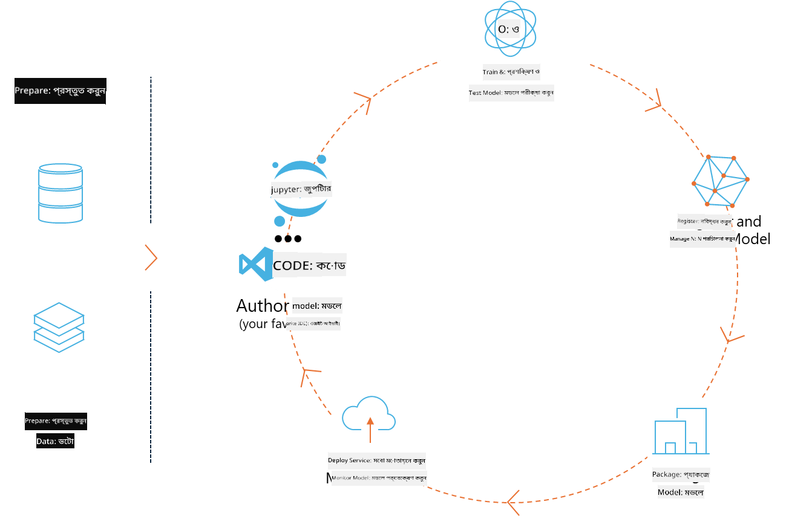
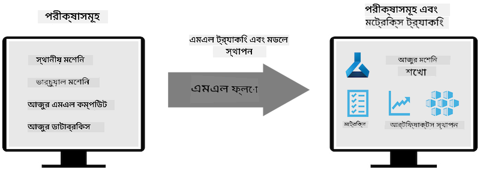
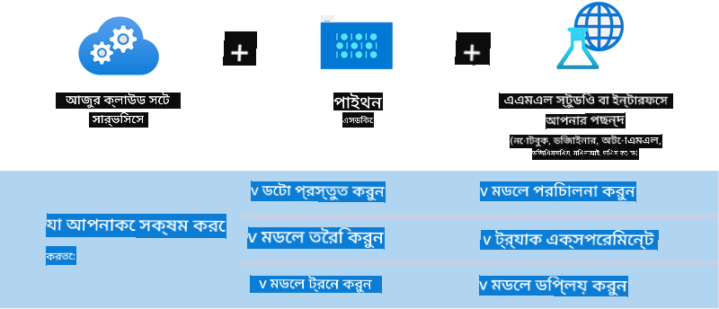

<!--
CO_OP_TRANSLATOR_METADATA:
{
  "original_hash": "f61c383bbf0c3dac97e43f833c258731",
  "translation_date": "2025-05-09T18:35:17+00:00",
  "source_file": "md/02.Application/01.TextAndChat/Phi3/E2E_Phi-3-MLflow.md",
  "language_code": "bn"
}
-->
# MLflow

[MLflow](https://mlflow.org/) একটি ওপেন-সোর্স প্ল্যাটফর্ম যা সম্পূর্ণ মেশিন লার্নিং লাইফসাইকেল পরিচালনার জন্য ডিজাইন করা হয়েছে।



MLFlow ব্যবহৃত হয় ML লাইফসাইকেল পরিচালনার জন্য, যার মধ্যে রয়েছে পরীক্ষা-নিরীক্ষা, পুনরুৎপাদন, ডিপ্লয়মেন্ট এবং একটি কেন্দ্রীয় মডেল রেজিস্ট্রি। MLFlow বর্তমানে চারটি উপাদান প্রদান করে।

- **MLflow Tracking:** পরীক্ষা-নিরীক্ষা, কোড, ডেটা কনফিগ এবং ফলাফল রেকর্ড এবং অনুসন্ধান করা।
- **MLflow Projects:** ডেটা সায়েন্স কোড এমন একটি ফরম্যাটে প্যাকেজ করা যা যেকোনো প্ল্যাটফর্মে রান পুনরুৎপাদন করতে সাহায্য করে।
- **Mlflow Models:** বিভিন্ন সার্ভিং পরিবেশে মেশিন লার্নিং মডেল ডিপ্লয় করা।
- **Model Registry:** মডেলগুলোকে কেন্দ্রীয় রিপোজিটরিতে সংরক্ষণ, অ্যানোটেশন এবং পরিচালনা করা।

এটি পরীক্ষা-নিরীক্ষা ট্র্যাকিং, কোড প্যাকেজিং এবং মডেল শেয়ার ও ডিপ্লয়মেন্টের ক্ষমতা অন্তর্ভুক্ত করে। MLFlow Databricks-এ ইন্টিগ্রেটেড এবং বিভিন্ন ML লাইব্রেরি সমর্থন করে, তাই এটি লাইব্রেরি-নিরপেক্ষ। এটি যেকোনো মেশিন লার্নিং লাইব্রেরি এবং যেকোনো প্রোগ্রামিং ভাষায় ব্যবহার করা যায়, কারণ এটি সুবিধার জন্য REST API এবং CLI প্রদান করে।



MLFlow এর প্রধান বৈশিষ্ট্যগুলো হলো:

- **Experiment Tracking:** প্যারামিটার এবং ফলাফল রেকর্ড ও তুলনা করা।
- **Model Management:** বিভিন্ন সার্ভিং এবং ইনফারেন্স প্ল্যাটফর্মে মডেল ডিপ্লয় করা।
- **Model Registry:** MLflow মডেলের লাইফসাইকেল একসাথে পরিচালনা করা, যার মধ্যে ভার্সনিং এবং অ্যানোটেশন অন্তর্ভুক্ত।
- **Projects:** ML কোড শেয়ার বা প্রোডাকশন ব্যবহারের জন্য প্যাকেজ করা।
MLFlow MLOps লুপকেও সমর্থন করে, যার মধ্যে ডেটা প্রস্তুতি, মডেল রেজিস্ট্রি ও ম্যানেজমেন্ট, মডেল প্যাকেজিং, সার্ভিস ডিপ্লয়মেন্ট এবং মডেল মনিটরিং অন্তর্ভুক্ত। এটি প্রোটোটাইপ থেকে প্রোডাকশন ওয়ার্কফ্লো পর্যন্ত যাওয়ার প্রক্রিয়া সহজতর করার লক্ষ্য রাখে, বিশেষ করে ক্লাউড এবং এজ পরিবেশে।

## E2E সিনারিও - একটি র‍্যাপার তৈরি করা এবং Phi-3 কে MLFlow মডেল হিসেবে ব্যবহার করা

এই E2E নমুনায় আমরা Phi-3 ছোট ভাষা মডেল (SLM) এর চারপাশে একটি র‍্যাপার তৈরি করার দুইটি ভিন্ন পদ্ধতি দেখাবো এবং তারপর এটি MLFlow মডেল হিসেবে লোকালি অথবা ক্লাউডে, যেমন Azure Machine Learning ওয়ার্কস্পেসে চালানো হবে।



| Project | বিবরণ | অবস্থান |
| ------------ | ----------- | -------- |
| Transformer Pipeline | HuggingFace মডেল MLFlow-এর পরীক্ষামূলক transformers flavor দিয়ে ব্যবহার করতে চাইলে Transformer Pipeline হল র‍্যাপার তৈরির সবচেয়ে সহজ উপায়। | [**TransformerPipeline.ipynb**](../../../../../../code/06.E2E/E2E_Phi-3-MLflow_TransformerPipeline.ipynb) |
| Custom Python Wrapper | লেখার সময়, transformer pipeline MLFlow র‍্যাপার জেনারেশনকে ONNX ফরম্যাটের HuggingFace মডেলের জন্য সমর্থন করত না, এমনকি পরীক্ষামূলক optimum Python প্যাকেজ থাকলেও। এরকম ক্ষেত্রে, আপনি MLFlow মোডের জন্য কাস্টম Python র‍্যাপার তৈরি করতে পারেন। | [**CustomPythonWrapper.ipynb**](../../../../../../code/06.E2E/E2E_Phi-3-MLflow_CustomPythonWrapper.ipynb) |

## Project: Transformer Pipeline

1. MLFlow এবং HuggingFace থেকে প্রাসঙ্গিক Python প্যাকেজগুলো দরকার হবে:

    ``` Python
    import mlflow
    import transformers
    ```

2. এরপর, HuggingFace রেজিস্ট্রিতে টার্গেট Phi-3 মডেলটি উল্লেখ করে transformer pipeline শুরু করতে হবে। _Phi-3-mini-4k-instruct_ এর মডেল কার্ড থেকে দেখা যায়, এর কাজ “Text Generation” ধরনের:

    ``` Python
    pipeline = transformers.pipeline(
        task = "text-generation",
        model = "microsoft/Phi-3-mini-4k-instruct"
    )
    ```

3. এখন আপনি আপনার Phi-3 মডেলের transformer pipeline MLFlow ফরম্যাটে সেভ করতে পারেন এবং অতিরিক্ত বিবরণ দিতে পারেন যেমন টার্গেট আর্টিফ্যাক্টস পাথ, নির্দিষ্ট মডেল কনফিগারেশন সেটিংস এবং ইনফারেন্স API টাইপ:

    ``` Python
    model_info = mlflow.transformers.log_model(
        transformers_model = pipeline,
        artifact_path = "phi3-mlflow-model",
        model_config = model_config,
        task = "llm/v1/chat"
    )
    ```

## Project: Custom Python Wrapper

1. এখানে আমরা Microsoft এর [ONNX Runtime generate() API](https://github.com/microsoft/onnxruntime-genai) ব্যবহার করতে পারি ONNX মডেলের ইনফারেন্স এবং টোকেন এনকোডিং/ডিকোডিং এর জন্য। আপনার টার্গেট কম্পিউটের জন্য _onnxruntime_genai_ প্যাকেজ নির্বাচন করতে হবে, নিচের উদাহরণে CPU টার্গেট করা হয়েছে:

    ``` Python
    import mlflow
    from mlflow.models import infer_signature
    import onnxruntime_genai as og
    ```

1. আমাদের কাস্টম ক্লাস দুটি মেথড ইমপ্লিমেন্ট করে: _load_context()_ যা Phi-3 Mini 4K Instruct এর **ONNX মডেল**, **জেনারেটর প্যারামিটার** এবং **টোকেনাইজার** ইনিশিয়ালাইজ করে; এবং _predict()_ যা প্রদত্ত প্রম্পটের জন্য আউটপুট টোকেন তৈরি করে:

    ``` Python
    class Phi3Model(mlflow.pyfunc.PythonModel):
        def load_context(self, context):
            # Retrieving model from the artifacts
            model_path = context.artifacts["phi3-mini-onnx"]
            model_options = {
                 "max_length": 300,
                 "temperature": 0.2,         
            }
        
            # Defining the model
            self.phi3_model = og.Model(model_path)
            self.params = og.GeneratorParams(self.phi3_model)
            self.params.set_search_options(**model_options)
            
            # Defining the tokenizer
            self.tokenizer = og.Tokenizer(self.phi3_model)
    
        def predict(self, context, model_input):
            # Retrieving prompt from the input
            prompt = model_input["prompt"][0]
            self.params.input_ids = self.tokenizer.encode(prompt)
    
            # Generating the model's response
            response = self.phi3_model.generate(self.params)
    
            return self.tokenizer.decode(response[0][len(self.params.input_ids):])
    ```

1. এখন আপনি _mlflow.pyfunc.log_model()_ ফাংশন ব্যবহার করে Phi-3 মডেলের জন্য একটি কাস্টম Python র‍্যাপার (pickle ফরম্যাটে) তৈরি করতে পারেন, মূল ONNX মডেল এবং প্রয়োজনীয় ডিপেন্ডেন্সিসহ:

    ``` Python
    model_info = mlflow.pyfunc.log_model(
        artifact_path = artifact_path,
        python_model = Phi3Model(),
        artifacts = {
            "phi3-mini-onnx": "cpu_and_mobile/cpu-int4-rtn-block-32-acc-level-4",
        },
        input_example = input_example,
        signature = infer_signature(input_example, ["Run"]),
        extra_pip_requirements = ["torch", "onnxruntime_genai", "numpy"],
    )
    ```

## জেনারেট হওয়া MLFlow মডেলের সিগনেচার

1. উপরের Transformer Pipeline প্রকল্পের ধাপ ৩-এ, আমরা MLFlow মডেলের টাস্ক “_llm/v1/chat_” সেট করেছি। এই নির্দেশনা OpenAI এর Chat API এর সাথে সামঞ্জস্যপূর্ণ একটি মডেলের API র‍্যাপার তৈরি করে, নিচের মতো:

    ``` Python
    {inputs: 
      ['messages': Array({content: string (required), name: string (optional), role: string (required)}) (required), 'temperature': double (optional), 'max_tokens': long (optional), 'stop': Array(string) (optional), 'n': long (optional), 'stream': boolean (optional)],
    outputs: 
      ['id': string (required), 'object': string (required), 'created': long (required), 'model': string (required), 'choices': Array({finish_reason: string (required), index: long (required), message: {content: string (required), name: string (optional), role: string (required)} (required)}) (required), 'usage': {completion_tokens: long (required), prompt_tokens: long (required), total_tokens: long (required)} (required)],
    params: 
      None}
    ```

1. ফলস্বরূপ, আপনি নিম্নলিখিত ফরম্যাটে আপনার প্রম্পট সাবমিট করতে পারবেন:

    ``` Python
    messages = [{"role": "user", "content": "What is the capital of Spain?"}]
    ```

1. তারপর, OpenAI API-সামঞ্জস্যপূর্ণ পোস্ট-প্রসেসিং ব্যবহার করুন, যেমন _response[0][‘choices’][0][‘message’][‘content’]_, যাতে আউটপুট সুন্দর করে তোলা যায়:

    ``` JSON
    Question: What is the capital of Spain?
    
    Answer: The capital of Spain is Madrid. It is the largest city in Spain and serves as the political, economic, and cultural center of the country. Madrid is located in the center of the Iberian Peninsula and is known for its rich history, art, and architecture, including the Royal Palace, the Prado Museum, and the Plaza Mayor.
    
    Usage: {'prompt_tokens': 11, 'completion_tokens': 73, 'total_tokens': 84}
    ```

1. উপরের Custom Python Wrapper প্রকল্পের ধাপ ৩-এ, আমরা MLFlow প্যাকেজকে একটি প্রদত্ত ইনপুট উদাহরণ থেকে মডেলের সিগনেচার জেনারেট করতে দিয়েছি। আমাদের MLFlow র‍্যাপারের সিগনেচার এরকম হবে:

    ``` Python
    {inputs: 
      ['prompt': string (required)],
    outputs: 
      [string (required)],
    params: 
      None}
    ```

1. তাই, আমাদের প্রম্পটে "prompt" ডিকশনারি কী থাকতে হবে, নিচের মতো:

    ``` Python
    {"prompt": "<|system|>You are a stand-up comedian.<|end|><|user|>Tell me a joke about atom<|end|><|assistant|>",}
    ```

1. মডেলের আউটপুট তখন স্ট্রিং ফরম্যাটে প্রদান করা হবে:

    ``` JSON
    Alright, here's a little atom-related joke for you!
    
    Why don't electrons ever play hide and seek with protons?
    
    Because good luck finding them when they're always "sharing" their electrons!
    
    Remember, this is all in good fun, and we're just having a little atomic-level humor!
    ```

**অস্বীকৃতি**:  
এই নথিটি AI অনুবাদ সেবা [Co-op Translator](https://github.com/Azure/co-op-translator) ব্যবহার করে অনূদিত হয়েছে। আমরা যথাসাধ্য সঠিকতার চেষ্টা করি, তবে স্বয়ংক্রিয় অনুবাদে ত্রুটি বা অসঙ্গতি থাকতে পারে। মূল নথিটি তার নিজস্ব ভাষায় কর্তৃপক্ষের উৎস হিসেবে বিবেচনা করা উচিত। গুরুত্বপূর্ণ তথ্যের জন্য পেশাদার মানব অনুবাদ সুপারিশ করা হয়। এই অনুবাদের ব্যবহার থেকে সৃষ্ট কোনো ভুল বোঝাবুঝি বা ভুল ব্যাখ্যার জন্য আমরা দায়বদ্ধ নই।