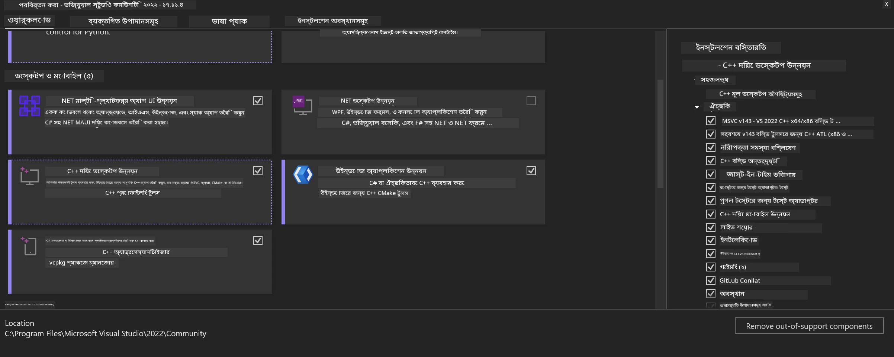
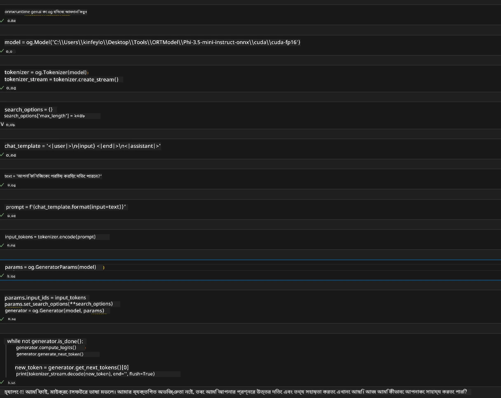
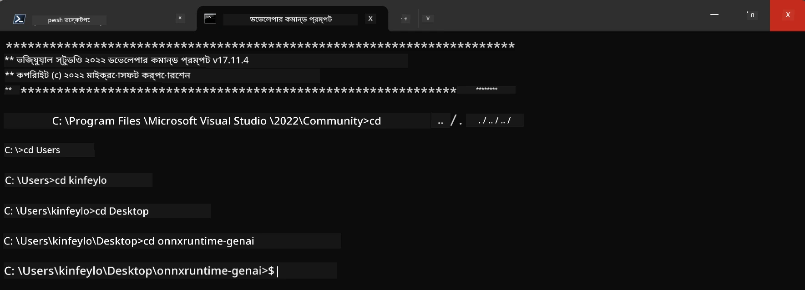

<!--
CO_OP_TRANSLATOR_METADATA:
{
  "original_hash": "b066fc29c1b2129df84e027cb75119ce",
  "translation_date": "2025-07-17T02:41:20+00:00",
  "source_file": "md/02.Application/01.TextAndChat/Phi3/ORTWindowGPUGuideline.md",
  "language_code": "bn"
}
-->
# **OnnxRuntime GenAI Windows GPU এর জন্য নির্দেশিকা**

এই নির্দেশিকাটি Windows-এ GPU সহ ONNX Runtime (ORT) সেটআপ এবং ব্যবহারের ধাপগুলো প্রদান করে। এটি আপনার মডেলগুলোর জন্য GPU ত্বরান্বিতকরণ ব্যবহার করে পারফরম্যান্স এবং দক্ষতা উন্নত করতে সাহায্য করবে।

এই ডকুমেন্টে নিম্নলিখিত বিষয়ে নির্দেশনা রয়েছে:

- পরিবেশ সেটআপ: CUDA, cuDNN, এবং ONNX Runtime এর মতো প্রয়োজনীয় ডিপেন্ডেন্সি ইনস্টল করার নির্দেশনা।
- কনফিগারেশন: GPU রিসোর্স কার্যকরভাবে ব্যবহার করার জন্য পরিবেশ এবং ONNX Runtime কিভাবে কনফিগার করবেন।
- অপ্টিমাইজেশন টিপস: সর্বোত্তম পারফরম্যান্সের জন্য GPU সেটিংস কিভাবে ফাইন-টিউন করবেন তার পরামর্শ।

### **1. Python 3.10.x /3.11.8**

   ***Note*** আপনার Python পরিবেশ হিসেবে [miniforge](https://github.com/conda-forge/miniforge/releases/latest/download/Miniforge3-Windows-x86_64.exe) ব্যবহার করার পরামর্শ দেওয়া হয়

   ```bash

   conda create -n pydev python==3.11.8

   conda activate pydev

   ```

   ***Reminder*** যদি আপনি Python ONNX লাইব্রেরি ইনস্টল করে থাকেন, তাহলে সেটি আনইনস্টল করুন

### **2. winget দিয়ে CMake ইনস্টল করুন**


   ```bash

   winget install -e --id Kitware.CMake

   ```

### **3. Visual Studio 2022 - Desktop Development with C++ ইনস্টল করুন**

   ***Note*** যদি আপনি কম্পাইল করতে না চান, তাহলে এই ধাপটি স্কিপ করতে পারেন




### **4. NVIDIA ড্রাইভার ইনস্টল করুন**

1. **NVIDIA GPU Driver**  [https://www.nvidia.com/en-us/drivers/](https://www.nvidia.com/en-us/drivers/)

2. **NVIDIA CUDA 12.4** [https://developer.nvidia.com/cuda-12-4-0-download-archive](https://developer.nvidia.com/cuda-12-4-0-download-archive)

3. **NVIDIA CUDNN 9.4**  [https://developer.nvidia.com/cudnn-downloads](https://developer.nvidia.com/cudnn-downloads)

***Reminder*** ইনস্টলেশনের সময় ডিফল্ট সেটিংস ব্যবহার করুন

### **5. NVIDIA পরিবেশ সেট করুন**

NVIDIA CUDNN 9.4 এর lib, bin, include ফাইলগুলো NVIDIA CUDA 12.4 এর lib, bin, include ফোল্ডারে কপি করুন

- *'C:\Program Files\NVIDIA\CUDNN\v9.4\bin\12.6'* এর ফাইলগুলো *'C:\Program Files\NVIDIA GPU Computing Toolkit\CUDA\v12.4\bin'* এ কপি করুন

- *'C:\Program Files\NVIDIA\CUDNN\v9.4\include\12.6'* এর ফাইলগুলো *'C:\Program Files\NVIDIA GPU Computing Toolkit\CUDA\v12.4\include'* এ কপি করুন

- *'C:\Program Files\NVIDIA\CUDNN\v9.4\lib\12.6'* এর ফাইলগুলো *'C:\Program Files\NVIDIA GPU Computing Toolkit\CUDA\v12.4\lib\x64'* এ কপি করুন


### **6. Phi-3.5-mini-instruct-onnx ডাউনলোড করুন**


   ```bash

   winget install -e --id Git.Git

   winget install -e --id GitHub.GitLFS

   git lfs install

   git clone https://huggingface.co/microsoft/Phi-3.5-mini-instruct-onnx

   ```

### **7. InferencePhi35Instruct.ipynb চালান**

   [Notebook](../../../../../../code/09.UpdateSamples/Aug/ortgpu-phi35-instruct.ipynb) খুলে এক্সিকিউট করুন





### **8. ORT GenAI GPU কম্পাইল করুন**


   ***Note*** 
   
   1. প্রথমে onnx, onnxruntime এবং onnxruntime-genai সম্পর্কিত সবকিছু আনইনস্টল করুন

   
   ```bash

   pip list 
   
   ```

   তারপর সব onnxruntime লাইব্রেরি আনইনস্টল করুন, যেমন 


   ```bash

   pip uninstall onnxruntime

   pip uninstall onnxruntime-genai

   pip uninstall onnxruntume-genai-cuda
   
   ```

   2. Visual Studio Extension সাপোর্ট চেক করুন

   C:\Program Files\NVIDIA GPU Computing Toolkit\CUDA\v12.4\extras ফোল্ডারে যান এবং নিশ্চিত করুন C:\Program Files\NVIDIA GPU Computing Toolkit\CUDA\v12.4\extras\visual_studio_integration ফোল্ডারটি আছে। 
   
   যদি না থাকে, অন্য CUDA টুলকিট ড্রাইভার ফোল্ডারগুলো চেক করুন এবং visual_studio_integration ফোল্ডার ও এর কনটেন্টগুলো C:\Program Files\NVIDIA GPU Computing Toolkit\CUDA\v12.4\extras\visual_studio_integration এ কপি করুন


   - যদি আপনি কম্পাইল করতে না চান, তাহলে এই ধাপটি স্কিপ করতে পারেন


   ```bash

   git clone https://github.com/microsoft/onnxruntime-genai

   ```

   - [https://github.com/microsoft/onnxruntime/releases/download/v1.19.2/onnxruntime-win-x64-gpu-1.19.2.zip](https://github.com/microsoft/onnxruntime/releases/download/v1.19.2/onnxruntime-win-x64-gpu-1.19.2.zip) থেকে ডাউনলোড করুন

   - onnxruntime-win-x64-gpu-1.19.2.zip আনজিপ করুন, এবং ফোল্ডারটির নাম **ort** করুন, তারপর ort ফোল্ডারটি onnxruntime-genai তে কপি করুন

   - Windows Terminal ব্যবহার করে VS 2022 এর Developer Command Prompt এ যান এবং onnxruntime-genai ফোল্ডারে যান



   - আপনার Python পরিবেশ দিয়ে এটি কম্পাইল করুন

   
   ```bash

   cd onnxruntime-genai

   python build.py --use_cuda  --cuda_home "C:\Program Files\NVIDIA GPU Computing Toolkit\CUDA\v12.4" --config Release
 

   cd build/Windows/Release/Wheel

   pip install .whl

   ```

**অস্বীকৃতি**:  
এই নথিটি AI অনুবাদ সেবা [Co-op Translator](https://github.com/Azure/co-op-translator) ব্যবহার করে অনূদিত হয়েছে। আমরা যথাসাধ্য সঠিকতার চেষ্টা করি, তবে স্বয়ংক্রিয় অনুবাদে ত্রুটি বা অসঙ্গতি থাকতে পারে। মূল নথিটি তার নিজস্ব ভাষায়ই কর্তৃত্বপূর্ণ উৎস হিসেবে বিবেচিত হওয়া উচিত। গুরুত্বপূর্ণ তথ্যের জন্য পেশাদার মানব অনুবাদ গ্রহণ করার পরামর্শ দেওয়া হয়। এই অনুবাদের ব্যবহারে সৃষ্ট কোনো ভুল বোঝাবুঝি বা ভুল ব্যাখ্যার জন্য আমরা দায়ী নই।