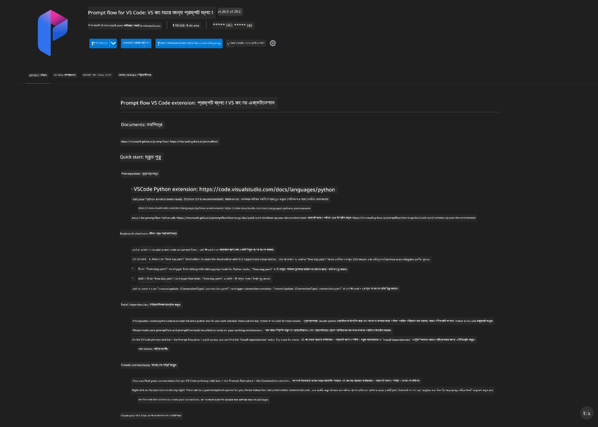
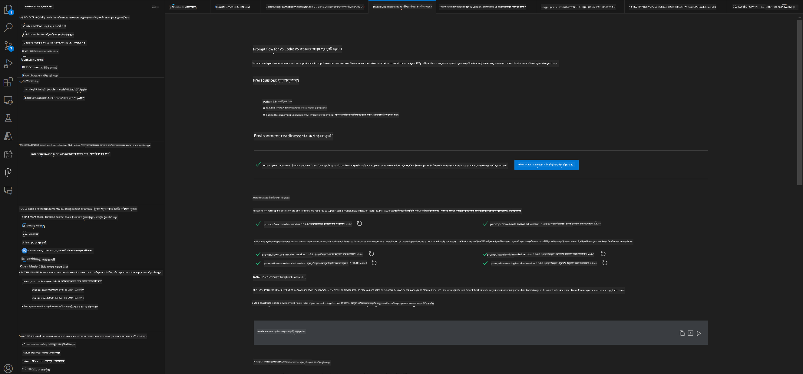
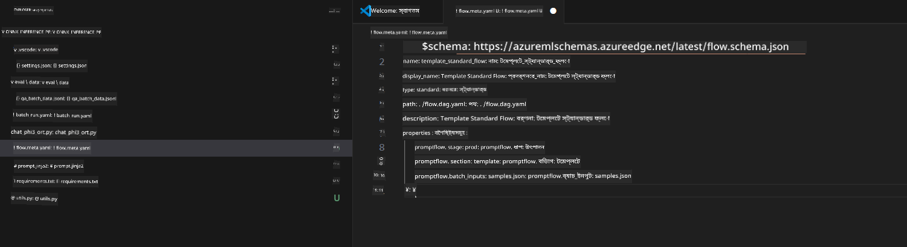
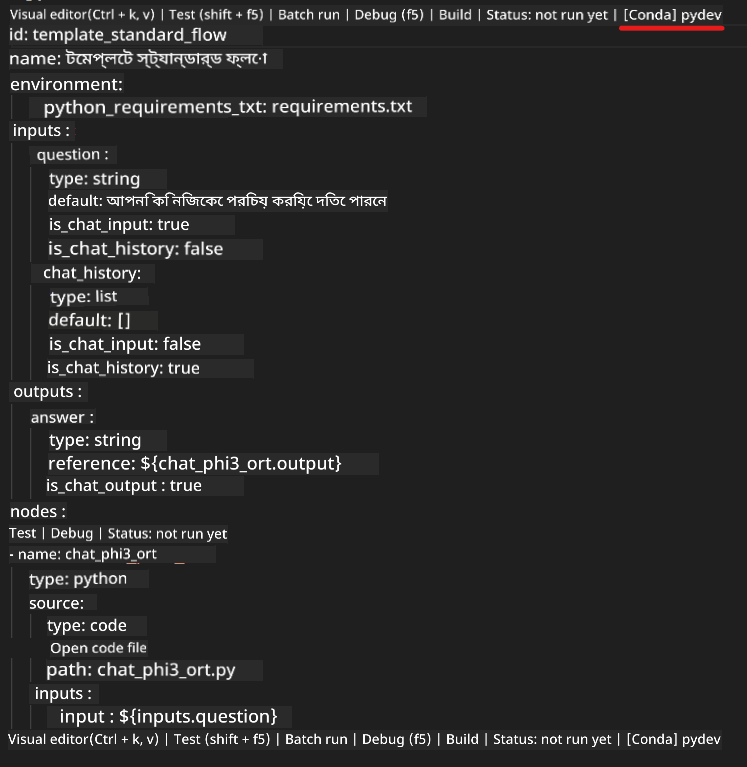
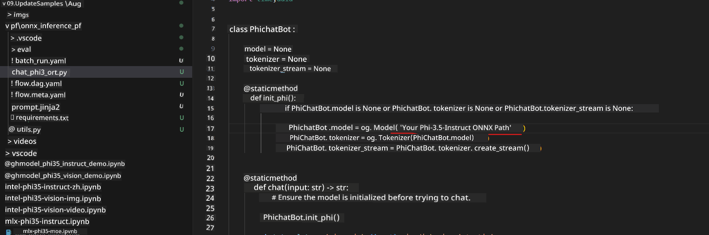
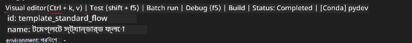
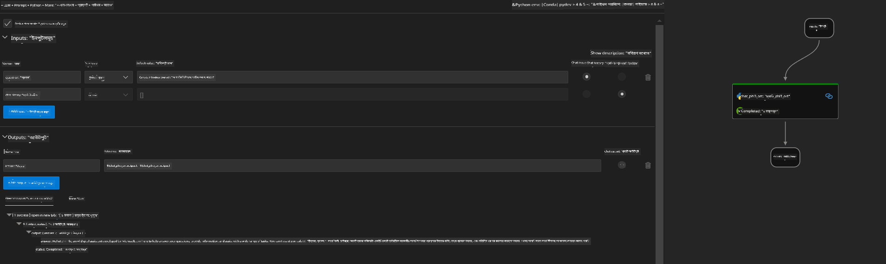
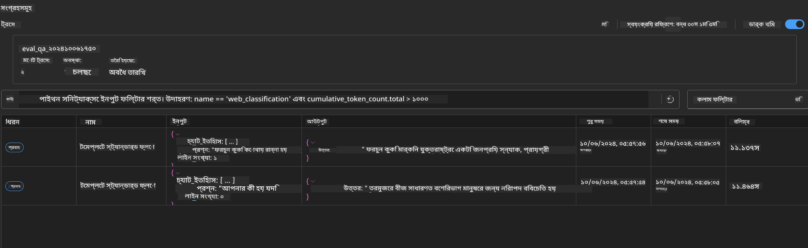

<!--
CO_OP_TRANSLATOR_METADATA:
{
  "original_hash": "92e7dac1e5af0dd7c94170fdaf6860fe",
  "translation_date": "2025-05-09T18:51:28+00:00",
  "source_file": "md/02.Application/01.TextAndChat/Phi3/UsingPromptFlowWithONNX.md",
  "language_code": "bn"
}
-->
# Windows GPU ব্যবহার করে Phi-3.5-Instruct ONNX সহ Prompt flow সলিউশন তৈরি করা

নিম্নলিখিত ডকুমেন্টটি Phi-3 মডেলের ভিত্তিতে AI অ্যাপ্লিকেশন তৈরি করার জন্য ONNX (Open Neural Network Exchange) সহ PromptFlow ব্যবহারের একটি উদাহরণ।

PromptFlow হলো একটি ডেভেলপমেন্ট টুলসের স্যুট যা LLM-ভিত্তিক (Large Language Model) AI অ্যাপ্লিকেশনের সম্পূর্ণ ডেভেলপমেন্ট সাইকেলকে সহজতর করার জন্য ডিজাইন করা হয়েছে, আইডিয়া তৈরি, প্রোটোটাইপিং থেকে শুরু করে টেস্টিং এবং মূল্যায়ন পর্যন্ত।

PromptFlow কে ONNX এর সাথে ইন্টিগ্রেট করে ডেভেলপাররা করতে পারেন:

- মডেলের পারফরম্যান্স অপটিমাইজ করা: ONNX ব্যবহার করে মডেলের ইনফারেন্স এবং ডিপ্লয়মেন্ট কার্যকর করা।
- ডেভেলপমেন্ট সহজ করা: PromptFlow ব্যবহার করে ওয়ার্কফ্লো ম্যানেজ এবং পুনরাবৃত্তিমূলক কাজ অটোমেট করা।
- সহযোগিতা বৃদ্ধি করা: টিম মেম্বারদের মধ্যে উন্নত সহযোগিতার জন্য একটি একক ডেভেলপমেন্ট পরিবেশ প্রদান।

**Prompt flow** হলো একটি ডেভেলপমেন্ট টুলসের স্যুট যা LLM-ভিত্তিক AI অ্যাপ্লিকেশনের সম্পূর্ণ ডেভেলপমেন্ট সাইকেলকে সহজতর করার জন্য ডিজাইন করা হয়েছে, আইডিয়া তৈরি, প্রোটোটাইপিং, টেস্টিং, মূল্যায়ন থেকে প্রোডাকশন ডিপ্লয়মেন্ট এবং মনিটরিং পর্যন্ত। এটি প্রম্পট ইঞ্জিনিয়ারিংকে অনেক সহজ করে এবং আপনাকে প্রোডাকশন মানের LLM অ্যাপ তৈরি করতে সক্ষম করে।

Prompt flow OpenAI, Azure OpenAI Service, এবং কাস্টমাইজযোগ্য মডেলগুলো (Huggingface, লোকাল LLM/SLM) এর সাথে সংযুক্ত হতে পারে। আমরা Phi-3.5 এর কোয়ান্টাইজড ONNX মডেল লোকাল অ্যাপ্লিকেশনে ডিপ্লয় করার আশা করছি। Prompt flow আমাদের ব্যবসা পরিকল্পনা উন্নত করতে এবং Phi-3.5 ভিত্তিক লোকাল সলিউশন সম্পন্ন করতে সাহায্য করবে। এই উদাহরণে, আমরা ONNX Runtime GenAI লাইব্রেরি ব্যবহার করে Windows GPU ভিত্তিক Prompt flow সলিউশন সম্পন্ন করব।

## **ইনস্টলেশন**

### **Windows GPU এর জন্য ONNX Runtime GenAI**

Windows GPU এর জন্য ONNX Runtime GenAI সেটআপ করার নির্দেশিকা পড়তে [এখানে ক্লিক করুন](./ORTWindowGPUGuideline.md)

### **VSCode এ Prompt flow সেটআপ করা**

1. Prompt flow VS Code এক্সটেনশন ইনস্টল করুন



2. Prompt flow VS Code এক্সটেনশন ইনস্টল করার পর, এক্সটেনশন ক্লিক করুন এবং **Installation dependencies** নির্বাচন করুন, নির্দেশিকা অনুসারে আপনার এনভায়রনমেন্টে Prompt flow SDK ইনস্টল করুন



3. [Sample Code](../../../../../../code/09.UpdateSamples/Aug/pf/onnx_inference_pf) ডাউনলোড করুন এবং VS Code দিয়ে এই স্যাম্পলটি খুলুন



4. **flow.dag.yaml** খুলে আপনার Python এনভায়রনমেন্ট নির্বাচন করুন



   **chat_phi3_ort.py** খুলে আপনার Phi-3.5-instruct ONNX মডেলের লোকেশন পরিবর্তন করুন



5. আপনার prompt flow চালিয়ে টেস্ট করুন

**flow.dag.yaml** খুলে visual editor এ ক্লিক করুন



ক্লিক করার পর, রান করে টেস্ট করুন



1. টার্মিনালে ব্যাচ রান করে আরও ফলাফল পরীক্ষা করতে পারেন


```bash

pf run create --file batch_run.yaml --stream --name 'Your eval qa name'    

```

আপনি আপনার ডিফল্ট ব্রাউজারে ফলাফল দেখতে পারবেন




**অস্বীকৃতি**:  
এই নথিটি AI অনুবাদ সেবা [Co-op Translator](https://github.com/Azure/co-op-translator) ব্যবহার করে অনূদিত হয়েছে। আমরা সঠিকতার জন্য চেষ্টা করি, তবে অনুগ্রহ করে লক্ষ্য করুন যে স্বয়ংক্রিয় অনুবাদে ভুল বা অসঙ্গতি থাকতে পারে। মূল নথিটি তার নিজস্ব ভাষায়ই কর্তৃত্বপূর্ণ উৎস হিসেবে বিবেচিত হওয়া উচিত। গুরুত্বপূর্ণ তথ্যের জন্য পেশাদার মানব অনুবাদের পরামর্শ দেওয়া হয়। এই অনুবাদের ব্যবহার থেকে সৃষ্ট কোনো ভুল বোঝাবুঝি বা ভুল ব্যাখ্যার জন্য আমরা দায়ী নই।