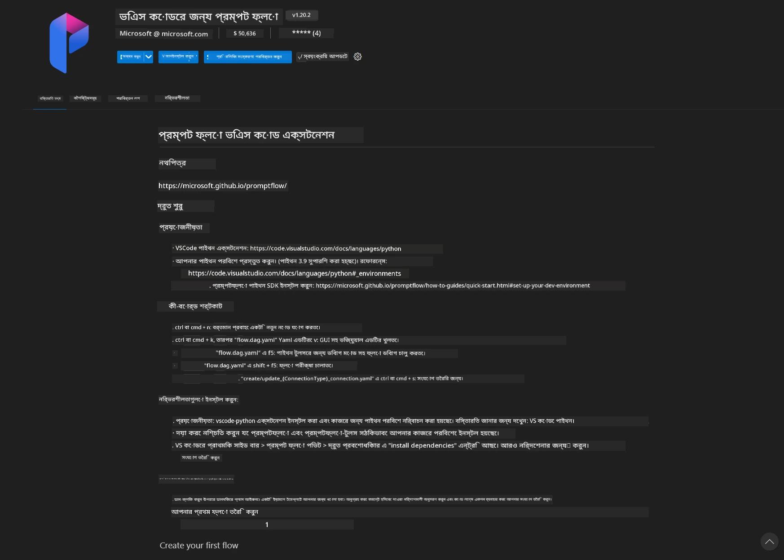
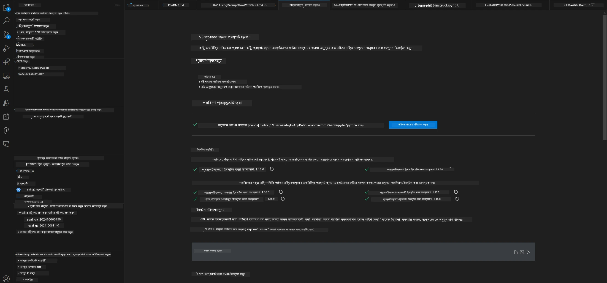
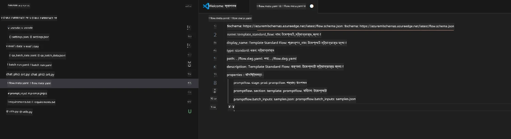
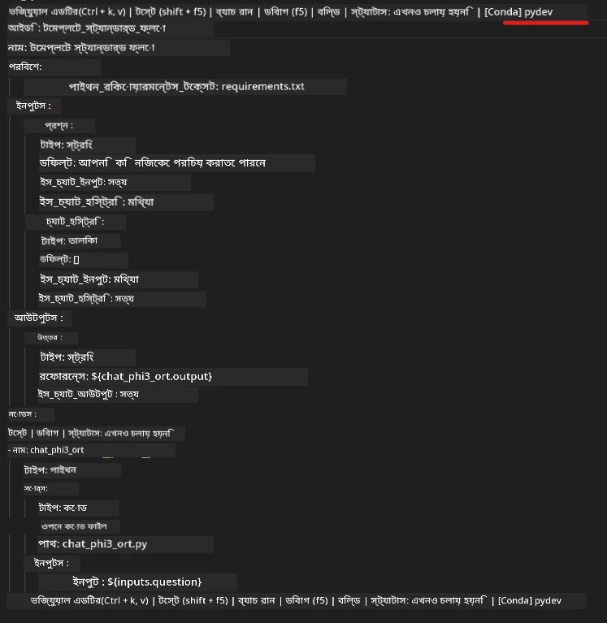
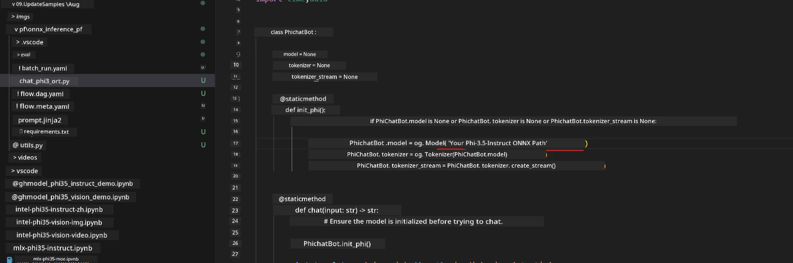
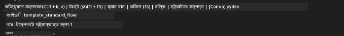
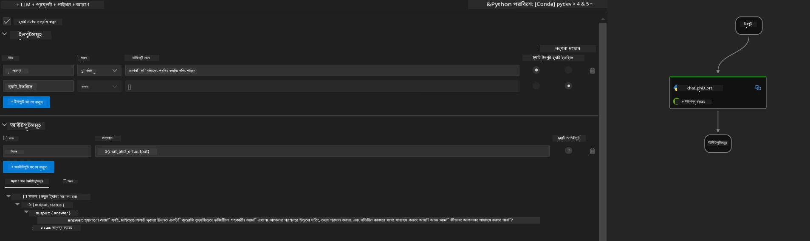
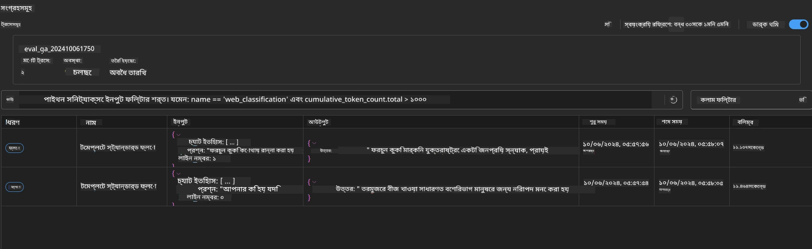

# Windows GPU ব্যবহার করে Phi-3.5-Instruct ONNX সহ Prompt flow সমাধান তৈরি করা

নিম্নলিখিত ডকুমেন্টটি Phi-3 মডেল ভিত্তিক AI অ্যাপ্লিকেশন উন্নয়নের জন্য ONNX (Open Neural Network Exchange) সহ PromptFlow কীভাবে ব্যবহার করবেন তার একটি উদাহরণ।

PromptFlow হল একটি উন্নয়ন সরঞ্জামের স্যুট যা LLM-ভিত্তিক (Large Language Model) AI অ্যাপ্লিকেশনগুলির আইডিয়া থেকে প্রোটোটাইপিং এবং পরীক্ষণ এবং মূল্যায়ন পর্যন্ত শেষ থেকে শেষ উন্নয়ন চক্র সহজ করার জন্য ডিজাইন করা হয়েছে।

PromptFlow কে ONNX এর সাথে সংযুক্ত করে, ডেভেলপাররা করতে পারেন:

- মডেল পারফরম্যান্স অপ্টিমাইজ করুন: দক্ষ মডেল ইনফারেন্স এবং ডিপ্লয়মেন্টের জন্য ONNX ব্যবহার করুন।
- উন্নয়ন সহজ করুন: ওয়ার্কফ্লো পরিচালনা এবং পুনরাবৃত্তি কাজ স্বয়ংক্রিয় করার জন্য PromptFlow ব্যবহার করুন।
- সহযোগিতা বাড়ান: একটি ঐকমত্যবদ্ধ উন্নয়ন পরিবেশ প্রদান করে দলের সদস্যদের মধ্যে ভাল সহযোগিতা সহজ করুন।

**Prompt flow** হল একটি উন্নয়ন সরঞ্জামের স্যুট যা LLM-ভিত্তিক AI অ্যাপ্লিকেশনগুলির আইডিয়া, প্রোটোটাইপিং, পরীক্ষণ, মূল্যায়ন থেকে উৎপাদন ডিপ্লয়মেন্ট এবং মনিটরিং পর্যন্ত শেষ থেকে শেষ উন্নয়ন চক্র সহজ করার জন্য ডিজাইন করা হয়েছে। এটি প্রম্পট ইঞ্জিনিয়ারিং অনেক সহজ করে তোলে এবং আপনাকে উৎপাদন মানের সঙ্গে LLM অ্যাপ তৈরি করতে সক্ষম করে।

Prompt flow OpenAI, Azure OpenAI Service, এবং কাস্টমাইজযোগ্য মডেল (Huggingface, লোকাল LLM/SLM) এর সাথে সংযোগ করতে পারে। আমরা আশা করি Phi-3.5 এর কোয়ান্টাইজড ONNX মডেল লোকাল অ্যাপ্লিকেশনগুলিতে ডিপ্লয় করব। Prompt flow আমাদের ব্যবসা আরও ভাল পরিকল্পনা করতে এবং Phi-3.5 ভিত্তিক লোকাল সমাধানগুলি সম্পূর্ণ করতে সাহায্য করতে পারে। এই উদাহরণে, আমরা ONNX Runtime GenAI লাইব্রেরি একত্রিত করে Windows GPU ভিত্তিক Prompt flow সমাধান সম্পূর্ণ করব।

## **ইনস্টলেশন**

### **Windows GPU এর জন্য ONNX Runtime GenAI**

Windows GPU এর জন্য ONNX Runtime GenAI সেট করতে এই নির্দেশিকা পড়ুন [click here](./ORTWindowGPUGuideline.md)

### **VSCode এ Prompt flow সেট আপ করুন**

1. Prompt flow VS Code Extension ইনস্টল করুন



2. Prompt flow VS Code Extension ইনস্টল করার পরে, এক্সটেনশনটি ক্লিক করুন, এবং **Installation dependencies** নির্বাচন করুন, এই নির্দেশিকা অনুসরণ করে আপনার পরিবেশে Prompt flow SDK ইনস্টল করুন



3. [Sample Code](../../../../../../code/09.UpdateSamples/Aug/pf/onnx_inference_pf) ডাউনলোড করুন এবং VS Code দিয়ে এই স্যাম্পল খুলুন



4. আপনার Python পরিবেশ নির্বাচন করতে **flow.dag.yaml** খুলুন



   আপনার Phi-3.5-instruct ONNX মডেল অবস্থান পরিবর্তন করার জন্য **chat_phi3_ort.py** খুলুন



5. আপনার prompt flow টেস্ট করার জন্য রান করুন

**flow.dag.yaml** খুলুন এবং ভিজ্যুয়াল এডিটর ক্লিক করুন



এটি ক্লিক করার পর, টেস্ট করার জন্য রান করুন



1. আপনি টার্মিনালে ব্যাচ রান করে আরও ফলাফল পরীক্ষা করতে পারেন


```bash

pf run create --file batch_run.yaml --stream --name 'Your eval qa name'    

```

আপনি আপনার ডিফল্ট ব্রাউজারে ফলাফল পরীক্ষা করতে পারেন




---

<!-- CO-OP TRANSLATOR DISCLAIMER START -->
**অস্বীকৃতি**:
এই নথিটি AI অনুবাদ পরিষেবা [Co-op Translator](https://github.com/Azure/co-op-translator) ব্যবহার করে অনূদিত হয়েছে। যদিও আমরা শুদ্ধতার জন্য চেষ্টা করি, অনুগ্রহ করে মনে রাখবেন যে স্বয়ংক্রিয় অনুবাদে ত্রুটি বা অসঙ্গতি থাকতে পারে। মূল নথিটি তার স্বভাষায় কর্তৃত্বপূর্ণ উৎস হিসেবে বিবেচিত হওয়া উচিত। গুরুত্বপূর্ণ তথ্যের জন্য পেশাদার মানব অনুবাদ সুপারিশ করা হয়। এই অনুবাদের ব্যবহারে প্রয়োজনীয় ভুল বোঝাবুঝি বা ভুল ব্যাখ্যার জন্য আমরা দায়বদ্ধ নই।
<!-- CO-OP TRANSLATOR DISCLAIMER END -->