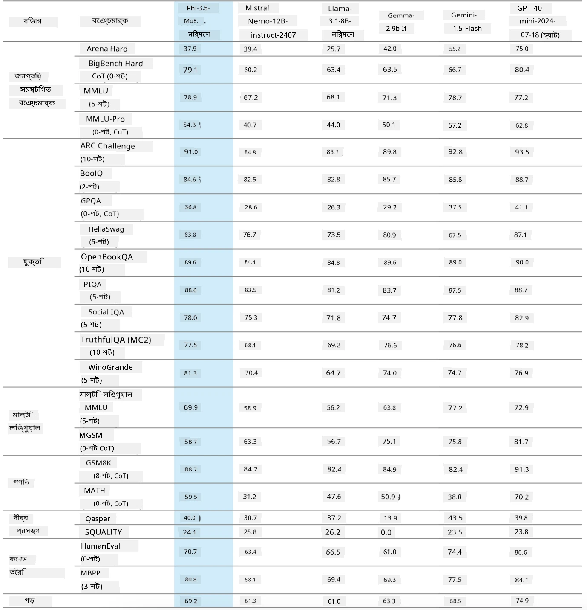
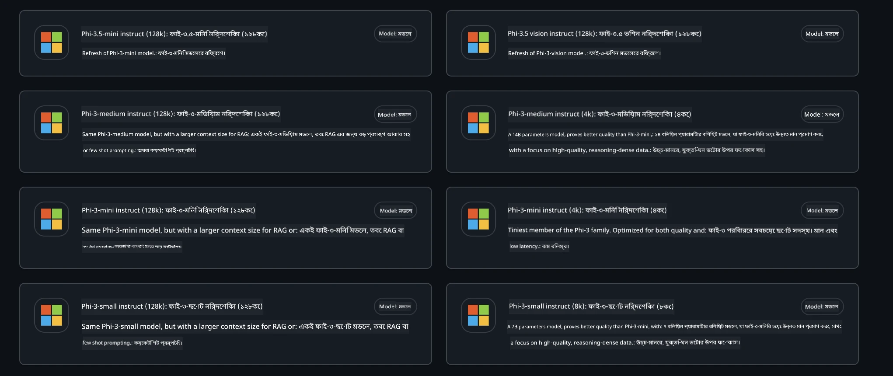
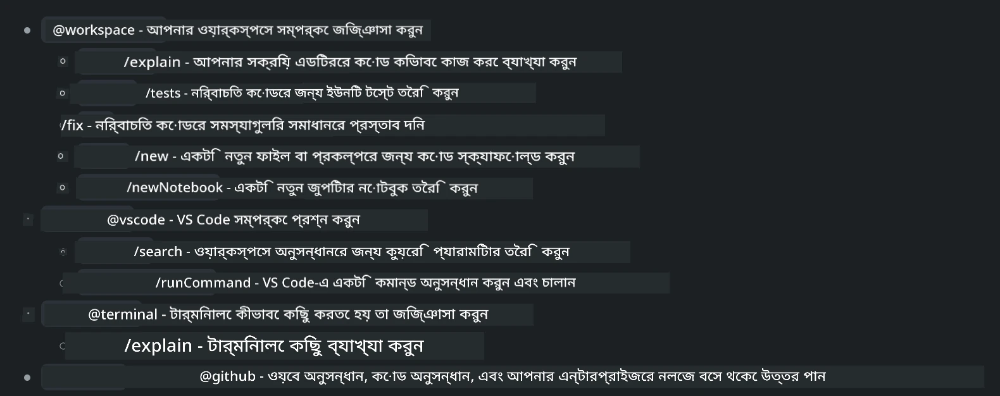
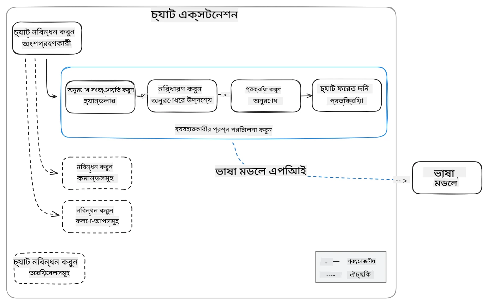
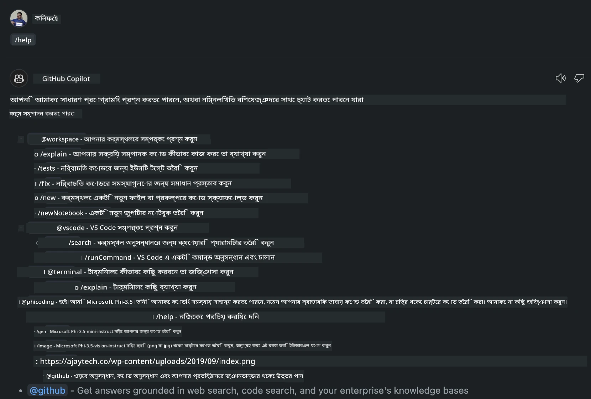
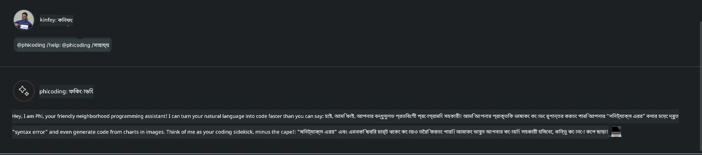
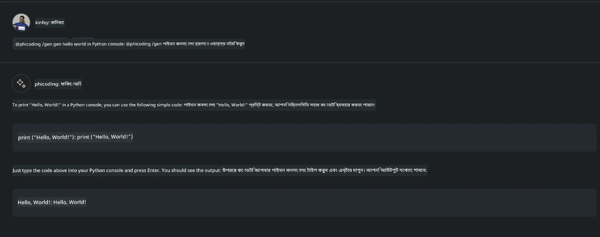
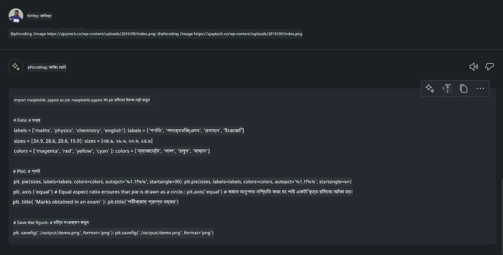

# **GitHub Models-এর Phi-3.5 দিয়ে নিজের Visual Studio Code Chat Copilot Agent তৈরি করুন**

আপনি কি Visual Studio Code Copilot ব্যবহার করছেন? বিশেষ করে Chat-এ, আপনি বিভিন্ন এজেন্ট ব্যবহার করে Visual Studio Code-এ প্রজেক্ট তৈরি, লেখা এবং রক্ষণাবেক্ষণের ক্ষমতা উন্নত করতে পারেন। Visual Studio Code একটি API প্রদান করে যা কোম্পানি এবং ব্যক্তিদের তাদের ব্যবসার ভিত্তিতে বিভিন্ন এজেন্ট তৈরি করতে দেয়, যাতে তারা বিভিন্ন নিজস্ব ক্ষেত্রের দক্ষতা বাড়াতে পারে। এই প্রবন্ধে, আমরা GitHub Models-এর **Phi-3.5-mini-instruct (128k)** এবং **Phi-3.5-vision-instruct (128k)** নিয়ে আলোচনা করব, যেগুলো দিয়ে আপনি নিজের Visual Studio Code Agent তৈরি করতে পারবেন।

## **GitHub Models-এর Phi-3.5 সম্পর্কে**

আমরা জানি Phi-3/3.5-mini-instruct Phi-3/3.5 পরিবারের একটি মডেল, যার কোড বোঝার এবং তৈরি করার ক্ষমতা শক্তিশালী, এবং এটি Gemma-2-9b ও Mistral-Nemo-12B-instruct-2407 এর থেকে উন্নত।



সর্বশেষ GitHub Models ইতোমধ্যে Phi-3.5-mini-instruct (128k) এবং Phi-3.5-vision-instruct (128k) মডেলগুলোর অ্যাক্সেস প্রদান করে। ডেভেলপাররা এগুলো OpenAI SDK, Azure AI Inference SDK, এবং REST API এর মাধ্যমে ব্যবহার করতে পারেন।



***Note:*** এখানে Azure AI Inference SDK ব্যবহার করার পরামর্শ দেওয়া হয়, কারণ এটি প্রোডাকশন পরিবেশে Azure Model Catalog-এর সাথে ভালোভাবে সুইচ করতে পারে।

নিচে GitHub Models-এর সাথে সংযুক্ত হওয়ার পর কোড জেনারেশনের ক্ষেত্রে **Phi-3.5-mini-instruct (128k)** এবং **Phi-3.5-vision-instruct (128k)** এর ফলাফল দেওয়া হলো, এবং পরবর্তী উদাহরণগুলোর জন্য প্রস্তুতি নেওয়া হয়েছে।

**ডেমো: GitHub Models Phi-3.5-mini-instruct (128k) প্রম্পট থেকে কোড তৈরি** ([এই লিঙ্কে ক্লিক করুন](../../../../../../code/09.UpdateSamples/Aug/ghmodel_phi35_instruct_demo.ipynb))

**ডেমো: GitHub Models Phi-3.5-vision-instruct (128k) ছবি থেকে কোড তৈরি** ([এই লিঙ্কে ক্লিক করুন](../../../../../../code/09.UpdateSamples/Aug/ghmodel_phi35_vision_demo.ipynb))


## **GitHub Copilot Chat Agent সম্পর্কে**

GitHub Copilot Chat Agent বিভিন্ন প্রজেক্ট পরিস্থিতিতে কোডের ভিত্তিতে বিভিন্ন কাজ সম্পন্ন করতে পারে। সিস্টেমে চারটি এজেন্ট আছে: workspace, github, terminal, vscode



এজেন্টের নামের সাথে ‘@’ যোগ করে আপনি দ্রুত সংশ্লিষ্ট কাজ সম্পন্ন করতে পারেন। ব্যবসার জন্য, যদি আপনি আপনার নিজস্ব ব্যবসায়িক বিষয়বস্তু যেমন প্রয়োজনীয়তা, কোডিং, টেস্ট স্পেসিফিকেশন, এবং রিলিজ যুক্ত করেন, তাহলে GitHub Copilot-এর ভিত্তিতে আরও শক্তিশালী এন্টারপ্রাইজ প্রাইভেট ফাংশন পেতে পারেন।

Visual Studio Code Chat Agent এখন অফিসিয়ালি API প্রকাশ করেছে, যা এন্টারপ্রাইজ বা এন্টারপ্রাইজ ডেভেলপারদের বিভিন্ন সফটওয়্যার ব্যবসায়িক ইকোসিস্টেমের ভিত্তিতে এজেন্ট তৈরি করতে দেয়। Visual Studio Code Extension Development-এর উন্নয়ন পদ্ধতির ওপর ভিত্তি করে, আপনি সহজেই Visual Studio Code Chat Agent API-এর ইন্টারফেসে অ্যাক্সেস পেতে পারেন। আমরা এই প্রক্রিয়ার ওপর ভিত্তি করে উন্নয়ন করতে পারি।



উন্নয়ন পরিস্থিতি তৃতীয় পক্ষের মডেল API-তে (যেমন GitHub Models, Azure Model Catalog, এবং ওপেন সোর্স মডেলের ওপর ভিত্তি করে নিজস্ব সেবা) অ্যাক্সেস সমর্থন করে এবং GitHub Copilot দ্বারা প্রদত্ত gpt-35-turbo, gpt-4, এবং gpt-4o মডেলও ব্যবহার করতে পারে।

## **Phi-3.5-এর ভিত্তিতে @phicoding এজেন্ট যোগ করুন**

আমরা Phi-3.5-এর প্রোগ্রামিং ক্ষমতাগুলো একত্রিত করে কোড লেখা, ছবি থেকে কোড তৈরি এবং অন্যান্য কাজ সম্পন্ন করার চেষ্টা করছি। Phi-3.5-এর চারপাশে তৈরি একটি এজেন্ট - @PHI, এর কিছু ফাংশন নিচে দেওয়া হলো:

1. GitHub Copilot দ্বারা প্রদত্ত GPT-4o এর ভিত্তিতে **@phicoding /help** কমান্ডের মাধ্যমে স্ব-পরিচিতি তৈরি করা

2. **Phi-3.5-mini-instruct (128k)** এর ভিত্তিতে বিভিন্ন প্রোগ্রামিং ভাষার কোড তৈরি করা **@phicoding /gen** কমান্ডের মাধ্যমে

3. **Phi-3.5-vision-instruct (128k)** এবং ছবি সম্পূর্ণ করার ভিত্তিতে কোড তৈরি করা **@phicoding /image** কমান্ডের মাধ্যমে


## **সম্পর্কিত ধাপসমূহ**

1. npm ব্যবহার করে Visual Studio Code Extension উন্নয়ন সাপোর্ট ইনস্টল করুন

```bash

npm install --global yo generator-code 

```

2. Visual Studio Code Extension প্লাগইন তৈরি করুন (Typescript উন্নয়ন মোড ব্যবহার করে, নাম phiext)

```bash

yo code 

```

3. তৈরি করা প্রজেক্ট খুলে package.json পরিবর্তন করুন। এখানে সংশ্লিষ্ট নির্দেশনা ও কনফিগারেশন এবং GitHub Models-এর কনফিগারেশন দেওয়া আছে। লক্ষ্য করুন, এখানে আপনার GitHub Models টোকেন যোগ করতে হবে।

```json

{
  "name": "phiext",
  "displayName": "phiext",
  "description": "",
  "version": "0.0.1",
  "engines": {
    "vscode": "^1.93.0"
  },
  "categories": [
    "AI",
    "Chat"
  ],
  "activationEvents": [],
  "enabledApiProposals": [
      "chatVariableResolver"
  ],
  "main": "./dist/extension.js",
  "contributes": {
    "chatParticipants": [
        {
            "id": "chat.phicoding",
            "name": "phicoding",
            "description": "Hey! I am Microsoft Phi-3.5, She can help me with coding problems, such as generation code with your natural language, or even generation code about chart from images. Just ask me anything!",
            "isSticky": true,
            "commands": [
                {
                    "name": "help",
                    "description": "Introduce myself to you"
                },
                {
                    "name": "gen",
                    "description": "Generate code for you with Microsoft Phi-3.5-mini-instruct"
                },
                {
                    "name": "image",
                    "description": "Generate code for chart from image(png or jpg) with Microsoft Phi-3.5-vision-instruct, please add image url like this : https://ajaytech.co/wp-content/uploads/2019/09/index.png"
                }
            ]
        }
    ],
    "commands": [
        {
            "command": "phicoding.namesInEditor",
            "title": "Use Microsoft Phi 3.5 in Editor"
        }
    ],
    "configuration": {
      "type": "object",
      "title": "githubmodels",
      "properties": {
        "githubmodels.endpoint": {
          "type": "string",
          "default": "https://models.inference.ai.azure.com",
          "description": "Your GitHub Models Endpoint",
          "order": 0
        },
        "githubmodels.api_key": {
          "type": "string",
          "default": "Your GitHub Models Token",
          "description": "Your GitHub Models Token",
          "order": 1
        },
        "githubmodels.phi35instruct": {
          "type": "string",
          "default": "Phi-3.5-mini-instruct",
          "description": "Your Phi-35-Instruct Model",
          "order": 2
        },
        "githubmodels.phi35vision": {
          "type": "string",
          "default": "Phi-3.5-vision-instruct",
          "description": "Your Phi-35-Vision Model",
          "order": 3
        }
      }
    }
  },
  "scripts": {
    "vscode:prepublish": "npm run package",
    "compile": "webpack",
    "watch": "webpack --watch",
    "package": "webpack --mode production --devtool hidden-source-map",
    "compile-tests": "tsc -p . --outDir out",
    "watch-tests": "tsc -p . -w --outDir out",
    "pretest": "npm run compile-tests && npm run compile && npm run lint",
    "lint": "eslint src",
    "test": "vscode-test"
  },
  "devDependencies": {
    "@types/vscode": "^1.93.0",
    "@types/mocha": "^10.0.7",
    "@types/node": "20.x",
    "@typescript-eslint/eslint-plugin": "^8.3.0",
    "@typescript-eslint/parser": "^8.3.0",
    "eslint": "^9.9.1",
    "typescript": "^5.5.4",
    "ts-loader": "^9.5.1",
    "webpack": "^5.94.0",
    "webpack-cli": "^5.1.4",
    "@vscode/test-cli": "^0.0.10",
    "@vscode/test-electron": "^2.4.1"
  },
  "dependencies": {
    "@types/node-fetch": "^2.6.11",
    "node-fetch": "^3.3.2",
    "@azure-rest/ai-inference": "latest",
    "@azure/core-auth": "latest",
    "@azure/core-sse": "latest"
  }
}


```

4. src/extension.ts পরিবর্তন করুন

```typescript

// The module 'vscode' contains the VS Code extensibility API
// Import the module and reference it with the alias vscode in your code below
import * as vscode from 'vscode';
import ModelClient from "@azure-rest/ai-inference";
import { AzureKeyCredential } from "@azure/core-auth";


interface IPhiChatResult extends vscode.ChatResult {
    metadata: {
        command: string;
    };
}


const MODEL_SELECTOR: vscode.LanguageModelChatSelector = { vendor: 'copilot', family: 'gpt-4o' };

function isValidImageUrl(url: string): boolean {
    const regex = /^(https?:\/\/.*\.(?:png|jpg))$/i;
    return regex.test(url);
}
  

// This method is called when your extension is activated
// Your extension is activated the very first time the command is executed
export function activate(context: vscode.ExtensionContext) {

    const codinghandler: vscode.ChatRequestHandler = async (request: vscode.ChatRequest, context: vscode.ChatContext, stream: vscode.ChatResponseStream, token: vscode.CancellationToken): Promise<IPhiChatResult> => {


        const config : any = vscode.workspace.getConfiguration('githubmodels');
        const endPoint: string = config.get('endpoint');
        const apiKey: string = config.get('api_key');
        const phi35instruct: string = config.get('phi35instruct');
        const phi35vision: string = config.get('phi35vision');
        
        if (request.command === 'help') {

            const content = "Welcome to Coding assistant with Microsoft Phi-3.5"; 
            stream.progress(content);


            try {
                const [model] = await vscode.lm.selectChatModels(MODEL_SELECTOR);
                if (model) {
                    const messages = [
                        vscode.LanguageModelChatMessage.User("Please help me express this content in a humorous way: I am a programming assistant who can help you convert natural language into code and generate code based on the charts in the images. output format like this : Hey I am Phi ......")
                    ];
                    const chatResponse = await model.sendRequest(messages, {}, token);
                    for await (const fragment of chatResponse.text) {
                        stream.markdown(fragment);
                    }
                }
            } catch(err) {
                console.log(err);
            }


            return { metadata: { command: 'help' } };

        }

        
        if (request.command === 'gen') {

            const content = "Welcome to use phi-3.5 to generate code";

            stream.progress(content);

            const client = new ModelClient(endPoint, new AzureKeyCredential(apiKey));

            const response = await client.path("/chat/completions").post({
              body: {
                messages: [
                  { role:"system", content: "You are a coding assistant.Help answer all code generation questions." },
                  { role:"user", content: request.prompt }
                ],
                model: phi35instruct,
                temperature: 0.4,
                max_tokens: 1000,
                top_p: 1.
              }
            });

            stream.markdown(response.body.choices[0].message.content);

            return { metadata: { command: 'gen' } };

        }


        
        if (request.command === 'image') {


            const content = "Welcome to use phi-3.5 to generate code from image(png or jpg),image url like this:https://ajaytech.co/wp-content/uploads/2019/09/index.png";

            stream.progress(content);

            if (!isValidImageUrl(request.prompt)) {
                stream.markdown('Please provide a valid image URL');
                return { metadata: { command: 'image' } };
            }
            else
            {

                const client = new ModelClient(endPoint, new AzureKeyCredential(apiKey));
    
                const response = await client.path("/chat/completions").post({
                    body: {
                      messages: [
                        { role: "system", content: "You are a helpful assistant that describes images in details." },
                        { role: "user", content: [
                            { type: "text", text: "Please generate code according to the chart in the picture according to the following requirements\n1. Keep all information in the chart, including data and text\n2. Do not generate additional information that is not included in the chart\n3. Please extract data from the picture, do not generate it from csv\n4. Please save the regenerated chart as a chart and save it to ./output/demo.png"},
                            { type: "image_url", image_url: {url: request.prompt}
                            }
                          ]
                        }
                      ],
                      model: phi35vision,
                      temperature: 0.4,
                      max_tokens: 2048,
                      top_p: 1.
                    }
                  });
    
                
                stream.markdown(response.body.choices[0].message.content);
    
                return { metadata: { command: 'image' } };
            }


        }


        return { metadata: { command: '' } };
    };


    const phi_ext = vscode.chat.createChatParticipant("chat.phicoding", codinghandler);

    phi_ext.iconPath = new vscode.ThemeIcon('sparkle');


    phi_ext.followupProvider = {
        provideFollowups(result: IPhiChatResult, context: vscode.ChatContext, token: vscode.CancellationToken) {
            return [{
                prompt: 'Let us coding with Phi-3.5 😋😋😋😋',
                label: vscode.l10n.t('Enjoy coding with Phi-3.5'),
                command: 'help'
            } satisfies vscode.ChatFollowup];
        }
    };

    context.subscriptions.push(phi_ext);
}

// This method is called when your extension is deactivated
export function deactivate() {}


```

6. চালানো

***/help***



***@phicoding /help***



***@phicoding /gen***



***@phicoding /image***



আপনি স্যাম্পল কোড ডাউনলোড করতে পারেন: [ক্লিক করুন](../../../../../../code/09.UpdateSamples/Aug/vscode)

## **রিসোর্সসমূহ**

1. GitHub Models-এ সাইন আপ করুন [https://gh.io/models](https://gh.io/models)

2. Visual Studio Code Extension Development শিখুন [https://code.visualstudio.com/api/get-started/your-first-extension](https://code.visualstudio.com/api/get-started/your-first-extension)

3. Visual Studio Code Copilot Chat API সম্পর্কে জানুন [https://code.visualstudio.com/api/extension-guides/chat](https://code.visualstudio.com/api/extension-guides/chat)

**অস্বীকৃতি**:  
এই নথিটি AI অনুবাদ সেবা [Co-op Translator](https://github.com/Azure/co-op-translator) ব্যবহার করে অনূদিত হয়েছে। আমরা যথাসাধ্য সঠিকতার চেষ্টা করি, তবে স্বয়ংক্রিয় অনুবাদে ত্রুটি বা অসঙ্গতি থাকতে পারে। মূল নথিটি তার নিজস্ব ভাষায়ই কর্তৃত্বপূর্ণ উৎস হিসেবে বিবেচিত হওয়া উচিত। গুরুত্বপূর্ণ তথ্যের জন্য পেশাদার মানব অনুবাদ গ্রহণ করার পরামর্শ দেওয়া হয়। এই অনুবাদের ব্যবহারে সৃষ্ট কোনো ভুল বোঝাবুঝি বা ভুল ব্যাখ্যার জন্য আমরা দায়ী নই।