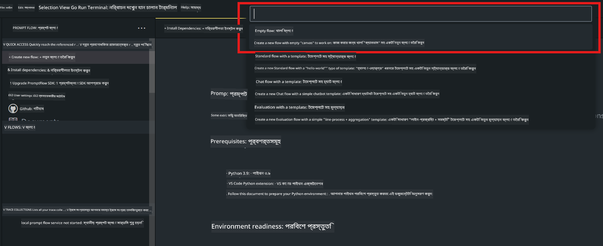
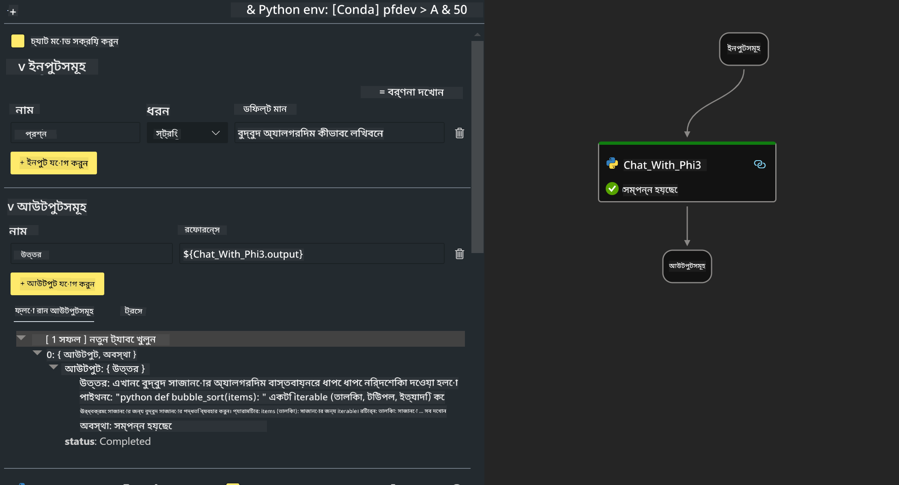
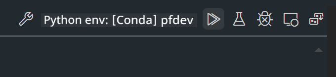

<!--
CO_OP_TRANSLATOR_METADATA:
{
  "original_hash": "bc29f7fe7fc16bed6932733eac8c81b8",
  "translation_date": "2025-07-17T03:56:24+00:00",
  "source_file": "md/02.Application/02.Code/Phi3/VSCodeExt/HOL/AIPC/02.PromptflowWithNPU.md",
  "language_code": "bn"
}
-->
# **ল্যাব ২ - AIPC-তে Phi-3-mini দিয়ে Prompt flow চালানো**

## **Prompt flow কী**

Prompt flow হলো একটি ডেভেলপমেন্ট টুলসের স্যুট যা LLM-ভিত্তিক AI অ্যাপ্লিকেশনগুলোর সম্পূর্ণ ডেভেলপমেন্ট সাইকেলকে সহজ করে তোলে, আইডিয়া থেকে শুরু করে প্রোটোটাইপিং, টেস্টিং, মূল্যায়ন, প্রোডাকশন ডিপ্লয়মেন্ট এবং মনিটরিং পর্যন্ত। এটি prompt engineering অনেক সহজ করে তোলে এবং আপনাকে প্রোডাকশন মানের LLM অ্যাপ তৈরি করতে সাহায্য করে।

Prompt flow ব্যবহার করে আপনি পারবেন:

- LLM, prompts, Python কোড এবং অন্যান্য টুলসকে একসাথে যুক্ত করে একটি কার্যকরী ওয়ার্কফ্লো তৈরি করতে।

- আপনার ফ্লো ডিবাগ এবং পুনরাবৃত্তি করতে, বিশেষ করে LLM-এর সাথে ইন্টারঅ্যাকশন সহজে পরিচালনা করতে।

- বড় ডেটাসেট ব্যবহার করে আপনার ফ্লোর মূল্যায়ন এবং পারফরম্যান্স মেট্রিক্স হিসাব করতে।

- আপনার CI/CD সিস্টেমে টেস্টিং এবং মূল্যায়ন একত্রিত করে ফ্লোর গুণগত মান নিশ্চিত করতে।

- আপনার পছন্দের সার্ভিং প্ল্যাটফর্মে ফ্লো ডিপ্লয় করতে বা সহজেই আপনার অ্যাপের কোডবেসে ইন্টিগ্রেট করতে।

- (ঐচ্ছিক কিন্তু অত্যন্ত সুপারিশকৃত) Azure AI-তে Prompt flow-এর ক্লাউড ভার্সন ব্যবহার করে আপনার টিমের সাথে সহযোগিতা করতে।

## **AIPC কী**

একটি AI PC-তে থাকে CPU, GPU এবং NPU, যাদের প্রত্যেকের নিজস্ব AI অ্যাক্সিলারেশন ক্ষমতা রয়েছে। NPU বা নিউরাল প্রসেসিং ইউনিট হলো একটি বিশেষায়িত অ্যাক্সিলারেটর যা আপনার PC-তেই AI এবং মেশিন লার্নিং (ML) কাজগুলো পরিচালনা করে, ডেটা ক্লাউডে পাঠানোর পরিবর্তে। GPU এবং CPU ও এই কাজগুলো করতে পারে, তবে NPU বিশেষ করে কম পাওয়ার AI হিসাবের জন্য খুবই কার্যকর। AI PC আমাদের কম্পিউটারের কাজ করার পদ্ধতিতে একটি মৌলিক পরিবর্তন নিয়ে এসেছে। এটি এমন কোনো সমস্যার সমাধান নয় যা আগে ছিল না, বরং এটি দৈনন্দিন PC ব্যবহারে একটি বড় উন্নতি।

তাহলে এটি কীভাবে কাজ করে? জেনারেটিভ AI এবং প্রচুর পাবলিক ডেটায় প্রশিক্ষিত বিশাল LLM-এর তুলনায়, আপনার PC-তে চলা AI অনেক বেশি সহজলভ্য। ধারণাটি সহজে বোঝা যায়, এবং যেহেতু এটি আপনার ডেটায় প্রশিক্ষিত, ক্লাউডে অ্যাক্সেস না করেই, এর সুবিধাগুলো অনেক বেশি দ্রুত এবং ব্যাপকভাবে আকর্ষণীয়।

আসন্ন সময়ে, AI PC জগতে ব্যক্তিগত সহকারী এবং ছোট AI মডেলগুলো সরাসরি আপনার PC-তে চলবে, আপনার ডেটা ব্যবহার করে ব্যক্তিগত, গোপনীয় এবং আরও নিরাপদ AI উন্নতি প্রদান করবে যা আপনি প্রতিদিনই করেন – মিটিং মিনিট নেওয়া, ফ্যান্টাসি ফুটবল লীগ সংগঠিত করা, ছবি ও ভিডিও সম্পাদনার জন্য অটোমেশন, অথবা পরিবারের পুনর্মিলনের জন্য সবার আগমন ও প্রস্থানের সময় অনুযায়ী নিখুঁত যাত্রাপথ তৈরি করা।

## **AIPC-তে জেনারেশন কোড ফ্লো তৈরি করা**

***Note*** ：যদি আপনি পরিবেশ ইনস্টলেশন সম্পন্ন না করে থাকেন, অনুগ্রহ করে [Lab 0 -Installations](./01.Installations.md) দেখুন

1. Visual Studio Code-এ Prompt flow Extension খুলুন এবং একটি খালি ফ্লো প্রজেক্ট তৈরি করুন



2. ইনপুট এবং আউটপুট প্যারামিটার যোগ করুন এবং নতুন ফ্লো হিসেবে Python কোড যোগ করুন



আপনি এই স্ট্রাকচার (flow.dag.yaml) অনুসরণ করে আপনার ফ্লো তৈরি করতে পারেন

```yaml

inputs:
  question:
    type: string
    default: how to write Bubble Algorithm
outputs:
  answer:
    type: string
    reference: ${Chat_With_Phi3.output}
nodes:
- name: Chat_With_Phi3
  type: python
  source:
    type: code
    path: Chat_With_Phi3.py
  inputs:
    question: ${inputs.question}


```

3. ***Chat_With_Phi3.py*** ফাইলে কোড যোগ করুন

```python


from promptflow.core import tool

# import torch
from transformers import AutoTokenizer, pipeline,TextStreamer
import intel_npu_acceleration_library as npu_lib

import warnings

import asyncio
import platform

class Phi3CodeAgent:
    
    model = None
    tokenizer = None
    text_streamer = None
    
    model_id = "microsoft/Phi-3-mini-4k-instruct"

    @staticmethod
    def init_phi3():
        
        if Phi3CodeAgent.model is None or Phi3CodeAgent.tokenizer is None or Phi3CodeAgent.text_streamer is None:
            Phi3CodeAgent.model = npu_lib.NPUModelForCausalLM.from_pretrained(
                                    Phi3CodeAgent.model_id,
                                    torch_dtype="auto",
                                    dtype=npu_lib.int4,
                                    trust_remote_code=True
                                )
            Phi3CodeAgent.tokenizer = AutoTokenizer.from_pretrained(Phi3CodeAgent.model_id)
            Phi3CodeAgent.text_streamer = TextStreamer(Phi3CodeAgent.tokenizer, skip_prompt=True)

    

    @staticmethod
    def chat_with_phi3(prompt):
        
        Phi3CodeAgent.init_phi3()

        messages = "<|system|>You are a AI Python coding assistant. Please help me to generate code in Python.The answer only genertated Python code, but any comments and instructions do not need to be generated<|end|><|user|>" + prompt +"<|end|><|assistant|>"


        generation_args = {
            "max_new_tokens": 1024,
            "return_full_text": False,
            "temperature": 0.3,
            "do_sample": False,
            "streamer": Phi3CodeAgent.text_streamer,
        }

        pipe = pipeline(
            "text-generation",
            model=Phi3CodeAgent.model,
            tokenizer=Phi3CodeAgent.tokenizer,
            # **generation_args
        )

        result = ''

        with warnings.catch_warnings():
            warnings.simplefilter("ignore")
            response = pipe(messages, **generation_args)
            result =response[0]['generated_text']
            return result


@tool
def my_python_tool(question: str) -> str:
    if platform.system() == 'Windows':
        asyncio.set_event_loop_policy(asyncio.WindowsSelectorEventLoopPolicy())
    return Phi3CodeAgent.chat_with_phi3(question)


```

4. ডিবাগ বা রান থেকে ফ্লো পরীক্ষা করতে পারেন, কোড জেনারেশন ঠিক আছে কিনা দেখতে



5. টার্মিনালে ডেভেলপমেন্ট API হিসেবে ফ্লো চালান

```

pf flow serve --source ./ --port 8080 --host localhost   

```

Postman / Thunder Client-এ এটি পরীক্ষা করতে পারেন

### **Note**

1. প্রথম রান অনেক সময় নেয়। Hugging face CLI থেকে phi-3 মডেল ডাউনলোড করার পরামর্শ দেওয়া হয়।

2. Intel NPU-এর সীমিত কম্পিউটিং ক্ষমতা বিবেচনা করে Phi-3-mini-4k-instruct ব্যবহার করার পরামর্শ দেওয়া হয়।

3. আমরা Intel NPU Acceleration ব্যবহার করে INT4 কোয়ান্টাইজেশন করি, কিন্তু সার্ভিস পুনরায় চালানোর সময় cache এবং nc_workshop ফোল্ডারগুলো মুছে ফেলতে হবে।

## **রিসোর্স**

1. Promptflow শিখুন [https://microsoft.github.io/promptflow/](https://microsoft.github.io/promptflow/)

2. Intel NPU Acceleration শিখুন [https://github.com/intel/intel-npu-acceleration-library](https://github.com/intel/intel-npu-acceleration-library)

3. স্যাম্পল কোড, ডাউনলোড করুন [Local NPU Agent Sample Code](../../../../../../../../../code/07.Lab/01/AIPC)

**অস্বীকৃতি**:  
এই নথিটি AI অনুবাদ সেবা [Co-op Translator](https://github.com/Azure/co-op-translator) ব্যবহার করে অনূদিত হয়েছে। আমরা যথাসাধ্য সঠিকতার চেষ্টা করি, তবে স্বয়ংক্রিয় অনুবাদে ত্রুটি বা অসঙ্গতি থাকতে পারে। মূল নথিটি তার নিজস্ব ভাষায়ই কর্তৃত্বপূর্ণ উৎস হিসেবে বিবেচিত হওয়া উচিত। গুরুত্বপূর্ণ তথ্যের জন্য পেশাদার মানব অনুবাদ গ্রহণ করার পরামর্শ দেওয়া হয়। এই অনুবাদের ব্যবহারে সৃষ্ট কোনো ভুল বোঝাবুঝি বা ভুল ব্যাখ্যার জন্য আমরা দায়ী নই।