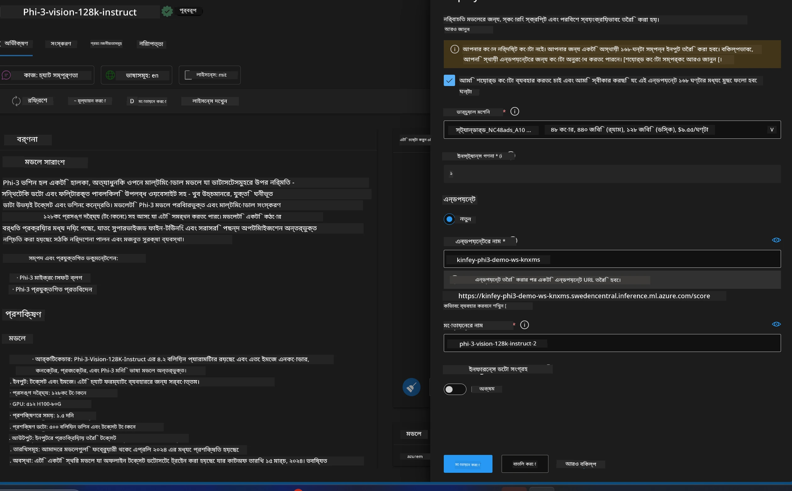
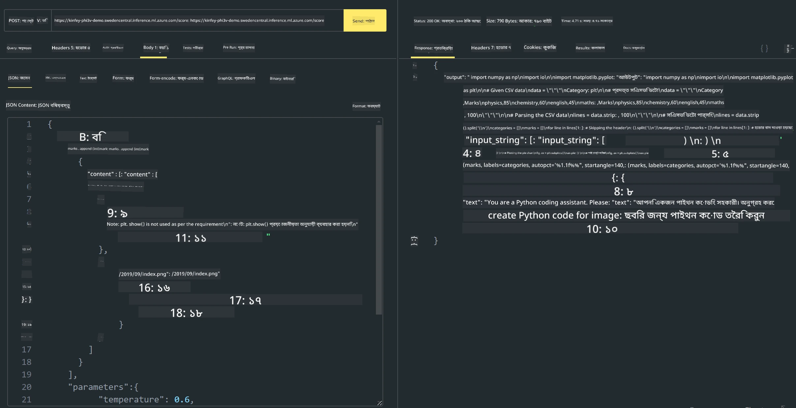

# **ল্যাব ৩ - Azure Machine Learning Service-এ Phi-3-vision ডিপ্লয় করা**

আমরা NPU ব্যবহার করে লোকাল কোডের প্রোডাকশন ডিপ্লয়মেন্ট সম্পন্ন করি, এবং এরপর আমরা PHI-3-VISION এর মাধ্যমে ছবি থেকে কোড জেনারেট করার ক্ষমতা যুক্ত করতে চাই।

এই পরিচিতিতে, আমরা দ্রুত Azure Machine Learning Service-এ Model As Service হিসেবে Phi-3 Vision সার্ভিস তৈরি করতে পারি।

***Note***: Phi-3 Vision দ্রুত কন্টেন্ট জেনারেট করার জন্য উচ্চ কম্পিউটিং পাওয়ার প্রয়োজন। এজন্য আমাদের ক্লাউড কম্পিউটিং পাওয়ার দরকার।

### **১. Azure Machine Learning Service তৈরি করুন**

আমাদের Azure Portal-এ একটি Azure Machine Learning Service তৈরি করতে হবে। যদি আপনি শিখতে চান কিভাবে, তাহলে এই লিঙ্কটি দেখুন [https://learn.microsoft.com/azure/machine-learning/quickstart-create-resources?view=azureml-api-2](https://learn.microsoft.com/azure/machine-learning/quickstart-create-resources?view=azureml-api-2)

### **২. Azure Machine Learning Service-এ Phi-3 Vision নির্বাচন করুন**


### **৩. Azure-এ Phi-3-Vision ডিপ্লয় করুন**



### **৪. Postman-এ Endpoint পরীক্ষা করুন**



***Note***

1. প্রেরণীয় প্যারামিটারগুলোর মধ্যে অবশ্যই Authorization, azureml-model-deployment, এবং Content-Type থাকতে হবে। এগুলো পাওয়ার জন্য ডিপ্লয়মেন্ট তথ্য পরীক্ষা করতে হবে।

2. প্যারামিটার প্রেরণের জন্য, Phi-3-Vision একটি ইমেজ লিঙ্ক প্রেরণ করতে হবে। প্যারামিটার প্রেরণের জন্য GPT-4-Vision পদ্ধতি অনুসরণ করুন, যেমন

```json

{
  "input_data":{
    "input_string":[
      {
        "role":"user",
        "content":[ 
          {
            "type": "text",
            "text": "You are a Python coding assistant.Please create Python code for image "
          },
          {
              "type": "image_url",
              "image_url": {
                "url": "https://ajaytech.co/wp-content/uploads/2019/09/index.png"
              }
          }
        ]
      }
    ],
    "parameters":{
          "temperature": 0.6,
          "top_p": 0.9,
          "do_sample": false,
          "max_new_tokens": 2048
    }
  }
}

```

3. Post মেথড ব্যবহার করে **/score** কল করুন

**অভিনন্দন**! আপনি দ্রুত PHI-3-VISION ডিপ্লয়মেন্ট সম্পন্ন করেছেন এবং ছবি থেকে কোড জেনারেট করার পদ্ধতি চেষ্টা করেছেন। পরবর্তীতে, আমরা NPU এবং ক্লাউডের সমন্বয়ে অ্যাপ্লিকেশন তৈরি করতে পারব।

**অস্বীকৃতি**:  
এই নথিটি AI অনুবাদ সেবা [Co-op Translator](https://github.com/Azure/co-op-translator) ব্যবহার করে অনূদিত হয়েছে। আমরা যথাসাধ্য সঠিকতার চেষ্টা করি, তবে স্বয়ংক্রিয় অনুবাদে ত্রুটি বা অসঙ্গতি থাকতে পারে। মূল নথিটি তার নিজস্ব ভাষায়ই কর্তৃত্বপূর্ণ উৎস হিসেবে বিবেচিত হওয়া উচিত। গুরুত্বপূর্ণ তথ্যের জন্য পেশাদার মানব অনুবাদ গ্রহণ করার পরামর্শ দেওয়া হয়। এই অনুবাদের ব্যবহারে সৃষ্ট কোনো ভুল বোঝাবুঝি বা ভুল ব্যাখ্যার জন্য আমরা দায়ী নই।