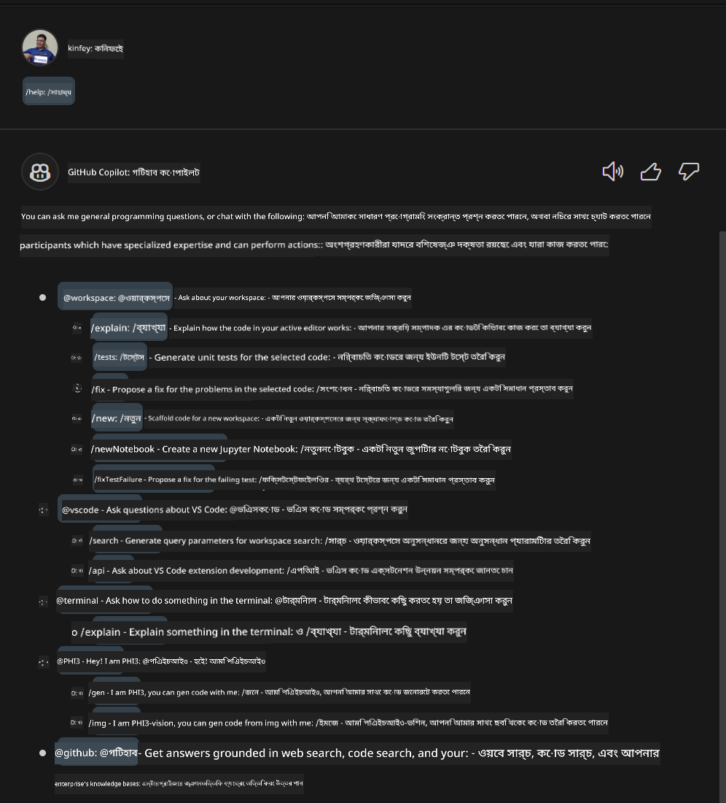

<!--
CO_OP_TRANSLATOR_METADATA:
{
  "original_hash": "b267038b665ba40cfaac6c6d975ccc40",
  "translation_date": "2025-05-09T19:30:48+00:00",
  "source_file": "md/02.Application/02.Code/Phi3/VSCodeExt/HOL/AIPC/04.CreatePhi3AgentInVSCode.md",
  "language_code": "bn"
}
-->
# **ল্যাব ৩ - GitHub Copilot Chat-এ @PHI3 এজেন্ট তৈরি করুন**

Visual Studio Code Copilot Chat-এ, আপনি @workspace-এর মাধ্যমে পুরো প্রজেক্ট পরিচালনা করতে পারেন। এন্টারপ্রাইজ পরিস্থিতির জন্য, আমরা Copilot Chat-এর এজেন্ট আরও নমনীয়ভাবে কাস্টমাইজ করতে পারি।


গত ল্যাবে, আমরা NPU এবং ক্লাউড মিলিয়ে Phi3 এজেন্টের জন্য একটি Visual Studio Code এক্সটেনশন তৈরি করেছি।



### **১. একটি VSCode ডেভেলপমেন্ট এক্সটেনশন তৈরি করুন**

একটি এক্সটেনশন প্রজেক্ট তৈরি করতে এই লিঙ্কটি দেখুন [https://code.visualstudio.com/api/get-started/your-first-extension](https://code.visualstudio.com/api/get-started/your-first-extension)

***NOTE:*** এই প্রজেক্টের জন্য দয়া করে Typescript, WebPack প্রযুক্তি ব্যবহার করুন

### **২. vscode.d.ts যোগ করুন**

Visual Studio Code Chat API এখনও কোড API-তে মিশে যায়নি, তবে এখন এটি এক্সটেনশনের মাধ্যমে যোগ করা হয়েছে।

vscode.d.ts ডাউনলোড করুন [https://github.com/microsoft/vscode/blob/main/src/vscode-dts/vscode.d.ts](https://github.com/microsoft/vscode/blob/main/src/vscode-dts/vscode.d.ts)

***NOTE:*** দয়া করে Visual Studio Code Insiders 1.90+ এ এটি চালান


### **৩. package.json আপডেট করুন**

```json

{
  "name": "phi3ext",
  "displayName": "phi3ext",
  "description": "",
  "version": "0.0.1",
  "engines": {
    "vscode": "^1.90.0"
  },
  "categories": [
      "AI",
      "Chat"
  ],
  "activationEvents": [],
  "enabledApiProposals": [
      "chatVariableResolver"
  ],
  "main": "./dist/extension.js",
  "contributes": {
      "chatParticipants": [
          {
              "id": "chat.PHI3",
              "name": "PHI3",
              "description": "Hey! I am PHI3",
              "isSticky": true,
              "commands": [
                  {
                      "name": "gen",
                      "description": "I am PHI3, you can gen code with me"
                  },
                  {
                      "name": "img",
                      "description": "I am PHI3-vision, you can gen code from img with me"
                  }
              ]
          }
      ],
      "commands": [
          {
              "command": "PHI3.namesInEditor",
              "title": "Use PHI3 in Editor"
          }
      ]
  },  
  "scripts": {
    "vscode:prepublish": "npm run package",
    "compile": "webpack",
    "watch": "webpack --watch",
    "package": "webpack --mode production --devtool hidden-source-map",
    "compile-tests": "tsc -p . --outDir out",
    "watch-tests": "tsc -p . -w --outDir out",
    "pretest": "npm run compile-tests && npm run compile && npm run lint",
    "lint": "eslint src --ext ts",
    "test": "vscode-test"
  },
  "devDependencies": {
    "@types/vscode": "^1.90.0",
    "@types/mocha": "^10.0.6",
    "@types/node": "18.x",
    "@typescript-eslint/eslint-plugin": "^7.11.0",
    "@typescript-eslint/parser": "^7.11.0",
    "eslint": "^8.57.0",
    "typescript": "^5.4.5",
    "ts-loader": "^9.5.1",
    "webpack": "^5.91.0",
    "webpack-cli": "^5.1.4",
    "@vscode/test-cli": "^0.0.9",
    "@vscode/test-electron": "^2.4.0"
  },
  "dependencies": {
    "@types/node-fetch": "^2.6.11",
    "node-fetch": "^3.3.2"
  }
}

```

আপনি টার্মিনালে **npm install** চালিয়ে আপনার এক্সটেনশন ডিবাগ করে পরীক্ষা করতে পারেন।

***Sample Code ডাউনলোড করুন*** [এখানে ক্লিক করুন](../../../../../../../../../code/07.Lab/01/AIPC)


### **৪. src/extension.ts পরিবর্তন করুন**


```ts

// The module 'vscode' contains the VS Code extensibility API
// Import the module and reference it with the alias vscode in your code below
import * as vscode from 'vscode';


interface IPHI3ChatResult extends vscode.ChatResult {
    metadata: {
        command: string;
    }
}


// This method is called when your extension is activated
// Your extension is activated the very first time the command is executed
export function activate(extcontext: vscode.ExtensionContext) {


	// Define a SHEIN chat handler. 
	const phi3handler: vscode.ChatRequestHandler = async (request: vscode.ChatRequest, context: vscode.ChatContext, stream: vscode.ChatResponseStream, token: vscode.CancellationToken): Promise<IPHI3ChatResult> => {

		if (request.command == 'gen') {

			const content = "Welcome to Phi-3 to gen code";

			

			const result = await gen(request.prompt);

			const code = result;
			
			
			stream.progress("```txt"+"\n"+code+ +"\n"+"```")


            return { metadata: { command: 'gen' } };

		}
		if (request.command == 'img') {

			const content = "Welcome to Phi-3 vision to gen code in image";

			const prompt = request.prompt;

			if(prompt.indexOf("(IMG_URL:")>-1){

				const img_url = prompt.split("(IMG_URL:")[1].split(")")[0];
				const question = prompt.split("(IMG_URL:")[0];
				const tmp = question;

				const result = await genImage(question,img_url);
	
				const code = result;
				
				
				stream.progress(code)
	
	
				return { metadata: { command: 'img' } };
			}
			else
			{
				var result = "```txt"+"\n\n"+"এইভাবে প্রশ্ন করুন: Your question (IMG_URL:https://example.com/image.jpg)"+"\n\n"++"```";
				stream.progress(result);

			}


            return { metadata: { command: 'img' } };

		}


		return { metadata: { command: '' } };

	}


	const xp = vscode.chat.createChatParticipant("chat.PHI3", phi3handler);

	xp.iconPath = new vscode.ThemeIcon('sparkle');


    xp.followupProvider = {
        provideFollowups(result: IPHI3ChatResult, context: vscode.ChatContext, token: vscode.CancellationToken) {
            return [{
                prompt: 'let us code with Phi-3 Family',
                label: vscode.l10n.t('Dev with Phi-3 Family'),
                command: 'help'
            } satisfies vscode.ChatFollowup];
        }
    };

	extcontext.subscriptions.push(xp);
}


interface GenCode {
	question: string;
}

interface ImgGenCodeResponse {
	output: string;
}


interface GenCodeResponse {
	answer: string;
}

async function gen(prompt: string) {

	const postData: GenCode = {
		question: prompt
	};
	const response = await fetch('http://localhost:8080/score', {
		method: 'POST',
		body: JSON.stringify(postData),
		headers: { 'Content-Type': 'application/json' }
	});
	const post = await response.json();
	const resultResponse = post as GenCodeResponse;
	return resultResponse.answer;
}

async function genImage(prompt: string, img_url: string) {

	const response = await fetch('Your Phi-3-Vision Endpoint', {
		method: 'POST',
		body: JSON.stringify({
			"input_data":{
			  "input_string":[
				{
				  "role":"user",
				  "content":[ 
					{
					  "type": "text",
					  "text": prompt
					},
					{
						"type": "image_url",
						"image_url": {
						  "url": img_url
						}
					}
				  ]
				}
			  ],
			  "parameters":{
					"temperature": 0.6,
					"top_p": 0.9,
					"do_sample": false,
					"max_new_tokens": 2048
			  }
			}
		}),
		headers: { 'Content-Type': 'application/json', 'Authorization' : 'Bearer Your Phi-3-Vision Endpoint Key', 'azureml-model-deployment': 'Your Phi-3-Vision Deployment name' }
	});
	const post = await response.json();
	const resultResponse = post as ImgGenCodeResponse;
	return resultResponse.output;
}

// This method is called when your extension is deactivated
export function deactivate() {}


```

অভিনন্দন! আপনি সব ল্যাব শেষ করেছেন। আশা করি এটি আপনাকে Phi-3 ফ্যামিলি এবং GitHub Copilot Chat ব্যবহারের পদ্ধতি বুঝতে সাহায্য করেছে।


আপনি চেষ্টা করতে পারেন ***@PHI3 /gen***


আপনি চেষ্টা করতে পারেন ***@PHI3 /img***


**অস্বীকৃতি**:  
এই নথিটি AI অনুবাদ সেবা [Co-op Translator](https://github.com/Azure/co-op-translator) ব্যবহার করে অনূদিত হয়েছে। আমরা যথাসাধ্য সঠিকতার চেষ্টা করি, তবে স্বয়ংক্রিয় অনুবাদে ত্রুটি বা ভুল থাকতে পারে। মূল নথিটি তার নিজ ভাষায়ই কর্তৃত্বপূর্ণ উৎস হিসেবে বিবেচিত হওয়া উচিত। গুরুত্বপূর্ণ তথ্যের জন্য পেশাদার মানব অনুবাদ গ্রহণ করা উচিৎ। এই অনুবাদের ব্যবহার থেকে উদ্ভূত কোনো ভুল বোঝাবুঝি বা ভুল ব্যাখ্যার জন্য আমরা দায়ী নই।