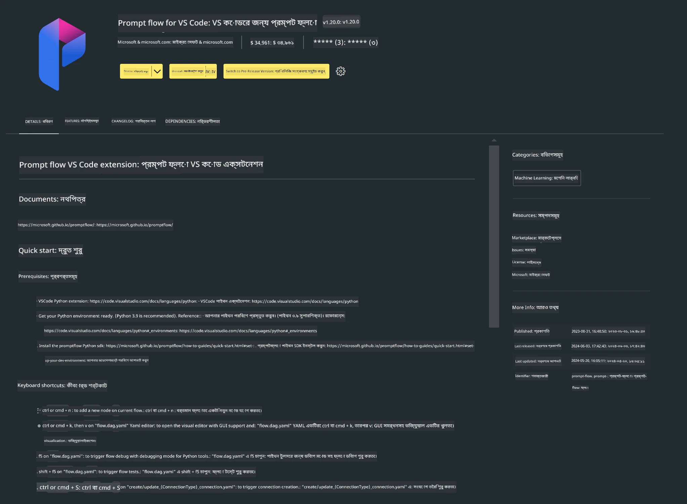

<!--
CO_OP_TRANSLATOR_METADATA:
{
  "original_hash": "4b16264917d9b93169745d92b8ce8c65",
  "translation_date": "2025-07-17T04:17:49+00:00",
  "source_file": "md/02.Application/02.Code/Phi3/VSCodeExt/HOL/Apple/01.Installations.md",
  "language_code": "bn"
}
-->
# **ল্যাব ০ - ইনস্টলেশন**

ল্যাবে প্রবেশ করার পর, আমাদের প্রাসঙ্গিক পরিবেশ সেটআপ করতে হবে :


### **১. Python 3.11+**

Python পরিবেশ সেটআপের জন্য miniforge ব্যবহার করার পরামর্শ দেওয়া হয়।

miniforge সেটআপ করতে, অনুগ্রহ করে [https://github.com/conda-forge/miniforge](https://github.com/conda-forge/miniforge) দেখুন।

miniforge সেটআপ করার পর, Power Shell-এ নিচের কমান্ডটি চালান

```bash

conda create -n pyenv python==3.11.8 -y

conda activate pyenv

```


### **২. Prompt flow SDK ইনস্টল করুন**

ল্যাব ১-এ আমরা Prompt flow ব্যবহার করব, তাই আপনাকে Prompt flow SDK সেটআপ করতে হবে।

```bash

pip install promptflow --upgrade

```

এই কমান্ড দিয়ে আপনি promptflow sdk চেক করতে পারেন

```bash

pf --version

```

### **৩. Visual Studio Code Prompt flow এক্সটেনশন ইনস্টল করুন**



### **৪. Apple's MLX Framework**

MLX হলো Apple সিলিকনের জন্য মেশিন লার্নিং গবেষণার একটি অ্যারে ফ্রেমওয়ার্ক, যা Apple মেশিন লার্নিং গবেষণা থেকে এসেছে। আপনি **Apple MLX framework** ব্যবহার করে Apple Silicon-এ LLM / SLM দ্রুততর করতে পারেন। আরও জানতে চাইলে পড়তে পারেন [https://github.com/microsoft/PhiCookBook/blob/main/md/01.Introduction/03/MLX_Inference.md](https://github.com/microsoft/PhiCookBook/blob/main/md/01.Introduction/03/MLX_Inference.md)।

bash-এ MLX framework লাইব্রেরি ইনস্টল করুন

```bash

pip install mlx-lm

```


### **৫. অন্যান্য Python লাইব্রেরি**

requirements.txt তৈরি করুন এবং নিচের বিষয়বস্তু যোগ করুন

```txt

notebook
numpy 
scipy 
scikit-learn 
matplotlib 
pandas 
pillow 
graphviz

```


### **৬. NVM ইনস্টল করুন**

Powershell-এ nvm ইনস্টল করুন

```bash

brew install nvm

```

nodejs 18.20 ইনস্টল করুন

```bash

nvm install 18.20.0

nvm use 18.20.0

```

### **৭. Visual Studio Code Development Support ইনস্টল করুন**

```bash

npm install --global yo generator-code

```

অভিনন্দন! আপনি সফলভাবে SDK কনফিগার করেছেন। এখন, হাতে কলমে ধাপগুলোতে এগিয়ে যান।

**অস্বীকৃতি**:  
এই নথিটি AI অনুবাদ সেবা [Co-op Translator](https://github.com/Azure/co-op-translator) ব্যবহার করে অনূদিত হয়েছে। আমরা যথাসাধ্য সঠিকতার চেষ্টা করি, তবে স্বয়ংক্রিয় অনুবাদে ত্রুটি বা অসঙ্গতি থাকতে পারে। মূল নথিটি তার নিজস্ব ভাষায়ই কর্তৃত্বপূর্ণ উৎস হিসেবে বিবেচিত হওয়া উচিত। গুরুত্বপূর্ণ তথ্যের জন্য পেশাদার মানব অনুবাদ গ্রহণ করার পরামর্শ দেওয়া হয়। এই অনুবাদের ব্যবহারে সৃষ্ট কোনো ভুল বোঝাবুঝি বা ভুল ব্যাখ্যার জন্য আমরা দায়ী নই।