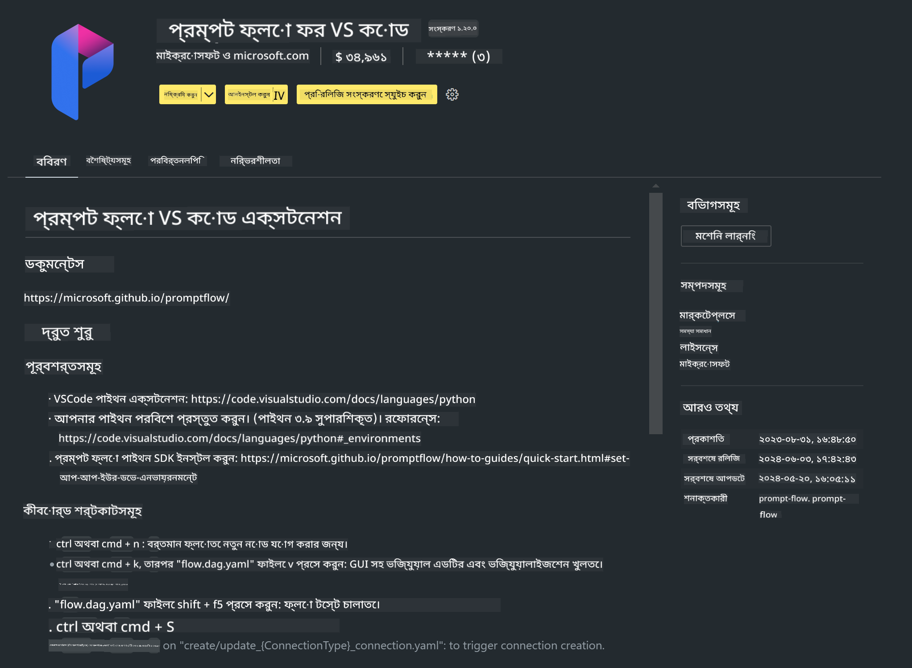

<!--
CO_OP_TRANSLATOR_METADATA:
{
  "original_hash": "4b16264917d9b93169745d92b8ce8c65",
  "translation_date": "2025-05-09T19:34:23+00:00",
  "source_file": "md/02.Application/02.Code/Phi3/VSCodeExt/HOL/Apple/01.Installations.md",
  "language_code": "bn"
}
-->
# **ল্যাব ০ - ইনস্টলেশন**

ল্যাবে প্রবেশ করার সময়, আমাদের প্রাসঙ্গিক পরিবেশ কনফিগার করতে হবে :


### **১. Python 3.11+**

Python পরিবেশ কনফিগার করার জন্য miniforge ব্যবহার করার পরামর্শ দেওয়া হয়

miniforge কনফিগার করার জন্য, অনুগ্রহ করে [https://github.com/conda-forge/miniforge](https://github.com/conda-forge/miniforge) দেখুন

miniforge কনফিগার করার পর, Power Shell-এ নিচের কমান্ডটি চালান

```bash

conda create -n pyenv python==3.11.8 -y

conda activate pyenv

```


### **২. Prompt flow SDK ইনস্টল করুন**

ল্যাব ১-এ আমরা Prompt flow ব্যবহার করব, তাই আপনাকে Prompt flow SDK কনফিগার করতে হবে।

```bash

pip install promptflow --upgrade

```

আপনি এই কমান্ডে promptflow sdk চেক করতে পারেন


```bash

pf --version

```

### **৩. Visual Studio Code Prompt flow এক্সটেনশন ইনস্টল করুন**



### **৪. Apple's MLX Framework**

MLX হল Apple সিলিকনের উপর মেশিন লার্নিং গবেষণার জন্য একটি অ্যারে ফ্রেমওয়ার্ক, যা Apple মেশিন লার্নিং গবেষণার পক্ষ থেকে আনা হয়েছে। আপনি **Apple MLX framework** ব্যবহার করে Apple Silicon এর সাথে LLM / SLM ত্বরান্বিত করতে পারেন। যদি আপনি আরও জানতে চান, তাহলে পড়তে পারেন [https://github.com/microsoft/PhiCookBook/blob/main/md/01.Introduction/03/MLX_Inference.md](https://github.com/microsoft/PhiCookBook/blob/main/md/01.Introduction/03/MLX_Inference.md)।

bash-এ MLX framework লাইব্রেরি ইনস্টল করুন


```bash

pip install mlx-lm

```


### **৫. অন্যান্য Python লাইব্রেরি**


requirements.txt তৈরি করুন এবং এই কন্টেন্টটি যোগ করুন

```txt

notebook
numpy 
scipy 
scikit-learn 
matplotlib 
pandas 
pillow 
graphviz

```


### **৬. NVM ইনস্টল করুন**

Powershell-এ nvm ইনস্টল করুন


```bash

brew install nvm

```

nodejs 18.20 ইনস্টল করুন


```bash

nvm install 18.20.0

nvm use 18.20.0

```

### **৭. Visual Studio Code Development Support ইনস্টল করুন**


```bash

npm install --global yo generator-code

```

অভিনন্দন! আপনি সফলভাবে SDK কনফিগার করেছেন। পরবর্তী ধাপে হ্যান্ডস-অন স্টেপগুলো অনুসরণ করুন।

**বিস্তারিত সতর্কতা**:  
এই নথিটি AI অনুবাদ সেবা [Co-op Translator](https://github.com/Azure/co-op-translator) ব্যবহার করে অনূদিত হয়েছে। আমরা যথাসাধ্য সঠিকতার চেষ্টা করি, তবে স্বয়ংক্রিয় অনুবাদে ত্রুটি বা ভুল থাকতে পারে। মূল নথি তার নিজস্ব ভাষায় প্রামাণিক উৎস হিসেবে বিবেচনা করা উচিত। গুরুত্বপূর্ণ তথ্যের জন্য পেশাদার মানুষের অনুবাদ গ্রহণ করা সুপারিশ করা হয়। এই অনুবাদের ব্যবহারে সৃষ্ট কোনো ভুল বোঝাবুঝি বা ভুল ব্যাখ্যার জন্য আমরা দায়বদ্ধ নই।