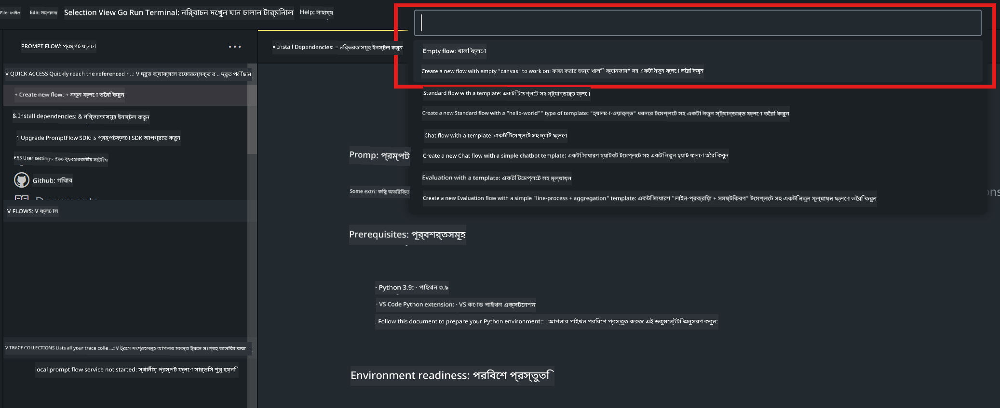
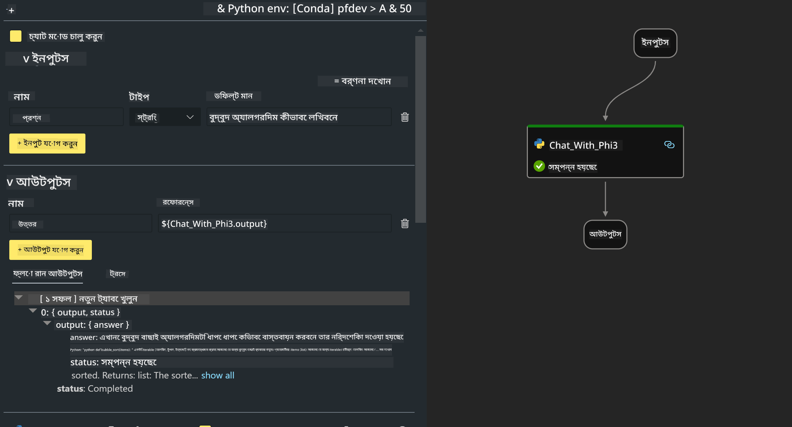
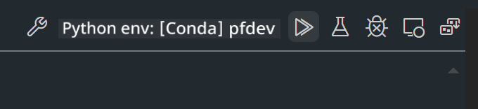

<!--
CO_OP_TRANSLATOR_METADATA:
{
  "original_hash": "3dbbf568625b1ee04b354c2dc81d3248",
  "translation_date": "2025-05-09T19:37:49+00:00",
  "source_file": "md/02.Application/02.Code/Phi3/VSCodeExt/HOL/Apple/02.PromptflowWithMLX.md",
  "language_code": "bn"
}
-->
# **Lab 2 - Phi-3-mini সহ AIPC তে Prompt flow চালানো**

## **Prompt flow কী**

Prompt flow হলো একটি উন্নয়ন সরঞ্জামসমূহের স্যুট যা LLM-ভিত্তিক AI অ্যাপ্লিকেশনগুলোর সম্পূর্ণ উন্নয়ন চক্রকে সহজ করে তোলে, আইডিয়া থেকে শুরু করে প্রোটোটাইপিং, টেস্টিং, মূল্যায়ন, প্রোডাকশন ডিপ্লয়মেন্ট এবং মনিটরিং পর্যন্ত। এটি prompt engineering অনেক সহজ করে এবং আপনাকে প্রোডাকশন মানের LLM অ্যাপ তৈরি করতে সক্ষম করে।

Prompt flow দিয়ে আপনি পারবেন:

- LLM, prompts, Python কোড এবং অন্যান্য টুলগুলোকে একত্রিত করে কার্যকরী ওয়ার্কফ্লো তৈরি করতে।

- সহজেই আপনার ফ্লো ডিবাগ এবং পুনরাবৃত্তি করতে, বিশেষ করে LLM এর সাথে ইন্টারঅ্যাকশন।

- বড় ডেটাসেট নিয়ে আপনার ফ্লো মূল্যায়ন এবং মান ও পারফরম্যান্স মেট্রিক হিসাব করতে।

- আপনার CI/CD সিস্টেমে টেস্টিং এবং মূল্যায়ন একীভূত করতে যাতে ফ্লোর গুণগত মান নিশ্চিত হয়।

- আপনার পছন্দের সার্ভিং প্ল্যাটফর্মে ফ্লো ডিপ্লয় করতে বা সহজেই আপনার অ্যাপের কোড বেসে ইন্টিগ্রেট করতে।

- (ঐচ্ছিক কিন্তু অত্যন্ত প্রস্তাবিত) Azure AI এর ক্লাউড ভার্সন ব্যবহার করে আপনার টিমের সাথে সহযোগিতা করতে।


## **Apple Silicon এ generation code flow তৈরি করা**

***Note*** ：যদি আপনি পরিবেশ ইনস্টলেশন সম্পন্ন না করে থাকেন, অনুগ্রহ করে [Lab 0 -Installations](./01.Installations.md) দেখুন

1. Visual Studio Code এ Prompt flow Extension খুলুন এবং একটি খালি flow প্রকল্প তৈরি করুন



2. Inputs এবং Outputs প্যারামিটার যোগ করুন এবং নতুন flow হিসেবে Python Code যোগ করুন




আপনি flow গঠন করার জন্য এই স্ট্রাকচার (flow.dag.yaml) অনুসরণ করতে পারেন

```yaml

inputs:
  prompt:
    type: string
    default: Write python code for Fibonacci serie. Please use markdown as output
outputs:
  result:
    type: string
    reference: ${gen_code_by_phi3.output}
nodes:
- name: gen_code_by_phi3
  type: python
  source:
    type: code
    path: gen_code_by_phi3.py
  inputs:
    prompt: ${inputs.prompt}


```

3. phi-3-mini কোয়ান্টাইজ করুন

আমরা আশা করি স্থানীয় ডিভাইসে SLM আরও ভালোভাবে চালাতে পারব। সাধারণত, আমরা মডেলটি কোয়ান্টাইজ করি (INT4, FP16, FP32)


```bash

python -m mlx_lm.convert --hf-path microsoft/Phi-3-mini-4k-instruct

```

**Note:** ডিফল্ট ফোল্ডার হলো mlx_model 

4. ***Chat_With_Phi3.py*** এ কোড যোগ করুন


```python


from promptflow import tool

from mlx_lm import load, generate


# The inputs section will change based on the arguments of the tool function, after you save the code
# Adding type to arguments and return value will help the system show the types properly
# Please update the function name/signature per need
@tool
def my_python_tool(prompt: str) -> str:

    model_id = './mlx_model_phi3_mini'

    model, tokenizer = load(model_id)

    # <|user|>\nWrite python code for Fibonacci serie. Please use markdown as output<|end|>\n<|assistant|>

    response = generate(model, tokenizer, prompt="<|user|>\n" + prompt  + "<|end|>\n<|assistant|>", max_tokens=2048, verbose=True)

    return response


```

4. আপনি Debug বা Run থেকে flow পরীক্ষা করতে পারেন কোড জেনারেশন ঠিক আছে কিনা দেখতে



5. টার্মিনালে development API হিসেবে flow চালান

```

pf flow serve --source ./ --port 8080 --host localhost   

```

আপনি এটি Postman / Thunder Client এ পরীক্ষা করতে পারেন


### **Note**

1. প্রথমবার চালাতে সময় বেশি লাগে। phi-3 মডেল Hugging face CLI থেকে ডাউনলোড করার পরামর্শ দেওয়া হয়।

2. Intel NPU এর সীমিত কম্পিউটিং ক্ষমতা বিবেচনা করে, Phi-3-mini-4k-instruct ব্যবহার করার সুপারিশ করা হয়।

3. আমরা Intel NPU Acceleration ব্যবহার করে INT4 কোয়ান্টাইজেশন করি, কিন্তু সার্ভিস পুনরায় চালানোর ক্ষেত্রে cache এবং nc_workshop ফোল্ডারগুলো মুছে ফেলতে হবে।


## **Resources**

1. Promptflow শিখুন [https://microsoft.github.io/promptflow/](https://microsoft.github.io/promptflow/)

2. Intel NPU Acceleration শিখুন [https://github.com/intel/intel-npu-acceleration-library](https://github.com/intel/intel-npu-acceleration-library)

3. Sample Code, ডাউনলোড করুন [Local NPU Agent Sample Code](../../../../../../../../../code/07.Lab/01/AIPC/local-npu-agent)

**অস্বীকারোক্তি**:  
এই ডকুমেন্টটি AI অনুবাদ সেবা [Co-op Translator](https://github.com/Azure/co-op-translator) ব্যবহার করে অনূদিত হয়েছে। আমরা যথাসাধ্য সঠিকতার চেষ্টা করি, তবে দয়া করে জানুন যে স্বয়ংক্রিয় অনুবাদে ভুল বা অসঙ্গতি থাকতে পারে। মূল ডকুমেন্টটি তার নিজস্ব ভাষায়ই কর্তৃত্বপূর্ণ উৎস হিসেবে বিবেচিত হওয়া উচিত। গুরুত্বপূর্ণ তথ্যের জন্য পেশাদার মানব অনুবাদের পরামর্শ দেওয়া হয়। এই অনুবাদের ব্যবহারের ফলে সৃষ্ট কোনো ভুল বোঝাবুঝি বা ভুল ব্যাখ্যার জন্য আমরা দায়ী নই।