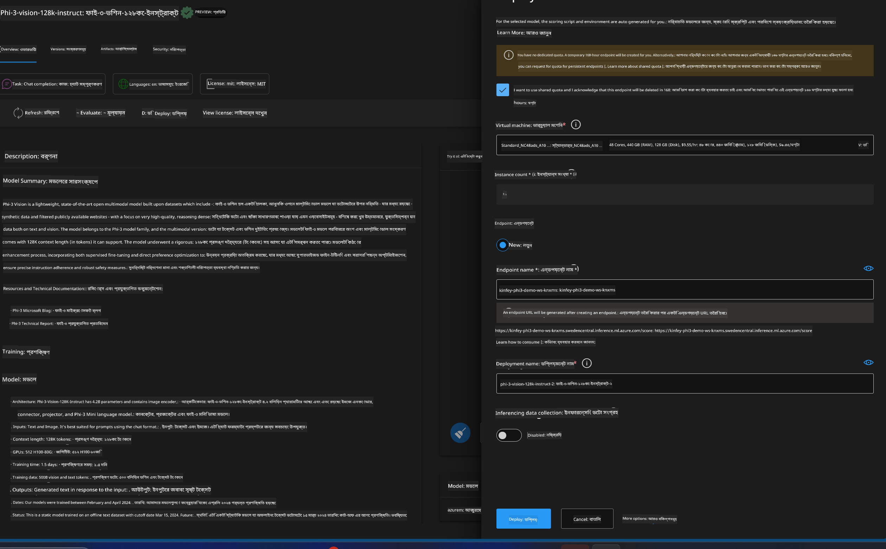
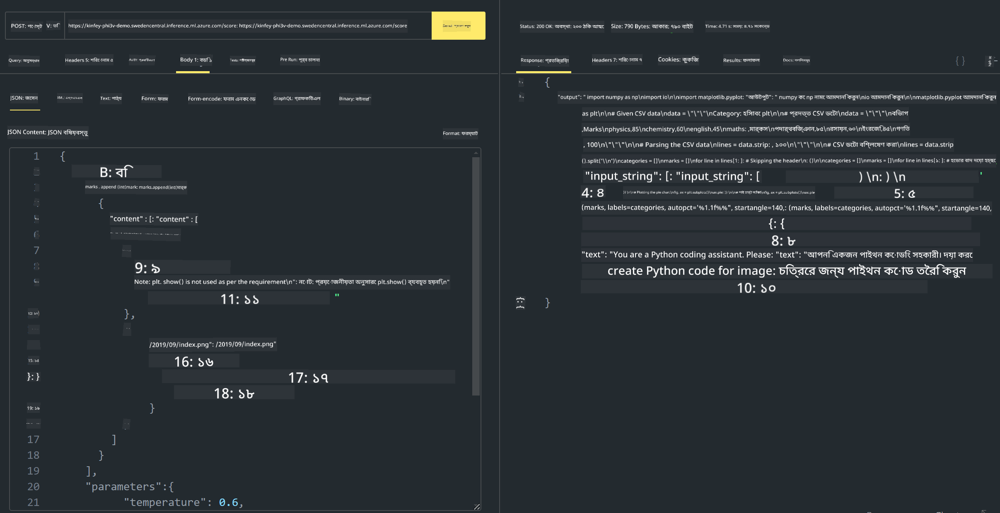

<!--
CO_OP_TRANSLATOR_METADATA:
{
  "original_hash": "20cb4e6ac1686248e8be913ccf6c2bc2",
  "translation_date": "2025-05-09T19:42:27+00:00",
  "source_file": "md/02.Application/02.Code/Phi3/VSCodeExt/HOL/Apple/03.DeployPhi3VisionOnAzure.md",
  "language_code": "bn"
}
-->
# **ল্যাব ৩ - Azure Machine Learning Service-এ Phi-3-vision ডিপ্লয় করুন**

আমরা NPU ব্যবহার করে লোকাল কোডের প্রোডাকশন ডিপ্লয়মেন্ট সম্পন্ন করি, এরপর আমরা PHI-3-VISION যুক্ত করার ক্ষমতা আনতে চাই যাতে ছবি থেকে কোড জেনারেট করা যায়।

এই পরিচয়ে, আমরা দ্রুত Azure Machine Learning Service-এ Model As Service হিসেবে Phi-3 Vision সার্ভিস তৈরি করতে পারি।

***Note***: Phi-3 Vision দ্রুত কনটেন্ট জেনারেট করার জন্য উচ্চ কম্পিউটিং ক্ষমতা প্রয়োজন। এজন্য আমাদের ক্লাউড কম্পিউটিং পাওয়ার দরকার।

### **১. Azure Machine Learning Service তৈরি করুন**

আমাদের Azure Portal-এ একটি Azure Machine Learning Service তৈরি করতে হবে। যদি আপনি শিখতে চান কিভাবে, অনুগ্রহ করে এই লিংকে যান [https://learn.microsoft.com/azure/machine-learning/quickstart-create-resources?view=azureml-api-2](https://learn.microsoft.com/azure/machine-learning/quickstart-create-resources?view=azureml-api-2)

### **২. Azure Machine Learning Service-এ Phi-3 Vision নির্বাচন করুন**


### **৩. Azure-তে Phi-3-Vision ডিপ্লয় করুন**



### **৪. Postman-এ Endpoint পরীক্ষা করুন**



***Note***

1. প্রেরণীয় প্যারামিটারগুলোর মধ্যে অবশ্যই Authorization, azureml-model-deployment, এবং Content-Type থাকতে হবে। এগুলো পেতে ডিপ্লয়মেন্ট তথ্য চেক করতে হবে।

2. প্যারামিটার প্রেরণের জন্য, Phi-3-Vision একটি ইমেজ লিংক পাঠাতে হবে। প্যারামিটার পাঠানোর জন্য GPT-4-Vision পদ্ধতি অনুসরণ করুন, যেমন

```json

{
  "input_data":{
    "input_string":[
      {
        "role":"user",
        "content":[ 
          {
            "type": "text",
            "text": "You are a Python coding assistant.Please create Python code for image "
          },
          {
              "type": "image_url",
              "image_url": {
                "url": "https://ajaytech.co/wp-content/uploads/2019/09/index.png"
              }
          }
        ]
      }
    ],
    "parameters":{
          "temperature": 0.6,
          "top_p": 0.9,
          "do_sample": false,
          "max_new_tokens": 2048
    }
  }
}

```

3. Post পদ্ধতি ব্যবহার করে **/score** কল করুন

**অভিনন্দন**! আপনি দ্রুত PHI-3-VISION ডিপ্লয়মেন্ট সম্পন্ন করেছেন এবং ছবি থেকে কোড জেনারেট করার পদ্ধতি চেষ্টা করেছেন। পরবর্তী ধাপে, আমরা NPU এবং ক্লাউডের সংমিশ্রণে অ্যাপ্লিকেশন তৈরি করতে পারি।

**দায়িত্ব পরিহার**:  
এই নথিটি AI অনুবাদ সেবা [Co-op Translator](https://github.com/Azure/co-op-translator) ব্যবহার করে অনূদিত হয়েছে। আমরা যথাসাধ্য সঠিকতার চেষ্টা করি, তবে স্বয়ংক্রিয় অনুবাদে ত্রুটি বা অসঙ্গতি থাকতে পারে। মূল নথিটি তার নিজ ভাষায় সর্বোত্তম এবং প্রামাণিক উৎস হিসেবে বিবেচনা করা উচিত। গুরুত্বপূর্ণ তথ্যের জন্য পেশাদার মানব অনুবাদ পরামর্শযোগ্য। এই অনুবাদের ব্যবহার থেকে সৃষ্ট কোনো ভুল বোঝাবুঝি বা ভুল ব্যাখ্যার জন্য আমরা দায়ী নই।