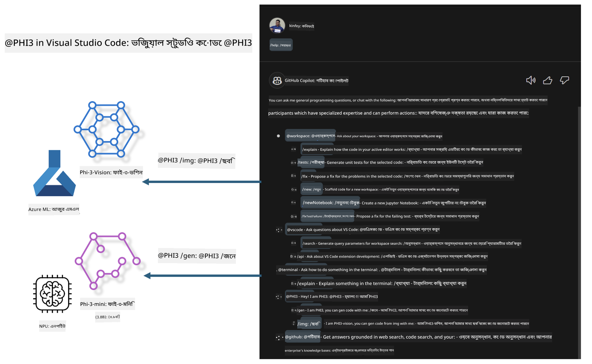

<!--
CO_OP_TRANSLATOR_METADATA:
{
  "original_hash": "00b7a699de8ac405fa821f4c0f7fc0ab",
  "translation_date": "2025-05-09T19:10:44+00:00",
  "source_file": "md/02.Application/02.Code/Phi3/VSCodeExt/README.md",
  "language_code": "bn"
}
-->
# **নিজের Visual Studio Code GitHub Copilot Chat Microsoft Phi-3 পরিবার দিয়ে তৈরি করুন**

আপনি কি GitHub Copilot Chat-এ workspace agent ব্যবহার করেছেন? আপনি কি আপনার দলের নিজস্ব কোড এজেন্ট তৈরি করতে চান? এই হাতে-কলমে ল্যাবটি ওপেন সোর্স মডেলকে একত্রিত করে এন্টারপ্রাইজ-স্তরের কোড বিজনেস এজেন্ট তৈরি করার চেষ্টা করে।

## **মূল ভিত্তি**

### **কেন Microsoft Phi-3 বেছে নেবেন**

Phi-3 একটি পরিবার সিরিজ, যার মধ্যে phi-3-mini, phi-3-small, এবং phi-3-medium রয়েছে, যা বিভিন্ন প্রশিক্ষণ প্যারামিটার ভিত্তিক টেক্সট জেনারেশন, ডায়ালগ সম্পূর্ণকরণ এবং কোড জেনারেশনের জন্য। এছাড়াও phi-3-vision রয়েছে যা Vision-ভিত্তিক। এটি এন্টারপ্রাইজ বা বিভিন্ন দলের জন্য অফলাইন জেনারেটিভ AI সলিউশন তৈরি করতে উপযোগী।

এই লিঙ্কটি পড়ার জন্য সুপারিশ করা হয়েছে [https://github.com/microsoft/PhiCookBook/blob/main/md/01.Introduction/01/01.PhiFamily.md](https://github.com/microsoft/PhiCookBook/blob/main/md/01.Introduction/01/01.PhiFamily.md)

### **Microsoft GitHub Copilot Chat**

GitHub Copilot Chat এক্সটেনশনটি আপনাকে একটি চ্যাট ইন্টারফেস দেয় যা VS Code-এর মধ্যে সরাসরি GitHub Copilot-এর সাথে ইন্টারঅ্যাক্ট করে কোডিং-সম্পর্কিত প্রশ্নের উত্তর পেতে সাহায্য করে, যাতে আপনাকে ডকুমেন্টেশন ব্রাউজ করতে বা অনলাইন ফোরাম অনুসন্ধান করতে হয় না।

Copilot Chat উৎপাদিত উত্তরে স্পষ্টতা বাড়াতে সিনট্যাক্স হাইলাইটিং, ইন্ডেন্টেশন এবং অন্যান্য ফরম্যাটিং বৈশিষ্ট্য ব্যবহার করতে পারে। ব্যবহারকারীর প্রশ্নের ধরন অনুযায়ী, ফলাফলে সেই প্রসঙ্গের লিঙ্ক থাকতে পারে যা Copilot উত্তর তৈরি করতে ব্যবহার করেছে, যেমন সোর্স কোড ফাইল বা ডকুমেন্টেশন, অথবা VS Code ফাংশনালিটি অ্যাক্সেস করার জন্য বোতাম থাকতে পারে।

- Copilot Chat আপনার ডেভেলপার প্রবাহে একীভূত হয় এবং যেখানে প্রয়োজন সেখানে সহায়তা দেয়:

- কোডিং করার সময় সাহায্যের জন্য সরাসরি এডিটর বা টার্মিনাল থেকে ইনলাইন চ্যাট শুরু করুন

- যে কোনও সময় পাশে একটি AI সহকারী পেতে Chat ভিউ ব্যবহার করুন

- দ্রুত প্রশ্ন করার জন্য Quick Chat চালু করুন এবং আবার আপনার কাজ শুরু করুন

GitHub Copilot Chat বিভিন্ন পরিস্থিতিতে ব্যবহার করা যেতে পারে, যেমন:

- সমস্যার সর্বোত্তম সমাধান সম্পর্কে কোডিং প্রশ্নের উত্তর দেওয়া

- অন্য কারো কোড ব্যাখ্যা করা এবং উন্নতির পরামর্শ দেওয়া

- কোড সংশোধনের প্রস্তাব দেওয়া

- ইউনিট টেস্ট কেস তৈরি করা

- কোড ডকুমেন্টেশন তৈরি করা

এই লিঙ্কটি পড়ার জন্য সুপারিশ করা হয়েছে [https://code.visualstudio.com/docs/copilot/copilot-chat](https://code.visualstudio.com/docs/copilot/copilot-chat?WT.mc_id=aiml-137032-kinfeylo)

### **Microsoft GitHub Copilot Chat @workspace**

Copilot Chat-এ **@workspace** উল্লেখ করলে আপনি আপনার পুরো কোডবেস সম্পর্কে প্রশ্ন করতে পারেন। প্রশ্নের ভিত্তিতে, Copilot বুদ্ধিমত্তার সাথে প্রাসঙ্গিক ফাইল এবং সিম্বল উদ্ধার করে, যা পরে তার উত্তরে লিঙ্ক এবং কোড উদাহরণের মাধ্যমে রেফারেন্স হিসেবে ব্যবহার করে।

আপনার প্রশ্নের উত্তর দিতে, **@workspace** একই সূত্রগুলি অনুসন্ধান করে যা একজন ডেভেলপার VS Code-এ কোডবেস নেভিগেট করার সময় ব্যবহার করে:

- ওয়ার্কস্পেসের সব ফাইল, .gitignore ফাইলে উপেক্ষিত ফাইলগুলি ছাড়া

- ফোল্ডার এবং ফাইল নামসহ ডিরেক্টরি কাঠামো

- যদি ওয়ার্কস্পেস একটি GitHub রিপোজিটরি হয় এবং কোড সার্চ দ্বারা ইনডেক্স করা হয়, তবে GitHub-এর কোড সার্চ ইনডেক্স

- ওয়ার্কস্পেসের সিম্বল এবং ডেফিনিশন

- বর্তমানে নির্বাচিত টেক্সট বা সক্রিয় এডিটরে দৃশ্যমান টেক্সট

নোট: যদি আপনি উপেক্ষিত ফাইলের মধ্যে একটি ফাইল খুলে রাখেন বা টেক্সট নির্বাচন করেন, তবে .gitignore উপেক্ষা করা হয়।

এই লিঙ্কটি পড়ার জন্য সুপারিশ করা হয়েছে [[https://code.visualstudio.com/docs/copilot/copilot-chat](https://code.visualstudio.com/docs/copilot/workspace-context?WT.mc_id=aiml-137032-kinfeylo)]

## **এই ল্যাব সম্পর্কে আরও জানুন**

GitHub Copilot এন্টারপ্রাইজের প্রোগ্রামিং দক্ষতা অনেক উন্নত করেছে, এবং প্রতিটি এন্টারপ্রাইজ GitHub Copilot-এর প্রাসঙ্গিক ফাংশন কাস্টমাইজ করতে চায়। অনেক এন্টারপ্রাইজ তাদের নিজস্ব ব্যবসায়িক পরিস্থিতি এবং ওপেন সোর্স মডেল ভিত্তিক GitHub Copilot-এর মতো এক্সটেনশন কাস্টমাইজ করেছে। এন্টারপ্রাইজের জন্য কাস্টমাইজড এক্সটেনশন নিয়ন্ত্রণে সহজ, তবে এটি ব্যবহারকারীর অভিজ্ঞতাকেও প্রভাবিত করে। সর্বোপরি, GitHub Copilot সাধারণ পরিস্থিতি এবং পেশাদারিত্বে শক্তিশালী ফাংশনালিটি প্রদান করে। অভিজ্ঞতা যদি সঙ্গতিপূর্ণ রাখা যায়, তবে এন্টারপ্রাইজের নিজস্ব এক্সটেনশন কাস্টমাইজ করা ভালো। GitHub Copilot Chat এন্টারপ্রাইজকে চ্যাট অভিজ্ঞতা সম্প্রসারণের জন্য প্রাসঙ্গিক API প্রদান করে। সঙ্গতিপূর্ণ অভিজ্ঞতা বজায় রাখা এবং কাস্টমাইজড ফাংশন থাকা একটি উন্নত ব্যবহারকারীর অভিজ্ঞতা।

এই ল্যাবটি মূলত Phi-3 মডেল ব্যবহার করে স্থানীয় NPU এবং Azure হাইব্রিডের সাথে মিলিয়ে GitHub Copilot Chat-এ একটি কাস্টম এজেন্ট ***@PHI3*** তৈরি করে, যা এন্টারপ্রাইজ ডেভেলপারদের কোড জেনারেশন সম্পন্ন করতে ***(@PHI3 /gen)*** এবং ছবি ভিত্তিক কোড জেনারেশন করতে ***(@PHI3 /img)*** সহায়তা করে।

### ***দ্রষ্টব্য:***

এই ল্যাবটি বর্তমানে Intel CPU এবং Apple Silicon-এর AIPC-তে বাস্তবায়িত। আমরা Qualcomm সংস্করণের NPU আপডেট চালিয়ে যাব।

## **ল্যাব**

| নাম | বিবরণ | AIPC | Apple |
| ------------ | ----------- | -------- |-------- |
| Lab0 - Installations(✅) | সংশ্লিষ্ট পরিবেশ এবং ইনস্টলেশন টুল কনফিগার ও ইনস্টল করুন | [Go](./HOL/AIPC/01.Installations.md) |[Go](./HOL/Apple/01.Installations.md) |
| Lab1 - Run Prompt flow with Phi-3-mini (✅) | AIPC / Apple Silicon এর সাথে মিলিয়ে, স্থানীয় NPU ব্যবহার করে Phi-3-mini দিয়ে কোড জেনারেশন তৈরি করুন | [Go](./HOL/AIPC/02.PromptflowWithNPU.md) |  [Go](./HOL/Apple/02.PromptflowWithMLX.md) |
| Lab2 - Deploy Phi-3-vision on Azure Machine Learning Service(✅) | Azure Machine Learning Service-এর Model Catalog - Phi-3-vision ইমেজ ডিপ্লয় করে কোড জেনারেট করুন | [Go](./HOL/AIPC/03.DeployPhi3VisionOnAzure.md) |[Go](./HOL/Apple/03.DeployPhi3VisionOnAzure.md) |
| Lab3 - Create a @phi-3 agent in GitHub Copilot Chat(✅)  | GitHub Copilot Chat-এ একটি কাস্টম Phi-3 এজেন্ট তৈরি করুন যা কোড জেনারেশন, গ্রাফ জেনারেশন কোড, RAG ইত্যাদি সম্পন্ন করে | [Go](./HOL/AIPC/04.CreatePhi3AgentInVSCode.md) | [Go](./HOL/Apple/04.CreatePhi3AgentInVSCode.md) |
| Sample Code (✅)  | স্যাম্পল কোড ডাউনলোড করুন | [Go](../../../../../../../code/07.Lab/01/AIPC) | [Go](../../../../../../../code/07.Lab/01/Apple) |

## **রিসোর্সসমূহ**

1. Phi-3 Cookbook [https://github.com/microsoft/Phi-3CookBook](https://github.com/microsoft/Phi-3CookBook)

2. GitHub Copilot সম্পর্কে আরও জানুন [https://learn.microsoft.com/training/paths/copilot/](https://learn.microsoft.com/training/paths/copilot/?WT.mc_id=aiml-137032-kinfeylo)

3. GitHub Copilot Chat সম্পর্কে আরও জানুন [https://learn.microsoft.com/training/paths/accelerate-app-development-using-github-copilot/](https://learn.microsoft.com/training/paths/accelerate-app-development-using-github-copilot/?WT.mc_id=aiml-137032-kinfeylo)

4. GitHub Copilot Chat API সম্পর্কে আরও জানুন [https://code.visualstudio.com/api/extension-guides/chat](https://code.visualstudio.com/api/extension-guides/chat?WT.mc_id=aiml-137032-kinfeylo)

5. Azure AI Foundry সম্পর্কে আরও জানুন [https://learn.microsoft.com/training/paths/create-custom-copilots-ai-studio/](https://learn.microsoft.com/training/paths/create-custom-copilots-ai-studio/?WT.mc_id=aiml-137032-kinfeylo)

6. Azure AI Foundry-এর Model Catalog সম্পর্কে আরও জানুন [https://learn.microsoft.com/azure/ai-studio/how-to/model-catalog-overview](https://learn.microsoft.com/azure/ai-studio/how-to/model-catalog-overview)

**অস্বীকৃতি**:  
এই নথিটি AI অনুবাদ সেবা [Co-op Translator](https://github.com/Azure/co-op-translator) ব্যবহার করে অনূদিত হয়েছে। আমরা যথাসাধ্য সঠিকতার চেষ্টা করি, তবে দয়া করে মনে রাখবেন যে স্বয়ংক্রিয় অনুবাদে ত্রুটি বা অসঙ্গতি থাকতে পারে। মূল নথিটি তার নিজস্ব ভাষায় প্রামাণিক উৎস হিসেবে বিবেচিত হওয়া উচিত। গুরুত্বপূর্ণ তথ্যের জন্য পেশাদার মানব অনুবাদ সুপারিশ করা হয়। এই অনুবাদের ব্যবহারে সৃষ্ট কোনো ভুল বোঝাবুঝি বা ভুল ব্যাখ্যার জন্য আমরা দায়ী নই।