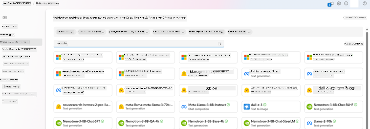
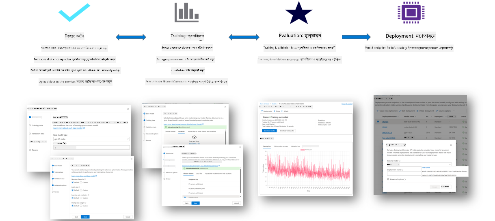
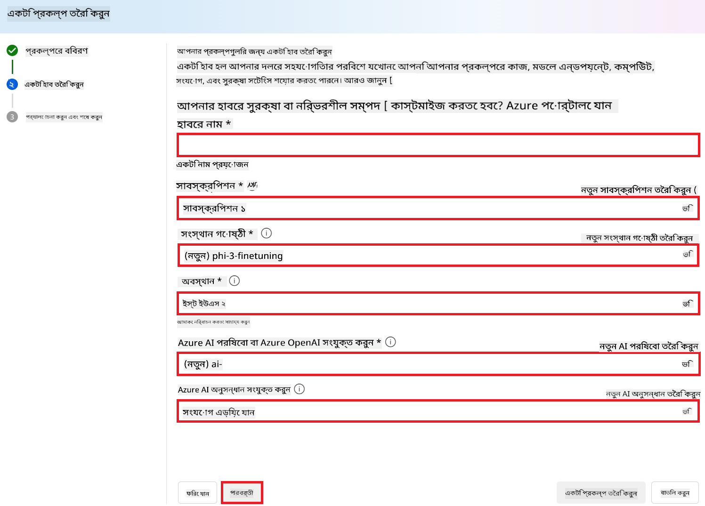
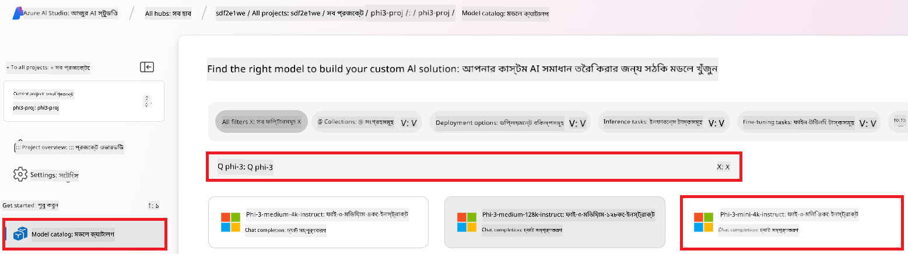
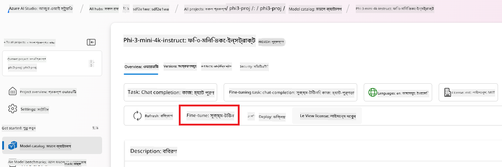
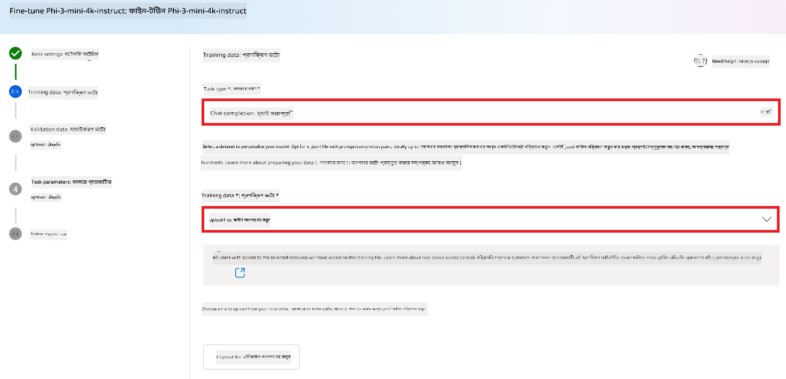
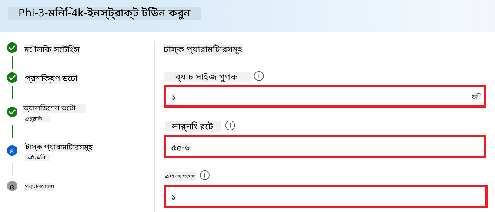
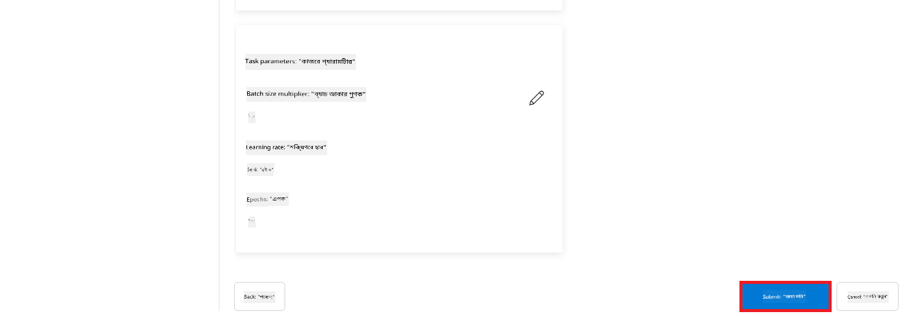
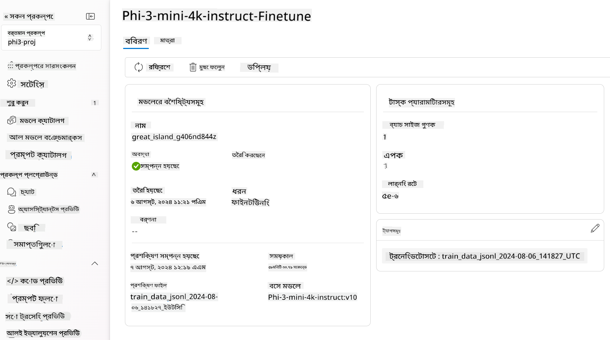

<!--
CO_OP_TRANSLATOR_METADATA:
{
  "original_hash": "c1559c5af6caccf6f623fd43a6b3a9a3",
  "translation_date": "2025-05-09T20:27:43+00:00",
  "source_file": "md/03.FineTuning/FineTuning_AIFoundry.md",
  "language_code": "bn"
}
-->
# Azure AI Foundry দিয়ে Phi-3 মডেল ফাইন-টিউনিং

আসুন দেখি কিভাবে Microsoft-এর Phi-3 Mini ভাষা মডেল Azure AI Foundry ব্যবহার করে ফাইন-টিউন করা যায়। ফাইন-টিউনিং এর মাধ্যমে Phi-3 Mini কে নির্দিষ্ট কাজের জন্য মানিয়ে নেওয়া যায়, যা এটিকে আরও শক্তিশালী এবং প্রসঙ্গ-সচেতন করে তোলে।

## বিবেচ্য বিষয়সমূহ

- **ক্ষমতা:** কোন কোন মডেল ফাইন-টিউন করা যায়? বেস মডেল দিয়ে কি কি কাজ করা সম্ভব?
- **খরচ:** ফাইন-টিউনিং এর মূল্য নির্ধারণ কেমন?
- **কাস্টমাইজেশন:** বেস মডেল কতটা পরিবর্তন করা যাবে – এবং কোন কোন উপায়ে?
- **সুবিধাজনকতা:** ফাইন-টিউনিং কিভাবে হয় – কি আমাকে নিজস্ব কোড লিখতে হবে? কি আমাকে নিজস্ব কম্পিউটিং রিসোর্স আনতে হবে?
- **নিরাপত্তা:** ফাইন-টিউন করা মডেলগুলোতে নিরাপত্তা ঝুঁকি থাকতে পারে – কি কি রক্ষাকবচ আছে যাতে অপ্রত্যাশিত ক্ষতি রোধ করা যায়?



## ফাইন-টিউনিং এর প্রস্তুতি

### পূর্বশর্তসমূহ

> [!NOTE]
> Phi-3 পরিবার মডেলগুলোর জন্য, pay-as-you-go মডেলে ফাইন-টিউনিং শুধুমাত্র **East US 2** অঞ্চলে তৈরি হাবের জন্য উপলব্ধ।

- একটি Azure সাবস্ক্রিপশন। যদি আপনার Azure সাবস্ক্রিপশন না থাকে, তাহলে শুরু করতে একটি [পেইড Azure অ্যাকাউন্ট](https://azure.microsoft.com/pricing/purchase-options/pay-as-you-go) তৈরি করুন।

- একটি [AI Foundry প্রকল্প](https://ai.azure.com?WT.mc_id=aiml-138114-kinfeylo)।
- Azure RBAC (Role-Based Access Control) ব্যবহার করে Azure AI Foundry এর অপারেশনগুলোর জন্য অনুমতি দেওয়া হয়। এই আর্টিকেলের ধাপগুলো অনুসরণ করার জন্য, আপনার ইউজার অ্যাকাউন্টকে __Azure AI Developer role__ রিসোর্স গ্রুপে অ্যাসাইন করতে হবে।

### সাবস্ক্রিপশন প্রোভাইডার রেজিস্ট্রেশন

সাবস্ক্রিপশনটি `Microsoft.Network` রিসোর্স প্রোভাইডারে রেজিস্টার করা আছে কি না যাচাই করুন।

1. [Azure পোর্টালে](https://portal.azure.com) সাইন ইন করুন।
1. বাম মেনু থেকে **Subscriptions** নির্বাচন করুন।
1. আপনার ব্যবহারের জন্য সাবস্ক্রিপশনটি নির্বাচন করুন।
1. বাম মেনু থেকে **AI project settings** > **Resource providers** নির্বাচন করুন।
1. নিশ্চিত করুন যে **Microsoft.Network** রিসোর্স প্রোভাইডার তালিকায় আছে। না থাকলে এটি যোগ করুন।

### ডেটা প্রস্তুতি

আপনার মডেল ফাইন-টিউন করার জন্য ট্রেনিং এবং ভ্যালিডেশন ডেটা প্রস্তুত করুন। আপনার ট্রেনিং ও ভ্যালিডেশন ডেটাসেটগুলো ইনপুট এবং আউটপুট উদাহরণ নিয়ে গঠিত, যেগুলো মডেলকে আপনি কিভাবে কাজ করতে চান তা নির্দেশ করে।

সব ট্রেনিং উদাহরণ অবশ্যই ইনফারেন্সের প্রত্যাশিত ফরম্যাটে থাকতে হবে। মডেলকে কার্যকরভাবে ফাইন-টিউন করতে, একটি সুষম এবং বৈচিত্র্যময় ডেটাসেট নিশ্চিত করুন।

এতে ডেটার ভারসাম্য রক্ষা, বিভিন্ন পরিস্থিতি অন্তর্ভুক্ত করা, এবং সময় সময় ট্রেনিং ডেটা পরিমার্জন করে বাস্তব বিশ্বের প্রত্যাশার সাথে সামঞ্জস্য রাখা অন্তর্ভুক্ত, যা মডেলের সঠিক এবং সুষম প্রতিক্রিয়ায় সাহায্য করে।

বিভিন্ন মডেল টাইপের জন্য ট্রেনিং ডেটার ফরম্যাট ভিন্ন হতে পারে।

### Chat Completion

আপনি যে ট্রেনিং ও ভ্যালিডেশন ডেটা ব্যবহার করবেন তা অবশ্যই JSON Lines (JSONL) ফরম্যাটে হতে হবে। `Phi-3-mini-128k-instruct` এর জন্য ফাইন-টিউনিং ডেটাসেট অবশ্যই Chat completions API-তে ব্যবহৃত কথোপকথনের ফরম্যাটে হতে হবে।

### উদাহরণ ফাইল ফরম্যাট

```json
    {"messages": [{"role": "system", "content": "You are an Xbox customer support agent whose primary goal is to help users with issues they are experiencing with their Xbox devices. You are friendly and concise. You only provide factual answers to queries, and do not provide answers that are not related to Xbox."}, {"role": "user", "content": "Is Xbox better than PlayStation?"}, {"role": "assistant", "content": "I apologize, but I cannot provide personal opinions. My primary job is to assist you with any issues related to your Xbox device. Do you have any Xbox-related issues that need addressing?"}]}
    {"messages": [{"role": "system", "content": "You are an Xbox customer support agent whose primary goal is to help users with issues they are experiencing with their Xbox devices. You are friendly and concise. You only provide factual answers to queries, and do not provide answers that are not related to Xbox."}, {"role": "user", "content": "Can I play PC games on my Xbox?"}, {"role": "assistant", "content": "While Xbox consoles don't natively support PC games, they can play an array of Xbox games, many of which are also available on PC. Can I assist you with finding games compatible with your Xbox device?"}]}
    {"messages": [{"role": "system", "content": "You are an Xbox customer support agent whose primary goal is to help users with issues they are experiencing with their Xbox devices. You are friendly and concise. You only provide factual answers to queries, and do not provide answers that are not related to Xbox."}, {"role": "user", "content": "I'm having trouble connecting my Xbox to the Wi-Fi."}, {"role": "assistant", "content": "No worries, let's go through the network settings on your Xbox. Can you please tell me what happens when you try to connect it to the Wi-Fi?"}]}
```

সমর্থিত ফাইল টাইপ JSON Lines। ফাইলগুলো ডিফল্ট ডেটাস্টোরে আপলোড করা হয় এবং আপনার প্রকল্পে উপলব্ধ হয়।

## Azure AI Foundry দিয়ে Phi-3 ফাইন-টিউনিং

Azure AI Foundry আপনাকে বড় ভাষা মডেলগুলোকে আপনার নিজস্ব ডেটাসেট অনুযায়ী মানিয়ে নেওয়ার সুযোগ দেয়, যাকে ফাইন-টিউনিং বলা হয়। ফাইন-টিউনিং বিশেষ করে নির্দিষ্ট কাজ ও অ্যাপ্লিকেশনের জন্য কাস্টমাইজেশন ও অপ্টিমাইজেশনের মাধ্যমে উল্লেখযোগ্য সুবিধা দেয়। এর ফলে কর্মক্ষমতা উন্নত হয়, খরচ কমে, ল্যাটেন্সি কমে এবং আউটপুট কাস্টমাইজড হয়।



### নতুন প্রকল্প তৈরি করুন

1. [Azure AI Foundry](https://ai.azure.com) এ সাইন ইন করুন।

1. Azure AI Foundry-তে নতুন প্রকল্প তৈরি করতে **+New project** নির্বাচন করুন।

    

1. নিম্নলিখিত কাজগুলো করুন:

    - প্রকল্পের **Hub name** দিন। এটি অবশ্যই অনন্য হতে হবে।
    - ব্যবহার করার জন্য **Hub** নির্বাচন করুন (প্রয়োজনে নতুন তৈরি করুন)।

    

1. নতুন হাব তৈরি করতে নিম্নলিখিত কাজগুলো করুন:

    - **Hub name** দিন। এটি অবশ্যই অনন্য হতে হবে।
    - আপনার Azure **Subscription** নির্বাচন করুন।
    - ব্যবহার করার জন্য **Resource group** নির্বাচন করুন (প্রয়োজনে নতুন তৈরি করুন)।
    - আপনি যে **Location** ব্যবহার করতে চান তা নির্বাচন করুন।
    - ব্যবহার করার জন্য **Connect Azure AI Services** নির্বাচন করুন (প্রয়োজনে নতুন তৈরি করুন)।
    - **Connect Azure AI Search** এ **Skip connecting** নির্বাচন করুন।

    

1. **Next** নির্বাচন করুন।
1. **Create a project** নির্বাচন করুন।

### ডেটা প্রস্তুতি

ফাইন-টিউনিং এর আগে, আপনার কাজের সাথে সম্পর্কিত একটি ডেটাসেট সংগ্রহ করুন বা তৈরি করুন, যেমন চ্যাট নির্দেশনা, প্রশ্ন-উত্তর জোড়া, বা অন্য কোনো প্রাসঙ্গিক টেক্সট ডেটা। এই ডেটা পরিষ্কার করুন এবং প্রিপ্রসেস করুন যেমন অবাঞ্ছিত শব্দ সরানো, অনুপস্থিত মান হ্যান্ডল করা, এবং টোকেনাইজ করা।

### Azure AI Foundry-তে Phi-3 মডেল ফাইন-টিউন করুন

> [!NOTE]
> Phi-3 মডেল ফাইন-টিউন বর্তমানে শুধুমাত্র East US 2 অঞ্চলের প্রকল্পগুলোর জন্য সমর্থিত।

1. বাম পাশের ট্যাব থেকে **Model catalog** নির্বাচন করুন।

1. **search bar** এ *phi-3* টাইপ করুন এবং আপনার প্রয়োজনীয় phi-3 মডেল নির্বাচন করুন।

    

1. **Fine-tune** নির্বাচন করুন।

    

1. **Fine-tuned model name** লিখুন।

    

1. **Next** নির্বাচন করুন।

1. নিম্নলিখিত কাজগুলো করুন:

    - **task type** হিসেবে **Chat completion** নির্বাচন করুন।
    - ব্যবহার করার জন্য **Training data** নির্বাচন করুন। এটি Azure AI Foundry এর ডেটা থেকে বা আপনার লোকাল পরিবেশ থেকে আপলোড করতে পারেন।

    

1. **Next** নির্বাচন করুন।

1. ব্যবহার করার জন্য **Validation data** আপলোড করুন অথবা **Automatic split of training data** নির্বাচন করুন।

    

1. **Next** নির্বাচন করুন।

1. নিম্নলিখিত কাজগুলো করুন:

    - ব্যবহার করার জন্য **Batch size multiplier** নির্বাচন করুন।
    - ব্যবহার করার জন্য **Learning rate** নির্বাচন করুন।
    - ব্যবহার করার জন্য **Epochs** নির্বাচন করুন।

    

1. ফাইন-টিউনিং শুরু করতে **Submit** নির্বাচন করুন।

    

1. আপনার মডেল ফাইন-টিউন হয়ে গেলে স্ট্যাটাস **Completed** দেখাবে, নিচের ছবির মত। এখন আপনি মডেলটি ডিপ্লয় করতে পারেন এবং আপনার নিজস্ব অ্যাপ্লিকেশন, প্লে গ্রাউন্ড বা প্রম্পট ফ্লোতে ব্যবহার করতে পারেন। বিস্তারিত জানার জন্য দেখুন [How to deploy Phi-3 family of small language models with Azure AI Foundry](https://learn.microsoft.com/azure/ai-studio/how-to/deploy-models-phi-3?tabs=phi-3-5&pivots=programming-language-python)।

    

> [!NOTE]
> Phi-3 ফাইন-টিউন সম্পর্কে আরও বিস্তারিত জানতে, দেখুন [Fine-tune Phi-3 models in Azure AI Foundry](https://learn.microsoft.com/azure/ai-studio/how-to/fine-tune-phi-3?tabs=phi-3-mini)।

## আপনার ফাইন-টিউন করা মডেলগুলো পরিষ্কার করা

[Azure AI Foundry](https://ai.azure.com) এর ফাইন-টিউন মডেল তালিকা থেকে বা মডেল ডিটেইলস পেজ থেকে ফাইন-টিউন করা মডেল মুছে ফেলতে পারেন। ফাইন-টিউন পেজ থেকে মুছে ফেলতে চান এমন মডেলটি নির্বাচন করুন, তারপর Delete বাটন চাপুন।

> [!NOTE]
> যদি আপনার কাস্টম মডেলের ডিপ্লয়মেন্ট থাকে, তাহলে আপনি মডেলটি মুছে ফেলতে পারবেন না। প্রথমে আপনার মডেল ডিপ্লয়মেন্ট মুছে ফেলতে হবে।

## খরচ ও কোটা

### Phi-3 মডেল ফাইন-টিউনিং সার্ভিস হিসেবে ব্যবহারের জন্য খরচ ও কোটা

Phi মডেলগুলো মাইক্রোসফটের পক্ষ থেকে সার্ভিস হিসেবে প্রদান করা হয় এবং Azure AI Foundry এর সাথে ইন্টিগ্রেটেড। মডেল ডিপ্লয় বা ফাইন-টিউন করার সময় প্রাইসিং দেখতে পারেন ডিপ্লয়মেন্ট উইজার এর Pricing and terms ট্যাবে।

## কন্টেন্ট ফিল্টারিং

Pay-as-you-go সার্ভিস হিসেবে ডিপ্লয় করা মডেলগুলো Azure AI Content Safety দ্বারা সুরক্ষিত। রিয়েল-টাইম এন্ডপয়েন্টে ডিপ্লয় করলে আপনি এই ফিচারটি অপ্ট আউট করতে পারেন। Azure AI Content Safety সক্রিয় থাকলে, প্রম্পট এবং কমপ্লিশন উভয়ই একটি শ্রেণীবিভাগ মডেলের সমন্বিত ব্যবস্থার মধ্য দিয়ে যায়, যা ক্ষতিকর কন্টেন্ট সনাক্ত ও প্রতিরোধ করে। এই কন্টেন্ট ফিল্টারিং সিস্টেম ইনপুট প্রম্পট এবং আউটপুট কমপ্লিশনের সম্ভাব্য ক্ষতিকর বিষয়বস্তুর জন্য নির্দিষ্ট ক্যাটাগরি শনাক্ত করে এবং ব্যবস্থা নেয়। আরও জানুন [Azure AI Content Safety](https://learn.microsoft.com/azure/ai-studio/concepts/content-filtering)।

**ফাইন-টিউনিং কনফিগারেশন**

হাইপারপ্যারামিটার: লার্নিং রেট, ব্যাচ সাইজ, এবং ট্রেনিং ইপোক্সের সংখ্যা নির্ধারণ করুন।

**লস ফাংশন**

আপনার কাজের জন্য উপযুক্ত লস ফাংশন নির্বাচন করুন (যেমন, ক্রস-এন্ট্রপি)।

**অপ্টিমাইজার**

ট্রেনিংয়ের সময় গ্রেডিয়েন্ট আপডেটের জন্য অপ্টিমাইজার নির্বাচন করুন (যেমন, Adam)।

**ফাইন-টিউনিং প্রসেস**

- প্রি-ট্রেইনড মডেল লোড করুন: Phi-3 Mini চেকপয়েন্ট লোড করুন।
- কাস্টম লেয়ার যোগ করুন: কাজের জন্য নির্দিষ্ট লেয়ার যোগ করুন (যেমন, চ্যাট নির্দেশনার জন্য ক্লাসিফিকেশন হেড)।

**মডেল ট্রেনিং**

আপনার প্রস্তুতকৃত ডেটাসেট ব্যবহার করে মডেল ফাইন-টিউন করুন। ট্রেনিং অগ্রগতি মনিটর করুন এবং প্রয়োজন অনুযায়ী হাইপারপ্যারামিটার সামঞ্জস্য করুন।

**মূল্যায়ন ও ভ্যালিডেশন**

ভ্যালিডেশন সেট: আপনার ডেটাকে ট্রেনিং ও ভ্যালিডেশন সেটে ভাগ করুন।

**পারফরম্যান্স মূল্যায়ন**

মডেলের পারফরম্যান্স মূল্যায়নের জন্য accuracy, F1-score, অথবা perplexity এর মতো মেট্রিক ব্যবহার করুন।

## ফাইন-টিউন করা মডেল সংরক্ষণ

**চেকপয়েন্ট**

ভবিষ্যতে ব্যবহারের জন্য ফাইন-টিউন করা মডেলের চেকপয়েন্ট সংরক্ষণ করুন।

## ডিপ্লয়মেন্ট

- ওয়েব সার্ভিস হিসেবে ডিপ্লয় করুন: Azure AI Foundry তে আপনার ফাইন-টিউন করা মডেল ওয়েব সার্ভিস হিসেবে ডিপ্লয় করুন।
- এন্ডপয়েন্ট পরীক্ষা করুন: ডিপ্লয় করা এন্ডপয়েন্টে টেস্ট কোয়েরি পাঠিয়ে এর কার্যকারিতা যাচাই করুন।

## পুনরাবৃত্তি এবং উন্নয়ন

পুনরাবৃত্তি: যদি পারফরম্যান্স সন্তোষজনক না হয়, তাহলে হাইপারপ্যারামিটার পরিবর্তন, আরও ডেটা যোগ করা, অথবা অতিরিক্ত ইপোকের জন্য ফাইন-টিউনিং করুন।

## মনিটরিং এবং পরিমার্জন

মডেলের আচরণ ধারাবাহিকভাবে মনিটর করুন এবং প্রয়োজন অনুযায়ী পরিমার্জন করুন।

## কাস্টমাইজ এবং সম্প্রসারণ

কাস্টম কাজ: Phi-3 Mini কে চ্যাট নির্দেশনার বাইরে বিভিন্ন কাজে ফাইন-টিউন করা যায়। অন্য ব্যবহার ক্ষেত্রগুলো অন্বেষণ করুন!
পরীক্ষা-নিরীক্ষা: পারফরম্যান্স উন্নয়নের জন্য বিভিন্ন আর্কিটেকচার, লেয়ার কম্বিনেশন, এবং টেকনিক চেষ্টা করুন।

> [!NOTE]
> ফাইন-টিউনিং একটি পুনরাবৃত্তিমূলক প্রক্রিয়া। পরীক্ষা করুন, শিখুন এবং আপনার মডেলকে আপনার নির্দিষ্ট কাজের জন্য সেরা ফলাফল অর্জনের জন্য মানিয়ে নিন!

**অস্বীকৃতি**:  
এই নথিটি AI অনুবাদ সেবা [Co-op Translator](https://github.com/Azure/co-op-translator) ব্যবহার করে অনূদিত হয়েছে। আমরা যথাসাধ্য সঠিকতার চেষ্টা করি, তবে দয়া করে মনে রাখবেন যে স্বয়ংক্রিয় অনুবাদে ভুল বা অসঙ্গতি থাকতে পারে। মূল নথিটি তার স্বদেশী ভাষায়ই কর্তৃত্বপূর্ণ উৎস হিসেবে বিবেচিত হওয়া উচিত। গুরুত্বপূর্ণ তথ্যের জন্য পেশাদার মানব অনুবাদের পরামর্শ দেওয়া হয়। এই অনুবাদের ব্যবহারে সৃষ্ট কোনও ভুল বোঝাবুঝি বা ভুল ব্যাখ্যার জন্য আমরা দায়ী নই।