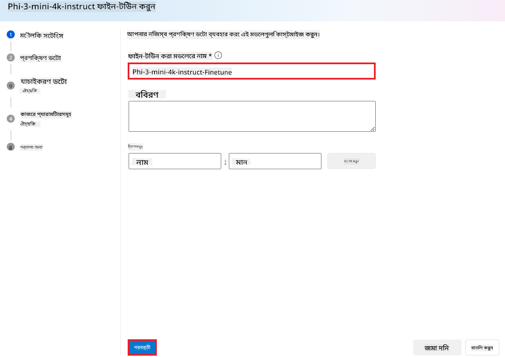

<!--
CO_OP_TRANSLATOR_METADATA:
{
  "original_hash": "c1559c5af6caccf6f623fd43a6b3a9a3",
  "translation_date": "2025-07-17T05:59:59+00:00",
  "source_file": "md/03.FineTuning/FineTuning_AIFoundry.md",
  "language_code": "bn"
}
-->
# Azure AI Foundry দিয়ে Phi-3 ফাইন-টিউনিং

চলুন দেখি কিভাবে Microsoft-এর Phi-3 Mini ভাষা মডেলকে Azure AI Foundry ব্যবহার করে ফাইন-টিউন করা যায়। ফাইন-টিউনিংয়ের মাধ্যমে আপনি Phi-3 Mini কে নির্দিষ্ট কাজের জন্য মানিয়ে নিতে পারেন, যা এটিকে আরও শক্তিশালী এবং প্রসঙ্গ-সচেতন করে তোলে।

## বিবেচ্য বিষয়সমূহ

- **ক্ষমতা:** কোন মডেলগুলো ফাইন-টিউন করা যায়? বেস মডেলকে কোন কাজের জন্য ফাইন-টিউন করা সম্ভব?
- **খরচ:** ফাইন-টিউনিংয়ের মূল্য নির্ধারণ কেমন?
- **কাস্টমাইজেশন:** বেস মডেল কতটা পরিবর্তন করা যাবে – এবং কীভাবে?
- **সুবিধা:** ফাইন-টিউনিং আসলে কীভাবে হয় – কি আমাকে নিজে কোড লিখতে হবে? নিজস্ব কম্পিউটিং আনতে হবে?
- **নিরাপত্তা:** ফাইন-টিউন করা মডেলগুলোতে নিরাপত্তা ঝুঁকি থাকে – কি কোনো সুরক্ষা ব্যবস্থা আছে যাতে অনিচ্ছাকৃত ক্ষতি থেকে রক্ষা পাওয়া যায়?


## ফাইন-টিউনিংয়ের প্রস্তুতি

### পূর্বশর্ত

> [!NOTE]
> Phi-3 পরিবারের মডেলগুলোর জন্য, pay-as-you-go মডেলে ফাইন-টিউনিং শুধুমাত্র **East US 2** অঞ্চলে তৈরি হাবগুলোর জন্য উপলব্ধ।

- একটি Azure সাবস্ক্রিপশন। যদি আপনার Azure সাবস্ক্রিপশন না থাকে, তাহলে শুরু করতে একটি [পেইড Azure অ্যাকাউন্ট](https://azure.microsoft.com/pricing/purchase-options/pay-as-you-go) তৈরি করুন।

- একটি [AI Foundry প্রকল্প](https://ai.azure.com?WT.mc_id=aiml-138114-kinfeylo)।
- Azure রোল-ভিত্তিক অ্যাক্সেস কন্ট্রোল (Azure RBAC) ব্যবহার করে Azure AI Foundry-তে অপারেশন করার অনুমতি দেওয়া হয়। এই আর্টিকেলের ধাপগুলো সম্পাদনের জন্য, আপনার ইউজার অ্যাকাউন্টকে __Azure AI Developer রোল__ রিসোর্স গ্রুপে অ্যাসাইন করা থাকতে হবে।

### সাবস্ক্রিপশন প্রোভাইডার রেজিস্ট্রেশন

সাবস্ক্রিপশনটি `Microsoft.Network` রিসোর্স প্রোভাইডারে রেজিস্টার করা আছে কিনা যাচাই করুন।

1. [Azure পোর্টালে](https://portal.azure.com) সাইন ইন করুন।
2. বাম মেনু থেকে **Subscriptions** নির্বাচন করুন।
3. আপনি যে সাবস্ক্রিপশন ব্যবহার করতে চান তা নির্বাচন করুন।
4. বাম মেনু থেকে **AI project settings** > **Resource providers** নির্বাচন করুন।
5. নিশ্চিত করুন যে **Microsoft.Network** রিসোর্স প্রোভাইডার তালিকায় আছে। না থাকলে এটি যোগ করুন।

### ডেটা প্রস্তুতি

আপনার মডেল ফাইন-টিউন করার জন্য ট্রেনিং এবং ভ্যালিডেশন ডেটা প্রস্তুত করুন। আপনার ট্রেনিং ও ভ্যালিডেশন ডেটাসেটগুলো ইনপুট এবং আউটপুট উদাহরণ নিয়ে গঠিত, যা মডেলকে কিভাবে কাজ করতে হবে তা নির্দেশ করে।

সুনিশ্চিত করুন যে আপনার সব ট্রেনিং উদাহরণ ইনফারেন্সের প্রত্যাশিত ফরম্যাট অনুসরণ করে। মডেলকে কার্যকরভাবে ফাইন-টিউন করতে, একটি সুষম এবং বৈচিত্র্যময় ডেটাসেট থাকা জরুরি।

এতে ডেটার ভারসাম্য বজায় রাখা, বিভিন্ন পরিস্থিতি অন্তর্ভুক্ত করা, এবং সময় সময় ট্রেনিং ডেটা পরিমার্জন করে বাস্তব বিশ্বের প্রত্যাশার সাথে সামঞ্জস্য রাখা অন্তর্ভুক্ত, যা মডেলের সঠিকতা এবং ভারসাম্যপূর্ণ প্রতিক্রিয়া নিশ্চিত করে।

বিভিন্ন মডেল টাইপের জন্য ট্রেনিং ডেটার ফরম্যাট আলাদা হতে পারে।

### চ্যাট কমপ্লিশন

আপনি যে ট্রেনিং এবং ভ্যালিডেশন ডেটা ব্যবহার করবেন তা অবশ্যই JSON Lines (JSONL) ফরম্যাটে হতে হবে। `Phi-3-mini-128k-instruct` এর জন্য ফাইন-টিউনিং ডেটাসেট অবশ্যই চ্যাট কমপ্লিশন API-তে ব্যবহৃত কথোপকথনের ফরম্যাটে হতে হবে।

### উদাহরণ ফাইল ফরম্যাট

```json
    {"messages": [{"role": "system", "content": "You are an Xbox customer support agent whose primary goal is to help users with issues they are experiencing with their Xbox devices. You are friendly and concise. You only provide factual answers to queries, and do not provide answers that are not related to Xbox."}, {"role": "user", "content": "Is Xbox better than PlayStation?"}, {"role": "assistant", "content": "I apologize, but I cannot provide personal opinions. My primary job is to assist you with any issues related to your Xbox device. Do you have any Xbox-related issues that need addressing?"}]}
    {"messages": [{"role": "system", "content": "You are an Xbox customer support agent whose primary goal is to help users with issues they are experiencing with their Xbox devices. You are friendly and concise. You only provide factual answers to queries, and do not provide answers that are not related to Xbox."}, {"role": "user", "content": "Can I play PC games on my Xbox?"}, {"role": "assistant", "content": "While Xbox consoles don't natively support PC games, they can play an array of Xbox games, many of which are also available on PC. Can I assist you with finding games compatible with your Xbox device?"}]}
    {"messages": [{"role": "system", "content": "You are an Xbox customer support agent whose primary goal is to help users with issues they are experiencing with their Xbox devices. You are friendly and concise. You only provide factual answers to queries, and do not provide answers that are not related to Xbox."}, {"role": "user", "content": "I'm having trouble connecting my Xbox to the Wi-Fi."}, {"role": "assistant", "content": "No worries, let's go through the network settings on your Xbox. Can you please tell me what happens when you try to connect it to the Wi-Fi?"}]}
```

সমর্থিত ফাইল টাইপ হলো JSON Lines। ফাইলগুলো ডিফল্ট ডেটাস্টোরে আপলোড করা হয় এবং আপনার প্রকল্পে উপলব্ধ হয়।

## Azure AI Foundry দিয়ে Phi-3 ফাইন-টিউনিং

Azure AI Foundry আপনাকে বড় ভাষা মডেলগুলোকে আপনার নিজস্ব ডেটাসেট অনুযায়ী মানিয়ে নিতে দেয়, যাকে ফাইন-টিউনিং বলা হয়। ফাইন-টিউনিং বিশেষ কাজ এবং অ্যাপ্লিকেশনের জন্য কাস্টমাইজেশন ও অপ্টিমাইজেশন সম্ভব করে, যা উন্নত পারফরম্যান্স, খরচ সাশ্রয়, কম লেটেন্সি এবং ব্যক্তিগতকৃত আউটপুট নিশ্চিত করে।


### নতুন প্রকল্প তৈরি করুন

1. [Azure AI Foundry](https://ai.azure.com) তে সাইন ইন করুন।

2. Azure AI Foundry-তে নতুন প্রকল্প তৈরি করতে **+New project** নির্বাচন করুন।

    

3. নিম্নলিখিত কাজগুলো করুন:

    - প্রকল্পের **Hub name** দিন। এটি অবশ্যই ইউনিক হতে হবে।
    - ব্যবহার করার **Hub** নির্বাচন করুন (প্রয়োজনে নতুন তৈরি করুন)।

    

4. নতুন হাব তৈরি করতে নিম্নলিখিত কাজগুলো করুন:

    - **Hub name** লিখুন। এটি অবশ্যই ইউনিক হতে হবে।
    - আপনার Azure **Subscription** নির্বাচন করুন।
    - ব্যবহার করার **Resource group** নির্বাচন করুন (প্রয়োজনে নতুন তৈরি করুন)।
    - ব্যবহার করার **Location** নির্বাচন করুন।
    - ব্যবহার করার **Connect Azure AI Services** নির্বাচন করুন (প্রয়োজনে নতুন তৈরি করুন)।
    - **Connect Azure AI Search** এ **Skip connecting** নির্বাচন করুন।

    

5. **Next** নির্বাচন করুন।
6. **Create a project** নির্বাচন করুন।

### ডেটা প্রস্তুতি

ফাইন-টিউনিংয়ের আগে, আপনার কাজের সাথে সম্পর্কিত ডেটাসেট সংগ্রহ বা তৈরি করুন, যেমন চ্যাট নির্দেশনা, প্রশ্ন-উত্তর জোড়া, বা অন্য কোনো প্রাসঙ্গিক টেক্সট ডেটা। এই ডেটা পরিষ্কার করুন, যেমন শব্দ দূর করা, অনুপস্থিত মান হ্যান্ডেল করা, এবং টোকেনাইজ করা।

### Azure AI Foundry-তে Phi-3 মডেল ফাইন-টিউনিং

> [!NOTE]
> Phi-3 মডেলগুলোর ফাইন-টিউনিং বর্তমানে শুধুমাত্র East US 2 অঞ্চলের প্রকল্পে সমর্থিত।

1. বাম পাশের ট্যাব থেকে **Model catalog** নির্বাচন করুন।

2. **search bar**-এ *phi-3* টাইপ করুন এবং আপনি যে phi-3 মডেলটি ব্যবহার করতে চান তা নির্বাচন করুন।

    

3. **Fine-tune** নির্বাচন করুন।

    

4. **Fine-tuned model name** লিখুন।

    

5. **Next** নির্বাচন করুন।

6. নিম্নলিখিত কাজগুলো করুন:

    - **task type** হিসেবে **Chat completion** নির্বাচন করুন।
    - আপনি যে **Training data** ব্যবহার করতে চান তা নির্বাচন করুন। Azure AI Foundry এর ডেটা থেকে বা আপনার লোকাল পরিবেশ থেকে আপলোড করতে পারেন।

    

7. **Next** নির্বাচন করুন।

8. আপনি যে **Validation data** ব্যবহার করতে চান তা আপলোড করুন, অথবা **Automatic split of training data** নির্বাচন করুন।

    

9. **Next** নির্বাচন করুন।

10. নিম্নলিখিত কাজগুলো করুন:

    - আপনি যে **Batch size multiplier** ব্যবহার করতে চান তা নির্বাচন করুন।
    - আপনি যে **Learning rate** ব্যবহার করতে চান তা নির্বাচন করুন।
    - আপনি যে **Epochs** ব্যবহার করতে চান তা নির্বাচন করুন।

    

11. ফাইন-টিউনিং প্রক্রিয়া শুরু করতে **Submit** নির্বাচন করুন।

    

12. আপনার মডেল ফাইন-টিউন হয়ে গেলে, স্ট্যাটাস **Completed** হিসেবে দেখাবে, নিচের ছবির মতো। এখন আপনি মডেলটি ডিপ্লয় করতে পারেন এবং আপনার নিজস্ব অ্যাপ্লিকেশন, প্লেগ্রাউন্ড, বা প্রম্পট ফ্লোতে ব্যবহার করতে পারেন। আরও তথ্যের জন্য দেখুন [How to deploy Phi-3 family of small language models with Azure AI Foundry](https://learn.microsoft.com/azure/ai-studio/how-to/deploy-models-phi-3?tabs=phi-3-5&pivots=programming-language-python)।

    

> [!NOTE]
> Phi-3 ফাইন-টিউনিং সম্পর্কে বিস্তারিত জানতে, দেখুন [Fine-tune Phi-3 models in Azure AI Foundry](https://learn.microsoft.com/azure/ai-studio/how-to/fine-tune-phi-3?tabs=phi-3-mini)।

## আপনার ফাইন-টিউন করা মডেলগুলো পরিষ্কার করা

আপনি [Azure AI Foundry](https://ai.azure.com) এর ফাইন-টিউনিং মডেল তালিকা থেকে বা মডেল ডিটেইলস পেজ থেকে ফাইন-টিউন করা মডেল মুছে ফেলতে পারেন। ফাইন-টিউনিং পেজ থেকে মুছে ফেলতে চান এমন মডেলটি নির্বাচন করুন, তারপর Delete বাটন চাপুন।

> [!NOTE]
> যদি কোনো কাস্টম মডেলের ডিপ্লয়মেন্ট থাকে, তাহলে আপনি সেটি সরিয়ে না নেওয়া পর্যন্ত মডেলটি মুছে ফেলতে পারবেন না। প্রথমে মডেল ডিপ্লয়মেন্ট মুছে ফেলতে হবে।

## খরচ এবং কোটা

### Phi-3 মডেল ফাইন-টিউনিং সার্ভিস হিসেবে খরচ ও কোটা বিবেচনা

Phi মডেলগুলো মাইক্রোসফট দ্বারা সার্ভিস হিসেবে ফাইন-টিউন করা হয় এবং Azure AI Foundry এর সাথে ইন্টিগ্রেটেড। মডেল ডিপ্লয় বা ফাইন-টিউন করার সময় মূল্য নির্ধারণ ডিপ্লয়মেন্ট উইজার্ডের Pricing and terms ট্যাবে পাওয়া যাবে।

## কনটেন্ট ফিল্টারিং

Pay-as-you-go সার্ভিস হিসেবে ডিপ্লয় করা মডেলগুলো Azure AI Content Safety দ্বারা সুরক্ষিত। রিয়েল-টাইম এন্ডপয়েন্টে ডিপ্লয় করলে আপনি এই ফিচারটি বন্ধ করতে পারেন। Azure AI Content Safety সক্রিয় থাকলে, প্রম্পট এবং কমপ্লিশন উভয়ই একটি শ্রেণীবিন্যাস মডেল সমন্বয়ের মাধ্যমে যাচাই করা হয়, যা ক্ষতিকর কনটেন্ট সনাক্ত ও প্রতিরোধ করে। কনটেন্ট ফিল্টারিং সিস্টেম ইনপুট প্রম্পট এবং আউটপুট কমপ্লিশনে সম্ভাব্য ক্ষতিকর কনটেন্টের নির্দিষ্ট ক্যাটাগরি সনাক্ত করে এবং প্রয়োজনীয় ব্যবস্থা নেয়। আরও জানুন [Azure AI Content Safety](https://learn.microsoft.com/azure/ai-studio/concepts/content-filtering)।

**ফাইন-টিউনিং কনফিগারেশন**

হাইপারপ্যারামিটার: লার্নিং রেট, ব্যাচ সাইজ, এবং ট্রেনিং ইপোকের সংখ্যা নির্ধারণ করুন।

**লস ফাংশন**

আপনার কাজের জন্য উপযুক্ত লস ফাংশন নির্বাচন করুন (যেমন, ক্রস-এন্ট্রপি)।

**অপ্টিমাইজার**

ট্রেনিং চলাকালীন গ্রেডিয়েন্ট আপডেটের জন্য অপ্টিমাইজার নির্বাচন করুন (যেমন, Adam)।

**ফাইন-টিউনিং প্রক্রিয়া**

- প্রি-ট্রেইনড মডেল লোড করুন: Phi-3 Mini চেকপয়েন্ট লোড করুন।
- কাস্টম লেয়ার যোগ করুন: কাজ-নির্দিষ্ট লেয়ার যোগ করুন (যেমন, চ্যাট নির্দেশনার জন্য ক্লাসিফিকেশন হেড)।

**মডেল ট্রেনিং**

আপনার প্রস্তুতকৃত ডেটাসেট ব্যবহার করে মডেল ফাইন-টিউন করুন। ট্রেনিং প্রগ্রেস মনিটর করুন এবং প্রয়োজন অনুযায়ী হাইপারপ্যারামিটার সামঞ্জস্য করুন।

**মূল্যায়ন ও ভ্যালিডেশন**

ভ্যালিডেশন সেট: আপনার ডেটা ট্রেনিং এবং ভ্যালিডেশন সেটে ভাগ করুন।

**পারফরম্যান্স মূল্যায়ন**

মডেলের পারফরম্যান্স মূল্যায়নের জন্য accuracy, F1-score, বা perplexity এর মতো মেট্রিক ব্যবহার করুন।

## ফাইন-টিউন করা মডেল সংরক্ষণ

**চেকপয়েন্ট**

ভবিষ্যতে ব্যবহারের জন্য ফাইন-টিউন করা মডেলের চেকপয়েন্ট সংরক্ষণ করুন।

## ডিপ্লয়মেন্ট

- ওয়েব সার্ভিস হিসেবে ডিপ্লয় করুন: Azure AI Foundry-তে আপনার ফাইন-টিউন করা মডেল ওয়েব সার্ভিস হিসেবে ডিপ্লয় করুন।
- এন্ডপয়েন্ট পরীক্ষা করুন: ডিপ্লয় করা এন্ডপয়েন্টে টেস্ট কোয়েরি পাঠিয়ে এর কার্যকারিতা যাচাই করুন।

## পুনরাবৃত্তি ও উন্নয়ন

পুনরাবৃত্তি: যদি পারফরম্যান্স সন্তোষজনক না হয়, তাহলে হাইপারপ্যারামিটার পরিবর্তন, আরও ডেটা যোগ, বা অতিরিক্ত ইপোক ফাইন-টিউনিং করে পুনরাবৃত্তি করুন।

## মনিটরিং ও পরিমার্জন

মডেলের আচরণ ক্রমাগত পর্যবেক্ষণ করুন এবং প্রয়োজন অনুযায়ী পরিমার্জন করুন।

## কাস্টমাইজ ও সম্প্রসারণ

কাস্টম কাজ: Phi-3 Mini কে চ্যাট নির্দেশনার বাইরে বিভিন্ন কাজে ফাইন-টিউন করা যায়। অন্যান্য ব্যবহার ক্ষেত্র অন্বেষণ করুন!
পরীক্ষা-নিরীক্ষা: পারফরম্যান্স উন্নয়নের জন্য বিভিন্ন আর্কিটেকচার, লেয়ার কম্বিনেশন, এবং কৌশল প্রয়োগ করুন।

> [!NOTE]
> ফাইন-টিউনিং একটি পুনরাবৃত্তিমূলক প্রক্রিয়া। পরীক্ষা করুন, শিখুন, এবং আপনার মডেলকে মানিয়ে নিন যাতে আপনার নির্দিষ্ট কাজের জন্য সেরা ফলাফল পাওয়া যায়!

**অস্বীকৃতি**:  
এই নথিটি AI অনুবাদ সেবা [Co-op Translator](https://github.com/Azure/co-op-translator) ব্যবহার করে অনূদিত হয়েছে। আমরা যথাসাধ্য সঠিকতার চেষ্টা করি, তবে স্বয়ংক্রিয় অনুবাদে ত্রুটি বা অসঙ্গতি থাকতে পারে। মূল নথিটি তার নিজস্ব ভাষায়ই কর্তৃত্বপূর্ণ উৎস হিসেবে বিবেচিত হওয়া উচিত। গুরুত্বপূর্ণ তথ্যের জন্য পেশাদার মানব অনুবাদ গ্রহণ করার পরামর্শ দেওয়া হয়। এই অনুবাদের ব্যবহারে সৃষ্ট কোনো ভুল বোঝাবুঝি বা ভুল ব্যাখ্যার জন্য আমরা দায়ী নই।