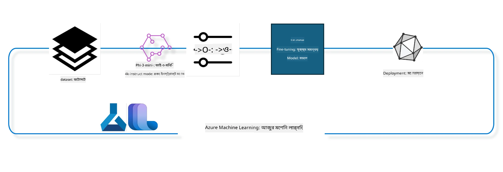

<!--
CO_OP_TRANSLATOR_METADATA:
{
  "original_hash": "944949f040e61b2ea25b3460f7394fd4",
  "translation_date": "2025-07-17T07:10:49+00:00",
  "source_file": "md/03.FineTuning/FineTuning_MLSDK.md",
  "language_code": "bn"
}
-->
## Azure ML সিস্টেম রেজিস্ট্রি থেকে chat-completion কম্পোনেন্ট ব্যবহার করে মডেল ফাইন টিউন করার পদ্ধতি

এই উদাহরণে আমরা Phi-3-mini-4k-instruct মডেলটি ultrachat_200k ডেটাসেট ব্যবহার করে দুইজনের মধ্যে কথোপকথন সম্পন্ন করার জন্য ফাইন টিউন করব।



এই উদাহরণটি দেখাবে কিভাবে Azure ML SDK এবং Python ব্যবহার করে ফাইন টিউন করা যায় এবং তারপর ফাইন টিউন করা মডেলটি অনলাইন এন্ডপয়েন্টে ডিপ্লয় করে রিয়েল টাইম ইনফারেন্স করা যায়।

### প্রশিক্ষণ ডেটা

আমরা ultrachat_200k ডেটাসেট ব্যবহার করব। এটি UltraChat ডেটাসেটের একটি ব্যাপকভাবে ফিল্টার করা সংস্করণ এবং Zephyr-7B-β, একটি অত্যাধুনিক 7b চ্যাট মডেল প্রশিক্ষণের জন্য ব্যবহৃত হয়েছে।

### মডেল

আমরা Phi-3-mini-4k-instruct মডেল ব্যবহার করব দেখানোর জন্য কিভাবে ব্যবহারকারী একটি মডেলকে chat-completion টাস্কের জন্য ফাইনটিউন করতে পারে। যদি আপনি এই নোটবুকটি কোনো নির্দিষ্ট মডেল কার্ড থেকে খুলে থাকেন, তাহলে নির্দিষ্ট মডেলের নাম পরিবর্তন করতে ভুলবেন না।

### কাজসমূহ

- ফাইন টিউনের জন্য একটি মডেল নির্বাচন করুন।
- প্রশিক্ষণ ডেটা নির্বাচন ও পর্যালোচনা করুন।
- ফাইন টিউনিং কাজের কনফিগারেশন করুন।
- ফাইন টিউনিং কাজ চালান।
- প্রশিক্ষণ ও মূল্যায়ন মেট্রিক্স পর্যালোচনা করুন।
- ফাইন টিউন করা মডেল রেজিস্টার করুন।
- রিয়েল টাইম ইনফারেন্সের জন্য ফাইন টিউন করা মডেল ডিপ্লয় করুন।
- রিসোর্সগুলো পরিষ্কার করুন।

## ১. প্রয়োজনীয়তা সেটআপ

- ডিপেন্ডেন্সি ইনস্টল করুন
- AzureML ওয়ার্কস্পেসে সংযোগ করুন। SDK authentication সেটআপ সম্পর্কে আরও জানুন। নিচের <WORKSPACE_NAME>, <RESOURCE_GROUP> এবং <SUBSCRIPTION_ID> পরিবর্তন করুন।
- azureml সিস্টেম রেজিস্ট্রিতে সংযোগ করুন
- ঐচ্ছিকভাবে একটি এক্সপেরিমেন্ট নাম সেট করুন
- কম্পিউট চেক বা তৈরি করুন।

> [!NOTE]
> একটি GPU নোডে একাধিক GPU কার্ড থাকতে পারে। উদাহরণস্বরূপ, Standard_NC24rs_v3 এর একটি নোডে ৪টি NVIDIA V100 GPU থাকে, আর Standard_NC12s_v3 তে ২টি NVIDIA V100 GPU থাকে। এই তথ্যের জন্য ডকুমেন্টেশন দেখুন। নোড প্রতি GPU কার্ডের সংখ্যা param gpus_per_node এ সেট করা হয়। সঠিক মান সেট করলে নোডের সব GPU ব্যবহার নিশ্চিত হবে। সুপারিশকৃত GPU কম্পিউট SKU গুলো এখানে এবং এখানে পাওয়া যাবে।

### Python লাইব্রেরি

নিচের সেল রান করে ডিপেন্ডেন্সি ইনস্টল করুন। নতুন পরিবেশে এটি একটি বাধ্যতামূলক ধাপ।

```bash
pip install azure-ai-ml
pip install azure-identity
pip install datasets==2.9.0
pip install mlflow
pip install azureml-mlflow
```

### Azure ML এর সাথে ইন্টারঅ্যাকশন

1. এই Python স্ক্রিপ্টটি Azure Machine Learning (Azure ML) সার্ভিসের সাথে ইন্টারঅ্যাক্ট করার জন্য ব্যবহৃত। এর কাজের সারাংশ:

    - azure.ai.ml, azure.identity, এবং azure.ai.ml.entities প্যাকেজ থেকে প্রয়োজনীয় মডিউল ইমপোর্ট করে। time মডিউলও ইমপোর্ট করা হয়।

    - DefaultAzureCredential() ব্যবহার করে অথেনটিকেশন করার চেষ্টা করে, যা Azure ক্লাউডে দ্রুত অ্যাপ্লিকেশন ডেভেলপমেন্টের জন্য সহজ অথেনটিকেশন প্রদান করে। ব্যর্থ হলে InteractiveBrowserCredential() ব্যবহার করে ইন্টারেক্টিভ লগইন প্রম্পট দেখায়।

    - তারপর from_config মেথড ব্যবহার করে MLClient ইনস্ট্যান্স তৈরি করার চেষ্টা করে, যা ডিফল্ট কনফিগ ফাইল (config.json) থেকে কনফিগ পড়ে। ব্যর্থ হলে subscription_id, resource_group_name, এবং workspace_name ম্যানুয়ালি দিয়ে MLClient তৈরি করে।

    - আরেকটি MLClient ইনস্ট্যান্স তৈরি করে, diesmal Azure ML রেজিস্ট্রি "azureml" এর জন্য। এই রেজিস্ট্রিতে মডেল, ফাইন-টিউনিং পাইপলাইন এবং এনভায়রনমেন্ট সংরক্ষিত থাকে।

    - experiment_name সেট করে "chat_completion_Phi-3-mini-4k-instruct"।

    - একটি ইউনিক টাইমস্ট্যাম্প তৈরি করে, যা বর্তমান সময়কে ইন্টিজারে রূপান্তর করে স্ট্রিং আকারে ব্যবহার করা হয়। এটি ইউনিক নাম এবং ভার্সন তৈরিতে কাজে লাগে।

    ```python
    # Import necessary modules from Azure ML and Azure Identity
    from azure.ai.ml import MLClient
    from azure.identity import (
        DefaultAzureCredential,
        InteractiveBrowserCredential,
    )
    from azure.ai.ml.entities import AmlCompute
    import time  # Import time module
    
    # Try to authenticate using DefaultAzureCredential
    try:
        credential = DefaultAzureCredential()
        credential.get_token("https://management.azure.com/.default")
    except Exception as ex:  # If DefaultAzureCredential fails, use InteractiveBrowserCredential
        credential = InteractiveBrowserCredential()
    
    # Try to create an MLClient instance using the default config file
    try:
        workspace_ml_client = MLClient.from_config(credential=credential)
    except:  # If that fails, create an MLClient instance by manually providing the details
        workspace_ml_client = MLClient(
            credential,
            subscription_id="<SUBSCRIPTION_ID>",
            resource_group_name="<RESOURCE_GROUP>",
            workspace_name="<WORKSPACE_NAME>",
        )
    
    # Create another MLClient instance for the Azure ML registry named "azureml"
    # This registry is where models, fine-tuning pipelines, and environments are stored
    registry_ml_client = MLClient(credential, registry_name="azureml")
    
    # Set the experiment name
    experiment_name = "chat_completion_Phi-3-mini-4k-instruct"
    
    # Generate a unique timestamp that can be used for names and versions that need to be unique
    timestamp = str(int(time.time()))
    ```

## ২. ফাইন টিউনের জন্য একটি ফাউন্ডেশন মডেল নির্বাচন করুন

1. Phi-3-mini-4k-instruct হল ৩.৮ বিলিয়ন প্যারামিটার বিশিষ্ট, হালকা ওজনের, অত্যাধুনিক ওপেন মডেল যা Phi-2 এর ডেটাসেটের উপর নির্মিত। মডেলটি Phi-3 মডেল পরিবারের অন্তর্ভুক্ত, এবং Mini সংস্করণ দুটি ভ্যারিয়েন্টে আসে: 4K এবং 128K, যা টোকেন হিসেবে কনটেক্সট লেন্থ নির্দেশ করে। আমাদের নির্দিষ্ট উদ্দেশ্যে মডেলটি ব্যবহার করার জন্য ফাইনটিউন করতে হবে। আপনি AzureML স্টুডিওর মডেল ক্যাটালগে chat-completion টাস্ক ফিল্টার করে এই মডেলগুলো ব্রাউজ করতে পারেন। এই উদাহরণে Phi-3-mini-4k-instruct মডেল ব্যবহার করা হয়েছে। যদি আপনি অন্য মডেলের জন্য নোটবুকটি খুলে থাকেন, তাহলে মডেল নাম ও ভার্সন পরিবর্তন করুন।

    > [!NOTE]
    > মডেলের id প্রপার্টি ফাইন টিউনিং কাজের ইনপুট হিসেবে ব্যবহৃত হবে। এটি AzureML স্টুডিও মডেল ক্যাটালগের মডেল ডিটেইলস পেজে Asset ID ফিল্ড হিসেবেও পাওয়া যায়।

2. এই Python স্ক্রিপ্টটি Azure Machine Learning (Azure ML) সার্ভিসের সাথে ইন্টারঅ্যাক্ট করছে। এর কাজের সারাংশ:

    - model_name সেট করে "Phi-3-mini-4k-instruct"।

    - registry_ml_client এর models প্রপার্টির get মেথড ব্যবহার করে নির্দিষ্ট নামের মডেলের সর্বশেষ ভার্সন Azure ML রেজিস্ট্রি থেকে নিয়ে আসে। get মেথডে মডেলের নাম এবং লেবেল (সর্বশেষ ভার্সন) পাস করা হয়।

    - কনসোলে মেসেজ প্রিন্ট করে যে কোন মডেল নাম, ভার্সন এবং আইডি ফাইন টিউনের জন্য ব্যবহার হবে। string.format মেথড ব্যবহার করে এই তথ্য মেসেজে ঢোকানো হয়। মডেলের নাম, ভার্সন এবং আইডি foundation_model অবজেক্টের প্রপার্টি থেকে নেওয়া হয়।

    ```python
    # Set the model name
    model_name = "Phi-3-mini-4k-instruct"
    
    # Get the latest version of the model from the Azure ML registry
    foundation_model = registry_ml_client.models.get(model_name, label="latest")
    
    # Print the model name, version, and id
    # This information is useful for tracking and debugging
    print(
        "\n\nUsing model name: {0}, version: {1}, id: {2} for fine tuning".format(
            foundation_model.name, foundation_model.version, foundation_model.id
        )
    )
    ```

## ৩. কাজের জন্য একটি কম্পিউট তৈরি করুন

ফাইনটিউন কাজ শুধুমাত্র GPU কম্পিউটের সাথে কাজ করে। কম্পিউটের সাইজ মডেলের আকারের উপর নির্ভর করে এবং অধিকাংশ ক্ষেত্রে সঠিক কম্পিউট নির্বাচন করা জটিল হয়ে পড়ে। এই সেলে আমরা ব্যবহারকারীকে সঠিক কম্পিউট নির্বাচন করতে গাইড করব।

> [!NOTE]
> নিচে তালিকাভুক্ত কম্পিউটগুলো সবচেয়ে অপ্টিমাইজড কনফিগারেশনে কাজ করে। কনফিগারেশনে কোনো পরিবর্তন করলে Cuda Out Of Memory এরর হতে পারে। এমন ক্ষেত্রে বড় সাইজের কম্পিউটে আপগ্রেড করার চেষ্টা করুন।

> [!NOTE]
> নিচে compute_cluster_size নির্বাচন করার সময় নিশ্চিত করুন যে কম্পিউটটি আপনার রিসোর্স গ্রুপে উপলব্ধ। যদি কোনো কম্পিউট উপলব্ধ না থাকে, তাহলে কম্পিউট রিসোর্স অ্যাক্সেসের জন্য অনুরোধ করতে পারেন।

### ফাইন টিউনিং সাপোর্টের জন্য মডেল চেক করা

1. এই Python স্ক্রিপ্টটি Azure ML মডেলের সাথে ইন্টারঅ্যাক্ট করছে। এর কাজের সারাংশ:

    - ast মডিউল ইমপোর্ট করে, যা Python এর অ্যাবস্ট্রাক্ট সিনট্যাক্স ট্রি প্রক্রিয়াকরণের জন্য ব্যবহৃত হয়।

    - foundation_model অবজেক্টে finetune_compute_allow_list নামে একটি ট্যাগ আছে কিনা চেক করে। Azure ML এ ট্যাগ হলো কী-ভ্যালু জোড়া যা মডেল ফিল্টার ও সাজানোর জন্য ব্যবহৃত হয়।

    - যদি finetune_compute_allow_list ট্যাগ থাকে, তাহলে ast.literal_eval ব্যবহার করে ট্যাগের মান (স্ট্রিং) নিরাপদে Python লিস্টে রূপান্তর করে এবং computes_allow_list ভেরিয়েবলে সেট করে। তারপর মেসেজ প্রিন্ট করে বলে যে লিস্ট থেকে কম্পিউট তৈরি করা উচিত।

    - যদি ট্যাগ না থাকে, তাহলে computes_allow_list কে None সেট করে এবং মেসেজ প্রিন্ট করে বলে যে ট্যাগ মডেলের ট্যাগের অংশ নয়।

    - সংক্ষেপে, এই স্ক্রিপ্টটি মডেলের মেটাডেটায় নির্দিষ্ট ট্যাগ খুঁজে বের করে, থাকলে তার মান লিস্টে রূপান্তর করে এবং ব্যবহারকারীকে তথ্য দেয়।

    ```python
    # Import the ast module, which provides functions to process trees of the Python abstract syntax grammar
    import ast
    
    # Check if the 'finetune_compute_allow_list' tag is present in the model's tags
    if "finetune_compute_allow_list" in foundation_model.tags:
        # If the tag is present, use ast.literal_eval to safely parse the tag's value (a string) into a Python list
        computes_allow_list = ast.literal_eval(
            foundation_model.tags["finetune_compute_allow_list"]
        )  # convert string to python list
        # Print a message indicating that a compute should be created from the list
        print(f"Please create a compute from the above list - {computes_allow_list}")
    else:
        # If the tag is not present, set computes_allow_list to None
        computes_allow_list = None
        # Print a message indicating that the 'finetune_compute_allow_list' tag is not part of the model's tags
        print("`finetune_compute_allow_list` is not part of model tags")
    ```

### কম্পিউট ইনস্ট্যান্স চেক করা

1. এই Python স্ক্রিপ্টটি Azure ML সার্ভিসের কম্পিউট ইনস্ট্যান্স নিয়ে বিভিন্ন চেক করে। এর কাজের সারাংশ:

    - compute_cluster নামের কম্পিউট ইনস্ট্যান্স Azure ML ওয়ার্কস্পেস থেকে নিয়ে আসে। যদি কম্পিউটের provisioning state "failed" হয়, তাহলে ValueError ছুড়ে দেয়।

    - যদি computes_allow_list None না হয়, তাহলে লিস্টের সব কম্পিউট সাইজকে lowercase এ রূপান্তর করে এবং চেক করে বর্তমান কম্পিউট সাইজ লিস্টে আছে কিনা। না থাকলে ValueError ছুড়ে দেয়।

    - যদি computes_allow_list None হয়, তাহলে কম্পিউট সাইজকে একটি নিষিদ্ধ GPU VM সাইজের তালিকার সাথে মিলিয়ে দেখে। যদি থাকে, ValueError ছুড়ে দেয়।

    - ওয়ার্কস্পেসের সব উপলব্ধ কম্পিউট সাইজের তালিকা নিয়ে প্রতিটি সাইজের নাম বর্তমান কম্পিউট সাইজের সাথে মিলিয়ে দেখে। মিললে সেই কম্পিউট সাইজের GPU সংখ্যা নিয়ে gpu_count_found কে True করে।

    - gpu_count_found True হলে কম্পিউট ইনস্ট্যান্সের GPU সংখ্যা প্রিন্ট করে। False হলে ValueError ছুড়ে দেয়।

    - সংক্ষেপে, এই স্ক্রিপ্টটি Azure ML ওয়ার্কস্পেসের কম্পিউট ইনস্ট্যান্সের provisioning state, সাইজের বৈধতা এবং GPU সংখ্যা যাচাই করে।

    ```python
    # Print the exception message
    print(e)
    # Raise a ValueError if the compute size is not available in the workspace
    raise ValueError(
        f"WARNING! Compute size {compute_cluster_size} not available in workspace"
    )
    
    # Retrieve the compute instance from the Azure ML workspace
    compute = workspace_ml_client.compute.get(compute_cluster)
    # Check if the provisioning state of the compute instance is "failed"
    if compute.provisioning_state.lower() == "failed":
        # Raise a ValueError if the provisioning state is "failed"
        raise ValueError(
            f"Provisioning failed, Compute '{compute_cluster}' is in failed state. "
            f"please try creating a different compute"
        )
    
    # Check if computes_allow_list is not None
    if computes_allow_list is not None:
        # Convert all compute sizes in computes_allow_list to lowercase
        computes_allow_list_lower_case = [x.lower() for x in computes_allow_list]
        # Check if the size of the compute instance is in computes_allow_list_lower_case
        if compute.size.lower() not in computes_allow_list_lower_case:
            # Raise a ValueError if the size of the compute instance is not in computes_allow_list_lower_case
            raise ValueError(
                f"VM size {compute.size} is not in the allow-listed computes for finetuning"
            )
    else:
        # Define a list of unsupported GPU VM sizes
        unsupported_gpu_vm_list = [
            "standard_nc6",
            "standard_nc12",
            "standard_nc24",
            "standard_nc24r",
        ]
        # Check if the size of the compute instance is in unsupported_gpu_vm_list
        if compute.size.lower() in unsupported_gpu_vm_list:
            # Raise a ValueError if the size of the compute instance is in unsupported_gpu_vm_list
            raise ValueError(
                f"VM size {compute.size} is currently not supported for finetuning"
            )
    
    # Initialize a flag to check if the number of GPUs in the compute instance has been found
    gpu_count_found = False
    # Retrieve a list of all available compute sizes in the workspace
    workspace_compute_sku_list = workspace_ml_client.compute.list_sizes()
    available_sku_sizes = []
    # Iterate over the list of available compute sizes
    for compute_sku in workspace_compute_sku_list:
        available_sku_sizes.append(compute_sku.name)
        # Check if the name of the compute size matches the size of the compute instance
        if compute_sku.name.lower() == compute.size.lower():
            # If it does, retrieve the number of GPUs for that compute size and set gpu_count_found to True
            gpus_per_node = compute_sku.gpus
            gpu_count_found = True
    # If gpu_count_found is True, print the number of GPUs in the compute instance
    if gpu_count_found:
        print(f"Number of GPU's in compute {compute.size}: {gpus_per_node}")
    else:
        # If gpu_count_found is False, raise a ValueError
        raise ValueError(
            f"Number of GPU's in compute {compute.size} not found. Available skus are: {available_sku_sizes}."
            f"This should not happen. Please check the selected compute cluster: {compute_cluster} and try again."
        )
    ```

## ৪. মডেল ফাইন টিউনের জন্য ডেটাসেট নির্বাচন করুন

1. আমরা ultrachat_200k ডেটাসেট ব্যবহার করব। ডেটাসেটের চারটি ভাগ রয়েছে, যা Supervised fine-tuning (sft) এর জন্য উপযুক্ত। Generation ranking (gen)। প্রতিটি ভাগে উদাহরণ সংখ্যা নিচে দেখানো হয়েছে:

    ```bash
    train_sft test_sft  train_gen  test_gen
    207865  23110  256032  28304
    ```

1. পরবর্তী কয়েকটি সেল ফাইন টিউনের জন্য ডেটা প্রস্তুতির বেসিক ধাপ দেখায়:

### কিছু ডেটা সারি ভিজ্যুয়ালাইজ করুন

আমরা চাই এই স্যাম্পল দ্রুত রান করুক, তাই train_sft, test_sft ফাইলগুলো সংরক্ষণ করব যা ইতিমধ্যে ট্রিম করা সারির ৫% ধারণ করে। এর মানে ফাইন টিউন করা মডেলের সঠিকতা কম হবে, তাই এটি বাস্তব জীবনে ব্যবহার করা উচিত নয়।  
download-dataset.py স্ক্রিপ্টটি ultrachat_200k ডেটাসেট ডাউনলোড করে এবং ডেটাসেটকে ফাইনটিউন পাইপলাইন কম্পোনেন্টের জন্য উপযোগী ফরম্যাটে রূপান্তর করে। যেহেতু ডেটাসেট বড়, তাই এখানে শুধুমাত্র ডেটাসেটের একটি অংশ রয়েছে।

1. নিচের স্ক্রিপ্টটি রান করলে মাত্র ৫% ডেটা ডাউনলোড হয়। dataset_split_pc প্যারামিটার পরিবর্তন করে এটি বাড়ানো যেতে পারে।

    > [!NOTE]
    > কিছু ভাষা মডেলের ভাষা কোড আলাদা হতে পারে, তাই ডেটাসেটের কলামের নামও সেই অনুযায়ী হওয়া উচিত।

1. ডেটা কেমন হওয়া উচিত তার একটি উদাহরণ এখানে দেওয়া হলো:  
chat-completion ডেটাসেট parquet ফরম্যাটে সংরক্ষিত, যেখানে প্রতিটি এন্ট্রি নিম্নলিখিত স্কিমা অনুসরণ করে:

    - এটি একটি JSON (JavaScript Object Notation) ডকুমেন্ট, যা জনপ্রিয় ডেটা বিনিময় ফরম্যাট। এটি এক্সিকিউটেবল কোড নয়, বরং ডেটা সংরক্ষণ ও পরিবহনের উপায়। এর গঠন:

    - "prompt": এই কীটি একটি স্ট্রিং মান ধারণ করে যা AI সহকারীকে দেওয়া টাস্ক বা প্রশ্ন নির্দেশ করে।

    - "messages": এই কীটি অবজেক্টের অ্যারে ধারণ করে। প্রতিটি অবজেক্ট একটি কথোপকথনের বার্তা প্রতিনিধিত্ব করে, যা ব্যবহারকারী ও AI সহকারীর মধ্যে হয়। প্রতিটি বার্তা অবজেক্টে দুটি কী থাকে:

    - "content": বার্তার বিষয়বস্তু স্ট্রিং আকারে।
    - "role": বার্তা প্রেরকের ভূমিকা, যা "user" বা "assistant" হতে পারে।
    - "prompt_id": একটি ইউনিক আইডেন্টিফায়ার যা প্রম্পটকে চিহ্নিত করে।

1. এই নির্দিষ্ট JSON ডকুমেন্টে একটি কথোপকথন দেখানো হয়েছে যেখানে ব্যবহারকারী AI সহকারীকে একটি ডিস্টোপিয়ান গল্পের প্রধান চরিত্র তৈরি করতে বলে। সহকারী উত্তর দেয়, তারপর ব্যবহারকারী আরও বিস্তারিত জানতে চায়। সহকারী আরও তথ্য দেওয়ার জন্য সম্মত হয়। পুরো কথোপকথন একটি নির্দিষ্ট prompt_id এর সাথে যুক্ত।

    ```python
    {
        // The task or question posed to an AI assistant
        "prompt": "Create a fully-developed protagonist who is challenged to survive within a dystopian society under the rule of a tyrant. ...",
        
        // An array of objects, each representing a message in a conversation between a user and an AI assistant
        "messages":[
            {
                // The content of the user's message
                "content": "Create a fully-developed protagonist who is challenged to survive within a dystopian society under the rule of a tyrant. ...",
                // The role of the entity that sent the message
                "role": "user"
            },
            {
                // The content of the assistant's message
                "content": "Name: Ava\n\n Ava was just 16 years old when the world as she knew it came crashing down. The government had collapsed, leaving behind a chaotic and lawless society. ...",
                // The role of the entity that sent the message
                "role": "assistant"
            },
            {
                // The content of the user's message
                "content": "Wow, Ava's story is so intense and inspiring! Can you provide me with more details.  ...",
                // The role of the entity that sent the message
                "role": "user"
            }, 
            {
                // The content of the assistant's message
                "content": "Certainly! ....",
                // The role of the entity that sent the message
                "role": "assistant"
            }
        ],
        
        // A unique identifier for the prompt
        "prompt_id": "d938b65dfe31f05f80eb8572964c6673eddbd68eff3db6bd234d7f1e3b86c2af"
    }
    ```

### ডেটা ডাউনলোড করুন

1. এই Python স্ক্রিপ্টটি download-dataset.py নামের হেল্পার স্ক্রিপ্ট ব্যবহার করে ডেটাসেট ডাউনলোড করে। এর কাজের সারাংশ:

    - os মডিউল ইমপোর্ট করে, যা অপারেটিং সিস্টেম নির্ভর ফাংশনালিটি ব্যবহারের জন্য।

    - os.system ফাংশন ব্যবহার করে শেলে download-dataset.py স্ক্রিপ্টটি নির্দিষ্ট কমান্ড লাইন আর্গুমেন্ট সহ চালায়। আর্গুমেন্টগুলো ডেটাসেটের নাম (HuggingFaceH4/ultrachat_200k), ডাউনলোড ডিরেক্টরি (ultrachat_200k_dataset), এবং ডেটাসেট ভাগের শতাংশ (5) নির্দেশ করে। os.system কমান্ডের এক্সিট স্ট্যাটাস রিটার্ন করে, যা exit_status এ রাখা হয়।

    - exit_status 0 না হলে, অর্থাৎ কমান্ড ব্যর্থ হলে, Exception ছুড়ে দেয় ডেটাসেট ডাউনলোডে ত্রুটি হয়েছে বলে।

    - সংক্ষেপে, এই স্ক্রিপ্টটি হেল্পার স্ক্রিপ্ট ব্যবহার করে ডেটাসেট ডাউনলোড করে এবং ব্যর্থ হলে ত্রুটি জানায়।

    ```python
    # Import the os module, which provides a way of using operating system dependent functionality
    import os
    
    # Use the os.system function to run the download-dataset.py script in the shell with specific command-line arguments
    # The arguments specify the dataset to download (HuggingFaceH4/ultrachat_200k), the directory to download it to (ultrachat_200k_dataset), and the percentage of the dataset to split (5)
    # The os.system function returns the exit status of the command it executed; this status is stored in the exit_status variable
    exit_status = os.system(
        "python ./download-dataset.py --dataset HuggingFaceH4/ultrachat_200k --download_dir ultrachat_200k_dataset --dataset_split_pc 5"
    )
    
    # Check if exit_status is not 0
    # In Unix-like operating systems, an exit status of 0 usually indicates that a command has succeeded, while any other number indicates an error
    # If exit_status is not 0, raise an Exception with a message indicating that there was an error downloading the dataset
    if exit_status != 0:
        raise Exception("Error downloading dataset")
    ```

### ডেটা DataFrame এ লোড করা

1. এই Python স্ক্রিপ্টটি একটি JSON Lines ফাইল pandas DataFrame এ লোড করে এবং প্রথম ৫টি সারি প্রদর্শন করে। এর কাজের সারাংশ:

    - pandas লাইব্রেরি ইমপোর্ট করে, যা শক্তিশালী ডেটা ম্যানিপুলেশন ও বিশ্লেষণ লাইব্রেরি।

    - pandas এর ডিসপ্লে অপশনে সর্বোচ্চ কলাম প্রস্থ ০ সেট করে, যার মানে প্রতিটি কলামের পূর্ণ টেক্সট ছাঁটাই ছাড়াই দেখানো হবে।

    - pd.read_json ফাংশন ব্যবহার করে ultrachat_200k_dataset ডিরেক্টরির train_sft.jsonl ফাইলটি DataFrame এ লোড করে। lines=True আর্গুমেন্ট নির্দেশ করে ফাইলটি JSON Lines ফরম্যাটে, যেখানে প্রতিটি লাইন একটি আলাদা JSON অবজেক্ট।
- এটি head মেথড ব্যবহার করে DataFrame-এর প্রথম ৫টি সারি প্রদর্শন করে। যদি DataFrame-এ ৫টির কম সারি থাকে, তাহলে সবগুলোই দেখাবে।

- সংক্ষেপে, এই স্ক্রিপ্টটি একটি JSON Lines ফাইলকে DataFrame-এ লোড করছে এবং প্রথম ৫টি সারি সম্পূর্ণ কলামের টেক্সটসহ প্রদর্শন করছে।

```python
    # Import the pandas library, which is a powerful data manipulation and analysis library
    import pandas as pd
    
    # Set the maximum column width for pandas' display options to 0
    # This means that the full text of each column will be displayed without truncation when the DataFrame is printed
    pd.set_option("display.max_colwidth", 0)
    
    # Use the pd.read_json function to load the train_sft.jsonl file from the ultrachat_200k_dataset directory into a DataFrame
    # The lines=True argument indicates that the file is in JSON Lines format, where each line is a separate JSON object
    df = pd.read_json("./ultrachat_200k_dataset/train_sft.jsonl", lines=True)
    
    # Use the head method to display the first 5 rows of the DataFrame
    # If the DataFrame has less than 5 rows, it will display all of them
    df.head()
    ```

## ৫. মডেল এবং ডেটা ইনপুট হিসেবে ব্যবহার করে ফাইন টিউনিং জব সাবমিট করুন

একটি জব তৈরি করুন যা chat-completion পাইপলাইন কম্পোনেন্ট ব্যবহার করে। ফাইন টিউনিংয়ের জন্য সমর্থিত সব প্যারামিটার সম্পর্কে আরও জানুন।

### ফাইনটিউন প্যারামিটার নির্ধারণ

১. ফাইনটিউন প্যারামিটার দুইটি ক্যাটাগরিতে ভাগ করা যায় - ট্রেনিং প্যারামিটার এবং অপটিমাইজেশন প্যারামিটার

১. ট্রেনিং প্যারামিটার ট্রেনিংয়ের বিভিন্ন দিক নির্ধারণ করে যেমন -

    - কোন optimizer, scheduler ব্যবহার করা হবে
    - ফাইনটিউন অপটিমাইজ করার জন্য কোন মেট্রিক ব্যবহার করা হবে
    - ট্রেনিং স্টেপের সংখ্যা, ব্যাচ সাইজ ইত্যাদি
    - অপটিমাইজেশন প্যারামিটার GPU মেমোরি অপ্টিমাইজ এবং কম্পিউট রিসোর্স কার্যকরভাবে ব্যবহারে সাহায্য করে।

১. নিচে কিছু প্যারামিটার দেওয়া হলো যা এই ক্যাটাগরির অন্তর্ভুক্ত। অপটিমাইজেশন প্যারামিটার প্রতিটি মডেলের জন্য ভিন্ন হতে পারে এবং মডেলের সাথে প্যাকেজ করা থাকে যাতে এই ভিন্নতাগুলো সামলানো যায়।

    - deepspeed এবং LoRA সক্রিয় করা
    - মিক্সড প্রিসিশন ট্রেনিং সক্রিয় করা
    - মাল্টি-নোড ট্রেনিং সক্রিয় করা


> [!NOTE]
> সুপারভাইজড ফাইনটিউনিংয়ের ফলে এলাইনমেন্ট হারানো বা মারাত্মক ভুল স্মৃতি (catastrophic forgetting) হতে পারে। আমরা পরামর্শ দিচ্ছি এই সমস্যা পরীক্ষা করে ফাইনটিউন করার পর একটি এলাইনমেন্ট স্টেজ চালানোর।

### ফাইন টিউনিং প্যারামিটার

১. এই পাইথন স্ক্রিপ্টটি একটি মেশিন লার্নিং মডেলের ফাইন-টিউনিংয়ের জন্য প্যারামিটার সেট করছে। এর কাজের সারাংশ:

    - এটি ডিফল্ট ট্রেনিং প্যারামিটার যেমন ট্রেনিং ইপোক সংখ্যা, ট্রেনিং ও ইভ্যালুয়েশনের ব্যাচ সাইজ, লার্নিং রেট, এবং লার্নিং রেট স্কেজুলার টাইপ সেট করছে।

    - ডিফল্ট অপটিমাইজেশন প্যারামিটার যেমন Layer-wise Relevance Propagation (LoRa) এবং DeepSpeed প্রয়োগ করা হবে কিনা, এবং DeepSpeed স্টেজ সেট করছে।

    - ট্রেনিং ও অপটিমাইজেশন প্যারামিটারগুলোকে finetune_parameters নামে একটি ডিকশনারিতে একত্রিত করছে।

    - foundation_model যদি কোনো মডেল-স্পেসিফিক ডিফল্ট প্যারামিটার থাকে, তাহলে একটি সতর্কবার্তা প্রিন্ট করে finetune_parameters ডিকশনারি আপডেট করছে। ast.literal_eval ফাংশন ব্যবহার করে স্ট্রিং থেকে পাইথন ডিকশনারিতে রূপান্তর করছে।

    - রান করার জন্য চূড়ান্ত ফাইন-টিউনিং প্যারামিটারগুলো প্রিন্ট করছে।

    - সংক্ষেপে, এই স্ক্রিপ্টটি মডেলের ফাইন-টিউনিংয়ের প্যারামিটার সেট ও প্রদর্শন করছে, যেখানে ডিফল্ট প্যারামিটার মডেল-স্পেসিফিক প্যারামিটার দিয়ে ওভাররাইড করা যায়।

```python
    # Set up default training parameters such as the number of training epochs, batch sizes for training and evaluation, learning rate, and learning rate scheduler type
    training_parameters = dict(
        num_train_epochs=3,
        per_device_train_batch_size=1,
        per_device_eval_batch_size=1,
        learning_rate=5e-6,
        lr_scheduler_type="cosine",
    )
    
    # Set up default optimization parameters such as whether to apply Layer-wise Relevance Propagation (LoRa) and DeepSpeed, and the DeepSpeed stage
    optimization_parameters = dict(
        apply_lora="true",
        apply_deepspeed="true",
        deepspeed_stage=2,
    )
    
    # Combine the training and optimization parameters into a single dictionary called finetune_parameters
    finetune_parameters = {**training_parameters, **optimization_parameters}
    
    # Check if the foundation_model has any model-specific default parameters
    # If it does, print a warning message and update the finetune_parameters dictionary with these model-specific defaults
    # The ast.literal_eval function is used to convert the model-specific defaults from a string to a Python dictionary
    if "model_specific_defaults" in foundation_model.tags:
        print("Warning! Model specific defaults exist. The defaults could be overridden.")
        finetune_parameters.update(
            ast.literal_eval(  # convert string to python dict
                foundation_model.tags["model_specific_defaults"]
            )
        )
    
    # Print the final set of fine-tuning parameters that will be used for the run
    print(
        f"The following finetune parameters are going to be set for the run: {finetune_parameters}"
    )
    ```

### ট্রেনিং পাইপলাইন

১. এই পাইথন স্ক্রিপ্টটি একটি ফাংশন ডিফাইন করছে যা মেশিন লার্নিং ট্রেনিং পাইপলাইনের জন্য একটি ডিসপ্লে নাম তৈরি করে, এবং তারপর সেই নাম জেনারেট করে প্রিন্ট করছে। এর কাজের সারাংশ:

১. get_pipeline_display_name ফাংশন ডিফাইন করা হয়েছে। এই ফাংশন ট্রেনিং পাইপলাইনের বিভিন্ন প্যারামিটার থেকে ডিসপ্লে নাম তৈরি করে।

১. ফাংশনের ভিতরে, মোট ব্যাচ সাইজ হিসাব করা হয় প্রতি ডিভাইসের ব্যাচ সাইজ, গ্রেডিয়েন্ট অ্যাকুমুলেশন স্টেপ, প্রতি নোড GPU সংখ্যা, এবং ফাইন-টিউনিংয়ের জন্য ব্যবহৃত নোড সংখ্যা গুণ করে।

১. অন্যান্য প্যারামিটার যেমন লার্নিং রেট স্কেজুলার টাইপ, DeepSpeed প্রয়োগ হয়েছে কিনা, DeepSpeed স্টেজ, LoRa প্রয়োগ হয়েছে কিনা, মডেল চেকপয়েন্ট সংরক্ষণের সীমা, এবং সর্বোচ্চ সিকোয়েন্স দৈর্ঘ্য সংগ্রহ করা হয়।

১. একটি স্ট্রিং তৈরি করা হয় যা এই সব প্যারামিটার হাইফেন দিয়ে আলাদা করে অন্তর্ভুক্ত করে। DeepSpeed বা LoRa প্রয়োগ থাকলে স্ট্রিংয়ে "ds" এবং DeepSpeed স্টেজ বা "lora" অন্তর্ভুক্ত হয়, না হলে "nods" বা "nolora" থাকে।

১. ফাংশনটি এই স্ট্রিং রিটার্ন করে, যা ট্রেনিং পাইপলাইনের ডিসপ্লে নাম হিসেবে কাজ করে।

১. ফাংশন ডিফাইন করার পর এটি কল করে ডিসপ্লে নাম তৈরি করে প্রিন্ট করা হয়।

১. সংক্ষেপে, এই স্ক্রিপ্টটি বিভিন্ন প্যারামিটার থেকে মেশিন লার্নিং ট্রেনিং পাইপলাইনের ডিসপ্লে নাম তৈরি ও প্রিন্ট করছে।

```python
    # Define a function to generate a display name for the training pipeline
    def get_pipeline_display_name():
        # Calculate the total batch size by multiplying the per-device batch size, the number of gradient accumulation steps, the number of GPUs per node, and the number of nodes used for fine-tuning
        batch_size = (
            int(finetune_parameters.get("per_device_train_batch_size", 1))
            * int(finetune_parameters.get("gradient_accumulation_steps", 1))
            * int(gpus_per_node)
            * int(finetune_parameters.get("num_nodes_finetune", 1))
        )
        # Retrieve the learning rate scheduler type
        scheduler = finetune_parameters.get("lr_scheduler_type", "linear")
        # Retrieve whether DeepSpeed is applied
        deepspeed = finetune_parameters.get("apply_deepspeed", "false")
        # Retrieve the DeepSpeed stage
        ds_stage = finetune_parameters.get("deepspeed_stage", "2")
        # If DeepSpeed is applied, include "ds" followed by the DeepSpeed stage in the display name; if not, include "nods"
        if deepspeed == "true":
            ds_string = f"ds{ds_stage}"
        else:
            ds_string = "nods"
        # Retrieve whether Layer-wise Relevance Propagation (LoRa) is applied
        lora = finetune_parameters.get("apply_lora", "false")
        # If LoRa is applied, include "lora" in the display name; if not, include "nolora"
        if lora == "true":
            lora_string = "lora"
        else:
            lora_string = "nolora"
        # Retrieve the limit on the number of model checkpoints to keep
        save_limit = finetune_parameters.get("save_total_limit", -1)
        # Retrieve the maximum sequence length
        seq_len = finetune_parameters.get("max_seq_length", -1)
        # Construct the display name by concatenating all these parameters, separated by hyphens
        return (
            model_name
            + "-"
            + "ultrachat"
            + "-"
            + f"bs{batch_size}"
            + "-"
            + f"{scheduler}"
            + "-"
            + ds_string
            + "-"
            + lora_string
            + f"-save_limit{save_limit}"
            + f"-seqlen{seq_len}"
        )
    
    # Call the function to generate the display name
    pipeline_display_name = get_pipeline_display_name()
    # Print the display name
    print(f"Display name used for the run: {pipeline_display_name}")
    ```

### পাইপলাইন কনফিগারেশন

এই পাইথন স্ক্রিপ্টটি Azure Machine Learning SDK ব্যবহার করে একটি মেশিন লার্নিং পাইপলাইন ডিফাইন ও কনফিগার করছে। এর কাজের সারাংশ:

১. Azure AI ML SDK থেকে প্রয়োজনীয় মডিউলগুলো ইমপোর্ট করা হয়েছে।

১. রেজিস্ট্রি থেকে "chat_completion_pipeline" নামের একটি পাইপলাইন কম্পোনেন্ট ফেচ করা হয়েছে।

১. `@pipeline` ডেকোরেটর এবং `create_pipeline` ফাংশন ব্যবহার করে একটি পাইপলাইন জব ডিফাইন করা হয়েছে। পাইপলাইনের নাম `pipeline_display_name` সেট করা হয়েছে।

১. `create_pipeline` ফাংশনের ভিতরে, ফেচ করা পাইপলাইন কম্পোনেন্ট বিভিন্ন প্যারামিটার দিয়ে ইনিশিয়ালাইজ করা হয়েছে, যেমন মডেল পাথ, বিভিন্ন স্টেজের কম্পিউট ক্লাস্টার, ট্রেনিং ও টেস্টিং ডেটাসেট স্প্লিট, ফাইন-টিউনিংয়ের জন্য GPU সংখ্যা, এবং অন্যান্য ফাইন-টিউনিং প্যারামিটার।

১. ফাইন-টিউনিং জবের আউটপুটকে পাইপলাইন জবের আউটপুটের সাথে ম্যাপ করা হয়েছে, যাতে ফাইন-টিউন করা মডেল সহজে রেজিস্টার করা যায়, যা মডেলকে অনলাইন বা ব্যাচ এন্ডপয়েন্টে ডিপ্লয় করার জন্য প্রয়োজন।

১. `create_pipeline` ফাংশন কল করে পাইপলাইনের একটি ইনস্ট্যান্স তৈরি করা হয়েছে।

১. পাইপলাইনের `force_rerun` সেটিং `True` করা হয়েছে, অর্থাৎ পূর্বের কাজের ক্যাশড ফলাফল ব্যবহার করা হবে না।

১. পাইপলাইনের `continue_on_step_failure` সেটিং `False` করা হয়েছে, অর্থাৎ কোনো ধাপ ব্যর্থ হলে পাইপলাইন বন্ধ হয়ে যাবে।

১. সংক্ষেপে, এই স্ক্রিপ্টটি Azure Machine Learning SDK ব্যবহার করে একটি চ্যাট কমপ্লিশন টাস্কের জন্য মেশিন লার্নিং পাইপলাইন ডিফাইন ও কনফিগার করছে।

```python
    # Import necessary modules from the Azure AI ML SDK
    from azure.ai.ml.dsl import pipeline
    from azure.ai.ml import Input
    
    # Fetch the pipeline component named "chat_completion_pipeline" from the registry
    pipeline_component_func = registry_ml_client.components.get(
        name="chat_completion_pipeline", label="latest"
    )
    
    # Define the pipeline job using the @pipeline decorator and the function create_pipeline
    # The name of the pipeline is set to pipeline_display_name
    @pipeline(name=pipeline_display_name)
    def create_pipeline():
        # Initialize the fetched pipeline component with various parameters
        # These include the model path, compute clusters for different stages, dataset splits for training and testing, the number of GPUs to use for fine-tuning, and other fine-tuning parameters
        chat_completion_pipeline = pipeline_component_func(
            mlflow_model_path=foundation_model.id,
            compute_model_import=compute_cluster,
            compute_preprocess=compute_cluster,
            compute_finetune=compute_cluster,
            compute_model_evaluation=compute_cluster,
            # Map the dataset splits to parameters
            train_file_path=Input(
                type="uri_file", path="./ultrachat_200k_dataset/train_sft.jsonl"
            ),
            test_file_path=Input(
                type="uri_file", path="./ultrachat_200k_dataset/test_sft.jsonl"
            ),
            # Training settings
            number_of_gpu_to_use_finetuning=gpus_per_node,  # Set to the number of GPUs available in the compute
            **finetune_parameters
        )
        return {
            # Map the output of the fine tuning job to the output of pipeline job
            # This is done so that we can easily register the fine tuned model
            # Registering the model is required to deploy the model to an online or batch endpoint
            "trained_model": chat_completion_pipeline.outputs.mlflow_model_folder
        }
    
    # Create an instance of the pipeline by calling the create_pipeline function
    pipeline_object = create_pipeline()
    
    # Don't use cached results from previous jobs
    pipeline_object.settings.force_rerun = True
    
    # Set continue on step failure to False
    # This means that the pipeline will stop if any step fails
    pipeline_object.settings.continue_on_step_failure = False
    ```

### জব সাবমিট করা

১. এই পাইথন স্ক্রিপ্টটি একটি মেশিন লার্নিং পাইপলাইন জব Azure Machine Learning ওয়ার্কস্পেসে সাবমিট করছে এবং তারপর জব শেষ হওয়া পর্যন্ত অপেক্ষা করছে। এর কাজের সারাংশ:

    - এটি workspace_ml_client এর jobs অবজেক্টের create_or_update মেথড কল করে পাইপলাইন জব সাবমিট করছে। রান করার পাইপলাইন `pipeline_object` দ্বারা নির্ধারিত এবং জবটি কোন এক্সপেরিমেন্টে চলছে তা `experiment_name` দ্বারা নির্ধারিত।

    - এরপর jobs অবজেক্টের stream মেথড কল করে পাইপলাইন জব শেষ হওয়া পর্যন্ত অপেক্ষা করছে। অপেক্ষা করার জন্য জবের নাম `pipeline_job` অবজেক্টের name অ্যাট্রিবিউট থেকে নেওয়া হয়।

    - সংক্ষেপে, এই স্ক্রিপ্টটি Azure Machine Learning ওয়ার্কস্পেসে একটি মেশিন লার্নিং পাইপলাইন জব সাবমিট করে এবং জব শেষ হওয়া পর্যন্ত অপেক্ষা করে।

```python
    # Submit the pipeline job to the Azure Machine Learning workspace
    # The pipeline to be run is specified by pipeline_object
    # The experiment under which the job is run is specified by experiment_name
    pipeline_job = workspace_ml_client.jobs.create_or_update(
        pipeline_object, experiment_name=experiment_name
    )
    
    # Wait for the pipeline job to complete
    # The job to wait for is specified by the name attribute of the pipeline_job object
    workspace_ml_client.jobs.stream(pipeline_job.name)
    ```

## ৬. ফাইন টিউন করা মডেলটি ওয়ার্কস্পেসে রেজিস্টার করুন

আমরা ফাইন টিউনিং জবের আউটপুট থেকে মডেলটি রেজিস্টার করব। এটি ফাইন টিউন করা মডেল এবং ফাইন টিউনিং জবের মধ্যে লাইনেজ ট্র্যাক করবে। ফাইন টিউনিং জব আরও ফাউন্ডেশন মডেল, ডেটা এবং ট্রেনিং কোডের লাইনেজ ট্র্যাক করে।

### ML মডেল রেজিস্ট্রেশন

১. এই পাইথন স্ক্রিপ্টটি Azure Machine Learning পাইপলাইনে ট্রেন করা একটি মেশিন লার্নিং মডেল রেজিস্টার করছে। এর কাজের সারাংশ:

    - Azure AI ML SDK থেকে প্রয়োজনীয় মডিউল ইমপোর্ট করা হয়েছে।

    - পাইপলাইন জব থেকে trained_model আউটপুট পাওয়া যাচ্ছে কিনা তা যাচাই করতে workspace_ml_client এর jobs অবজেক্টের get মেথড কল করে এবং আউটপুট অ্যাক্সেস করছে।

    - পাইপলাইন জবের নাম এবং আউটপুটের নাম ("trained_model") ব্যবহার করে ট্রেন করা মডেলের পাথ তৈরি করছে।

    - ফাইন-টিউন করা মডেলের জন্য একটি নাম তৈরি করছে, যেখানে মূল মডেলের নামের শেষে "-ultrachat-200k" যোগ করা হয়েছে এবং স্ল্যাশগুলো হাইফেনে পরিবর্তন করা হয়েছে।

    - Model অবজেক্ট তৈরি করে মডেল রেজিস্ট্রেশনের জন্য প্রস্তুতি নিচ্ছে, যেখানে মডেলের পাথ, টাইপ (MLflow মডেল), নাম, ভার্সন এবং বর্ণনা দেওয়া হয়েছে।

    - workspace_ml_client এর models অবজেক্টের create_or_update মেথড কল করে মডেল রেজিস্টার করছে।

    - রেজিস্টারকৃত মডেল প্রিন্ট করছে।

১. সংক্ষেপে, এই স্ক্রিপ্টটি Azure Machine Learning পাইপলাইনে ট্রেন করা একটি মেশিন লার্নিং মডেল রেজিস্টার করছে।

```python
    # Import necessary modules from the Azure AI ML SDK
    from azure.ai.ml.entities import Model
    from azure.ai.ml.constants import AssetTypes
    
    # Check if the `trained_model` output is available from the pipeline job
    print("pipeline job outputs: ", workspace_ml_client.jobs.get(pipeline_job.name).outputs)
    
    # Construct a path to the trained model by formatting a string with the name of the pipeline job and the name of the output ("trained_model")
    model_path_from_job = "azureml://jobs/{0}/outputs/{1}".format(
        pipeline_job.name, "trained_model"
    )
    
    # Define a name for the fine-tuned model by appending "-ultrachat-200k" to the original model name and replacing any slashes with hyphens
    finetuned_model_name = model_name + "-ultrachat-200k"
    finetuned_model_name = finetuned_model_name.replace("/", "-")
    
    print("path to register model: ", model_path_from_job)
    
    # Prepare to register the model by creating a Model object with various parameters
    # These include the path to the model, the type of the model (MLflow model), the name and version of the model, and a description of the model
    prepare_to_register_model = Model(
        path=model_path_from_job,
        type=AssetTypes.MLFLOW_MODEL,
        name=finetuned_model_name,
        version=timestamp,  # Use timestamp as version to avoid version conflict
        description=model_name + " fine tuned model for ultrachat 200k chat-completion",
    )
    
    print("prepare to register model: \n", prepare_to_register_model)
    
    # Register the model by calling the create_or_update method of the models object in the workspace_ml_client with the Model object as the argument
    registered_model = workspace_ml_client.models.create_or_update(
        prepare_to_register_model
    )
    
    # Print the registered model
    print("registered model: \n", registered_model)
    ```

## ৭. ফাইন টিউন করা মডেলটি অনলাইন এন্ডপয়েন্টে ডিপ্লয় করুন

অনলাইন এন্ডপয়েন্ট একটি স্থায়ী REST API প্রদান করে যা মডেল ব্যবহার করতে চাওয়া অ্যাপ্লিকেশনের সাথে ইন্টিগ্রেট করা যায়।

### এন্ডপয়েন্ট ম্যানেজমেন্ট

১. এই পাইথন স্ক্রিপ্টটি Azure Machine Learning-এ একটি রেজিস্টারকৃত মডেলের জন্য একটি ম্যানেজড অনলাইন এন্ডপয়েন্ট তৈরি করছে। এর কাজের সারাংশ:

    - Azure AI ML SDK থেকে প্রয়োজনীয় মডিউল ইমপোর্ট করা হয়েছে।

    - অনলাইন এন্ডপয়েন্টের জন্য একটি ইউনিক নাম তৈরি করা হয়েছে, যেখানে "ultrachat-completion-" স্ট্রিংয়ের শেষে একটি টাইমস্ট্যাম্প যোগ করা হয়েছে।

    - ManagedOnlineEndpoint অবজেক্ট তৈরি করে এন্ডপয়েন্ট তৈরির প্রস্তুতি নিচ্ছে, যেখানে এন্ডপয়েন্টের নাম, বর্ণনা এবং অথেনটিকেশন মোড ("key") দেওয়া হয়েছে।

    - workspace_ml_client এর begin_create_or_update মেথড কল করে এন্ডপয়েন্ট তৈরি করছে এবং wait মেথড দিয়ে অপারেশন শেষ হওয়া পর্যন্ত অপেক্ষা করছে।

১. সংক্ষেপে, এই স্ক্রিপ্টটি Azure Machine Learning-এ একটি রেজিস্টারকৃত মডেলের জন্য ম্যানেজড অনলাইন এন্ডপয়েন্ট তৈরি করছে।

```python
    # Import necessary modules from the Azure AI ML SDK
    from azure.ai.ml.entities import (
        ManagedOnlineEndpoint,
        ManagedOnlineDeployment,
        ProbeSettings,
        OnlineRequestSettings,
    )
    
    # Define a unique name for the online endpoint by appending a timestamp to the string "ultrachat-completion-"
    online_endpoint_name = "ultrachat-completion-" + timestamp
    
    # Prepare to create the online endpoint by creating a ManagedOnlineEndpoint object with various parameters
    # These include the name of the endpoint, a description of the endpoint, and the authentication mode ("key")
    endpoint = ManagedOnlineEndpoint(
        name=online_endpoint_name,
        description="Online endpoint for "
        + registered_model.name
        + ", fine tuned model for ultrachat-200k-chat-completion",
        auth_mode="key",
    )
    
    # Create the online endpoint by calling the begin_create_or_update method of the workspace_ml_client with the ManagedOnlineEndpoint object as the argument
    # Then wait for the creation operation to complete by calling the wait method
    workspace_ml_client.begin_create_or_update(endpoint).wait()
    ```

> [!NOTE]
> এখানে ডিপ্লয়মেন্টের জন্য সমর্থিত SKU-গুলোর তালিকা পাওয়া যাবে - [Managed online endpoints SKU list](https://learn.microsoft.com/azure/machine-learning/reference-managed-online-endpoints-vm-sku-list)

### ML মডেল ডিপ্লয়মেন্ট

১. এই পাইথন স্ক্রিপ্টটি Azure Machine Learning-এ একটি রেজিস্টারকৃত মডেল ম্যানেজড অনলাইন এন্ডপয়েন্টে ডিপ্লয় করছে। এর কাজের সারাংশ:

    - ast মডিউল ইমপোর্ট করছে, যা পাইথনের অ্যাবস্ট্রাক্ট সিনট্যাক্স ট্রি প্রসেস করার ফাংশন দেয়।

    - ডিপ্লয়মেন্টের জন্য ইনস্ট্যান্স টাইপ "Standard_NC6s_v3" সেট করছে।

    - foundation_model এ inference_compute_allow_list ট্যাগ আছে কিনা যাচাই করছে। থাকলে তার মান স্ট্রিং থেকে পাইথন লিস্টে রূপান্তর করে inference_computes_allow_list এ অ্যাসাইন করছে, না হলে None সেট করছে।

    - চেক করছে নির্দিষ্ট ইনস্ট্যান্স টাইপটি অনুমোদিত তালিকায় আছে কিনা। না থাকলে ব্যবহারকারীকে অনুমোদিত তালিকা থেকে ইনস্ট্যান্স টাইপ বেছে নিতে বলছে।

    - ManagedOnlineDeployment অবজেক্ট তৈরি করে ডিপ্লয়মেন্টের জন্য প্রস্তুতি নিচ্ছে, যেখানে ডিপ্লয়মেন্টের নাম, এন্ডপয়েন্টের নাম, মডেলের আইডি, ইনস্ট্যান্স টাইপ ও সংখ্যা, লাইভনেস প্রোব সেটিংস, এবং রিকোয়েস্ট সেটিংস দেওয়া হয়েছে।

    - workspace_ml_client এর begin_create_or_update মেথড কল করে ডিপ্লয়মেন্ট তৈরি করছে এবং wait মেথড দিয়ে অপারেশন শেষ হওয়া পর্যন্ত অপেক্ষা করছে।

    - এন্ডপয়েন্টের ট্রাফিক ১০০% "demo" ডিপ্লয়মেন্টে ডাইরেক্ট করছে।

    - এন্ডপয়েন্ট আপডেট করতে begin_create_or_update মেথড কল করছে এবং result মেথড দিয়ে আপডেট শেষ হওয়া পর্যন্ত অপেক্ষা করছে।

১. সংক্ষেপে, এই স্ক্রিপ্টটি Azure Machine Learning-এ একটি রেজিস্টারকৃত মডেল ম্যানেজড অনলাইন এন্ডপয়েন্টে ডিপ্লয় করছে।

```python
    # Import the ast module, which provides functions to process trees of the Python abstract syntax grammar
    import ast
    
    # Set the instance type for the deployment
    instance_type = "Standard_NC6s_v3"
    
    # Check if the `inference_compute_allow_list` tag is present in the foundation model
    if "inference_compute_allow_list" in foundation_model.tags:
        # If it is, convert the tag value from a string to a Python list and assign it to `inference_computes_allow_list`
        inference_computes_allow_list = ast.literal_eval(
            foundation_model.tags["inference_compute_allow_list"]
        )
        print(f"Please create a compute from the above list - {computes_allow_list}")
    else:
        # If it's not, set `inference_computes_allow_list` to `None`
        inference_computes_allow_list = None
        print("`inference_compute_allow_list` is not part of model tags")
    
    # Check if the specified instance type is in the allow list
    if (
        inference_computes_allow_list is not None
        and instance_type not in inference_computes_allow_list
    ):
        print(
            f"`instance_type` is not in the allow listed compute. Please select a value from {inference_computes_allow_list}"
        )
    
    # Prepare to create the deployment by creating a `ManagedOnlineDeployment` object with various parameters
    demo_deployment = ManagedOnlineDeployment(
        name="demo",
        endpoint_name=online_endpoint_name,
        model=registered_model.id,
        instance_type=instance_type,
        instance_count=1,
        liveness_probe=ProbeSettings(initial_delay=600),
        request_settings=OnlineRequestSettings(request_timeout_ms=90000),
    )
    
    # Create the deployment by calling the `begin_create_or_update` method of the `workspace_ml_client` with the `ManagedOnlineDeployment` object as the argument
    # Then wait for the creation operation to complete by calling the `wait` method
    workspace_ml_client.online_deployments.begin_create_or_update(demo_deployment).wait()
    
    # Set the traffic of the endpoint to direct 100% of the traffic to the "demo" deployment
    endpoint.traffic = {"demo": 100}
    
    # Update the endpoint by calling the `begin_create_or_update` method of the `workspace_ml_client` with the `endpoint` object as the argument
    # Then wait for the update operation to complete by calling the `result` method
    workspace_ml_client.begin_create_or_update(endpoint).result()
    ```

## ৮. স্যাম্পল ডেটা দিয়ে এন্ডপয়েন্ট পরীক্ষা করুন

আমরা টেস্ট ডেটাসেট থেকে কিছু স্যাম্পল ডেটা নিয়ে অনলাইন এন্ডপয়েন্টে ইনফারেন্সের জন্য সাবমিট করব। তারপর স্কোর করা লেবেলগুলো এবং গ্রাউন্ড ট্রুথ লেবেলগুলো দেখাব।

### ফলাফল পড়া

১. এই পাইথন স্ক্রিপ্টটি একটি JSON Lines ফাইল pandas DataFrame-এ পড়ছে, একটি র‍্যান্ডম স্যাম্পল নিচ্ছে, এবং ইনডেক্স রিসেট করছে। এর কাজের সারাংশ:

    - ./ultrachat_200k_dataset/test_gen.jsonl ফাইলটি pandas DataFrame-এ পড়ছে। read_json ফাংশনে lines=True আর্গুমেন্ট ব্যবহার করা হয়েছে কারণ ফাইলটি JSON Lines ফরম্যাটে, যেখানে প্রতিটি লাইন একটি আলাদা JSON অবজেক্ট।

    - DataFrame থেকে ১টি র‍্যান্ডম সারি স্যাম্পল নিচ্ছে। sample ফাংশনে n=1 আর্গুমেন্ট ব্যবহার করা হয়েছে।

    - DataFrame-এর ইনডেক্স রিসেট করছে। reset_index ফাংশনে drop=True আর্গুমেন্ট ব্যবহার করে পুরানো ইনডেক্স বাদ দিয়ে নতুন ডিফল্ট ইনডেক্স তৈরি করছে।

    - head ফাংশন দিয়ে DataFrame-এর প্রথম ২টি সারি দেখাচ্ছে, যদিও স্যাম্পল করার পর DataFrame-এ মাত্র ১টি সারি থাকায় শুধু সেটাই দেখাবে।

১. সংক্ষেপে, এই স্ক্রিপ্টটি একটি JSON Lines ফাইল pandas DataFrame-এ পড়ছে, ১টি র‍্যান্ডম স্যাম্পল নিচ্ছে, ইনডেক্স রিসেট করছে, এবং প্রথম সারিটি দেখাচ্ছে।

```python
    # Import pandas library
    import pandas as pd
    
    # Read the JSON Lines file './ultrachat_200k_dataset/test_gen.jsonl' into a pandas DataFrame
    # The 'lines=True' argument indicates that the file is in JSON Lines format, where each line is a separate JSON object
    test_df = pd.read_json("./ultrachat_200k_dataset/test_gen.jsonl", lines=True)
    
    # Take a random sample of 1 row from the DataFrame
    # The 'n=1' argument specifies the number of random rows to select
    test_df = test_df.sample(n=1)
    
    # Reset the index of the DataFrame
    # The 'drop=True' argument indicates that the original index should be dropped and replaced with a new index of default integer values
    # The 'inplace=True' argument indicates that the DataFrame should be modified in place (without creating a new object)
    test_df.reset_index(drop=True, inplace=True)
    
    # Display the first 2 rows of the DataFrame
    # However, since the DataFrame only contains one row after the sampling, this will only display that one row
    test_df.head(2)
    ```

### JSON অবজেক্ট তৈরি

১. এই পাইথন স্ক্রিপ্টটি নির্দিষ্ট প্যারামিটারসহ একটি JSON অবজেক্ট তৈরি করছে এবং সেটি একটি ফাইলে সংরক্ষণ করছে। এর কাজের সারাংশ:

    - json মডিউল ইমপোর্ট করছে, যা JSON ডেটা নিয়ে কাজ করার ফাংশন দেয়।

    - একটি ডিকশনারি parameters তৈরি করছে, যার কী-ভ্যালু পেয়ারগুলো মেশিন লার্নিং মডেলের প্যারামিটার নির্দেশ করে। কী গুলো হলো "temperature", "top_p", "do_sample", এবং "max_new_tokens", এবং তাদের মান যথাক্রমে ০.৬, ০.৯, True, এবং ২০০।

    - আরেকটি ডিকশনারি test_json তৈরি করছে, যার দুটি কী আছে: "input_data" এবং "params"। "input_data" এর মান আরেকটি ডিকশনারি, যার কী গুলো "input_string" এবং "parameters"। "input_string" হলো একটি লিস্ট, যার মধ্যে test_df DataFrame-এর প্রথম মেসেজটি রয়েছে। "parameters" হলো পূর্বে তৈরি parameters ডিকশনারিটি। "params" হলো একটি খালি ডিকশনারি।
- এটি sample_score.json নামে একটি ফাইল খুলে

```python
    # Import the json module, which provides functions to work with JSON data
    import json
    
    # Create a dictionary `parameters` with keys and values that represent parameters for a machine learning model
    # The keys are "temperature", "top_p", "do_sample", and "max_new_tokens", and their corresponding values are 0.6, 0.9, True, and 200 respectively
    parameters = {
        "temperature": 0.6,
        "top_p": 0.9,
        "do_sample": True,
        "max_new_tokens": 200,
    }
    
    # Create another dictionary `test_json` with two keys: "input_data" and "params"
    # The value of "input_data" is another dictionary with keys "input_string" and "parameters"
    # The value of "input_string" is a list containing the first message from the `test_df` DataFrame
    # The value of "parameters" is the `parameters` dictionary created earlier
    # The value of "params" is an empty dictionary
    test_json = {
        "input_data": {
            "input_string": [test_df["messages"][0]],
            "parameters": parameters,
        },
        "params": {},
    }
    
    # Open a file named `sample_score.json` in the `./ultrachat_200k_dataset` directory in write mode
    with open("./ultrachat_200k_dataset/sample_score.json", "w") as f:
        # Write the `test_json` dictionary to the file in JSON format using the `json.dump` function
        json.dump(test_json, f)
    ```

### এন্ডপয়েন্ট কল করা

1. এই পাইথন স্ক্রিপ্টটি Azure Machine Learning-এ একটি অনলাইন এন্ডপয়েন্ট কল করে একটি JSON ফাইল স্কোর করছে। নিচে এর কাজের বিবরণ দেওয়া হলো:

    - এটি workspace_ml_client অবজেক্টের online_endpoints প্রপার্টির invoke মেথড কল করে। এই মেথডটি অনলাইন এন্ডপয়েন্টে রিকোয়েস্ট পাঠাতে এবং রেসপন্স পেতে ব্যবহৃত হয়।

    - এটি endpoint_name এবং deployment_name আর্গুমেন্ট দিয়ে এন্ডপয়েন্ট এবং ডিপ্লয়মেন্টের নাম নির্দিষ্ট করে। এই ক্ষেত্রে, এন্ডপয়েন্টের নাম online_endpoint_name ভেরিয়েবলে রাখা আছে এবং ডিপ্লয়মেন্টের নাম "demo"।

    - এটি request_file আর্গুমেন্ট দিয়ে স্কোর করার জন্য JSON ফাইলের পাথ নির্দিষ্ট করে। এখানে ফাইলটির পাথ হলো ./ultrachat_200k_dataset/sample_score.json।

    - এটি এন্ডপয়েন্ট থেকে পাওয়া রেসপন্স response ভেরিয়েবলে সংরক্ষণ করে।

    - এটি রো রেসপন্স প্রিন্ট করে।

1. সংক্ষেপে, এই স্ক্রিপ্টটি Azure Machine Learning-এ একটি অনলাইন এন্ডপয়েন্ট কল করে JSON ফাইল স্কোর করছে এবং রেসপন্স প্রিন্ট করছে।

```python
    # Invoke the online endpoint in Azure Machine Learning to score the `sample_score.json` file
    # The `invoke` method of the `online_endpoints` property of the `workspace_ml_client` object is used to send a request to an online endpoint and get a response
    # The `endpoint_name` argument specifies the name of the endpoint, which is stored in the `online_endpoint_name` variable
    # The `deployment_name` argument specifies the name of the deployment, which is "demo"
    # The `request_file` argument specifies the path to the JSON file to be scored, which is `./ultrachat_200k_dataset/sample_score.json`
    response = workspace_ml_client.online_endpoints.invoke(
        endpoint_name=online_endpoint_name,
        deployment_name="demo",
        request_file="./ultrachat_200k_dataset/sample_score.json",
    )
    
    # Print the raw response from the endpoint
    print("raw response: \n", response, "\n")
    ```

## ৯. অনলাইন এন্ডপয়েন্ট মুছে ফেলা

1. অনলাইন এন্ডপয়েন্ট মুছে ফেলা ভুলবেন না, না হলে এন্ডপয়েন্টের জন্য ব্যবহৃত কম্পিউটের বিলিং চলতেই থাকবে। এই পাইথন কোডটি Azure Machine Learning-এ একটি অনলাইন এন্ডপয়েন্ট মুছে ফেলছে। নিচে এর কাজের বিবরণ দেওয়া হলো:

    - এটি workspace_ml_client অবজেক্টের online_endpoints প্রপার্টির begin_delete মেথড কল করে। এই মেথডটি অনলাইন এন্ডপয়েন্ট মুছে ফেলার প্রক্রিয়া শুরু করতে ব্যবহৃত হয়।

    - এটি name আর্গুমেন্ট দিয়ে মুছে ফেলার জন্য এন্ডপয়েন্টের নাম নির্দিষ্ট করে। এখানে এন্ডপয়েন্টের নাম online_endpoint_name ভেরিয়েবলে রাখা আছে।

    - এটি wait মেথড কল করে মুছে ফেলার অপারেশন শেষ হওয়া পর্যন্ত অপেক্ষা করে। এটি একটি ব্লকিং অপারেশন, অর্থাৎ মুছে ফেলা শেষ না হওয়া পর্যন্ত স্ক্রিপ্ট চলবে না।

    - সংক্ষেপে, এই কোডটি Azure Machine Learning-এ একটি অনলাইন এন্ডপয়েন্ট মুছে ফেলার প্রক্রিয়া শুরু করছে এবং অপারেশন শেষ হওয়া পর্যন্ত অপেক্ষা করছে।

```python
    # Delete the online endpoint in Azure Machine Learning
    # The `begin_delete` method of the `online_endpoints` property of the `workspace_ml_client` object is used to start the deletion of an online endpoint
    # The `name` argument specifies the name of the endpoint to be deleted, which is stored in the `online_endpoint_name` variable
    # The `wait` method is called to wait for the deletion operation to complete. This is a blocking operation, meaning that it will prevent the script from continuing until the deletion is finished
    workspace_ml_client.online_endpoints.begin_delete(name=online_endpoint_name).wait()
    ```

**অস্বীকৃতি**:  
এই নথিটি AI অনুবাদ সেবা [Co-op Translator](https://github.com/Azure/co-op-translator) ব্যবহার করে অনূদিত হয়েছে। আমরা যথাসাধ্য সঠিকতার চেষ্টা করি, তবে স্বয়ংক্রিয় অনুবাদে ত্রুটি বা অসঙ্গতি থাকতে পারে। মূল নথিটি তার নিজস্ব ভাষায়ই কর্তৃত্বপূর্ণ উৎস হিসেবে বিবেচিত হওয়া উচিত। গুরুত্বপূর্ণ তথ্যের জন্য পেশাদার মানব অনুবাদ গ্রহণ করার পরামর্শ দেওয়া হয়। এই অনুবাদের ব্যবহারে সৃষ্ট কোনো ভুল বোঝাবুঝি বা ভুল ব্যাখ্যার জন্য আমরা দায়ী নই।