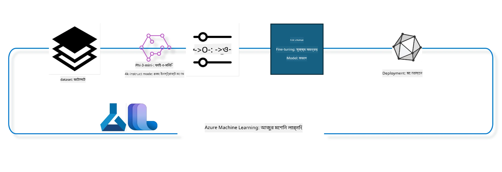

## কিভাবে Azure ML সিস্টেম রেজিস্ট্রি থেকে চ্যাট-কমপ্লিশন কম্পোনেন্ট ব্যবহার করে একটি মডেল ফাইন-টিউন করবেন

এই উদাহরণে আমরা Phi-3-mini-4k-instruct মডেলকে ফাইন-টিউন করব যাতে ২ জনের মধ্যে কথোপকথন সম্পন্ন করতে ultrachat_200k ডেটাসেট ব্যবহার করা হয়।



উদাহরণটি দেখাবে কিভাবে Azure ML SDK এবং পাইথন ব্যবহার করে ফাইন টিউন করা যায় এবং তারপর ফাইন-টিউন করা মডেলটিকে একটি অনলাইন এন্ডপয়েন্টে ডিপ্লয় করা যেতে পারে রিয়েল টাইম ইনফারেন্সের জন্য।

### প্রশিক্ষণ ডেটা

আমরা ultrachat_200k ডেটাসেট ব্যবহার করব। এটি UltraChat ডেটাসেটের একটি খুব ফিল্টার করা সংস্করণ এবং Zephyr-7B-β, একটি অত্যাধুনিক 7b চ্যাট মডেল ট্রেন করার জন্য ব্যবহৃত হয়েছে।

### মডেল

আমরা Phi-3-mini-4k-instruct মডেল ব্যবহার করব দেখানোর জন্য কিভাবে ব্যবহারকারী একটি মডেলকে চ্যাট-কমপ্লিশন কাজের জন্য ফাইনটিউন করতে পারে। যদি আপনি এই নোটবুকটি একটি নির্দিষ্ট মডেল কার্ড থেকে খুলেন, তবে নির্দিষ্ট মডেলের নামটি প্রতিস্থাপন করতে ভুলবেন না।

### কাজগুলো

- ফাইন টিউনের জন্য একটি মডেল নির্বাচন করুন।
- প্রশিক্ষণ ডেটা নির্বাচন এবং অন্বেষণ করুন।
- ফাইন টিউনিং জবটি কনফিগার করুন।
- ফাইন টিউনিং জবটি চালান।
- প্রশিক্ষণ এবং মূল্যায়ন পরিসংখ্যান পর্যালোচনা করুন।
- ফাইন টিউন করা মডেলটি রেজিস্টার করুন।
- ফাইন টিউন করা মডেলটি রিয়েল টাইম ইনফারেন্সের জন্য ডিপ্লয় করুন।
- রিসোর্সগুলো পরিস্কার করুন।

## ১. পূর্বপ্রয়োজনীয়তাগুলো সেটআপ করুন

- ডিপেন্ডেন্সিগুলো ইনস্টল করুন
- AzureML ওয়ার্কস্পেসে সংযোগ করুন। আরো জানুন SDK authentication সেটআপ এ। নিচের <WORKSPACE_NAME>, <RESOURCE_GROUP> এবং <SUBSCRIPTION_ID> পরিবর্তন করুন।
- azureml সিস্টেম রেজিস্ট্রিতে সংযোগ করুন
- ঐচ্ছিক একটি এক্সপেরিমেন্ট নাম সেট করুন
- কম্পিউট চেক করুন বা তৈরি করুন।

> [!NOTE]
> প্রয়োজনীয় একক GPU নোডে একাধিক GPU কার্ড থাকতে পারে। উদাহরণ স্বরূপ, Standard_NC24rs_v3 এর একটি নোডে ৪টি NVIDIA V100 GPU থাকে, যখন Standard_NC12s_v3 তে ২টি NVIDIA V100 GPU থাকে। এই তথ্যের জন্য ডকুমেন্টেশন দেখুন। প্রতি নোড GPU কার্ডের সংখ্যা নিচে গানো gpus_per_node প্যারামিটারে সেট করা হয়। সঠিকভাবে এই মান সেট করলে নোডের সব GPU ব্যবহার নিশ্চিত হবে। সুপারিশকৃত GPU কম্পিউট SKU এখানে এবং এখানে পাওয়া যাবে।

### পাইথন লাইব্রেরি

নিচের সেল চালিয়ে ডিপেন্ডেন্সিগুলো ইনস্টল করুন। নতুন পরিবেশে চলালে এটি একটি আবশ্যক ধাপ।

```bash
pip install azure-ai-ml
pip install azure-identity
pip install datasets==2.9.0
pip install mlflow
pip install azureml-mlflow
```

### Azure ML এর সাথে ইন্টারঅ্যাক্ট করা

1. এই পাইথন স্ক্রিপ্টটি Azure Machine Learning (Azure ML) সার্ভিসের সাথে ইন্টারঅ্যাক্ট করতে ব্যবহৃত হয়। এর কাজগুলো নিচে:

    - এটি azure.ai.ml, azure.identity, এবং azure.ai.ml.entities প্যাকেজ থেকে প্রয়োজনীয় মডিউলগুলো আমদানি করে। এছাড়াও time মডিউল আমদানি করে।

    - এটি DefaultAzureCredential() ব্যবহার করে অথেন্টিকেশন করার চেষ্টা করে, যা Azure ক্লাউডে অ্যাপ্লিকেশন দ্রুত ডেভেলপ এবং চালু করার জন্য সহজ অথেনটিকেশন অভিজ্ঞতা দেয়। যদি এটা ব্যর্থ হয়, তবে ইন্টারেক্টিভ লগইন প্রম্পট প্রদানকারী InteractiveBrowserCredential() ব্যবহৃত হয়।

    - এরপর এটি from_config পদ্ধতি ব্যবহার করে MLClient ইনস্ট্যান্স তৈরি করার চেষ্টা করে, যা ডিফল্ট কনফিগ ফাইল (config.json) থেকে কনফিগ পড়ে। যদি এটা ব্যর্থ হয়, তবে subscription_id, resource_group_name, এবং workspace_name ম্যানুয়ালি দিয়ে MLClient ইনস্ট্যান্স তৈরি করে।

    - এটি আরেকটি MLClient ইনস্ট্যান্স তৈরি করে, Azure ML রেজিস্ট্রি "azureml" নামে। এখানে মডেল, ফাইন-টিউনিং পাইপলাইন, এবং এনভায়রনমেন্ট সংরক্ষিত থাকে।

    - experiment_name সেট করে "chat_completion_Phi-3-mini-4k-instruct"।

    - একটি ইউনিক টাইমস্ট্যাম্প তৈরি করে, যা বর্তমান সময়কে ইন্টিগার এবং তারপর স্ট্রিং এ রূপান্তর করে। এটি ইউনিক নাম এবং ভার্সন তৈরিতে ব্যবহৃত হয়।

    ```python
    # Azure ML এবং Azure Identity থেকে প্রয়োজনীয় মডিউল ইমপোর্ট করুন
    from azure.ai.ml import MLClient
    from azure.identity import (
        DefaultAzureCredential,
        InteractiveBrowserCredential,
    )
    from azure.ai.ml.entities import AmlCompute
    import time  # টাইম মডিউল ইমপোর্ট করুন
    
    # DefaultAzureCredential ব্যবহার করে অথেন্টিকেশন করার চেষ্টা করুন
    try:
        credential = DefaultAzureCredential()
        credential.get_token("https://management.azure.com/.default")
    except Exception as ex:  # যদি DefaultAzureCredential ব্যর্থ হয়, তবে InteractiveBrowserCredential ব্যবহার করুন
        credential = InteractiveBrowserCredential()
    
    # ডিফল্ট কনফিগারেশন ফাইল ব্যবহার করে একটি MLClient ইনস্ট্যান্স তৈরির চেষ্টা করুন
    try:
        workspace_ml_client = MLClient.from_config(credential=credential)
    except:  # যদি সেটি ব্যর্থ হয়, তবে ম্যানুয়ালি বিস্তারিত প্রদান করে একটি MLClient ইনস্ট্যান্স তৈরি করুন
        workspace_ml_client = MLClient(
            credential,
            subscription_id="<SUBSCRIPTION_ID>",
            resource_group_name="<RESOURCE_GROUP>",
            workspace_name="<WORKSPACE_NAME>",
        )
    
    # "azureml" নামে Azure ML রেজিস্ট্রির জন্য আরেকটি MLClient ইনস্ট্যান্স তৈরি করুন
    # এই রেজিস্ট্রিতে মডেল, ফাইন-টিউনিং পাইপলাইন এবং পরিবেশ সংরক্ষিত থাকে
    registry_ml_client = MLClient(credential, registry_name="azureml")
    
    # পরীক্ষার নাম সেট করুন
    experiment_name = "chat_completion_Phi-3-mini-4k-instruct"
    
    # ইউনিক নাম এবং সংস্করণের জন্য ব্যবহারযোগ্য একটি অনন্য টাইমস্ট্যাম্প তৈরি করুন
    timestamp = str(int(time.time()))
    ```

## ২. ফাইন টিউনের জন্য একটি ফাউন্ডেশন মডেল নির্বাচন করুন

1. Phi-3-mini-4k-instruct হলো ৩.৮B প্যারামিটার বিশিষ্ট একটি লাইটওয়েট, অত্যাধুনিক ওপেন মডেল যা Phi-2 এর জন্য ব্যবহৃত ডেটাসেটের উপর নির্মিত। মডেলটি Phi-3 মডেল পরিবারের অন্তর্গত, এবং মিনি ভার্শন দুটি: 4K ও 128K যা কন্টেক্সট লেন্থ (টোকেনস) যা সাপোর্ট করে, আমাদের নির্দিষ্ট প্রয়োজনে মডেলটি ফাইনটিউন করতে হবে। আপনি AzureML স্টুডিওর মডেল ক্যাটালগে চ্যাট-কমপ্লিশন টাস্ক দ্বারা ফিল্টার করে এই মডেলগুলো ব্রাউজ করতে পারেন। এই উদাহরণে আমরা Phi-3-mini-4k-instruct মডেল ব্যবহার করব। যদি আপনি অন্য মডেলের জন্য নোটবুকটি খুলে থাকেন, তবে মডেল নাম এবং ভার্সন যথাযথভাবে প্রতিস্থাপন করুন।

> [!NOTE]
> মডেলটির id প্রপার্টি। এটি ফাইন টিউনিং জবের ইনপুট হিসেবে পাঠানো হবে। এটি AzureML স্টুডিও মডেল ক্যাটালগের মডেল ডিটেইল পেইজের Asset ID ফিল্ডেও পাওয়া যায়।

2. এই পাইথন স্ক্রিপ্টটি Azure Machine Learning (Azure ML) সার্ভিসের সাথে ইন্টারঅ্যাক্ট করছে। কাজের সারাংশ:

    - model_name সেট করে "Phi-3-mini-4k-instruct"।

    - registry_ml_client অবজেক্টের models প্রোপার্টির get মেথড ব্যবহার করে Azure ML রেজিস্ট্রির নির্দিষ্ট নামে সর্বশেষ মডেল ভার্সন নেয়। get মেথড দুটি আর্গুমেন্ট নেয়: মডেলের নাম এবং লেবেল যা সর্বশেষ সংস্করণ নির্দেশ করে।

    - এটি কনসোলে লিখে কোন নাম, ভার্সন এবং আইডির মডেল ফাইন-টিউনের জন্য ব্যবহৃত হবে। স্ট্রিং ফরম্যাটিং ব্যবহার করে মডেলের নেম, ভার্সন ও আইডি ইনসার্ট করে। মডেলের নেম, ভার্সন ও আইডি foundation_model অবজেক্ট থেকে নেওয়া হয়।

    ```python
    # মডেলের নাম সেট করুন
    model_name = "Phi-3-mini-4k-instruct"
    
    # Azure ML রেজিস্ট্রি থেকে মডেলের সর্বশেষ সংস্করণ পান
    foundation_model = registry_ml_client.models.get(model_name, label="latest")
    
    # মডেলের নাম, সংস্করণ, এবং আইডি প্রিন্ট করুন
    # এই তথ্য ট্র্যাকিং এবং ডিবাগিংয়ের জন্য উপকারী
    print(
        "\n\nUsing model name: {0}, version: {1}, id: {2} for fine tuning".format(
            foundation_model.name, foundation_model.version, foundation_model.id
        )
    )
    ```

## ৩. জবের জন্য একটি কম্পিউট তৈরি করুন

ফাইনটিউন জব শুধুমাত্র GPU কম্পিউটে কাজ করে। কম্পিউট সাইজ নির্ভর করে মডেল কত বড় তার উপর এবং বেশিরভাগ ক্ষেত্রে সঠিক কম্পিউট নির্বাচন করা কঠিন হয়। এই সেলে আমরা ব্যবহারকারীকে সঠিক কম্পিউট বেছে নিতে গাইড করব।

> [!NOTE]
> নিচে তালিকাভুক্ত কম্পিউটগুলো সবচেয়ে অপটিমাইজড কনফিগারেশনে কাজ করে। কনফিগারেশনে যেকোন পরিবর্তন Cuda Out Of Memory error ঘটাতে পারে। এমন হলে বড় সাইজের কম্পিউটে আপগ্রেড করার চেষ্টা করুন।

> [!NOTE]
> নিচে compute_cluster_size বাছাই করার সময় নিশ্চিত করুন কম্পিউটটি আপনার রিসোর্স গ্রুপে উপলব্ধ আছে কিনা। যদি কোনো নির্দিষ্ট কম্পিউট উপলব্ধ না থাকে, তবে কম্পিউট রিসোর্সের জন্য অ্যাক্সেস অনুরোধ করুন।

### ফাইন টিউনের জন্য মডেল চেক করা হচ্ছে

1. এই পাইথন স্ক্রিপ্ট Azure ML মডেলের সাথে ইন্টারঅ্যাক্ট করে। কাজের সারাংশ:

    - এটি ast মডিউল আমদানি করে, যা পাইথনের অ্যাবস্ট্রাক্ট সিনট্যাক্স ট্রি প্রসেস করার ফাংশন দেয়।

    - এটি পরীক্ষা করে foundation_model অবজেক্টে finetune_compute_allow_list নামে একটি ট্যাগ আছে কিনা। Azure ML এ ট্যাগ হলো কী-ভ্যালু জোড়া যা মডেল ফিল্টার ও সাজানোর কাজে ব্যবহৃত হয়।

    - যদি finetune_compute_allow_list ট্যাগ থাকে, তবে ast.literal_eval ফাংশন দিয়ে ভ্যালুটি (স্ট্রিং) পাইথন লিস্টে রূপান্তর করে এবং computes_allow_list ভেরিয়েবলে অ্যাসাইন করে। তারপর কম্পিউট তৈরি করার জন্য লিস্ট থেকে নেওয়ার একটি মেসেজ দেখায়।

    - যদি ট্যাগ না থাকে, computes_allow_list কে None সেট করে এবং মডেলের ট্যাগের অংশ না থাকার মেসেজ দেখায়।

    - সংক্ষেপে, স্ক্রিপ্টটি একটি নির্দিষ্ট ট্যাগের জন্য মডেলের মেটাডেটা পরীক্ষা করে, ট্যাগ থাকলে তা লিস্টে রূপান্তর করে এবং ব্যবহারকারীকে জানায়।

    ```python
    # পাইথনের আপবিত্র সিনট্যাক্স ব্যাকরণ গাছ প্রক্রিয়াকরণের জন্য ফাংশন সরবরাহ করে এমন ast মডিউলটি আমদানি করুন
    import ast
    
    # মডেলের ট্যাগগুলিতে 'finetune_compute_allow_list' ট্যাগটি উপস্থিত আছে কিনা তা পরীক্ষা করুন
    if "finetune_compute_allow_list" in foundation_model.tags:
        # যদি ট্যাগটি উপস্থিত থাকে, তবে ast.literal_eval ব্যবহার করে ট্যাগের মান (একটি স্ট্রিং) নিরাপদে একটি পাইথন তালিকায় পার্স করুন
        computes_allow_list = ast.literal_eval(
            foundation_model.tags["finetune_compute_allow_list"]
        )  # স্ট্রিংকে পাইথন তালিকায় রূপান্তর করুন
        # একটি বার্তা প্রিন্ট করুন যার মাধ্যমে বোঝানো হচ্ছে তালিকা থেকে একটি কম্পিউট তৈরি করা উচিত
        print(f"Please create a compute from the above list - {computes_allow_list}")
    else:
        # যদি ট্যাগটি উপস্থিত না থাকে, তবে computes_allow_list কে None সেট করুন
        computes_allow_list = None
        # একটি বার্তা প্রিন্ট করুন যা নির্দেশ করে যে 'finetune_compute_allow_list' ট্যাগটি মডেলের ট্যাগের অংশ নয়
        print("`finetune_compute_allow_list` is not part of model tags")
    ```

### কম্পিউট ইনস্ট্যান্স চেক করা হচ্ছে

1. এই পাইথন স্ক্রিপ্ট Azure ML সার্ভিসের সাথে ইন্টারঅ্যাক্ট করে এবং একটি কম্পিউট ইনস্ট্যান্স নিয়ে কয়েকটি পরীক্ষা করে। সারাংশ:

    - compute_cluster এ রাখা নাম দিয়ে Azure ML ওয়ার্কস্পেস থেকে কম্পিউট ইনস্ট্যান্স রিট্রিভ করার চেষ্টা করে। যদি কম্পিউট ইনস্ট্যান্সের provisioning state "failed" হয়, তবে ValueError দেয়।

    - যদি computes_allow_list None না হয়, তবে লিস্টের সব কম্পিউট সাইজ lowercase করে বর্তমান কম্পিউট সাইজের সাথে মিলিয়ে দেখে। না হলে ValueError ফেলে।

    - যদি computes_allow_list None হয়, তবে অবৈধ GPU VM সাইজের তালিকায় কম্পিউট সাইজ থাকলে ValueError দেয়।

    - ওয়ার্কস্পেসে উপলব্ধ সব কম্পিউট সাইজের তালিকা নিয়ে প্রত্যেকটির নাম বর্তমান কম্পিউট সাইজের সাথে মিলিয়ে দেখা হয়। যদি মেলে, তবে ঐ সাইজের GPU সংখ্যা পাওয়া যায় এবং gpu_count_found=True সেট করা হয়।

    - যদি gpu_count_found True হয়, কম্পিউট ইনস্ট্যান্সের GPU সংখ্যা প্রিন্ট করে। না হলে ValueError দেয়।

    - সংক্ষেপে, স্ক্রিপ্টটি Azure ML ওয়ার্কস্পেসের একটি কম্পিউট ইনস্ট্যান্সের provisioning স্টেট, সাইজ অনুমোদিত তালিকা বা বিরোধী তালিকা যাচাই ও GPU সংখ্যা পরীক্ষা করে।

    ```python
    # ব্যতিক্রম বার্তা প্রিন্ট করুন
    print(e)
    # যদি ওয়ার্কস্পেসে কম্পিউট আকার পাওয়া না যায় তাহলে ValueError উত্থাপন করুন
    raise ValueError(
        f"WARNING! Compute size {compute_cluster_size} not available in workspace"
    )
    
    # Azure ML ওয়ার্কস্পেস থেকে কম্পিউট ইনস্ট্যান্স পুনরুদ্ধার করুন
    compute = workspace_ml_client.compute.get(compute_cluster)
    # চেক করুন কম্পিউট ইনস্ট্যান্সের provisioning অবস্থা "failed" কিনা
    if compute.provisioning_state.lower() == "failed":
        # যদি provisioning অবস্থা "failed" হয় তাহলে ValueError উত্থাপন করুন
        raise ValueError(
            f"Provisioning failed, Compute '{compute_cluster}' is in failed state. "
            f"please try creating a different compute"
        )
    
    # চেক করুন computes_allow_list None নয়
    if computes_allow_list is not None:
        # computes_allow_list এর সমস্ত কম্পিউট সাইজ ছোট হাতের অক্ষরে রূপান্তর করুন
        computes_allow_list_lower_case = [x.lower() for x in computes_allow_list]
        # চেক করুন কম্পিউট ইনস্ট্যান্সের আকার কম্পিউটস_allow_list_lower_case এ আছে কিনা
        if compute.size.lower() not in computes_allow_list_lower_case:
            # যদি কম্পিউট ইনস্ট্যান্সের আকার কম্পিউটস_allow_list_lower_case এ না থাকে তাহলে ValueError উত্থাপন করুন
            raise ValueError(
                f"VM size {compute.size} is not in the allow-listed computes for finetuning"
            )
    else:
        # অসমর্থিত GPU VM সাইজগুলির একটি তালিকা সংজ্ঞায়িত করুন
        unsupported_gpu_vm_list = [
            "standard_nc6",
            "standard_nc12",
            "standard_nc24",
            "standard_nc24r",
        ]
        # চেক করুন কম্পিউট ইনস্ট্যান্সের আকার unsupported_gpu_vm_list এ আছে কিনা
        if compute.size.lower() in unsupported_gpu_vm_list:
            # যদি কম্পিউট ইনস্ট্যান্সের আকার unsupported_gpu_vm_list এ থাকে তাহলে ValueError উত্থাপন করুন
            raise ValueError(
                f"VM size {compute.size} is currently not supported for finetuning"
            )
    
    # একটি ফ্ল্যাগ ইনিশিয়ালাইজ করুন যা চেক করবে কম্পিউট ইনস্ট্যান্সে GPU এর সংখ্যা পাওয়া গেছে কিনা
    gpu_count_found = False
    # ওয়ার্কস্পেসের সমস্ত উপলব্ধ কম্পিউট সাইজের একটি তালিকা পুনরুদ্ধার করুন
    workspace_compute_sku_list = workspace_ml_client.compute.list_sizes()
    available_sku_sizes = []
    # উপলব্ধ কম্পিউট সাইজের তালিকার উপর পুনরাবৃত্তি করুন
    for compute_sku in workspace_compute_sku_list:
        available_sku_sizes.append(compute_sku.name)
        # চেক করুন কম্পিউট সাইজের নাম কম্পিউট ইনস্ট্যান্সের আকারের সাথে মেলে কিনা
        if compute_sku.name.lower() == compute.size.lower():
            # যদি মেলে তবে সেই কম্পিউট সাইজের জন্য GPU এর সংখ্যা পুনরুদ্ধার করুন এবং gpu_count_found কে True করুন
            gpus_per_node = compute_sku.gpus
            gpu_count_found = True
    # যদি gpu_count_found True হয়, তবে কম্পিউট ইনস্ট্যান্সের GPU সংখ্যা প্রিন্ট করুন
    if gpu_count_found:
        print(f"Number of GPU's in compute {compute.size}: {gpus_per_node}")
    else:
        # যদি gpu_count_found False হয়, তাহলে ValueError উত্থাপন করুন
        raise ValueError(
            f"Number of GPU's in compute {compute.size} not found. Available skus are: {available_sku_sizes}."
            f"This should not happen. Please check the selected compute cluster: {compute_cluster} and try again."
        )
    ```

## ৪. মডেলের ফাইন-টিউনের জন্য ডেটাসেট নির্বাচন করুন

1. আমরা ultrachat_200k ডেটাসেট ব্যবহার করব। ডেটাসেটের চারটি স্প্লিট আছে, যা সুপারভাইজড ফাইন-টিউনিং (sft) এর উপযুক্ত।
জেনারেশন র‍্যাঙ্কিং (gen)। প্রতিটি স্প্লিটের উদাহরণ সংখ্যা নিচে দেখানো হলো:

    ```bash
    train_sft test_sft  train_gen  test_gen
    207865  23110  256032  28304
    ```

1. পরবর্তী কয়েকটি সেল ফাইন-টিউনের জন্য বেসিক ডেটা প্রস্তুতির উদাহরণ দেখাবে:

### কিছু ডেটা রো ভিজ্যুয়ালাইজ করা

আমরা চাই এই স্যাম্পল দ্রুত চলুক, তাই train_sft, test_sft ফাইলগুলো সংরক্ষণ করব যা ইতিমধ্যে ট্রিম করা রো থেকে ৫% ডেটা ধারণ করবে। এর মানে ফাইন-টিউন করা মডেলের সঠিকতা কম থাকবে, তাই এটিকে বাস্তব ব্যবহারে না নেওয়াই ভালো।

download-dataset.py স্ক্রিপ্টটি ultrachat_200k ডেটাসেট ডাউনলোড এবং ফাইনটিউন পাইপলাইন কম্পোনেন্ট ফরম্যাটে রূপান্তর করতে ব্যবহৃত হয়। ডেটাসেট বড় হওয়ায় এখানে শুধুমাত্র ডেটার একটি অংশ আছে।

1. নিচের স্ক্রিপ্টটি রান করলে ৫% ডেটা ডাউনলোড হয়। dataset_split_pc প্যারামিটার পরিবর্তন করে এটি বাড়ানো যেতে পারে।

> [!NOTE]
> কিছু ভাষা মডেলের আলাদা ভাষা কোড থাকে, তাই ডেটাসেটে কলামের নামও সেই অনুযায়ী হওয়া উচিত।

1. ডেটা দেখতে যেমন হওয়া উচিত তার একটি উদাহরণ নিচে:
চ্যাট-কমপ্লিশন ডেটাসেট পারকেট ফরম্যাটে সংরক্ষিত, যাতে প্রতিটি এন্ট্রি নিম্নলিখিত স্কিমা অনুসারে:

    - এটি একটি JSON (JavaScript Object Notation) ডকুমেন্ট, যা জনপ্রিয় ডেটা বিনিময়ের ফরম্যাট। এটি কোড নয়, বরং ডেটা স্টোর ও ট্রান্সপোর্ট করার উপায়। এর কাঠামো:

    - "prompt": এই কি একটি স্ট্রিং মান ধারণ করে যা AI সহকারীর কাছে একটি টাস্ক বা প্রশ্ন নির্দেশ করে।

    - "messages": এই কি একটি অবজেক্টের অ্যারে ধারণ করে। প্রতিটি অবজেক্ট একটি সংলাপে ইউজার ও AI সহকারীর বার্তা নির্দেশ করে। প্রতি মেসেজ অবজেক্টে দুইটি কি আছে:

    - "content": বার্তার বিষয়বস্তু স্ট্রিং মান হিসেবে।
    - "role": বার্তা প্রেরকের ভূমিকা, যা "user" বা "assistant" হতে পারে।
    - "prompt_id": প্রম্পটের ইউনিক আইডি স্ট্রিং মান।

1. এই JSON ডকুমেন্টে একটি সংলাপ আছে যেখানে ইউজার AI সহকারীর কাছে একটি ডাইস্টোপিয়ান গল্পের প্রধান চরিত্র তৈরির জন্য বলে। সহকারী উত্তর দেয়, এরপর ব্যবহারকারী আরও বিস্তারিত জানতে চায়। সহকারী তা দিতে সম্মত হয়। পুরো কথোপকথনটি একটি নির্দিষ্ট প্রম্পট আইডির সাথে সংযুক্ত।

    ```python
    {
        // The task or question posed to an AI assistant
        "prompt": "Create a fully-developed protagonist who is challenged to survive within a dystopian society under the rule of a tyrant. ...",
        
        // An array of objects, each representing a message in a conversation between a user and an AI assistant
        "messages":[
            {
                // The content of the user's message
                "content": "Create a fully-developed protagonist who is challenged to survive within a dystopian society under the rule of a tyrant. ...",
                // The role of the entity that sent the message
                "role": "user"
            },
            {
                // The content of the assistant's message
                "content": "Name: Ava\n\n Ava was just 16 years old when the world as she knew it came crashing down. The government had collapsed, leaving behind a chaotic and lawless society. ...",
                // The role of the entity that sent the message
                "role": "assistant"
            },
            {
                // The content of the user's message
                "content": "Wow, Ava's story is so intense and inspiring! Can you provide me with more details.  ...",
                // The role of the entity that sent the message
                "role": "user"
            }, 
            {
                // The content of the assistant's message
                "content": "Certainly! ....",
                // The role of the entity that sent the message
                "role": "assistant"
            }
        ],
        
        // A unique identifier for the prompt
        "prompt_id": "d938b65dfe31f05f80eb8572964c6673eddbd68eff3db6bd234d7f1e3b86c2af"
    }
    ```

### ডেটা ডাউনলোড

1. এই পাইথন স্ক্রিপ্টটি download-dataset.py নামে একটি হেলপার স্ক্রিপ্ট ব্যবহার করে ডেটাসেট ডাউনলোড করতে ব্যবহৃত। কাজের সারাংশ:

    - এটি os মডিউল আমদানি করে, যা অপারেটিং সিস্টেম নির্ভর ফাংশন ব্যবহারে সাহায্য করে।

    - os.system ফাংশন ব্যবহার করে download-dataset.py স্ক্রিপ্টটি শেলে রান করে নির্দিষ্ট আর্গুমেন্ট সহ। আর্গুমেন্টে ডাউনলোড করতে ডেটাসেট (HuggingFaceH4/ultrachat_200k), ডিরেক্টরি (ultrachat_200k_dataset), এবং ডেটাসেট ভাগের শতাংশ (5) দেয়া হয়। os.system রান কমান্ডের এক্সিট স্ট্যাটাস ফেরত দেয়; এটি exit_status ভেরিয়েবলে রাখা হয়।

    - এটি exit_status 0 নয় কিনা পরীক্ষা করে। Unix-লাইক সিস্টেমে 0 মানে সফল কমান্ড, অন্য কিছু মান ত্রুটি। 0 না হলে Exception ছুড়ে ডেটাসেট ডাউনলোডে ত্রুটি জানান দেয়।

    - সংক্ষেপে, এই স্ক্রিপ্ট একটি হেলপার স্ক্রিপ্ট ব্যবহার করে ডেটাসেট ডাউনলোড করার কমান্ড চালায় এবং ব্যর্থ হলে ব্যতিক্রম উত্থাপন করে।

    ```python
    # অপারেটিং সিস্টেম নির্ভর কার্যকারিতা ব্যবহারের একটি উপায় প্রদান করে এমন os মডিউল ইমপোর্ট করুন
    import os
    
    # নির্দিষ্ট কমান্ড-লাইন আর্গুমেন্ট সহ শেলে download-dataset.py স্ক্রিপ্ট চালাতে os.system ফাংশন ব্যবহার করুন
    # আর্গুমেন্টগুলি ডাউনলোড করার জন্য ডেটাসেট (HuggingFaceH4/ultrachat_200k), ডাউনলোড করার ডিরেক্টরি (ultrachat_200k_dataset), এবং ডেটাসেটটির ভাগের শতাংশ (5) নির্দিষ্ট করে
    # os.system ফাংশন চালানো কমান্ডের এক্সিট স্ট্যাটাস ফেরত দেয়; এই স্ট্যাটাস exit_status ভেরিয়েবলে সংরক্ষিত হয়
    exit_status = os.system(
        "python ./download-dataset.py --dataset HuggingFaceH4/ultrachat_200k --download_dir ultrachat_200k_dataset --dataset_split_pc 5"
    )
    
    # পরীক্ষা করুন exit_status 0 নয়
    # ইউনিক্স-সদৃশ অপারেটিং সিস্টেমে, একটি এক্সিট স্ট্যাটাস 0 সাধারণত নির্দেশ করে যে একটি কমান্ড সফল হয়েছে, যখন অন্য কোনো সংখ্যা ত্রুটি নির্দেশ করে
    # যদি exit_status 0 না হয়, তাহলে একটি Exception উত্তোলন করুন যা ডেটাসেট ডাউনলোড করতে ত্রুটি হয়েছে এমন বার্তা প্রদান করে
    if exit_status != 0:
        raise Exception("Error downloading dataset")
    ```

### ডেটা ডেটাফ্রেমে লোড করা হচ্ছে
1. এই পাইথন স্ক্রিপ্টটি একটি JSON Lines ফাইলকে pandas DataFrame এ লোড করছে এবং প্রথম ৫টি সারি প্রদর্শন করছে। এটি যা করছে তার একটি ভাঙ্গন:

    - এটি pandas লাইব্রেরি ইম্পোর্ট করছে, যা একটি শক্তিশালী ডাটা ম্যানিপুলেশন এবং বিশ্লেষণ লাইব্রেরি।

    - এটি pandas এর প্রদর্শনের বিকল্পগুলির জন্য সর্বাধিক কলাম প্রস্থ ০ সেট করেছে। এর মানে, যখন DataFrame মুদ্রণ করা হবে তখন প্রতিটি কলামের সম্পূর্ণ টেক্সট কাটা ছাড়াই প্রদর্শিত হবে।

    - এটি pd.read_json ফাংশন ব্যবহার করে ultrachat_200k_dataset ডিরেক্টরির train_sft.jsonl ফাইলটি DataFrame এ লোড করছে। lines=True আর্গুমেন্টটি নির্দেশ করে যে ফাইলটি JSON Lines ফরম্যাটে রয়েছে, যেখানে প্রতিটি লাইন একটি আলাদা JSON অবজেক্ট।

    - এটি head মেথড ব্যবহার করে DataFrame এর প্রথম ৫টি সারি প্রদর্শন করছে। যদি DataFrame এ ৫টির কম সারি থাকে, তবে তা সবগুলো দেখাবে।

    - সংক্ষেপে, এই স্ক্রিপ্টটি একটি JSON Lines ফাইলকে DataFrame এ লোড করছে এবং সম্পূর্ণ কলাম টেক্সট সহ প্রথম ৫টি সারি প্রদর্শন করছে।
    
    ```python
    # প্যান্ডাস লাইব্রেরি আমদানি করুন, যা একটি শক্তিশালী ডেটা ম্যানিপুলেশন এবং বিশ্লেষণ লাইব্রেরি
    import pandas as pd
    
    # প্যান্ডাস' প্রদর্শন বিকল্পগুলির জন্য সর্বোচ্চ কলাম প্রস্থ 0 সেট করুন
    # এর অর্থ হল যখন DataFrame মুদ্রিত হবে তখন প্রতিটি কলামের সম্পূর্ণ টেক্সট ট্রাঙ্কেশন ছাড়াই প্রদর্শিত হবে
    pd.set_option("display.max_colwidth", 0)
    
    # pd.read_json ফাংশন ব্যবহার করে ultrachat_200k_dataset ডিরেক্টরি থেকে train_sft.jsonl ফাইলটি একটি DataFrame-এ লোড করুন
    # lines=True আর্গুমেন্ট নির্দেশ করে যে ফাইলটি JSON Lines ফরম্যাটে, যেখানে প্রতিটি লাইন একটি পৃথক JSON অবজেক্ট
    df = pd.read_json("./ultrachat_200k_dataset/train_sft.jsonl", lines=True)
    
    # head পদ্ধতি ব্যবহার করে DataFrame এর প্রথম 5টি সারি প্রদর্শন করুন
    # যদি DataFrame এর সারির সংখ্যা 5 এর কম হয়, তবে এটি সবগুলোই প্রদর্শন করবে
    df.head()
    ```

## ৫। মডেল এবং ডাটাকে ইনপুট হিসেবে ব্যবহার করে ফাইন টিউনিং জব সাবমিট করুন

চ্যাট-কমপ্লিশন পাইপলাইন কম্পোনেন্ট ব্যবহার করে জব তৈরি করুন। ফাইন টিউনিং এর জন্য সমর্থিত সকল প্যারামিটার সম্পর্কে আরো জানুন।

### ফাইন টিউন প্যারামিটার নির্ধারণ

১। ফাইনটিউন প্যারামিটারগুলো ২টি শ্রেণীতে ভাগ করা যায় - ট্রেনিং প্যারামিটার এবং অপটিমাইজেশন প্যারামিটার

১। ট্রেনিং প্যারামিটারগুলি ট্রেনিং সংক্রান্ত বিষয়গুলো নির্ধারণ করে যেমন -

    - কোন অপটিমাইজার, স্কেজুলার ব্যবহার করতে হবে
    - ফাইনটিউনের জন্য কোন মেট্রিক অপটিমাইজ করবেন
    - ট্রেনিং স্টেপের সংখ্যা, ব্যাচ সাইজ ইত্যাদি
    - অপটিমাইজেশন প্যারামিটার মডেল চালানোর জন্য GPU মেমোরি অপ্টিমাইজ এবং কম্পিউট রিসোর্স সঠিকভাবে ব্যবহার করতে সহায়তা করে।

১। নিচে কিছু প্যারামিটার দেয়া হলো যেগুলো এই ক্যাটাগরির অন্তর্গত। অপটিমাইজেশন প্যারামিটার মডেল অনুযায়ী ভিন্ন হয় এবং মডেলের সাথে প্যাকেজ করা থাকে যাতে এই পার্থক্যসমূহ সামলানো যায়।

    - ডিপস্পিড এবং লোরা সক্রিয় করা
    - মিক্সড প্রিসিশন ট্রেনিং সক্রিয় করা
    - মাল্টি-নোড ট্রেনিং সক্রিয় করা

> [!NOTE]
> সুপারভাইজড ফাইনটিউনিং ফলে এলাইনমেন্ট নষ্ট হতে পারে বা ক্যাটাস্ট্রফিক ফরগেটিং ঘটতে পারে। আমরা সুপারিশ করি এই সমস্যা পরীক্ষা করে ফাইনটিউন করার পর একটি এলাইনমেন্ট স্টেজ চালাতে।

### ফাইন টিউন প্যারামিটার

১। এই পাইথন স্ক্রিপ্টটি একটি মেশিন লার্নিং মডেল ফাইনটিউন করার জন্য প্যারামিটার সেট করছে। এটি যা করছে তার বিস্তারিত:

    - এটি ডিফল্ট ট্রেনিং প্যারামিটার যেমন ট্রেনিং ইপোক সংখ্যা, ট্রেনিং ও ইভ্যালুয়েশনের ব্যাচ সাইজ, লার্নিং রেট এবং লার্নিং রেট স্কেজুলারের ধরন নির্ধারণ করছে।

    - এটি ডিফল্ট অপটিমাইজেশন প্যারামিটার নির্ধারণ করছে যেমন Layer-wise Relevance Propagation (LoRa) এবং DeepSpeed প্রয়োগ করা হবে কিনা, এবং DeepSpeed স্টেজ।

    - ট্রেনিং ও অপটিমাইজেশন প্যারামিটারগুলোকে finetune_parameters নামে একটি ডিকশনারিতে একত্রিত করছে।

    - foundation_model এ যদি কোনো মডেল-স্পেসিফিক ডিফল্ট প্যারামিটার থাকে, তবে একটি সতর্কবার্তা প্রিন্ট করে এবং সেই প্যারামিটারগুলো ast.literal_eval ব্যবহার করে স্ট্রিং থেকে পাইথন ডিকশনারিতে রূপান্তর করে finetune_parameters ডিকশনারি আপডেট করছে।

    - রান করার জন্য ব্যবহৃত চূড়ান্ত ফাইন-টিউন প্যারামিটারগুলো প্রিন্ট করছে।

    - সংক্ষেপে, এই স্ক্রিপ্টটি একটি মেশিন লার্নিং মডেলের ফাইন-টিউনিং প্যারামিটার সেট করছে এবং দেখাচ্ছে যেগুলো মডেল-নির্দিষ্ট প্যারামিটার দিয়ে ডিফল্ট প্যারামিটারও ওভাররাইড করা যেতে পারে।

    ```python
    # ডিফল্ট প্রশিক্ষণ প্যারামিটারগুলি সেট করুন যেমন প্রশিক্ষণ যুগের সংখ্যা, প্রশিক্ষণ এবং মূল্যায়নের জন্য ব্যাচ সাইজ, শিক্ষার হার, এবং শিক্ষার হার শিডিউলার প্রকার
    training_parameters = dict(
        num_train_epochs=3,
        per_device_train_batch_size=1,
        per_device_eval_batch_size=1,
        learning_rate=5e-6,
        lr_scheduler_type="cosine",
    )
    
    # ডিফল্ট অপটিমাইজেশন প্যারামিটারগুলি সেট করুন যেমন লেয়ার-ওয়াইস রিলেভেন্স প্রোপাগেশন (LoRa) এবং DeepSpeed প্রয়োগ করা হবে কিনা, এবং DeepSpeed পর্যায়
    optimization_parameters = dict(
        apply_lora="true",
        apply_deepspeed="true",
        deepspeed_stage=2,
    )
    
    # প্রশিক্ষণ এবং অপটিমাইজেশন প্যারামিটারগুলি finetune_parameters নামে একটি একক ডিকশনারিতে একত্র করুন
    finetune_parameters = {**training_parameters, **optimization_parameters}
    
    # foundation_model এর কোনও মডেল-স্পেসিফিক ডিফল্ট প্যারামিটার আছে কিনা যাচাই করুন
    # যদি থাকে, একটি সতর্কতা বার্তা প্রিন্ট করুন এবং finetune_parameters ডিকশনারি এই মডেল-স্পেসিফিক ডিফল্ট দিয়ে আপডেট করুন
    # ast.literal_eval ফাংশনটি মডেল-স্পেসিফিক ডিফল্টগুলিকে স্ট্রিং থেকে পাইথন ডিকশনারিতে রূপান্তর করতে ব্যবহৃত হয়
    if "model_specific_defaults" in foundation_model.tags:
        print("Warning! Model specific defaults exist. The defaults could be overridden.")
        finetune_parameters.update(
            ast.literal_eval(  # স্ট্রিংকে পাইথন ডিকশনারিতে রূপান্তর করুন
                foundation_model.tags["model_specific_defaults"]
            )
        )
    
    # রানটির জন্য ব্যবহৃত চূড়ান্ত ফাইন-টিউনিং প্যারামিটার সেট প্রিন্ট করুন
    print(
        f"The following finetune parameters are going to be set for the run: {finetune_parameters}"
    )
    ```

### ট্রেনিং পাইপলাইন

১। এই পাইথন স্ক্রিপ্টটি একটি মেশিন লার্নিং ট্রেনিং পাইপলাইনের জন্য ডিসপ্লে নাম তৈরির ফাংশন সংজ্ঞায়িত করছে এবং তারপর এই ফাংশন কল করে এবং প্রিন্ট করছে। যা করছে তার বিস্তারিত:

১। get_pipeline_display_name নামক ফাংশন সংজ্ঞায়িত করা হয়েছে। এই ফাংশনটি ট্রেনিং পাইপলাইনে সংশ্লিষ্ট বিভিন্ন প্যারামিটার ভিত্তিতে একটি ডিসপ্লে নাম তৈরি করে।

১। ফাংশনের ভিতরে, মোট ব্যাচ সাইজ হিসাব করা হয় যা প্রতি-ডিভাইস ব্যাচ সাইজ, গ্রেডিয়েন্ট অ্যাকুমুলেশন স্টেপের সংখ্যা, প্রতিটি নোডের GPU সংখ্যা এবং ফাইনটিউনিংয়ের জন্য ব্যবহৃত নোডের সংখ্যা গুণ করে বের করা হয়।

১। এটি অন্যান্য প্যারামিটার যেমন লার্নিং রেট স্কেজুলার টাইপ, ডিপস্পিড প্রয়োগ করা হয়েছে কিনা, ডিপস্পিড স্টেজ, Layer-wise Relevance Propagation (LoRa) প্রয়োগ করা হয়েছে কিনা, মডেল চেকপয়েন্ট সীমা, এবং সর্বোচ্চ সিকোয়েন্স দৈর্ঘ্য সংগ্রহ করে।

১। এটি এই প্যারামিটারগুলো নিয়ে একটি স্ট্রিং তৈরি করে যা হাইফেন দিয়ে পৃথক করা হয়েছে। যদি DeepSpeed বা LoRa প্রয়োগ করা হয়, তবে স্ট্রিং-এ যথাক্রমে "ds" অনুসরণে DeepSpeed স্টেজ, অথবা "lora" যুক্ত থাকে। অন্যথায় "nods" বা "nolora" যুক্ত হয়।

১। ফাংশনটি এই স্ট্রিংটি রিটার্ন করে যা ট্রেনিং পাইপলাইনের ডিসপ্লে নাম হিসাবে কাজ করে।

১। ফাংশন সংজ্ঞায়িত হওয়ার পরে এটি কল করা হয় এবং তার প্রিন্ট করা হয়।

১। সংক্ষেপে, এই স্ক্রিপ্টটি বিভিন্ন প্যারামিটার ভিত্তিতে একটি মেশিন লার্নিং ট্রেনিং পাইপলাইনের ডিসপ্লে নাম তৈরি করছে এবং প্রিন্ট করছে।

    ```python
    # ট্রেনিং পাইপলাইনের জন্য একটি ডিসপ্লে নাম তৈরি করার ফাংশন সংজ্ঞায়িত করুন
    def get_pipeline_display_name():
        # প্রতি-ডিভাইস ব্যাচ সাইজ, গ্রেডিয়েন্ট অ্যাকিউমুলেশন ধাপের সংখ্যা, প্রতি নোড GPU সংখ্যা, এবং ফাইন-টিউনিংয়ের জন্য ব্যবহৃত নোডের সংখ্যা গুণ করে মোট ব্যাচ সাইজ গণনা করুন
        batch_size = (
            int(finetune_parameters.get("per_device_train_batch_size", 1))
            * int(finetune_parameters.get("gradient_accumulation_steps", 1))
            * int(gpus_per_node)
            * int(finetune_parameters.get("num_nodes_finetune", 1))
        )
        # লার্নিং রেট শিডিউলার টাইপটি নিন
        scheduler = finetune_parameters.get("lr_scheduler_type", "linear")
        # জানুন DeepSpeed প্রয়োগ করা হয়েছে কিনা
        deepspeed = finetune_parameters.get("apply_deepspeed", "false")
        # DeepSpeed স্টেজটি নিন
        ds_stage = finetune_parameters.get("deepspeed_stage", "2")
        # যদি DeepSpeed প্রয়োগ করা হয়, তাহলে ডিসপ্লে নামের মধ্যে "ds" এবং DeepSpeed স্টেজ অন্তর্ভুক্ত করুন; যদি না হয়, তাহলে "nods" অন্তর্ভুক্ত করুন
        if deepspeed == "true":
            ds_string = f"ds{ds_stage}"
        else:
            ds_string = "nods"
        # জানুন Layer-wise Relevance Propagation (LoRa) প্রয়োগ করা হয়েছে কিনা
        lora = finetune_parameters.get("apply_lora", "false")
        # যদি LoRa প্রয়োগ করা হয়, ডিসপ্লে নামের মধ্যে "lora" অন্তর্ভুক্ত করুন; যদি না হয়, তাহলে "nolora" অন্তর্ভুক্ত করুন
        if lora == "true":
            lora_string = "lora"
        else:
            lora_string = "nolora"
        # সংরক্ষণের জন্য মডেল চেকপয়েন্টের সর্বোচ্চ সংখ্যা নিন
        save_limit = finetune_parameters.get("save_total_limit", -1)
        # সর্বোচ্চ সিকোয়েন্স দৈর্ঘ্য নিন
        seq_len = finetune_parameters.get("max_seq_length", -1)
        # এই সমস্ত প্যারামিটার হাইফেন দ্বারা পৃথক করে ডিসপ্লে নাম তৈরি করুন
        return (
            model_name
            + "-"
            + "ultrachat"
            + "-"
            + f"bs{batch_size}"
            + "-"
            + f"{scheduler}"
            + "-"
            + ds_string
            + "-"
            + lora_string
            + f"-save_limit{save_limit}"
            + f"-seqlen{seq_len}"
        )
    
    # ডিসপ্লে নাম তৈরি করার জন্য ফাংশন কল করুন
    pipeline_display_name = get_pipeline_display_name()
    # ডিসপ্লে নাম প্রিন্ট করুন
    print(f"Display name used for the run: {pipeline_display_name}")
    ```

### পাইপলাইন কনফিগার করা

এই পাইথন স্ক্রিপ্টটি Azure Machine Learning SDK ব্যবহার করে একটি মেশিন লার্নিং পাইপলাইন সংজ্ঞায়িত ও কনফিগার করছে। যা করছে তার বিস্তারিত:

১। এটি Azure AI ML SDK থেকে প্রয়োজনীয় মডিউল ইম্পোর্ট করছে।

১। এটি রেজিস্ট্রি থেকে "chat_completion_pipeline" নামক একটি পাইপলাইন কম্পোনেন্ট নিয়ে আসছে।

১। এটি `@pipeline` ডেকোরেটর এবং `create_pipeline` ফাংশন ব্যবহার করে একটি পাইপলাইন জব সংজ্ঞায়িত করছে। পাইপলাইনের নাম `pipeline_display_name` সেট করা হয়েছে।

১। `create_pipeline` ফাংশনের ভিতরে, আনা কম্পোনেন্টটি বিভিন্ন প্যারামিটার দিয়ে ইনিশিয়ালাইজ করছে, যেমন মডেল পাথ, ট্রেনিং ও টেস্টিং-এর জন্য কম্পিউট ক্লাস্টার, ফাইনটিউনিংয়ের জন্য GPU সংখ্যা, এবং অন্যান্য ফাইনটিউনিং প্যারামিটার।

১। ফাইনটিউনিং জবের আউটপুটকে পাইপলাইন জবের আউটপুটের সাথে ম্যাপ করছে যাতে ফাইন টিউন করা মডেল সহজে রেজিস্টার করা যায়, যা মডেলকে অনলাইন বা ব্যাচ এন্ডপয়েন্টে ডিপ্লয় করার জন্য প্রয়োজন।

১। এটি `create_pipeline` ফাংশন কল করে একটি পাইপলাইন ইন্সট্যান্স তৈরি করছে।

১। পাইপলাইনের `force_rerun` সেটিং `True` সেট করছে, অর্থাৎ পুরানো ক্যাশ করা ফলাফল ব্যবহার করা হবে না।

১। পাইপলাইনের `continue_on_step_failure` সেটিং `False` সেট করছে, অর্থাৎ কোনো স্টেপ ব্যর্থ হলে পাইপলাইন থেমে যাবে।

১। সংক্ষেপে, এই স্ক্রিপ্টটি Azure Machine Learning SDK ব্যবহার করে একটি চ্যাট কমপ্লিশন টাস্কের জন্য মেশিন লার্নিং পাইপলাইন সংজ্ঞায়িত ও কনফিগার করছে।

    ```python
    # Azure AI ML SDK থেকে প্রয়োজনীয় মডিউলগুলি আমদানি করুন
    from azure.ai.ml.dsl import pipeline
    from azure.ai.ml import Input
    
    # রেজিস্ট্রি থেকে "chat_completion_pipeline" নামক পাইপলাইন কম্পোনেন্টটি আনুন
    pipeline_component_func = registry_ml_client.components.get(
        name="chat_completion_pipeline", label="latest"
    )
    
    # @pipeline ডেকোরেটর এবং create_pipeline ফাংশন ব্যবহার করে পাইপলাইন কাজটি নির্ধারণ করুন
    # পাইপলাইনের নাম pipeline_display_name হিসাবে সেট করা হয়েছে
    @pipeline(name=pipeline_display_name)
    def create_pipeline():
        # বিভিন্ন প্যারামিটার দিয়ে আনা পাইপলাইন কম্পোনেন্টটি ইনিশিয়ালাইজ করুন
        # এর মধ্যে মডেল পাথ, বিভিন্ন ধাপের জন্য কম্পিউট ক্লাস্টার, ট্রেনিং ও টেস্টিংয়ের জন্য ডেটাসেট স্প্লিট, ফাইন-টিউনিংয়ের জন্য GPU সংখ্যা এবং অন্যান্য ফাইন-টিউনিং প্যারামিটার অন্তর্ভুক্ত রয়েছে
        chat_completion_pipeline = pipeline_component_func(
            mlflow_model_path=foundation_model.id,
            compute_model_import=compute_cluster,
            compute_preprocess=compute_cluster,
            compute_finetune=compute_cluster,
            compute_model_evaluation=compute_cluster,
            # প্যারামিটারে ডাটাসেট স্প্লিটগুলি ম্যাপ করুন
            train_file_path=Input(
                type="uri_file", path="./ultrachat_200k_dataset/train_sft.jsonl"
            ),
            test_file_path=Input(
                type="uri_file", path="./ultrachat_200k_dataset/test_sft.jsonl"
            ),
            # ট্রেনিং সেটিংস
            number_of_gpu_to_use_finetuning=gpus_per_node,  # কম্পিউটে উপলব্ধ GPU সংখ্যায় সেট করা হয়েছে
            **finetune_parameters
        )
        return {
            # ফাইন-টিউনিং কাজের আউটপুটকে পাইপলাইন কাজের আউটপুটের সাথে ম্যাপ করুন
            # এটি করা হয় যাতে আমরা সহজেই ফাইন-টিউন করা মডেলটি রেজিস্টার করতে পারি
            # মডেল অনলাইন বা ব্যাচ এন্ডপয়েন্টে ডিপ্লয় করার জন্য মডেল রেজিস্টার করা আবশ্যক
            "trained_model": chat_completion_pipeline.outputs.mlflow_model_folder
        }
    
    # create_pipeline ফাংশন কল করে পাইপলাইনের একটি ইনস্ট্যান্স তৈরি করুন
    pipeline_object = create_pipeline()
    
    # আগের কাজের ক্যাশ করা ফলাফল ব্যবহার করবেন না
    pipeline_object.settings.force_rerun = True
    
    # স্টেপ ব্যর্থ হলে চালিয়ে যাওয়ার সেটিং False করুন
    # এর মানে হচ্ছে যদি কোনও ধাপ ব্যর্থ হয় তবে পাইপলাইন বন্ধ হয়ে যাবে
    pipeline_object.settings.continue_on_step_failure = False
    ```

### জব সাবমিট করা

১। এই পাইথন স্ক্রিপ্টটি একটি Azure Machine Learning ওয়ার্কস্পেসে একটি মেশিন লার্নিং পাইপলাইন জব সাবমিট করছে এবং তারপর জবটি সম্পন্ন হওয়ার জন্য অপেক্ষা করছে। যা করছে তার বিস্তারিত:

    - এটি workspace_ml_client এর jobs অবজেক্টের create_or_update মেথড কল করে পাইপলাইন জব সাবমিট করছে। চলমান পাইপলাইন `pipeline_object` দ্বারা নির্দিষ্ট, এবং যেই এক্সপেরিমেন্টে জব চলবে তা `experiment_name` দ্বারা নির্দিষ্ট।

    - এরপর এটি workspace_ml_client এর jobs অবজেক্টের stream মেথড কল করে পাইপলাইন জবের সমাপ্তি পর্যন্ত অপেক্ষা করছে। অপেক্ষা করতে হবে এমন জব `pipeline_job` অবজেক্টের `name` অ্যাট্রিবিউট দ্বারা নির্দিষ্ট।

    - সংক্ষেপে, এই স্ক্রিপ্টটি Azure Machine Learning ওয়ার্কস্পেসে একটি মেশিন লার্নিং পাইপলাইন জব সাবমিট করছে এবং জব সম্পন্ন হওয়ার জন্য অপেক্ষা করছে।

    ```python
    # Azure মেশিন লার্নিং ওয়ার্কস্পেসে পাইপলাইন কাজ জমা দিন
    # চালানোর জন্য পাইপলাইনটি pipeline_object দ্বারা নির্দিষ্ট করা হয়েছে
    # কাজটি চালানো পরীক্ষাটি experiment_name দ্বারা নির্দিষ্ট করা হয়েছে
    pipeline_job = workspace_ml_client.jobs.create_or_update(
        pipeline_object, experiment_name=experiment_name
    )
    
    # পাইপলাইন কাজ সম্পন্ন হওয়ার জন্য অপেক্ষা করুন
    # অপেক্ষা করার জন্য কাজটি pipeline_job অবজেক্টের name অ্যাট্রিবিউট দ্বারা নির্দিষ্ট করা হয়েছে
    workspace_ml_client.jobs.stream(pipeline_job.name)
    ```

## ৬। ফাইন টিউন করা মডেলটি ওয়ার্কস্পেসে রেজিস্টার করুন

আমরা ফাইন টিউনিং জবের আউটপুট থেকে মডেল রেজিস্টার করবো। এতে ফাইন টিউন করা মডেল ও ফাইন টিউনিং জবের মধ্যে লাইনেজ ট্র্যাক করা হবে। ফাইন টিউনিং জব আরও ফাউন্ডেশন মডেল, ডাটা এবং ট্রেনিং কোডের লাইনেজ ট্র্যাক করে।

### এমএল মডেল রেজিস্টারেশন

১। এই পাইথন স্ক্রিপ্টটি Azure Machine Learning পাইপলাইনে শেখানো একটি মেশিন লার্নিং মডেল রেজিস্টার করছে। যা করছে তার বিস্তারিত:

    - এটি Azure AI ML SDK থেকে প্রয়োজনীয় মডিউল ইম্পোর্ট করছে।

    - pipeline_job থেকে trained_model আউটপুট পাওয়া গেছে কি না যাচাই করছে, workspace_ml_client এর jobs অবজেক্টের get মেথড কল করে এবং outputs অ্যাট্রিবিউট এক্সেস করে।

    - pipeline_job এর নাম ও আউটপুট নাম ("trained_model") ব্যবহার করে মডেলের পাথ তৈরি করছে।

    - ফাইন টিউন করা মডেলের জন্য একটি নাম সংজ্ঞায়িত করছে, যেখানে মডেলের নামের শেষে "-ultrachat-200k" যোগ করা হচ্ছে এবং যে কোনো স্ল্যাশ কে হাইফেন দিয়ে প্রতিস্থাপন করা হচ্ছে।

    - Model অবজেক্ট তৈরি করে রেজিস্ট্রেশনের জন্য প্রস্তুত হচ্ছে, যেখানে মডেলের পাথ, মডেলের ধরন (MLflow মডেল), নাম, ভার্শন ও বর্ণনা সহ অন্যান্য প্যারামিটার দেয়া হচ্ছে।

    - workspace_ml_client এর models এর create_or_update মেথড কল করে Model অবজেক্টটি রেজিস্টার করছে।

    - রেজিস্টার হওয়া মডেলটি প্রিন্ট করছে।

১। সংক্ষেপে, এই স্ক্রিপ্টটি Azure Machine Learning পাইপলাইনে শেখানো মেশিন লার্নিং মডেলটি রেজিস্টার করছে।
    
    ```python
    # Azure AI ML SDK থেকে প্রয়োজনীয় মডিউল আমদানি করুন
    from azure.ai.ml.entities import Model
    from azure.ai.ml.constants import AssetTypes
    
    # পরীক্ষা করুন পাইপলাইন জব থেকে `trained_model` আউটপুট পাওয়া যাচ্ছে কিনা
    print("pipeline job outputs: ", workspace_ml_client.jobs.get(pipeline_job.name).outputs)
    
    # পাইপলাইন জবের নাম এবং আউটপুটের নাম ("trained_model") সহ একটি স্ট্রিং ফরম্যাট করে প্রশিক্ষিত মডেলের জন্য একটি পথ গঠন করুন
    model_path_from_job = "azureml://jobs/{0}/outputs/{1}".format(
        pipeline_job.name, "trained_model"
    )
    
    # মূল মডেলের নামের সাথে "-ultrachat-200k" যোগ করে এবং যেকোনো স্ল্যাশ হাইফেনে পরিবর্তন করে ফাইন-টিউন করা মডেলের জন্য একটি নাম নির্ধারণ করুন
    finetuned_model_name = model_name + "-ultrachat-200k"
    finetuned_model_name = finetuned_model_name.replace("/", "-")
    
    print("path to register model: ", model_path_from_job)
    
    # বিভিন্ন প্যারামিটার সহ একটি Model অবজেক্ট তৈরি করে মডেল নিবন্ধিত করার প্রস্তুতি নিন
    # এগুলোর মধ্যে মডেলের পাথ, মডেলের প্রকার (MLflow মডেল), মডেলের নাম ও সংস্করণ, এবং মডেলের বর্ণনা অন্তর্ভুক্ত
    prepare_to_register_model = Model(
        path=model_path_from_job,
        type=AssetTypes.MLFLOW_MODEL,
        name=finetuned_model_name,
        version=timestamp,  # সংস্করণ সংঘর্ষ এড়াতে সংস্করণ হিসেবে টাইমস্ট্যাম্প ব্যবহার করুন
        description=model_name + " fine tuned model for ultrachat 200k chat-completion",
    )
    
    print("prepare to register model: \n", prepare_to_register_model)
    
    # Model অবজেক্টকে আর্গুমেন্ট হিসেবে নিচ্ছে এমন workspace_ml_client এর models অবজেক্টের create_or_update মেথড কল করে মডেল নিবন্ধিত করুন
    registered_model = workspace_ml_client.models.create_or_update(
        prepare_to_register_model
    )
    
    # নিবন্ধিত মডেলটি প্রিন্ট করুন
    print("registered model: \n", registered_model)
    ```

## ৭। ফাইন টিউন করা মডেলটি অনলাইন এন্ডপয়েন্টে ডিপ্লয় করুন

অনলাইন এন্ডপয়েন্ট একটি স্থায়ী REST API প্রদান করে যা মডেল ব্যবহারের জন্য অ্যাপ্লিকেশনের সাথে ইন্টিগ্রেট করা যায়।

### এন্ডপয়েন্ট ম্যানেজমেন্ট

১। এই পাইথন স্ক্রিপ্টটি Azure Machine Learning এ একটি রেজিস্টারকৃত মডেলের জন্য ম্যানেজ করা অনলাইন এন্ডপয়েন্ট তৈরি করছে। যা করছে তার বিস্তারিত:

    - এটি Azure AI ML SDK থেকে প্রয়োজনীয় মডিউল ইম্পোর্ট করছে।

    - "ultrachat-completion-" স্ট্রিংয়ের শেষে একটি টাইমস্ট্যাম্প যোগ করে অনলাইন এন্ডপয়েন্টের জন্য একটি ইউনিক নাম তৈরি করছে।

    - ManagedOnlineEndpoint অবজেক্ট তৈরি করে এন্ডপয়েন্ট তৈরি করার জন্য প্রস্তুত হচ্ছে, যেটিতে এন্ডপয়েন্টের নাম, বর্ণনা এবং অথেনটিকেশন মোড ("key") সহ প্যারামিটার রয়েছে।

    - workspace_ml_client এর begin_create_or_update মেথড কল করে ManagedOnlineEndpoint অবজেক্ট দিয়ে এন্ডপয়েন্ট তৈরি করছে এবং wait মেথড কল করে অপারেশন শেষ হওয়ার জন্য অপেক্ষা করছে।

১। সংক্ষেপে, এই স্ক্রিপ্টটি Azure Machine Learning এ একটি রেজিস্টারকৃত মডেলের জন্য ম্যানেজ করা অনলাইন এন্ডপয়েন্ট তৈরি করছে।

    ```python
    # Azure AI ML SDK থেকে প্রয়োজনীয় মডিউলগুলি ইমপোর্ট করুন
    from azure.ai.ml.entities import (
        ManagedOnlineEndpoint,
        ManagedOnlineDeployment,
        ProbeSettings,
        OnlineRequestSettings,
    )
    
    # "ultrachat-completion-" স্ট্রিং-এর সাথে একটি টাইমস্ট্যাম্প যোগ করে অনলাইন এন্ডপয়েন্টের একটি অনন্য নাম নির্ধারণ করুন
    online_endpoint_name = "ultrachat-completion-" + timestamp
    
    # বিভিন্ন প্যারামিটার সহ একটি ManagedOnlineEndpoint অবজেক্ট তৈরি করে অনলাইন এন্ডপয়েন্ট তৈরি করার প্রস্তুতি নিন
    # এর মধ্যে রয়েছে এন্ডপয়েন্টের নাম, এন্ডপয়েন্টের বর্ণনা, এবং প্রমাণীকরণ মোড ("key")
    endpoint = ManagedOnlineEndpoint(
        name=online_endpoint_name,
        description="Online endpoint for "
        + registered_model.name
        + ", fine tuned model for ultrachat-200k-chat-completion",
        auth_mode="key",
    )
    
    # ManagedOnlineEndpoint অবজেক্টকে আর্গুমেন্ট হিসেবে নিয়ে workspace_ml_client এর begin_create_or_update মেথড কল করে অনলাইন এন্ডপয়েন্ট তৈরি করুন
    # তারপর wait মেথড কল করে তৈরি করার অপারেশন সম্পূর্ণ হওয়ার জন্য অপেক্ষা করুন
    workspace_ml_client.begin_create_or_update(endpoint).wait()
    ```

> [!NOTE]
> ডিপ্লয়মেন্টের জন্য সমর্থিত SKU তালিকা এখানে পাওয়া যাবে - [Managed online endpoints SKU list](https://learn.microsoft.com/azure/machine-learning/reference-managed-online-endpoints-vm-sku-list)

### এমএল মডেল ডিপ্লয়মেন্ট

১। এই পাইথন স্ক্রিপ্টটি Azure Machine Learning এ একটি ম্যানেজড অনলাইন এন্ডপয়েন্টে রেজিস্টারকৃত মডেল ডিপ্লোয় করছে। যা করছে তার বিস্তারিত:

    - এটি ast মডিউল ইম্পোর্ট করছে, যা পাইথনের অ্যাবস্ট্রাক্ট সিনট্যাক্স ট্রি প্রক্রিয়াকরণের ফাংশন দেয়।

    - ডিপ্লয়মেন্টের জন্য ইনস্ট্যান্স টাইপ "Standard_NC6s_v3" সেট করছে।

    - foundation_model এর inference_compute_allow_list ট্যাগ আছে কি না যাচাই করছে। থাকলে তার মান স্ট্রিং থেকে পাইথন লিস্টে রূপান্তর করছে এবং inference_computes_allow_list এ সেট করছে। না থাকলে এটি None সেট করছে।

    - ইনস্ট্যান্স টাইপটি যদি অনুমোদিত তালিকায় না থাকে, তবে ব্যবহারকারীদের তালিকা থেকে একটি ইনস্ট্যান্স টাইপ বেছে নিতে মেসেজ প্রিন্ট করছে।

    - ManagedOnlineDeployment অবজেক্ট তৈরি করে ডিপ্লয়মেন্টের জন্য প্রস্তুত হচ্ছে, যার মধ্যে ডিপ্লয়মেন্টের নাম, এন্ডপয়েন্টের নাম, মডেল আইডি, ইনস্ট্যান্স টাইপ ও সংখ্যা, লিভনেস প্রোব সেটিংস, এবং রিকুয়েস্ট সেটিংস অন্তর্ভুক্ত।

    - workspace_ml_client এর begin_create_or_update মেথড ব্যবহার করে ডিপ্লয়মেন্ট তৈরি করছে এবং wait মেথড কল করে অপারেশন সম্পূর্ণ হওয়ার জন্য অপেক্ষা করছে।

    - এন্ডপয়েন্টের ট্রাফিক ১০০% "demo" ডিপ্লয়মেন্টে ডিরেক্ট করছে।

    - workspace_ml_client এর begin_create_or_update মেথড দিয়ে এন্ডপয়েন্ট আপডেট করছে এবং result মেথড কল করে আপডেট শেষ হওয়ার জন্য অপেক্ষা করছে।

১। সংক্ষেপে, এই স্ক্রিপ্টটি Azure Machine Learning এ একটি ম্যানেজড অনলাইন এন্ডপয়েন্টে রেজিস্টার করা মডেল ডিপ্লয় করছে।

    ```python
    # পাইথনের বিমূর্ত সিনট্যাক্স ব্যাকরণের গাছ প্রক্রিয়াজাত করতে ফাংশন সরবরাহ করে এমন ast মডিউলটি আমদানি করুন
    import ast
    
    # ডিপ্লয়মেন্টের জন্য ইনস্ট্যান্স টাইপ সেট করুন
    instance_type = "Standard_NC6s_v3"
    
    # ফাউন্ডেশন মডেলে `inference_compute_allow_list` ট্যাগটি উপস্থিত আছে কিনা পরীক্ষা করুন
    if "inference_compute_allow_list" in foundation_model.tags:
        # যদি থাকে, ট্যাগটির মান রূপান্তর করুন একটি স্ট্রিং থেকে পাইথন তালিকায় এবং এটি `inference_computes_allow_list` এ বরাদ্দ করুন
        inference_computes_allow_list = ast.literal_eval(
            foundation_model.tags["inference_compute_allow_list"]
        )
        print(f"Please create a compute from the above list - {computes_allow_list}")
    else:
        # যদি না থাকে, `inference_computes_allow_list` কে `None` এ সেট করুন
        inference_computes_allow_list = None
        print("`inference_compute_allow_list` is not part of model tags")
    
    # নির্দিষ্ট ইনস্ট্যান্স টাইপটি অনুমোদিত তালিকায় আছে কিনা পরীক্ষা করুন
    if (
        inference_computes_allow_list is not None
        and instance_type not in inference_computes_allow_list
    ):
        print(
            f"`instance_type` is not in the allow listed compute. Please select a value from {inference_computes_allow_list}"
        )
    
    # বিভিন্ন প্যারামিটার সহ একটি `ManagedOnlineDeployment` অবজেক্ট তৈরি করে ডিপ্লয়মেন্ট তৈরির জন্য প্রস্তুতি নিন
    demo_deployment = ManagedOnlineDeployment(
        name="demo",
        endpoint_name=online_endpoint_name,
        model=registered_model.id,
        instance_type=instance_type,
        instance_count=1,
        liveness_probe=ProbeSettings(initial_delay=600),
        request_settings=OnlineRequestSettings(request_timeout_ms=90000),
    )
    
    # `ManagedOnlineDeployment` অবজেক্টকে আর্গুমেন্ট হিসেবে দিয়ে `workspace_ml_client` এর `begin_create_or_update` পদ্ধতি কল করে ডিপ্লয়মেন্ট তৈরি করুন
    # এরপর `wait` পদ্ধতি কল করে তৈরি করার অপারেশন সম্পন্ন হওয়া পর্যন্ত অপেক্ষা করুন
    workspace_ml_client.online_deployments.begin_create_or_update(demo_deployment).wait()
    
    # এন্ডপয়েন্টের ট্রাফিক ১০০% "demo" ডিপ্লয়মেন্টে সরাসরি নির্দেশ করুন
    endpoint.traffic = {"demo": 100}
    
    # `endpoint` অবজেক্ট ব্যবহার করে `workspace_ml_client` এর `begin_create_or_update` পদ্ধতি কল করে এন্ডপয়েন্ট আপডেট করুন
    # তারপর `result` পদ্ধতি কল করে আপডেট অপারেশন সম্পন্ন হওয়া পর্যন্ত অপেক্ষা করুন
    workspace_ml_client.begin_create_or_update(endpoint).result()
    ```

## ৮। নমুনা ডাটার সাথে এন্ডপয়েন্ট পরীক্ষা

আমরা টেস্ট ডেটাসেট থেকে কিছু নমুনা ডাটা নিয়ে অনলাইন এন্ডপয়েন্টে ইনফারেন্সের জন্য সাবমিট করবো। তারপর স্কোরকৃত লেবেলস ও সত্য লেবেলস পাশাপাশি দেখাবো।

### ফলাফল পড়া

১। এই পাইথন স্ক্রিপ্টটি একটি JSON Lines ফাইল pandas DataFrame এ পড়ছে, একটি র্যান্ডম নমুনা নিচ্ছে এবং ইন্ডেক্স রিসেট করছে। যা করছে তার বিস্তারিত:

    - এটি ফাইল ./ultrachat_200k_dataset/test_gen.jsonl pandas DataFrame এ পড়ছে। read_json ফাংশনটি lines=True আর্গুমেন্ট দিয়ে ব্যবহার করা হয়েছে কারণ ফাইলটি JSON Lines ফরম্যাটে, যেখানে প্রতিটি লাইন আলাদা JSON অবজেক্ট।

    - DataFrame থেকে ১টি র্যান্ডম সারি নমুনা হিসেবে নিচ্ছে। sample ফাংশন n=1 দিয়ে কতগুলো র্যান্ডম সারি নিতে হবে সেট করছে।

    - DataFrame এর ইন্ডেক্স রিসেট করছে। reset_index ফাংশনটি drop=True দিয়ে মূল ইন্ডেক্স বাদ দিয়ে নতুন ইন্টিজার ইন্ডেক্স করছে।

    - head ফাংশন দিয়ে প্রথম ২টি সারি প্রদর্শন করছে, তবে নমুনার পর DataFrame এ অল্প সারি থাকার কারণে শুধুমাত্র ১টি সারি প্রদর্শিত হবে।

১। সংক্ষেপে, এই স্ক্রিপ্টটি একটি JSON Lines ফাইল pandas DataFrame এ পড়ে, ১টি র্যান্ডম সারি নেয়, ইন্ডেক্স রিসেট করে এবং প্রথম সারিটি প্রদর্শন করে।

    ```python
    # প্যান্ডাস লাইব্রেরি ইম্পোর্ট করুন
    import pandas as pd
    
    # JSON Lines ফাইল './ultrachat_200k_dataset/test_gen.jsonl' একটি প্যান্ডাস DataFrame-এ পড়ুন
    # 'lines=True' আর্গুমেন্টটি নির্দেশ করে যে ফাইলটি JSON Lines ফরম্যাটে আছে, যেখানে প্রতিটি লাইন একটি পৃথক JSON অবজেক্ট
    test_df = pd.read_json("./ultrachat_200k_dataset/test_gen.jsonl", lines=True)
    
    # DataFrame থেকে এলোমেলো ভাবে ১ টি সারি নিন
    # 'n=1' আর্গুমেন্টটি এলোমেলো কতটি সারি নির্বাচন করতে হবে তা নির্ধারণ করে
    test_df = test_df.sample(n=1)
    
    # DataFrame এর ইনডেক্স রিসেট করুন
    # 'drop=True' আর্গুমেন্টটি নির্দেশ করে যে আসল ইনডেক্সটি বাদ দেওয়া হবে এবং ডিফল্ট পূর্ণসংখ্যার নতুন ইনডেক্স দিয়ে প্রতিস্থাপিত হবে
    # 'inplace=True' আর্গুমেন্টটি নির্দেশ করে যে DataFrame-টি স্থানীয়ভাবে (নতুন অবজেক্ট তৈরি ছাড়াই) পরিবর্তিত হবে
    test_df.reset_index(drop=True, inplace=True)
    
    # DataFrame এর প্রথম ২টি সারি প্রদর্শন করুন
    # তবে, যেহেতু স্যাম্পলিং এর পর DataFrame-এ মাত্র একটি সারি আছে, এটি কেবল সেই একটিই সারি প্রদর্শন করবে
    test_df.head(2)
    ```

### JSON অবজেক্ট তৈরি করুন
1. এই পাইথন স্ক্রিপ্টটি নির্দিষ্ট প্যারামিটার সহ একটি JSON অবজেক্ট তৈরি করছে এবং এটিকে একটি ফাইলে সংরক্ষণ করছে। এর কাজের একটি বিশ্লেষণ এখানে দেওয়া হয়েছে:

    - এটি json মডিউলটি ইমপোর্ট করে, যা JSON ডেটার সাথে কাজ করার ফাংশন প্রদান করে।

    - এটি parameters নামে একটি ডিকশনারি তৈরি করে যার কি এবং মানগুলি মেশিন লার্নিং মডেলের প্যারামিটারগুলি উপস্থাপন করে। কি গুলি হল "temperature", "top_p", "do_sample" এবং "max_new_tokens", এবং তাদের সংশ্লিষ্ট মানগুলি যথাক্রমে 0.6, 0.9, True, এবং 200।

    - এটি আরেকটি ডিকশনারি test_json তৈরি করে যার দুটি কি রয়েছে: "input_data" এবং "params"। "input_data" এর মান আরেকটি ডিকশনারি যার কি গুলি হল "input_string" এবং "parameters"। "input_string" এর মান একটি লিস্ট যা test_df ডেটাফ্রেম থেকে প্রথম মেসেজ ধারণ করে। "parameters" এর মান পূর্বে তৈরি parameters ডিকশনারিটি। "params" এর মান একটি খালি ডিকশনারি।

    - এটি sample_score.json নামে একটি ফাইল খুলে সংরক্ষণ করে।
    
    ```python
    # json মডিউল ইমপোর্ট করুন, যা JSON ডেটার সাথে কাজ করার ফাংশন প্রদান করে
    import json
    
    # একটি ডিকশনারি `parameters` তৈরি করুন যেটিতে কী এবং মান রয়েছে যা মেশিন লার্নিং মডেলের প্যারামিটার প্রতিনিধিত্ব করে
    # কী গুলি হলো "temperature", "top_p", "do_sample", এবং "max_new_tokens", এবং তাদের সংশ্লিষ্ট মান যথাক্রমে 0.6, 0.9, True, এবং 200
    parameters = {
        "temperature": 0.6,
        "top_p": 0.9,
        "do_sample": True,
        "max_new_tokens": 200,
    }
    
    # আরেকটি ডিকশনারি `test_json` তৈরি করুন যার দুটি কী রয়েছে: "input_data" এবং "params"
    # "input_data" এর মান হলো আরও একটি ডিকশনারি যার কী গুলো হলো "input_string" এবং "parameters"
    # "input_string" এর মান হলো একটি তালিকা যা `test_df` DataFrame থেকে প্রথম মেসেজটি ধারণ করে
    # "parameters" এর মান হলো পূর্বে তৈরি করা `parameters` ডিকশনারি
    # "params" এর মান হলো খালি একটি ডিকশনারি
    test_json = {
        "input_data": {
            "input_string": [test_df["messages"][0]],
            "parameters": parameters,
        },
        "params": {},
    }
    
    # `./ultrachat_200k_dataset` ডিরেক্টরির মধ্যে `sample_score.json` নামক একটি ফাইল লেখা মোডে খুলুন
    with open("./ultrachat_200k_dataset/sample_score.json", "w") as f:
        # `json.dump` ফাংশন ব্যবহার করে `test_json` ডিকশনারিটি JSON ফরম্যাটে ফাইলে লিখুন
        json.dump(test_json, f)
    ```

### এন্ডপয়েন্ট কল করা

1. এই পাইথন স্ক্রিপ্টটি Azure Machine Learning এ অনলাইন এন্ডপয়েন্টকে কল করে একটি JSON ফাইল স্কোর করার জন্য। এর কাজের একটি বিশ্লেষণ এখানে দেওয়া হলো:

    - এটি workspace_ml_client অবজেক্টের online_endpoints প্রোপার্টির invoke মেথডকে কল করে। এই মেথডটি অনলাইন এন্ডপয়েন্টে অনুরোধ পাঠানোর এবং প্রতিক্রিয়া পাওয়ার জন্য ব্যবহৃত হয়।

    - এটি endpoint_name এবং deployment_name আর্গুমেন্টের মাধ্যমে এন্ডপয়েন্ট ও ডিপ্লয়মেন্টের নাম নির্দিষ্ট করে। এই ক্ষেত্রে, এন্ডপয়েন্টের নাম online_endpoint_name ভেরিয়েবলে সংরক্ষিত এবং ডিপ্লয়মেন্ট নাম "demo"।

    - এটি request_file আর্গুমেন্টের মাধ্যমে স্কোর করার জন্য JSON ফাইলের পথ নির্দিষ্ট করে। এই ক্ষেত্রে, ফাইলটি ./ultrachat_200k_dataset/sample_score.json।

    - এটি এন্ডপয়েন্ট থেকে প্রাপ্ত প্রতিক্রিয়াটি response ভেরিয়েবলে সংরক্ষণ করে।

    - এটি কাঁচা প্রতিক্রিয়াটি প্রিন্ট করে।

1. সংক্ষেপে, এই স্ক্রিপ্টটি Azure Machine Learning এ একটি JSON ফাইল স্কোর করার জন্য অনলাইন এন্ডপয়েন্ট কল করছে এবং প্রতিক্রিয়াটি প্রিন্ট করছে।

    ```python
    # Azure Machine Learning-এ অনলাইন এন্ডপয়েন্টকে কল করুন `sample_score.json` ফাইল স্কোর করার জন্য
    # `workspace_ml_client` অবজেক্টের `online_endpoints` প্রপার্টির `invoke` মেথড ব্যবহার করে অনলাইন এন্ডপয়েন্টে রিকোয়েস্ট পাঠানো হয় এবং প্রতিক্রিয়া পাওয়া যায়
    # `endpoint_name` আর্গুমেন্ট এন্ডপয়েন্টের নাম নির্দিষ্ট করে, যা `online_endpoint_name` ভ্যারিয়েবলে সংরক্ষিত
    # `deployment_name` আর্গুমেন্ট ডিপ্লয়মেন্টের নাম নির্দিষ্ট করে, যা "demo"
    # `request_file` আর্গুমেন্ট JSON ফাইলটির পাথ নির্দিষ্ট করে যা স্কোর করতে হবে, যা `./ultrachat_200k_dataset/sample_score.json`
    response = workspace_ml_client.online_endpoints.invoke(
        endpoint_name=online_endpoint_name,
        deployment_name="demo",
        request_file="./ultrachat_200k_dataset/sample_score.json",
    )
    
    # এন্ডপয়েন্ট থেকে প্রাপ্ত কাঁচা উত্তর প্রিন্ট করুন
    print("raw response: \n", response, "\n")
    ```

## ৯. অনলাইন এন্ডপয়েন্ট মুছে ফেলা

1. অনলাইন এন্ডপয়েন্টটি মুছে ফেলা ভুলবেন না, নতুবা আপনি এন্ডপয়েন্ট দ্বারা ব্যবহৃত কম্পিউটের জন্য বিল মিটার চালু রেখে যাবেন। এই পাইথন কোডলাইনটি Azure Machine Learning এ একটি অনলাইন এন্ডপয়েন্ট মুছে ফেলছে। এর কাজের একটি বিশ্লেষণ এখানে দেওয়া হলো:

    - এটি workspace_ml_client অবজেক্টের online_endpoints প্রোপার্টির begin_delete মেথড কল করে, যা একটি অনলাইন এন্ডপয়েন্ট মুছে ফেলা শুরু করে।

    - এটি name আর্গুমেন্টের মাধ্যমে মুছে ফেলার জন্য এন্ডপয়েন্টের নাম নির্দিষ্ট করে। এই ক্ষেত্রে, এন্ডপয়েন্টের নাম online_endpoint_name ভেরিয়েবলে সংরক্ষিত।

    - এটি wait মেথড কল করে যাতে মুছে ফেলা অপারেশনটি সম্পন্ন হওয়া পর্যন্ত অপেক্ষা করে। এটি একটি ব্লকিং অপারেশন, অর্থাৎ স্ক্রিপ্টটি শেষ না হওয়া পর্যন্ত চলবে না।

    - সংক্ষেপে, এই কোডলাইনটি Azure Machine Learning এ একটি অনলাইন এন্ডপয়েন্ট মুছে ফেলা শুরু করছে এবং অপারেশন সম্পন্ন হওয়ার জন্য অপেক্ষা করছে।

    ```python
    # Azure Machine Learning-এ অনলাইন এন্ডপয়েন্ট মুছে দিন
    # `workspace_ml_client` অবজেক্টের `online_endpoints` প্রপার্টির `begin_delete` মেথড অনলাইন এন্ডপয়েন্ট মুছে ফেলার প্রক্রিয়া শুরু করতে ব্যবহৃত হয়
    # `name` আর্গুমেন্টটি সেই এন্ডপয়েন্টের নাম নির্দিষ্ট করে যা মুছে ফেলা হবে, যা `online_endpoint_name` ভেরিয়েবলে সংরক্ষিত আছে
    # মুছে ফেলার অপারেশন সম্পন্ন হওয়া পর্যন্ত অপেক্ষা করার জন্য `wait` মেথড কল করা হয়। এটি একটি ব্লকিং অপারেশন, অর্থাৎ এটি মুছে ফেলার কাজ শেষ না হওয়া পর্যন্ত স্ক্রিপ্ট চলতে বাধা দিবে
    workspace_ml_client.online_endpoints.begin_delete(name=online_endpoint_name).wait()
    ```

---

<!-- CO-OP TRANSLATOR DISCLAIMER START -->
**অস্বীকৃতি**:  
এই নথিটি AI অনুবাদ সেবা [Co-op Translator](https://github.com/Azure/co-op-translator) ব্যবহার করে অনূদিত হয়েছে। আমরা সঠিকতার জন্য চেষ্টা করি, তবে স্বয়ংক্রিয় অনুবাদে ত্রুটি বা অসম্পূর্ণতা থাকতে পারে। মূল নথিটি তার নিজস্ব ভাষাতেই কর্তৃত্বপূর্ণ উৎস হিসেবে বিবেচিত হওয়া উচিত। গুরুত্বপূর্ণ তথ্যের জন্য পেশাদার মানব অনুবাদ গ্রহণ করা উচিৎ। এই অনুবাদের ব্যবহার থেকে সৃষ্ট যেকোনো ভুলবোঝাবুঝি বা ব্যাখ্যার জন্য আমরা দায়ী নয়।
<!-- CO-OP TRANSLATOR DISCLAIMER END -->