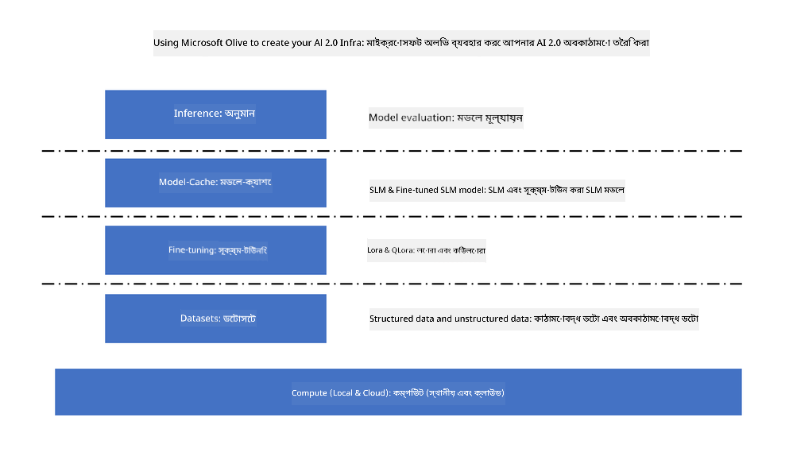

<!--
CO_OP_TRANSLATOR_METADATA:
{
  "original_hash": "5764be88ad2eb4f341e742eb8f14fab1",
  "translation_date": "2025-07-17T06:41:56+00:00",
  "source_file": "md/03.FineTuning/FineTuning_MicrosoftOlive.md",
  "language_code": "bn"
}
-->
# **Microsoft Olive দিয়ে Phi-3 ফাইন-টিউনিং**

[Olive](https://github.com/microsoft/OLive?WT.mc_id=aiml-138114-kinfeylo) একটি সহজে ব্যবহারযোগ্য হার্ডওয়্যার-সচেতন মডেল অপ্টিমাইজেশন টুল, যা মডেল কম্প্রেশন, অপ্টিমাইজেশন এবং কম্পাইলেশনের ক্ষেত্রে শিল্প-নেতৃত্বাধীন প্রযুক্তিগুলো একত্রিত করে।

এটি মেশিন লার্নিং মডেল অপ্টিমাইজ করার প্রক্রিয়াকে সহজতর করার জন্য ডিজাইন করা হয়েছে, যাতে নির্দিষ্ট হার্ডওয়্যার আর্কিটেকচারের সর্বোচ্চ দক্ষ ব্যবহার নিশ্চিত করা যায়।

আপনি ক্লাউড-ভিত্তিক অ্যাপ্লিকেশন বা এজ ডিভাইসে কাজ করুন না কেন, Olive আপনার মডেলগুলো সহজে এবং কার্যকরভাবে অপ্টিমাইজ করতে সাহায্য করে।

## প্রধান বৈশিষ্ট্যসমূহ:
- Olive নির্দিষ্ট হার্ডওয়্যার টার্গেটের জন্য অপ্টিমাইজেশন প্রযুক্তিগুলো একত্রিত এবং স্বয়ংক্রিয় করে।
- কোনো একক অপ্টিমাইজেশন প্রযুক্তি সব পরিস্থিতির জন্য উপযুক্ত নয়, তাই Olive শিল্প বিশেষজ্ঞদের তাদের অপ্টিমাইজেশন উদ্ভাবন যুক্ত করার মাধ্যমে সম্প্রসারণযোগ্যতা প্রদান করে।

## ইঞ্জিনিয়ারিং প্রচেষ্টা কমান:
- ডেভেলপারদের প্রায়ই বিভিন্ন হার্ডওয়্যার ভেন্ডর-নির্দিষ্ট টুলচেইন শিখতে এবং ব্যবহার করতে হয় ট্রেইন করা মডেল ডিপ্লয়মেন্টের জন্য প্রস্তুত ও অপ্টিমাইজ করতে।
- Olive এই অভিজ্ঞতাকে সহজ করে তোলে নির্দিষ্ট হার্ডওয়্যারের জন্য অপ্টিমাইজেশন প্রযুক্তি স্বয়ংক্রিয় করে।

## ব্যবহার-সিদ্ধ ইন্ড-টু-এন্ড অপ্টিমাইজেশন সলিউশন:

একত্রিত ও টিউন করা প্রযুক্তিগুলো ব্যবহার করে Olive একটি একক সমাধান প্রদান করে ইন্ড-টু-এন্ড অপ্টিমাইজেশনের জন্য।
এটি মডেল অপ্টিমাইজ করার সময় নির্ভুলতা ও লেটেন্সির মতো সীমাবদ্ধতাগুলো বিবেচনায় নেয়।

## Microsoft Olive দিয়ে ফাইন-টিউনিং করা

Microsoft Olive একটি খুব সহজে ব্যবহারযোগ্য ওপেন সোর্স মডেল অপ্টিমাইজেশন টুল, যা জেনারেটিভ আর্টিফিশিয়াল ইন্টেলিজেন্সের ক্ষেত্রে ফাইন-টিউনিং এবং রেফারেন্স উভয়ই কভার করতে পারে। এটি শুধুমাত্র সহজ কনফিগারেশন প্রয়োজন, ওপেন সোর্স ছোট ভাষার মডেল এবং সংশ্লিষ্ট রানটাইম পরিবেশ (AzureML / লোকাল GPU, CPU, DirectML) ব্যবহার করে, আপনি স্বয়ংক্রিয় অপ্টিমাইজেশনের মাধ্যমে মডেল ফাইন-টিউনিং বা রেফারেন্স সম্পন্ন করতে পারেন এবং ক্লাউড বা এজ ডিভাইসে ডিপ্লয় করার জন্য সেরা মডেলটি খুঁজে পেতে পারেন। এটি প্রতিষ্ঠানগুলোকে তাদের নিজস্ব ইন্ডাস্ট্রি ভার্টিকাল মডেল অন-প্রিমাইস এবং ক্লাউডে তৈরি করার সুযোগ দেয়।



## Microsoft Olive দিয়ে Phi-3 ফাইন টিউনিং


## Phi-3 Olive স্যাম্পল কোড এবং উদাহরণ
এই উদাহরণে আপনি Olive ব্যবহার করে:

- LoRA অ্যাডাপ্টার ফাইন-টিউন করবেন যা বাক্যাংশগুলোকে Sad, Joy, Fear, Surprise শ্রেণীবদ্ধ করবে।
- অ্যাডাপ্টারের ওজনগুলো বেস মডেলের সাথে মার্জ করবেন।
- মডেলটিকে অপ্টিমাইজ এবং int4 কোয়ান্টাইজ করবেন।

[Sample Code](../../code/03.Finetuning/olive-ort-example/README.md)

### Microsoft Olive সেটআপ

Microsoft Olive ইনস্টলেশন খুবই সহজ, এবং CPU, GPU, DirectML, এবং Azure ML এর জন্য ইনস্টল করা যায়।

```bash
pip install olive-ai
```

যদি আপনি CPU দিয়ে ONNX মডেল চালাতে চান, তাহলে ব্যবহার করতে পারেন

```bash
pip install olive-ai[cpu]
```

যদি GPU দিয়ে ONNX মডেল চালাতে চান, তাহলে ব্যবহার করতে পারেন

```python
pip install olive-ai[gpu]
```

Azure ML ব্যবহার করতে চাইলে

```python
pip install git+https://github.com/microsoft/Olive#egg=olive-ai[azureml]
```

**দ্রষ্টব্য**
OS প্রয়োজনীয়তা: Ubuntu 20.04 / 22.04

### **Microsoft Olive এর Config.json**

ইনস্টলেশনের পর, আপনি Config ফাইলের মাধ্যমে বিভিন্ন মডেল-নির্দিষ্ট সেটিংস কনফিগার করতে পারবেন, যার মধ্যে রয়েছে ডেটা, কম্পিউটিং, ট্রেনিং, ডিপ্লয়মেন্ট, এবং মডেল জেনারেশন।

**1. ডেটা**

Microsoft Olive এ লোকাল ডেটা এবং ক্লাউড ডেটা উভয়েই ট্রেনিং সাপোর্ট করে, এবং এগুলো সেটিংসে কনফিগার করা যায়।

*লোকাল ডেটা সেটিংস*

আপনি সহজেই ফাইন-টিউনিং এর জন্য ট্রেনিং ডেটাসেট সেটআপ করতে পারেন, সাধারণত json ফরম্যাটে, এবং ডেটা টেমপ্লেটের সাথে মানিয়ে নিতে হবে। এটি মডেলের প্রয়োজন অনুযায়ী সামঞ্জস্য করতে হবে (যেমন, Microsoft Phi-3-mini এর জন্য প্রয়োজনীয় ফরম্যাটে মানিয়ে নেওয়া। অন্য মডেল থাকলে, তাদের ফাইন-টিউনিং ফরম্যাট অনুসারে প্রক্রিয়া করুন)

```json

    "data_configs": [
        {
            "name": "dataset_default_train",
            "type": "HuggingfaceContainer",
            "load_dataset_config": {
                "params": {
                    "data_name": "json", 
                    "data_files":"dataset/dataset-classification.json",
                    "split": "train"
                }
            },
            "pre_process_data_config": {
                "params": {
                    "dataset_type": "corpus",
                    "text_cols": [
                            "phrase",
                            "tone"
                    ],
                    "text_template": "### Text: {phrase}\n### The tone is:\n{tone}",
                    "corpus_strategy": "join",
                    "source_max_len": 2048,
                    "pad_to_max_len": false,
                    "use_attention_mask": false
                }
            }
        }
    ],
```

**ক্লাউড ডেটা সোর্স সেটিংস**

Azure AI Studio/Azure Machine Learning Service এর ডেটাস্টোর লিঙ্ক করে ক্লাউডের ডেটা সংযুক্ত করা যায়, এবং Microsoft Fabric ও Azure Data এর মাধ্যমে বিভিন্ন ডেটা সোর্স Azure AI Studio/Azure Machine Learning Service এ ইমপোর্ট করে ফাইন-টিউনিং এর জন্য ব্যবহার করা যায়।

```json

    "data_configs": [
        {
            "name": "dataset_default_train",
            "type": "HuggingfaceContainer",
            "load_dataset_config": {
                "params": {
                    "data_name": "json", 
                    "data_files": {
                        "type": "azureml_datastore",
                        "config": {
                            "azureml_client": {
                                "subscription_id": "Your Azure Subscrition ID",
                                "resource_group": "Your Azure Resource Group",
                                "workspace_name": "Your Azure ML Workspaces name"
                            },
                            "datastore_name": "workspaceblobstore",
                            "relative_path": "Your train_data.json Azure ML Location"
                        }
                    },
                    "split": "train"
                }
            },
            "pre_process_data_config": {
                "params": {
                    "dataset_type": "corpus",
                    "text_cols": [
                            "Question",
                            "Best Answer"
                    ],
                    "text_template": "<|user|>\n{Question}<|end|>\n<|assistant|>\n{Best Answer}\n<|end|>",
                    "corpus_strategy": "join",
                    "source_max_len": 2048,
                    "pad_to_max_len": false,
                    "use_attention_mask": false
                }
            }
        }
    ],
    
```

**2. কম্পিউটিং কনফিগারেশন**

যদি লোকাল ব্যবহার করতে চান, তাহলে সরাসরি লোকাল ডেটা রিসোর্স ব্যবহার করতে পারেন। Azure AI Studio / Azure Machine Learning Service এর রিসোর্স ব্যবহার করতে হলে সংশ্লিষ্ট Azure প্যারামিটার, কম্পিউটিং পাওয়ার নাম ইত্যাদি কনফিগার করতে হবে।

```json

    "systems": {
        "aml": {
            "type": "AzureML",
            "config": {
                "accelerators": ["gpu"],
                "hf_token": true,
                "aml_compute": "Your Azure AI Studio / Azure Machine Learning Service Compute Name",
                "aml_docker_config": {
                    "base_image": "Your Azure AI Studio / Azure Machine Learning Service docker",
                    "conda_file_path": "conda.yaml"
                }
            }
        },
        "azure_arc": {
            "type": "AzureML",
            "config": {
                "accelerators": ["gpu"],
                "aml_compute": "Your Azure AI Studio / Azure Machine Learning Service Compute Name",
                "aml_docker_config": {
                    "base_image": "Your Azure AI Studio / Azure Machine Learning Service docker",
                    "conda_file_path": "conda.yaml"
                }
            }
        }
    },
```

***দ্রষ্টব্য***

Azure AI Studio/Azure Machine Learning Service এ কন্টেইনারের মাধ্যমে রান হওয়ায় প্রয়োজনীয় পরিবেশ কনফিগার করতে হবে। এটি conda.yaml পরিবেশে কনফিগার করা হয়।

```yaml

name: project_environment
channels:
  - defaults
dependencies:
  - python=3.8.13
  - pip=22.3.1
  - pip:
      - einops
      - accelerate
      - azure-keyvault-secrets
      - azure-identity
      - bitsandbytes
      - datasets
      - huggingface_hub
      - peft
      - scipy
      - sentencepiece
      - torch>=2.2.0
      - transformers
      - git+https://github.com/microsoft/Olive@jiapli/mlflow_loading_fix#egg=olive-ai[gpu]
      - --extra-index-url https://aiinfra.pkgs.visualstudio.com/PublicPackages/_packaging/ORT-Nightly/pypi/simple/ 
      - ort-nightly-gpu==1.18.0.dev20240307004
      - --extra-index-url https://aiinfra.pkgs.visualstudio.com/PublicPackages/_packaging/onnxruntime-genai/pypi/simple/
      - onnxruntime-genai-cuda

    

```

**3. আপনার SLM নির্বাচন করুন**

আপনি সরাসরি Hugging Face থেকে মডেল ব্যবহার করতে পারেন, অথবা Azure AI Studio / Azure Machine Learning এর Model Catalog থেকে মডেল নির্বাচন করতে পারেন। নিচের কোড উদাহরণে Microsoft Phi-3-mini ব্যবহার করা হয়েছে।

যদি মডেল আপনার লোকাল থাকে, তাহলে এই পদ্ধতি ব্যবহার করুন

```json

    "input_model":{
        "type": "PyTorchModel",
        "config": {
            "hf_config": {
                "model_name": "model-cache/microsoft/phi-3-mini",
                "task": "text-generation",
                "model_loading_args": {
                    "trust_remote_code": true
                }
            }
        }
    },
```

Azure AI Studio / Azure Machine Learning Service থেকে মডেল ব্যবহার করতে চাইলে এই পদ্ধতি ব্যবহার করুন

```json

    "input_model":{
        "type": "PyTorchModel",
        "config": {
            "model_path": {
                "type": "azureml_registry_model",
                "config": {
                    "name": "microsoft/Phi-3-mini-4k-instruct",
                    "registry_name": "azureml-msr",
                    "version": "11"
                }
            },
             "model_file_format": "PyTorch.MLflow",
             "hf_config": {
                "model_name": "microsoft/Phi-3-mini-4k-instruct",
                "task": "text-generation",
                "from_pretrained_args": {
                    "trust_remote_code": true
                }
            }
        }
    },
```

**দ্রষ্টব্য:**
আমাদের Azure AI Studio / Azure Machine Learning Service এর সাথে ইন্টিগ্রেট করতে হবে, তাই মডেল সেটআপের সময় ভার্সন নম্বর এবং সংশ্লিষ্ট নামকরণ অনুসরণ করুন।

Azure এর সব মডেল PyTorch.MLflow এ সেট করতে হবে।

Hugging Face অ্যাকাউন্ট থাকতে হবে এবং Azure AI Studio / Azure Machine Learning এর Key মানের সাথে কী বাইন্ড করতে হবে।

**4. অ্যালগরিদম**

Microsoft Olive Lora এবং QLora ফাইন-টিউনিং অ্যালগরিদমগুলো খুব ভালোভাবে এনক্যাপসুলেট করে। আপনাকে শুধু কিছু প্রাসঙ্গিক প্যারামিটার কনফিগার করতে হবে। এখানে QLora উদাহরণ হিসেবে নেওয়া হয়েছে।

```json
        "lora": {
            "type": "LoRA",
            "config": {
                "target_modules": [
                    "o_proj",
                    "qkv_proj"
                ],
                "double_quant": true,
                "lora_r": 64,
                "lora_alpha": 64,
                "lora_dropout": 0.1,
                "train_data_config": "dataset_default_train",
                "eval_dataset_size": 0.3,
                "training_args": {
                    "seed": 0,
                    "data_seed": 42,
                    "per_device_train_batch_size": 1,
                    "per_device_eval_batch_size": 1,
                    "gradient_accumulation_steps": 4,
                    "gradient_checkpointing": false,
                    "learning_rate": 0.0001,
                    "num_train_epochs": 3,
                    "max_steps": 10,
                    "logging_steps": 10,
                    "evaluation_strategy": "steps",
                    "eval_steps": 187,
                    "group_by_length": true,
                    "adam_beta2": 0.999,
                    "max_grad_norm": 0.3
                }
            }
        },
```

যদি কোয়ান্টাইজেশন কনভার্সন করতে চান, Microsoft Olive এর মেইন ব্রাঞ্চ ইতোমধ্যে onnxruntime-genai পদ্ধতি সাপোর্ট করে। আপনার প্রয়োজন অনুযায়ী এটি সেট করতে পারেন:

1. অ্যাডাপ্টার ওজনগুলো বেস মডেলের সাথে মার্জ করুন
2. ModelBuilder দিয়ে মডেলকে প্রয়োজনীয় প্রিসিশনে onnx মডেলে রূপান্তর করুন

যেমন কোয়ান্টাইজড INT4 এ রূপান্তর করা

```json

        "merge_adapter_weights": {
            "type": "MergeAdapterWeights"
        },
        "builder": {
            "type": "ModelBuilder",
            "config": {
                "precision": "int4"
            }
        }
```

**দ্রষ্টব্য**
- QLoRA ব্যবহার করলে, ONNXRuntime-genai এর কোয়ান্টাইজেশন কনভার্সন আপাতত সাপোর্ট করে না।

- এখানে উল্লেখ করা দরকার যে, আপনি উপরের ধাপগুলো আপনার প্রয়োজন অনুযায়ী সেট করতে পারেন। সম্পূর্ণরূপে সব ধাপ কনফিগার করা বাধ্যতামূলক নয়। আপনার প্রয়োজন অনুযায়ী সরাসরি অ্যালগরিদমের ধাপগুলো ব্যবহার করতে পারেন ফাইন-টিউনিং ছাড়াই। শেষে প্রাসঙ্গিক ইঞ্জিনগুলো কনফিগার করতে হবে।

```json

    "engine": {
        "log_severity_level": 0,
        "host": "aml",
        "target": "aml",
        "search_strategy": false,
        "execution_providers": ["CUDAExecutionProvider"],
        "cache_dir": "../model-cache/models/phi3-finetuned/cache",
        "output_dir" : "../model-cache/models/phi3-finetuned"
    }
```

**5. ফাইন-টিউনিং সম্পন্ন**

কমান্ড লাইনে, olive-config.json ফাইলের ডিরেক্টরিতে নিচের কমান্ড চালান

```bash
olive run --config olive-config.json  
```

**অস্বীকৃতি**:  
এই নথিটি AI অনুবাদ সেবা [Co-op Translator](https://github.com/Azure/co-op-translator) ব্যবহার করে অনূদিত হয়েছে। আমরা যথাসাধ্য সঠিকতার চেষ্টা করি, তবে স্বয়ংক্রিয় অনুবাদে ত্রুটি বা অসঙ্গতি থাকতে পারে। মূল নথিটি তার নিজস্ব ভাষায়ই কর্তৃত্বপূর্ণ উৎস হিসেবে বিবেচিত হওয়া উচিত। গুরুত্বপূর্ণ তথ্যের জন্য পেশাদার মানব অনুবাদ গ্রহণ করার পরামর্শ দেওয়া হয়। এই অনুবাদের ব্যবহারে সৃষ্ট কোনো ভুল বোঝাবুঝি বা ভুল ব্যাখ্যার জন্য আমরা দায়ী নই।