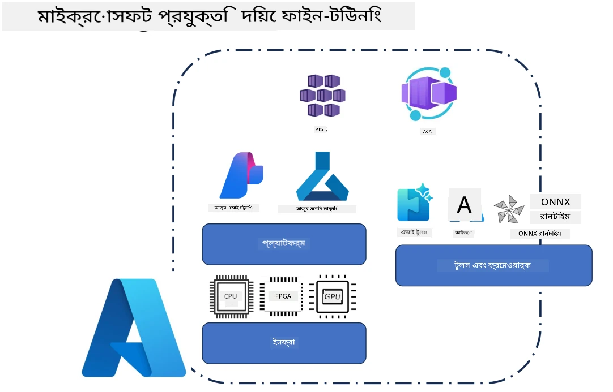
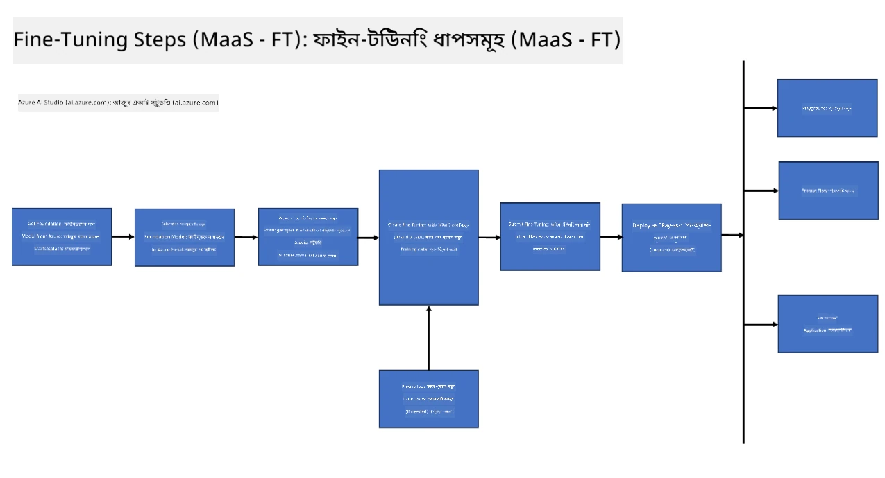
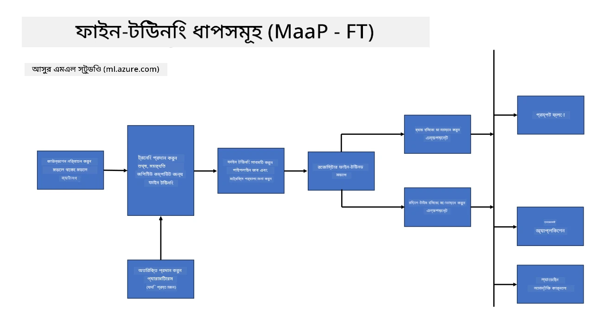
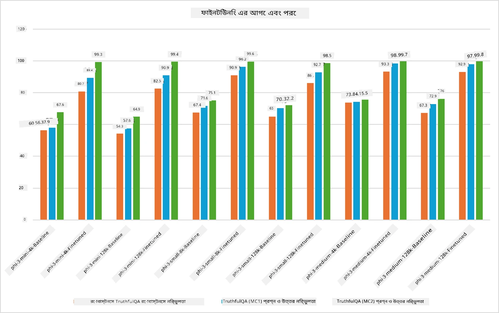

## ফাইন টিউনিং পরিস্থিতি

**প্ল্যাটফর্ম** এর মধ্যে রয়েছে বিভিন্ন প্রযুক্তি যেমন Azure AI Foundry, Azure Machine Learning, AI Tools, Kaito, এবং ONNX Runtime।

**ইনফ্রাস্ট্রাকচার** এর মধ্যে রয়েছে CPU এবং FPGA, যা ফাইন-টিউনিং প্রক্রিয়ার জন্য অপরিহার্য। আমি আপনাদের জন্য প্রতিটি প্রযুক্তির আইকন দেখাচ্ছি।

**টুলস ও ফ্রেমওয়ার্ক** এর মধ্যে রয়েছে ONNX Runtime এবং ONNX Runtime। আমি আপনাদের জন্য প্রতিটি প্রযুক্তির আইকন দেখাচ্ছি।  
[ONNX Runtime এবং ONNX Runtime এর আইকন এখানে যুক্ত করুন]

মাইক্রোসফট প্রযুক্তির মাধ্যমে ফাইন-টিউনিং প্রক্রিয়ায় বিভিন্ন উপাদান এবং টুলস ব্যবহৃত হয়। এই প্রযুক্তিগুলো বুঝে এবং ব্যবহার করে আমরা আমাদের অ্যাপ্লিকেশনগুলো কার্যকরভাবে ফাইন-টিউন করতে পারি এবং উন্নত সমাধান তৈরি করতে পারি।

## Model as Service

হোস্টেড ফাইন-টিউনিং ব্যবহার করে মডেল ফাইন-টিউন করুন, কম্পিউট তৈরি ও পরিচালনার প্রয়োজন ছাড়াই।

Phi-3-mini এবং Phi-3-medium মডেলের জন্য সার্ভারলেস ফাইন-টিউনিং উপলব্ধ, যা ডেভেলপারদের দ্রুত এবং সহজে ক্লাউড ও এজ পরিস্থিতির জন্য মডেলগুলো কাস্টমাইজ করতে দেয়, কম্পিউটের ব্যবস্থা না করেই। আমরা আরও ঘোষণা করেছি যে, Phi-3-small এখন আমাদের Models-as-a-Service অফারিং এর মাধ্যমে পাওয়া যাচ্ছে, যাতে ডেভেলপাররা দ্রুত এবং সহজে AI ডেভেলপমেন্ট শুরু করতে পারেন, নিচের অবকাঠামো পরিচালনা না করেই।

## Model as a Platform

ব্যবহারকারীরা তাদের নিজস্ব কম্পিউট পরিচালনা করে তাদের মডেল ফাইন-টিউন করেন।

[Fine Tuning Sample](https://github.com/Azure/azureml-examples/blob/main/sdk/python/foundation-models/system/finetune/chat-completion/chat-completion.ipynb)

## Fine Tuning Scenarios

| | | | | | | |
|-|-|-|-|-|-|-|
|পরিস্থিতি|LoRA|QLoRA|PEFT|DeepSpeed|ZeRO|DORA|
|প্রি-ট্রেইনড LLMs কে নির্দিষ্ট কাজ বা ডোমেইনে মানিয়ে নেওয়া|হ্যাঁ|হ্যাঁ|হ্যাঁ|হ্যাঁ|হ্যাঁ|হ্যাঁ|
|টেক্সট ক্লাসিফিকেশন, নামড এন্টিটি রিকগনিশন, এবং মেশিন ট্রান্সলেশন এর মতো NLP কাজের জন্য ফাইন-টিউনিং|হ্যাঁ|হ্যাঁ|হ্যাঁ|হ্যাঁ|হ্যাঁ|হ্যাঁ|
|QA কাজের জন্য ফাইন-টিউনিং|হ্যাঁ|হ্যাঁ|হ্যাঁ|হ্যাঁ|হ্যাঁ|হ্যাঁ|
|চ্যাটবটের জন্য মানবসদৃশ প্রতিক্রিয়া তৈরি করতে ফাইন-টিউনিং|হ্যাঁ|হ্যাঁ|হ্যাঁ|হ্যাঁ|হ্যাঁ|হ্যাঁ|
|সঙ্গীত, শিল্প বা অন্যান্য সৃজনশীল কাজ তৈরি করতে ফাইন-টিউনিং|হ্যাঁ|হ্যাঁ|হ্যাঁ|হ্যাঁ|হ্যাঁ|হ্যাঁ|
|কম্পিউটেশনাল এবং আর্থিক খরচ কমানো|হ্যাঁ|হ্যাঁ|না|হ্যাঁ|হ্যাঁ|না|
|মেমোরি ব্যবহারের পরিমাণ কমানো|না|হ্যাঁ|না|হ্যাঁ|হ্যাঁ|হ্যাঁ|
|কার্যকর ফাইন-টিউনিং এর জন্য কম প্যারামিটার ব্যবহার|না|হ্যাঁ|হ্যাঁ|না|না|হ্যাঁ|
|মেমোরি-সাশ্রয়ী ডেটা প্যারালেলিজম যা উপলব্ধ সব GPU ডিভাইসের সম্মিলিত GPU মেমোরি অ্যাক্সেস দেয়|না|না|না|হ্যাঁ|হ্যাঁ|হ্যাঁ|

## Fine Tuning Performance Examples

**অস্বীকৃতি**:  
এই নথিটি AI অনুবাদ সেবা [Co-op Translator](https://github.com/Azure/co-op-translator) ব্যবহার করে অনূদিত হয়েছে। আমরা যথাসাধ্য সঠিকতার চেষ্টা করি, তবে স্বয়ংক্রিয় অনুবাদে ত্রুটি বা অসঙ্গতি থাকতে পারে। মূল নথিটি তার নিজস্ব ভাষায়ই কর্তৃত্বপূর্ণ উৎস হিসেবে বিবেচিত হওয়া উচিত। গুরুত্বপূর্ণ তথ্যের জন্য পেশাদার মানব অনুবাদ গ্রহণ করার পরামর্শ দেওয়া হয়। এই অনুবাদের ব্যবহারে সৃষ্ট কোনো ভুল বোঝাবুঝি বা ভুল ব্যাখ্যার জন্য আমরা দায়ী নই।