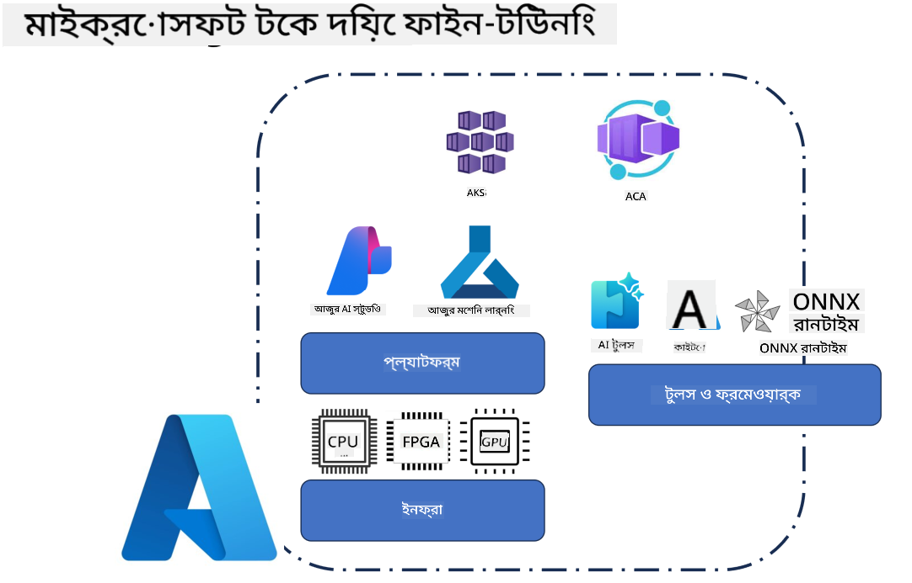
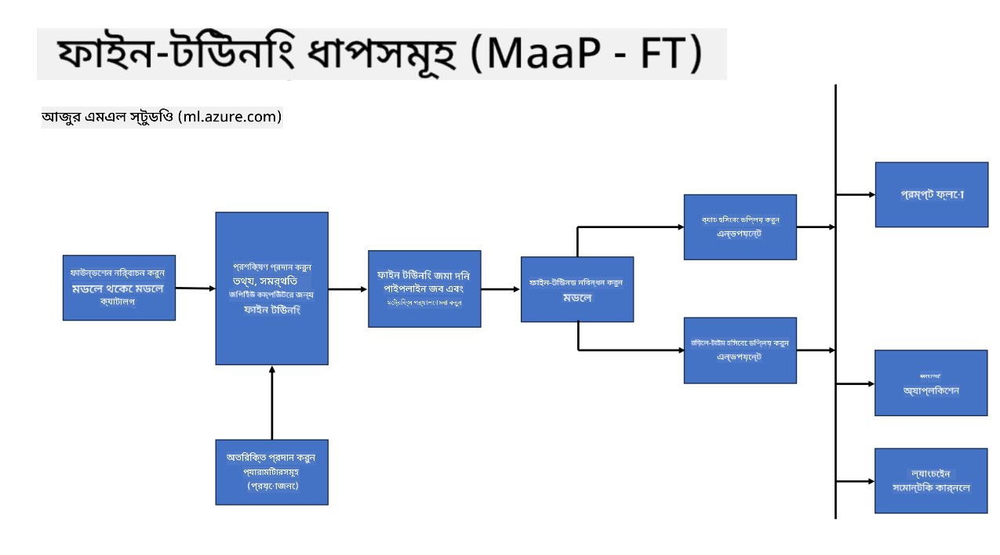
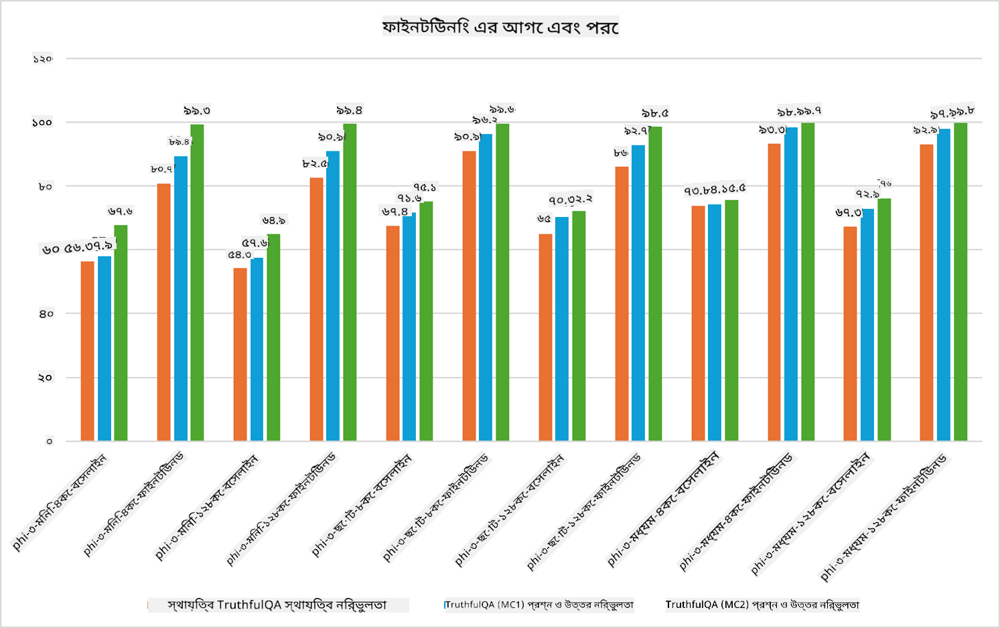

<!--
CO_OP_TRANSLATOR_METADATA:
{
  "original_hash": "cb5648935f63edc17e95ce38f23adc32",
  "translation_date": "2025-05-09T21:54:06+00:00",
  "source_file": "md/03.FineTuning/FineTuning_Scenarios.md",
  "language_code": "bn"
}
-->
## ফাইন টিউনিং পরিস্থিতি

**প্ল্যাটফর্ম** এর মধ্যে রয়েছে বিভিন্ন প্রযুক্তি যেমন Azure AI Foundry, Azure Machine Learning, AI Tools, Kaito, এবং ONNX Runtime।

**ইনফ্রাস্ট্রাকচার** এর মধ্যে রয়েছে CPU এবং FPGA, যা ফাইন-টিউনিং প্রক্রিয়ার জন্য অত্যাবশ্যক। আমি আপনাদের জন্য এই প্রযুক্তিগুলোর আইকন দেখাবো।

**টুলস ও ফ্রেমওয়ার্ক** এর মধ্যে রয়েছে ONNX Runtime এবং ONNX Runtime। আমি আপনাদের জন্য এই প্রযুক্তিগুলোর আইকন দেখাবো।  
[Insert icons for ONNX Runtime and ONNX Runtime]

মাইক্রোসফট প্রযুক্তি ব্যবহার করে ফাইন-টিউনিং প্রক্রিয়ায় বিভিন্ন উপাদান ও টুলস জড়িত থাকে। এই প্রযুক্তিগুলো বুঝে এবং ব্যবহার করে আমরা আমাদের অ্যাপ্লিকেশনগুলো কার্যকরভাবে ফাইন-টিউন করতে পারি এবং উন্নত সমাধান তৈরি করতে পারি।

## Model as Service

হোস্টেড ফাইন-টিউনিং ব্যবহার করে মডেল ফাইন-টিউন করুন, কম্পিউট তৈরি ও পরিচালনার প্রয়োজন ছাড়াই।

Phi-3-mini এবং Phi-3-medium মডেলগুলোর জন্য সার্ভারলেস ফাইন-টিউনিং উপলব্ধ, যা ডেভেলপারদের দ্রুত এবং সহজে ক্লাউড ও এজ পরিস্থিতির জন্য মডেলগুলো কাস্টমাইজ করতে দেয়, কম্পিউটের ব্যবস্থা না করেই। আমরা আরও ঘোষণা করেছি যে, Phi-3-small এখন Models-as-a-Service অফারিংয়ের মাধ্যমে পাওয়া যাচ্ছে, যাতে ডেভেলপাররা দ্রুত এবং সহজে AI ডেভেলপমেন্ট শুরু করতে পারে, নিচের ইনফ্রাস্ট্রাকচার ম্যানেজ না করেই।

## Model as a Platform

ব্যবহারকারীরা তাদের নিজস্ব কম্পিউট পরিচালনা করে তাদের মডেল ফাইন-টিউন করেন।

[Fine Tuning Sample](https://github.com/Azure/azureml-examples/blob/main/sdk/python/foundation-models/system/finetune/chat-completion/chat-completion.ipynb)

## Fine Tuning Scenarios

| | | | | | | |
|-|-|-|-|-|-|-|
|Scenario|LoRA|QLoRA|PEFT|DeepSpeed|ZeRO|DORA|
|প্রি-ট্রেইনড LLMs নির্দিষ্ট কাজ বা ডোমেইনে মানিয়ে নেওয়া|Yes|Yes|Yes|Yes|Yes|Yes|
|টেক্সট ক্লাসিফিকেশন, নামড এন্টিটি রিকগনিশন, মেশিন ট্রান্সলেশন-এর মতো NLP কাজের জন্য ফাইন-টিউনিং|Yes|Yes|Yes|Yes|Yes|Yes|
|QA কাজের জন্য ফাইন-টিউনিং|Yes|Yes|Yes|Yes|Yes|Yes|
|চ্যাটবটের মানবসদৃশ প্রতিক্রিয়া তৈরি করার জন্য ফাইন-টিউনিং|Yes|Yes|Yes|Yes|Yes|Yes|
|সঙ্গীত, শিল্পকলা বা অন্যান্য সৃজনশীল কাজের জন্য ফাইন-টিউনিং|Yes|Yes|Yes|Yes|Yes|Yes|
|কম্পিউটেশনাল এবং আর্থিক খরচ কমানো|Yes|Yes|No|Yes|Yes|No|
|মেমোরি ব্যবহার কমানো|No|Yes|No|Yes|Yes|Yes|
|দক্ষতার সাথে কম প্যারামিটার ব্যবহার করে ফাইন-টিউনিং করা|No|Yes|Yes|No|No|Yes|
|ডেটা প্যারালালিজমের মেমোরি-দক্ষ ফর্ম যা সব GPU ডিভাইসের সম্মিলিত GPU মেমোরিতে অ্যাক্সেস দেয়|No|No|No|Yes|Yes|Yes|

## Fine Tuning Performance Examples

**দায়িত্বস্বীকার**:  
এই নথিটি AI অনুবাদ সেবা [Co-op Translator](https://github.com/Azure/co-op-translator) ব্যবহার করে অনূদিত হয়েছে। আমরা যথাসাধ্য সঠিকতার চেষ্টা করি, তবে স্বয়ংক্রিয় অনুবাদে ভুল বা অসঙ্গতি থাকতে পারে। মূল নথি তার নিজস্ব ভাষায়ই প্রামাণিক উৎস হিসেবে বিবেচিত হওয়া উচিত। গুরুত্বপূর্ণ তথ্যের জন্য পেশাদার মানব অনুবাদের পরামর্শ দেওয়া হয়। এই অনুবাদের ব্যবহারের ফলে যে কোনও ভুল বোঝাবুঝি বা ভুল ব্যাখ্যার জন্য আমরা দায়ী নই।