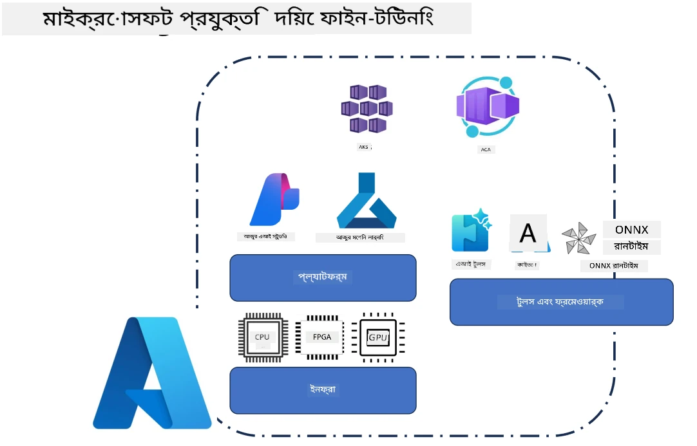
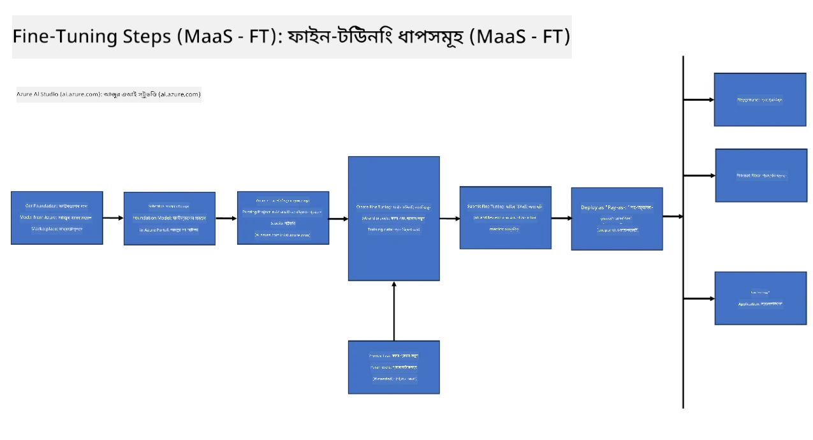
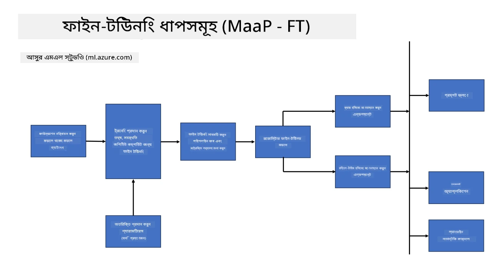
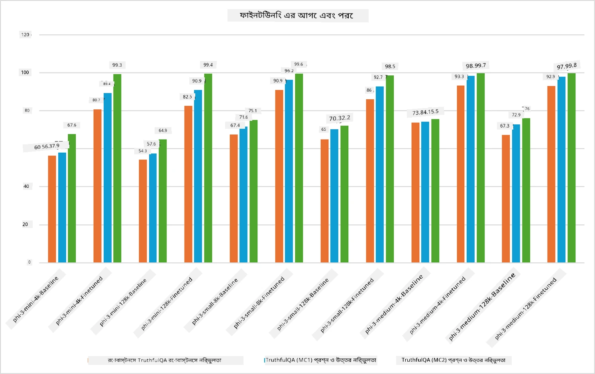

## ফাইন টিউনিং পরিস্থিতি

এই অংশটি মাইক্রোসফট ফাউন্ড্রি এবং আজার পরিবেশের ফাইন-টিউনিং পরিস্থিতির একটি সাধারণ পরিচয় প্রদান করে, যার মধ্যে রয়েছে ডিপ্লয়মেন্ট মডেল, অবকাঠামো স্তর, এবং সাধারণত ব্যবহৃত অপ্টিমাইজেশন কৌশল।

**প্ল্যাটফর্ম**  
এর মধ্যে রয়েছে ম্যানেজড সার্ভিস যেমন মাইক্রোসফট ফাউন্ড্রি (পূর্বে আজার এআই ফাউন্ড্রি) এবং আজার মেশিন লার্নিং, যা মডেল ম্যানেজমেন্ট, অর্কেস্ট্রেশন, পরীক্ষণ ট্র্যাকিং এবং ডিপ্লয়মেন্ট ওয়ার্কফ্লো প্রদান করে।

**অবকাঠামো**  
ফাইন-টিউনিং এর জন্য স্কেলেবল কম্পিউট রিসোর্স প্রয়োজন। আজার পরিবেশে, এর মধ্যে সাধারণত GPU ভিত্তিক ভার্চুয়াল মেশিন এবং লাইটওয়েট ওয়ার্কলোডের জন্য CPU রিসোর্স, পাশাপাশি ডেটাসেট এবং চেকপয়েন্টের জন্য স্কেলেবল স্টোরেজ অন্তর্ভুক্ত।

**টুলস ও ফ্রেমওয়ার্ক**  
ফাইন-টিউনিং ওয়ার্কফ্লো সাধারণত ফ্রেমওয়ার্ক এবং অপ্টিমাইজেশন লাইব্রেরির উপর নির্ভর করে যেমন Hugging Face Transformers, DeepSpeed, এবং PEFT (প্যারামিটার-এফিসিয়েন্ট ফাইন-টিউনিং)।

মাইক্রোসফট প্রযুক্তিগুলোর সঙ্গে ফাইন-টিউনিং প্রক্রিয়া প্ল্যাটফর্ম সার্ভিস, কম্পিউট অবকাঠামো এবং প্রশিক্ষণ ফ্রেমওয়ার্কগুলোর বিস্তৃত। এই উপাদানগুলি কিভাবে একসঙ্গে কাজ করে তা বুঝে ডেভেলপাররা নির্দিষ্ট কাজ এবং প্রোডাকশন পরিস্থিতিতে ফাউন্ডেশন মডেলগুলি দক্ষতার সঙ্গে অভিযোজিত করতে পারে।

## মডেল অ্যাজ সার্ভিস

হোস্টেড ফাইন-টিউনিং ব্যবহার করে মডেলটিকে ফাইন-টিউন করুন, কম্পিউট তৈরি ও পরিচালনার প্রয়োজন ছাড়া।

Phi-3, Phi-3.5, এবং Phi-4 মডেল পরিবারগুলোর জন্য এখন সার্ভারলেস ফাইন-টিউনিং উপলব্ধ, যা ডেভেলপারদের দ্রুত এবং সহজে ক্লাউড এবং এজ পরিস্থিতির জন্য মডেলগুলি কাস্টমাইজ করতে দেয় কম্পিউটের ব্যবস্থা ছাড়াই।

## মডেল অ্যাজ এ প্ল্যাটফর্ম

ব্যবহারকারীরা তাদের নিজের কম্পিউট ম্যানেজ করে নিজেদের মডেলগুলি ফাইন-টিউন করেন।

[Fine Tuning Sample](https://github.com/Azure/azureml-examples/blob/main/sdk/python/foundation-models/system/finetune/chat-completion/chat-completion.ipynb)

## ফাইন-টিউনিং কৌশল তুলনা

|পরিস্থিতি|LoRA|QLoRA|PEFT|DeepSpeed|ZeRO|DoRA|
|---|---|---|---|---|---|---|
|প্রি-ট্রেইন্ড LLMs কে নির্দিষ্ট কাজ বা ডোমেইনে মানিয়ে নেওয়া|হ্যাঁ|হ্যাঁ|হ্যাঁ|হ্যাঁ|হ্যাঁ|হ্যাঁ|
|টেক্সট ক্লাসিফিকেশন, নামড এন্টিটি রিকগনিশন, এবং মেশিন ট্রান্সলেশন মত NLP কাজের জন্য ফাইন-টিউনিং|হ্যাঁ|হ্যাঁ|হ্যাঁ|হ্যাঁ|হ্যাঁ|হ্যাঁ|
|QA কাজের জন্য ফাইন-টিউনিং|হ্যাঁ|হ্যাঁ|হ্যাঁ|হ্যাঁ|হ্যাঁ|হ্যাঁ|
|চ্যাটবটগুলিতে মানবসদৃশ প্রতিক্রিয়া তৈরি করার জন্য ফাইন-টিউনিং|হ্যাঁ|হ্যাঁ|হ্যাঁ|হ্যাঁ|হ্যাঁ|হ্যাঁ|
|সঙ্গীত, শিল্প বা অন্যান্য সৃষ্টিশীল ফর্ম তৈরির জন্য ফাইন-টিউনিং|হ্যাঁ|হ্যাঁ|হ্যাঁ|হ্যাঁ|হ্যাঁ|হ্যাঁ|
|গণনা এবং আর্থিক খরচ কমানো|হ্যাঁ|হ্যাঁ|হ্যাঁ|হ্যাঁ|হ্যাঁ|হ্যাঁ|
|মেমরি ব্যবহার কমানো|হ্যাঁ|হ্যাঁ|হ্যাঁ|হ্যাঁ|হ্যাঁ|হ্যাঁ|
|দক্ষ ফাইনটিউনিংয়ের জন্য কম প্যারামিটার ব্যবহৃত|হ্যাঁ|হ্যাঁ|হ্যাঁ|না|না|হ্যাঁ|
|ডেটা প্যারালেলিজমের মেমরি-দক্ষ ফর্ম যা উপলভ্য সকল GPU ডিভাইসের সম্মিলিত GPU মেমরিতে অ্যাক্সেস দেয়|না|না|না|হ্যাঁ|হ্যাঁ|না|

> [!NOTE]
> LoRA, QLoRA, PEFT, এবং DoRA হলো প্যারামিটার-এফিসিয়েন্ট ফাইন-টিউনিং পদ্ধতি, যেখানে DeepSpeed এবং ZeRO বিতরণকৃত প্রশিক্ষণ এবং মেমরি অপ্টিমাইজেশনে ফোকাস করে।

## ফাইন টিউনিং পারফরম্যান্স উদাহরণ

---

<!-- CO-OP TRANSLATOR DISCLAIMER START -->
**অস্বীকৃতি**:
এই নথিটি AI অনুবাদ সেবা [Co-op Translator](https://github.com/Azure/co-op-translator) ব্যবহার করে অনূদিত হয়েছে। যদিও আমরা যথাযথতার জন্য চেষ্টা করি, অনুগ্রহ করে অবগত থাকুন যে স্বয়ংক্রিয় অনুবাদে ভুল বা অসঙ্গতি থাকতে পারে। মূল নথিটি তার নিজ ভাষায় কর্তৃত্বপ্রাপ্ত উৎস হিসেবে বিবেচিত হওয়া উচিত। গুরুত্বপূর্ণ তথ্যের জন্য পেশাদার মানব অনুবাদ সুপারিশ করা হয়। এই অনুবাদের ব্যবহারে কোনো ভুল বোঝাবুঝি বা ভুল ব্যাখ্যার জন্য আমরা দায়ি নই।
<!-- CO-OP TRANSLATOR DISCLAIMER END -->