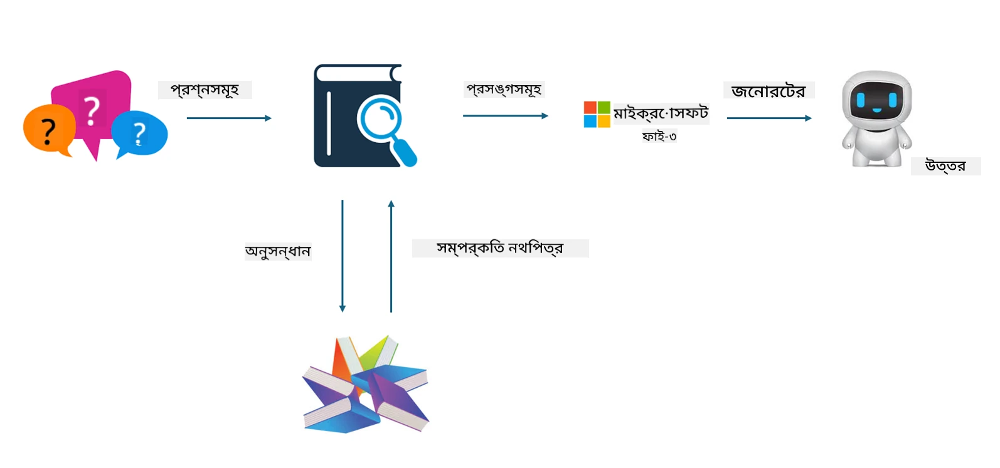

## ফাইনটিউনিং বনাম RAG

## Retrieval Augmented Generation

RAG হলো ডেটা রিট্রিভাল + টেক্সট জেনারেশন। এন্টারপ্রাইজের স্ট্রাকচার্ড এবং আনস্ট্রাকচার্ড ডেটা ভেক্টর ডাটাবেসে সংরক্ষিত থাকে। প্রাসঙ্গিক কন্টেন্ট খোঁজার সময়, প্রাসঙ্গিক সারাংশ এবং কন্টেন্ট খুঁজে বের করে একটি প্রসঙ্গ তৈরি করা হয়, এবং LLM/SLM এর টেক্সট কমপ্লিশন ক্ষমতার সাথে মিলিয়ে কন্টেন্ট তৈরি করা হয়।

## RAG প্রক্রিয়া

## ফাইনটিউনিং
ফাইনটিউনিং হলো একটি নির্দিষ্ট মডেলের উন্নতির উপর ভিত্তি করে। এটি মডেল অ্যালগরিদম থেকে শুরু করতে হয় না, তবে ডেটা ধারাবাহিকভাবে সংগ্রহ করতে হয়। যদি আপনি শিল্প অ্যাপ্লিকেশনে আরও সঠিক টার্মিনোলজি এবং ভাষার প্রকাশ চান, তাহলে ফাইনটিউনিং আপনার জন্য ভালো বিকল্প। কিন্তু যদি আপনার ডেটা প্রায়ই পরিবর্তিত হয়, তাহলে ফাইনটিউনিং জটিল হয়ে যেতে পারে।

## কীভাবে নির্বাচন করবেন
যদি আমাদের উত্তর বাহ্যিক ডেটার পরিচয় প্রয়োজন হয়, তাহলে RAG সবচেয়ে ভালো বিকল্প

যদি আপনি স্থিতিশীল এবং সুনির্দিষ্ট শিল্প জ্ঞান আউটপুট করতে চান, তাহলে ফাইনটিউনিং ভালো হবে। RAG প্রাসঙ্গিক কন্টেন্ট টেনে আনার দিকে বেশি গুরুত্ব দেয়, কিন্তু সবসময় বিশেষায়িত সূক্ষ্মতা ধরতে নাও পারে।

ফাইনটিউনিংয়ের জন্য উচ্চমানের ডেটাসেট প্রয়োজন, এবং যদি ডেটার পরিমাণ খুব কম হয়, তাহলে তেমন পার্থক্য পড়বে না। RAG বেশি নমনীয়  
ফাইনটিউনিং হলো একটি ব্ল্যাক বক্স, একটি মেটাফিজিক্স, এবং এর অভ্যন্তরীণ প্রক্রিয়া বোঝা কঠিন। কিন্তু RAG ডেটার উৎস খুঁজে পাওয়া সহজ করে তোলে, ফলে হ্যালুসিনেশন বা কন্টেন্ট ত্রুটি কার্যকরভাবে সমন্বয় করা যায় এবং আরও ভালো স্বচ্ছতা প্রদান করে।

**অস্বীকৃতি**:  
এই নথিটি AI অনুবাদ সেবা [Co-op Translator](https://github.com/Azure/co-op-translator) ব্যবহার করে অনূদিত হয়েছে। আমরা যথাসাধ্য সঠিকতার চেষ্টা করি, তবে স্বয়ংক্রিয় অনুবাদে ত্রুটি বা অসঙ্গতি থাকতে পারে। মূল নথিটি তার নিজস্ব ভাষায়ই কর্তৃত্বপূর্ণ উৎস হিসেবে বিবেচিত হওয়া উচিত। গুরুত্বপূর্ণ তথ্যের জন্য পেশাদার মানব অনুবাদ গ্রহণ করার পরামর্শ দেওয়া হয়। এই অনুবাদের ব্যবহারে সৃষ্ট কোনো ভুল বোঝাবুঝি বা ভুল ব্যাখ্যার জন্য আমরা দায়ী নই।