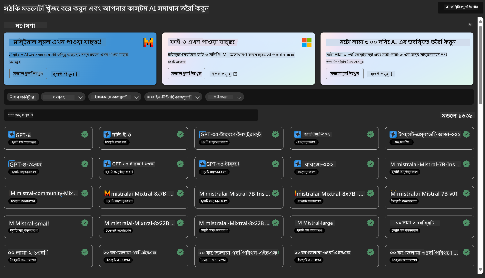
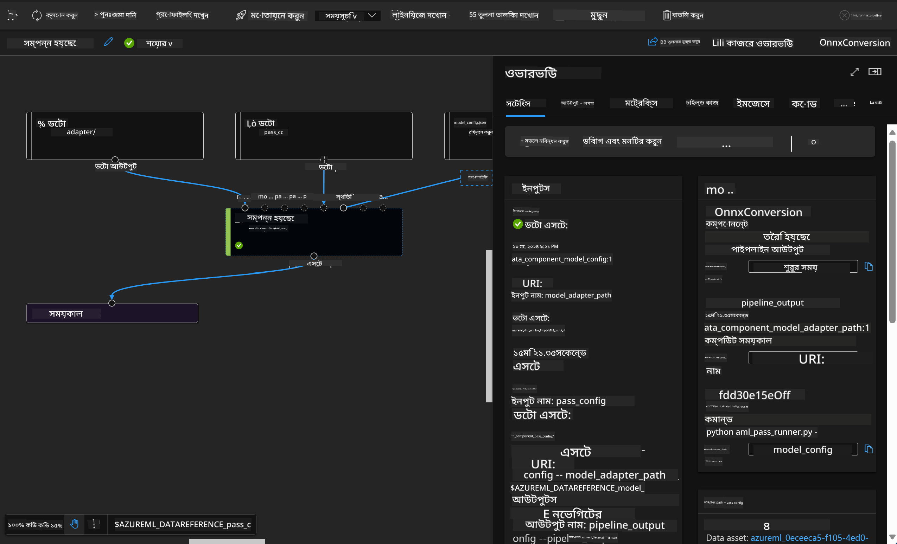

<!--
CO_OP_TRANSLATOR_METADATA:
{
  "original_hash": "7fe541373802e33568e94e13226d463c",
  "translation_date": "2025-05-09T22:17:50+00:00",
  "source_file": "md/03.FineTuning/Introduce_AzureML.md",
  "language_code": "bn"
}
-->
# **Azure Machine Learning সার্ভিস পরিচিতি**

[Azure Machine Learning](https://ml.azure.com?WT.mc_id=aiml-138114-kinfeylo) হলো একটি ক্লাউড সার্ভিস যা মেশিন লার্নিং (ML) প্রকল্পের জীবনচক্র দ্রুততর এবং পরিচালনা করার জন্য ব্যবহৃত হয়।

ML পেশাদার, ডেটা বিজ্ঞানী এবং ইঞ্জিনিয়াররা তাদের দৈনন্দিন কাজের প্রবাহে এটি ব্যবহার করতে পারেন:

- মডেল প্রশিক্ষণ এবং ডিপ্লয় করা।
- মেশিন লার্নিং অপারেশন (MLOps) পরিচালনা করা।
- আপনি Azure Machine Learning-এ একটি মডেল তৈরি করতে পারেন অথবা PyTorch, TensorFlow, বা scikit-learn-এর মতো ওপেন সোর্স প্ল্যাটফর্ম থেকে তৈরি মডেল ব্যবহার করতে পারেন।
- MLOps টুলস আপনাকে মডেল মনিটর, পুনঃপ্রশিক্ষণ এবং পুনঃডিপ্লয় করতে সাহায্য করে।

## Azure Machine Learning কার জন্য?

**ডেটা বিজ্ঞানী এবং ML ইঞ্জিনিয়াররা**

তারা তাদের দৈনন্দিন কাজের প্রবাহ দ্রুততর এবং স্বয়ংক্রিয় করতে টুলস ব্যবহার করতে পারেন।
Azure ML ন্যায়পরায়ণতা, ব্যাখ্যাযোগ্যতা, ট্র্যাকিং, এবং অডিটযোগ্যতার জন্য ফিচার সরবরাহ করে।

**অ্যাপ্লিকেশন ডেভেলপাররা**

তারা মডেলগুলোকে অ্যাপ্লিকেশন বা সার্ভিসে নির্বিঘ্নে ইন্টিগ্রেট করতে পারেন।

**প্ল্যাটফর্ম ডেভেলপাররা**

তাদের কাছে শক্তিশালী টুলসের সেট রয়েছে যা Azure Resource Manager APIs দ্বারা সমর্থিত।
এই টুলসগুলো উন্নত ML টুলিং তৈরির সুযোগ দেয়।

**এন্টারপ্রাইজ**

Microsoft Azure ক্লাউডে কাজ করার কারণে, এন্টারপ্রাইজগুলো পরিচিত নিরাপত্তা এবং রোল-ভিত্তিক অ্যাক্সেস কন্ট্রোল থেকে সুবিধা পায়।
প্রকল্পগুলো সেট আপ করে সুরক্ষিত ডেটা এবং নির্দিষ্ট অপারেশনগুলোর অ্যাক্সেস নিয়ন্ত্রণ করা যায়।

## টিমের সবাই জন্য উৎপাদনশীলতা
ML প্রকল্পগুলো সাধারণত বিভিন্ন দক্ষতার একটি টিমের প্রয়োজন হয় যা নির্মাণ এবং রক্ষণাবেক্ষণ করে।

Azure ML আপনাকে নিম্নলিখিত সুবিধাগুলো দেয়:
- শেয়ার্ড নোটবুক, কম্পিউট রিসোর্স, সার্ভারলেস কম্পিউট, ডেটা, এবং পরিবেশের মাধ্যমে আপনার টিমের সাথে সহযোগিতা করা।
- ন্যায়পরায়ণতা, ব্যাখ্যাযোগ্যতা, ট্র্যাকিং, এবং অডিটযোগ্যতা সহ মডেল তৈরি করা যা লাইনেজ এবং অডিট কমপ্লায়েন্স পূরণ করে।
- ML মডেল দ্রুত এবং সহজে স্কেলে ডিপ্লয় করা, এবং MLOps দিয়ে দক্ষভাবে মডেল পরিচালনা ও শাসন করা।
- অন্তর্নির্মিত শাসন, নিরাপত্তা, এবং কমপ্লায়েন্সের মাধ্যমে যেকোনো জায়গায় মেশিন লার্নিং ওয়ার্কলোড চালানো।

## ক্রস-কম্প্যাটিবল প্ল্যাটফর্ম টুলস

ML টিমের যেকেউ তাদের পছন্দের টুল ব্যবহার করে কাজ সম্পন্ন করতে পারে।
আপনি দ্রুত পরীক্ষা, হাইপারপ্যারামিটার টিউনিং, পাইপলাইন তৈরি, অথবা ইনফারেন্স পরিচালনা যাই করুক, আপনি পরিচিত ইন্টারফেস ব্যবহার করতে পারেন, যেমন:
- Azure Machine Learning Studio
- Python SDK (v2)
- Azure CLI (v2)
- Azure Resource Manager REST APIs

মডেল পরিমার্জন এবং উন্নয়ন চক্রের সময় সহযোগিতা করার জন্য, আপনি Azure Machine Learning স্টুডিও UI-তে অ্যাসেট, রিসোর্স, এবং মেট্রিক্স শেয়ার এবং খুঁজে পেতে পারেন।

## **Azure ML-এ LLM/SLM**

Azure ML অনেক LLM/SLM-সংক্রান্ত ফাংশন যুক্ত করেছে, যা LLMOps এবং SLMOps একত্রিত করে একটি এন্টারপ্রাইজ-ব্যাপী জেনারেটিভ কৃত্রিম বুদ্ধিমত্তার প্রযুক্তি প্ল্যাটফর্ম তৈরি করেছে।

### **মডেল ক্যাটালগ**

এন্টারপ্রাইজ ব্যবহারকারীরা বিভিন্ন ব্যবসায়িক পরিস্থিতি অনুযায়ী Model Catalog-এর মাধ্যমে বিভিন্ন মডেল ডিপ্লয় করতে পারেন এবং Model as Service হিসেবে এন্টারপ্রাইজ ডেভেলপার বা ব্যবহারকারীদের সেবা প্রদান করতে পারেন।

Azure Machine Learning স্টুডিওর Model Catalog হলো এমন একটি কেন্দ্র যেখানে আপনি জেনারেটিভ AI অ্যাপ্লিকেশন তৈরির জন্য বিস্তৃত মডেলের সন্ধান ও ব্যবহার করতে পারেন। মডেল ক্যাটালগে Azure OpenAI সার্ভিস, Mistral, Meta, Cohere, Nvidia, Hugging Face-এর মতো মডেল প্রদানকারীদের শত শত মডেল রয়েছে, যার মধ্যে Microsoft দ্বারা প্রশিক্ষিত মডেলও অন্তর্ভুক্ত। Microsoft-এর বাইরে থেকে আসা মডেলগুলো Non-Microsoft Products হিসেবে বিবেচিত হয়, যা Microsoft-এর প্রোডাক্ট টার্মস অনুযায়ী এবং মডেলের সাথে প্রদত্ত শর্তাবলীর অধীনে।

### **জব পাইপলাইন**

একটি মেশিন লার্নিং পাইপলাইনের মূল কাজ হলো একটি সম্পূর্ণ মেশিন লার্নিং টাস্ককে বহু-ধাপের ওয়ার্কফ্লোতে ভাগ করা। প্রতিটি ধাপ একটি পরিচালনাযোগ্য উপাদান যা আলাদাভাবে উন্নয়ন, অপ্টিমাইজ, কনফিগার এবং স্বয়ংক্রিয়করণ করা যায়। ধাপগুলো সুসংহত ইন্টারফেসের মাধ্যমে সংযুক্ত থাকে। Azure Machine Learning পাইপলাইন সার্ভিস স্বয়ংক্রিয়ভাবে সব ধাপের মধ্যে নির্ভরশীলতাগুলো পরিচালনা করে।

SLM / LLM ফাইন-টিউনিংয়ের ক্ষেত্রে, আমরা পাইপলাইনের মাধ্যমে আমাদের ডেটা, প্রশিক্ষণ, এবং জেনারেশন প্রক্রিয়া পরিচালনা করতে পারি।

### **প্রম্পট ফ্লো**

Azure Machine Learning প্রম্পট ফ্লো ব্যবহারের সুবিধাসমূহ
Azure Machine Learning প্রম্পট ফ্লো ব্যবহারকারীদের আইডিয়া থেকে পরীক্ষা এবং সর্বশেষে প্রোডাকশন-রেডি LLM-ভিত্তিক অ্যাপ্লিকেশন পর্যন্ত যাওয়ার জন্য বিভিন্ন সুবিধা প্রদান করে:

**প্রম্পট ইঞ্জিনিয়ারিংয়ের নমনীয়তা**

ইন্টারেক্টিভ লেখনী অভিজ্ঞতা: Azure Machine Learning প্রম্পট ফ্লো ফ্লোর গঠন ভিজ্যুয়াল রূপ দেয়, যা ব্যবহারকারীদের তাদের প্রকল্প সহজে বুঝতে এবং নেভিগেট করতে সাহায্য করে। এটি একটি নোটবুক-সদৃশ কোডিং অভিজ্ঞতাও দেয় যা ফ্লো উন্নয়ন এবং ডিবাগিংকে দ্রুততর করে।
প্রম্পট টিউনিংয়ের জন্য ভ্যারিয়েন্ট: ব্যবহারকারীরা একাধিক প্রম্পট ভ্যারিয়েন্ট তৈরি এবং তুলনা করতে পারেন, যা পুনরাবৃত্তিমূলক পরিমার্জন প্রক্রিয়াকে সহজ করে।

মূল্যায়ন: অন্তর্নির্মিত মূল্যায়ন ফ্লো ব্যবহারকারীদের তাদের প্রম্পট এবং ফ্লোর গুণমান ও কার্যকারিতা মূল্যায়ন করতে সক্ষম করে।

সম্পূর্ণ রিসোর্স: Azure Machine Learning প্রম্পট ফ্লোতে বিল্ট-ইন টুলস, স্যাম্পলস, এবং টেমপ্লেটের একটি লাইব্রেরি রয়েছে যা উন্নয়নের জন্য প্রাথমিক পয়েন্ট হিসেবে কাজ করে, সৃজনশীলতাকে উৎসাহিত করে এবং প্রক্রিয়াকে দ্রুততর করে।

**LLM-ভিত্তিক অ্যাপ্লিকেশনের জন্য এন্টারপ্রাইজ প্রস্তুতি**

সহযোগিতা: Azure Machine Learning প্রম্পট ফ্লো টিম সহযোগিতাকে সমর্থন করে, যা একাধিক ব্যবহারকারীকে প্রম্পট ইঞ্জিনিয়ারিং প্রকল্পে একসাথে কাজ করতে, জ্ঞান শেয়ার করতে এবং ভার্সন কন্ট্রোল বজায় রাখতে দেয়।

সব-ইন-ওয়ান প্ল্যাটফর্ম: Azure Machine Learning প্রম্পট ফ্লো উন্নয়ন থেকে মূল্যায়ন, ডিপ্লয়মেন্ট এবং মনিটরিং পর্যন্ত প্রম্পট ইঞ্জিনিয়ারিং প্রক্রিয়াটিকে সরল করে। ব্যবহারকারীরা সহজেই তাদের ফ্লো Azure Machine Learning এন্ডপয়েন্ট হিসেবে ডিপ্লয় করতে পারেন এবং রিয়েল-টাইমে তাদের পারফরম্যান্স মনিটর করতে পারেন, যা অপ্টিমাল অপারেশন এবং ধারাবাহিক উন্নয়ন নিশ্চিত করে।

Azure Machine Learning এন্টারপ্রাইজ রেডিনেস সলিউশনস: প্রম্পট ফ্লো Azure Machine Learning-এর শক্তিশালী এন্টারপ্রাইজ রেডিনেস সলিউশনস ব্যবহার করে, যা উন্নয়ন, পরীক্ষা, এবং ডিপ্লয়মেন্টের জন্য নিরাপদ, স্কেলেবল, এবং নির্ভরযোগ্য ভিত্তি প্রদান করে।

Azure Machine Learning প্রম্পট ফ্লোর মাধ্যমে ব্যবহারকারীরা তাদের প্রম্পট ইঞ্জিনিয়ারিংয়ের নমনীয়তা প্রকাশ করতে, কার্যকরভাবে সহযোগিতা করতে এবং সফল LLM-ভিত্তিক অ্যাপ্লিকেশন উন্নয়ন ও ডিপ্লয়মেন্টের জন্য এন্টারপ্রাইজ-গ্রেড সলিউশনস ব্যবহার করতে পারেন।

Azure ML-এর কম্পিউটিং শক্তি, ডেটা, এবং বিভিন্ন উপাদান একত্রিত করে, এন্টারপ্রাইজ ডেভেলপাররা সহজেই তাদের নিজস্ব কৃত্রিম বুদ্ধিমত্তা অ্যাপ্লিকেশন তৈরি করতে পারেন।

**অস্বীকারোক্তি**:  
এই নথিটি AI অনুবাদ সেবা [Co-op Translator](https://github.com/Azure/co-op-translator) ব্যবহার করে অনূদিত হয়েছে। আমরা যথাসাধ্য সঠিকতার চেষ্টা করি, তবে দয়া করে মনে রাখবেন যে স্বয়ংক্রিয় অনুবাদে ভুল বা অসঙ্গতি থাকতে পারে। মূল নথিটি তার নিজস্ব ভাষায় কর্তৃপক্ষপূর্ণ উৎস হিসেবে বিবেচিত হওয়া উচিত। গুরুত্বপূর্ণ তথ্যের জন্য পেশাদার মানব অনুবাদ প্রয়োজন। এই অনুবাদের ব্যবহার থেকে সৃষ্ট কোনো ভুল বোঝাবুঝি বা ভুল ব্যাখ্যার জন্য আমরা দায়ী নই।