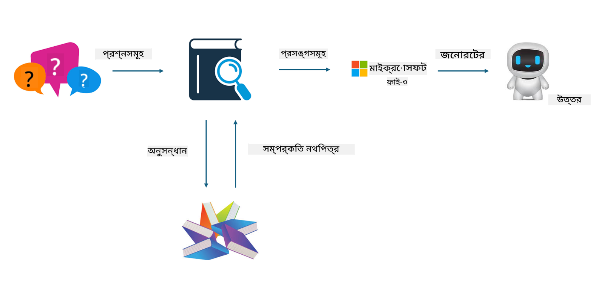

<!--
CO_OP_TRANSLATOR_METADATA:
{
  "original_hash": "743d7e9cb9c4e8ea642d77bee657a7fa",
  "translation_date": "2025-07-17T09:54:11+00:00",
  "source_file": "md/03.FineTuning/LetPhi3gotoIndustriy.md",
  "language_code": "bn"
}
-->
# **Phi-3 কে একটি শিল্প বিশেষজ্ঞ বানান**

Phi-3 মডেলকে একটি শিল্পে প্রয়োগ করতে হলে, আপনাকে শিল্পের ব্যবসায়িক ডেটা Phi-3 মডেলে যোগ করতে হবে। আমাদের দুটি ভিন্ন অপশন আছে, প্রথমটি হলো RAG (Retrieval Augmented Generation) এবং দ্বিতীয়টি হলো Fine Tuning।

## **RAG বনাম Fine-Tuning**

### **Retrieval Augmented Generation**

RAG হলো ডেটা রিট্রিভাল + টেক্সট জেনারেশন। প্রতিষ্ঠানের কাঠামোবদ্ধ এবং অ-কাঠামোবদ্ধ ডেটা ভেক্টর ডাটাবেসে সংরক্ষিত থাকে। প্রাসঙ্গিক বিষয়বস্তু খোঁজার সময়, প্রাসঙ্গিক সারাংশ এবং বিষয়বস্তু খুঁজে একটি প্রসঙ্গ তৈরি করা হয়, এবং LLM/SLM এর টেক্সট সম্পূর্ণ করার ক্ষমতার সাথে মিলিয়ে বিষয়বস্তু তৈরি করা হয়।

### **Fine-tuning**

Fine-tuning হলো একটি নির্দিষ্ট মডেলের উন্নতির উপর ভিত্তি করে। এটি মডেল অ্যালগরিদম থেকে শুরু করতে হয় না, তবে ডেটা ধারাবাহিকভাবে সংগ্রহ করতে হয়। যদি আপনি শিল্প অ্যাপ্লিকেশনে আরও সঠিক পরিভাষা এবং ভাষার প্রকাশ চান, তাহলে Fine-tuning আপনার জন্য ভালো বিকল্প। কিন্তু যদি আপনার ডেটা প্রায়ই পরিবর্তিত হয়, তাহলে Fine-tuning জটিল হয়ে যেতে পারে।

### **কিভাবে নির্বাচন করবেন**

1. যদি আমাদের উত্তরে বাহ্যিক ডেটার প্রয়োজন হয়, তাহলে RAG সেরা বিকল্প

2. যদি আপনি স্থিতিশীল এবং সুনির্দিষ্ট শিল্প জ্ঞান আউটপুট করতে চান, তাহলে Fine-tuning ভালো হবে। RAG প্রাসঙ্গিক বিষয়বস্তু টানতে অগ্রাধিকার দেয় কিন্তু সবসময় বিশেষায়িত সূক্ষ্মতা ধরতে নাও পারে।

3. Fine-tuning এর জন্য উচ্চমানের ডেটাসেট প্রয়োজন, এবং যদি ডেটা সীমিত হয়, তাহলে তেমন পার্থক্য হবে না। RAG বেশি নমনীয়।

4. Fine-tuning হলো একটি ব্ল্যাক বক্স, একটি মেটাফিজিক্স, এবং এর অভ্যন্তরীণ প্রক্রিয়া বোঝা কঠিন। কিন্তু RAG ডেটার উৎস খুঁজে পেতে সহজ করে, ফলে হ্যালুসিনেশন বা বিষয়বস্তু ত্রুটি সমন্বয় করা যায় এবং ভালো স্বচ্ছতা প্রদান করে।

### **পরিস্থিতি**

1. নির্দিষ্ট পেশাদার শব্দভাণ্ডার এবং প্রকাশের প্রয়োজন এমন উল্লম্ব শিল্পের জন্য, ***Fine-tuning*** সেরা বিকল্প

2. QA সিস্টেম, যেখানে বিভিন্ন জ্ঞান পয়েন্টের সংমিশ্রণ প্রয়োজন, ***RAG*** সেরা বিকল্প

3. স্বয়ংক্রিয় ব্যবসায়িক প্রবাহের সংমিশ্রণ ***RAG + Fine-tuning*** সেরা বিকল্প

## **RAG কিভাবে ব্যবহার করবেন**

ভেক্টর ডাটাবেস হলো এমন একটি ডেটার সংগ্রহ যা গাণিতিক ফর্মে সংরক্ষিত থাকে। ভেক্টর ডাটাবেস মেশিন লার্নিং মডেলগুলোকে পূর্বের ইনপুট মনে রাখতে সহজ করে তোলে, যা সার্চ, রিকমেন্ডেশন এবং টেক্সট জেনারেশনের মতো ব্যবহারের ক্ষেত্রে মেশিন লার্নিংকে সহায়তা করে। ডেটা সঠিক মিলের পরিবর্তে সাদৃশ্য মেট্রিক্সের ভিত্তিতে শনাক্ত করা যায়, ফলে কম্পিউটার মডেলগুলো ডেটার প্রসঙ্গ বুঝতে পারে।

ভেক্টর ডাটাবেস RAG বাস্তবায়নের মূল চাবিকাঠি। আমরা টেক্সট-এম্বেডিং-৩, jina-ai-embedding এর মতো ভেক্টর মডেলের মাধ্যমে ডেটাকে ভেক্টর স্টোরেজে রূপান্তর করতে পারি।

RAG অ্যাপ্লিকেশন তৈরির বিষয়ে আরও জানুন [https://github.com/microsoft/Phi-3CookBook](https://github.com/microsoft/Phi-3CookBook?WT.mc_id=aiml-138114-kinfeylo)

## **Fine-tuning কিভাবে ব্যবহার করবেন**

Fine-tuning এ সাধারণত ব্যবহৃত অ্যালগরিদম হলো Lora এবং QLora। কিভাবে নির্বাচন করবেন?
- [এই স্যাম্পল নোটবুক থেকে আরও জানুন](../../../../code/04.Finetuning/Phi_3_Inference_Finetuning.ipynb)
- [Python FineTuning স্যাম্পলের উদাহরণ](../../../../code/04.Finetuning/FineTrainingScript.py)

### **Lora এবং QLora**

LoRA (Low-Rank Adaptation) এবং QLoRA (Quantized Low-Rank Adaptation) উভয়ই Parameter Efficient Fine Tuning (PEFT) ব্যবহার করে বড় ভাষা মডেল (LLMs) ফাইন-টিউন করার প্রযুক্তি। PEFT প্রযুক্তিগুলো ঐতিহ্যবাহী পদ্ধতির তুলনায় মডেলগুলোকে আরও দক্ষতার সাথে প্রশিক্ষণ দেয়।  
LoRA একটি স্বতন্ত্র ফাইন-টিউনিং পদ্ধতি যা ওজন আপডেট ম্যাট্রিক্সে লো-র‍্যাঙ্ক আনুমানিকতা প্রয়োগ করে মেমোরি ব্যবহারে হ্রাস আনে। এটি দ্রুত প্রশিক্ষণ সময় দেয় এবং ঐতিহ্যবাহী ফাইন-টিউনিং পদ্ধতির কাছাকাছি পারফরম্যান্স বজায় রাখে।

QLoRA হলো LoRA এর একটি সম্প্রসারিত সংস্করণ যা মেমোরি ব্যবহারে আরও হ্রাস আনার জন্য কোয়ান্টাইজেশন প্রযুক্তি অন্তর্ভুক্ত করে। QLoRA প্রি-ট্রেইনড LLM এর ওজন প্যারামিটারগুলোকে ৪-বিট প্রিসিশনে কোয়ান্টাইজ করে, যা LoRA থেকে বেশি মেমোরি দক্ষ। তবে অতিরিক্ত কোয়ান্টাইজেশন এবং ডিকোয়ান্টাইজেশন ধাপের কারণে QLoRA প্রশিক্ষণ LoRA থেকে প্রায় ৩০% ধীর।

QLoRA কোয়ান্টাইজেশন ত্রুটির সময় সৃষ্ট ভুলগুলো ঠিক করার জন্য LoRA কে সহায়ক হিসেবে ব্যবহার করে। QLoRA তুলনামূলকভাবে ছোট, সহজলভ্য GPU তে বিলিয়ন প্যারামিটার বিশিষ্ট বিশাল মডেল ফাইন-টিউন করতে সক্ষম। উদাহরণস্বরূপ, QLoRA ৭০B প্যারামিটার মডেল ফাইন-টিউন করতে পারে যা সাধারণত ৩৬টি GPU প্রয়োজন, কিন্তু মাত্র ২টি GPU তে সম্ভব।

**অস্বীকৃতি**:  
এই নথিটি AI অনুবাদ সেবা [Co-op Translator](https://github.com/Azure/co-op-translator) ব্যবহার করে অনূদিত হয়েছে। আমরা যথাসাধ্য সঠিকতার চেষ্টা করি, তবে দয়া করে মনে রাখবেন যে স্বয়ংক্রিয় অনুবাদে ত্রুটি বা অসঙ্গতি থাকতে পারে। মূল নথিটি তার নিজস্ব ভাষায়ই কর্তৃত্বপূর্ণ উৎস হিসেবে বিবেচিত হওয়া উচিত। গুরুত্বপূর্ণ তথ্যের জন্য পেশাদার মানব অনুবাদ গ্রহণ করার পরামর্শ দেওয়া হয়। এই অনুবাদের ব্যবহারে সৃষ্ট কোনো ভুল বোঝাবুঝি বা ভুল ব্যাখ্যার জন্য আমরা দায়ী নই।