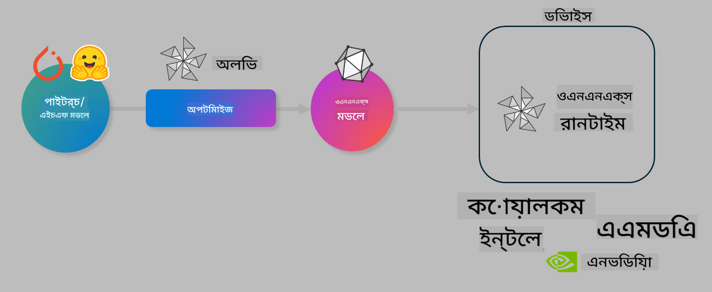

<!--
CO_OP_TRANSLATOR_METADATA:
{
  "original_hash": "6bbe47de3b974df7eea29dfeccf6032b",
  "translation_date": "2025-05-09T22:34:14+00:00",
  "source_file": "md/03.FineTuning/olive-lab/readme.md",
  "language_code": "bn"
}
-->
# Lab. ডিভাইসে inference এর জন্য AI মডেল অপ্টিমাইজ করুন

## পরিচিতি

> [!IMPORTANT]  
> এই ল্যাবে **Nvidia A10 বা A100 GPU** এবং সংশ্লিষ্ট ড্রাইভার ও CUDA টুলকিট (ভার্সন 12+) ইনস্টল থাকা প্রয়োজন।

> [!NOTE]  
> এটি একটি **৩৫-মিনিটের** ল্যাব যা আপনাকে OLIVE ব্যবহার করে ডিভাইসে inference এর জন্য মডেল অপ্টিমাইজেশনের মূল ধারণাগুলো হাতে-কলমে শেখাবে।

## শেখার উদ্দেশ্য

এই ল্যাব শেষ করার পর, আপনি OLIVE ব্যবহার করে নিম্নলিখিত কাজগুলো করতে পারবেন:

- AWQ কোয়ান্টাইজেশন পদ্ধতি ব্যবহার করে AI মডেল কোয়ান্টাইজ করা।  
- নির্দিষ্ট কাজের জন্য AI মডেল ফাইন-টিউন করা।  
- ONNX Runtime এ দক্ষ ডিভাইস inference এর জন্য LoRA অ্যাডাপ্টার (ফাইন-টিউন করা মডেল) তৈরি করা।  

### Olive কী

Olive (*O*NNX *live*) হল একটি মডেল অপ্টিমাইজেশন টুলকিট যার সাথে CLI রয়েছে, যা আপনাকে ONNX runtime +++https://onnxruntime.ai+++ এর জন্য মান এবং কর্মক্ষমতা বজায় রেখে মডেল শিপ করতে সাহায্য করে।



Olive এর ইনপুট সাধারণত PyTorch বা Hugging Face মডেল হয় এবং আউটপুট একটি অপ্টিমাইজড ONNX মডেল যা ONNX runtime চালানো ডিভাইসে (ডিপ্লয়মেন্ট টার্গেট) এক্সিকিউট হয়। Olive ডিপ্লয়মেন্ট টার্গেটের AI অ্যাক্সেলেটর (NPU, GPU, CPU) অনুযায়ী মডেল অপ্টিমাইজ করে, যা Qualcomm, AMD, Nvidia বা Intel এর মত হার্ডওয়্যার ভেন্ডার দ্বারা সরবরাহিত।

Olive একটি *workflow* চালায়, যা একধাপে একাধিক মডেল অপ্টিমাইজেশন টাস্কের সিকোয়েন্স, যাদের *passes* বলা হয় - উদাহরণস্বরূপ: মডেল কম্প্রেশন, গ্রাফ ক্যাপচার, কোয়ান্টাইজেশন, গ্রাফ অপ্টিমাইজেশন। প্রতিটি পাসের সেটিংস থাকে যা সেরা মেট্রিক্স (যেমন একিউরেসি এবং লেটেন্সি) অর্জনের জন্য টিউন করা যায়, যা সংশ্লিষ্ট evaluator দ্বারা মূল্যায়িত হয়। Olive একটি সার্চ অ্যালগরিদম ব্যবহার করে প্রতিটি পাস বা পাসের সেট স্বয়ংক্রিয়ভাবে টিউন করে।

#### Olive এর সুবিধাসমূহ

- গ্রাফ অপ্টিমাইজেশন, কম্প্রেশন ও কোয়ান্টাইজেশনের বিভিন্ন টেকনিক নিয়ে হাতেকলমে পরীক্ষার সময় এবং হতাশা কমায়। আপনার মান ও কর্মক্ষমতার শর্তাবলী নির্ধারণ করুন, Olive স্বয়ংক্রিয়ভাবে সেরা মডেল খুঁজে দেবে।  
- **৪০+ বিল্ট-ইন মডেল অপ্টিমাইজেশন কম্পোনেন্ট** যা কোয়ান্টাইজেশন, কম্প্রেশন, গ্রাফ অপ্টিমাইজেশন এবং ফাইনটিউনিং এর আধুনিক পদ্ধতি অন্তর্ভুক্ত করে।  
- সাধারণ মডেল অপ্টিমাইজেশন টাস্কের জন্য সহজ CLI, যেমন olive quantize, olive auto-opt, olive finetune।  
- মডেল প্যাকেজিং এবং ডিপ্লয়মেন্ট অন্তর্ভুক্ত।  
- **মাল্টি LoRA সার্ভিং** এর জন্য মডেল জেনারেট করার সাপোর্ট।  
- YAML/JSON ব্যবহার করে ওয়ার্কফ্লো তৈরি করে মডেল অপ্টিমাইজেশন ও ডিপ্লয়মেন্ট টাস্ক সমন্বয় করা যায়।  
- **Hugging Face** এবং **Azure AI** ইন্টিগ্রেশন।  
- বিল্ট-ইন **ক্যাশিং** মেকানিজম যা **খরচ সাশ্রয় করে**।

## ল্যাব নির্দেশাবলী

> [!NOTE]  
> নিশ্চিত করুন যে আপনি Azure AI Hub এবং প্রজেক্ট প্রোভিশন করেছেন এবং Lab 1 অনুযায়ী আপনার A100 কম্পিউট সেটআপ করেছেন।

### ধাপ ০: Azure AI Compute এ সংযোগ

আপনি **VS Code** এর রিমোট ফিচার ব্যবহার করে Azure AI কম্পিউটে সংযোগ করবেন।

1. আপনার **VS Code** ডেস্কটপ অ্যাপ খুলুন।  
2. **Shift+Ctrl+P** চাপ দিয়ে **command palette** খুলুন।  
3. কমান্ড প্যালেটে **AzureML - remote: Connect to compute instance in New Window** সার্চ করুন।  
4. অন-স্ক্রিন নির্দেশনা অনুসরণ করে কম্পিউটে সংযোগ করুন। এতে আপনার Azure Subscription, Resource Group, Project এবং Lab 1 এ সেট করা Compute নাম নির্বাচন করতে হবে।  
5. সংযোগ সফল হলে, এটি Visual Code এর **নিচের বাম পাশে** দেখাবে `><Azure ML: Compute Name`।

### ধাপ ১: রিপোজিটরি ক্লোন করুন

VS Code এ **Ctrl+J** চাপ দিয়ে নতুন টার্মিনাল খুলুন এবং এই রিপো ক্লোন করুন:

টার্মিনালে প্রম্পট দেখতে পাবেন

```
azureuser@computername:~/cloudfiles/code$ 
```  
সলিউশন ক্লোন করুন  

```bash
cd ~/localfiles
git clone https://github.com/microsoft/phi-3cookbook.git
```

### ধাপ ২: VS Code এ ফোল্ডার খুলুন

টার্মিনালে নিচের কমান্ড চালিয়ে সংশ্লিষ্ট ফোল্ডারটি খুলুন, যা নতুন উইন্ডো খুলবে:

```bash
code phi-3cookbook/code/04.Finetuning/Olive-lab
```

অথবা **File** > **Open Folder** থেকে ফোল্ডারটি খুলতে পারেন।

### ধাপ ৩: ডিপেন্ডেন্সি ইনস্টল করুন

VS Code এর Azure AI Compute ইনস্ট্যান্সে একটি টার্মিনাল খুলুন (টিপ: **Ctrl+J**) এবং নিচের কমান্ডগুলো চালিয়ে ডিপেন্ডেন্সি ইনস্টল করুন:

```bash
conda create -n olive-ai python=3.11 -y
conda activate olive-ai
pip install -r requirements.txt
az extension remove -n azure-cli-ml
az extension add -n ml
```

> [!NOTE]  
> সব ডিপেন্ডেন্সি ইনস্টল হতে প্রায় ৫ মিনিট সময় লাগবে।

এই ল্যাবে আপনি Azure AI মডেল ক্যাটালগ থেকে মডেল ডাউনলোড ও আপলোড করবেন। ক্যাটালগ অ্যাক্সেস করার জন্য Azure এ লগইন করতে হবে:

```bash
az login
```

> [!NOTE]  
> লগইন করার সময় আপনাকে সাবস্ক্রিপশন সিলেক্ট করতে বলা হবে। নিশ্চিত করুন যে ল্যাবের জন্য দেওয়া সাবস্ক্রিপশন সেট করা হয়েছে।

### ধাপ ৪: Olive কমান্ড চালান

VS Code এর Azure AI Compute ইনস্ট্যান্সে টার্মিনাল খুলুন (টিপ: **Ctrl+J**) এবং `olive-ai` কন্ডা এনভায়রনমেন্ট সক্রিয় করুন:

```bash
conda activate olive-ai
```

এরপর নিচের Olive কমান্ডগুলো চালান:

1. **ডেটা পরিদর্শন করুন:** এই উদাহরণে, Phi-3.5-Mini মডেল ফাইন-টিউন করবেন যাতে এটি ভ্রমণ সম্পর্কিত প্রশ্নের উত্তর দিতে বিশেষায়িত হয়। নিচের কোডটি JSON লাইন ফরম্যাটে ডেটাসেটের প্রথম কয়েকটি রেকর্ড দেখাবে:

    ```bash
    head data/data_sample_travel.jsonl
    ```  
2. **মডেল কোয়ান্টাইজ করুন:** মডেল ট্রেনিং করার আগে, নিচের কমান্ড দিয়ে Active Aware Quantization (AWQ) পদ্ধতি ব্যবহার করে কোয়ান্টাইজ করবেন +++https://arxiv.org/abs/2306.00978+++. AWQ মডেলের ওজন কোয়ান্টাইজ করে inference চলাকালীন উৎপন্ন অ্যাক্টিভেশন বিবেচনা করে। এর ফলে কোয়ান্টাইজেশন প্রক্রিয়া অ্যাক্টিভেশনের ডেটা ডিস্ট্রিবিউশনকে বিবেচনায় নিয়ে মডেলের একিউরেসি ভালোভাবে ধরে রাখে, যা প্রচলিত ওয়েট কোয়ান্টাইজেশন পদ্ধতির চেয়ে উন্নত।

    ```bash
    olive quantize \
       --model_name_or_path microsoft/Phi-3.5-mini-instruct \
       --trust_remote_code \
       --algorithm awq \
       --output_path models/phi/awq \
       --log_level 1
    ```

    AWQ কোয়ান্টাইজেশন সম্পন্ন হতে **প্রায় ৮ মিনিট** লাগে, যা মডেলের সাইজ প্রায় **৭.৫GB থেকে ২.৫GB** এ কমিয়ে দেয়।

    এই ল্যাবে দেখানো হয়েছে কিভাবে Hugging Face থেকে মডেল ইনপুট দিতে হয় (যেমন: `microsoft/Phi-3.5-mini-instruct`). However, Olive also allows you to input models from the Azure AI catalog by updating the `model_name_or_path` argument to an Azure AI asset ID (for example:  `azureml://registries/azureml/models/Phi-3.5-mini-instruct/versions/4`). 

1. **Train the model:** Next, the `olive finetune` কমান্ড কোয়ান্টাইজড মডেল ফাইন-টিউন করে)। কোয়ান্টাইজ করার আগে ফাইন-টিউন করলে একিউরেসি উন্নত হয় কারণ ফাইন-টিউনিং কোয়ান্টাইজেশনের কিছু ক্ষতি পুনরুদ্ধার করে।

    ```bash
    olive finetune \
        --method lora \
        --model_name_or_path models/phi/awq \
        --data_files "data/data_sample_travel.jsonl" \
        --data_name "json" \
        --text_template "<|user|>\n{prompt}<|end|>\n<|assistant|>\n{response}<|end|>" \
        --max_steps 100 \
        --output_path ./models/phi/ft \
        --log_level 1
    ```

    ফাইন-টিউন (১০০ স্টেপ) সম্পন্ন হতে **প্রায় ৬ মিনিট** লাগে।

3. **অপ্টিমাইজ করুন:** মডেল ট্রেনিংয়ের পর, Olive এর `auto-opt` command, which will capture the ONNX graph and automatically perform a number of optimizations to improve the model performance for CPU by compressing the model and doing fusions. It should be noted, that you can also optimize for other devices such as NPU or GPU by just updating the `--device` and `--provider` আর্গুমেন্ট ব্যবহার করে মডেল অপ্টিমাইজ করুন - তবে এই ল্যাবের জন্য CPU ব্যবহার করা হবে।

    ```bash
    olive auto-opt \
       --model_name_or_path models/phi/ft/model \
       --adapter_path models/phi/ft/adapter \
       --device cpu \
       --provider CPUExecutionProvider \
       --use_ort_genai \
       --output_path models/phi/onnx-ao \
       --log_level 1
    ```

    অপ্টিমাইজেশন সম্পন্ন হতে **প্রায় ৫ মিনিট** সময় লাগে।

### ধাপ ৫: মডেল ইনফারেন্স দ্রুত পরীক্ষা

মডেল ইনফারেন্স পরীক্ষা করার জন্য আপনার ফোল্ডারে **app.py** নামে একটি পাইথন ফাইল তৈরি করুন এবং নিচের কোড কপি-পেস্ট করুন:

```python
import onnxruntime_genai as og
import numpy as np

print("loading model and adapters...", end="", flush=True)
model = og.Model("models/phi/onnx-ao/model")
adapters = og.Adapters(model)
adapters.load("models/phi/onnx-ao/model/adapter_weights.onnx_adapter", "travel")
print("DONE!")

tokenizer = og.Tokenizer(model)
tokenizer_stream = tokenizer.create_stream()

params = og.GeneratorParams(model)
params.set_search_options(max_length=100, past_present_share_buffer=False)
user_input = "what is the best thing to see in chicago"
params.input_ids = tokenizer.encode(f"<|user|>\n{user_input}<|end|>\n<|assistant|>\n")

generator = og.Generator(model, params)

generator.set_active_adapter(adapters, "travel")

print(f"{user_input}")

while not generator.is_done():
    generator.compute_logits()
    generator.generate_next_token()

    new_token = generator.get_next_tokens()[0]
    print(tokenizer_stream.decode(new_token), end='', flush=True)

print("\n")
```

কোড চালানোর জন্য:

```bash
python app.py
```

### ধাপ ৬: মডেল Azure AI তে আপলোড করুন

মডেল Azure AI মডেল রিপোজিটরিতে আপলোড করলে এটি আপনার ডেভেলপমেন্ট টিমের অন্য সদস্যদের সাথে শেয়ারযোগ্য হয় এবং মডেলের ভার্সন কন্ট্রোলও সহজ হয়। মডেল আপলোড করতে নিচের কমান্ড চালান:

> [!NOTE]  
> `{}` এর মধ্যে আপনার `resourceGroup` এবং Azure AI প্রজেক্টের নাম আপডেট করুন এবং নিচের কমান্ড চালান:

```
az ml workspace show
```

অথবা +++ai.azure.com+++ এ গিয়ে **management center** > **project** > **overview** সিলেক্ট করুন।

`{}` প্লেসহোল্ডারগুলো আপনার রিসোর্স গ্রুপ এবং Azure AI প্রজেক্ট নাম দিয়ে আপডেট করুন।

```bash
az ml model create \
    --name ft-for-travel \
    --version 1 \
    --path ./models/phi/onnx-ao \
    --resource-group {RESOURCE_GROUP_NAME} \
    --workspace-name {PROJECT_NAME}
```

আপনি তারপর আপনার আপলোড করা মডেল দেখতে এবং https://ml.azure.com/model/list এ মডেল ডিপ্লয় করতে পারবেন।

**অস্বীকৃতি**:  
এই নথিটি AI অনুবাদ সেবা [Co-op Translator](https://github.com/Azure/co-op-translator) ব্যবহার করে অনূদিত হয়েছে। আমরা যথাসাধ্য সঠিকতার চেষ্টা করি, তবে অনুগ্রহ করে জানুন যে স্বয়ংক্রিয় অনুবাদে ত্রুটি বা অসঙ্গতি থাকতে পারে। মূল নথিটি তার নিজস্ব ভাষায় সর্বোত্তম এবং প্রামাণিক উৎস হিসেবে বিবেচিত হওয়া উচিত। গুরুত্বপূর্ণ তথ্যের জন্য পেশাদার মানব অনুবাদের পরামর্শ দেওয়া হয়। এই অনুবাদ ব্যবহারের ফলে সৃষ্ট কোনো ভুল বোঝাবুঝি বা ভুল ব্যাখ্যার জন্য আমরা দায়বদ্ধ নই।