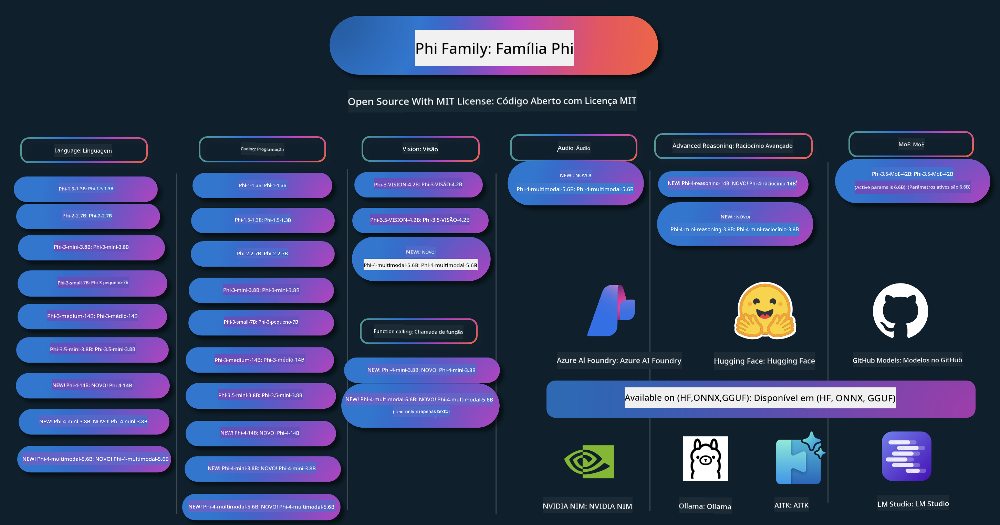

<!--
CO_OP_TRANSLATOR_METADATA:
{
  "original_hash": "1cab9282e04f2e1c388a38dca7763c16",
  "translation_date": "2025-05-09T03:51:20+00:00",
  "source_file": "README.md",
  "language_code": "br"
}
-->
# Phi Cookbook: Exemplos Práticos com os Modelos Phi da Microsoft

Phi é uma série de modelos de IA open source desenvolvidos pela Microsoft.

Atualmente, Phi é o modelo de linguagem pequeno (SLM) mais poderoso e custo-efetivo, com benchmarks muito bons em múltiplos idiomas, raciocínio, geração de texto/chat, codificação, imagens, áudio e outros cenários.

Você pode implantar o Phi na nuvem ou em dispositivos de borda, e construir facilmente aplicações de IA generativa mesmo com poder computacional limitado.

Siga estes passos para começar a usar esses recursos:
1. **Faça um fork do Repositório**: Clique em 
2. **Clone o Repositório**:   `git clone https://github.com/microsoft/PhiCookBook.git`
3. [**Participe da Comunidade Microsoft AI no Discord e conheça especialistas e outros desenvolvedores**](https://discord.com/invite/ByRwuEEgH4?WT.mc_id=aiml-137032-kinfeylo)

## 🌐 Suporte Multilíngue

### Suportado via GitHub Action (Automatizado e Sempre Atualizado)

[Francês](../fr/README.md) | [Espanhol](../es/README.md) | [Alemão](../de/README.md) | [Russo](../ru/README.md) | [Árabe](../ar/README.md) | [Persa (Farsi)](../fa/README.md) | [Urdu](../ur/README.md) | [Chinês (Simplificado)](../zh/README.md) | [Chinês (Tradicional, Macau)](../mo/README.md) | [Chinês (Tradicional, Hong Kong)](../hk/README.md) | [Chinês (Tradicional, Taiwan)](../tw/README.md) | [Japonês](../ja/README.md) | [Coreano](../ko/README.md) | [Hindi](../hi/README.md)

### Suportado via CLI
## Índice

- Introdução
- [Boas-vindas à Família Phi](./md/01.Introduction/01/01.PhiFamily.md)
  - [Configurando seu ambiente](./md/01.Introduction/01/01.EnvironmentSetup.md)
  - [Entendendo as Tecnologias Principais](./md/01.Introduction/01/01.Understandingtech.md)
  - [Segurança em IA para Modelos Phi](./md/01.Introduction/01/01.AISafety.md)
  - [Suporte de Hardware Phi](./md/01.Introduction/01/01.Hardwaresupport.md)
  - [Modelos Phi & Disponibilidade em diferentes plataformas](./md/01.Introduction/01/01.Edgeandcloud.md)
  - [Usando Guidance-ai e Phi](./md/01.Introduction/01/01.Guidance.md)
  - [Modelos do GitHub Marketplace](https://github.com/marketplace/models)
  - [Catálogo de Modelos Azure AI](https://ai.azure.com)

- Inferência Phi em diferentes ambientes
    -  [Hugging face](./md/01.Introduction/02/01.HF.md)
    -  [Modelos do GitHub](./md/01.Introduction/02/02.GitHubModel.md)
    -  [Catálogo de Modelos Azure AI Foundry](./md/01.Introduction/02/03.AzureAIFoundry.md)
    -  [Ollama](./md/01.Introduction/02/04.Ollama.md)
    -  [AI Toolkit VSCode (AITK)](./md/01.Introduction/02/05.AITK.md)
    -  [NVIDIA NIM](./md/01.Introduction/02/06.NVIDIA.md)

- Inferência Phi Família
    - [Inferência Phi no iOS](./md/01.Introduction/03/iOS_Inference.md)
    - [Inferência Phi no Android](./md/01.Introduction/03/Android_Inference.md)
    - [Inferência Phi no Jetson](./md/01.Introduction/03/Jetson_Inference.md)
    - [Inferência Phi no AI PC](./md/01.Introduction/03/AIPC_Inference.md)
    - [Inferência Phi com Apple MLX Framework](./md/01.Introduction/03/MLX_Inference.md)
    - [Inferência Phi no Servidor Local](./md/01.Introduction/03/Local_Server_Inference.md)
    - [Inferência Phi em Servidor Remoto usando AI Toolkit](./md/01.Introduction/03/Remote_Interence.md)
    - [Inferência Phi com Rust](./md/01.Introduction/03/Rust_Inference.md)
    - [Inferência Phi–Visão no Local](./md/01.Introduction/03/Vision_Inference.md)
    - [Inferência Phi com Kaito AKS, Azure Containers (suporte oficial)](./md/01.Introduction/03/Kaito_Inference.md)
-  [Quantificando a Família Phi](./md/01.Introduction/04/QuantifyingPhi.md)
    - [Quantizando Phi-3.5 / 4 usando llama.cpp](./md/01.Introduction/04/UsingLlamacppQuantifyingPhi.md)
    - [Quantizando Phi-3.5 / 4 usando extensões de IA generativa para onnxruntime](./md/01.Introduction/04/UsingORTGenAIQuantifyingPhi.md)
    - [Quantizando Phi-3.5 / 4 usando Intel OpenVINO](./md/01.Introduction/04/UsingIntelOpenVINOQuantifyingPhi.md)
    - [Quantizando Phi-3.5 / 4 usando Apple MLX Framework](./md/01.Introduction/04/UsingAppleMLXQuantifyingPhi.md)

-  Avaliação Phi
- [Response AI](./md/01.Introduction/05/ResponsibleAI.md)
    - [Azure AI Foundry for Evaluation](./md/01.Introduction/05/AIFoundry.md)
    - [Using Promptflow for Evaluation](./md/01.Introduction/05/Promptflow.md)
 
- RAG com Azure AI Search
    - [Como usar Phi-4-mini e Phi-4-multimodal(RAG) com Azure AI Search](https://github.com/microsoft/PhiCookBook/blob/main/code/06.E2E/E2E_Phi-4-RAG-Azure-AI-Search.ipynb)

- Exemplos de desenvolvimento de aplicações Phi
  - Aplicações de Texto e Chat
    - Exemplos Phi-4 🆕
      - [📓] [Chat com o Modelo Phi-4-mini ONNX](./md/02.Application/01.TextAndChat/Phi4/ChatWithPhi4ONNX/README.md)
      - [Chat com modelo ONNX local Phi-4 no .NET](../../md/04.HOL/dotnet/src/LabsPhi4-Chat-01OnnxRuntime)
      - [App de console .NET para chat com Phi-4 ONNX usando Semantic Kernel](../../md/04.HOL/dotnet/src/LabsPhi4-Chat-02SK)
    - Exemplos Phi-3 / 3.5
      - [Chatbot local no navegador usando Phi3, ONNX Runtime Web e WebGPU](https://github.com/microsoft/onnxruntime-inference-examples/tree/main/js/chat)
      - [Chat OpenVino](./md/02.Application/01.TextAndChat/Phi3/E2E_OpenVino_Chat.md)
      - [Multi Modelo - Phi-3-mini interativo e OpenAI Whisper](./md/02.Application/01.TextAndChat/Phi3/E2E_Phi-3-mini_with_whisper.md)
      - [MLFlow - Criando um wrapper e usando Phi-3 com MLFlow](./md//02.Application/01.TextAndChat/Phi3/E2E_Phi-3-MLflow.md)
      - [Otimização de Modelo - Como otimizar o modelo Phi-3-min para ONNX Runtime Web com Olive](https://github.com/microsoft/Olive/tree/main/examples/phi3)
      - [App WinUI3 com Phi-3 mini-4k-instruct-onnx](https://github.com/microsoft/Phi3-Chat-WinUI3-Sample/)
      - [Exemplo de app WinUI3 Multi Model AI Powered Notes](https://github.com/microsoft/ai-powered-notes-winui3-sample)
      - [Ajuste fino e integração de modelos Phi-3 personalizados com Prompt flow](./md/02.Application/01.TextAndChat/Phi3/E2E_Phi-3-FineTuning_PromptFlow_Integration.md)
      - [Ajuste fino e integração de modelos Phi-3 personalizados com Prompt flow no Azure AI Foundry](./md/02.Application/01.TextAndChat/Phi3/E2E_Phi-3-FineTuning_PromptFlow_Integration_AIFoundry.md)
      - [Avaliação do modelo Phi-3 / Phi-3.5 ajustado no Azure AI Foundry com foco nos princípios de Responsible AI da Microsoft](./md/02.Application/01.TextAndChat/Phi3/E2E_Phi-3-Evaluation_AIFoundry.md)
      - [📓] [Exemplo de predição de linguagem Phi-3.5-mini-instruct (Chinês/Inglês)](../../md/02.Application/01.TextAndChat/Phi3/phi3-instruct-demo.ipynb)
      - [Chatbot Phi-3.5-Instruct WebGPU RAG](./md/02.Application/01.TextAndChat/Phi3/WebGPUWithPhi35Readme.md)
      - [Usando GPU do Windows para criar solução Prompt flow com Phi-3.5-Instruct ONNX](./md/02.Application/01.TextAndChat/Phi3/UsingPromptFlowWithONNX.md)
      - [Usando Microsoft Phi-3.5 tflite para criar app Android](./md/02.Application/01.TextAndChat/Phi3/UsingPhi35TFLiteCreateAndroidApp.md)
      - [Exemplo Q&A .NET usando modelo ONNX Phi-3 local com Microsoft.ML.OnnxRuntime](../../md/04.HOL/dotnet/src/LabsPhi301)
      - [App de console chat .NET com Semantic Kernel e Phi-3](../../md/04.HOL/dotnet/src/LabsPhi302)

  - Exemplos baseados em código com Azure AI Inference SDK
    - Exemplos Phi-4 🆕
      - [📓] [Gerar código de projeto usando Phi-4-multimodal](./md/02.Application/02.Code/Phi4/GenProjectCode/README.md)
    - Exemplos Phi-3 / 3.5
      - [Construa seu próprio GitHub Copilot Chat no Visual Studio Code com Microsoft Phi-3 Family](./md/02.Application/02.Code/Phi3/VSCodeExt/README.md)
      - [Crie seu próprio agente de chat Copilot no Visual Studio Code com Phi-3.5 usando modelos do GitHub](/md/02.Application/02.Code/Phi3/CreateVSCodeChatAgentWithGitHubModels.md)

  - Exemplos Avançados de Raciocínio
    - Exemplos Phi-4 🆕
      - [📓] [Exemplos Phi-4-mini-reasoning ou Phi-4-reasoning](./md/02.Application/03.AdvancedReasoning/Phi4/AdvancedResoningPhi4mini/README.md)
      - [📓] [Ajuste fino Phi-4-mini-reasoning com Microsoft Olive](../../md/02.Application/03.AdvancedReasoning/Phi4/AdvancedResoningPhi4mini/olive_ft_phi_4_reasoning_with_medicaldata.ipynb)
      - [📓] [Ajuste fino Phi-4-mini-reasoning com Apple MLX](../../md/02.Application/03.AdvancedReasoning/Phi4/AdvancedResoningPhi4mini/mlx_ft_phi_4_reasoning_with_medicaldata.ipynb)
      - [📓] [Phi-4-mini-reasoning com modelos do GitHub](../../md/02.Application/02.Code/Phi4r/github_models_inference.ipynb)
- [📓] [Phi-4-mini raciocínio com os Modelos Azure AI Foundry](../../md/02.Application/02.Code/Phi4r/azure_models_inference.ipynb)
  - Demos
      - [Demos Phi-4-mini hospedados no Hugging Face Spaces](https://huggingface.co/spaces/microsoft/phi-4-mini?WT.mc_id=aiml-137032-kinfeylo)
      - [Demos Phi-4-multimodal hospedados no Hugging Face Spaces](https://huggingface.co/spaces/microsoft/phi-4-multimodal?WT.mc_id=aiml-137032-kinfeylo)
  - Exemplos de Visão
    - Exemplos Phi-4 🆕
      - [📓] [Usando Phi-4-multimodal para ler imagens e gerar código](./md/02.Application/04.Vision/Phi4/CreateFrontend/README.md) 
    - Exemplos Phi-3 / 3.5
      -  [📓][Phi-3-vision-Texto de imagem para texto](../../md/02.Application/04.Vision/Phi3/E2E_Phi-3-vision-image-text-to-text-online-endpoint.ipynb)
      - [Phi-3-vision-ONNX](https://onnxruntime.ai/docs/genai/tutorials/phi3-v.html)
      - [📓][Phi-3-vision CLIP Embedding](../../md/02.Application/04.Vision/Phi3/E2E_Phi-3-vision-image-text-to-text-online-endpoint.ipynb)
      - [DEMO: Phi-3 Recycling](https://github.com/jennifermarsman/PhiRecycling/)
      - [Phi-3-vision - Assistente de linguagem visual - com Phi3-Vision e OpenVINO](https://docs.openvino.ai/nightly/notebooks/phi-3-vision-with-output.html)
      - [Phi-3 Vision Nvidia NIM](./md/02.Application/04.Vision/Phi3/E2E_Nvidia_NIM_Vision.md)
      - [Phi-3 Vision OpenVino](./md/02.Application/04.Vision/Phi3/E2E_OpenVino_Phi3Vision.md)
      - [📓][Phi-3.5 Vision exemplo multi-frame ou multi-imagem](../../md/02.Application/04.Vision/Phi3/phi3-vision-demo.ipynb)
      - [Phi-3 Vision Modelo ONNX Local usando Microsoft.ML.OnnxRuntime .NET](../../md/04.HOL/dotnet/src/LabsPhi303)
      - [Modelo ONNX Local Phi-3 Vision baseado em menu usando Microsoft.ML.OnnxRuntime .NET](../../md/04.HOL/dotnet/src/LabsPhi304)

  - Exemplos de Áudio
    - Exemplos Phi-4 🆕
      - [📓] [Extraindo transcrições de áudio usando Phi-4-multimodal](./md/02.Application/05.Audio/Phi4/Transciption/README.md)
      - [📓] [Exemplo de Áudio Phi-4-multimodal](../../md/02.Application/05.Audio/Phi4/Siri/demo.ipynb)
      - [📓] [Exemplo de Tradução de Fala Phi-4-multimodal](../../md/02.Application/05.Audio/Phi4/Translate/demo.ipynb)
      - [Aplicativo console .NET usando Phi-4-multimodal Áudio para analisar um arquivo de áudio e gerar transcrição](../../md/04.HOL/dotnet/src/LabsPhi4-MultiModal-02Audio)

  - Exemplos MOE
    - Exemplos Phi-3 / 3.5
      - [📓] [Modelos Mixture of Experts (MoEs) Phi-3.5 exemplo em redes sociais](../../md/02.Application/06.MoE/Phi3/phi3_moe_demo.ipynb)
      - [📓] [Construindo um pipeline Retrieval-Augmented Generation (RAG) com NVIDIA NIM Phi-3 MOE, Azure AI Search e LlamaIndex](../../md/02.Application/06.MoE/Phi3/azure-ai-search-nvidia-rag.ipynb)
  - Exemplos de Chamada de Função
    - Exemplos Phi-4 🆕
      -  [📓] [Usando Chamada de Função com Phi-4-mini](./md/02.Application/07.FunctionCalling/Phi4/FunctionCallingBasic/README.md)
      -  [📓] [Usando Chamada de Função para criar multi-agentes com Phi-4-mini](../../md/02.Application/07.FunctionCalling/Phi4/Multiagents/Phi_4_mini_multiagent.ipynb)
      -  [📓] [Usando Chamada de Função com Ollama](../../md/02.Application/07.FunctionCalling/Phi4/Ollama/ollama_functioncalling.ipynb)
  - Exemplos de Mistura Multimodal
    - Exemplos Phi-4 🆕
      -  [📓] [Usando Phi-4-multimodal como jornalista de tecnologia](../../md/02.Application/08.Multimodel/Phi4/TechJournalist/phi_4_mm_audio_text_publish_news.ipynb)
      - [Aplicativo console .NET usando Phi-4-multimodal para analisar imagens](../../md/04.HOL/dotnet/src/LabsPhi4-MultiModal-01Images)

- Ajuste fino dos exemplos Phi
  - [Cenários de ajuste fino](./md/03.FineTuning/FineTuning_Scenarios.md)
  - [Ajuste fino vs RAG](./md/03.FineTuning/FineTuning_vs_RAG.md)
  - [Ajuste fino para deixar Phi-3 se tornar um especialista da indústria](./md/03.FineTuning/LetPhi3gotoIndustriy.md)
  - [Ajuste fino Phi-3 com AI Toolkit para VS Code](./md/03.FineTuning/Finetuning_VSCodeaitoolkit.md)
  - [Ajuste fino Phi-3 com Azure Machine Learning Service](./md/03.FineTuning/Introduce_AzureML.md)
- [Fine-tuning Phi-3 com Lora](./md/03.FineTuning/FineTuning_Lora.md)
  - [Fine-tuning Phi-3 com QLora](./md/03.FineTuning/FineTuning_Qlora.md)
  - [Fine-tuning Phi-3 com Azure AI Foundry](./md/03.FineTuning/FineTuning_AIFoundry.md)
  - [Fine-tuning Phi-3 com Azure ML CLI/SDK](./md/03.FineTuning/FineTuning_MLSDK.md)
  - [Fine-tuning com Microsoft Olive](./md/03.FineTuning/FineTuning_MicrosoftOlive.md)
  - [Laboratório prático de Fine-tuning com Microsoft Olive](./md/03.FineTuning/olive-lab/readme.md)
  - [Fine-tuning Phi-3-vision com Weights and Bias](./md/03.FineTuning/FineTuning_Phi-3-visionWandB.md)
  - [Fine-tuning Phi-3 com Apple MLX Framework](./md/03.FineTuning/FineTuning_MLX.md)
  - [Fine-tuning Phi-3-vision (suporte oficial)](./md/03.FineTuning/FineTuning_Vision.md)
  - [Fine-tuning Phi-3 com Kaito AKS, Azure Containers (suporte oficial)](./md/03.FineTuning/FineTuning_Kaito.md)
  - [Fine-tuning Phi-3 e 3.5 Vision](https://github.com/2U1/Phi3-Vision-Finetune)

- Laboratório prático
  - [Explorando modelos de ponta: LLMs, SLMs, desenvolvimento local e mais](https://github.com/microsoft/aitour-exploring-cutting-edge-models)
  - [Desbloqueando o potencial de NLP: Fine-tuning com Microsoft Olive](https://github.com/azure/Ignite_FineTuning_workshop)

- Artigos acadêmicos e publicações
  - [Textbooks Are All You Need II: relatório técnico do phi-1.5](https://arxiv.org/abs/2309.05463)
  - [Relatório técnico Phi-3: um modelo de linguagem altamente capaz localmente no seu celular](https://arxiv.org/abs/2404.14219)
  - [Relatório técnico Phi-4](https://arxiv.org/abs/2412.08905)
  - [Relatório técnico Phi-4-Mini: modelos multimodais compactos e poderosos via Mixture-of-LoRAs](https://arxiv.org/abs/2503.01743)
  - [Otimização de pequenos modelos de linguagem para chamadas de função em veículos](https://arxiv.org/abs/2501.02342)
  - [(WhyPHI) Fine-tuning PHI-3 para respostas de múltipla escolha: metodologia, resultados e desafios](https://arxiv.org/abs/2501.01588)
  - [Relatório técnico Phi-4-reasoning](https://www.microsoft.com/en-us/research/wp-content/uploads/2025/04/phi_4_reasoning.pdf)
  - [Relatório técnico Phi-4-mini-reasoning](https://huggingface.co/microsoft/Phi-4-mini-reasoning/blob/main/Phi-4-Mini-Reasoning.pdf)

## Usando os modelos Phi

### Phi no Azure AI Foundry

Você pode aprender como usar o Microsoft Phi e como construir soluções E2E em diferentes dispositivos de hardware. Para experimentar o Phi, comece testando os modelos e personalizando o Phi para seus cenários usando o [Azure AI Foundry Azure AI Model Catalog](https://aka.ms/phi3-azure-ai). Saiba mais em Começando com [Azure AI Foundry](/md/02.QuickStart/AzureAIFoundry_QuickStart.md)

**Playground**  
Cada modelo tem um playground dedicado para testar o modelo [Azure AI Playground](https://aka.ms/try-phi3).

### Phi nos modelos do GitHub

Você pode aprender como usar o Microsoft Phi e como construir soluções E2E em diferentes dispositivos de hardware. Para experimentar o Phi, comece testando o modelo e personalizando o Phi para seus cenários usando o [GitHub Model Catalog](https://github.com/marketplace/models?WT.mc_id=aiml-137032-kinfeylo). Saiba mais em Começando com [GitHub Model Catalog](/md/02.QuickStart/GitHubModel_QuickStart.md)

**Playground**  
Cada modelo tem um [playground dedicado para testar o modelo](/md/02.QuickStart/GitHubModel_QuickStart.md).

### Phi no Hugging Face

Você também pode encontrar o modelo no [Hugging Face](https://huggingface.co/microsoft)

**Playground**  
[Hugging Chat playground](https://huggingface.co/chat/models/microsoft/Phi-3-mini-4k-instruct)

## IA Responsável

A Microsoft está comprometida em ajudar nossos clientes a usar nossos produtos de IA de forma responsável, compartilhando nossos aprendizados e construindo parcerias baseadas em confiança por meio de ferramentas como Transparency Notes e Impact Assessments. Muitos desses recursos podem ser encontrados em [https://aka.ms/RAI](https://aka.ms/RAI).  
A abordagem da Microsoft para IA responsável é baseada em nossos princípios de IA de justiça, confiabilidade e segurança, privacidade e segurança, inclusão, transparência e responsabilidade.
Modeloù bras-lakaat e yezh naturel, skeudenn, hag ar c’hoarivaez - evel ar re implijet er sampl-mañ - a c’hall ober dre modoù n’int ket re just, direizh, pe re fall, o kas da zerc’hel dañjerioù. Grit gant ar [Azure OpenAI service Transparency note](https://learn.microsoft.com/legal/cognitive-services/openai/transparency-note?tabs=text) evit bezañ gouest da anavezout ar riskloù ha ar bevennoù.

Ar mod da gaout evit leuniañ ar riskloù-se eo lakaat ur sistem surentez en ho arhitektur a c’hall adkavout ha miret oberoù fall. [Azure AI Content Safety](https://learn.microsoft.com/azure/ai-services/content-safety/overview) a ginnig un douar difenn dizalc’h, a c’hall kavout danvez fall bet krouet gant ar c’huzulourien pe gant an AI en arloadoù hag ar servijoù. Azure AI Content Safety a enebas APIoù testenn ha skeudenn a ro deoc’h an tu da adkavout danvez fall. En Azure AI Foundry, ar servij Content Safety a ro deoc’h an tu da welout, dizoleiñ ha klask kod sampl evit kavout danvez fall dre modoù disheñvel. Ar [savet kentañ](https://learn.microsoft.com/azure/ai-services/content-safety/quickstart-text?tabs=visual-studio%2Clinux&pivots=programming-language-rest) da-heul a sikour ac’hanoc’h da ober goulennioù d’ar servij-se.

Ur seurt traoù all da lakaat e kont eo perzh-perzh ar raktres hollek. Gant ar raktresoù lies-modal ha lies-modeloù, e sellomp ouzh ar perzh-perzh evel ma vez ar sistem o labourat evel ma soñjit-c’hwi ha ho implijerien, o c’hounit d’ur mod da sevel disoc’hoù fall. Talvoudus eo gwerzhañ ar perzh-perzh hollek eus ho raktres gant ar [Performance and Quality and Risk and Safety evaluators](https://learn.microsoft.com/azure/ai-studio/concepts/evaluation-metrics-built-in). Gallout a rez ivez sevel ha gwerzhañ gant [evaluators personelaet](https://learn.microsoft.com/azure/ai-studio/how-to/develop/evaluate-sdk#custom-evaluators).

Gallout a rez gwerzhañ ho arload AI en ho endro diorroadur gant ar [Azure AI Evaluation SDK](https://microsoft.github.io/promptflow/index.html). Gant ur roll test pe ur pal resis, e vez mesuriet quantitativel ho produioù generet gant ho arload AI gant evaluators staliet pe personelaet hervez ho micher. Evit kregiñ gant ar azure ai evaluation sdk evit gwerzhañ ho sistem, e c’hallit heuliañ ar [savet kentañ](https://learn.microsoft.com/azure/ai-studio/how-to/develop/flow-evaluate-sdk). Pa vez graet ur c’hinnig gwerzhañ, e c’hallit [diskouez ar disoc’hoù en Azure AI Foundry](https://learn.microsoft.com/azure/ai-studio/how-to/evaluate-flow-results).

## Trademarks

Ar raktres-mañ a c’hall enebiñ da brandoù pe logoioù evit raktresoù, produioù, pe servijoù. Implij anavezet eus brandoù pe logoioù Microsoft a zo pounneret gant hag a rank heuliañ [Microsoft's Trademark & Brand Guidelines](https://www.microsoft.com/legal/intellectualproperty/trademarks/usage/general).
Implij brandoù pe logoioù Microsoft en un doare kemmet eus ar raktres-mañ a rank ket krouiñ disterañ pe kinnig souten Microsoft. Implij brandoù pe logoioù trede partiezh a zo pounneret gant palioù ar re-se.

**Aviso Legal**:  
Este documento foi traduzido utilizando o serviço de tradução automática [Co-op Translator](https://github.com/Azure/co-op-translator). Embora nos esforcemos para garantir a precisão, por favor, esteja ciente de que traduções automáticas podem conter erros ou imprecisões. O documento original em seu idioma nativo deve ser considerado a fonte autorizada. Para informações críticas, recomenda-se a tradução profissional feita por humanos. Não nos responsabilizamos por quaisquer mal-entendidos ou interpretações incorretas decorrentes do uso desta tradução.