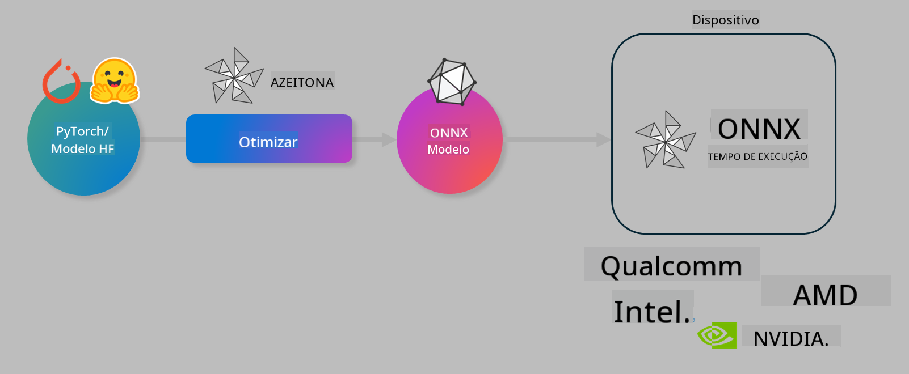

<!--
CO_OP_TRANSLATOR_METADATA:
{
  "original_hash": "6bbe47de3b974df7eea29dfeccf6032b",
  "translation_date": "2025-05-09T04:23:25+00:00",
  "source_file": "code/03.Finetuning/olive-lab/readme.md",
  "language_code": "br"
}
-->
# Lab. Optimize AI models for on-device inference

## Introduction 

> [!IMPORTANT]
> Este laboratório requer uma **GPU Nvidia A10 ou A100** com os drivers associados e o toolkit CUDA (versão 12+) instalados.

> [!NOTE]
> Este é um laboratório de **35 minutos** que oferece uma introdução prática aos conceitos principais de otimização de modelos para inferência local usando OLIVE.

## Learning Objectives

Ao final deste laboratório, você será capaz de usar o OLIVE para:

- Quantizar um modelo de IA usando o método de quantização AWQ.
- Ajustar finamente um modelo de IA para uma tarefa específica.
- Gerar adaptadores LoRA (modelo ajustado) para inferência eficiente no dispositivo usando ONNX Runtime.

### What is Olive

Olive (*O*NNX *live*) é um toolkit de otimização de modelos com CLI associada que permite entregar modelos para o ONNX runtime +++https://onnxruntime.ai+++ com qualidade e desempenho.



A entrada para o Olive é tipicamente um modelo PyTorch ou Hugging Face e a saída é um modelo ONNX otimizado que é executado em um dispositivo (alvo de implantação) rodando o ONNX runtime. O Olive otimiza o modelo para o acelerador de IA do alvo de implantação (NPU, GPU, CPU) fornecido por um fabricante de hardware como Qualcomm, AMD, Nvidia ou Intel.

O Olive executa um *workflow*, que é uma sequência ordenada de tarefas individuais de otimização de modelo chamadas *passes* – exemplos de passes incluem: compressão de modelo, captura de grafo, quantização, otimização de grafo. Cada passe tem um conjunto de parâmetros que podem ser ajustados para alcançar as melhores métricas, como acurácia e latência, avaliadas pelo respectivo avaliador. O Olive emprega uma estratégia de busca que usa um algoritmo para autoajustar cada passe individualmente ou um conjunto de passes juntos.

#### Benefits of Olive

- **Reduz frustração e tempo** de experimentação manual por tentativa e erro com diferentes técnicas de otimização de grafo, compressão e quantização. Defina suas restrições de qualidade e desempenho e deixe o Olive encontrar automaticamente o melhor modelo para você.
- **Mais de 40 componentes integrados de otimização de modelos** cobrindo técnicas avançadas em quantização, compressão, otimização de grafo e ajuste fino.
- **CLI fácil de usar** para tarefas comuns de otimização de modelos. Por exemplo, olive quantize, olive auto-opt, olive finetune.
- Empacotamento e implantação de modelos integrados.
- Suporta geração de modelos para **Multi LoRA serving**.
- Construa workflows usando YAML/JSON para orquestrar tarefas de otimização e implantação de modelos.
- Integração com **Hugging Face** e **Azure AI**.
- Mecanismo de **cache** embutido para **reduzir custos**.

## Lab Instructions
> [!NOTE]
> Certifique-se de ter provisionado seu Azure AI Hub e Projeto e configurado seu compute A100 conforme o Lab 1.

### Step 0: Connect to your Azure AI Compute

Você vai se conectar ao compute Azure AI usando o recurso remoto no **VS Code.**

1. Abra seu aplicativo desktop **VS Code**:
1. Abra a **paleta de comandos** usando **Shift+Ctrl+P**
1. Na paleta de comandos, pesquise por **AzureML - remote: Connect to compute instance in New Window**.
1. Siga as instruções na tela para se conectar ao Compute. Isso envolve selecionar sua Assinatura Azure, Grupo de Recursos, Projeto e nome do Compute que você configurou no Lab 1.
1. Uma vez conectado ao seu nó Azure ML Compute, isso será exibido no **canto inferior esquerdo do Visual Code** `><Azure ML: Compute Name`

### Step 1: Clone this repo

No VS Code, você pode abrir um terminal novo com **Ctrl+J** e clonar este repositório:

No terminal você deverá ver o prompt

```
azureuser@computername:~/cloudfiles/code$ 
```
Clone a solução

```bash
cd ~/localfiles
git clone https://github.com/microsoft/phi-3cookbook.git
```

### Step 2: Open Folder in VS Code

Para abrir o VS Code na pasta relevante, execute o seguinte comando no terminal, que abrirá uma nova janela:

```bash
code phi-3cookbook/code/04.Finetuning/Olive-lab
```

Alternativamente, você pode abrir a pasta selecionando **File** > **Open Folder**.

### Step 3: Dependencies

Abra uma janela de terminal no VS Code em sua Instância Azure AI Compute (dica: **Ctrl+J**) e execute os seguintes comandos para instalar as dependências:

```bash
conda create -n olive-ai python=3.11 -y
conda activate olive-ai
pip install -r requirements.txt
az extension remove -n azure-cli-ml
az extension add -n ml
```

> [!NOTE]
> A instalação de todas as dependências levará cerca de ~5 minutos.

Neste laboratório, você fará download e upload de modelos para o catálogo Azure AI Model. Para acessar o catálogo de modelos, você precisará fazer login no Azure usando:

```bash
az login
```

> [!NOTE]
> No momento do login, será solicitado que você selecione sua assinatura. Certifique-se de escolher a assinatura fornecida para este laboratório.

### Step 4: Execute Olive commands 

Abra uma janela de terminal no VS Code em sua Instância Azure AI Compute (dica: **Ctrl+J**) e certifique-se de que o ambiente conda `olive-ai` está ativado:

```bash
conda activate olive-ai
```

Em seguida, execute os seguintes comandos Olive na linha de comando.

1. **Inspecione os dados:** Neste exemplo, você vai ajustar finamente o modelo Phi-3.5-Mini para que ele seja especializado em responder perguntas relacionadas a viagens. O código abaixo exibe os primeiros registros do conjunto de dados, que estão no formato JSON lines:
   
    ```bash
    head data/data_sample_travel.jsonl
    ```
1. **Quantize o modelo:** Antes de treinar o modelo, você primeiro quantiza com o seguinte comando que usa uma técnica chamada Active Aware Quantization (AWQ) +++https://arxiv.org/abs/2306.00978+++. AWQ quantiza os pesos de um modelo considerando as ativações produzidas durante a inferência. Isso significa que o processo de quantização leva em conta a distribuição real dos dados nas ativações, resultando em melhor preservação da acurácia do modelo comparado a métodos tradicionais de quantização de pesos.
    
    ```bash
    olive quantize \
       --model_name_or_path microsoft/Phi-3.5-mini-instruct \
       --trust_remote_code \
       --algorithm awq \
       --output_path models/phi/awq \
       --log_level 1
    ```
    
    Leva **~8 minutos** para completar a quantização AWQ, que vai **reduzir o tamanho do modelo de ~7.5GB para ~2.5GB**.
   
   Neste laboratório, mostramos como importar modelos do Hugging Face (por exemplo: `microsoft/Phi-3.5-mini-instruct`). However, Olive also allows you to input models from the Azure AI catalog by updating the `model_name_or_path` argument to an Azure AI asset ID (for example:  `azureml://registries/azureml/models/Phi-3.5-mini-instruct/versions/4`). 

1. **Train the model:** Next, the `olive finetune` o comando ajusta finamente o modelo quantizado. Quantizar o modelo *antes* do ajuste fino, em vez de depois, proporciona melhor acurácia pois o ajuste fino recupera parte da perda causada pela quantização.
    
    ```bash
    olive finetune \
        --method lora \
        --model_name_or_path models/phi/awq \
        --data_files "data/data_sample_travel.jsonl" \
        --data_name "json" \
        --text_template "<|user|>\n{prompt}<|end|>\n<|assistant|>\n{response}<|end|>" \
        --max_steps 100 \
        --output_path ./models/phi/ft \
        --log_level 1
    ```
    
    Leva **~6 minutos** para completar o ajuste fino (com 100 passos).

1. **Otimizar:** Com o modelo treinado, agora você otimiza o modelo usando os argumentos `auto-opt` command, which will capture the ONNX graph and automatically perform a number of optimizations to improve the model performance for CPU by compressing the model and doing fusions. It should be noted, that you can also optimize for other devices such as NPU or GPU by just updating the `--device` and `--provider` do Olive – mas para este laboratório usaremos CPU.

    ```bash
    olive auto-opt \
       --model_name_or_path models/phi/ft/model \
       --adapter_path models/phi/ft/adapter \
       --device cpu \
       --provider CPUExecutionProvider \
       --use_ort_genai \
       --output_path models/phi/onnx-ao \
       --log_level 1
    ```
    
    Leva **~5 minutos** para completar a otimização.

### Step 5: Model inference quick test

Para testar a inferência do modelo, crie um arquivo Python na sua pasta chamado **app.py** e copie e cole o seguinte código:

```python
import onnxruntime_genai as og
import numpy as np

print("loading model and adapters...", end="", flush=True)
model = og.Model("models/phi/onnx-ao/model")
adapters = og.Adapters(model)
adapters.load("models/phi/onnx-ao/model/adapter_weights.onnx_adapter", "travel")
print("DONE!")

tokenizer = og.Tokenizer(model)
tokenizer_stream = tokenizer.create_stream()

params = og.GeneratorParams(model)
params.set_search_options(max_length=100, past_present_share_buffer=False)
user_input = "what is the best thing to see in chicago"
params.input_ids = tokenizer.encode(f"<|user|>\n{user_input}<|end|>\n<|assistant|>\n")

generator = og.Generator(model, params)

generator.set_active_adapter(adapters, "travel")

print(f"{user_input}")

while not generator.is_done():
    generator.compute_logits()
    generator.generate_next_token()

    new_token = generator.get_next_tokens()[0]
    print(tokenizer_stream.decode(new_token), end='', flush=True)

print("\n")
```

Execute o código usando:

```bash
python app.py
```

### Step 6: Upload model to Azure AI

Fazer upload do modelo para um repositório Azure AI torna o modelo compartilhável com outros membros da equipe de desenvolvimento e também gerencia o controle de versão do modelo. Para fazer upload do modelo, execute o seguinte comando:

> [!NOTE]
> Atualize os placeholders `{}`` placeholders with the name of your resource group and Azure AI Project Name. 

To find your resource group ` para `resourceGroup` e o nome do Projeto Azure AI, execute o comando abaixo

```
az ml workspace show
```

Ou acessando +++ai.azure.com+++ e selecionando **management center** **project** **overview**

Atualize os placeholders `{}` com o nome do seu grupo de recursos e nome do Projeto Azure AI.

```bash
az ml model create \
    --name ft-for-travel \
    --version 1 \
    --path ./models/phi/onnx-ao \
    --resource-group {RESOURCE_GROUP_NAME} \
    --workspace-name {PROJECT_NAME}
```
Você poderá então ver seu modelo enviado e implantá-lo em https://ml.azure.com/model/list

**Aviso Legal**:  
Este documento foi traduzido utilizando o serviço de tradução por IA [Co-op Translator](https://github.com/Azure/co-op-translator). Embora nos esforcemos para garantir a precisão, esteja ciente de que traduções automáticas podem conter erros ou imprecisões. O documento original em seu idioma nativo deve ser considerado a fonte autorizada. Para informações críticas, recomenda-se tradução profissional feita por humanos. Não nos responsabilizamos por quaisquer mal-entendidos ou interpretações incorretas decorrentes do uso desta tradução.