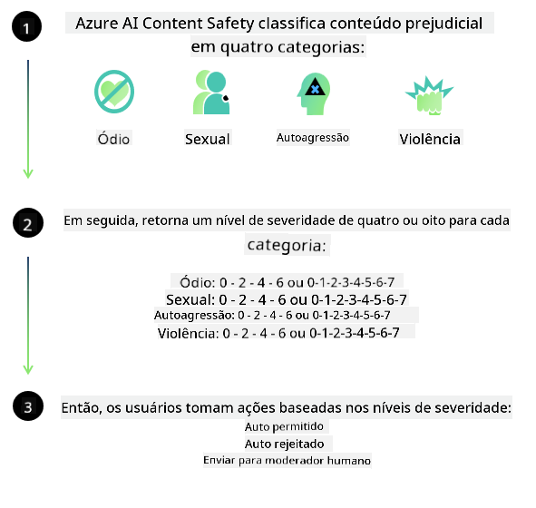

<!--
CO_OP_TRANSLATOR_METADATA:
{
  "original_hash": "839ccc4b3886ef10cfd4e64977f5792d",
  "translation_date": "2026-01-05T03:02:36+00:00",
  "source_file": "md/01.Introduction/01/01.AISafety.md",
  "language_code": "br"
}
-->
# Segurança de IA para modelos Phi
A família de modelos Phi foi desenvolvida de acordo com o [Padrão de IA Responsável da Microsoft](https://www.microsoft.com/ai/principles-and-approach#responsible-ai-standard), que é um conjunto de requisitos em toda a empresa baseado nos seguintes seis princípios: responsabilidade, transparência, equidade, confiabilidade e segurança, privacidade e segurança, e inclusão, que formam os [princípios de IA Responsável da Microsoft](https://www.microsoft.com/ai/responsible-ai). 

Como os modelos Phi anteriores, foi adotada uma avaliação multifacetada de segurança e uma abordagem de pós-treinamento de segurança, com medidas adicionais tomadas para levar em conta as capacidades multilíngues deste lançamento. Nossa abordagem para treinamento e avaliações de segurança, incluindo testes em múltiplos idiomas e categorias de risco, está descrita no [Artigo de Pós-Treinamento de Segurança do Phi](https://arxiv.org/abs/2407.13833). Embora os modelos Phi se beneficiem dessa abordagem, os desenvolvedores devem aplicar as melhores práticas de IA responsável, incluindo mapear, medir e mitigar os riscos associados ao seu caso de uso específico e ao contexto cultural e linguístico.

## Melhores Práticas

Como outros modelos, a família Phi pode potencialmente se comportar de maneiras que sejam injustas, não confiáveis ou ofensivas.

Alguns dos comportamentos limitantes de SLM e LLM dos quais você deve estar ciente incluem:

- **Quality of Service:** Os modelos Phi são treinados principalmente em texto em inglês. Idiomas diferentes do inglês terão desempenho pior. Variedades da língua inglesa com menos representação nos dados de treinamento podem apresentar desempenho pior do que o inglês americano padrão.
- **Representation of Harms & Perpetuation of Stereotypes:** Esses modelos podem super ou sub-representar grupos de pessoas, apagar a representação de alguns grupos ou reforçar estereótipos depreciativos ou negativos. Apesar do pós-treinamento de segurança, essas limitações ainda podem estar presentes devido a níveis diferentes de representação de diferentes grupos ou à prevalência de exemplos de estereótipos negativos nos dados de treinamento que refletem padrões do mundo real e vieses sociais.
- **Inappropriate or Offensive Content:** Esses modelos podem produzir outros tipos de conteúdo inapropriado ou ofensivo, o que pode tornar inadequado o seu uso em contextos sensíveis sem mitigações adicionais específicas para o caso de uso.
Confiabilidade da Informação: Modelos de linguagem podem gerar conteúdo sem sentido ou fabricar conteúdo que pode soar razoável, mas que é impreciso ou desatualizado.
- **Limited Scope for Code:** A maior parte dos dados de treinamento do Phi-3 é baseada em Python e usa pacotes comuns como "typing, math, random, collections, datetime, itertools". Se o modelo gerar scripts Python que utilizem outros pacotes ou scripts em outras linguagens, recomendamos fortemente que os usuários verifiquem manualmente todos os usos de API.

Os desenvolvedores devem aplicar as melhores práticas de IA responsável e são responsáveis por garantir que um caso de uso específico cumpra as leis e regulamentações relevantes (por exemplo, privacidade, comércio, etc.). 

## Considerações de IA Responsável

Como outros modelos de linguagem, os modelos da série Phi podem potencialmente se comportar de maneiras que sejam injustas, não confiáveis ou ofensivas. Alguns dos comportamentos limitantes a serem observados incluem:

**Quality of Service:** Os modelos Phi são treinados principalmente em texto em inglês. Idiomas diferentes do inglês terão desempenho pior. Variedades da língua inglesa com menos representação nos dados de treinamento podem apresentar desempenho pior do que o inglês americano padrão.

**Representation of Harms & Perpetuation of Stereotypes:** Esses modelos podem super ou sub-representar grupos de pessoas, apagar a representação de alguns grupos ou reforçar estereótipos depreciativos ou negativos. Apesar do pós-treinamento de segurança, essas limitações ainda podem estar presentes devido a níveis diferentes de representação de diferentes grupos ou à prevalência de exemplos de estereótipos negativos nos dados de treinamento que refletem padrões do mundo real e vieses sociais.

**Inappropriate or Offensive Content:** Esses modelos podem produzir outros tipos de conteúdo inapropriado ou ofensivo, o que pode tornar inadequado o seu uso em contextos sensíveis sem mitigações adicionais específicas para o caso de uso.
Confiabilidade da Informação: Modelos de linguagem podem gerar conteúdo sem sentido ou fabricar conteúdo que pode soar razoável, mas que é impreciso ou desatualizado.

**Limited Scope for Code:** A maior parte dos dados de treinamento do Phi-3 é baseada em Python e usa pacotes comuns como "typing, math, random, collections, datetime, itertools". Se o modelo gerar scripts Python que utilizem outros pacotes ou scripts em outras linguagens, recomendamos fortemente que os usuários verifiquem manualmente todos os usos de API.

Os desenvolvedores devem aplicar as melhores práticas de IA responsável e são responsáveis por garantir que um caso de uso específico cumpra as leis e regulamentações relevantes (por exemplo, privacidade, comércio, etc.). Áreas importantes para consideração incluem:

**Allocation:** Os modelos podem não ser adequados para cenários que possam ter um impacto consequencial no status legal ou na alocação de recursos ou oportunidades de vida (ex: moradia, emprego, crédito, etc.) sem avaliações adicionais e técnicas de desenviesamento adicionais.

**High-Risk Scenarios:** Os desenvolvedores devem avaliar a adequação do uso de modelos em cenários de alto risco onde saídas injustas, não confiáveis ou ofensivas possam ser extremamente custosas ou levar a danos. Isso inclui fornecer conselhos em domínios sensíveis ou especializados onde precisão e confiabilidade são críticas (ex: aconselhamento jurídico ou de saúde). Salvaguardas adicionais devem ser implementadas no nível da aplicação de acordo com o contexto de implantação.

**Misinformation:** Modelos podem produzir informações imprecisas. Os desenvolvedores devem seguir as melhores práticas de transparência e informar aos usuários finais que eles estão interagindo com um sistema de IA. No nível da aplicação, os desenvolvedores podem construir mecanismos de feedback e pipelines para fundamentar respostas em informações contextuais específicas do caso de uso, uma técnica conhecida como Retrieval Augmented Generation (RAG).

**Generation of Harmful Content:** Os desenvolvedores devem avaliar as saídas pelo seu contexto e usar classificadores de segurança disponíveis ou soluções personalizadas apropriadas para seu caso de uso.

**Misuse:** Outras formas de uso indevido, como fraude, spam ou produção de malware, podem ser possíveis, e os desenvolvedores devem garantir que suas aplicações não violem leis e regulamentações aplicáveis.

### Ajuste fino e Segurança de Conteúdo de IA

Após ajustar finamente um modelo, recomendamos fortemente aproveitar as medidas do [Azure AI Content Safety](https://learn.microsoft.com/azure/ai-services/content-safety/overview) para monitorar o conteúdo gerado pelos modelos, identificar e bloquear riscos, ameaças e problemas de qualidade em potencial.

[Azure AI Content Safety](https://learn.microsoft.com/azure/ai-services/content-safety/overview) oferece suporte tanto para conteúdo de texto quanto de imagem. Pode ser implantado na nuvem, em contêineres desconectados e em dispositivos de borda/embarcados.

## Visão geral do Azure AI Content Safety

Azure AI Content Safety não é uma solução única para todos; pode ser personalizado para alinhar-se às políticas específicas das empresas. Além disso, seus modelos multilíngues permitem que entenda múltiplos idiomas simultaneamente.

- **Azure AI Content Safety**
- **Microsoft Developer**
- **5 vídeos**

O serviço Azure AI Content Safety detecta conteúdo prejudicial gerado por usuários e por IA em aplicações e serviços. Inclui APIs de texto e imagem que permitem detectar material prejudicial ou inapropriado.

[Playlist de Segurança de Conteúdo de IA](https://www.youtube.com/playlist?list=PLlrxD0HtieHjaQ9bJjyp1T7FeCbmVcPkQ)

---

<!-- CO-OP TRANSLATOR DISCLAIMER START -->
**Aviso**:
Este documento foi traduzido usando o serviço de tradução por IA [Co-op Translator](https://github.com/Azure/co-op-translator). Embora nos esforcemos para garantir a precisão, esteja ciente de que traduções automatizadas podem conter erros ou imprecisões. O documento original em seu idioma nativo deve ser considerado a fonte autoritativa. Para informações críticas, recomenda-se tradução profissional humana. Não nos responsabilizamos por quaisquer mal-entendidos ou interpretações equivocadas decorrentes do uso desta tradução.
<!-- CO-OP TRANSLATOR DISCLAIMER END -->