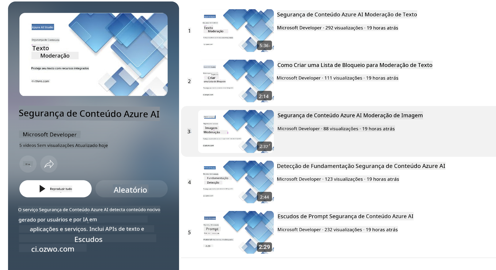

<!--
CO_OP_TRANSLATOR_METADATA:
{
  "original_hash": "c8273672cc57df2be675407a1383aaf0",
  "translation_date": "2025-07-16T17:46:59+00:00",
  "source_file": "md/01.Introduction/01/01.AISafety.md",
  "language_code": "br"
}
-->
# Segurança de IA para modelos Phi  
A família de modelos Phi foi desenvolvida de acordo com o [Microsoft Responsible AI Standard](https://query.prod.cms.rt.microsoft.com/cms/api/am/binary/RE5cmFl), que é um conjunto de requisitos da empresa baseado nos seguintes seis princípios: responsabilidade, transparência, justiça, confiabilidade e segurança, privacidade e segurança, e inclusão, que formam os [princípios de IA responsável da Microsoft](https://www.microsoft.com/ai/responsible-ai).

Assim como os modelos Phi anteriores, foi adotada uma avaliação multifacetada de segurança e uma abordagem de pós-treinamento focada em segurança, com medidas adicionais para considerar as capacidades multilíngues desta versão. Nossa abordagem para o treinamento e avaliações de segurança, incluindo testes em múltiplos idiomas e categorias de risco, está detalhada no [Phi Safety Post-Training Paper](https://arxiv.org/abs/2407.13833). Embora os modelos Phi se beneficiem dessa abordagem, os desenvolvedores devem aplicar as melhores práticas de IA responsável, incluindo mapear, medir e mitigar riscos associados ao seu caso de uso específico e ao contexto cultural e linguístico.

## Melhores Práticas  

Assim como outros modelos, a família Phi pode se comportar de maneiras que sejam injustas, pouco confiáveis ou ofensivas.

Alguns dos comportamentos limitantes dos SLM e LLM que você deve estar atento incluem:

- **Qualidade do Serviço:** Os modelos Phi são treinados principalmente com textos em inglês. Idiomas diferentes do inglês terão desempenho inferior. Variedades do inglês com menor representação nos dados de treinamento podem apresentar desempenho pior do que o inglês americano padrão.  
- **Representação de Danos e Perpetuação de Estereótipos:** Esses modelos podem super ou sub-representar grupos de pessoas, apagar a representação de alguns grupos ou reforçar estereótipos depreciativos ou negativos. Apesar do pós-treinamento focado em segurança, essas limitações podem persistir devido a diferentes níveis de representação dos grupos ou à prevalência de exemplos de estereótipos negativos nos dados de treinamento, que refletem padrões do mundo real e vieses sociais.  
- **Conteúdo Inapropriado ou Ofensivo:** Esses modelos podem gerar outros tipos de conteúdo inapropriado ou ofensivo, o que pode tornar inadequada sua implantação em contextos sensíveis sem mitigações adicionais específicas para o caso de uso.  
- **Confiabilidade da Informação:** Modelos de linguagem podem gerar conteúdo sem sentido ou fabricar informações que soam razoáveis, mas são imprecisas ou desatualizadas.  
- **Escopo Limitado para Código:** A maior parte dos dados de treinamento do Phi-3 é baseada em Python e utiliza pacotes comuns como "typing, math, random, collections, datetime, itertools". Se o modelo gerar scripts Python que utilizem outros pacotes ou scripts em outras linguagens, recomendamos fortemente que os usuários verifiquem manualmente todas as chamadas de API.

Os desenvolvedores devem aplicar as melhores práticas de IA responsável e são responsáveis por garantir que um caso de uso específico esteja em conformidade com as leis e regulamentos aplicáveis (ex: privacidade, comércio, etc.).

## Considerações de IA Responsável  

Assim como outros modelos de linguagem, os modelos da série Phi podem se comportar de maneiras injustas, pouco confiáveis ou ofensivas. Alguns dos comportamentos limitantes a serem observados incluem:

**Qualidade do Serviço:** Os modelos Phi são treinados principalmente com textos em inglês. Idiomas diferentes do inglês terão desempenho inferior. Variedades do inglês com menor representação nos dados de treinamento podem apresentar desempenho pior do que o inglês americano padrão.

**Representação de Danos e Perpetuação de Estereótipos:** Esses modelos podem super ou sub-representar grupos de pessoas, apagar a representação de alguns grupos ou reforçar estereótipos depreciativos ou negativos. Apesar do pós-treinamento focado em segurança, essas limitações podem persistir devido a diferentes níveis de representação dos grupos ou à prevalência de exemplos de estereótipos negativos nos dados de treinamento, que refletem padrões do mundo real e vieses sociais.

**Conteúdo Inapropriado ou Ofensivo:** Esses modelos podem gerar outros tipos de conteúdo inapropriado ou ofensivo, o que pode tornar inadequada sua implantação em contextos sensíveis sem mitigações adicionais específicas para o caso de uso.  
Confiabilidade da Informação: Modelos de linguagem podem gerar conteúdo sem sentido ou fabricar informações que soam razoáveis, mas são imprecisas ou desatualizadas.

**Escopo Limitado para Código:** A maior parte dos dados de treinamento do Phi-3 é baseada em Python e utiliza pacotes comuns como "typing, math, random, collections, datetime, itertools". Se o modelo gerar scripts Python que utilizem outros pacotes ou scripts em outras linguagens, recomendamos fortemente que os usuários verifiquem manualmente todas as chamadas de API.

Os desenvolvedores devem aplicar as melhores práticas de IA responsável e são responsáveis por garantir que um caso de uso específico esteja em conformidade com as leis e regulamentos aplicáveis (ex: privacidade, comércio, etc.). Áreas importantes para consideração incluem:

**Alocação:** Modelos podem não ser adequados para cenários que possam ter impacto significativo no status legal ou na alocação de recursos ou oportunidades de vida (ex: moradia, emprego, crédito, etc.) sem avaliações adicionais e técnicas de redução de viés.

**Cenários de Alto Risco:** Desenvolvedores devem avaliar a adequação do uso dos modelos em cenários de alto risco, onde saídas injustas, pouco confiáveis ou ofensivas podem ser extremamente custosas ou causar danos. Isso inclui fornecer aconselhamento em domínios sensíveis ou especializados onde precisão e confiabilidade são críticas (ex: aconselhamento jurídico ou de saúde). Salvaguardas adicionais devem ser implementadas no nível da aplicação conforme o contexto de implantação.

**Desinformação:** Modelos podem gerar informações imprecisas. Desenvolvedores devem seguir as melhores práticas de transparência e informar os usuários finais de que estão interagindo com um sistema de IA. No nível da aplicação, desenvolvedores podem criar mecanismos de feedback e pipelines para fundamentar respostas em informações contextuais específicas do caso de uso, uma técnica conhecida como Retrieval Augmented Generation (RAG).

**Geração de Conteúdo Prejudicial:** Desenvolvedores devem avaliar as saídas conforme o contexto e usar classificadores de segurança disponíveis ou soluções personalizadas adequadas ao seu caso de uso.

**Uso Indevido:** Outras formas de uso indevido, como fraude, spam ou produção de malware, podem ser possíveis, e os desenvolvedores devem garantir que suas aplicações não violem leis e regulamentos aplicáveis.

### Ajuste Fino e Segurança de Conteúdo de IA  

Após o ajuste fino de um modelo, recomendamos fortemente o uso das medidas do [Azure AI Content Safety](https://learn.microsoft.com/azure/ai-services/content-safety/overview) para monitorar o conteúdo gerado pelos modelos, identificar e bloquear riscos potenciais, ameaças e problemas de qualidade.

[Azure AI Content Safety](https://learn.microsoft.com/azure/ai-services/content-safety/overview) suporta conteúdo de texto e imagem. Pode ser implantado na nuvem, em containers desconectados e em dispositivos edge/embarcados.

## Visão Geral do Azure AI Content Safety  

Azure AI Content Safety não é uma solução única para todos os casos; pode ser customizado para alinhar-se às políticas específicas das empresas. Além disso, seus modelos multilíngues permitem compreender múltiplos idiomas simultaneamente.

- **Azure AI Content Safety**  
- **Microsoft Developer**  
- **5 vídeos**

O serviço Azure AI Content Safety detecta conteúdo prejudicial gerado por usuários e por IA em aplicações e serviços. Inclui APIs de texto e imagem que permitem detectar material prejudicial ou inapropriado.

[AI Content Safety Playlist](https://www.youtube.com/playlist?list=PLlrxD0HtieHjaQ9bJjyp1T7FeCbmVcPkQ)

**Aviso Legal**:  
Este documento foi traduzido utilizando o serviço de tradução por IA [Co-op Translator](https://github.com/Azure/co-op-translator). Embora nos esforcemos para garantir a precisão, esteja ciente de que traduções automáticas podem conter erros ou imprecisões. O documento original em seu idioma nativo deve ser considerado a fonte autorizada. Para informações críticas, recomenda-se tradução profissional humana. Não nos responsabilizamos por quaisquer mal-entendidos ou interpretações incorretas decorrentes do uso desta tradução.