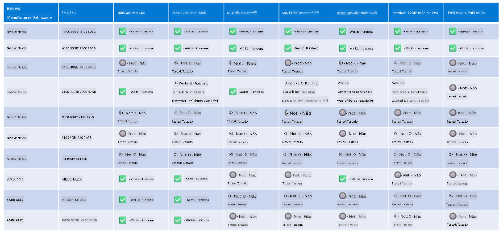

<!--
CO_OP_TRANSLATOR_METADATA:
{
  "original_hash": "8cdc17ce0f10535da30b53d23fe1a795",
  "translation_date": "2025-07-16T18:24:49+00:00",
  "source_file": "md/01.Introduction/01/01.Hardwaresupport.md",
  "language_code": "br"
}
-->
# Suporte de Hardware Phi

O Microsoft Phi foi otimizado para ONNX Runtime e oferece suporte ao Windows DirectML. Ele funciona bem em diversos tipos de hardware, incluindo GPUs, CPUs e até dispositivos móveis.

## Hardware do Dispositivo  
Especificamente, o hardware suportado inclui:

- GPU SKU: RTX 4090 (DirectML)
- GPU SKU: 1 A100 80GB (CUDA)
- CPU SKU: Standard F64s v2 (64 vCPUs, 128 GiB de memória)

## SKU Móvel

- Android - Samsung Galaxy S21
- Apple iPhone 14 ou superior com processador A16/A17

## Especificação do Hardware Phi

- Configuração mínima necessária.
- Windows: GPU compatível com DirectX 12 e no mínimo 4GB de RAM combinada

CUDA: GPU NVIDIA com Compute Capability >= 7.02



## Executando onnxruntime em múltiplas GPUs

Atualmente, os modelos Phi ONNX disponíveis são apenas para 1 GPU. É possível suportar multi-GPU para o modelo Phi, mas o ORT com 2 GPUs não garante que terá maior desempenho comparado a 2 instâncias do ORT. Para as últimas atualizações, consulte [ONNX Runtime](https://onnxruntime.ai/).

No [Build 2024, a equipe GenAI ONNX](https://youtu.be/WLW4SE8M9i8?si=EtG04UwDvcjunyfC) anunciou que habilitaram multi-instância em vez de multi-GPU para os modelos Phi.

Atualmente, isso permite rodar uma instância do onnxruntime ou onnxruntime-genai com a variável de ambiente CUDA_VISIBLE_DEVICES assim:

```Python
CUDA_VISIBLE_DEVICES=0 python infer.py
CUDA_VISIBLE_DEVICES=1 python infer.py
```

Sinta-se à vontade para explorar mais sobre Phi em [Azure AI Foundry](https://ai.azure.com)

**Aviso Legal**:  
Este documento foi traduzido utilizando o serviço de tradução por IA [Co-op Translator](https://github.com/Azure/co-op-translator). Embora nos esforcemos para garantir a precisão, esteja ciente de que traduções automáticas podem conter erros ou imprecisões. O documento original em seu idioma nativo deve ser considerado a fonte autorizada. Para informações críticas, recomenda-se tradução profissional humana. Não nos responsabilizamos por quaisquer mal-entendidos ou interpretações incorretas decorrentes do uso desta tradução.