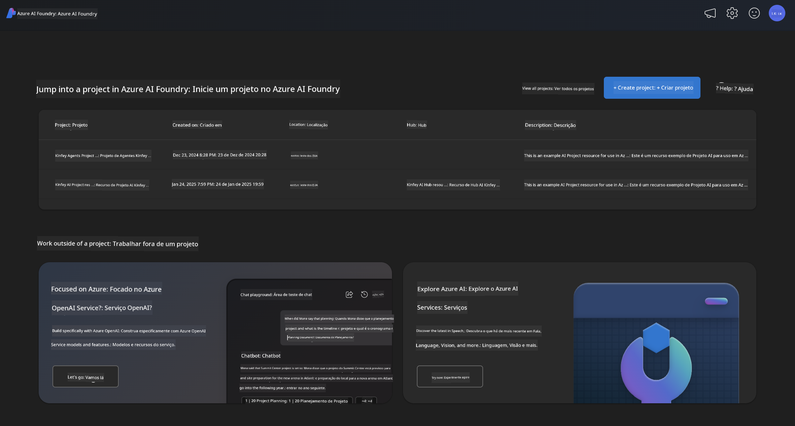
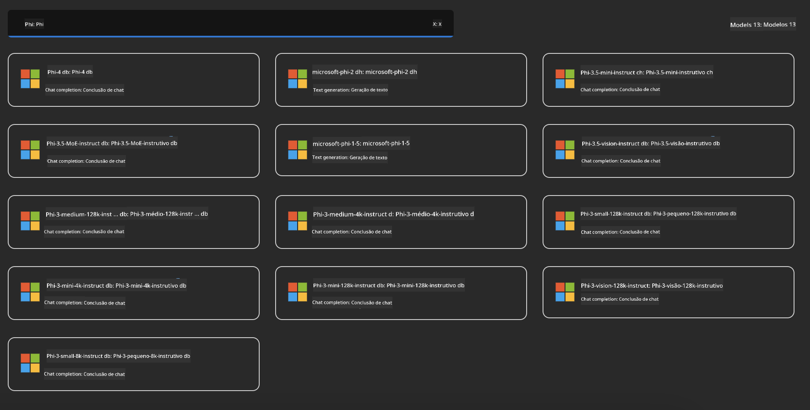
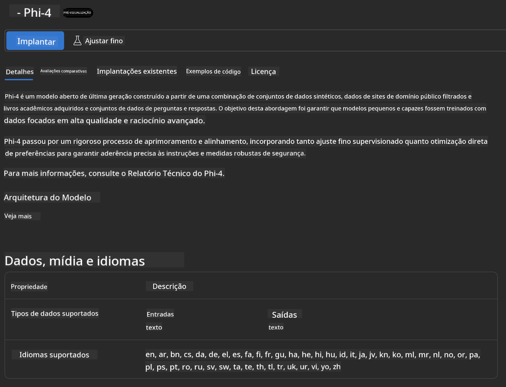
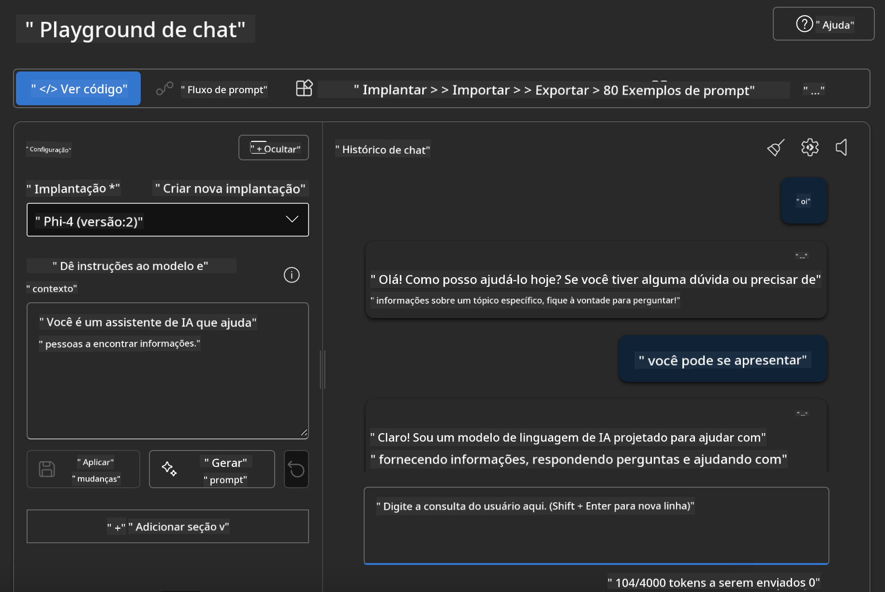

<!--
CO_OP_TRANSLATOR_METADATA:
{
  "original_hash": "3ae21dc5554e888defbe57946ee995ee",
  "translation_date": "2025-05-09T09:03:48+00:00",
  "source_file": "md/01.Introduction/02/03.AzureAIFoundry.md",
  "language_code": "br"
}
-->
## Phi Family em Azure AI Foundry

[Azure AI Foundry](https://ai.azure.com) é uma plataforma confiável que capacita desenvolvedores a impulsionar a inovação e moldar o futuro com IA de forma segura, protegida e responsável.

[Azure AI Foundry](https://ai.azure.com) foi projetada para desenvolvedores que desejam:

- Construir aplicações de IA generativa em uma plataforma de nível empresarial.
- Explorar, construir, testar e implantar usando ferramentas avançadas de IA e modelos de ML, baseados em práticas responsáveis de IA.
- Colaborar com uma equipe durante todo o ciclo de vida do desenvolvimento da aplicação.

Com o Azure AI Foundry, você pode explorar uma grande variedade de modelos, serviços e recursos, e começar a criar aplicações de IA que atendam melhor aos seus objetivos. A plataforma Azure AI Foundry facilita a escalabilidade para transformar provas de conceito em aplicações de produção completas com facilidade. O monitoramento contínuo e o refinamento suportam o sucesso a longo prazo.



Além de usar o Azure AOAI Service no Azure AI Foundry, você também pode usar modelos de terceiros no Catálogo de Modelos do Azure AI Foundry. Essa é uma boa opção se você quiser usar o Azure AI Foundry como sua plataforma de soluções de IA.

Podemos implantar rapidamente os Modelos da Phi Family através do Catálogo de Modelos no Azure AI Foundry

[Microsoft Phi Models em Azure AI Foundry Models](https://ai.azure.com/explore/models/?selectedCollection=phi)



### **Implantar Phi-4 no Azure AI Foundry**



### **Testar Phi-4 no Playground do Azure AI Foundry**



### **Executando código Python para chamar Phi-4 do Azure AI Foundry**

```python

import os  
import base64
from openai import AzureOpenAI  
from azure.identity import DefaultAzureCredential, get_bearer_token_provider  
        
endpoint = os.getenv("ENDPOINT_URL", "Your Azure AOAI Service Endpoint")  
deployment = os.getenv("DEPLOYMENT_NAME", "Phi-4")  
      
token_provider = get_bearer_token_provider(  
    DefaultAzureCredential(),  
    "https://cognitiveservices.azure.com/.default"  
)  
  
client = AzureOpenAI(  
    azure_endpoint=endpoint,  
    azure_ad_token_provider=token_provider,  
    api_version="2024-05-01-preview",  
)  
  

chat_prompt = [
    {
        "role": "system",
        "content": "You are an AI assistant that helps people find information."
    },
    {
        "role": "user",
        "content": "can you introduce yourself"
    }
] 
    
# Include speech result if speech is enabled  
messages = chat_prompt 

completion = client.chat.completions.create(  
    model=deployment,  
    messages=messages,
    max_tokens=800,  
    temperature=0.7,  
    top_p=0.95,  
    frequency_penalty=0,  
    presence_penalty=0,
    stop=None,  
    stream=False  
)  
  
print(completion.to_json())  

```

**Aviso Legal**:  
Este documento foi traduzido utilizando o serviço de tradução automática [Co-op Translator](https://github.com/Azure/co-op-translator). Embora nos esforcemos para garantir a precisão, esteja ciente de que traduções automáticas podem conter erros ou imprecisões. O documento original em seu idioma nativo deve ser considerado a fonte autorizada. Para informações críticas, recomenda-se a tradução profissional feita por humanos. Não nos responsabilizamos por quaisquer mal-entendidos ou interpretações incorretas decorrentes do uso desta tradução.