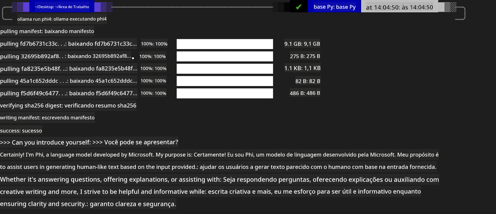
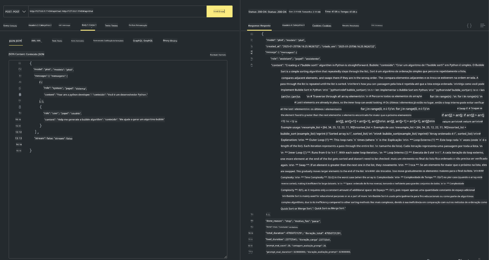

<!--
CO_OP_TRANSLATOR_METADATA:
{
  "original_hash": "0b38834693bb497f96bf53f0d941f9a1",
  "translation_date": "2025-05-09T09:13:57+00:00",
  "source_file": "md/01.Introduction/02/04.Ollama.md",
  "language_code": "br"
}
-->
## Phi Family em Ollama


[Ollama](https://ollama.com) permite que mais pessoas implantem diretamente LLMs ou SLMs open source por meio de scripts simples, além de possibilitar a criação de APIs para ajudar em cenários locais de aplicação Copilot.

## **1. Instalação**

Ollama é compatível com Windows, macOS e Linux. Você pode instalar o Ollama através deste link ([https://ollama.com/download](https://ollama.com/download)). Após a instalação bem-sucedida, é possível usar o script Ollama para chamar o Phi-3 diretamente pelo terminal. Você pode conferir todas as [bibliotecas disponíveis no Ollama](https://ollama.com/library). Se abrir este repositório em um Codespace, o Ollama já estará instalado.

```bash

ollama run phi4

```

> [!NOTE]
> O modelo será baixado na primeira vez que você executá-lo. Claro, você também pode especificar diretamente o modelo Phi-4 já baixado. Usamos o WSL como exemplo para rodar o comando. Depois que o modelo for baixado com sucesso, você pode interagir diretamente pelo terminal.



## **2. Chamar a API phi-4 do Ollama**

Se quiser chamar a API Phi-4 gerada pelo Ollama, use este comando no terminal para iniciar o servidor Ollama.

```bash

ollama serve

```

> [!NOTE]
> Se estiver usando macOS ou Linux, fique atento que pode aparecer o seguinte erro **"Error: listen tcp 127.0.0.1:11434: bind: address already in use"** ao executar o comando. Esse erro geralmente indica que o servidor já está rodando, então você pode ignorá-lo ou então parar e reiniciar o Ollama:

**macOS**

```bash

brew services restart ollama

```

**Linux**

```bash

sudo systemctl stop ollama

```

Ollama oferece duas APIs: generate e chat. Você pode chamar a API do modelo disponibilizada pelo Ollama conforme sua necessidade, enviando requisições para o serviço local que roda na porta 11434.

**Chat**

```bash

curl http://127.0.0.1:11434/api/chat -d '{
  "model": "phi3",
  "messages": [
    {
      "role": "system",
      "content": "Your are a python developer."
    },
    {
      "role": "user",
      "content": "Help me generate a bubble algorithm"
    }
  ],
  "stream": false
  
}'

This is the result in Postman



## Additional Resources

Check the list of available models in Ollama in [their library](https://ollama.com/library).

Pull your model from the Ollama server using this command

```bash
ollama pull phi4
```

Run the model using this command

```bash
ollama run phi4
```

***Note:*** Visit this link [https://github.com/ollama/ollama/blob/main/docs/api.md](https://github.com/ollama/ollama/blob/main/docs/api.md) to learn more

## Calling Ollama from Python

You can use `requests` or `urllib3` to make requests to the local server endpoints used above. However, a popular way to use Ollama in Python is via the [openai](https://pypi.org/project/openai/) SDK, since Ollama provides OpenAI-compatible server endpoints as well.

Here is an example for phi3-mini:

```python
import openai

client = openai.OpenAI(
    base_url="http://localhost:11434/v1",
    api_key="nokeyneeded",
)

response = client.chat.completions.create(
    model="phi4",
    temperature=0.7,
    n=1,
    messages=[
        {"role": "system", "content": "You are a helpful assistant."},
        {"role": "user", "content": "Write a haiku about a hungry cat"},
    ],
)

print("Response:")
print(response.choices[0].message.content)
```

## Calling Ollama from JavaScript 

```javascript
// Exemplo de resumir um arquivo com Phi-4
script({
    model: "ollama:phi4",
    title: "Summarize with Phi-4",
    system: ["system"],
})

// Exemplo de resumo
const file = def("FILE", env.files)
$`Summarize ${file} in a single paragraph.`
```

## Calling Ollama from C#

Create a new C# Console application and add the following NuGet package:

```bash
dotnet add package Microsoft.SemanticKernel --version 1.34.0
```

Then replace this code in the `Program.cs` file

```csharp
using Microsoft.SemanticKernel;
using Microsoft.SemanticKernel.ChatCompletion;

// adiciona serviço de chat completion usando o endpoint local do servidor ollama
#pragma warning disable SKEXP0001, SKEXP0003, SKEXP0010, SKEXP0011, SKEXP0050, SKEXP0052
builder.AddOpenAIChatCompletion(
    modelId: "phi4",
    endpoint: new Uri("http://localhost:11434/"),
    apiKey: "non required");

// invoca um prompt simples para o serviço de chat
string prompt = "Write a joke about kittens";
var response = await kernel.InvokePromptAsync(prompt);
Console.WriteLine(response.GetValue<string>());
```

Run the app with the command:

```bash
dotnet run

**Aviso Legal**:  
Este documento foi traduzido utilizando o serviço de tradução automática [Co-op Translator](https://github.com/Azure/co-op-translator). Embora nos esforcemos para garantir a precisão, esteja ciente de que traduções automáticas podem conter erros ou imprecisões. O documento original em seu idioma nativo deve ser considerado a fonte autorizada. Para informações críticas, recomenda-se a tradução profissional humana. Não nos responsabilizamos por quaisquer mal-entendidos ou interpretações incorretas decorrentes do uso desta tradução.