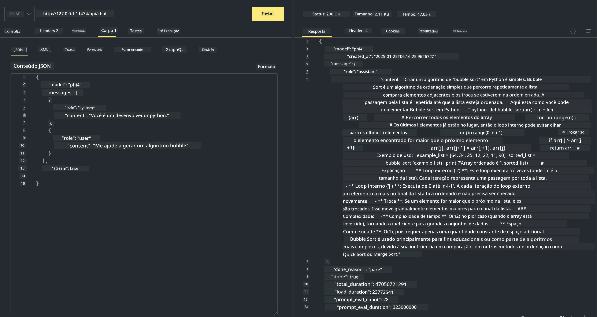

<!--
CO_OP_TRANSLATOR_METADATA:
{
  "original_hash": "2aa35f3c8b437fd5dc9995d53909d495",
  "translation_date": "2025-12-21T11:25:09+00:00",
  "source_file": "md/01.Introduction/02/04.Ollama.md",
  "language_code": "br"
}
-->
## Família Phi no Ollama


[Ollama](https://ollama.com) permite que mais pessoas implantem diretamente LLMs ou SLMs de código aberto por meio de scripts simples, e também pode construir APIs para ajudar em cenários de aplicação de Copilot local.

## **1. Instalação**

Ollama suporta execução no Windows, macOS e Linux. Você pode instalar o Ollama através deste link ([https://ollama.com/download](https://ollama.com/download)). Após a instalação bem-sucedida, você pode usar diretamente o script do Ollama para chamar o Phi-3 através de uma janela de terminal. Você pode ver todas as [bibliotecas disponíveis no Ollama](https://ollama.com/library). Se você abrir este repositório em um Codespace, ele já terá o Ollama instalado.

```bash

ollama run phi4

```

> [!NOTE]
> O modelo será baixado primeiro quando você executá-lo pela primeira vez. Claro, você também pode especificar diretamente o modelo Phi-4 já baixado. Tomamos o WSL como exemplo para executar o comando. Depois que o modelo for baixado com sucesso, você pode interagir diretamente no terminal.


## **2. Chamar a API phi-4 do Ollama**

Se você quiser chamar a API Phi-4 gerada pelo Ollama, você pode usar este comando no terminal para iniciar o servidor Ollama.

```bash

ollama serve

```

> [!NOTE]
> Se estiver executando MacOS ou Linux, observe que você pode encontrar o seguinte erro **"Error: listen tcp 127.0.0.1:11434: bind: address already in use"** Você pode obter esse erro ao executar o comando. Você pode ignorar esse erro, pois normalmente indica que o servidor já está em execução, ou pode parar e reiniciar o Ollama:

**macOS**

```bash

brew services restart ollama

```

**Linux**

```bash

sudo systemctl stop ollama

```

Ollama suporta duas APIs: generate e chat. Você pode chamar a API de modelo fornecida pelo Ollama de acordo com suas necessidades, enviando solicitações para o serviço local em execução na porta 11434.

**Chat**

```bash

curl http://127.0.0.1:11434/api/chat -d '{
  "model": "phi3",
  "messages": [
    {
      "role": "system",
      "content": "Your are a python developer."
    },
    {
      "role": "user",
      "content": "Help me generate a bubble algorithm"
    }
  ],
  "stream": false
  
}'
```

Este é o resultado no Postman



## Recursos Adicionais

Confira a lista de modelos disponíveis no Ollama em [sua biblioteca](https://ollama.com/library).

Obtenha seu modelo do servidor Ollama usando este comando

```bash
ollama pull phi4
```

Execute o modelo usando este comando

```bash
ollama run phi4
```

***Nota:*** Visite este link [https://github.com/ollama/ollama/blob/main/docs/api.md](https://github.com/ollama/ollama/blob/main/docs/api.md) para saber mais

## Chamando o Ollama a partir do Python

Você pode usar `requests` ou `urllib3` para fazer solicitações aos endpoints do servidor local usados acima. No entanto, uma forma popular de usar o Ollama em Python é via o SDK [openai](https://pypi.org/project/openai/), já que o Ollama também fornece endpoints de servidor compatíveis com o OpenAI.

Aqui está um exemplo para phi3-mini:

```python
import openai

client = openai.OpenAI(
    base_url="http://localhost:11434/v1",
    api_key="nokeyneeded",
)

response = client.chat.completions.create(
    model="phi4",
    temperature=0.7,
    n=1,
    messages=[
        {"role": "system", "content": "You are a helpful assistant."},
        {"role": "user", "content": "Write a haiku about a hungry cat"},
    ],
)

print("Response:")
print(response.choices[0].message.content)
```

## Chamando o Ollama a partir do JavaScript 

```javascript
// Exemplo de resumir um arquivo com Phi-4
script({
    model: "ollama:phi4",
    title: "Summarize with Phi-4",
    system: ["system"],
})

// Exemplo de resumir
const file = def("FILE", env.files)
$`Summarize ${file} in a single paragraph.`
```

## Chamando o Ollama a partir do C#

Crie um novo aplicativo de console C# e adicione o seguinte pacote NuGet:

```bash
dotnet add package Microsoft.SemanticKernel --version 1.34.0
```

Em seguida, substitua este código no arquivo `Program.cs`

```csharp
using Microsoft.SemanticKernel;
using Microsoft.SemanticKernel.ChatCompletion;

// add chat completion service using the local ollama server endpoint
#pragma warning disable SKEXP0001, SKEXP0003, SKEXP0010, SKEXP0011, SKEXP0050, SKEXP0052
builder.AddOpenAIChatCompletion(
    modelId: "phi4",
    endpoint: new Uri("http://localhost:11434/"),
    apiKey: "non required");

// invoke a simple prompt to the chat service
string prompt = "Write a joke about kittens";
var response = await kernel.InvokePromptAsync(prompt);
Console.WriteLine(response.GetValue<string>());
```

Execute o aplicativo com o comando:

```bash
dotnet run
```

---

<!-- CO-OP TRANSLATOR DISCLAIMER START -->
**Isenção de responsabilidade**:
Este documento foi traduzido usando o serviço de tradução por IA [Co-op Translator](https://github.com/Azure/co-op-translator). Embora nos esforcemos pela precisão, esteja ciente de que traduções automatizadas podem conter erros ou imprecisões. O documento original em seu idioma nativo deve ser considerado a fonte autorizada. Para informações críticas, recomenda-se tradução profissional feita por um tradutor humano. Não nos responsabilizamos por quaisquer mal-entendidos ou interpretações equivocadas decorrentes do uso desta tradução.
<!-- CO-OP TRANSLATOR DISCLAIMER END -->