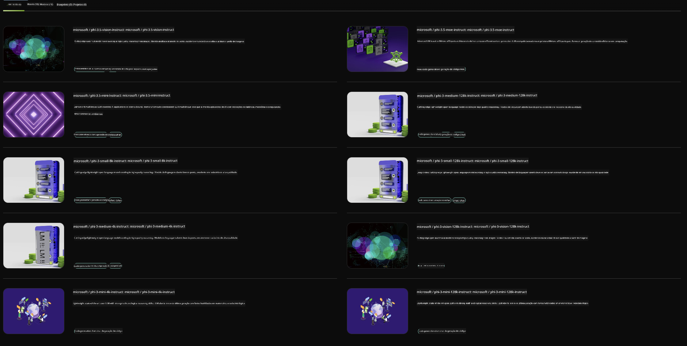

<!--
CO_OP_TRANSLATOR_METADATA:
{
  "original_hash": "7b08e277df2a9307f861ae54bc30c772",
  "translation_date": "2025-07-16T19:36:00+00:00",
  "source_file": "md/01.Introduction/02/06.NVIDIA.md",
  "language_code": "br"
}
-->
## Família Phi no NVIDIA NIM

NVIDIA NIM é um conjunto de microsserviços fáceis de usar, projetados para acelerar a implantação de modelos de IA generativa na nuvem, data centers e estações de trabalho. Os NIMs são categorizados por família de modelos e por modelo específico. Por exemplo, o NVIDIA NIM para grandes modelos de linguagem (LLMs) traz o poder dos LLMs mais avançados para aplicações empresariais, oferecendo capacidades incomparáveis de processamento e compreensão de linguagem natural.

O NIM facilita para as equipes de TI e DevOps a auto-hospedagem de grandes modelos de linguagem (LLMs) em seus próprios ambientes gerenciados, ao mesmo tempo em que fornece aos desenvolvedores APIs padrão do setor que permitem construir copilotos poderosos, chatbots e assistentes de IA capazes de transformar seus negócios. Aproveitando a aceleração de GPU de ponta da NVIDIA e a implantação escalável, o NIM oferece o caminho mais rápido para inferência com desempenho incomparável.

Você pode usar o NVIDIA NIM para inferir modelos da Família Phi



### **Exemplos - Phi-3-Vision no NVIDIA NIM**

Imagine que você tem uma imagem (`demo.png`) e quer gerar um código Python que processe essa imagem e salve uma nova versão dela (`phi-3-vision.jpg`).

O código acima automatiza esse processo ao:

1. Configurar o ambiente e as configurações necessárias.
2. Criar um prompt que instrui o modelo a gerar o código Python requerido.
3. Enviar o prompt para o modelo e coletar o código gerado.
4. Extrair e executar o código gerado.
5. Exibir as imagens original e processada.

Essa abordagem aproveita o poder da IA para automatizar tarefas de processamento de imagens, tornando mais fácil e rápido alcançar seus objetivos.

[Solução de Código de Exemplo](../../../../../code/06.E2E/E2E_Nvidia_NIM_Phi3_Vision.ipynb)

Vamos detalhar o que o código completo faz, passo a passo:

1. **Instalar o Pacote Necessário**:  
    ```python
    !pip install langchain_nvidia_ai_endpoints -U
    ```  
    Esse comando instala o pacote `langchain_nvidia_ai_endpoints`, garantindo que seja a versão mais recente.

2. **Importar Módulos Necessários**:  
    ```python
    from langchain_nvidia_ai_endpoints import ChatNVIDIA
    import getpass
    import os
    import base64
    ```  
    Essas importações trazem os módulos necessários para interagir com os endpoints de IA da NVIDIA, lidar com senhas de forma segura, interagir com o sistema operacional e codificar/decodificar dados em base64.

3. **Configurar a Chave da API**:  
    ```python
    if not os.getenv("NVIDIA_API_KEY"):
        os.environ["NVIDIA_API_KEY"] = getpass.getpass("Enter your NVIDIA API key: ")
    ```  
    Esse código verifica se a variável de ambiente `NVIDIA_API_KEY` está definida. Caso não esteja, solicita ao usuário que insira sua chave de API de forma segura.

4. **Definir Modelo e Caminho da Imagem**:  
    ```python
    model = 'microsoft/phi-3-vision-128k-instruct'
    chat = ChatNVIDIA(model=model)
    img_path = './imgs/demo.png'
    ```  
    Define o modelo a ser usado, cria uma instância de `ChatNVIDIA` com o modelo especificado e define o caminho para o arquivo de imagem.

5. **Criar Prompt de Texto**:  
    ```python
    text = "Please create Python code for image, and use plt to save the new picture under imgs/ and name it phi-3-vision.jpg."
    ```  
    Define um prompt de texto que instrui o modelo a gerar código Python para processar uma imagem.

6. **Codificar Imagem em Base64**:  
    ```python
    with open(img_path, "rb") as f:
        image_b64 = base64.b64encode(f.read()).decode()
    image = f''
    ```  
    Esse código lê o arquivo de imagem, codifica-o em base64 e cria uma tag HTML de imagem com os dados codificados.

7. **Combinar Texto e Imagem no Prompt**:  
    ```python
    prompt = f"{text} {image}"
    ```  
    Combina o prompt de texto e a tag HTML da imagem em uma única string.

8. **Gerar Código Usando ChatNVIDIA**:  
    ```python
    code = ""
    for chunk in chat.stream(prompt):
        print(chunk.content, end="")
        code += chunk.content
    ```  
    Envia o prompt para o modelo `ChatNVIDIA` e coleta o código gerado em partes, imprimindo e adicionando cada parte à string `code`.

9. **Extrair Código Python do Conteúdo Gerado**:  
    ```python
    begin = code.index('```python') + 9  
    code = code[begin:]  
    end = code.index('```')
    code = code[:end]
    ```  
    Extrai o código Python real do conteúdo gerado, removendo a formatação markdown.

10. **Executar o Código Gerado**:  
    ```python
    import subprocess
    result = subprocess.run(["python", "-c", code], capture_output=True)
    ```  
    Executa o código Python extraído como um subprocesso e captura sua saída.

11. **Exibir Imagens**:  
    ```python
    from IPython.display import Image, display
    display(Image(filename='./imgs/phi-3-vision.jpg'))
    display(Image(filename='./imgs/demo.png'))
    ```  
    Essas linhas exibem as imagens usando o módulo `IPython.display`.

**Aviso Legal**:  
Este documento foi traduzido utilizando o serviço de tradução por IA [Co-op Translator](https://github.com/Azure/co-op-translator). Embora nos esforcemos para garantir a precisão, esteja ciente de que traduções automáticas podem conter erros ou imprecisões. O documento original em seu idioma nativo deve ser considerado a fonte autorizada. Para informações críticas, recomenda-se tradução profissional humana. Não nos responsabilizamos por quaisquer mal-entendidos ou interpretações incorretas decorrentes do uso desta tradução.