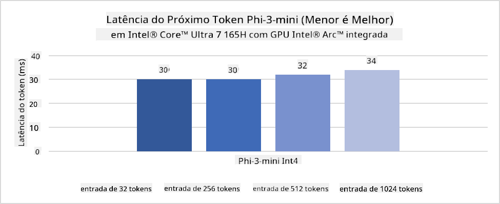
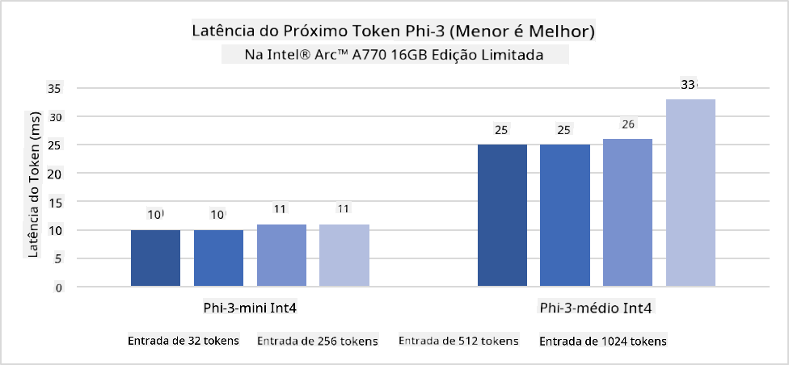

<!--
CO_OP_TRANSLATOR_METADATA:
{
  "original_hash": "e08ce816e23ad813244a09ca34ebb8ac",
  "translation_date": "2025-05-09T10:12:47+00:00",
  "source_file": "md/01.Introduction/03/AIPC_Inference.md",
  "language_code": "br"
}
-->
# **Inferência Phi-3 em AI PC**

Com o avanço da IA generativa e a melhoria nas capacidades de hardware dos dispositivos de borda, um número crescente de modelos de IA generativa pode agora ser integrado aos dispositivos Bring Your Own Device (BYOD) dos usuários. Os AI PCs estão entre esses modelos. A partir de 2024, Intel, AMD e Qualcomm colaboraram com fabricantes de PCs para lançar AI PCs que facilitam a implantação de modelos generativos locais por meio de modificações no hardware. Nesta discussão, focaremos nos AI PCs da Intel e exploraremos como implantar o Phi-3 em um AI PC Intel.

### O que é NPU

Uma NPU (Unidade de Processamento Neural) é um processador dedicado ou unidade de processamento em um SoC maior, projetada especificamente para acelerar operações de redes neurais e tarefas de IA. Diferente das CPUs e GPUs de uso geral, as NPUs são otimizadas para computação paralela orientada a dados, tornando-as altamente eficientes no processamento de grandes volumes de dados multimídia, como vídeos e imagens, além do processamento para redes neurais. Elas são especialmente habilidosas em lidar com tarefas relacionadas à IA, como reconhecimento de fala, desfoque de fundo em chamadas de vídeo e processos de edição de fotos ou vídeos, como detecção de objetos.

## NPU vs GPU

Embora muitas cargas de trabalho de IA e aprendizado de máquina rodem em GPUs, há uma diferença importante entre GPUs e NPUs.  
GPUs são conhecidas por suas capacidades de computação paralela, mas nem todas são igualmente eficientes além do processamento gráfico. NPUs, por outro lado, são projetadas especificamente para cálculos complexos envolvidos em operações de redes neurais, tornando-as muito eficazes para tarefas de IA.

Resumindo, NPUs são os especialistas em matemática que aceleram os cálculos de IA, desempenhando um papel fundamental na nova era dos AI PCs!

***Este exemplo é baseado no mais recente processador Intel Core Ultra da Intel***

## **1. Usando NPU para rodar o modelo Phi-3**

O dispositivo Intel® NPU é um acelerador de inferência de IA integrado às CPUs cliente Intel, a partir da geração Intel® Core™ Ultra (antigamente conhecida como Meteor Lake). Ele permite a execução energeticamente eficiente de tarefas de redes neurais artificiais.





**Biblioteca de Aceleração Intel NPU**

A Intel NPU Acceleration Library [https://github.com/intel/intel-npu-acceleration-library](https://github.com/intel/intel-npu-acceleration-library) é uma biblioteca Python projetada para aumentar a eficiência das suas aplicações, aproveitando o poder da Intel Neural Processing Unit (NPU) para realizar cálculos em alta velocidade em hardware compatível.

Exemplo do Phi-3-mini em AI PC com processadores Intel® Core™ Ultra.


Instale a biblioteca Python com pip

```bash

   pip install intel-npu-acceleration-library

```

***Nota*** O projeto ainda está em desenvolvimento, mas o modelo de referência já está bastante completo.

### **Rodando Phi-3 com Intel NPU Acceleration Library**

Usando a aceleração da Intel NPU, esta biblioteca não interfere no processo tradicional de codificação. Você só precisa usar essa biblioteca para quantizar o modelo Phi-3 original, como FP16, INT8, INT4, por exemplo:

```python
from transformers import AutoTokenizer, pipeline,TextStreamer
from intel_npu_acceleration_library import NPUModelForCausalLM, int4
from intel_npu_acceleration_library.compiler import CompilerConfig
import warnings

model_id = "microsoft/Phi-3-mini-4k-instruct"

compiler_conf = CompilerConfig(dtype=int4)
model = NPUModelForCausalLM.from_pretrained(
    model_id, use_cache=True, config=compiler_conf, attn_implementation="sdpa"
).eval()

tokenizer = AutoTokenizer.from_pretrained(model_id)

text_streamer = TextStreamer(tokenizer, skip_prompt=True)
```

Após a quantização ser concluída com sucesso, continue a execução para chamar a NPU e rodar o modelo Phi-3.

```python
generation_args = {
   "max_new_tokens": 1024,
   "return_full_text": False,
   "temperature": 0.3,
   "do_sample": False,
   "streamer": text_streamer,
}

pipe = pipeline(
   "text-generation",
   model=model,
   tokenizer=tokenizer,
)

query = "<|system|>You are a helpful AI assistant.<|end|><|user|>Can you introduce yourself?<|end|><|assistant|>"

with warnings.catch_warnings():
    warnings.simplefilter("ignore")
    pipe(query, **generation_args)
```

Durante a execução do código, é possível acompanhar o status da NPU pelo Gerenciador de Tarefas.


***Exemplos*** : [AIPC_NPU_DEMO.ipynb](../../../../../code/03.Inference/AIPC/AIPC_NPU_DEMO.ipynb)

## **2. Usando DirectML + ONNX Runtime para rodar o modelo Phi-3**

### **O que é DirectML**

[DirectML](https://github.com/microsoft/DirectML) é uma biblioteca DirectX 12 acelerada por hardware de alto desempenho para machine learning. DirectML oferece aceleração via GPU para tarefas comuns de machine learning em uma ampla gama de hardwares e drivers suportados, incluindo todas as GPUs compatíveis com DirectX 12 de fabricantes como AMD, Intel, NVIDIA e Qualcomm.

Quando usado isoladamente, a API DirectML é uma biblioteca de baixo nível do DirectX 12, adequada para aplicações de alto desempenho e baixa latência, como frameworks, jogos e outras aplicações em tempo real. A interoperabilidade fluida do DirectML com Direct3D 12, seu baixo overhead e conformidade entre hardwares fazem do DirectML uma escolha ideal para acelerar machine learning quando se deseja alto desempenho, confiabilidade e previsibilidade dos resultados em diferentes hardwares.

***Nota*** : A versão mais recente do DirectML já suporta NPU (https://devblogs.microsoft.com/directx/introducing-neural-processor-unit-npu-support-in-directml-developer-preview/)

### DirectML e CUDA em termos de capacidades e desempenho:

**DirectML** é uma biblioteca de machine learning desenvolvida pela Microsoft. Ela foi criada para acelerar cargas de trabalho de machine learning em dispositivos Windows, incluindo desktops, notebooks e dispositivos de borda.  
- Baseado em DX12: DirectML é construído sobre o DirectX 12 (DX12), que oferece suporte a uma ampla variedade de hardwares GPU, incluindo NVIDIA e AMD.  
- Suporte mais amplo: Por usar DX12, DirectML pode funcionar com qualquer GPU que suporte DX12, inclusive GPUs integradas.  
- Processamento de imagens: DirectML processa imagens e outros dados usando redes neurais, sendo adequado para tarefas como reconhecimento de imagens, detecção de objetos, entre outras.  
- Facilidade de configuração: A configuração do DirectML é simples e não requer SDKs ou bibliotecas específicas dos fabricantes de GPU.  
- Desempenho: Em alguns casos, o DirectML tem bom desempenho e pode ser mais rápido que o CUDA, especialmente para determinadas cargas de trabalho.  
- Limitações: Entretanto, há situações em que o DirectML pode ser mais lento, especialmente para grandes lotes em float16.

**CUDA** é a plataforma de computação paralela e modelo de programação da NVIDIA. Permite que desenvolvedores aproveitem o poder das GPUs NVIDIA para computação geral, incluindo machine learning e simulações científicas.  
- Específico para NVIDIA: CUDA é fortemente integrado às GPUs NVIDIA e projetado especificamente para elas.  
- Altamente otimizado: Proporciona excelente desempenho para tarefas aceleradas por GPU, especialmente em GPUs NVIDIA.  
- Amplamente usado: Muitos frameworks e bibliotecas de machine learning (como TensorFlow e PyTorch) suportam CUDA.  
- Personalização: Desenvolvedores podem ajustar configurações do CUDA para tarefas específicas, otimizando o desempenho.  
- Limitações: A dependência do hardware NVIDIA pode ser um empecilho para compatibilidade mais ampla com outras GPUs.

### Escolhendo entre DirectML e CUDA

A escolha entre DirectML e CUDA depende do seu caso de uso, disponibilidade de hardware e preferências.  
Se você busca maior compatibilidade e facilidade de configuração, DirectML pode ser uma boa opção. Porém, se possui GPUs NVIDIA e precisa de desempenho altamente otimizado, CUDA continua sendo uma escolha forte. Em resumo, ambos têm seus pontos fortes e fracos, então avalie suas necessidades e hardware disponível ao decidir.

### **IA Generativa com ONNX Runtime**

Na era da IA, a portabilidade dos modelos é muito importante. O ONNX Runtime permite implantar facilmente modelos treinados em diferentes dispositivos. Os desenvolvedores não precisam se preocupar com o framework de inferência e usam uma API unificada para completar a inferência do modelo. Na era da IA generativa, o ONNX Runtime também realizou otimizações de código (https://onnxruntime.ai/docs/genai/). Com o ONNX Runtime otimizado, o modelo generativo quantizado pode ser inferido em diferentes terminais. No Generative AI com ONNX Runtime, você pode acessar a API do modelo de IA por meio de Python, C#, C/C++. Claro, o deploy em iPhone pode aproveitar a API de IA generativa com ONNX Runtime em C++.

[Sample Code](https://github.com/Azure-Samples/Phi-3MiniSamples/tree/main/onnx)

***Compilando a biblioteca de IA generativa com ONNX Runtime***

```bash

winget install --id=Kitware.CMake  -e

git clone https://github.com/microsoft/onnxruntime.git

cd .\onnxruntime\

./build.bat --build_shared_lib --skip_tests --parallel --use_dml --config Release

cd ../

git clone https://github.com/microsoft/onnxruntime-genai.git

cd .\onnxruntime-genai\

mkdir ort

cd ort

mkdir include

mkdir lib

copy ..\onnxruntime\include\onnxruntime\core\providers\dml\dml_provider_factory.h ort\include

copy ..\onnxruntime\include\onnxruntime\core\session\onnxruntime_c_api.h ort\include

copy ..\onnxruntime\build\Windows\Release\Release\*.dll ort\lib

copy ..\onnxruntime\build\Windows\Release\Release\onnxruntime.lib ort\lib

python build.py --use_dml


```

**Instalar a biblioteca**

```bash

pip install .\onnxruntime_genai_directml-0.3.0.dev0-cp310-cp310-win_amd64.whl

```

Este é o resultado da execução


***Exemplos*** : [AIPC_DirectML_DEMO.ipynb](../../../../../code/03.Inference/AIPC/AIPC_DirectML_DEMO.ipynb)

## **3. Usando Intel OpenVino para rodar o modelo Phi-3**

### **O que é OpenVINO**

[OpenVINO](https://github.com/openvinotoolkit/openvino) é um toolkit open-source para otimização e implantação de modelos de deep learning. Ele oferece desempenho aprimorado para modelos de visão, áudio e linguagem de frameworks populares como TensorFlow, PyTorch e outros. Comece a usar o OpenVINO. O OpenVINO também pode ser usado em combinação com CPU e GPU para rodar o modelo Phi-3.

***Nota***: Atualmente, o OpenVINO não suporta NPU.

### **Instalando a biblioteca OpenVINO**

```bash

 pip install git+https://github.com/huggingface/optimum-intel.git

 pip install git+https://github.com/openvinotoolkit/nncf.git

 pip install openvino-nightly

```

### **Rodando Phi-3 com OpenVINO**

Assim como na NPU, o OpenVINO executa a chamada dos modelos de IA generativa por meio da execução de modelos quantizados. É necessário quantizar o modelo Phi-3 primeiro e completar a quantização via linha de comando com o optimum-cli.

**INT4**

```bash

optimum-cli export openvino --model "microsoft/Phi-3-mini-4k-instruct" --task text-generation-with-past --weight-format int4 --group-size 128 --ratio 0.6  --sym  --trust-remote-code ./openvinomodel/phi3/int4

```

**FP16**

```bash

optimum-cli export openvino --model "microsoft/Phi-3-mini-4k-instruct" --task text-generation-with-past --weight-format fp16 --trust-remote-code ./openvinomodel/phi3/fp16

```

O formato convertido fica assim


Carregue os caminhos do modelo (model_dir), as configurações relacionadas (ov_config = {"PERFORMANCE_HINT": "LATENCY", "NUM_STREAMS": "1", "CACHE_DIR": ""}) e os dispositivos acelerados por hardware (GPU.0) através do OVModelForCausalLM

```python

ov_model = OVModelForCausalLM.from_pretrained(
     model_dir,
     device='GPU.0',
     ov_config=ov_config,
     config=AutoConfig.from_pretrained(model_dir, trust_remote_code=True),
     trust_remote_code=True,
)

```

Durante a execução do código, é possível acompanhar o status da GPU pelo Gerenciador de Tarefas.


***Exemplos*** : [AIPC_OpenVino_Demo.ipynb](../../../../../code/03.Inference/AIPC/AIPC_OpenVino_Demo.ipynb)

### ***Nota*** : Os três métodos acima têm suas vantagens, mas recomenda-se usar a aceleração NPU para inferência em AI PC.

**Aviso Legal**:  
Este documento foi traduzido utilizando o serviço de tradução automática [Co-op Translator](https://github.com/Azure/co-op-translator). Embora nos esforcemos para garantir a precisão, esteja ciente de que traduções automáticas podem conter erros ou imprecisões. O documento original em seu idioma nativo deve ser considerado a fonte oficial. Para informações críticas, recomenda-se a tradução profissional realizada por humanos. Não nos responsabilizamos por quaisquer mal-entendidos ou interpretações incorretas decorrentes do uso desta tradução.