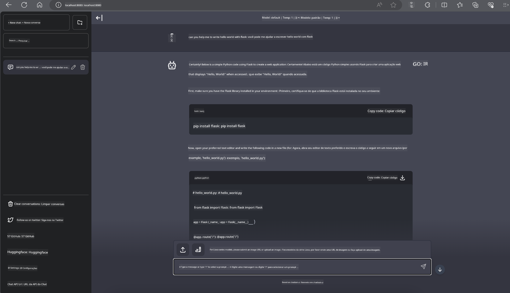

<!--
CO_OP_TRANSLATOR_METADATA:
{
  "original_hash": "be4101a30d98e95a71d42c276e8bcd37",
  "translation_date": "2025-07-16T20:41:51+00:00",
  "source_file": "md/01.Introduction/03/Jetson_Inference.md",
  "language_code": "br"
}
-->
# **Inferência Phi-3 no Nvidia Jetson**

Nvidia Jetson é uma série de placas de computação embarcada da Nvidia. Os modelos Jetson TK1, TX1 e TX2 possuem um processador Tegra (ou SoC) da Nvidia que integra uma unidade central de processamento (CPU) com arquitetura ARM. O Jetson é um sistema de baixo consumo de energia, projetado para acelerar aplicações de aprendizado de máquina. A Nvidia Jetson é utilizada por desenvolvedores profissionais para criar produtos inovadores de IA em diversos setores, além de ser uma plataforma para estudantes e entusiastas aprenderem IA na prática e desenvolverem projetos incríveis. O SLM é implementado em dispositivos de borda como o Jetson, o que possibilita uma melhor aplicação de cenários industriais de IA generativa.

## Implantação no NVIDIA Jetson:
Desenvolvedores que trabalham com robótica autônoma e dispositivos embarcados podem aproveitar o Phi-3 Mini. O tamanho relativamente pequeno do Phi-3 o torna ideal para implantação na borda. Os parâmetros foram cuidadosamente ajustados durante o treinamento, garantindo alta precisão nas respostas.

### Otimização TensorRT-LLM:
A [biblioteca TensorRT-LLM da NVIDIA](https://github.com/NVIDIA/TensorRT-LLM?WT.mc_id=aiml-138114-kinfeylo) otimiza a inferência de grandes modelos de linguagem. Ela suporta a janela de contexto longa do Phi-3 Mini, melhorando tanto o throughput quanto a latência. As otimizações incluem técnicas como LongRoPE, FP8 e batching em voo.

### Disponibilidade e Implantação:
Desenvolvedores podem explorar o Phi-3 Mini com janela de contexto de 128K em [NVIDIA AI](https://www.nvidia.com/en-us/ai-data-science/generative-ai/). Ele é distribuído como um NVIDIA NIM, um microsserviço com API padrão que pode ser implantado em qualquer lugar. Além disso, as [implementações TensorRT-LLM no GitHub](https://github.com/NVIDIA/TensorRT-LLM).

## **1. Preparação**

a. Jetson Orin NX / Jetson NX

b. JetPack 5.1.2+

c. Cuda 11.8

d. Python 3.8+

## **2. Executando Phi-3 no Jetson**

Podemos escolher [Ollama](https://ollama.com) ou [LlamaEdge](https://llamaedge.com)

Se você quiser usar gguf na nuvem e em dispositivos de borda ao mesmo tempo, o LlamaEdge pode ser entendido como WasmEdge (WasmEdge é um runtime WebAssembly leve, de alto desempenho e escalável, adequado para aplicações nativas em nuvem, borda e descentralizadas. Ele suporta aplicações serverless, funções embarcadas, microsserviços, contratos inteligentes e dispositivos IoT). Você pode implantar o modelo quantitativo gguf em dispositivos de borda e na nuvem através do LlamaEdge.


Aqui estão os passos para usar

1. Instale e baixe as bibliotecas e arquivos relacionados

```bash

curl -sSf https://raw.githubusercontent.com/WasmEdge/WasmEdge/master/utils/install.sh | bash -s -- --plugin wasi_nn-ggml

curl -LO https://github.com/LlamaEdge/LlamaEdge/releases/latest/download/llama-api-server.wasm

curl -LO https://github.com/LlamaEdge/chatbot-ui/releases/latest/download/chatbot-ui.tar.gz

tar xzf chatbot-ui.tar.gz

```

**Nota**: llama-api-server.wasm e chatbot-ui precisam estar no mesmo diretório

2. Execute os scripts no terminal

```bash

wasmedge --dir .:. --nn-preload default:GGML:AUTO:{Your gguf path} llama-api-server.wasm -p phi-3-chat

```

Aqui está o resultado da execução



***Código de exemplo*** [Phi-3 mini WASM Notebook Sample](https://github.com/Azure-Samples/Phi-3MiniSamples/tree/main/wasm)

Em resumo, o Phi-3 Mini representa um avanço significativo em modelagem de linguagem, combinando eficiência, consciência de contexto e o poder de otimização da NVIDIA. Seja para construir robôs ou aplicações de borda, o Phi-3 Mini é uma ferramenta poderosa para se conhecer.

**Aviso Legal**:  
Este documento foi traduzido utilizando o serviço de tradução por IA [Co-op Translator](https://github.com/Azure/co-op-translator). Embora nos esforcemos para garantir a precisão, esteja ciente de que traduções automáticas podem conter erros ou imprecisões. O documento original em seu idioma nativo deve ser considerado a fonte autorizada. Para informações críticas, recomenda-se tradução profissional humana. Não nos responsabilizamos por quaisquer mal-entendidos ou interpretações incorretas decorrentes do uso desta tradução.