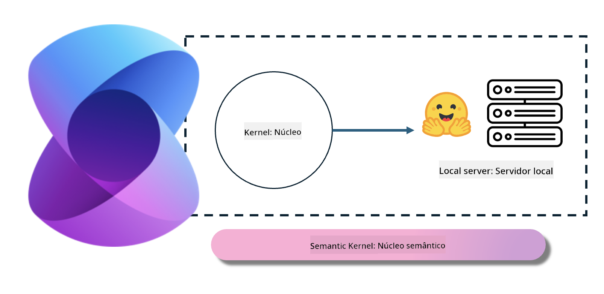
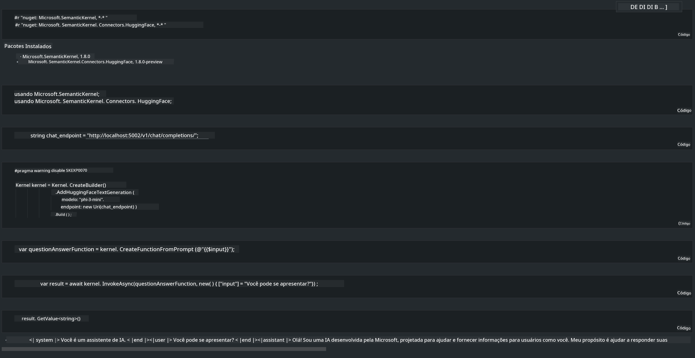

<!--
CO_OP_TRANSLATOR_METADATA:
{
  "original_hash": "bcf5dd7031db0031abdb9dd0c05ba118",
  "translation_date": "2025-05-09T12:03:27+00:00",
  "source_file": "md/01.Introduction/03/Local_Server_Inference.md",
  "language_code": "br"
}
-->
# **Inferência Phi-3 em Servidor Local**

Podemos implantar o Phi-3 em um servidor local. Os usuários podem escolher as soluções [Ollama](https://ollama.com) ou [LM Studio](https://llamaedge.com), ou podem escrever seu próprio código. Você pode conectar os serviços locais do Phi-3 através do [Semantic Kernel](https://github.com/microsoft/semantic-kernel?WT.mc_id=aiml-138114-kinfeylo) ou [Langchain](https://www.langchain.com/) para construir aplicações Copilot.

## **Usando Semantic Kernel para acessar Phi-3-mini**

Na aplicação Copilot, criamos aplicações usando Semantic Kernel / LangChain. Esse tipo de framework de aplicação é geralmente compatível com o Azure OpenAI Service / modelos OpenAI, e também pode suportar modelos open source no Hugging Face e modelos locais. O que fazer se quisermos usar o Semantic Kernel para acessar o Phi-3-mini? Usando .NET como exemplo, podemos combiná-lo com o Hugging Face Connector no Semantic Kernel. Por padrão, ele corresponde ao id do modelo no Hugging Face (na primeira vez que usar, o modelo será baixado do Hugging Face, o que pode levar bastante tempo). Você também pode conectar ao serviço local construído. Entre as duas opções, recomendamos a segunda por oferecer maior autonomia, especialmente em aplicações corporativas.

Pela figura, acessar serviços locais via Semantic Kernel permite conectar facilmente ao servidor do modelo Phi-3-mini auto-hospedado. Aqui está o resultado da execução:

***Sample Code*** https://github.com/kinfey/Phi3MiniSamples/tree/main/semantickernel

**Aviso Legal**:  
Este documento foi traduzido utilizando o serviço de tradução por IA [Co-op Translator](https://github.com/Azure/co-op-translator). Embora nos esforcemos para garantir a precisão, esteja ciente de que traduções automáticas podem conter erros ou imprecisões. O documento original em seu idioma nativo deve ser considerado a fonte oficial. Para informações críticas, recomenda-se a tradução profissional realizada por humanos. Não nos responsabilizamos por quaisquer mal-entendidos ou interpretações incorretas decorrentes do uso desta tradução.