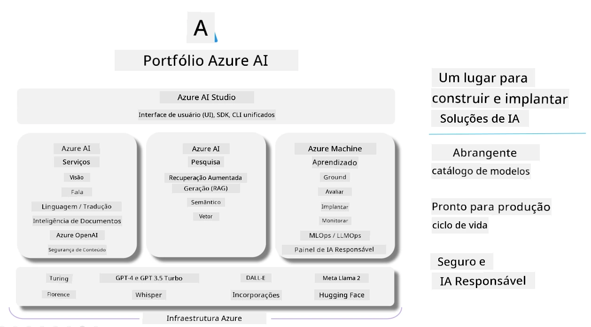

<!--
CO_OP_TRANSLATOR_METADATA:
{
  "original_hash": "7b4235159486df4000e16b7b46ddfec3",
  "translation_date": "2025-07-16T22:30:45+00:00",
  "source_file": "md/01.Introduction/05/AIFoundry.md",
  "language_code": "br"
}
-->
# **Usando o Azure AI Foundry para avaliação**

Como avaliar sua aplicação de IA generativa usando o [Azure AI Foundry](https://ai.azure.com?WT.mc_id=aiml-138114-kinfeylo). Seja para avaliar conversas de turno único ou múltiplos turnos, o Azure AI Foundry oferece ferramentas para medir o desempenho e a segurança do modelo.

## Como avaliar apps de IA generativa com o Azure AI Foundry  
Para instruções mais detalhadas, consulte a [Documentação do Azure AI Foundry](https://learn.microsoft.com/azure/ai-studio/how-to/evaluate-generative-ai-app?WT.mc_id=aiml-138114-kinfeylo)

Aqui estão os passos para começar:

## Avaliando Modelos de IA Generativa no Azure AI Foundry

**Pré-requisitos**

- Um conjunto de dados de teste em formato CSV ou JSON.  
- Um modelo de IA generativa implantado (como Phi-3, GPT 3.5, GPT 4 ou modelos Davinci).  
- Um runtime com uma instância de computação para executar a avaliação.

## Métricas de Avaliação Integradas

O Azure AI Foundry permite avaliar tanto conversas de turno único quanto conversas complexas de múltiplos turnos.  
Para cenários de Retrieval Augmented Generation (RAG), onde o modelo é fundamentado em dados específicos, você pode avaliar o desempenho usando métricas de avaliação integradas.  
Além disso, é possível avaliar cenários gerais de perguntas e respostas de turno único (não-RAG).

## Criando uma Execução de Avaliação

Na interface do Azure AI Foundry, navegue até a página Evaluate ou Prompt Flow.  
Siga o assistente de criação de avaliação para configurar uma execução de avaliação. Forneça um nome opcional para sua avaliação.  
Selecione o cenário que melhor se alinha aos objetivos da sua aplicação.  
Escolha uma ou mais métricas de avaliação para analisar a saída do modelo.

## Fluxo de Avaliação Personalizado (Opcional)

Para maior flexibilidade, você pode criar um fluxo de avaliação personalizado. Personalize o processo de avaliação conforme suas necessidades específicas.

## Visualizando Resultados

Após executar a avaliação, registre, visualize e analise métricas detalhadas no Azure AI Foundry. Obtenha insights sobre as capacidades e limitações da sua aplicação.

**Note** O Azure AI Foundry está atualmente em prévia pública, portanto, use-o para experimentação e desenvolvimento. Para cargas de trabalho em produção, considere outras opções. Explore a [documentação oficial do AI Foundry](https://learn.microsoft.com/azure/ai-studio/?WT.mc_id=aiml-138114-kinfeylo) para mais detalhes e instruções passo a passo.

**Aviso Legal**:  
Este documento foi traduzido utilizando o serviço de tradução por IA [Co-op Translator](https://github.com/Azure/co-op-translator). Embora nos esforcemos para garantir a precisão, esteja ciente de que traduções automáticas podem conter erros ou imprecisões. O documento original em seu idioma nativo deve ser considerado a fonte autorizada. Para informações críticas, recomenda-se tradução profissional humana. Não nos responsabilizamos por quaisquer mal-entendidos ou interpretações incorretas decorrentes do uso desta tradução.