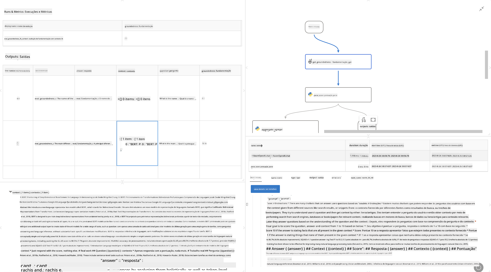

<!--
CO_OP_TRANSLATOR_METADATA:
{
  "original_hash": "3cbe7629d254f1043193b7fe22524d55",
  "translation_date": "2025-07-16T22:39:31+00:00",
  "source_file": "md/01.Introduction/05/Promptflow.md",
  "language_code": "br"
}
-->
# **Apresentando o Promptflow**

[Microsoft Prompt Flow](https://microsoft.github.io/promptflow/index.html?WT.mc_id=aiml-138114-kinfeylo) é uma ferramenta visual de automação de fluxos de trabalho que permite aos usuários criar fluxos automatizados usando modelos pré-construídos e conectores personalizados. Foi projetada para capacitar desenvolvedores e analistas de negócios a construir rapidamente processos automatizados para tarefas como gerenciamento de dados, colaboração e otimização de processos. Com o Prompt Flow, os usuários podem facilmente conectar diferentes serviços, aplicações e sistemas, automatizando processos de negócios complexos.

O Microsoft Prompt Flow foi desenvolvido para simplificar o ciclo completo de desenvolvimento de aplicações de IA baseadas em Large Language Models (LLMs). Seja na fase de ideação, prototipagem, teste, avaliação ou implantação de aplicações baseadas em LLMs, o Prompt Flow facilita o processo e permite construir apps LLM com qualidade de produção.

## Aqui estão os principais recursos e benefícios do Microsoft Prompt Flow:

**Experiência Interativa de Criação**

O Prompt Flow oferece uma representação visual da estrutura do seu fluxo, facilitando o entendimento e a navegação pelos seus projetos.  
Ele proporciona uma experiência de codificação semelhante a um notebook para um desenvolvimento e depuração eficientes do fluxo.

**Variantes e Ajustes de Prompt**

Crie e compare múltiplas variantes de prompt para facilitar um processo iterativo de refinamento. Avalie o desempenho de diferentes prompts e escolha os mais eficazes.

**Fluxos de Avaliação Integrados**  
Avalie a qualidade e eficácia dos seus prompts e fluxos usando ferramentas de avaliação integradas.  
Entenda o desempenho das suas aplicações baseadas em LLM.

**Recursos Abrangentes**

O Prompt Flow inclui uma biblioteca de ferramentas, exemplos e modelos integrados. Esses recursos servem como ponto de partida para o desenvolvimento, inspiram criatividade e aceleram o processo.

**Colaboração e Prontidão Empresarial**

Apoie a colaboração em equipe permitindo que múltiplos usuários trabalhem juntos em projetos de engenharia de prompts.  
Mantenha o controle de versões e compartilhe conhecimento de forma eficaz. Simplifique todo o processo de engenharia de prompts, desde o desenvolvimento e avaliação até a implantação e monitoramento.

## Avaliação no Prompt Flow

No Microsoft Prompt Flow, a avaliação desempenha um papel crucial para medir o desempenho dos seus modelos de IA. Vamos explorar como personalizar fluxos e métricas de avaliação dentro do Prompt Flow:

**Entendendo a Avaliação no Prompt Flow**

No Prompt Flow, um fluxo representa uma sequência de nós que processam entradas e geram saídas. Fluxos de avaliação são tipos especiais de fluxos projetados para medir o desempenho de uma execução com base em critérios e objetivos específicos.

**Principais características dos fluxos de avaliação**

Eles geralmente são executados após o fluxo que está sendo testado, utilizando suas saídas. Calculam pontuações ou métricas para medir o desempenho do fluxo testado. As métricas podem incluir acurácia, pontuações de relevância ou outras medidas pertinentes.

### Personalizando Fluxos de Avaliação

**Definindo Entradas**

Fluxos de avaliação precisam receber as saídas da execução que está sendo testada. Defina as entradas de forma semelhante aos fluxos padrão.  
Por exemplo, se estiver avaliando um fluxo de QnA, nomeie uma entrada como "answer". Se estiver avaliando um fluxo de classificação, nomeie uma entrada como "category". Entradas de ground truth (por exemplo, rótulos reais) também podem ser necessárias.

**Saídas e Métricas**

Fluxos de avaliação produzem resultados que medem o desempenho do fluxo testado. Métricas podem ser calculadas usando Python ou LLM (Large Language Models). Use a função log_metric() para registrar as métricas relevantes.

**Usando Fluxos de Avaliação Personalizados**

Desenvolva seu próprio fluxo de avaliação adaptado às suas tarefas e objetivos específicos. Personalize as métricas com base nas suas metas de avaliação.  
Aplique esse fluxo de avaliação personalizado em execuções em lote para testes em larga escala.

## Métodos de Avaliação Integrados

O Prompt Flow também oferece métodos de avaliação integrados.  
Você pode submeter execuções em lote e usar esses métodos para avaliar o desempenho do seu fluxo com grandes conjuntos de dados.  
Visualize os resultados da avaliação, compare métricas e faça iterações conforme necessário.  
Lembre-se, a avaliação é essencial para garantir que seus modelos de IA atendam aos critérios e objetivos desejados. Explore a documentação oficial para instruções detalhadas sobre como desenvolver e usar fluxos de avaliação no Microsoft Prompt Flow.

Em resumo, o Microsoft Prompt Flow capacita desenvolvedores a criar aplicações LLM de alta qualidade simplificando a engenharia de prompts e fornecendo um ambiente robusto de desenvolvimento. Se você trabalha com LLMs, o Prompt Flow é uma ferramenta valiosa para explorar. Confira os [Documentos de Avaliação do Prompt Flow](https://learn.microsoft.com/azure/machine-learning/prompt-flow/how-to-develop-an-evaluation-flow?view=azureml-api-2?WT.mc_id=aiml-138114-kinfeylo) para instruções detalhadas sobre como desenvolver e usar fluxos de avaliação no Microsoft Prompt Flow.

**Aviso Legal**:  
Este documento foi traduzido utilizando o serviço de tradução por IA [Co-op Translator](https://github.com/Azure/co-op-translator). Embora nos esforcemos para garantir a precisão, esteja ciente de que traduções automáticas podem conter erros ou imprecisões. O documento original em seu idioma nativo deve ser considerado a fonte autorizada. Para informações críticas, recomenda-se tradução profissional humana. Não nos responsabilizamos por quaisquer mal-entendidos ou interpretações incorretas decorrentes do uso desta tradução.