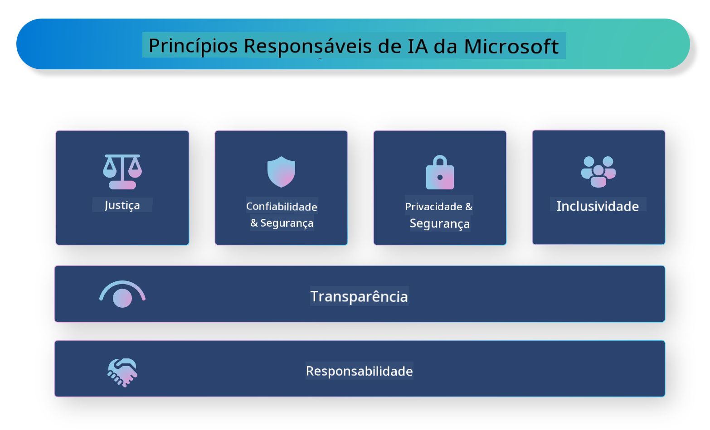

<!--
CO_OP_TRANSLATOR_METADATA:
{
  "original_hash": "805b96b20152936d8f4c587d90d6e06e",
  "translation_date": "2025-05-09T15:29:58+00:00",
  "source_file": "md/01.Introduction/05/ResponsibleAI.md",
  "language_code": "br"
}
-->
# **Apresentando a IA Responsável**

[Microsoft Responsible AI](https://www.microsoft.com/ai/responsible-ai?WT.mc_id=aiml-138114-kinfeylo) é uma iniciativa que busca ajudar desenvolvedores e organizações a construir sistemas de IA que sejam transparentes, confiáveis e responsáveis. A iniciativa oferece orientações e recursos para desenvolver soluções de IA responsáveis que estejam alinhadas com princípios éticos, como privacidade, justiça e transparência. Também exploraremos alguns dos desafios e melhores práticas relacionados à construção de sistemas de IA responsáveis.

## Visão geral do Microsoft Responsible AI

**Princípios éticos**

O Microsoft Responsible AI é guiado por um conjunto de princípios éticos, como privacidade, justiça, transparência, responsabilidade e segurança. Esses princípios foram criados para garantir que os sistemas de IA sejam desenvolvidos de maneira ética e responsável.

**IA transparente**

O Microsoft Responsible AI destaca a importância da transparência nos sistemas de IA. Isso inclui fornecer explicações claras sobre como os modelos de IA funcionam, além de garantir que as fontes de dados e algoritmos estejam disponíveis publicamente.

**IA responsável**

[Microsoft Responsible AI](https://www.microsoft.com/ai/responsible-ai?WT.mc_id=aiml-138114-kinfeylo) promove o desenvolvimento de sistemas de IA responsáveis, que podem oferecer insights sobre como os modelos de IA tomam decisões. Isso ajuda os usuários a entender e confiar nos resultados gerados pelos sistemas de IA.

**Inclusividade**

Os sistemas de IA devem ser projetados para beneficiar a todos. A Microsoft busca criar uma IA inclusiva, que considere diversas perspectivas e evite vieses ou discriminação.

**Confiabilidade e segurança**

Garantir que os sistemas de IA sejam confiáveis e seguros é fundamental. A Microsoft foca em construir modelos robustos que apresentem desempenho consistente e evitem resultados prejudiciais.

**Justiça na IA**

O Microsoft Responsible AI reconhece que sistemas de IA podem perpetuar vieses se forem treinados com dados ou algoritmos tendenciosos. A iniciativa oferece orientações para desenvolver sistemas de IA justos, que não discriminem com base em fatores como raça, gênero ou idade.

**Privacidade e segurança**

O Microsoft Responsible AI enfatiza a importância de proteger a privacidade dos usuários e a segurança dos dados nos sistemas de IA. Isso inclui implementar criptografia forte e controles de acesso, além de realizar auditorias regulares para identificar vulnerabilidades.

**Responsabilidade e prestação de contas**

O Microsoft Responsible AI promove a responsabilidade e a prestação de contas no desenvolvimento e na implantação da IA. Isso envolve garantir que desenvolvedores e organizações estejam cientes dos riscos potenciais associados aos sistemas de IA e adotem medidas para mitigar esses riscos.

## Melhores práticas para construir sistemas de IA responsáveis

**Desenvolver modelos de IA usando conjuntos de dados diversos**

Para evitar vieses nos sistemas de IA, é importante usar conjuntos de dados variados que representem diferentes perspectivas e experiências.

**Usar técnicas de IA explicável**

Técnicas de IA explicável ajudam os usuários a entender como os modelos de IA tomam decisões, o que pode aumentar a confiança no sistema.

**Auditar regularmente os sistemas de IA em busca de vulnerabilidades**

Auditorias regulares dos sistemas de IA ajudam a identificar riscos e vulnerabilidades que precisam ser corrigidos.

**Implementar criptografia forte e controles de acesso**

A criptografia e os controles de acesso ajudam a proteger a privacidade e a segurança dos usuários nos sistemas de IA.

**Seguir princípios éticos no desenvolvimento de IA**

Seguir princípios éticos, como justiça, transparência e responsabilidade, contribui para a construção de confiança nos sistemas de IA e garante que eles sejam desenvolvidos de maneira responsável.

## Usando o AI Foundry para IA Responsável

[Azure AI Foundry](https://ai.azure.com?WT.mc_id=aiml-138114-kinfeylo) é uma plataforma poderosa que permite a desenvolvedores e organizações criar rapidamente aplicações inteligentes, inovadoras, prontas para o mercado e responsáveis. Veja algumas das principais funcionalidades e capacidades do Azure AI Foundry:

**APIs e modelos prontos para uso**

O Azure AI Foundry oferece APIs e modelos pré-construídos e personalizáveis. Eles cobrem uma ampla gama de tarefas de IA, incluindo IA generativa, processamento de linguagem natural para conversas, busca, monitoramento, tradução, fala, visão e tomada de decisão.

**Prompt Flow**

O Prompt Flow no Azure AI Foundry permite criar experiências de IA conversacional. Ele possibilita o design e o gerenciamento de fluxos conversacionais, facilitando a construção de chatbots, assistentes virtuais e outras aplicações interativas.

**Retrieval Augmented Generation (RAG)**

RAG é uma técnica que combina abordagens baseadas em recuperação e geração. Ela melhora a qualidade das respostas geradas ao aproveitar tanto o conhecimento pré-existente (recuperação) quanto a geração criativa (geração).

**Métricas de avaliação e monitoramento para IA generativa**

O Azure AI Foundry fornece ferramentas para avaliar e monitorar modelos de IA generativa. É possível analisar seu desempenho, justiça e outras métricas importantes para garantir uma implantação responsável. Além disso, se você criou um painel, pode usar a interface sem código no Azure Machine Learning Studio para personalizar e gerar um Responsible AI Dashboard e um scorecard associado, baseados nas bibliotecas Python do [Responsible AI Toolbox](https://responsibleaitoolbox.ai/?WT.mc_id=aiml-138114-kinfeylo). Esse scorecard ajuda a compartilhar insights importantes relacionados à justiça, importância das características e outras considerações para uma implantação responsável, com públicos técnicos e não técnicos.

Para usar o AI Foundry com IA responsável, você pode seguir estas melhores práticas:

**Defina o problema e os objetivos do seu sistema de IA**

Antes de iniciar o desenvolvimento, é importante definir claramente o problema ou objetivo que seu sistema de IA pretende resolver. Isso ajudará a identificar os dados, algoritmos e recursos necessários para construir um modelo eficaz.

**Coleta e pré-processamento de dados relevantes**

A qualidade e a quantidade dos dados usados no treinamento de um sistema de IA têm grande impacto no seu desempenho. Portanto, é importante coletar dados relevantes, limpá-los, pré-processá-los e garantir que sejam representativos da população ou do problema que você deseja resolver.

**Escolha a avaliação adequada**

Existem vários algoritmos de avaliação disponíveis. É importante escolher o algoritmo mais adequado com base nos seus dados e no problema.

**Avalie e interprete o modelo**

Depois de construir um modelo de IA, é fundamental avaliar seu desempenho usando métricas apropriadas e interpretar os resultados de forma transparente. Isso ajuda a identificar possíveis vieses ou limitações no modelo e a promover melhorias quando necessário.

**Garanta transparência e explicabilidade**

Os sistemas de IA devem ser transparentes e explicáveis para que os usuários compreendam seu funcionamento e como as decisões são tomadas. Isso é especialmente importante em aplicações que impactam significativamente a vida das pessoas, como saúde, finanças e sistemas jurídicos.

**Monitore e atualize o modelo**

Os sistemas de IA devem ser monitorados e atualizados continuamente para garantir que permaneçam precisos e eficazes ao longo do tempo. Isso exige manutenção constante, testes e re-treinamento do modelo.

Em resumo, o Microsoft Responsible AI é uma iniciativa que busca ajudar desenvolvedores e organizações a construir sistemas de IA transparentes, confiáveis e responsáveis. Lembre-se de que a implementação responsável da IA é fundamental, e o Azure AI Foundry tem como objetivo tornar isso prático para as organizações. Seguindo princípios éticos e melhores práticas, podemos garantir que os sistemas de IA sejam desenvolvidos e implantados de forma responsável, beneficiando a sociedade como um todo.

**Aviso Legal**:  
Este documento foi traduzido usando o serviço de tradução automática [Co-op Translator](https://github.com/Azure/co-op-translator). Embora nos esforcemos para garantir a precisão, esteja ciente de que traduções automáticas podem conter erros ou imprecisões. O documento original em seu idioma nativo deve ser considerado a fonte oficial. Para informações críticas, recomenda-se tradução profissional feita por humanos. Não nos responsabilizamos por quaisquer mal-entendidos ou interpretações incorretas decorrentes do uso desta tradução.