<!--
CO_OP_TRANSLATOR_METADATA:
{
  "original_hash": "ecbd9179a21edbaafaf114d47f09f3e3",
  "translation_date": "2025-05-09T18:02:29+00:00",
  "source_file": "md/02.Application/01.TextAndChat/Phi3/E2E_Phi-3-FineTuning_PromptFlow_Integration_AIFoundry.md",
  "language_code": "br"
}
-->
# Fine-tune ha kevandina modêlan Phi-3 taybetî gant Prompt flow li Azure AI Foundry

Ev nimûneya end-to-end (E2E) li ser rêbernameya "[Fine-Tune and Integrate Custom Phi-3 Models with Prompt Flow in Azure AI Foundry](https://techcommunity.microsoft.com/t5/educator-developer-blog/fine-tune-and-integrate-custom-phi-3-models-with-prompt-flow-in/ba-p/4191726?WT.mc_id=aiml-137032-kinfeylo)" ji Microsoft Tech Community hate avakirin. Ew pêşniyar dike prosesên fine-tuning, şandin û tevgerandina modêlan Phi-3 taybetî bi Prompt flow li Azure AI Foundry.
Ji nimûneya E2E ya "[Fine-Tune and Integrate Custom Phi-3 Models with Prompt Flow](./E2E_Phi-3-FineTuning_PromptFlow_Integration.md)" ku li ser kodê ya lokalî hatibû xebitandin, ev dersname temamî li ser fine-tuning û tevgerandina modelê te di nav Azure AI / ML Studio de fokus dike.

## Overview

Di vê nimûneyê ya E2E de, hûn fêr dibin ka meriv çawa modêla Phi-3 fine-tune bike û wê bi Prompt flow li Azure AI Foundry ve tevger bike. Bi karanîna Azure AI / ML Studio, hûn rêbaza şandina û bikaranîna modêlan AI taybetî ava dikin. Ev nimûneya E2E di sê senaryoyan de parçe-parçe ye:

**Senaryo 1: Rêxistinên Azure amade bikin û ji bo fine-tuning amadekarî bikin**

**Senaryo 2: Modêla Phi-3 fine-tune bikin û di Azure Machine Learning Studio de şandin**

**Senaryo 3: Bi Prompt flow ve tevger bikin û bi modela xwe ya taybetî li Azure AI Foundry re chat bikin**

Li vir overview-ya vê nimûneyê ya E2E ye.

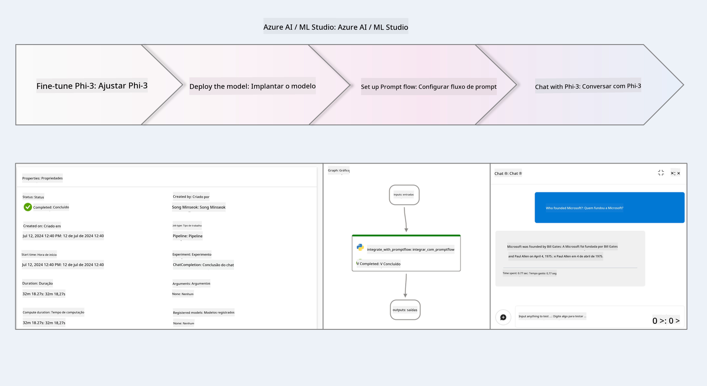

### Table of Contents

1. **[Senaryo 1: Rêxistinên Azure amade bikin û ji bo fine-tuning amadekarî bikin](../../../../../../md/02.Application/01.TextAndChat/Phi3)**
    - [Workspace-a Azure Machine Learning biafirînin](../../../../../../md/02.Application/01.TextAndChat/Phi3)
    - [Quota-yên GPU di Azure Subscription de daxwaz bikin](../../../../../../md/02.Application/01.TextAndChat/Phi3)
    - [Role assignment zêde bikin](../../../../../../md/02.Application/01.TextAndChat/Phi3)
    - [Proje saz bikin](../../../../../../md/02.Application/01.TextAndChat/Phi3)
    - [Dataset ji bo fine-tuning amadekirin](../../../../../../md/02.Application/01.TextAndChat/Phi3)

1. **[Senaryo 2: Modêla Phi-3 fine-tune bikin û di Azure Machine Learning Studio de şandin](../../../../../../md/02.Application/01.TextAndChat/Phi3)**
    - [Modêla Phi-3 fine-tune bikin](../../../../../../md/02.Application/01.TextAndChat/Phi3)
    - [Modêla Phi-3 yê fine-tuned şandin](../../../../../../md/02.Application/01.TextAndChat/Phi3)

1. **[Senaryo 3: Bi Prompt flow ve tevger bikin û bi modela xwe ya taybetî li Azure AI Foundry re chat bikin](../../../../../../md/02.Application/01.TextAndChat/Phi3)**
    - [Modêla Phi-3 ya taybetî bi Prompt flow ve tevger bikin](../../../../../../md/02.Application/01.TextAndChat/Phi3)
    - [Bi modêla Phi-3 ya taybetî re chat bikin](../../../../../../md/02.Application/01.TextAndChat/Phi3)

## Senaryo 1: Rêxistinên Azure amade bikin û ji bo fine-tuning amadekarî bikin

### Workspace-a Azure Machine Learning biafirînin

1. Di **search bar**-ê ya ser rûpelê portalê de "azure machine learning" binivîsin û ji vebijarkan re **Azure Machine Learning** hilbijêrin.

    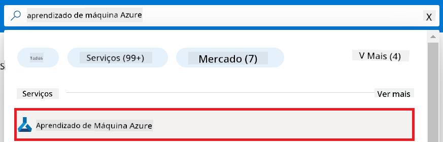

2. Ji menyûya navîn ve **+ Create** hilbijêrin.

3. Ji menyûya navîn ve **New workspace** hilbijêrin.

    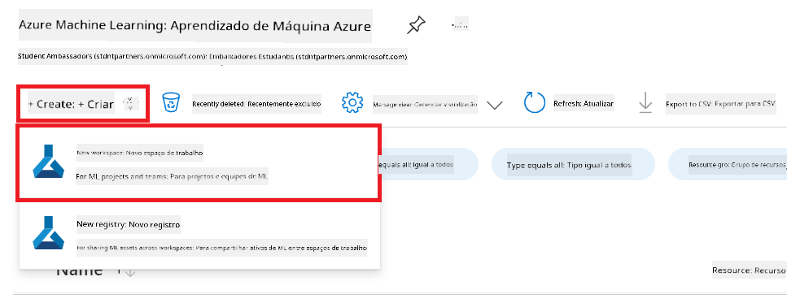

4. Karên jêrîn bikin:

    - Subscription-a Azure ya xwe hilbijêrin.
    - **Resource group**-ê ku dixwazin bikar bînin hilbijêrin (ger hewce be nû biafirînin).
    - **Workspace Name** binivîsin. Divê nirxek taybet be.
    - Herêmê (Region) ku dixwazin bikar bînin hilbijêrin.
    - **Storage account**-ê ku dixwazin bikar bînin hilbijêrin (ger hewce be nû biafirînin).
    - **Key vault**-ê ku dixwazin bikar bînin hilbijêrin (ger hewce be nû biafirînin).
    - **Application insights**-ê ku dixwazin bikar bînin hilbijêrin (ger hewce be nû biafirînin).
    - **Container registry**-ê ku dixwazin bikar bînin hilbijêrin (ger hewce be nû biafirînin).

    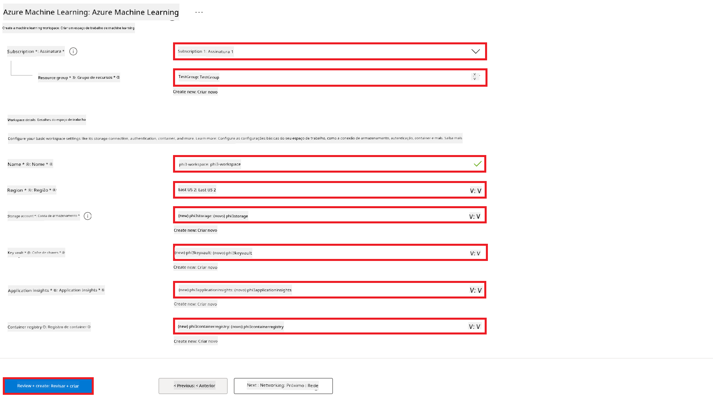

5. **Review + Create** hilbijêrin.

6. **Create** hilbijêrin.

### Di Azure Subscription de daxwaza quota-yên GPU bikin

Di vê dersê de, hûn fêr dibin ka meriv çawa modêla Phi-3 fine-tune û şandina wê bi karanîna GPU-an bike. Ji bo fine-tuning, hûn GPU-ya *Standard_NC24ads_A100_v4* bikar tînin ku daxwaza quota hewce dike. Ji bo şandinê jî, hûn GPU-ya *Standard_NC6s_v3* bikar tînin ku ew jî daxwaza quota hewce dike.

> [!NOTE]
>
> Tenê subscriptionên Pay-As-You-Go (type-ê standard ya subscriptionê) ji bo taqsimkirina GPU-ê destûr hene; subscriptionên benefit niha nayên piştgirî kirin.
>

1. Serdana [Azure ML Studio](https://ml.azure.com/home?wt.mc_id=studentamb_279723) bikin.

1. Ji bo daxwaza quota-yê ya *Standard NCADSA100v4 Family* karên jêrîn bikin:

    - Ji tabê çepê **Quota** hilbijêrin.
    - Family-ya virtual machine ku dixwazin bikar bînin hilbijêrin. Mînakî, **Standard NCADSA100v4 Family Cluster Dedicated vCPUs** hilbijêrin ku GPU-ya *Standard_NC24ads_A100_v4* tê de ye.
    - Ji menyûya navîn ve **Request quota** hilbijêrin.

        

    - Di rûpela Request quota de, **New cores limit**-ê ku dixwazin bikar bînin binivîsin. Mînakî, 24.
    - Di rûpela Request quota de, **Submit** hilbijêrin da ku daxwaza GPU quota bike.

1. Ji bo daxwaza quota-yê ya *Standard NCSv3 Family* jî karên jêrîn bikin:

    - Ji tabê çepê **Quota** hilbijêrin.
    - Family-ya virtual machine ku dixwazin bikar bînin hilbijêrin. Mînakî, **Standard NCSv3 Family Cluster Dedicated vCPUs** hilbijêrin ku GPU-ya *Standard_NC6s_v3* tê de ye.
    - Ji menyûya navîn ve **Request quota** hilbijêrin.
    - Di rûpela Request quota de, **New cores limit**-ê ku dixwazin bikar bînin binivîsin. Mînakî, 24.
    - Di rûpela Request quota de, **Submit** hilbijêrin da ku daxwaza GPU quota bike.

### Role assignment zêde bikin

Ji bo fine-tuning û şandina modêlan xwe, divê herî berî, User Assigned Managed Identity (UAI) biafirînin û destûrên pêwîst bidin wê. Ev UAI dê di dema şandinê de ji bo nasnameya xwe (authentication) bikar bîne.

#### User Assigned Managed Identity (UAI) biafirînin

1. Di **search bar**-ê ya ser rûpelê portalê de "managed identities" binivîsin û ji vebijarkan re **Managed Identities** hilbijêrin.

    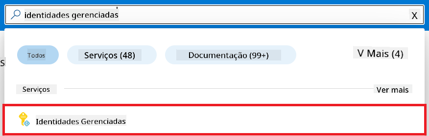

1. **+ Create** hilbijêrin.

    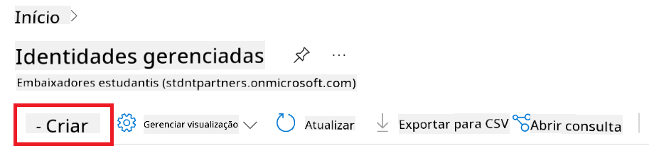

1. Karên jêrîn bikin:

    - Subscription-a Azure ya xwe hilbijêrin.
    - **Resource group**-ê ku dixwazin bikar bînin hilbijêrin (ger hewce be nû biafirînin).
    - Herêmê (Region) ku dixwazin bikar bînin hilbijêrin.
    - **Name** binivîsin. Divê nirxek taybet be.

    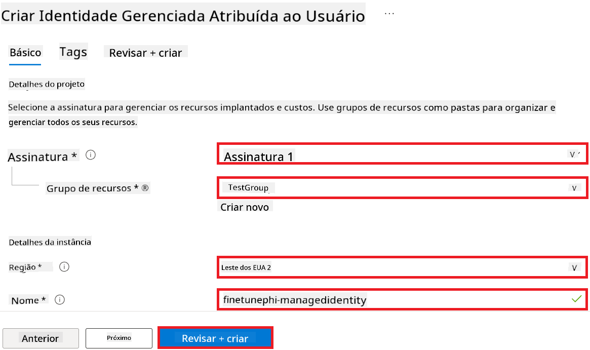

1. **Review + create** hilbijêrin.

1. **+ Create** hilbijêrin.

#### Role assignment-a Contributor bo Managed Identity zêde bikin

1. Vegere ser çavkaniya Managed Identity ya ku hûn afirandine.

1. Ji tabê çepê **Azure role assignments** hilbijêrin.

1. Ji menyûya navîn ve **+Add role assignment** hilbijêrin.

1. Di rûpela Add role assignment de, karên jêrîn bikin:
    - **Scope**-ê li ser **Resource group** danîn.
    - Subscription-a Azure ya xwe hilbijêrin.
    - **Resource group**-ê ku dixwazin bikar bînin hilbijêrin.
    - Role-ê **Contributor** hilbijêrin.

    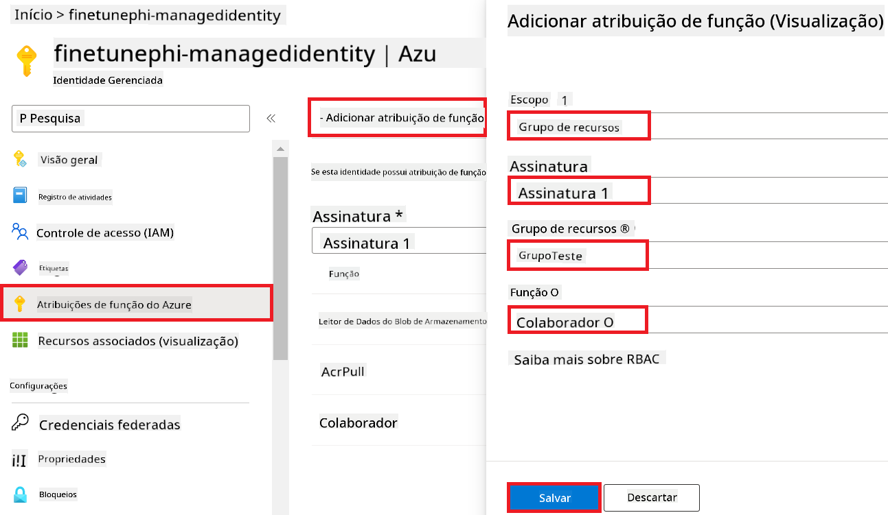

2. **Save** hilbijêrin.

#### Role assignment-a Storage Blob Data Reader bo Managed Identity zêde bikin

1. Di **search bar**-ê ya ser rûpelê portalê de "storage accounts" binivîsin û ji vebijarkan re **Storage accounts** hilbijêrin.

    

1. Hesabê storage-ê ku bi workspace-a Azure Machine Learning ve girêdayî ye hilbijêrin. Mînakî, *finetunephistorage*.

1. Karên jêrîn bikin da ku rûpela Add role assignment-ê bigihîjin:

    - Vegere ser Azure Storage account-ê ku hûn afirandine.
    - Ji tabê çepê **Access Control (IAM)** hilbijêrin.
    - Ji menyûya navîn ve **+ Add** hilbijêrin.
    - Ji menyûya navîn ve **Add role assignment** hilbijêrin.

    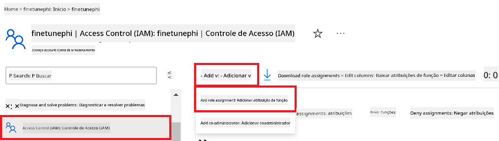

1. Di rûpela Add role assignment de, karên jêrîn bikin:

    - Di rûpela Role de, "Storage Blob Data Reader" di **search bar**-ê de binivîsin û ji vebijarkan re **Storage Blob Data Reader** hilbijêrin.
    - Di rûpela Role de, **Next** hilbijêrin.
    - Di rûpela Members de, **Assign access to**-ê li ser **Managed identity** danîn.
    - Di rûpela Members de, **+ Select members** hilbijêrin.
    - Di rûpela Select managed identities de, Subscription-a Azure ya xwe hilbijêrin.
    - Di rûpela Select managed identities de, **Managed identity**-ê ku dixwazin hilbijêrin (Manage Identity).
    - Di rûpela Select managed identities de, Manage Identity ya ku hûn afirandine hilbijêrin. Mînakî, *finetunephi-managedidentity*.
    - Di rûpela Select managed identities de, **Select** hilbijêrin.

    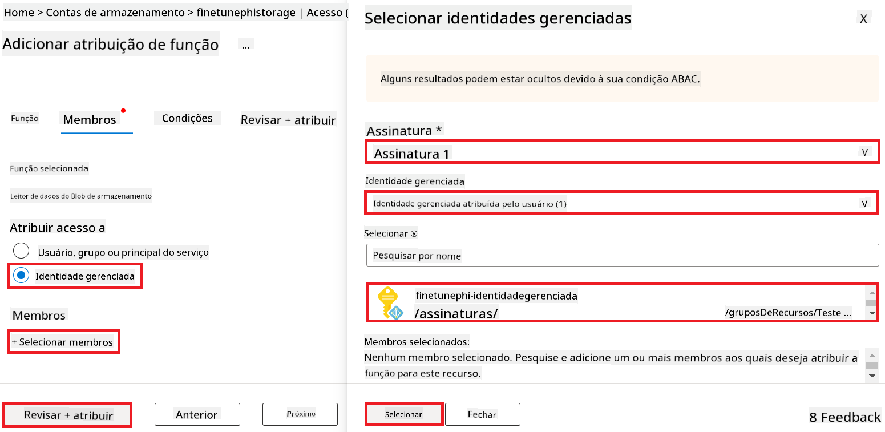

1. **Review + assign** hilbijêrin.

#### Role assignment-a AcrPull bo Managed Identity zêde bikin

1. Di **search bar**-ê ya ser rûpelê portalê de "container registries" binivîsin û ji vebijarkan re **Container registries** hilbijêrin.

    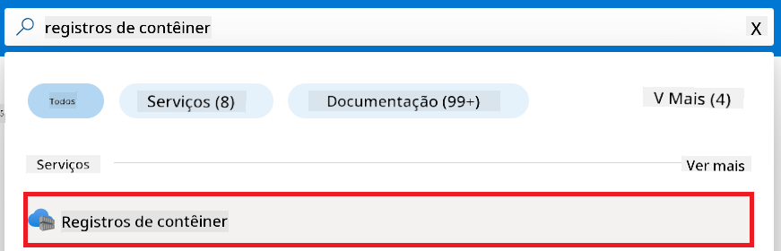

1. Container registry ya ku bi workspace-a Azure Machine Learning ve girêdayî ye hilbijêrin. Mînakî, *finetunephicontainerregistry*.

1. Karên jêrîn bikin da ku rûpela Add role assignment-ê bigihîjin:

    - Ji tabê çepê **Access Control (IAM)** hilbijêrin.
    - Ji menyûya navîn ve **+ Add** hilbijêrin.
    - Ji menyûya navîn ve **Add role assignment** hilbijêrin.

1. Di rûpela Add role assignment de, karên jêrîn bikin:

    - Di rûpela Role de, "AcrPull" di **search bar**-ê de binivîsin û ji vebijarkan re **AcrPull** hilbijêrin.
    - Di rûpela Role de, **Next** hilbijêrin.
    - Di rûpela Members de, **Assign access to**-ê li ser **Managed identity** danîn.
    - Di rûpela Members de, **+ Select members** hilbijêrin.
    - Di rûpela Select managed identities de, Subscription-a Azure ya xwe hilbijêrin.
    - Di rûpela Select managed identities de, **Managed identity**-ê ku dixwazin hilbijêrin (Manage Identity).
    - Di rûpela Select managed identities de, Manage Identity ya ku hûn afirandine hilbijêrin. Mînakî, *finetunephi-managedidentity*.
    - Di rûpela Select managed identities de, **Select** hilbijêrin.
    - **Review + assign** hilbijêrin.

### Proje saz bikin

Ji bo dakêşandina datasetên pêwîst ji bo fine-tuning, hûn ê cîhê lokalî amade bikin.

Di vê çalakîyê de, hûn ê:

- Pelgehêk biafirînin da ku di nav wê de xebitîn.
- Cîhê virtual environment-ê biafirînin.
- Pakêtên pêwîst saz bikin.
- Pelê *download_dataset.py* biafirînin da ku dataset dakêşîne.

#### Pelgehêk biafirînin da ku di nav wê de xebitîn

1. Pencereya terminalê vekin û fermana jêrîn binivîsin da ku pelgehêk bi navê *finetune-phi* di rêza bingehîn de biafirînin.

    ```console
    mkdir finetune-phi
    ```

2. Di terminalê xwe de fermanê jêrîn binivîsin da ku vegerin pelgehê *finetune-phi* ya ku afirandine.

    ```console
    cd finetune-phi
    ```

#### Virtual environment biafirînin

1. Di terminalê xwe de fermanê jêrîn binivîsin da ku virtual environment-êk bi navê *.venv* biafirînin.

    ```console
    python -m venv .venv
    ```

2. Di terminalê xwe de fermanê jêrîn binivîsin da ku virtual environment-ê aktiv bikin.

    ```console
    .venv\Scripts\activate.bat
    ```

> [!NOTE]
> Ger çalak bû, divê hûn *(.venv)* berî prompt-a fermana xwe bibînin.

#### Pakêtên pêwîst saz bikin

1. Di terminalê xwe de fermanên jêrîn binivîsin da ku pakêtên pêwîst saz bikin.

    ```console
    pip install datasets==2.19.1
    ```

#### Pelê `download_dataset.py` biafirînin

> [!NOTE]
> Struktura pelgehê ya temam:
>
> ```text
> └── YourUserName
> .    └── finetune-phi
> .        └── download_dataset.py
> ```

1. **Visual Studio Code** vekin.

1. Ji menyûya sernavê **File** hilbijêrin.

1. **Open Folder** hilbijêrin.

1. Pelgehê *finetune-phi* ya ku hûn afirandine hilbijêrin, ku li *C:\Users\yourUserName\
1. Visite [Azure ML Studio](https://ml.azure.com/home?wt.mc_id=studentamb_279723).

1. Selecione **Compute** na aba lateral esquerda.

1. Selecione **Compute clusters** no menu de navegação.

1. Selecione **+ New**.

    

1. Realize as seguintes tarefas:

    - Selecione a **Region** que deseja usar.
    - Selecione o **Virtual machine tier** para **Dedicated**.
    - Selecione o **Virtual machine type** para **GPU**.
    - Filtre o **Virtual machine size** para **Select from all options**.
    - Selecione o **Virtual machine size** para **Standard_NC24ads_A100_v4**.

    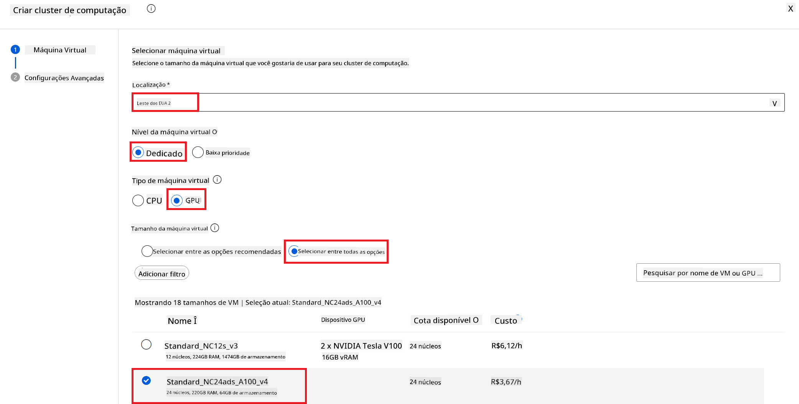

1. Selecione **Next**.

1. Realize as seguintes tarefas:

    - Insira o **Compute name**. Deve ser um valor único.
    - Defina o **Minimum number of nodes** para **0**.
    - Defina o **Maximum number of nodes** para **1**.
    - Defina o **Idle seconds before scale down** para **120**.

    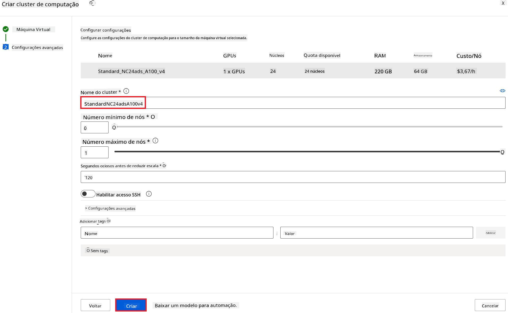

1. Selecione **Create**.

#### Ajuste fino do modelo Phi-3

1. Visite [Azure ML Studio](https://ml.azure.com/home?wt.mc_id=studentamb_279723).

1. Selecione o workspace do Azure Machine Learning que você criou.

    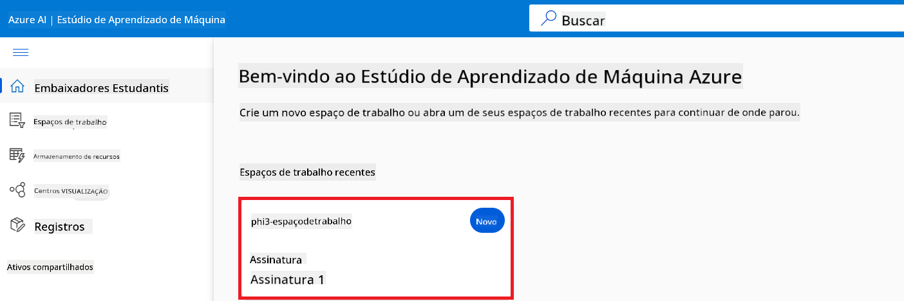

1. Realize as seguintes tarefas:

    - Selecione **Model catalog** na aba lateral esquerda.
    - Digite *phi-3-mini-4k* na **barra de busca** e selecione **Phi-3-mini-4k-instruct** nas opções que aparecerem.

    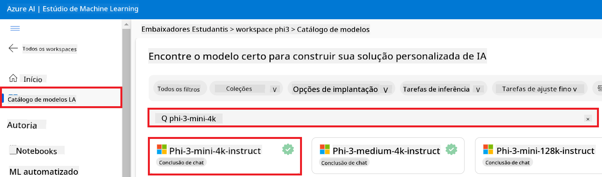

1. Selecione **Fine-tune** no menu de navegação.

    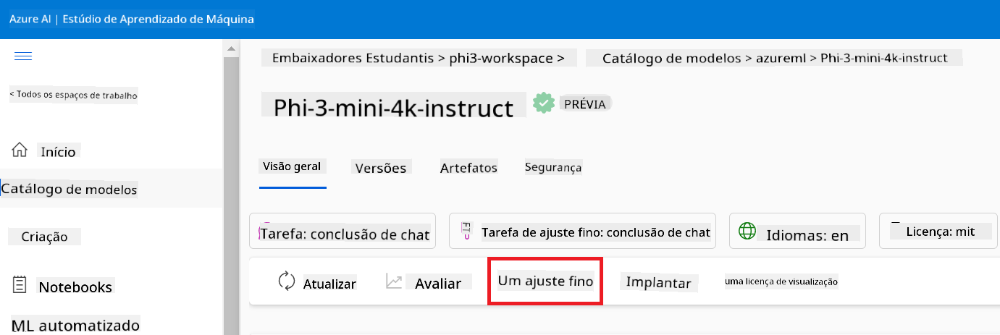

1. Realize as seguintes tarefas:

    - Selecione **Select task type** para **Chat completion**.
    - Selecione **+ Select data** para enviar os **Traning data**.
    - Selecione o tipo de upload dos dados de validação para **Provide different validation data**.
    - Selecione **+ Select data** para enviar os **Validation data**.

    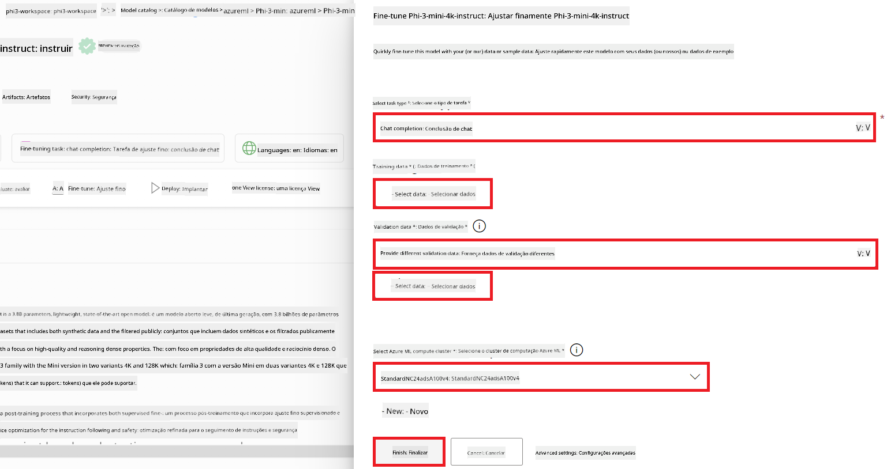

    > [!TIP]
    >
    > Você pode selecionar **Advanced settings** para personalizar configurações como **learning_rate** e **lr_scheduler_type** para otimizar o processo de fine-tuning conforme suas necessidades específicas.

1. Selecione **Finish**.

1. Neste exercício, você ajustou com sucesso o modelo Phi-3 usando o Azure Machine Learning. Note que o processo de fine-tuning pode levar um tempo considerável. Após iniciar o trabalho de fine-tuning, é necessário aguardar sua conclusão. Você pode acompanhar o status do trabalho na aba Jobs, no lado esquerdo do seu workspace Azure Machine Learning. Na próxima série, você vai implantar o modelo ajustado e integrá-lo ao Prompt flow.

    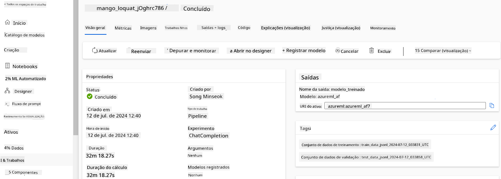

### Implemente o modelo Phi-3 ajustado

Para integrar o modelo Phi-3 ajustado ao Prompt flow, você precisa implantar o modelo para torná-lo acessível para inferência em tempo real. Esse processo envolve registrar o modelo, criar um endpoint online e implantar o modelo.

Neste exercício, você vai:

- Registrar o modelo ajustado no workspace Azure Machine Learning.
- Criar um endpoint online.
- Implantar o modelo Phi-3 ajustado registrado.

#### Registrar o modelo ajustado

1. Visite [Azure ML Studio](https://ml.azure.com/home?wt.mc_id=studentamb_279723).

1. Selecione o workspace Azure Machine Learning que você criou.

    

1. Selecione **Models** na aba lateral esquerda.
1. Selecione **+ Register**.
1. Selecione **From a job output**.

    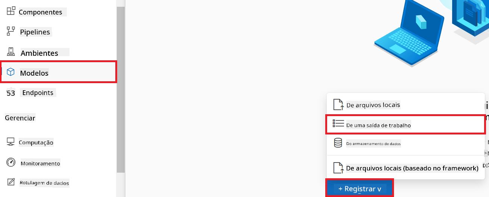

1. Selecione o job que você criou.

    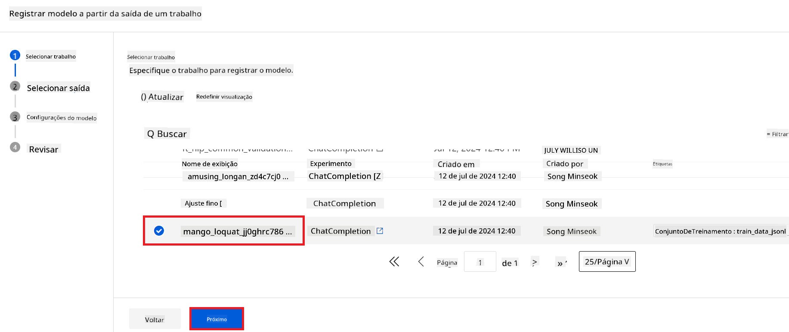

1. Selecione **Next**.

1. Selecione **Model type** para **MLflow**.

1. Certifique-se de que **Job output** está selecionado; isso deve ocorrer automaticamente.

    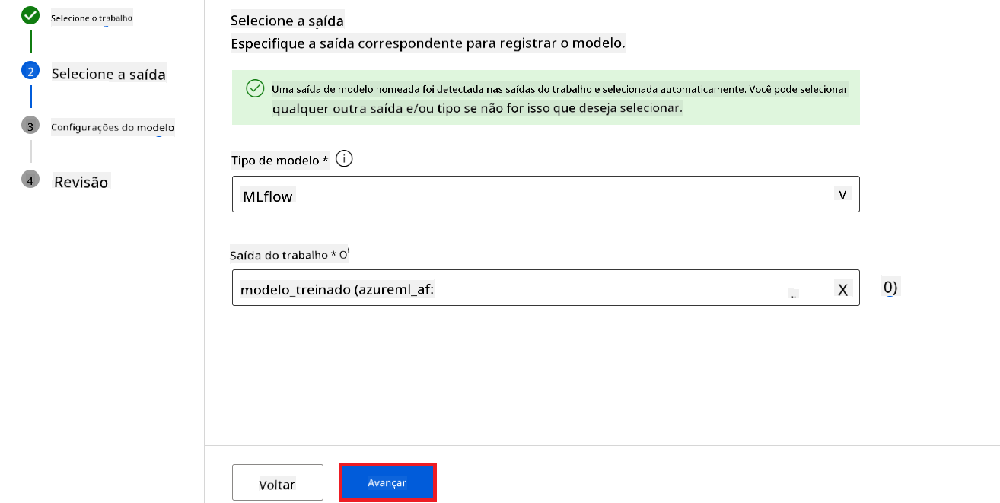

2. Selecione **Next**.

3. Selecione **Register**.

    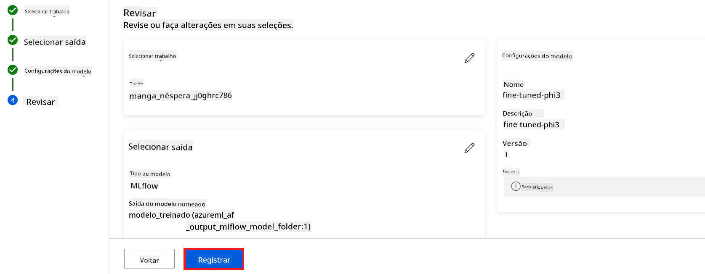

4. Você pode visualizar seu modelo registrado navegando até o menu **Models** na aba lateral esquerda.

    

#### Implemente o modelo ajustado

1. Navegue até o workspace Azure Machine Learning que você criou.

1. Selecione **Endpoints** na aba lateral esquerda.

1. Selecione **Real-time endpoints** no menu de navegação.

    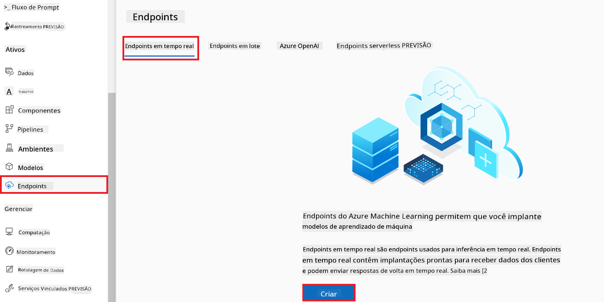

1. Selecione **Create**.

1. Selecione o modelo registrado que você criou.

    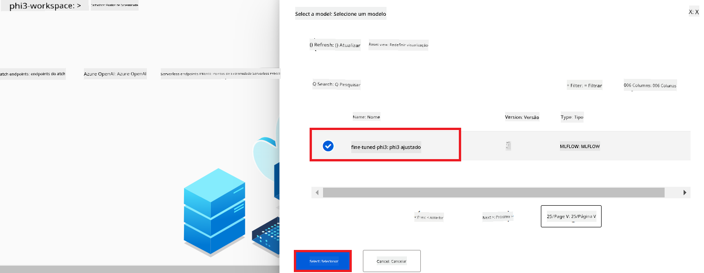

1. Selecione **Select**.

1. Realize as seguintes tarefas:

    - Selecione **Virtual machine** para *Standard_NC6s_v3*.
    - Defina o **Instance count** que deseja usar. Por exemplo, *1*.
    - Selecione o **Endpoint** para **New** para criar um endpoint.
    - Insira o **Endpoint name**. Deve ser um valor único.
    - Insira o **Deployment name**. Deve ser um valor único.

    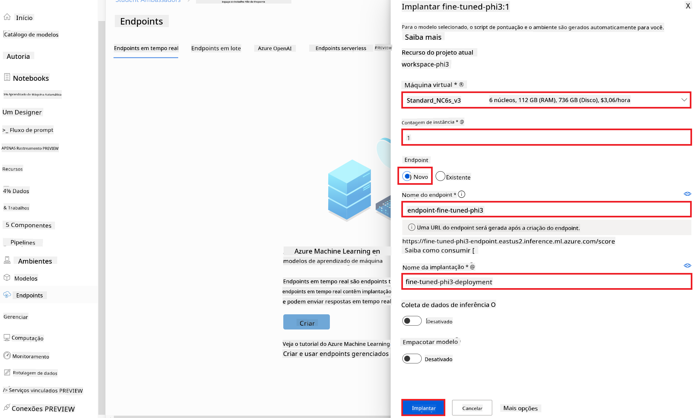

1. Selecione **Deploy**.

> [!WARNING]
> Para evitar cobranças adicionais em sua conta, certifique-se de excluir o endpoint criado no workspace Azure Machine Learning.
>

#### Verifique o status da implantação no Azure Machine Learning Workspace

1. Navegue até o workspace Azure Machine Learning que você criou.

1. Selecione **Endpoints** na aba lateral esquerda.

1. Selecione o endpoint que você criou.

    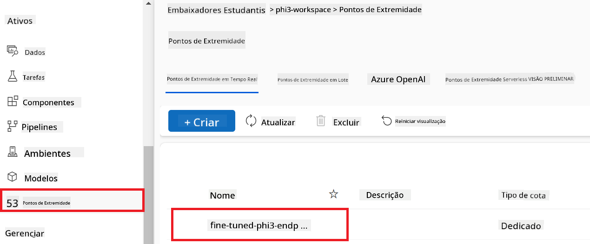

1. Nesta página, você pode gerenciar os endpoints durante o processo de implantação.

> [!NOTE]
> Assim que a implantação for concluída, certifique-se de que o **Live traffic** esteja definido para **100%**. Se não estiver, selecione **Update traffic** para ajustar as configurações de tráfego. Note que não é possível testar o modelo se o tráfego estiver configurado para 0%.
>
> 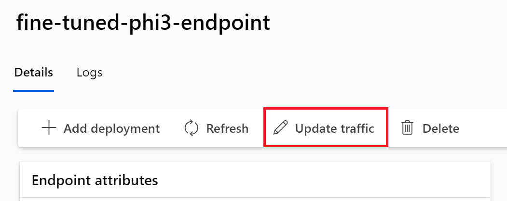
>

## Cenário 3: Integre com Prompt flow e converse com seu modelo personalizado no Azure AI Foundry

### Integre o modelo Phi-3 personalizado com Prompt flow

Após implantar com sucesso seu modelo ajustado, agora você pode integrá-lo ao Prompt Flow para usar seu modelo em aplicações em tempo real, possibilitando diversas tarefas interativas com seu modelo Phi-3 personalizado.

Neste exercício, você vai:

- Criar o Azure AI Foundry Hub.
- Criar um projeto no Azure AI Foundry.
- Criar um Prompt flow.
- Adicionar uma conexão personalizada para o modelo Phi-3 ajustado.
- Configurar o Prompt flow para conversar com seu modelo Phi-3 personalizado.

> [!NOTE]
> Você também pode integrar com Promptflow usando o Azure ML Studio. O mesmo processo de integração pode ser aplicado ao Azure ML Studio.

#### Crie o Azure AI Foundry Hub

Você precisa criar um Hub antes de criar o projeto. O Hub funciona como um Grupo de Recursos, permitindo organizar e gerenciar múltiplos projetos dentro do Azure AI Foundry.

1. Visite [Azure AI Foundry](https://ai.azure.com/?WT.mc_id=aiml-137032-kinfeylo).

1. Selecione **All hubs** na aba lateral esquerda.

1. Selecione **+ New hub** no menu de navegação.

    

1. Realize as seguintes tarefas:

    - Insira o **Hub name**. Deve ser um valor único.
    - Selecione sua **Subscription** do Azure.
    - Selecione o **Resource group** a ser usado (crie um novo se necessário).
    - Selecione a **Location** que deseja usar.
    - Selecione **Connect Azure AI Services** para usar (crie um novo se necessário).
    - Selecione **Connect Azure AI Search** para **Skip connecting**.

    

1. Selecione **Next**.

#### Crie um projeto no Azure AI Foundry

1. No Hub que você criou, selecione **All projects** na aba lateral esquerda.

1. Selecione **+ New project** no menu de navegação.

    

1. Insira o **Project name**. Deve ser um valor único.

    

1. Selecione **Create a project**.

#### Adicione uma conexão personalizada para o modelo Phi-3 ajustado

Para integrar seu modelo Phi-3 personalizado com o Prompt flow, você precisa salvar o endpoint e a chave do modelo em uma conexão personalizada. Essa configuração garante o acesso ao seu modelo Phi-3 personalizado no Prompt flow.

#### Configure a chave de API e a URI do endpoint do modelo Phi-3 ajustado

1. Visite [Azure ML Studio](https://ml.azure.com/home?WT.mc_id=aiml-137032-kinfeylo).

1. Navegue até o workspace Azure Machine Learning que você criou.

1. Selecione **Endpoints** na aba lateral esquerda.

    

1. Selecione o endpoint que você criou.

    

1. Selecione **Consume** no menu de navegação.

1. Copie seu **REST endpoint** e a **Primary key**.


#### Ouzhpennañ ar C'honnektadur Personelaet

1. Mont war-zu [Azure AI Foundry](https://ai.azure.com/?WT.mc_id=aiml-137032-kinfeylo).

1. Kit da'r raktres Azure AI Foundry ma'z oc'h bet krouet.

1. Er raktres ma'z oc'h bet krouet, dibab **Settings** er tabenn eus an tu kleiz.

1. Dibab **+ New connection**.

    

1. Dibab **Custom keys** er menù navigadur.

    

1. Ober ar pezh da-heul :

    - Dibab **+ Add key value pairs**.
    - Evit an anv ar c'hi, skrivañ **endpoint** ha lakaat an endpoint oc'h enporzhiet eus Azure ML Studio er c'hemennad.
    - Dibab **+ Add key value pairs** en-dro.
    - Evit an anv ar c'hi, skrivañ **key** ha lakaat ar c'hlezelec'h oc'h enporzhiet eus Azure ML Studio er c'hemennad.
    - Goude bezañ ouzhpennet ar c'hi, dibab **is secret** evit m'en em ziskouezfe ket ar c'hlezelec'h.

    

1. Dibab **Add connection**.

#### Krouiñ ur Prompt flow

Bez' ez eus bet ouzhpennet ur c'honnektadur personelaet e Azure AI Foundry. Bremañ, e roer an hentenn da grouiñ ur Prompt flow en implij gant ar poent-se. Goude-se, e vo aes ober an darempred etre ar Prompt flow ha ar c'honnektadur personelaet evit ma vo tu implijout ar model fin-tuned en ur Prompt flow.

1. Kit da'r raktres Azure AI Foundry ma'z oc'h bet krouet.

1. Dibab **Prompt flow** er tabenn eus an tu kleiz.

1. Dibab **+ Create** er menù navigadur.

    

1. Dibab **Chat flow** er menù navigadur.

    

1. Lakait anv ar **Folder name** da implijout.

    

2. Dibab **Create**.

#### Sevel ar Prompt flow evit yezhataat gant ho model Phi-3 personelaet

Ret eo enporzhiañ ar model Phi-3 fin-tuned e-barzh ur Prompt flow. Met ar Prompt flow krouet a-raok n'eo ket bet savet evit an endro-se. Dre-se, ret eo adsevel ar Prompt flow evit ma vo tu enporzhiañ ho model personelaet.

1. Er Prompt flow, ober ar pezh da-heul evit adsevel ar flow a-raok :

    - Dibab **Raw file mode**.
    - Diweredekaat an holl kod er fichier *flow.dag.yml*.
    - Ouzhpennañ ar kod da-heul en *flow.dag.yml*.

        ```yml
        inputs:
          input_data:
            type: string
            default: "Who founded Microsoft?"

        outputs:
          answer:
            type: string
            reference: ${integrate_with_promptflow.output}

        nodes:
        - name: integrate_with_promptflow
          type: python
          source:
            type: code
            path: integrate_with_promptflow.py
          inputs:
            input_data: ${inputs.input_data}
        ```

    - Dibab **Save**.

    

1. Ouzhpennañ ar kod da-heul er fichier *integrate_with_promptflow.py* evit implijout ho model Phi-3 personelaet e Prompt flow.

    ```python
    import logging
    import requests
    from promptflow import tool
    from promptflow.connections import CustomConnection

    # Logging setup
    logging.basicConfig(
        format="%(asctime)s - %(levelname)s - %(name)s - %(message)s",
        datefmt="%Y-%m-%d %H:%M:%S",
        level=logging.DEBUG
    )
    logger = logging.getLogger(__name__)

    def query_phi3_model(input_data: str, connection: CustomConnection) -> str:
        """
        Send a request to the Phi-3 model endpoint with the given input data using Custom Connection.
        """

        # "connection" is the name of the Custom Connection, "endpoint", "key" are the keys in the Custom Connection
        endpoint_url = connection.endpoint
        api_key = connection.key

        headers = {
            "Content-Type": "application/json",
            "Authorization": f"Bearer {api_key}"
        }
        data = {
            "input_data": {
                "input_string": [
                    {"role": "user", "content": input_data}
                ],
                "parameters": {
                    "temperature": 0.7,
                    "max_new_tokens": 128
                }
            }
        }
        try:
            response = requests.post(endpoint_url, json=data, headers=headers)
            response.raise_for_status()
            
            # Log the full JSON response
            logger.debug(f"Full JSON response: {response.json()}")

            result = response.json()["output"]
            logger.info("Successfully received response from Azure ML Endpoint.")
            return result
        except requests.exceptions.RequestException as e:
            logger.error(f"Error querying Azure ML Endpoint: {e}")
            raise

    @tool
    def my_python_tool(input_data: str, connection: CustomConnection) -> str:
        """
        Tool function to process input data and query the Phi-3 model.
        """
        return query_phi3_model(input_data, connection)

    ```

    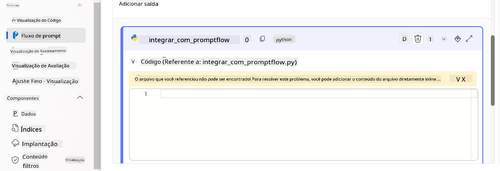

> [!NOTE]
> Evit gouzout hiroc'h diwar-benn implij ar Prompt flow e Azure AI Foundry, e c'hallit sellet ouzh [Prompt flow in Azure AI Foundry](https://learn.microsoft.com/azure/ai-studio/how-to/prompt-flow).

1. Dibab **Chat input**, **Chat output** evit gallout yezhatañ gant ho model.

    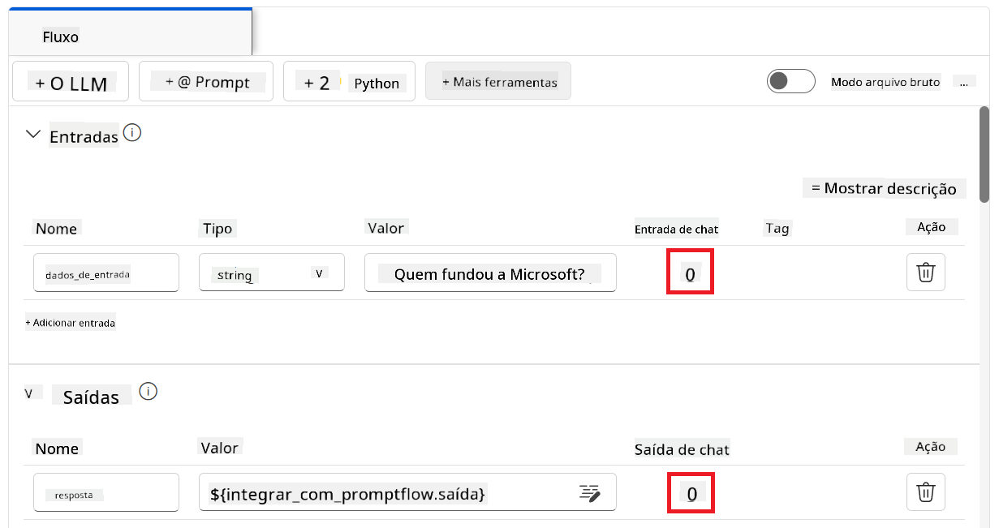

1. Bremañ ez oc'h prest da yezhatañ gant ho model Phi-3 personelaet. Er c'hinnig da-heul e vo deskrivet penaos kregiñ gant ar Prompt flow ha penaos implijout evit yezhatañ gant ho model Phi-3 fin-tuned.

> [!NOTE]
>
> Ar flow adsevel a rank bezañ evel ar skeudenn a-is :
>
> 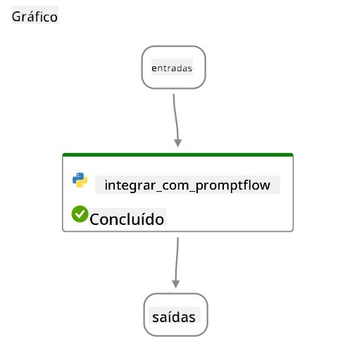
>

### Yezhatañ gant ho model Phi-3 personelaet

Bremañ ma'z oc'h bet fin-tuned ha enporzhiet ho model Phi-3 personelaet gant Prompt flow, ez oc'h prest da gentañ yezhatañ gantañ. Ar c'hinnig-se a sikour ac'hanoc'h da sevel ha kregiñ ur yezhatañ gant ho model en ur implijout Prompt flow. Dre heuliañ ar poentoù-se, e vo tu deoc'h implijout a-hed an holl dalvoudegezhioù a zo er model Phi-3 fin-tuned evit meur a draoù ha kevrinoù.

- Yezhatañ gant ho model Phi-3 personelaet en ur implijout Prompt flow.

#### Kregiñ gant Prompt flow

1. Dibab **Start compute sessions** evit kregiñ gant Prompt flow.

    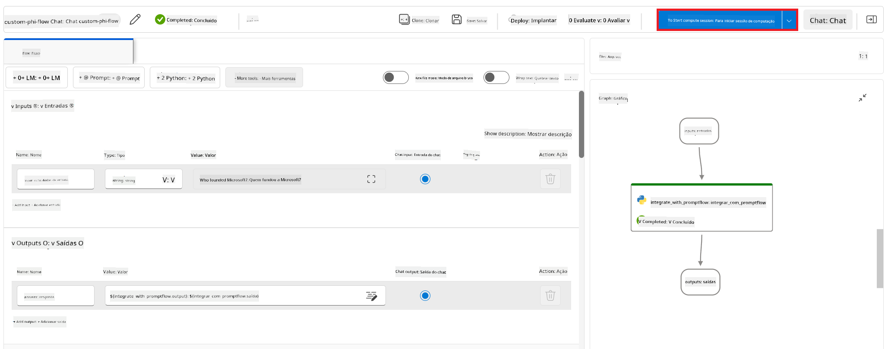

1. Dibab **Validate and parse input** evit adkavout ar parametrioù.

    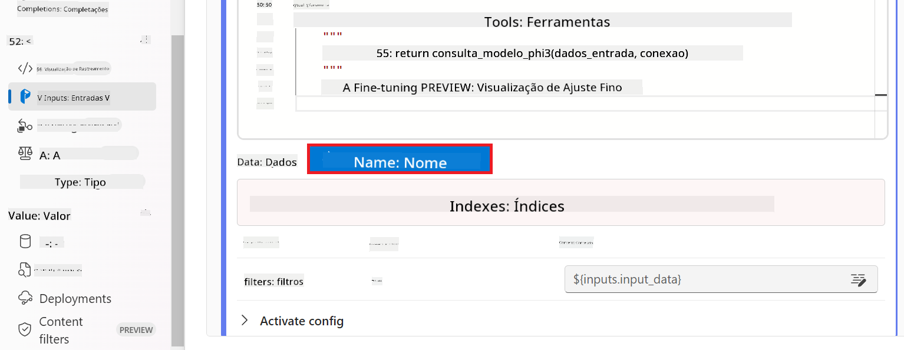

1. Dibab an **Value** eus ar **connection** da gonnan ouzh ar c'honnektadur personelaet krouet ganeoc'h. Da skouer, *connection*.

    

#### Yezhatañ gant ho model personelaet

1. Dibab **Chat**.

    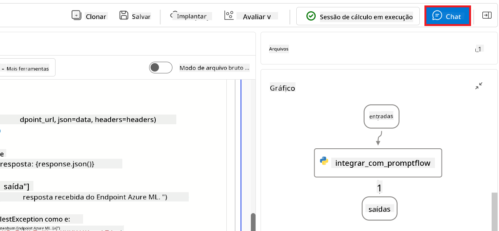

1. Setu un enklask eus ar disoc'hoù : bremañ e c'hallit yezhatañ gant ho model Phi-3 personelaet. Gwelloc'h eo gouzout goulenn goulennoù liammet ouzh an titouroù implijet evit ar fin-tuning.

    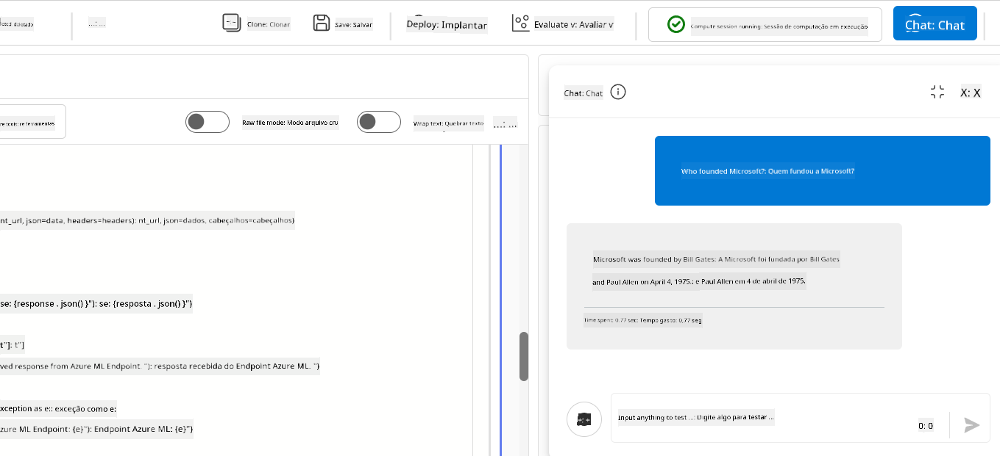

**Aviso Legal**:  
Este documento foi traduzido utilizando o serviço de tradução automática [Co-op Translator](https://github.com/Azure/co-op-translator). Embora nos esforcemos para garantir a precisão, esteja ciente de que traduções automáticas podem conter erros ou imprecisões. O documento original em seu idioma nativo deve ser considerado a fonte oficial. Para informações críticas, recomenda-se tradução profissional realizada por humanos. Não nos responsabilizamos por quaisquer mal-entendidos ou interpretações incorretas decorrentes do uso desta tradução.