<!--
CO_OP_TRANSLATOR_METADATA:
{
  "original_hash": "0df910a227098303cc392b6ad204c271",
  "translation_date": "2026-01-06T04:33:27+00:00",
  "source_file": "md/02.Application/01.TextAndChat/Phi3/E2E_Phi-3-FineTuning_PromptFlow_Integration_AIFoundry.md",
  "language_code": "br"
}
-->
# Ajustar e Integrar modelos Phi-3 personalizados com Prompt flow no Azure AI Foundry

Este exemplo de ponta a ponta (E2E) é baseado no guia "[Fine-Tune and Integrate Custom Phi-3 Models with Prompt Flow in Azure AI Foundry](https://techcommunity.microsoft.com/t5/educator-developer-blog/fine-tune-and-integrate-custom-phi-3-models-with-prompt-flow-in/ba-p/4191726?WT.mc_id=aiml-137032-kinfeylo)" da Microsoft Tech Community. Ele apresenta os processos de ajuste fino, implantação e integração de modelos Phi-3 personalizados com Prompt flow no Azure AI Foundry.  
Diferente do exemplo E2E, "[Fine-Tune and Integrate Custom Phi-3 Models with Prompt Flow](./E2E_Phi-3-FineTuning_PromptFlow_Integration.md)", que envolvia executar código localmente, este tutorial foca inteiramente no ajuste fino e integração do seu modelo dentro do Azure AI / ML Studio.

## Visão Geral

Neste exemplo E2E, você aprenderá como ajustar o modelo Phi-3 e integrá-lo com Prompt flow no Azure AI Foundry. Aproveitando o Azure AI / ML Studio, você estabelecerá um fluxo de trabalho para implantar e utilizar modelos de IA personalizados. Este exemplo E2E está dividido em três cenários:

**Cenário 1: Configurar recursos do Azure e preparar para ajuste fino**

**Cenário 2: Ajustar o modelo Phi-3 e implantar no Azure Machine Learning Studio**

**Cenário 3: Integrar com Prompt flow e conversar com seu modelo personalizado no Azure AI Foundry**

Aqui está uma visão geral deste exemplo E2E.

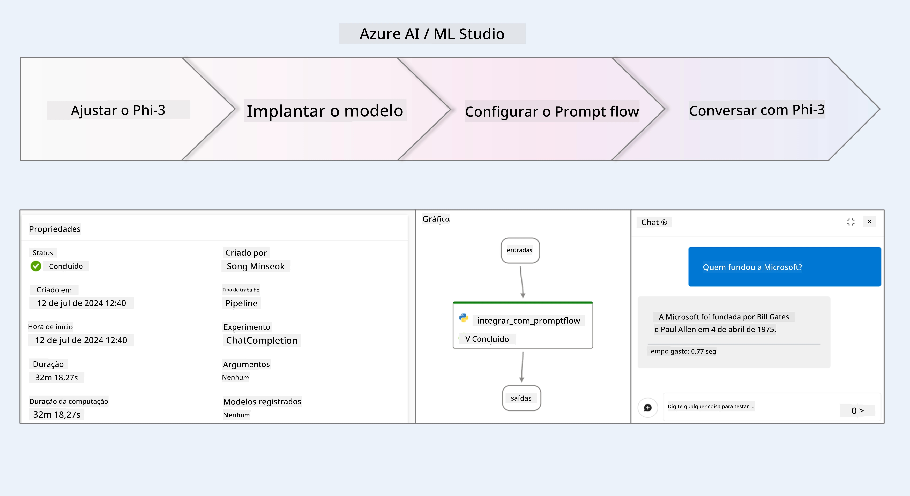

### Índice

1. **[Cenário 1: Configurar recursos do Azure e preparar para ajuste fino](../../../../../../md/02.Application/01.TextAndChat/Phi3)**
    - [Criar um Workspace do Azure Machine Learning](../../../../../../md/02.Application/01.TextAndChat/Phi3)
    - [Solicitar cotas de GPU na Assinatura Azure](../../../../../../md/02.Application/01.TextAndChat/Phi3)
    - [Adicionar atribuição de função](../../../../../../md/02.Application/01.TextAndChat/Phi3)
    - [Configurar o projeto](../../../../../../md/02.Application/01.TextAndChat/Phi3)
    - [Preparar conjunto de dados para ajuste fino](../../../../../../md/02.Application/01.TextAndChat/Phi3)

1. **[Cenário 2: Ajustar o modelo Phi-3 e implantar no Azure Machine Learning Studio](../../../../../../md/02.Application/01.TextAndChat/Phi3)**
    - [Ajustar o modelo Phi-3](../../../../../../md/02.Application/01.TextAndChat/Phi3)
    - [Implantar o modelo Phi-3 ajustado](../../../../../../md/02.Application/01.TextAndChat/Phi3)

1. **[Cenário 3: Integrar com Prompt flow e conversar com seu modelo personalizado no Azure AI Foundry](../../../../../../md/02.Application/01.TextAndChat/Phi3)**
    - [Integrar o modelo Phi-3 personalizado com Prompt flow](../../../../../../md/02.Application/01.TextAndChat/Phi3)
    - [Conversar com seu modelo Phi-3 personalizado](../../../../../../md/02.Application/01.TextAndChat/Phi3)

## Cenário 1: Configurar recursos do Azure e preparar para ajuste fino

### Criar um Workspace do Azure Machine Learning

1. Digite *azure machine learning* na **barra de pesquisa** no topo da página do portal e selecione **Azure Machine Learning** nas opções que aparecerem.

    

2. Selecione **+ Criar** no menu de navegação.

3. Selecione **Novo workspace** no menu de navegação.

    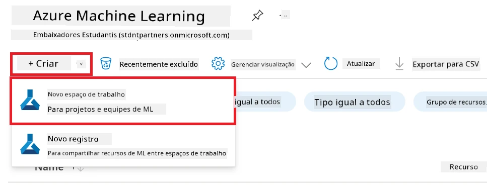

4. Execute as seguintes tarefas:

    - Selecione sua **Assinatura** do Azure.  
    - Selecione o **Grupo de recursos** a usar (crie um novo, se necessário).  
    - Insira o **Nome do Workspace**. Deve ser um valor único.  
    - Selecione a **Região** que deseja usar.  
    - Selecione a **Conta de armazenamento** a usar (crie uma nova, se necessário).  
    - Selecione o **Cofre de chaves** a usar (crie um novo, se necessário).  
    - Selecione as **Application insights** a usar (crie uma nova, se necessário).  
    - Selecione o **Registro de container** a usar (crie um novo, se necessário).  

    

5. Selecione **Revisar + criar**.

6. Selecione **Criar**.

### Solicitar cotas de GPU na Assinatura Azure

Neste tutorial, você aprenderá a ajustar e implantar um modelo Phi-3, utilizando GPUs. Para o ajuste fino, você usará a GPU *Standard_NC24ads_A100_v4*, que requer solicitação de cota. Para a implantação, você usará a GPU *Standard_NC6s_v3*, que também requer solicitação de cota.

> [!NOTE]
> 
> Somente assinaturas Pay-As-You-Go (o tipo padrão de assinatura) são elegíveis para alocação de GPU; assinaturas benefit não são suportadas atualmente.
>

1. Visite [Azure ML Studio](https://ml.azure.com/home?wt.mc_id=studentamb_279723).

1. Execute as seguintes tarefas para solicitar cota para *Standard NCADSA100v4 Family*:

    - Selecione **Quota** na aba lateral esquerda.  
    - Selecione a **família de máquinas virtuais** a usar. Por exemplo, selecione **Standard NCADSA100v4 Family Cluster Dedicated vCPUs**, que inclui a GPU *Standard_NC24ads_A100_v4*.  
    - Selecione **Solicitar cota** no menu de navegação.

        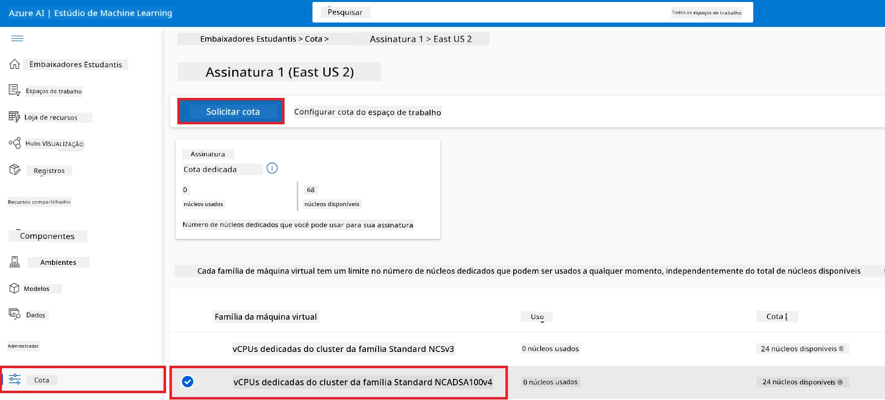

    - Na página Solicitar cota, insira o **Novo limite de núcleos** que deseja usar. Por exemplo, 24.  
    - Na página Solicitar cota, selecione **Enviar** para solicitar a cota da GPU.

1. Execute as seguintes tarefas para solicitar cota para *Standard NCSv3 Family*:

    - Selecione **Quota** na aba lateral esquerda.  
    - Selecione a **família de máquinas virtuais** a usar. Por exemplo, selecione **Standard NCSv3 Family Cluster Dedicated vCPUs**, que inclui a GPU *Standard_NC6s_v3*.  
    - Selecione **Solicitar cota** no menu de navegação.  
    - Na página Solicitar cota, insira o **Novo limite de núcleos** que deseja usar. Por exemplo, 24.  
    - Na página Solicitar cota, selecione **Enviar** para solicitar a cota da GPU.

### Adicionar atribuição de função

Para ajustar e implantar seus modelos, você deve primeiro criar uma Identidade Gerenciada Atribuída pelo Usuário (User Assigned Managed Identity - UAI) e atribuir as permissões apropriadas. Essa UAI será usada para autenticação durante a implantação.

#### Criar Identidade Gerenciada Atribuída pelo Usuário (UAI)

1. Digite *managed identities* na **barra de pesquisa** no topo da página do portal e selecione **Identidades Gerenciadas** nas opções que aparecerem.

    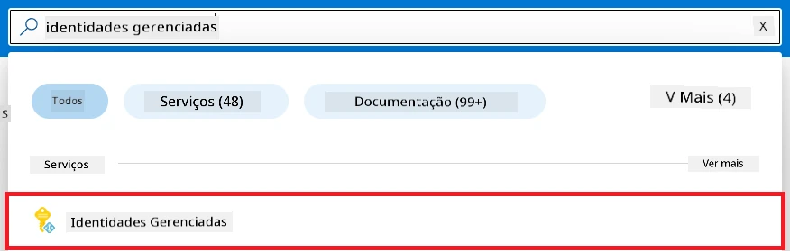

1. Selecione **+ Criar**.

    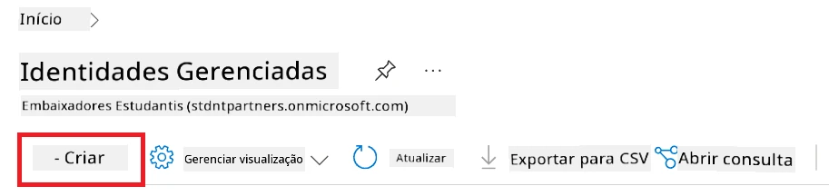

1. Execute as seguintes tarefas:

    - Selecione sua **Assinatura** do Azure.  
    - Selecione o **Grupo de recursos** a usar (crie um novo, se necessário).  
    - Selecione a **Região** que deseja usar.  
    - Insira o **Nome**. Deve ser um valor único.  

    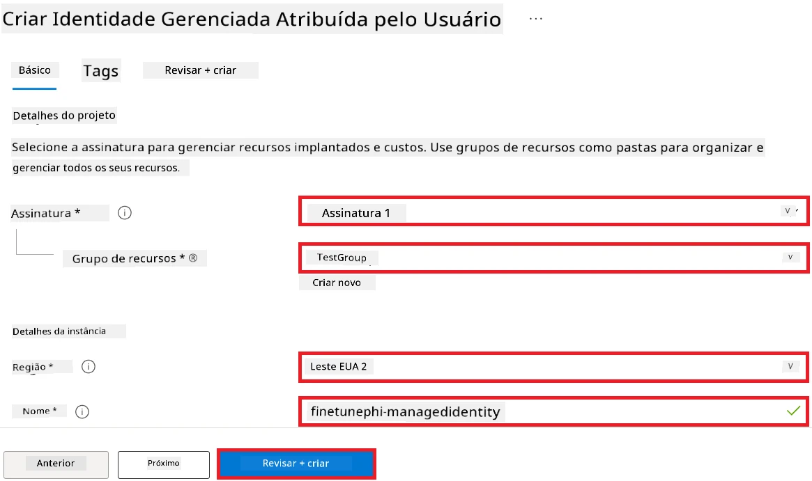

1. Selecione **Revisar + criar**.

1. Selecione **+ Criar**.

#### Adicionar atribuição de função Contribuidor à Identidade Gerenciada

1. Navegue até o recurso de Identidade Gerenciada que você criou.

1. Selecione **Atribuições de função do Azure** na aba lateral esquerda.

1. Selecione **+ Adicionar atribuição de função** no menu de navegação.

1. Na página Adicionar atribuição de função, execute as seguintes tarefas:  
    - Selecione o **Escopo** para **Grupo de recursos**.  
    - Selecione sua **Assinatura** do Azure.  
    - Selecione o **Grupo de recursos** a usar.  
    - Selecione o **Papel** para **Contribuidor**.

    

2. Selecione **Salvar**.

#### Adicionar atribuição de função Storage Blob Data Reader à Identidade Gerenciada

1. Digite *storage accounts* na **barra de pesquisa** no topo da página do portal e selecione **Contas de armazenamento** nas opções que aparecerem.

    

1. Selecione a conta de armazenamento associada ao workspace do Azure Machine Learning que você criou. Por exemplo, *finetunephistorage*.

1. Execute as seguintes tarefas para navegar até a página Adicionar atribuição de função:

    - Navegue para a conta de armazenamento do Azure que você criou.  
    - Selecione **Controle de Acesso (IAM)** na aba lateral esquerda.  
    - Selecione **+ Adicionar** no menu de navegação.  
    - Selecione **Adicionar atribuição de função** no menu de navegação.

    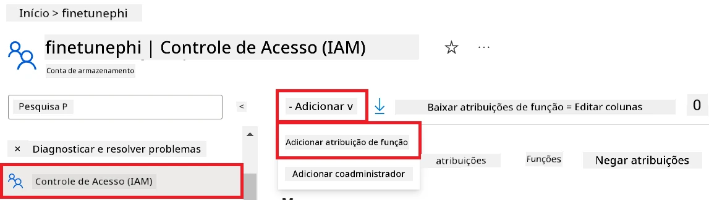

1. Na página Adicionar atribuição de função, execute as seguintes tarefas:

    - Na página Papel, digite *Storage Blob Data Reader* na **barra de pesquisa** e selecione **Storage Blob Data Reader** nas opções que aparecerem.  
    - Na página Papel, selecione **Avançar**.  
    - Na página Membros, selecione **Atribuir acesso a** **Identidade gerenciada**.  
    - Na página Membros, selecione **+ Selecionar membros**.  
    - Na página Selecionar identidades gerenciadas, selecione sua **Assinatura** do Azure.  
    - Na página Selecionar identidades gerenciadas, selecione a **Identidade gerenciada** para **Identidade Gerenciada**.  
    - Na página Selecionar identidades gerenciadas, selecione a Identidade Gerenciada que você criou. Por exemplo, *finetunephi-managedidentity*.  
    - Na página Selecionar identidades gerenciadas, selecione **Selecionar**.

    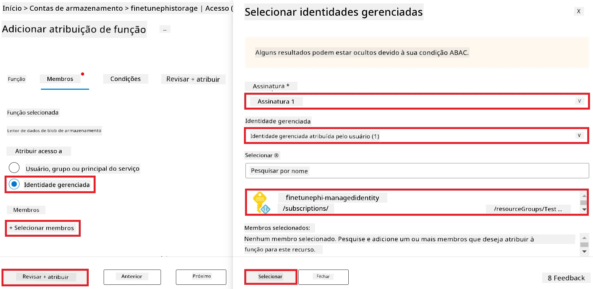

1. Selecione **Revisar + atribuir**.

#### Adicionar atribuição de função AcrPull à Identidade Gerenciada

1. Digite *container registries* na **barra de pesquisa** no topo da página do portal e selecione **Registros de container** nas opções que aparecerem.

    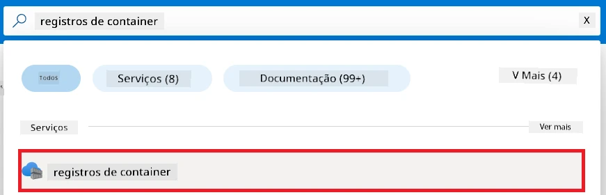

1. Selecione o registro de container associado ao workspace do Azure Machine Learning. Por exemplo, *finetunephicontainerregistry*

1. Execute as seguintes tarefas para navegar até a página Adicionar atribuição de função:

    - Selecione **Controle de Acesso (IAM)** na aba lateral esquerda.  
    - Selecione **+ Adicionar** no menu de navegação.  
    - Selecione **Adicionar atribuição de função** no menu de navegação.  

1. Na página Adicionar atribuição de função, execute as seguintes tarefas:

    - Na página Papel, digite *AcrPull* na **barra de pesquisa** e selecione **AcrPull** nas opções que aparecerem.  
    - Na página Papel, selecione **Avançar**.  
    - Na página Membros, selecione **Atribuir acesso a** **Identidade gerenciada**.  
    - Na página Membros, selecione **+ Selecionar membros**.  
    - Na página Selecionar identidades gerenciadas, selecione sua **Assinatura** do Azure.  
    - Na página Selecionar identidades gerenciadas, selecione a **Identidade gerenciada** para **Identidade Gerenciada**.  
    - Na página Selecionar identidades gerenciadas, selecione a Identidade Gerenciada que você criou. Por exemplo, *finetunephi-managedidentity*.  
    - Na página Selecionar identidades gerenciadas, selecione **Selecionar**.  
    - Selecione **Revisar + atribuir**.

### Configurar o projeto

Para baixar os conjuntos de dados necessários para o ajuste fino, você configurará um ambiente local.

Neste exercício, você irá

- Criar uma pasta para trabalhar dentro dela.  
- Criar um ambiente virtual.  
- Instalar os pacotes necessários.  
- Criar um arquivo *download_dataset.py* para baixar o conjunto de dados.

#### Criar uma pasta para trabalhar dentro dela

1. Abra uma janela de terminal e digite o seguinte comando para criar uma pasta chamada *finetune-phi* no caminho padrão.

    ```console
    mkdir finetune-phi
    ```

2. Digite o seguinte comando dentro do seu terminal para navegar até a pasta *finetune-phi* que você criou.

    ```console
    cd finetune-phi
    ```

#### Crie um ambiente virtual

1. Digite o seguinte comando dentro do seu terminal para criar um ambiente virtual chamado *.venv*.

    ```console
    python -m venv .venv
    ```

2. Digite o seguinte comando dentro do seu terminal para ativar o ambiente virtual.

    ```console
    .venv\Scripts\activate.bat
    ```

> [!NOTE]
> Se funcionou, você deve ver *(.venv)* antes do prompt de comando.

#### Instale os pacotes necessários

1. Digite os seguintes comandos dentro do seu terminal para instalar os pacotes necessários.

    ```console
    pip install datasets==2.19.1
    ```

#### Crie `donload_dataset.py`

> [!NOTE]
> Estrutura completa da pasta:
>
> ```text
> └── YourUserName
> .    └── finetune-phi
> .        └── download_dataset.py
> ```

1. Abra o **Visual Studio Code**.

1. Selecione **Arquivo** na barra de menu.

1. Selecione **Abrir Pasta**.

1. Selecione a pasta *finetune-phi* que você criou, localizada em *C:\Users\yourUserName\finetune-phi*.

    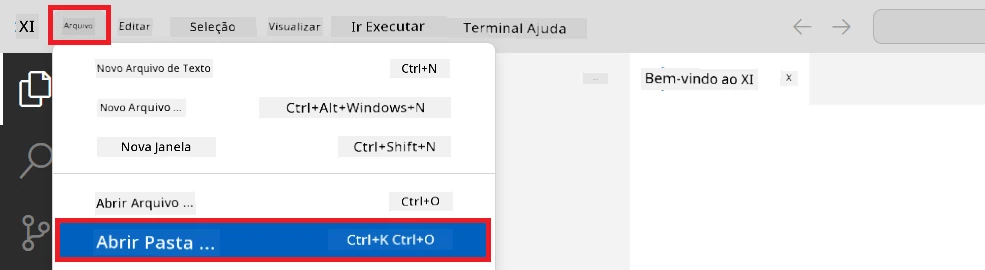

1. No painel esquerdo do Visual Studio Code, clique com o botão direito e selecione **Novo Arquivo** para criar um novo arquivo chamado *download_dataset.py*.

    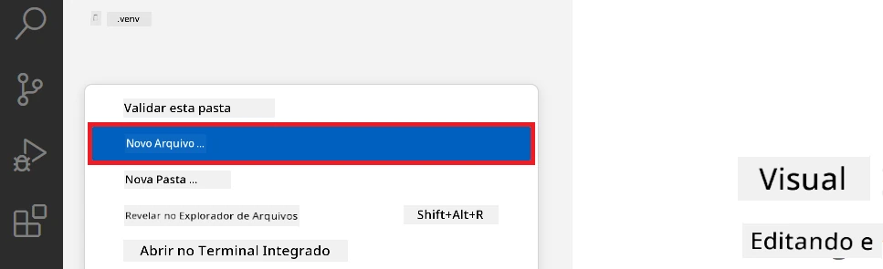

### Prepare o conjunto de dados para fine-tuning

Neste exercício, você irá executar o arquivo *download_dataset.py* para baixar os conjuntos de dados *ultrachat_200k* para o seu ambiente local. Você usará então esses conjuntos de dados para afinar o modelo Phi-3 no Azure Machine Learning.

Neste exercício, você irá:

- Adicionar código ao arquivo *download_dataset.py* para baixar os conjuntos de dados.
- Executar o arquivo *download_dataset.py* para baixar os conjuntos de dados para o seu ambiente local.

#### Baixe seu conjunto de dados usando *download_dataset.py*

1. Abra o arquivo *download_dataset.py* no Visual Studio Code.

1. Adicione o seguinte código no arquivo *download_dataset.py*.

    ```python
    import json
    import os
    from datasets import load_dataset

    def load_and_split_dataset(dataset_name, config_name, split_ratio):
        """
        Load and split a dataset.
        """
        # Carregue o conjunto de dados com o nome, configuração e proporção de divisão especificados
        dataset = load_dataset(dataset_name, config_name, split=split_ratio)
        print(f"Original dataset size: {len(dataset)}")
        
        # Divida o conjunto de dados em conjuntos de treino e teste (80% treino, 20% teste)
        split_dataset = dataset.train_test_split(test_size=0.2)
        print(f"Train dataset size: {len(split_dataset['train'])}")
        print(f"Test dataset size: {len(split_dataset['test'])}")
        
        return split_dataset

    def save_dataset_to_jsonl(dataset, filepath):
        """
        Save a dataset to a JSONL file.
        """
        # Crie o diretório se ele não existir
        os.makedirs(os.path.dirname(filepath), exist_ok=True)
        
        # Abra o arquivo no modo de escrita
        with open(filepath, 'w', encoding='utf-8') as f:
            # Itere sobre cada registro no conjunto de dados
            for record in dataset:
                # Descarregue o registro como um objeto JSON e escreva no arquivo
                json.dump(record, f)
                # Escreva um caractere de nova linha para separar os registros
                f.write('\n')
        
        print(f"Dataset saved to {filepath}")

    def main():
        """
        Main function to load, split, and save the dataset.
        """
        # Carregue e divida o conjunto de dados ULTRACHAT_200k com uma configuração e proporção de divisão específicas
        dataset = load_and_split_dataset("HuggingFaceH4/ultrachat_200k", 'default', 'train_sft[:1%]')
        
        # Extraia os conjuntos de dados de treino e teste da divisão
        train_dataset = dataset['train']
        test_dataset = dataset['test']

        # Salve o conjunto de dados de treino em um arquivo JSONL
        save_dataset_to_jsonl(train_dataset, "data/train_data.jsonl")
        
        # Salve o conjunto de dados de teste em um arquivo JSONL separado
        save_dataset_to_jsonl(test_dataset, "data/test_data.jsonl")

    if __name__ == "__main__":
        main()

    ```

1. Digite o seguinte comando dentro do seu terminal para executar o script e baixar o conjunto de dados para o seu ambiente local.

    ```console
    python download_dataset.py
    ```

1. Verifique se os conjuntos de dados foram salvos com sucesso no diretório local *finetune-phi/data*.

> [!NOTE]
>
> #### Nota sobre o tamanho do conjunto de dados e o tempo de fine-tuning
>
> Neste tutorial, você usa apenas 1% do conjunto de dados (`split='train[:1%]'`). Isso reduz significativamente a quantidade de dados, acelerando tanto o upload quanto o processo de fine-tuning. Você pode ajustar a porcentagem para encontrar o equilíbrio certo entre o tempo de treinamento e o desempenho do modelo. Usar um subconjunto menor do conjunto de dados diminui o tempo necessário para o fine-tuning, tornando o processo mais gerenciável para um tutorial.

## Cenário 2: Afinar o modelo Phi-3 e implantar no Azure Machine Learning Studio

### Afinar o modelo Phi-3

Neste exercício, você irá afinar o modelo Phi-3 no Azure Machine Learning Studio.

Neste exercício, você irá:

- Criar um cluster de computação para o fine-tuning.
- Afinar o modelo Phi-3 no Azure Machine Learning Studio.

#### Crie um cluster de computação para fine-tuning

1. Visite [Azure ML Studio](https://ml.azure.com/home?wt.mc_id=studentamb_279723).

1. Selecione **Computação** na aba do lado esquerdo.

1. Selecione **Clusters de computação** no menu de navegação.

1. Selecione **+ Novo**.

    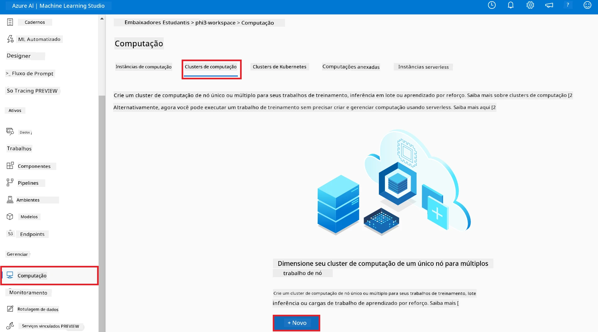

1. Realize as seguintes tarefas:

    - Selecione a **Região** que deseja utilizar.
    - Selecione o **Nível da máquina virtual** para **Dedicado**.
    - Selecione o **Tipo de máquina virtual** para **GPU**.
    - Selecione o filtro **Tamanho da máquina virtual** para **Selecionar entre todas as opções**.
    - Selecione o **Tamanho da máquina virtual** para **Standard_NC24ads_A100_v4**.

    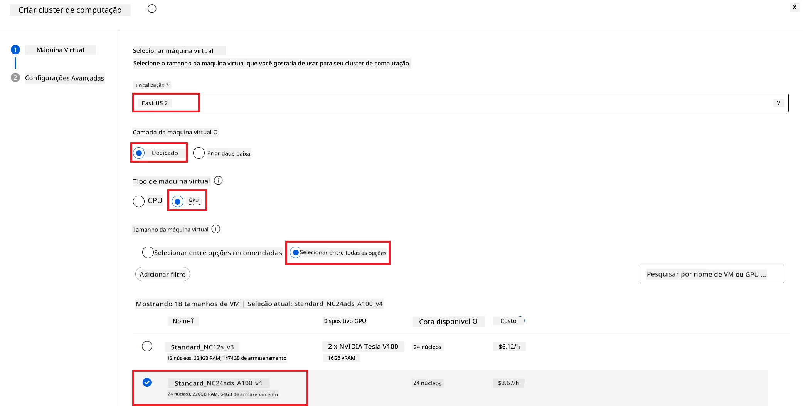

1. Selecione **Avançar**.

1. Realize as seguintes tarefas:

    - Insira o **Nome do cluster**. Deve ser um valor único.
    - Selecione o **Número mínimo de nós** para **0**.
    - Selecione o **Número máximo de nós** para **1**.
    - Selecione o tempo de inatividade antes da redução para **120** segundos.

    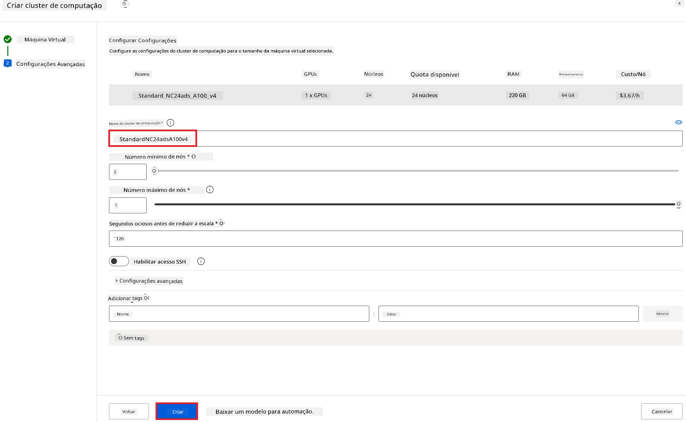

1. Selecione **Criar**.

#### Afinar o modelo Phi-3

1. Visite [Azure ML Studio](https://ml.azure.com/home?wt.mc_id=studentamb_279723).

1. Selecione o workspace Azure Machine Learning que você criou.

    

1. Realize as seguintes tarefas:

    - Selecione **Catálogo de modelos** na aba do lado esquerdo.
    - Digite *phi-3-mini-4k* na **barra de pesquisa** e selecione **Phi-3-mini-4k-instruct** nas opções que aparecerem.

    

1. Selecione **Afinar** no menu de navegação.

    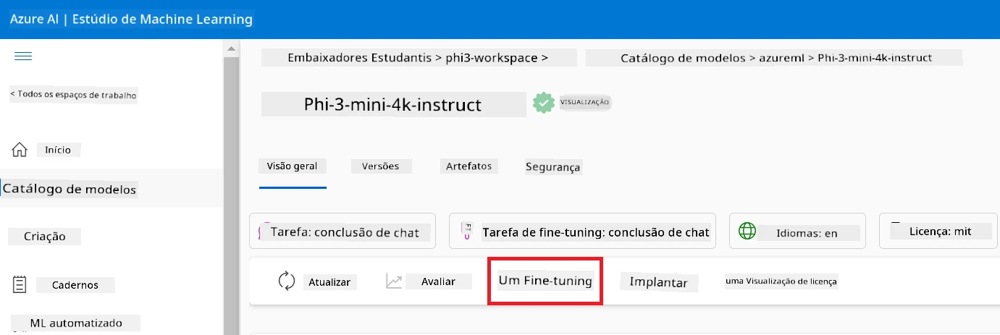

1. Realize as seguintes tarefas:

    - Selecione **Tipo de tarefa** para **Chat completion**.
    - Selecione **+ Selecionar dados** para enviar os **Dados de Treinamento**.
    - Selecione o tipo de upload dos dados de validação para **Fornecer dados de validação diferentes**.
    - Selecione **+ Selecionar dados** para enviar os **Dados de Validação**.

    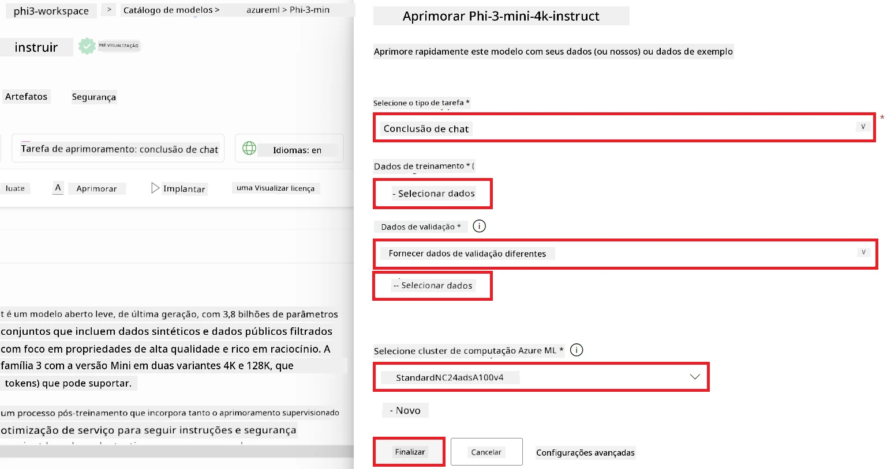

> [!TIP]
>
> Você pode selecionar **Configurações avançadas** para customizar configurações como **learning_rate** e **lr_scheduler_type** para otimizar o processo de fine-tuning de acordo com suas necessidades específicas.

1. Selecione **Finalizar**.

1. Neste exercício, você afinou com sucesso o modelo Phi-3 usando o Azure Machine Learning. Note que o processo de fine-tuning pode levar um tempo considerável. Após iniciar o trabalho de fine-tuning, você precisará aguardar sua conclusão. Você pode monitorar o status do trabalho de fine-tuning navegando até a aba Jobs no lado esquerdo do seu Workspace Azure Machine Learning. Na próxima série, você implantará o modelo afinado e integrará com o Prompt Flow.

    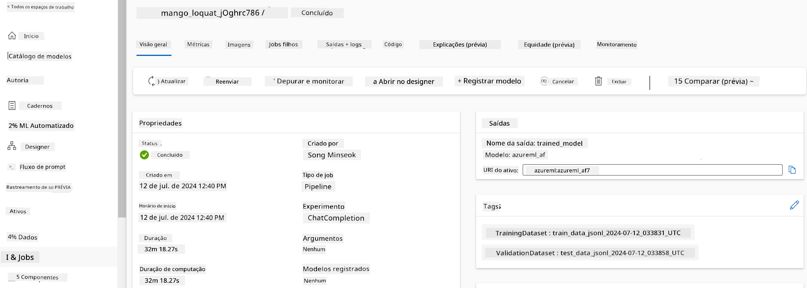

### Implante o modelo Phi-3 afinado

Para integrar o modelo Phi-3 afinado com o Prompt flow, você precisa implantar o modelo para torná-lo acessível para inferência em tempo real. Esse processo envolve registrar o modelo, criar um endpoint online e implantar o modelo.

Neste exercício, você irá:

- Registrar o modelo afinado no workspace Azure Machine Learning.
- Criar um endpoint online.
- Implantar o modelo Phi-3 afinado registrado.

#### Registre o modelo afinado

1. Visite [Azure ML Studio](https://ml.azure.com/home?wt.mc_id=studentamb_279723).

1. Selecione o workspace Azure Machine Learning que você criou.

    

1. Selecione **Modelos** na aba do lado esquerdo.
1. Selecione **+ Registrar**.
1. Selecione **A partir de uma saída de job**.

    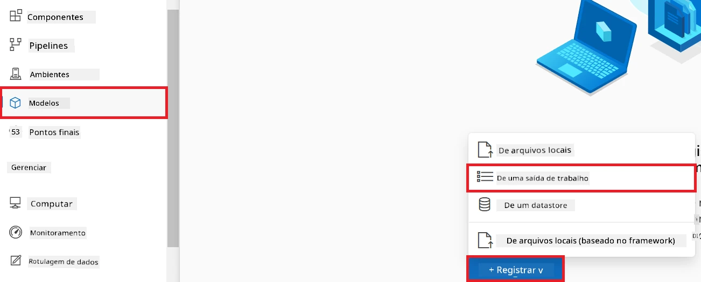

1. Selecione o job que você criou.

    

1. Selecione **Avançar**.

1. Selecione **Tipo de modelo** para **MLflow**.

1. Certifique-se de que **Saída do job** está selecionada; isso deve acontecer automaticamente.

    

2. Selecione **Avançar**.

3. Selecione **Registrar**.

    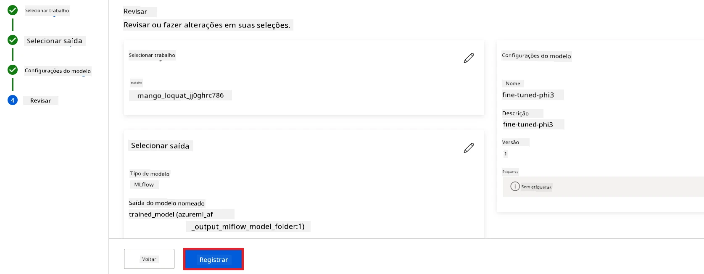

4. Você pode visualizar seu modelo registrado navegando até o menu **Modelos** na aba do lado esquerdo.

    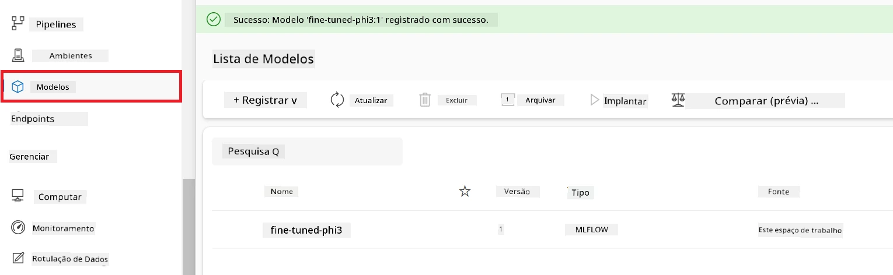

#### Implemente o modelo afinado

1. Navegue até o workspace Azure Machine Learning que você criou.

1. Selecione **Endpoints** na aba do lado esquerdo.

1. Selecione **Endpoints em tempo real** no menu de navegação.

    

1. Selecione **Criar**.

1. selecione o modelo registrado que você criou.

    

1. Selecione **Selecionar**.

1. Realize as seguintes tarefas:

    - Selecione **Máquina virtual** para *Standard_NC6s_v3*.
    - Selecione o **Número de instâncias** que você deseja usar. Por exemplo, *1*.
    - Selecione o **Endpoint** para **Novo** para criar um endpoint.
    - Insira o **Nome do endpoint**. Deve ser um valor único.
    - Insira o **Nome da implantação**. Deve ser um valor único.

    

1. Selecione **Implantar**.

> [!WARNING]
> Para evitar cobranças adicionais em sua conta, certifique-se de deletar o endpoint criado no workspace Azure Machine Learning.
>

#### Verifique o status da implantação no Azure Machine Learning Workspace

1. Navegue até o workspace Azure Machine Learning que você criou.

1. Selecione **Endpoints** na aba do lado esquerdo.

1. Selecione o endpoint que você criou.

    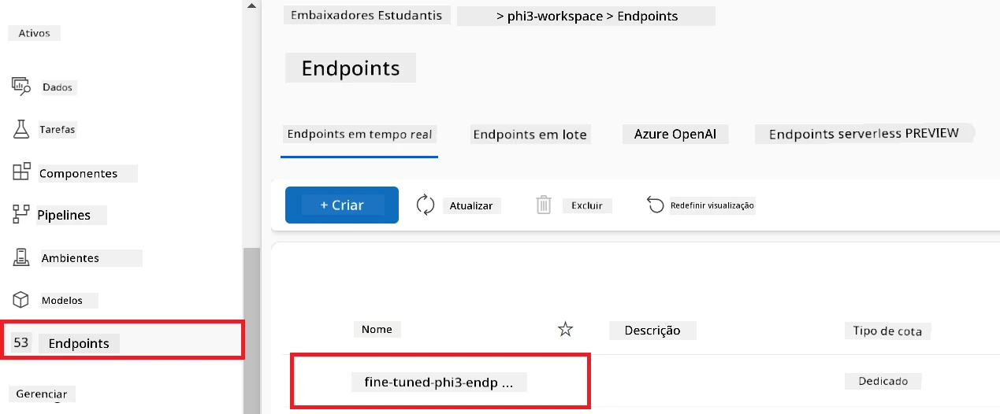

1. Nesta página, você pode gerenciar os endpoints durante o processo de implantação.

> [!NOTE]
> Uma vez que a implantação esteja concluída, assegure-se que **Tráfego ativo** esteja configurado para **100%**. Se não estiver, selecione **Atualizar tráfego** para ajustar as configurações. Note que você não pode testar o modelo se o tráfego estiver configurado para 0%.
>
> 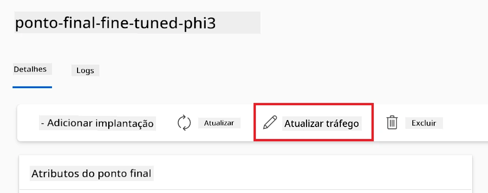
>

## Cenário 3: Integre com Prompt flow e converse com seu modelo customizado no Azure AI Foundry

### Integre o modelo Phi-3 customizado com Prompt Flow

Após implantar com sucesso seu modelo afinado, você pode agora integrá-lo com o Prompt Flow para usar seu modelo em aplicações em tempo real, possibilitando uma variedade de tarefas interativas com seu modelo Phi-3 customizado.

Neste exercício, você irá:

- Criar o Hub Azure AI Foundry.
- Criar o Projeto Azure AI Foundry.
- Criar Prompt Flow.
- Adicionar uma conexão customizada para o modelo Phi-3 afinado.
- Configurar o Prompt Flow para conversar com seu modelo Phi-3 customizado.

> [!NOTE]
> Você também pode integrar com Promptflow usando o Azure ML Studio. O mesmo processo de integração pode ser aplicado ao Azure ML Studio.

#### Crie o Hub Azure AI Foundry

Você precisa criar um Hub antes de criar o Projeto. Um Hub funciona como um Grupo de Recursos, permitindo organizar e gerenciar múltiplos Projetos dentro do Azure AI Foundry.

1. Visite [Azure AI Foundry](https://ai.azure.com/?WT.mc_id=aiml-137032-kinfeylo).

1. Selecione **Todos os hubs** na aba do lado esquerdo.

1. Selecione **+ Novo hub** no menu de navegação.
    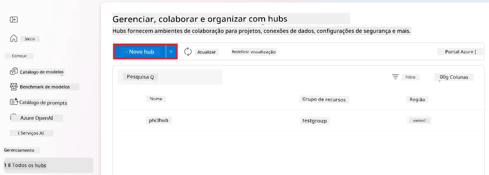

1. Execute as seguintes tarefas:

    - Insira o **Nome do Hub**. Deve ser um valor único.
    - Selecione sua **Assinatura** do Azure.
    - Selecione o **Grupo de recursos** a ser usado (crie um novo se necessário).
    - Selecione a **Localização** que deseja usar.
    - Selecione **Conectar serviços Azure AI** para usar (crie um novo se necessário).
    - Selecione **Conectar pesquisa Azure AI** para **Pular a conexão**.

    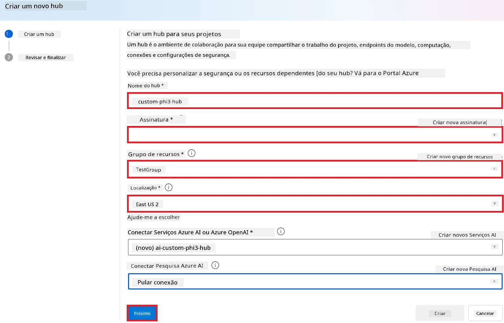

1. Selecione **Próximo**.

#### Criar projeto Azure AI Foundry

1. No Hub que você criou, selecione **Todos os projetos** na aba do lado esquerdo.

1. Selecione **+ Novo projeto** no menu de navegação.

    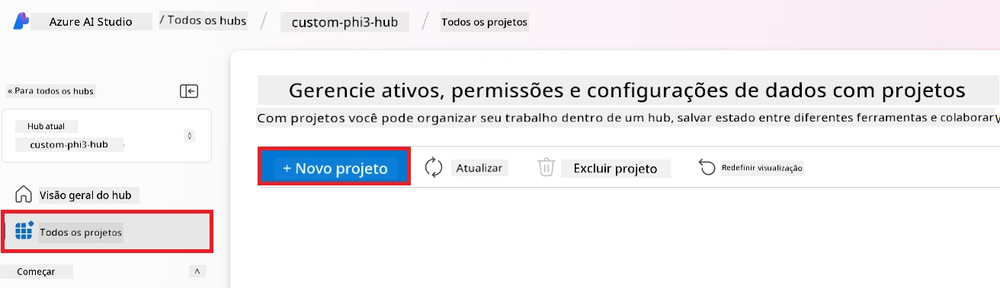

1. Insira o **Nome do projeto**. Deve ser um valor único.

    

1. Selecione **Criar um projeto**.

#### Adicionar uma conexão personalizada para o modelo Phi-3 ajustado

Para integrar seu modelo Phi-3 personalizado com o Prompt flow, você precisa salvar o endpoint e a chave do modelo em uma conexão personalizada. Essa configuração garante acesso ao seu modelo Phi-3 personalizado no Prompt flow.

#### Definir chave api e URI do endpoint do modelo Phi-3 ajustado

1. Visite [Azure ML Studio](https://ml.azure.com/home?WT.mc_id=aiml-137032-kinfeylo).

1. Navegue até o workspace de Machine Learning do Azure que você criou.

1. Selecione **Endpoints** na aba do lado esquerdo.

    

1. Selecione o endpoint que você criou.

    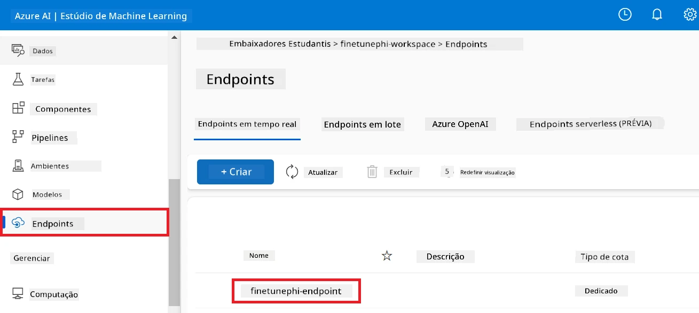

1. Selecione **Consumir** no menu de navegação.

1. Copie seu **endpoint REST** e a **Chave primária**.

    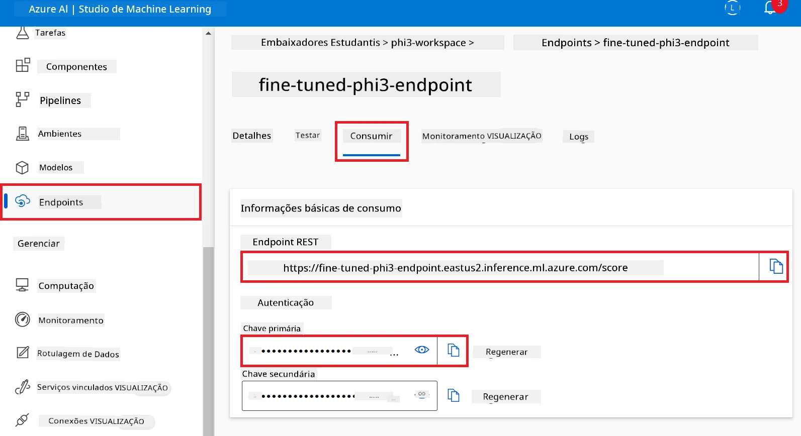

#### Adicionar a conexão personalizada

1. Visite [Azure AI Foundry](https://ai.azure.com/?WT.mc_id=aiml-137032-kinfeylo).

1. Navegue até o projeto Azure AI Foundry que você criou.

1. No projeto que você criou, selecione **Configurações** na aba do lado esquerdo.

1. Selecione **+ Nova conexão**.

    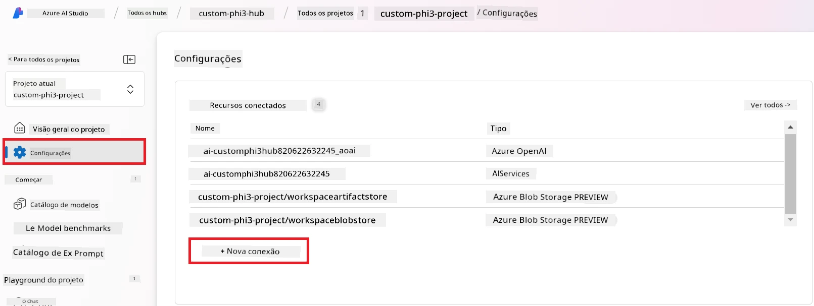

1. Selecione **Chaves personalizadas** no menu de navegação.

    

1. Execute as seguintes tarefas:

    - Selecione **+ Adicionar pares chave-valor**.
    - Para o nome da chave, insira **endpoint** e cole o endpoint copiado do Azure ML Studio no campo valor.
    - Selecione **+ Adicionar pares chave-valor** novamente.
    - Para o nome da chave, insira **key** e cole a chave copiada do Azure ML Studio no campo valor.
    - Após adicionar as chaves, selecione **é segredo** para evitar que a chave seja exposta.

    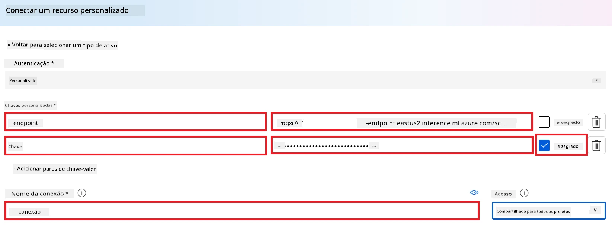

1. Selecione **Adicionar conexão**.

#### Criar Prompt flow

Você adicionou uma conexão personalizada no Azure AI Foundry. Agora, vamos criar um Prompt flow usando os passos a seguir. Depois, você conectará este Prompt flow à conexão personalizada para poder usar o modelo ajustado dentro do Prompt flow.

1. Navegue até o projeto Azure AI Foundry que você criou.

1. Selecione **Prompt flow** na aba do lado esquerdo.

1. Selecione **+ Criar** no menu de navegação.

    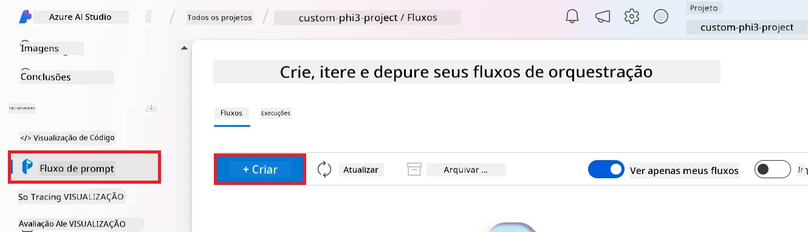

1. Selecione **Fluxo de chat** no menu de navegação.

    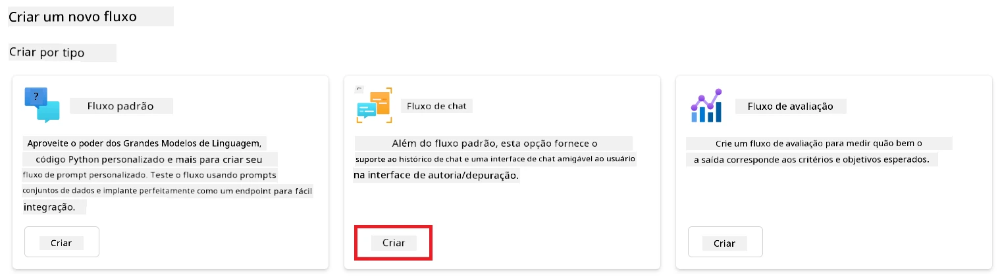

1. Insira o **Nome da pasta** para usar.

    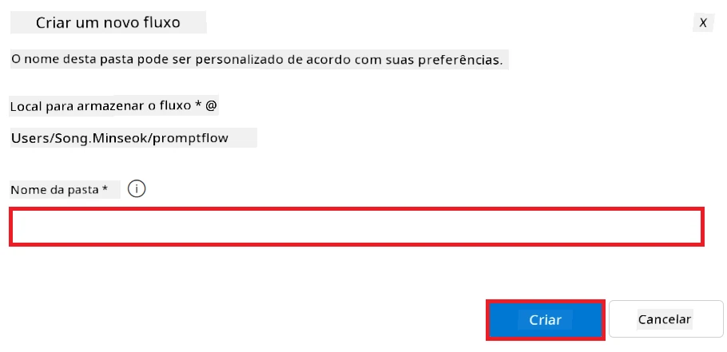

2. Selecione **Criar**.

#### Configurar Prompt flow para conversar com seu modelo Phi-3 personalizado

Você precisa integrar o modelo Phi-3 afinado em um Prompt flow. No entanto, o Prompt flow existente fornecido não foi projetado para esse propósito. Portanto, você deve redesenhar o Prompt flow para permitir a integração do modelo personalizado.

1. No Prompt flow, execute as seguintes tarefas para reconstruir o fluxo existente:

    - Selecione **Modo de arquivo bruto**.
    - Apague todo o código existente no arquivo *flow.dag.yml*.
    - Adicione o seguinte código ao arquivo *flow.dag.yml*.

        ```yml
        inputs:
          input_data:
            type: string
            default: "Who founded Microsoft?"

        outputs:
          answer:
            type: string
            reference: ${integrate_with_promptflow.output}

        nodes:
        - name: integrate_with_promptflow
          type: python
          source:
            type: code
            path: integrate_with_promptflow.py
          inputs:
            input_data: ${inputs.input_data}
        ```

    - Selecione **Salvar**.

    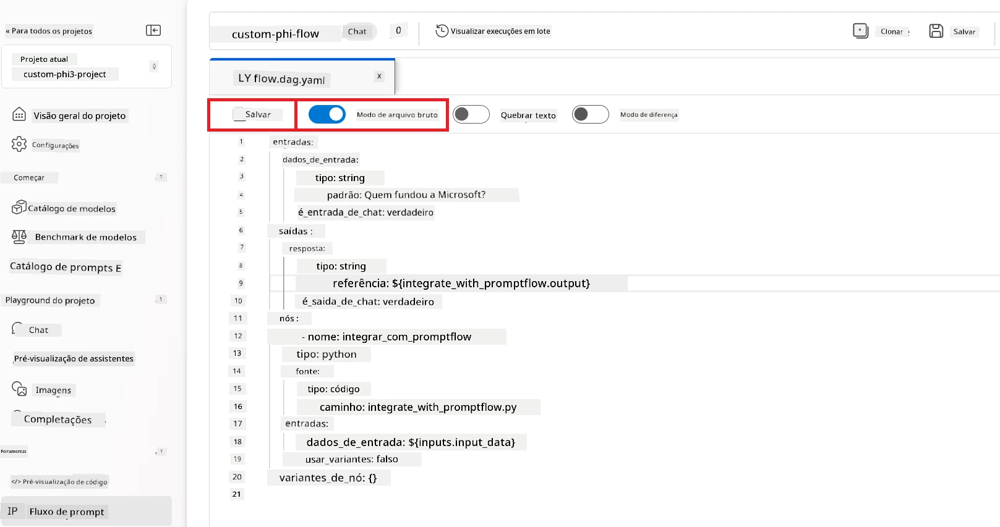

1. Adicione o seguinte código ao arquivo *integrate_with_promptflow.py* para usar o modelo Phi-3 personalizado no Prompt flow.

    ```python
    import logging
    import requests
    from promptflow import tool
    from promptflow.connections import CustomConnection

    # Configuração de registro
    logging.basicConfig(
        format="%(asctime)s - %(levelname)s - %(name)s - %(message)s",
        datefmt="%Y-%m-%d %H:%M:%S",
        level=logging.DEBUG
    )
    logger = logging.getLogger(__name__)

    def query_phi3_model(input_data: str, connection: CustomConnection) -> str:
        """
        Send a request to the Phi-3 model endpoint with the given input data using Custom Connection.
        """

        # "connection" é o nome da Conexão Personalizada, "endpoint", "key" são as chaves na Conexão Personalizada
        endpoint_url = connection.endpoint
        api_key = connection.key

        headers = {
            "Content-Type": "application/json",
            "Authorization": f"Bearer {api_key}"
        }
        data = {
            "input_data": {
                "input_string": [
                    {"role": "user", "content": input_data}
                ],
                "parameters": {
                    "temperature": 0.7,
                    "max_new_tokens": 128
                }
            }
        }
        try:
            response = requests.post(endpoint_url, json=data, headers=headers)
            response.raise_for_status()
            
            # Registrar a resposta JSON completa
            logger.debug(f"Full JSON response: {response.json()}")

            result = response.json()["output"]
            logger.info("Successfully received response from Azure ML Endpoint.")
            return result
        except requests.exceptions.RequestException as e:
            logger.error(f"Error querying Azure ML Endpoint: {e}")
            raise

    @tool
    def my_python_tool(input_data: str, connection: CustomConnection) -> str:
        """
        Tool function to process input data and query the Phi-3 model.
        """
        return query_phi3_model(input_data, connection)

    ```

    

> [!NOTE]
> Para informações mais detalhadas sobre o uso do Prompt flow no Azure AI Foundry, você pode consultar [Prompt flow no Azure AI Foundry](https://learn.microsoft.com/azure/ai-studio/how-to/prompt-flow).

1. Selecione **Entrada do chat**, **Saída do chat** para habilitar o chat com seu modelo.

    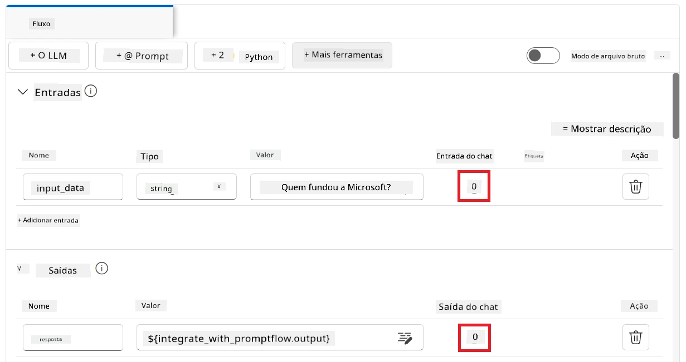

1. Agora você está pronto para conversar com seu modelo Phi-3 personalizado. No próximo exercício, você aprenderá como iniciar o Prompt flow e usá-lo para conversar com seu modelo Phi-3 afinado.

> [!NOTE]
>
> O fluxo reconstruído deve se parecer com a imagem abaixo:
>
> 
>

### Conversar com seu modelo Phi-3 personalizado

Agora que você afinou e integrou seu modelo Phi-3 personalizado com o Prompt flow, está pronto para começar a interagir com ele. Este exercício irá guiá-lo pelo processo de configuração e início de uma conversa com seu modelo usando o Prompt flow. Seguindos estes passos, você poderá utilizar completamente as capacidades do seu modelo Phi-3 afinado para diversas tarefas e conversas.

- Converse com seu modelo Phi-3 personalizado usando Prompt flow.

#### Iniciar Prompt flow

1. Selecione **Iniciar sessões de computação** para iniciar o Prompt flow.

    

1. Selecione **Validar e analisar entrada** para renovar os parâmetros.

    

1. Selecione o **Valor** da **conexão** para a conexão personalizada que você criou. Por exemplo, *connection*.

    

#### Conversar com seu modelo personalizado

1. Selecione **Chat**.

    

1. Aqui está um exemplo dos resultados: Agora você pode conversar com seu modelo Phi-3 personalizado. Recomenda-se fazer perguntas com base nos dados usados para o fine-tuning.

    

---

<!-- CO-OP TRANSLATOR DISCLAIMER START -->
**Aviso Legal**:  
Este documento foi traduzido utilizando o serviço de tradução por IA [Co-op Translator](https://github.com/Azure/co-op-translator). Embora nos esforcemos pela precisão, por favor, esteja ciente de que traduções automáticas podem conter erros ou imprecisões. O documento original em sua língua nativa deve ser considerado a fonte autorizada. Para informações críticas, recomenda-se tradução profissional realizada por humanos. Não nos responsabilizamos por quaisquer mal-entendidos ou interpretações incorretas decorrentes do uso desta tradução.
<!-- CO-OP TRANSLATOR DISCLAIMER END -->