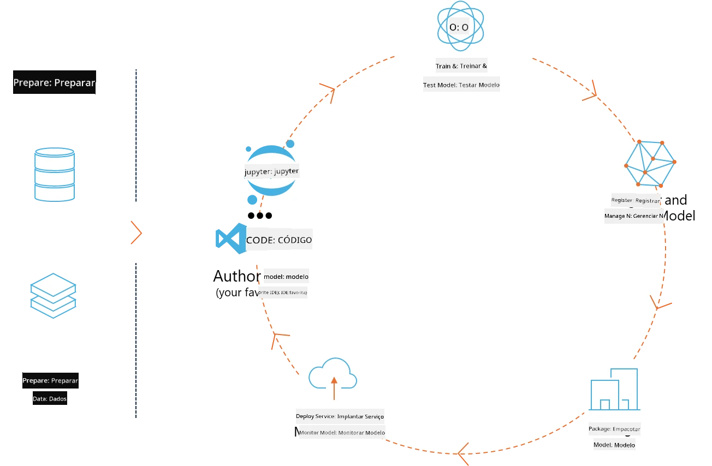
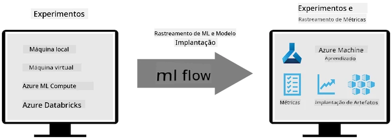
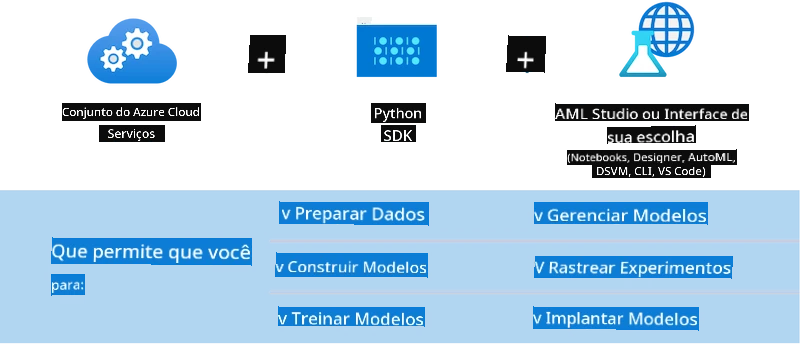

<!--
CO_OP_TRANSLATOR_METADATA:
{
  "original_hash": "f61c383bbf0c3dac97e43f833c258731",
  "translation_date": "2025-07-17T02:30:23+00:00",
  "source_file": "md/02.Application/01.TextAndChat/Phi3/E2E_Phi-3-MLflow.md",
  "language_code": "br"
}
-->
# MLflow

[MLflow](https://mlflow.org/) é uma plataforma open-source projetada para gerenciar o ciclo de vida completo de machine learning.



MLFlow é usado para gerenciar o ciclo de vida de ML, incluindo experimentação, reprodutibilidade, deployment e um registro central de modelos. Atualmente, o MLflow oferece quatro componentes.

- **MLflow Tracking:** Registrar e consultar experimentos, código, configuração de dados e resultados.
- **MLflow Projects:** Empacotar código de ciência de dados em um formato que permita reproduzir execuções em qualquer plataforma.
- **Mlflow Models:** Fazer deploy de modelos de machine learning em diversos ambientes de serving.
- **Model Registry:** Armazenar, anotar e gerenciar modelos em um repositório central.

Ele inclui funcionalidades para rastrear experimentos, empacotar código em execuções reproduzíveis, além de compartilhar e fazer deploy de modelos. O MLFlow está integrado ao Databricks e suporta várias bibliotecas de ML, sendo agnóstico em relação a bibliotecas. Pode ser usado com qualquer biblioteca de machine learning e em qualquer linguagem de programação, pois oferece uma API REST e CLI para maior conveniência.



Principais recursos do MLFlow incluem:

- **Rastreamento de Experimentos:** Registrar e comparar parâmetros e resultados.
- **Gerenciamento de Modelos:** Fazer deploy de modelos em diversas plataformas de serving e inferência.
- **Model Registry:** Gerenciar colaborativamente o ciclo de vida dos modelos MLflow, incluindo versionamento e anotações.
- **Projects:** Empacotar código de ML para compartilhamento ou uso em produção.

O MLFlow também suporta o ciclo de MLOps, que inclui preparar dados, registrar e gerenciar modelos, empacotar modelos para execução, fazer deploy de serviços e monitorar modelos. O objetivo é simplificar o processo de transição de um protótipo para um fluxo de trabalho de produção, especialmente em ambientes de nuvem e edge.

## Cenário E2E - Construindo um wrapper e usando Phi-3 como modelo MLFlow

Neste exemplo E2E, vamos demonstrar duas abordagens diferentes para construir um wrapper em torno do modelo de linguagem pequena Phi-3 (SLM) e depois executá-lo como um modelo MLFlow, seja localmente ou na nuvem, por exemplo, no workspace do Azure Machine Learning.



| Projeto | Descrição | Localização |
| ------------ | ----------- | -------- |
| Transformer Pipeline | Transformer Pipeline é a opção mais simples para construir um wrapper se você quiser usar um modelo HuggingFace com o flavour experimental de transformers do MLFlow. | [**TransformerPipeline.ipynb**](../../../../../../code/06.E2E/E2E_Phi-3-MLflow_TransformerPipeline.ipynb) |
| Custom Python Wrapper | No momento da escrita, o transformer pipeline não suportava a geração de wrapper MLFlow para modelos HuggingFace em formato ONNX, mesmo com o pacote experimental optimum Python. Para casos como este, você pode construir seu próprio wrapper Python customizado para o modo MLFlow. | [**CustomPythonWrapper.ipynb**](../../../../../../code/06.E2E/E2E_Phi-3-MLflow_CustomPythonWrapper.ipynb) |

## Projeto: Transformer Pipeline

1. Você precisará dos pacotes Python relevantes do MLFlow e HuggingFace:

    ``` Python
    import mlflow
    import transformers
    ```

2. Em seguida, você deve iniciar um pipeline transformer referenciando o modelo Phi-3 alvo no registro HuggingFace. Como pode ser visto no card do modelo _Phi-3-mini-4k-instruct_, sua tarefa é do tipo “Geração de Texto”:

    ``` Python
    pipeline = transformers.pipeline(
        task = "text-generation",
        model = "microsoft/Phi-3-mini-4k-instruct"
    )
    ```

3. Agora você pode salvar o pipeline transformer do seu modelo Phi-3 no formato MLFlow e fornecer detalhes adicionais, como o caminho dos artefatos, configurações específicas do modelo e tipo de API de inferência:

    ``` Python
    model_info = mlflow.transformers.log_model(
        transformers_model = pipeline,
        artifact_path = "phi3-mlflow-model",
        model_config = model_config,
        task = "llm/v1/chat"
    )
    ```

## Projeto: Custom Python Wrapper

1. Podemos utilizar aqui a [API generate() do ONNX Runtime](https://github.com/microsoft/onnxruntime-genai) da Microsoft para inferência do modelo ONNX e codificação/decodificação de tokens. Você deve escolher o pacote _onnxruntime_genai_ para seu ambiente de computação alvo, com o exemplo abaixo direcionado para CPU:

    ``` Python
    import mlflow
    from mlflow.models import infer_signature
    import onnxruntime_genai as og
    ```

1. Nossa classe customizada implementa dois métodos: _load_context()_ para inicializar o **modelo ONNX** do Phi-3 Mini 4K Instruct, os **parâmetros do gerador** e o **tokenizer**; e _predict()_ para gerar tokens de saída para o prompt fornecido:

    ``` Python
    class Phi3Model(mlflow.pyfunc.PythonModel):
        def load_context(self, context):
            # Retrieving model from the artifacts
            model_path = context.artifacts["phi3-mini-onnx"]
            model_options = {
                 "max_length": 300,
                 "temperature": 0.2,         
            }
        
            # Defining the model
            self.phi3_model = og.Model(model_path)
            self.params = og.GeneratorParams(self.phi3_model)
            self.params.set_search_options(**model_options)
            
            # Defining the tokenizer
            self.tokenizer = og.Tokenizer(self.phi3_model)
    
        def predict(self, context, model_input):
            # Retrieving prompt from the input
            prompt = model_input["prompt"][0]
            self.params.input_ids = self.tokenizer.encode(prompt)
    
            # Generating the model's response
            response = self.phi3_model.generate(self.params)
    
            return self.tokenizer.decode(response[0][len(self.params.input_ids):])
    ```

1. Agora você pode usar a função _mlflow.pyfunc.log_model()_ para gerar um wrapper Python customizado (em formato pickle) para o modelo Phi-3, junto com o modelo ONNX original e as dependências necessárias:

    ``` Python
    model_info = mlflow.pyfunc.log_model(
        artifact_path = artifact_path,
        python_model = Phi3Model(),
        artifacts = {
            "phi3-mini-onnx": "cpu_and_mobile/cpu-int4-rtn-block-32-acc-level-4",
        },
        input_example = input_example,
        signature = infer_signature(input_example, ["Run"]),
        extra_pip_requirements = ["torch", "onnxruntime_genai", "numpy"],
    )
    ```

## Assinaturas dos modelos MLFlow gerados

1. No passo 3 do projeto Transformer Pipeline acima, definimos a tarefa do modelo MLFlow como “_llm/v1/chat_”. Essa instrução gera um wrapper de API para o modelo, compatível com a API de Chat da OpenAI, como mostrado abaixo:

    ``` Python
    {inputs: 
      ['messages': Array({content: string (required), name: string (optional), role: string (required)}) (required), 'temperature': double (optional), 'max_tokens': long (optional), 'stop': Array(string) (optional), 'n': long (optional), 'stream': boolean (optional)],
    outputs: 
      ['id': string (required), 'object': string (required), 'created': long (required), 'model': string (required), 'choices': Array({finish_reason: string (required), index: long (required), message: {content: string (required), name: string (optional), role: string (required)} (required)}) (required), 'usage': {completion_tokens: long (required), prompt_tokens: long (required), total_tokens: long (required)} (required)],
    params: 
      None}
    ```

1. Como resultado, você pode enviar seu prompt no seguinte formato:

    ``` Python
    messages = [{"role": "user", "content": "What is the capital of Spain?"}]
    ```

1. Depois, use o pós-processamento compatível com a API OpenAI, por exemplo, _response[0][‘choices’][0][‘message’][‘content’]_, para deixar sua saída mais apresentável, como neste exemplo:

    ``` JSON
    Question: What is the capital of Spain?
    
    Answer: The capital of Spain is Madrid. It is the largest city in Spain and serves as the political, economic, and cultural center of the country. Madrid is located in the center of the Iberian Peninsula and is known for its rich history, art, and architecture, including the Royal Palace, the Prado Museum, and the Plaza Mayor.
    
    Usage: {'prompt_tokens': 11, 'completion_tokens': 73, 'total_tokens': 84}
    ```

1. No passo 3 do projeto Custom Python Wrapper acima, permitimos que o pacote MLFlow gere a assinatura do modelo a partir de um exemplo de entrada fornecido. A assinatura do nosso wrapper MLFlow ficará assim:

    ``` Python
    {inputs: 
      ['prompt': string (required)],
    outputs: 
      [string (required)],
    params: 
      None}
    ```

1. Portanto, nosso prompt precisará conter a chave do dicionário "prompt", semelhante a isto:

    ``` Python
    {"prompt": "<|system|>You are a stand-up comedian.<|end|><|user|>Tell me a joke about atom<|end|><|assistant|>",}
    ```

1. A saída do modelo será então fornecida em formato string:

    ``` JSON
    Alright, here's a little atom-related joke for you!
    
    Why don't electrons ever play hide and seek with protons?
    
    Because good luck finding them when they're always "sharing" their electrons!
    
    Remember, this is all in good fun, and we're just having a little atomic-level humor!
    ```

**Aviso Legal**:  
Este documento foi traduzido utilizando o serviço de tradução por IA [Co-op Translator](https://github.com/Azure/co-op-translator). Embora nos esforcemos para garantir a precisão, esteja ciente de que traduções automáticas podem conter erros ou imprecisões. O documento original em seu idioma nativo deve ser considerado a fonte autorizada. Para informações críticas, recomenda-se tradução profissional humana. Não nos responsabilizamos por quaisquer mal-entendidos ou interpretações incorretas decorrentes do uso desta tradução.